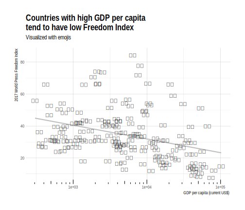

```{r setup, include=FALSE}
library(knitr)
opts_chunk$set(
  echo = TRUE, 
  cache = TRUE,
  collapse = TRUE,
  fig.width = 7, 
  fig.align = 'center',
  fig.asp = 0.618, # 1 / phi
  out.width = "700px")
knit_hooks$set(optipng = hook_optipng)
opts_chunk$set("optipng" = "-o5")
```

*This code have been lightly revised to make sure it works as of 2018-12-16.*  

With [Reporters Without Borders](https://rsf.org/en) coming out with its [2017 World Press Freedom Index](https://rsf.org/en/ranking/2017) in the same week as Hadley Wickham coming out with the [emo(ji)](https://github.com/hadley/emo) package, I had no choice but to explore both of them at the same time.  

Disclaimer! This post is not an exercise in statistical inference but rather a proof of concept of how to use the emo(ji) package with ggplot2.   

### Loading packages

```{r, message=FALSE}
library(hrbrthemes)
library(tidyverse)
library(stringr)
library(tibble)
# remotes::install_github('hadley/emo')
library(emo)
```

The [hrbrthemes](https://github.com/hrbrmstr/hrbrthemes) is not necessary for this project but it is one of my personal favorite ggplot2 themes.  

### Gathering data

Here we collect the data from Reporters Without Borders, emoji flags and The World Bank (so we have something to plot against).  

#### 2017 World Press Freedom Index

We have the [2017 World Press Freedom Index](https://rsf.org/en/ranking/2017) [(direct download link)](https://rsf.org/sites/default/files/index_format_upload_2017-v2_1_0.csv) data which we load in as normal.  

```{r, message=FALSE}
(freedom_index <- read_csv("https://rsf.org/sites/default/files/index_format_upload_2017-v2_1_0.csv"))
```

and we see that a total of 180 countries have a score (Overall Score 2016).  

#### GDP per capita

To have something somehow meaningful to compare the freedom index to. I've found some data about GDP per capita, mostly because I figured it would have data for quite a lot of the countries covered by the freedom index. So from [The World Bank](http://data.worldbank.org/indicator/NY.GDP.PCAP.CD) [(direct download link)](http://api.worldbank.org/v2/en/indicator/NY.GDP.PCAP.CD?downloadformat=csv)
which we load in as normal.  

```{r, message=FALSE, warning=FALSE, include=FALSE}
(gdp_pcap <- read_csv("~/Github/blog/static/data/API_NY.GDP.PCAP.CD_DS2_en_csv_v2.csv", skip = 3))
```

```{r, message=FALSE, warning=FALSE, eval=FALSE}
(gdp_pcap <- read_csv("API_NY.GDP.PCAP.CD_DS2_en_csv_v2.csv", skip = 2))
```

which have quite a few variables but for now we will just focus on the 2015 variable as the 2016 appears empty. Now that we have two data sets which we would like to combine, a general question would be if the gdp_pcap data have information matching our 180 countries. So with the following bit of code we join the two datasets together by the ICO ALPHA-3 Code available in both datasets and select the countries who don't have a value for the year 2015.  

```{r}
left_join(freedom_index, gdp_pcap, by = c("ISO" = "Country Code")) %>% 
  filter(is.na(`2015`)) %>% 
  select(EN_country)
```

which leaves us with 166 countries. I could have looked for the data for these countries, but that is outside the reach for this post.  

#### Flag emoji

I would like to use the different flag emojis

```{r, echo=FALSE}
keywords <- emo::ji_keyword
emojis <- purrr::map_chr(keywords["flag"], function(x) paste0(emo::ji_name[x], collapse = ""))
cat(paste(emojis, collapse = "\n"))
```

which all can be found with the new emo(ji) package

```{r}
emo::ji_find("flag")
```

we first notice that the first two emojis are not country flags, and that the name of the countries are not on same format as what we have from earlier, so we replace the underscores with spaces and translate everything to lowercase before joining. This time by country name. Again we check for missed joints.  

```{r}
left_join(freedom_index, gdp_pcap, by = c("ISO" = "Country Code")) %>% 
  mutate(EN_country = tolower(EN_country)) %>% 
  left_join(emo::ji_find("flag") %>% 
              mutate(name = str_replace_all(name, "_", " ")) %>% 
              filter(name != "japan", name != "crossed flags"), 
            by = c("EN_country" = "name"))  %>% 
  filter(!is.na(`2015`)) %>% 
  filter(is.na(emoji)) %>% 
  select(EN_country)
```

Which is quite a few. It turns out that the naming convention for the emoji names have not been that consistent, "de" used instead of "germany" etc. To clear up code later on we make a new emoji tibble with all the changes.  

```{r}
newemoji <- emo::ji_find("flag") %>% 
              mutate(name = str_replace_all(string = name,
                                            pattern = "_",
                                            replacement =  " ")) %>% 
  filter(name != "japan", name != "crossed flags") %>% 
  mutate(name = str_replace(name, "^de$", "germany"),
         name = str_replace(name, "^es$", "spain"),
         name = str_replace(name, "^trinidad tobago$", "trinidad and tobago"),
         name = str_replace(name, "^fr$", "france"),
         name = str_replace(name, "^uk$", "united kingdom"),
         name = str_replace(name, "^us$", "united states"),
         name = str_replace(name, "^it$", "italy"),
         name = str_replace(name, "^kr$", "south korea"),
         name = str_replace(name, "^bosnia herzegovina$", "bosnia and herzegovina"),
         name = str_replace(name, "^guinea bissau$", "guinea-bissau"),
         name = str_replace(name, "^cote divoire$", "ivory coast"),
         name = str_replace(name, "^timor leste$", "east timor"),
         name = str_replace(name, "^congo brazzaville$", "congo"),
         name = str_replace(name, "^palestinian territories$", "palestine"),
         name = str_replace(name, "^ru$", "russian federation"),
         name = str_replace(name, "^congo kinshasa$", "the democratic republic of the congo"),
         name = str_replace(name, "^tr$", "turkey"),
         name = str_replace(name, "^brunei$", "brunei darussalam"),
         name = str_replace(name, "^laos$", "lao people's democratic republic"),
         name = str_replace(name, "^cn$", "china"),
         name = str_replace(name, "^jp$", "japan"))
newemoji
```

### Plotting it all with ggplot2

Now with all the preparation done we do a naive first plot. 

```{r}
left_join(freedom_index, gdp_pcap, by = c("ISO" = "Country Code")) %>% 
  mutate(EN_country = tolower(EN_country)) %>% 
  left_join(newemoji, by = c("EN_country" = "name")) %>% 
  ggplot(aes(x = `2015`, y = `Overall Score 2016`)) +
  geom_text(aes(label = emoji))
```

But wait, we have a couple of problems:

- The emojis don't show up. 
- The freedom score is 100 times to much as the actual.
- The gdp_pcap is quite skewed.  

But these are not problems too great for us. It turns out that R's graphical devices don't support AppleColorEmoji font. We can alleviate the that problem by saving the plot as a svg file. And we will do a simple log transformation of the gdp_pcap.  

Our final plot is thus the following:

```{r, warning=FALSE, message=FALSE, eval=FALSE}
left_join(freedom_index, gdp_pcap, by = c("ISO" = "Country Code")) %>% 
  mutate(EN_country = tolower(EN_country),
         `Overall Score 2016` = `Overall Score 2016` / 100) %>% 
  left_join(newemoji, by = c("EN_country" = "name")) %>% 
  ggplot(aes(x = `2015`, y = `Overall Score 2016`)) +
  stat_smooth(method = "lm", color = "grey", se = FALSE) +
  geom_text(aes(label = emoji)) +
  scale_x_log10() +
  annotation_logticks(sides = "b")  +
  theme_ipsum() +
  labs(x = "GDP per capita (current US$)", y = "2017 World Press Freedom Index",
       title = "Countries with high GDP per capita\ntend to have low Freedom Index",
       subtitle = "Visualized with emojis")
```

```{r echo=FALSE, fig.align='center'}

```

```{r details, echo=FALSE}
library(details) 

sessioninfo::session_info() %>%
  details::details(summary = 'session information')
```
