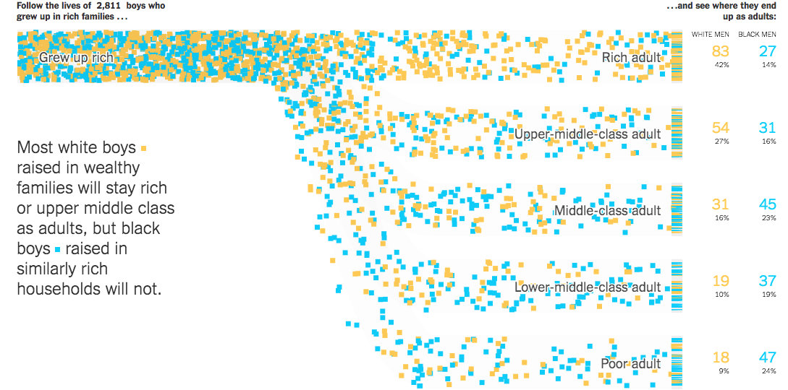
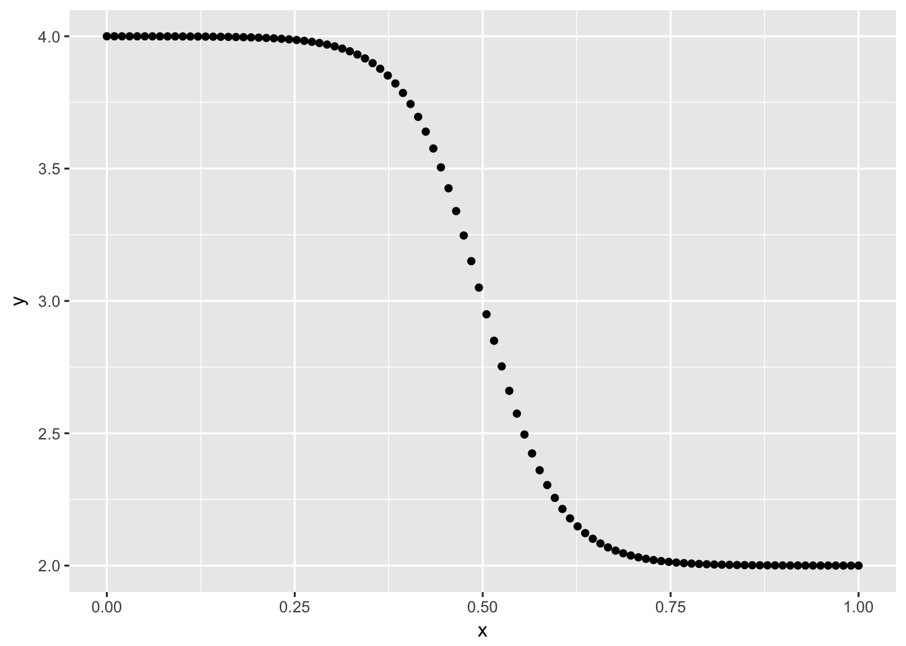

```{r setup, include=FALSE}
library(knitr)
opts_chunk$set(
  echo = TRUE, 
  cache = TRUE,
  collapse = TRUE,
  fig.width = 7, 
  fig.align = 'center',
  fig.asp = 0.618, # 1 / phi
  out.width = "700px")
knit_hooks$set(optipng = hook_optipng)
opts_chunk$set("optipng" = "-o5")
```

**This blogpost uses the old api for gganimate and will not work with current version. No update of this blogpost is planned for this moment.**

Hello again! I this mini-series (of in-determined length) will I try as best as I can to recreate great visualizations in tidyverse. The recreation may be exact in terms of data, or using data of a similar style. 

## The goal - A flowing sankey chart from nytimes

In this excellent article [Extensive Data Shows Punishing
Reach of Racism for Black Boys](  
https://www.nytimes.com/interactive/2018/03/19/upshot/race-class-white-and-black-men.html) by NYTimes includes a lot of very nice charts, both in motion and still. The chart that got biggest reception is the following:

```{r echo=FALSE, out.width='100%'}

```

(see article for moving picture) We see a animated flow chart that follow the style of the classical Sankey chart. This chart will be the goal in this blog post, with 2 changes for brevity. firstly will I use randomly simulated data for my visualization and secondly will I not include the counters on the right-hand side of the chart and only show the creation of the counter on the left-hand as they are created in much the same fashion. 

## R packages

First we need some packages, but very few of those. Simply using `tidyverse` and `gganimate` for animation.

```{r, message=FALSE, eval=FALSE}
library(tidyverse)
library(gganimate)
```

## Single point

We will start with animating a single point first. The path of each point closely resembles a sigmoid curve. I have used those in past visualizations, namely [Visualizing trigrams with the Tidyverse ](https://www.hvitfeldt.me/2018/01/visualizing-trigrams-with-the-tidyverse/). 

and we steal the function I created in that post

```{r, eval=FALSE}
sigmoid <- function(x_from, x_to, y_from, y_to, scale = 5, n = 100) {
  x <- seq(-scale, scale, length = n)
  y <- exp(x) / (exp(x) + 1)
  tibble(x = (x + scale) / (scale * 2) * (x_to - x_from) + x_from,
         y = y * (y_to - y_from) + y_from)
}
```

And to get along with that we will have out data

```{r, eval=FALSE}
n_points <- 400
data <- tibble(from = rep(4, n_points),
               to = sample(1:4, n_points, TRUE),
               color = sample(c("A", "B"), n_points, TRUE)) 
```

here the data is fairly clean and tidy, with numerical values for `from` and `to` but this endpoint should be able to be achieved in most any other appropriate type of data.  

To simulate the path of a single data point we will use the custom `sigmoid` on the data for a single row. This gives us this smooth curve of points that resembles the path taken by the points in the original visualization.

```{r, eval=FALSE}
sigmoid(0, 1, as.numeric(data[2, 1]), as.numeric(data[2, 2]), 
        n = 100, scale = 10) %>%
  ggplot(aes(x, y)) +
  geom_point()
```

```{r echo=FALSE, fig.align='center'}

```

To set this in motion we will employ `gganimate`, for this we will add a `time` column to act as the frame.

```{r, fig.show='animate', ffmpeg.format='gif', dev='jpeg', interval = 0.1, eval=FALSE}
p <- sigmoid(0, 1, as.numeric(data[2, 1]), as.numeric(data[2, 2]),
             n = 100, scale = 10) %>%
  mutate(time = row_number()) %>%
  ggplot(aes(x, y, frame = time)) +
  geom_point()

gganimate(p)
```

```{r echo=FALSE, fig.align='center'}
knitr::include_graphics("02-old.gif")
```

Which looks very nice so far. Next step is to have multiple points flowing towards different locations.

## multiple points

To account for the multiple points we will wrap everything from last section inside a `map_df` to iterate over the rows. To avoid over plotting we introduce some uniform noise to each point. 

```{r, fig.show='animate', ffmpeg.format='gif', dev='jpeg', interval = 0.1, eval=FALSE}
p <- map_df(seq_len(nrow(data)), 
    ~ sigmoid(0, 1, as.numeric(data[.x, 1]), as.numeric(data[.x, 2])) %>%
      mutate(time = row_number() + .x,
             y = y + runif(1, -0.25, 0.25))) %>%
  ggplot(aes(x, y, frame = time)) +
  geom_point() 

gganimate(p)
```

```{r echo=FALSE, fig.align='center'}
knitr::include_graphics("03-old.gif")
```

Everything looks good so far, however the points all look the same, so we will do a little bit of beautification now rather then later. In addition to that will we save the data for the different components in different objects.  

the following `point_data` have the modification with `bind_cols` that binds the information from the `data` data.frame to the final object. We include the color and removing all themes and guides.

```{r, fig.show='animate', ffmpeg.format='gif', dev='jpeg', interval = 0.1, eval=FALSE}
point_data <- map_df(seq_len(nrow(data)), 
    ~ sigmoid(0, 1, as.numeric(data[.x, 1]), as.numeric(data[.x, 2])) %>%
      mutate(time = row_number() + .x,
             y = y + runif(1, -0.25, 0.25),
             id = .x) %>%
      bind_cols(bind_rows(replicate(100, data[.x, -(1:2)], simplify = FALSE))))

p <- ggplot(point_data, aes(x, y, color = color, frame = time)) +
  geom_point(shape = 15) +
  theme_void() +
  guides(color = "none")

gganimate(p, title_frame = FALSE)
```

```{r echo=FALSE, fig.align='center'}
knitr::include_graphics("04-old.gif")
```

Which already looks way better. Next up to include animated counter on the left hand side that indicates how many points that have been introduced in the animation. This is simply done by counting how many have started their paths and afterwards padding to fill the length of the animation.  

```{r, eval=FALSE}
start_data_no_end <- point_data %>%
  group_by(id) %>%
  summarize(time = min(time)) %>%
  count(time) %>%
  arrange(time) %>%
  mutate(n = cumsum(n),
         x = 0.125, 
         y = 2,
         n = str_c("Follow the lives of ", n, " squares"))
  


# duplicating last number to fill gif
start_data <- start_data_no_end %>%
  bind_rows(
    map_df(unique(point_data$time[point_data$time > max(start_data_no_end$time)]),
          ~ slice(start_data_no_end, nrow(start_data_no_end)) %>%
              mutate(time = .x))
  )
```

This is added to our plot by the use of `geom_text` with a new data argument. We did some `stringr` magic to have a little annotation appear instead of the number itself. Important to have the `hjust = 0` such that the annotation doesn't move around too much. 

```{r, message=FALSE, warning=FALSE, fig.show='animate', ffmpeg.format='gif', dev='jpeg', interval = 0.1, eval=FALSE}
p <- ggplot(point_data, aes(x, y, color = color, frame = time)) +
  geom_point(shape = 15) +
  geom_text(data = start_data, hjust = 0,
            aes(label = n, frame = time, x = x, y = y), color = "black") +
  theme_void() +
  guides(color = "none")

gganimate(p, title_frame = FALSE)
```

```{r echo=FALSE, fig.align='center'}
knitr::include_graphics("05-old.gif")
```

## Ending boxes

Like the original illustration there are some boxes where the points "land" in. these are very easily replicated. This will be done a little more programmatic such that it adapts to multiple outputs. 

```{r, eval=FALSE}
ending_box <- data %>%
  pull(to) %>%
  unique() %>%
  map_df(~ data.frame(x = c(1.01, 1.01, 1.1, 1.1, 1.01),
                      y = c(-0.3, 0.3, 0.3, -0.3, -0.3) + .x,
                      id = .x))
```

We will add this in the same way as before, this time we will use `geom_path` to draw the box and `frame = min(point_data$time)` and `cumulative = TRUE` to have the boxes appear at the first frame and stay there forever. 

```{r, message=FALSE, warning=FALSE, fig.show='animate', ffmpeg.format='gif', dev='jpeg', interval = 0.1, eval=FALSE}
p <- ggplot(point_data, aes(x, y, color = color, frame = time)) +
  geom_point() +
  geom_text(data = start_data, 
            aes(label = n, frame = time, x = x, y = y), color = "black") +
  geom_path(data = ending_box,
            aes(x, y, group = id, frame = min(point_data$time),
                cumulative = TRUE), color = "grey70") +
  theme_void() +
  coord_cartesian(xlim = c(-0.05, 1.15)) +
  guides(color = "none")

gganimate(p, title_frame = FALSE)
```

```{r echo=FALSE, fig.align='center'}
knitr::include_graphics("06-old.gif")
```

## Filling the box

Lastly do we want to fill the boxes as the points approach them. This is done by first figuring out when they appear at the end of their paths, and them drawing boxes at those points, this is done by the `end_points` and `end_lines` respectively.  

```{r, eval=FALSE}
end_points <- point_data %>% 
  group_by(id) %>%
  filter(time == max(time)) %>%
  ungroup()

end_lines <- map_df(end_points$id,
    ~ data.frame(x = c(1.01, 1.01, 1.1, 1.1, 1.01),
                 y = c(-0.01, 0.01, 0.01, -0.01, -0.01) + as.numeric(end_points[.x, 2]),
                 id = .x) %>%
      bind_cols(bind_rows(replicate(5, end_points[.x, -(1:2)], simplify = FALSE)))
    )
```

Like before we add the data in a new `geom_`, with `cumulative = TRUE` to let the "points" stay.

```{r, message=FALSE, warning=FALSE, fig.show='animate', ffmpeg.format='gif', dev='jpeg', interval = 0.1, eval=FALSE}
p <- ggplot(point_data, aes(x, y, color = color, frame = time)) +
  geom_point() +
  geom_text(data = start_data, 
            aes(label = n, frame = time, x = x, y = y), color = "black") +
  geom_path(data = ending_box,
            aes(x, y, group = id, frame = min(point_data$time),
                cumulative = TRUE), color = "grey70") +
  geom_polygon(data = end_lines,
               aes(x, y, fill = color, frame = time, group = id,
                   cumulative = TRUE, color = color)) +
  theme_void() +
  coord_cartesian(xlim = c(-0.05, 1.15)) +
  guides(color = "none",
         fill = "none")

gganimate(p, title_frame = FALSE)
```

```{r echo=FALSE, fig.align='center'}
knitr::include_graphics("07-old.gif")
```

And this is what I have for you for now. Counters on the right hand side could be done in much the same way as we have seen here, but wouldn't add much value to showcase that here.

```{r details, echo=FALSE}
library(details) 

sessioninfo::session_info() %>%
  details::details(summary = 'session information')
```
