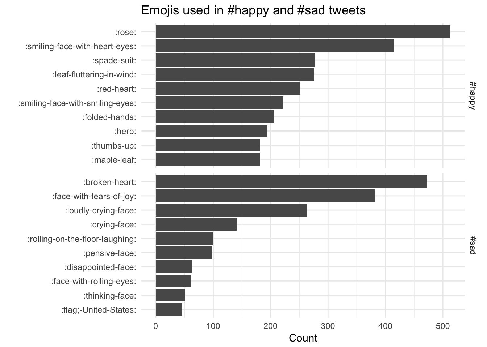

```{r setup, include=FALSE}
library(knitr)
opts_chunk$set(
  echo = TRUE, 
  cache = TRUE,
  collapse = TRUE,
  fig.width = 7, 
  fig.align = 'center',
  fig.asp = 0.618, # 1 / phi
  out.width = "700px")
knit_hooks$set(optipng = hook_optipng)
opts_chunk$set("optipng" = "-o5")
```

*This code have been lightly revised to make sure it works as of 2018-12-16.*  

This post will be a short demonstration on how the the occurrence of emojis on twitter can be analysed using tidytools. We start of loading the necessary packages.

```{r, message=FALSE}
library(tidyverse)
library(tidytext)
library(rtweet)
```

I have decided that for this example that I would focus on tweets that include the hash tags #happy and #sad in the hope that both would include a similar number of emojis but hopefully of different groups. We will use the `rtweet` package which already conforms to the tidy principles. Notice the `retryonratelimit = TRUE` argument as the combined number of tweets (10000 + 10000 = 20000) is larger the the 15 min limit of 18000.
 
```{r, eval=FALSE}
tweets_happy <- search_tweets("#happy", n = 10000, include_rts = FALSE)
tweets_sad <- search_tweets("#sad", n = 10000, include_rts = FALSE, 
                            retryonratelimit = TRUE)
```

As a safety will we save these tweets. 

```{r, eval=FALSE}
write_as_csv(tweets_happy, "tweets_happy.csv")
write_as_csv(tweets_sad, "tweets_sad.csv")
```

Now we load this data.frame that contains information regarding the various emojis.

```{r, eval=FALSE}
emoji <- readr::read_csv("https://raw.githubusercontent.com/EmilHvitfeldt/Emoji-table/master/emoji.csv")
```

```{r include=FALSE, eval=FALSE}
emoji <- readr::read_csv("~/Github/blog/static/data/emoji.csv")
tweets_happy <- readr::read_csv("~/Github/blog/static/data/tweets_happy.csv")
tweets_sad <- readr::read_csv("~/Github/blog/static/data/tweets_sad.csv")
```

Next we add the hash tag label as the `emotion` variable, next we tokenize all the tweets according to characters (this is done since a lot of the tweets didn't use spaces emojis rendering them hard to detect.) and left join with the `emoji` data.frame such that we get the descriptions.

```{r, eval=FALSE}
tweets_all <- bind_rows(
  tweets_happy %>% mutate(emotion = "#happy"),
  tweets_sad %>% mutate(emotion = "#sad")
)

emoji_all <- unnest_tokens(tweets_all, word, text, 
                           token = "characters") %>%
  select(word, emotion) %>%
  left_join(emoji, by = c("word" = "utf")) %>%
  filter(!is.na(shortname))
```

Lastly we create a simple faceted bar chart of the number of emojis used within each hash tag.

```{r, eval=FALSE}
emoji_all %>%
  count(word, emotion, shortname) %>%
  group_by(emotion) %>%
  arrange(desc(n)) %>%
  top_n(10, n) %>%
  ungroup() %>%
  mutate(emoji = reorder(shortname, n)) %>%
  ggplot(aes(emoji, n)) +
  geom_col() +
  facet_grid(emotion ~ ., scales = "free_y") +
  coord_flip() +
  theme_minimal() +
  labs(title = "Emojis used in #happy and #sad tweets",
       y = "Count", x = "")
```

```{r echo=FALSE, fig.align='center'}

```

Using the `emoji` data.frame allows us to gain quick insight with the descriptive short names.

```{r details, echo=FALSE}
library(details) 

sessioninfo::session_info() %>%
  details::details(summary = 'session information')
```
