```{r setup, include=FALSE}
library(knitr)
opts_chunk$set(
  echo = TRUE, 
  cache = TRUE,
  collapse = TRUE,
  fig.width = 7, 
  fig.align = 'center',
  fig.asp = 0.618, # 1 / phi
  out.width = "700px")
knit_hooks$set(optipng = hook_optipng)
opts_chunk$set("optipng" = "-o5")
```

:::note
This code have been lightly revised to make sure it works as of 2018-12-20.
:::

There have been a lot of progress in the aid of package development in R in recent times. The classic blogpost by Hilary Parker [Writing an R Package From Scratch](https://hilaryparker.com/2014/04/29/writing-an-r-package-from-scratch/) and its younger sister [Writing an R package from scratch](https://r-mageddon.netlify.com/post/writing-an-r-package-from-scratch/) by Tomas Westlake are both great sources of information to create a package. Fo more general documentation on package development you would be right to look at Hadley Wickhams book [R packages](http://r-pkgs.had.co.nz/). The **devtools** package have always been instrumental for good package development, but some of these features and additional ones are now to be found in the [usethis](https://github.com/r-lib/usethis) package. The **usethis** promises to

> ... it automates repetitive tasks that arise during project setup and development, both for R packages and non-package projects.

In this blogpost I'll outline the basis workflow you can acquire using the tools in **usethis**. More specifically I'll outline a workflow of a R package development. The course of any R package development can be broken down into these steps:

- Before creation
- Creating minimal functional package
- One time modifications
- Multiple time modifications
- Before every commit
- Before every release

Before we start, I assume that you will be using Rstudio for this tutorial.

## Before creation

Before we get started we need to make sure we have the essential packages installed to create a R package development workflow

```{r, message=FALSE}
#install.packages(c("devtools", "roxygen2", "usethis"))
library(devtools)
library(roxygen2)
library(usethis)
```

Side-note, if you are to create a R package, you need a name. It needs to be unique, especially if you plan on getting your package on CRAN. The **available** package can help you evaluate possible names to make sure they don't clash with other names and that they don't mean something rude. For this example I'm going to make a horrible name by shortening the phrases "**u**se**t**his **w**ork**f**low"

```{r, eval=FALSE}
library(available)
available("utwf")
```

```{r echo=FALSE, fig.align='center'}
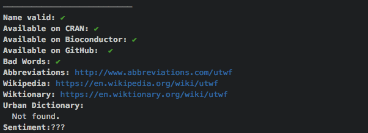
```

the only acronym it finds is "Umauma Triple Water Falls" so we are good to go. Next we need to make sure that you have setup **usethis**, for this section I'll refer to the original documentation [usethis setup](http://usethis.r-lib.org/articles/articles/usethis-setup.html) as it explains these steps better then I could.

## Creating minimal functional package

Now that you have followed the setup guide you are ready to create a minimal functional package.  

For creation we will use the `create_package()` function to create a R package. 

```{r, eval=FALSE}
create_package("~/Desktop/utwf")
use_git()
use_github()
```

```{r echo=FALSE, fig.align='center'}
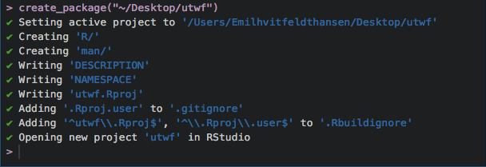
```

```{r echo=FALSE, fig.align='center'}
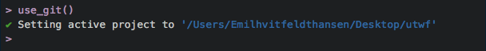
```

```{r echo=FALSE, fig.align='center'}
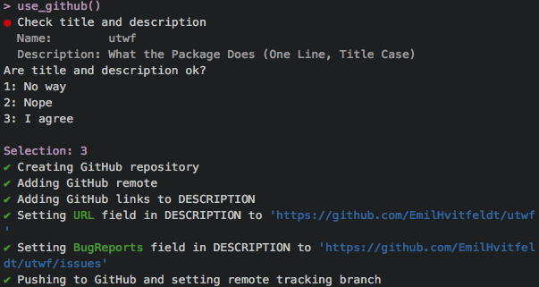
```

And we are done! We now have a minimal R package, complete with Github repository. With these files included:

```{r echo=FALSE, fig.align='center'}
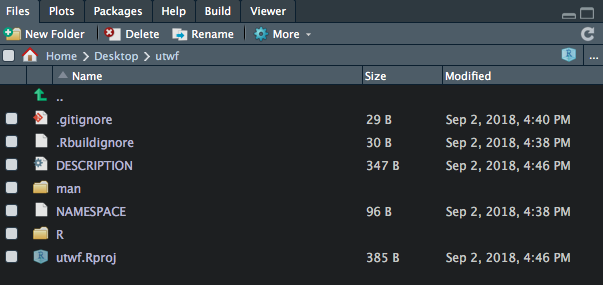
```

Right now it doesn't have much, in fact it doesn't even have a single function in it. We can check that the package works by pressing "Install and Restart" in the "Build" panel. Alternatively you can use the keyboard shortcut Cmd+Shift+B (Ctrl+Shift+B for Windows). 

## One time modifications

Now that we are up and running there is a bunch of things we should do before we start writing code. Firstly we will go over all the actions that only have to be done once and get those out of the way.  

Firstly we will go into the **DESCRIPTION** file and make sure that the *Authors@R* is populated correctly and modify the *Title* and *Description* fields.  

Next we will license the package. This can be done using one of the following functions (we will use MIT for this example)

```{r, eval=FALSE}
use_mit_license()
use_gpl3_license()
use_apl2_license()
use_cc0_license()
```

```{r echo=FALSE, fig.align='center'}
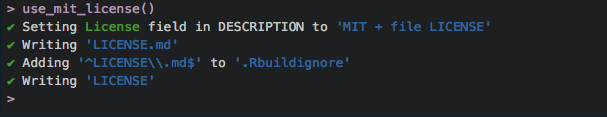
```

Choice of which license you neeed is beyond the scope of this post. Please refer to the [R Packages license section](http://r-pkgs.had.co.nz/description.html#license) or [https://choosealicense.com/](https://choosealicense.com/) for further assistance.  

Now we add the *readme* files, this is done using the 

```{r, eval=FALSE}
use_readme_rmd()
```

```{r echo=FALSE, fig.align='center'}
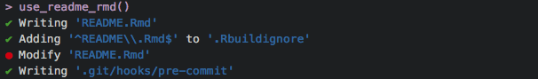
```

This will create a *readme.Rmd* file that you can edit and knit as you normally would.  

Next we will setup some continuous integration. I'll recommend trying to do all of the 3 following:

```{r, eval=FALSE}
use_travis()
use_appveyor()
use_coverage(type = c("codecov"))
```

```{r echo=FALSE, fig.align='center'}
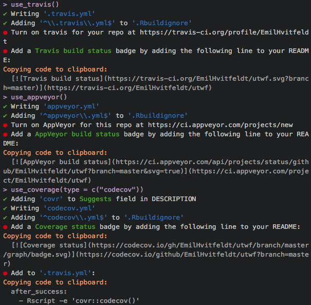
```

These calls won't do all the work for you, so you would have to follow the directions (following red circles) and turn on the services on the Travis and AppVeyor websites respectively, copy badges to the readme (typically placed right under the main title "# utwf") and copy the code snippet to the *.travis.yml* file.  

You will most likely also want to include unit testing, this can be achieved using the [testthat](https://github.com/r-lib/testthat) package, to include the testing capasity of **testthat** in your package simply run the following 

```{r, eval=FALSE}
use_testthat()
```

```{r echo=FALSE, fig.align='center'}
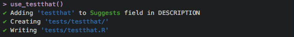
```

you will need to add at least one test to avoid failed builds on Travis-ci and Appveyor. More information on how to do testing can be found at the [Testing](http://r-pkgs.had.co.nz/tests.html) chapter in the R packages book.  

Next we will add spell checking to our workflow, this is done with

```{r, eval=FALSE}
use_spell_check()
```

```{r echo=FALSE, fig.align='center'}
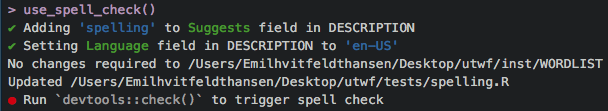
```

Make sure that the **spelling** package is installed before running.  

If you are going to include data in your package, you would want to include a *data-raw* folder where the data is created/formatted. 

```{r, eval=FALSE}
use_data_raw()
```

```{r echo=FALSE, fig.align='center'}
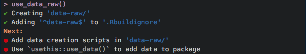
```

Lastly if you plan on doing a little larger project a *NEWS* file is very handy to keep track on what is happening in your package.

```{r, eval=FALSE}
use_news_md()
```

```{r echo=FALSE, fig.align='center'}
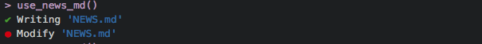
```

## Multiple time modifications

Now that we have setup all the basics, the general development can begin.

You typical workflow will be repeating the following steps in the order that suits your flow

- Write some code
- Restart R Session Cmd+Shift+F10 (Ctrl+Shift+F10	for Windows)
- Build and Reload Cmd+Shift+B (Ctrl+Shift+B for Windows)
- Test Package Cmd+Shift+T (Ctrl+Shift+T for Windows)
- Check Package	Cmd+Shift+E (Ctrl+Shift+E	for Windows)
- Document Package Cmd+Shift+D (Ctrl+Shift+D for Windows)

Writing code most likely includes writing functions, this is helped by the `use_r()` function by adding and opening a .R file that you write your function in

```{r, eval=FALSE}
use_r("function_name")
```

```{r echo=FALSE, fig.align='center'}
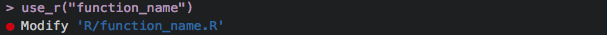
```

This function is very important and you will using it a lot, not only will it create the files you save your functions in, but it will also open the files if they are already created, this makes navigating your R files much easier. Once you have created your function it is time to add some tests! This is done using the `use_test()` function, and it works much the same way as the `use_r()`.

```{r, eval=FALSE}
use_test("function_name")
```

```{r echo=FALSE, fig.align='center'}
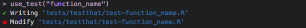
```

In the creating of your functions, you might need to depend on another package, to add a function to the *imports* field in the *DESCRIPTION* file you can use the `use_package()` function

```{r, eval=FALSE}
use_package("dplyr") 
```

```{r echo=FALSE, fig.align='center'}
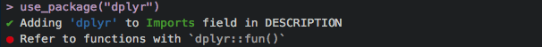
```

Special cases function includes `use_rcpp()`, `use_pipe()` and `use_tibble()`.

An vignette provides a nice piece of documentation once you have added a bunch of capabilities to your package. 

```{r, eval=FALSE}
use_vignette("How to do this cool analysis")
```

```{r echo=FALSE, fig.align='center'}
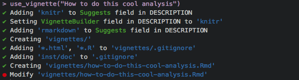
```

## Before every commit

Before you commit, run the following commands one more time to make sure you didn't break anything.

- Restart R Session Cmd+Shift+F10 (Ctrl+Shift+F10	for Windows)
- Document Package Cmd+Shift+D (Ctrl+Shift+D for Windows)
- Check Package	Cmd+Shift+E (Ctrl+Shift+E	for Windows)

## Before every release

You have worked and have created something wonderful. You want to showcase the work. First go knit the *readme.Rmd* file and then run these commands again to check that everything is working.

- Restart R Session Cmd+Shift+F10 (Ctrl+Shift+F10	for Windows)
- Document Package Cmd+Shift+D (Ctrl+Shift+D for Windows)
- Check Package	Cmd+Shift+E (Ctrl+Shift+E	for Windows)

update the version number with the use of

```{r, eval=FALSE}
use_version()
```

```{r echo=FALSE, fig.align='center'}
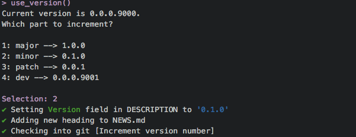
```

And you are good to go!  

## Conclusion

This is the end of this post, and there are many more functions in **usethis** that I haven't covered here, both for development and otherwise. One set of functions I would like to highlight in particular is the [Helpers for tidyverse development](http://usethis.r-lib.org/reference/tidyverse.html) which helps you follow tidyverse conventions which are generally a little stricter than the defaults. If you have any questions or additions you would like to have added please don't refrain from contacting me!

```{r details, echo=FALSE}
library(details) 

sessioninfo::session_info() %>%
  details::details(summary = 'session information')
```
