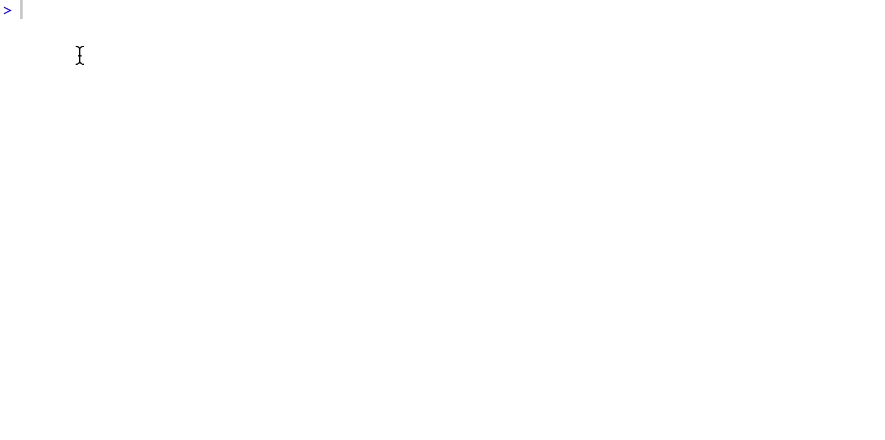
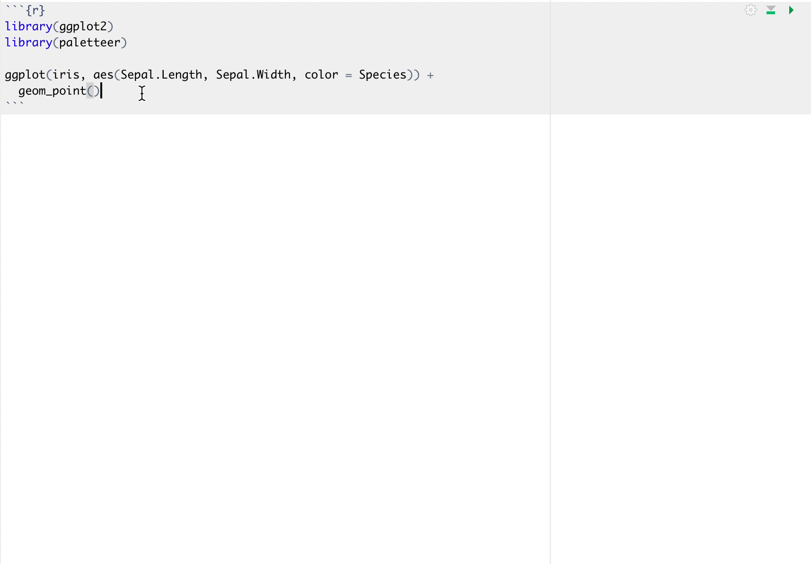

```{r setup, include=FALSE}
library(knitr)
opts_chunk$set(
  echo = TRUE,
  cache = TRUE,
  fig.width = 7, 
  fig.align = 'center',
  fig.asp = 0.618, # 1 / phi
  out.width = "700px")
knit_hooks$set(optipng = hook_optipng)
opts_chunk$set("optipng" = "-o5")
```

```{r, echo=FALSE}
library(paletteer)
```

I'm over-the-moon excited to announce the release of version 1.0.0 of [paletteer](https://github.com/EmilHvitfeldt/paletteer).
This version comes with breaking changes and major quality of life improvements.
I will unironically name this the "first useable version" for reasons that will be obvious later in this post.

## Breaking Changes `r emo::ji("boom")`

There has been a significant change in syntax for this version.
For versions <= 0.2.1 the way to specify a palette was done using the arguments `package` and `palette`.
Both could be taken as both string or unquoted strings.

```{r, eval=FALSE}
# versions <= 0.2.1
paletteer_c("gameofthrones", "baratheon", 10)

paletteer_d(nord, halifax_harbor)
```

While convinient and cool to use [NSE](https://edwinth.github.io/blog/nse/), 
tt was not very useful and I had [several](https://github.com/EmilHvitfeldt/paletteer/issues/17) [people](https://github.com/EmilHvitfeldt/paletteer/issues/13) [complaining](https://github.com/EmilHvitfeldt/paletteer/issues/53).
I realized that using NSE wasn't a good fit at all for this package.
This means that from version 1.0.0 and moving forward only strings will be used to specify palettes.

Secondly, I have eliminated the `package` argument and from now on all specification is done on the form `package::palette`

```{r, eval=FALSE}
# versions >= 1.0.0
paletteer_c("gameofthrones::baratheon", 10)

paletteer_d("nord::halifax_harbor")
```

The above change is the most likely to break your earlier code.

## Autocomplete `r emo::ji("tada")`

The biggest downside to the original version of **paletteer** and later version was the lack of discoverability.
Unless you knew the palette you wanted and the EXACT spelling you couldn't really use **paletteer**.
Sure you could browse `palettes_c_names` and `palettes_d_names` like some caveman,
but to be honest the package felt more like a novelty project than a useful tool.

All of this changes with version 1.0.0 `r emo::ji("tada")`!
Simply starting by typing `paletteer_d()` or any of the other related functions and simply hit tab.
This will prompt all the names of available palettes which you then can search through using fuzzy search.

```{r echo=FALSE, fig.align='center'}

```

This change is the single biggest improvement to this package.

- Discoverability `r emo::ji("check")`
- No more missspellings `r emo::ji("check")`
- Total awesomeness `r emo::ji("check")`

And yes, it also work with the `scale_*_paletteer()` functions `r emo::ji("raised_hands")`

```{r echo=FALSE, fig.align='center'}

```

## Prismatic integration `r emo::ji("gem")`

You can see from the first gif that the output is a little more colorful then what you are used to.
This all comes from the [prismatic](https://github.com/EmilHvitfeldt/prismatic) package I released earlier this year.
The **prismatic** colors objects that are returned from all **paletteer** functions will be printed with colorful backgrounds provided that the [crayon](https://github.com/r-lib/crayon) package is available, otherwise, it will just print normally. 
This is great for when you want to take a quick look at the colors you are about to use.
Please note that the background can only take [256](https://github.com/r-lib/crayon#256-colors) different colors.
Some palettes will fit nicely inside these 256 values and will display nicely (viridis::magma) below, while other palettes with a lot of value will show weird jumps in colors (gameofthrones::greyjoy)

```{r echo=FALSE, fig.align='center'}
knitr::include_graphics("prismatic1.png")
```

If you want more accurate color depictions you can simply `plot()` the output to see the real colors

```{r}
plot(paletteer_c("viridis::magma", 10))
```

```{r}
plot(paletteer_c("gameofthrones::greyjoy", 100))
```

## More color palettes `r emo::ji("rainbow")`

It wouldn't be a **paletteer** release without more palettes.
And this release is no different!
This update brings us 654 new palettes!!! from 19 different packages bringing out total up to 1759.
I did a little live-tweeting while implementing these packages so you can take a look at the newly included palettes here:

<blockquote class="twitter-tweet"><p lang="en" dir="ltr">I&#39;ll be adding a whole bunch of new palettes to {paletteer} tonight! 🌈<br><br>Read this thread if you want to see the new colorful goodies coming your way!<br><br>❤️💙💚🧡💛💜<a href="https://twitter.com/hashtag/rstats?src=hash&amp;ref_src=twsrc%5Etfw">#rstats</a> <a href="https://t.co/c0qK27nc4N">pic.twitter.com/c0qK27nc4N</a></p>&mdash; Emil Hvitfeldt (@Emil_Hvitfeldt) <a href="https://twitter.com/Emil_Hvitfeldt/status/1203508809269800962?ref_src=twsrc%5Etfw">December 8, 2019</a></blockquote> <script async src="https://platform.twitter.com/widgets.js" charset="utf-8"></script>

That is all I have for you this time around if you create or find more palette packages please go over and file [an issue](https://github.com/EmilHvitfeldt/paletteer/issues) so they can be included as well. 
Thank you!
