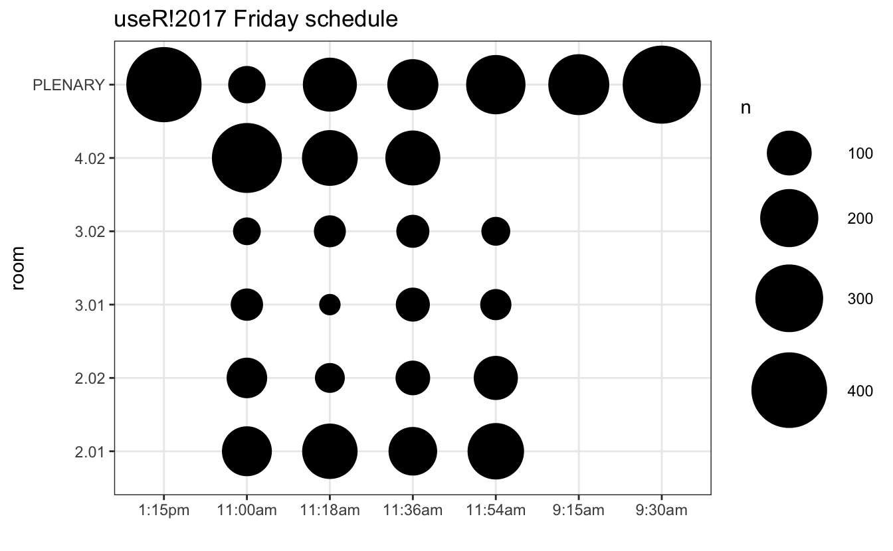
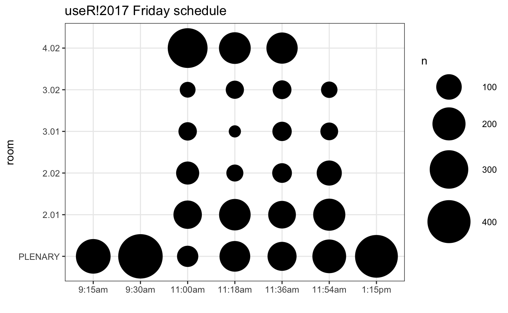
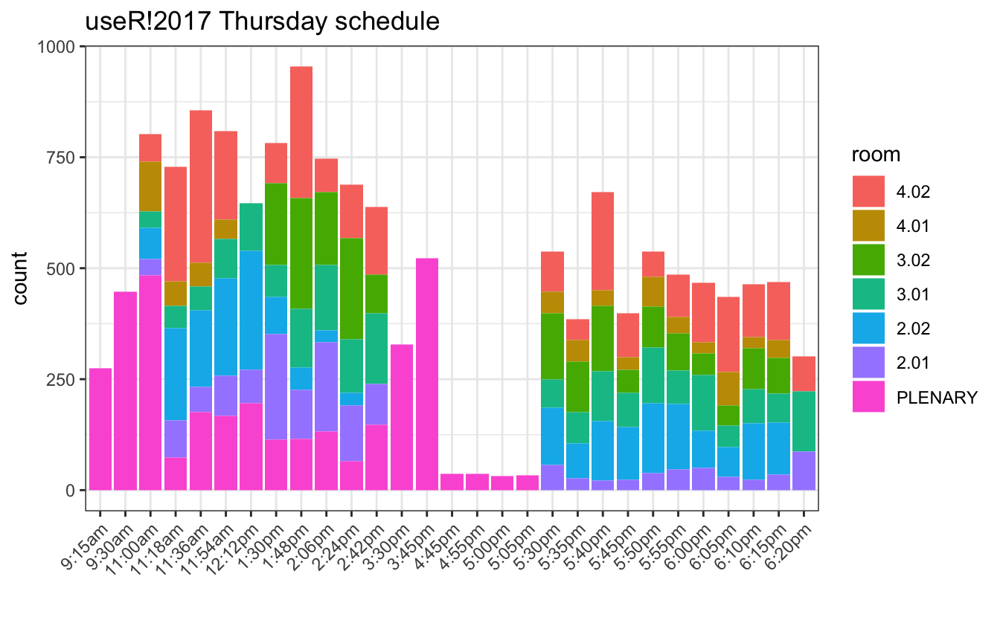

<script src="index_files/htmlwidgets/htmlwidgets.js"></script>
<script src="index_files/plotly-binding/plotly.js"></script>
<script src="index_files/typedarray/typedarray.min.js"></script>
<script src="index_files/jquery/jquery.min.js"></script>
<link href="index_files/crosstalk/css/crosstalk.css" rel="stylesheet" />
<script src="index_files/crosstalk/js/crosstalk.min.js"></script>
<link href="index_files/plotly-htmlwidgets-css/plotly-htmlwidgets.css" rel="stylesheet" />
<script src="index_files/plotly-main/plotly-latest.min.js"></script>
<script src="index_files/htmlwidgets/htmlwidgets.js"></script>
<link href="index_files/vis/vis.css" rel="stylesheet" />
<script src="index_files/vis/vis.min.js"></script>
<script src="index_files/visNetwork-binding/visNetwork.js"></script>

<div class="note">

This code has been lightly revised to make sure it works as of 2018-12-16.

</div>

After attending useR!2017 for the first time, which great pleasure and new connections made. I decided to see if I could extract some of the information available in the public schedule. So as with my last post, I’ll do a bit of scraping followed by a few visualizations.

## Packages

``` r
library(tidyverse)
library(utils)
library(plotly)
library(ltm)
require(visNetwork)
```

## Web scraping

I found this task easiest with the help of `purrr:map()`. First, we find the full schedules at the following links

https://user2017.sched.com/2017-07-04/overview (Tuesday)  
https://user2017.sched.com/2017-07-05/overview (Wednesday)  
https://user2017.sched.com/2017-07-06/overview (Thursday)  
https://user2017.sched.com/2017-07-07/overview (Friday)

then we read the entire page into a tibble along with a *day* variable.

``` r
day <- c("Tuesday", "Wednesday", "Thursday", "Friday")
link <- paste0("https://user2017.sched.com/2017-07-0", 4:7, "/overview", sep = "")

event0 <- map2_df(link, day,
                  ~ tibble(text = readLines(.x),
                           day = .y))
```

then with the help of `stringr` we extract the desired information from the document, following the idiom that “multiple simple regex is better than one complicated one.” I also filtered out most non-talk events.

``` r
events <- event0 %>% 
  filter(str_detect(text, "<span class='") | str_detect(text, "</h3>"),
         !str_detect(text, "REGISTRATION"),
         !str_detect(text, "COFFEE BREAK"),
         !str_detect(text, "LUNCH"),
         !str_detect(text, "WELCOME"),
         !str_detect(text, "Poster"),
         !str_detect(text, "RIOT SESSION"),
         !str_detect(text, "Buses"),
         !str_detect(text, "Dinner"),
         !str_detect(text, "CLOSING")) %>%
  mutate(time = str_extract(text, "<h3>.{1,7}"), # time
         time = str_replace(time, "<h3> *", ""),
         id = str_extract(text, "id='\\S{32}"), # id
         id = str_replace(id, "id='", ""),
         name = str_extract(text, str_c(id, ".*")), # name
         name = str_replace(name, str_c(id, "'>"), ""),
         name = str_extract(name, "^.*(?=( <span))"),
         room = str_extract(text, 'vs">(.*?)<'),
         room = str_replace(room, 'vs">', ""),
         room = str_replace(room, '<',"")) %>% # room
  fill(time) %>%
  filter(!str_detect(text, "<h3>")) %>%
  dplyr::select(-text)
```

let’s take a look at what we have by now just to see that we have what we want.

``` r
head(events)
## # A tibble: 6 x 5
##   day     time   id                    name                               room  
##   <chr>   <chr>  <chr>                 <chr>                              <chr> 
## 1 Tuesday 9:30am 893eab219225a0990770… Data Carpentry: Open and Reproduc… 2.02  
## 2 Tuesday 9:30am 30c0eebdc887f3ad3aef… Dose-response analysis using R     4.02  
## 3 Tuesday 9:30am 57ce234e5ce9082da3cc… Geospatial visualization using R   4.03  
## 4 Tuesday 9:30am 95b110146486b0a5f802… Introduction to Bayesian inferenc… 2.01  
## 5 Tuesday 9:30am 7294f7df20ab1a7c37df… Introduction to parallel computin… 3.01  
## 6 Tuesday 9:30am f15703fe51e89294f2b5… Rcpp: From Simple Examples to Mac… PLENA…
```

Now that we have all the information about the different events we can scrape every event page to find its attendees. This following chuck of code might seem a little hard at first, it helps to notice that there is a second tibble inside the big tibble.

``` r
people <- map_df(events$id,
       ~ tibble(attendee = tibble(text = readLines(
         str_c("https://user2017.sched.com/event-goers/", .x))) %>%
                filter(str_detect(text, " +<li><a href=")) %>% 
                .$text %>%
                str_split(., "li><li") %>% 
                unlist(),
       id = .x) %>%
  mutate(attendee = str_replace(attendee, "(.*?)title=\"", ""),
         attendee = str_replace(attendee, "\"><(.*)", "")) %>%
  filter(!str_detect(attendee, "venue"),
         !str_detect(attendee, "Private")))
```

Let’s again take a look at what we have by now just to see that we have what we want.

``` r
head(people)
## # A tibble: 6 x 2
##   attendee                                                id                    
##   <chr>                                                   <chr>                 
## 1 "              <li><a href=\"\">Schedule</a></li>"      893eab219225a09907704…
## 2 "                                                     … 893eab219225a09907704…
## 3 "lvaudor"                                               893eab219225a09907704…
## 4 "Alan Ponce"                                            893eab219225a09907704…
## 5 "bpiccolo"                                              893eab219225a09907704…
## 6 "Katharina Barzagar Nazari"                             893eab219225a09907704…
```

## visualizations

With a data set with this many possibilities, the options are quite a few, so here I’ll just list a few of the ones I found handy. So first we just do a simple bubble plot, this will be done with `left_join`’s and `count` and piped straight into `ggplot`.

``` r
left_join(events, people, by = "id") %>%
  count(id) %>%
  left_join(events, by = "id") %>%
  filter(day == "Friday") %>%
  ggplot(aes(time, room, size = n)) +
  geom_point() +
  theme_bw() +
  scale_size(range = c(5, 20)) +
  labs(title = "useR!2017 Friday schedule",
       x = "")
```



Since both our `room` and `time` were simply character vectors, the ordering is not right. This can be fixed by setting the levels correctly. Here I have the ordered vectored for both `room` and `time`.

``` r
time_levels <- c("9:15am", "9:30am", "11:00am", "11:18am", "11:30am", "11:36am",
                 "11:54am", "12:12pm", "1:15pm", "1:30pm", "1:48pm", "2:00pm", 
                 "2:06pm", "2:24pm", "2:42pm", "3:30pm", "3:45pm", "4:00pm", 
                 "4:45pm", "4:55pm", "5:00pm", "5:05pm", "5:30pm", "5:35pm", 
                 "5:40pm", "5:45pm", "5:50pm", "5:55pm", "6:00pm", "6:05pm", 
                 "6:10pm", "6:15pm", "6:20pm", "7:00pm")
room_levels <- c("PLENARY", "2.01", "2.02", "3.01", "3.02", "4.01", "4.02")
```

and we deal with it with a single mutate like so

``` r
left_join(events, people, by = "id") %>%
  count(id) %>%
  left_join(events, by = "id") %>%
  mutate(time = factor(time, time_levels),
         room = factor(room, room_levels)) %>%
  filter(day == "Friday") %>%
  ggplot(aes(time, room, size = n)) +
  geom_point() +
  theme_bw() +
  scale_size(range = c(5, 20)) +
  labs(title = "useR!2017 Friday schedule",
       x = "")
```



another way to visualize it would be to use a stacked bar chart so

``` r
p <- left_join(events, people, by = "id") %>%
  count(id) %>%
  left_join(events, by = "id") %>%
  filter(day == "Thursday") %>%
  mutate(time = factor(time, time_levels),
         room = factor(room, rev(room_levels))) %>%
  ggplot(aes(time, fill = room, text = name)) +
  geom_bar(aes(weight = n)) +
  theme_bw() +
  theme(axis.text.x = element_text(angle = 45, hjust = 1)) +
  labs(title = "useR!2017 Thursday schedule",
       x = "")
p
```



or with a bit of interactivity `plotly::ggplotly` can be used so that is possible to hover over each event to see name and size.

``` r
ggplotly(p, tooltip = c("n", "name"), width = 700, height = 500)
```

<div id="htmlwidget-1" style="width:700px;height:500px;" class="plotly html-widget"></div>
<script type="application/json" data-for="htmlwidget-1">{"x":{"data":[{"orientation":"v","width":[0.9,0.9,0.9,0.9,0.899999999999999,0.899999999999999,0.899999999999999,0.899999999999999,0.899999999999999,0.899999999999999,0.899999999999999,0.899999999999999,0.899999999999999,0.899999999999999,0.899999999999999,0.899999999999999,0.899999999999999,0.899999999999999,0.899999999999999,0.899999999999999],"base":[740,471,512,609,691,658,671,568,485,447,338,450,299,480,390,334,267,345,339,222],"x":[3,4,5,6,8,9,10,11,12,19,20,21,22,23,24,25,26,27,28,29],"y":[62,258,343,199,91,296,76,120,153,90,47,222,100,58,95,133,168,119,129,80],"text":["n:  62<br />moodler: A new R package to easily fetch data from Moodle","n: 258<br />Can you keep a secret?","n: 343<br />Scraping data with rvest and purrr","n: 199<br />jug: Building Web APIs for R","n:  91<br />Interactive graphs for blind and print disabled people","n: 296<br />Package ggiraph: a ggplot2 Extension for Interactive Graphics","n:  76<br />Visual funnel plot inference for meta-analysis","n: 120<br />mapedit - interactive manipulation of spatial objects","n: 153<br />Exploring and presenting maps with **tmap**","n:  90<br />R in a small-sized bank's risk management","n:  47<br />**eventstudies**: An *R* package for conducting event studies and a platform for methodological research on event studies","n: 222<br />Automatic Machine Learning in R","n: 100<br />R in a Pharmaceutical Company","n:  58<br />Using R to Analyze Healthcare Cost of Older Patients Using Personal Emergency Response Service","n:  95<br />Statistics hitting the business front line","n: 133<br />An example of Shiny tool at Nestlé R&D, an enabler to guide product developers in designing gluten free biscuits","n: 168<br />Using R for optimal beer recipe selection","n: 119<br />Candy Crush R Saga","n: 129<br />Gamifyr: Transforming Machine Learning Tasks into Games with Shiny","n:  80<br />Ultra-Fast Data Mining With The R-KDB+ Interface"],"type":"bar","marker":{"autocolorscale":false,"color":"rgba(248,118,109,1)","line":{"width":1.88976377952756,"color":"transparent"}},"name":"4.02","legendgroup":"4.02","showlegend":true,"xaxis":"x","yaxis":"y","hoverinfo":"text","frame":null},{"orientation":"v","width":[0.9,0.9,0.9,0.9,0.899999999999999,0.899999999999999,0.899999999999999,0.899999999999999,0.899999999999999,0.899999999999999,0.899999999999999,0.899999999999999,0.899999999999999,0.899999999999999],"base":[628,416,459,566,398,290,415,272,413,354,308,190,320,298],"x":[3,4,5,6,19,20,21,22,23,24,25,26,27,28],"y":[112,55,53,43,49,48,35,27,67,36,26,77,25,41],"text":["n: 112<br />Bayesian social network analysis with Bergm","n:  55<br />difNLR: Detection of potentional gender/minority bias with extensions of logistic regression","n:  53<br />**BradleyTerryScalable**: Ranking items scalably with the Bradley-Terry model","n:  43<br />IRT test equating with the R package equateIRT","n:  49<br />DNA methylation-based classification of human central nervous system tumors","n:  48<br />Multivariate statistics for PAT data analysis: short overview of existing R packages and methods","n:  35<br />R in research on microbial mutation rates","n:  27<br />Plasmid Profiler: Comparative Analysis of Plasmid Content in WGS Data","n:  67<br />Application of R and Shiny in multiomics understanding of blood cancer biology and drug response","n:  36<br />Simulate phenotype(s) with epistatic interactions","n:  26<br />Introducing the DynNom package for the generation of dynamic nomograms","n:  77<br />Graduate from plot to ggplot2: Using R to visualize the story of Ebola survivors in the PREVAIL III Ebola Natural History Study","n:  25<br />**BivRegBLS**, a new *R* package: Tolerance Intervals and Errors-in-Variables Regressions in Method Comparison Studies","n:  41<br />What is missing from the meta-analysis landscape?"],"type":"bar","marker":{"autocolorscale":false,"color":"rgba(196,154,0,1)","line":{"width":1.88976377952756,"color":"transparent"}},"name":"4.01","legendgroup":"4.01","showlegend":true,"xaxis":"x","yaxis":"y","hoverinfo":"text","frame":null},{"orientation":"v","width":[0.899999999999999,0.899999999999999,0.899999999999999,0.899999999999999,0.899999999999999,0.899999999999999,0.899999999999999,0.899999999999999,0.899999999999999,0.899999999999999,0.899999999999999,0.899999999999999,0.899999999999999,0.899999999999999,0.899999999999999],"base":[508,409,507,340,399,249,175,268,219,322,270,260,146,228,217],"x":[8,9,10,11,12,19,20,21,22,23,24,25,26,27,28],"y":[183,249,164,228,86,149,115,147,53,91,84,48,44,92,81],"text":["n: 183<br />ReinforcementLearning: A package for replicating human behavior in R","n: 249<br />Deep Learning for Natural Language Processing in R","n: 164<br />R4ML: A Scalable R for Machine Learning","n: 228<br />Computer Vision and Image Recognition algorithms for R users","n:  86<br />Depth and depth-based classification with R package **ddalpha**","n: 149<br />R Blogging with blogdown and GitHub","n: 115<br />**redmineR** and the story of automating *useR!2017* abstract review process","n: 147<br />The current state of naming conventions in R","n:  53<br />An Introduction to the r2anki-package","n:  91<br />rOpenGov: community project for open government data","n:  84<br />R.gov: making R work for government","n:  48<br />nsoAPI - retrieving data from National Statistical Offices with R","n:  44<br />Jurimetrics: quantitative analysis of judicial decisions using R","n:  92<br />Shiny Apps for Maths and Stats Exercises","n:  81<br />Working with R when internet is not reliable"],"type":"bar","marker":{"autocolorscale":false,"color":"rgba(83,180,0,1)","line":{"width":1.88976377952756,"color":"transparent"}},"name":"3.02","legendgroup":"3.02","showlegend":true,"xaxis":"x","yaxis":"y","hoverinfo":"text","frame":null},{"orientation":"v","width":[0.9,0.9,0.9,0.9,0.9,0.899999999999999,0.899999999999999,0.899999999999999,0.899999999999999,0.899999999999999,0.899999999999999,0.899999999999999,0.899999999999999,0.899999999999999,0.899999999999999,0.899999999999999,0.899999999999999,0.899999999999999,0.899999999999999,0.899999999999999,0.899999999999999],"base":[591,365,406,477,540,436,277,360,220,239,185,106,156,143,196,194,134,97,151,153,87],"x":[3,4,5,6,7,8,9,10,11,12,19,20,21,22,23,24,25,26,27,28,29],"y":[37,51,53,89,106,72,132,147,120,160,64,69,112,76,126,76,126,49,77,64,135],"text":["n:  37<br />**rags2ridges**: A One-Stop-Go for Network Modeling of Precision Matrices","n:  51<br />Various Versatile Variances: An Object-Oriented Implementation of Clustered Covariances in *R*","n:  53<br />factorMerger: a set of tools to support results from post hoc testing","n:  89<br />Estimating the Parameters of a Continuous-Time Markov Chain from Discrete-Time Data with ctmcd","n: 106<br />MCMC Output Analysis Using R package mcmcse","n:  72<br />An Efficient Algorithm for Solving Large Fixed Effects OLS Problems with Clustered Standard Error Estimation","n: 132<br />R Package glmm: Likelihood-Based Inference for Generalized Linear Mixed Models","n: 147<br />**countreg**: Tools for count data regression","n: 120<br />How to Use (R)Stan to Estimate Models in External R Packages","n: 160<br />brms: Bayesian Multilevel Models using Stan","n:  64<br />The cutpointr package: Improved and tidy estimation of optimal cutpoints","n:  69<br />Preparing Datetime Data with Padr","n: 112<br />R in Minecraft","n:  76<br />Digital Signal Processing with R","n: 126<br />Data Analysis Using Hierarchical Generalized Linear Models with R","n:  76<br />The R package bigstatsr: Memory- and Computation-Efficient Statistical Tools for Big Matrices","n: 126<br />Advanced R Solutions -- A Bookdown Project","n:  49<br />Functional Input Validation with valaddin","n:  77<br />ROI - R Optimization Infrastructure","n:  64<br />simmer: Discrete-Event Simulation for R","n: 135<br />Data Error! But where?"],"type":"bar","marker":{"autocolorscale":false,"color":"rgba(0,192,148,1)","line":{"width":1.88976377952756,"color":"transparent"}},"name":"3.01","legendgroup":"3.01","showlegend":true,"xaxis":"x","yaxis":"y","hoverinfo":"text","frame":null},{"orientation":"v","width":[0.9,0.9,0.9,0.9,0.9,0.899999999999999,0.899999999999999,0.899999999999999,0.899999999999999,0.899999999999999,0.899999999999999,0.899999999999999,0.899999999999999,0.899999999999999,0.899999999999999,0.899999999999999,0.899999999999999,0.899999999999999,0.899999999999999],"base":[520,157,233,257,272,352,226,334,191,57,27,22,24,39,46,50,30,24,35],"x":[3,4,5,6,7,8,9,10,11,19,20,21,22,23,24,25,26,27,28],"y":[71,208,173,220,268,84,51,26,29,128,79,134,119,157,148,84,67,127,118],"text":["n:  71<br />Hosting Data Packages via `drat`: A Case Study with Hurricane Exposure Data","n: 208<br />Clouds, Containers and R, towards a global hub for reproducible and collaborative data science","n: 173<br />codebookr: Codebooks in *R*","n: 220<br />Show me the errors you didn't look for","n: 268<br />Automatically archiving reproducible studies with Docker","n:  84<br />The **renjin** package: Painless Just-in-time Compilation for High Performance R","n:  51<br />An LLVM-based Compiler Toolkit for R","n:  26<br />Performance Benchmarking of the R Programming Environment on Knight's Landing","n:  29<br />*GNU R* on a Programmable Logic Controller (PLC) in an Embedded-Linux Environment","n: 128<br />R and Tableau Integration: A Case approach","n:  79<br />The dataCompareR package","n: 134<br />Use of templates within an R package to create a (semi-)automated analysis workflow and/or report","n: 119<br />graphiT: an interactive, user-friendly tool to produce graphics based on the grammar of graphics' principles","n: 157<br />**heatmaply**: an *R* package for creating interactive cluster heatmaps","n: 148<br />Plot Colour Helper – Finally an easy way to pick colours for your R plots!","n:  84<br />bsplus: Using Twitter Bootstrap to extend your Shiny app","n:  67<br />TAGS - Table Assorting Guided System: an HTML widget to create multiple tables from Excel spreadsheets","n: 127<br />Object-oriented markdown in R to facilitate collaboration","n: 118<br />Strategies for Reproducible Research with Packrat"],"type":"bar","marker":{"autocolorscale":false,"color":"rgba(0,182,235,1)","line":{"width":1.88976377952756,"color":"transparent"}},"name":"2.02","legendgroup":"2.02","showlegend":true,"xaxis":"x","yaxis":"y","hoverinfo":"text","frame":null},{"orientation":"v","width":[0.9,0.9,0.9,0.9,0.9,0.899999999999999,0.899999999999999,0.899999999999999,0.899999999999999,0.899999999999999,0.899999999999999,0.899999999999999,0.899999999999999,0.899999999999999,0.899999999999999,0.899999999999999,0.899999999999999,0.899999999999999,0.899999999999999,0.899999999999999,0.899999999999999],"base":[484,74,176,167,196,113,116,132,65,147,0,0,0,0,0,0,0,0,0,0,0],"x":[3,4,5,6,7,8,9,10,11,12,19,20,21,22,23,24,25,26,27,28,29],"y":[36,83,57,90,76,239,110,202,126,92,57,27,22,24,39,46,50,30,24,35,87],"text":["n:  36<br />Using the alphabetr package to determine paired T cell receptor sequences","n:  83<br />Differentiation of brain tumor tissue using hierarchical non-negative matrix factorization","n:  57<br />Biosignature-Based Drug Design: from high dimensional data to business impact","n:  90<br />Interactive and Reproducible Research for RNA Sequencing Analysis","n:  76<br />Stochastic Gradient Descent Log-Likelihood Estimation in the Cox Proportional Hazards Model with Applications to The Cancer Genome Atlas Data","n: 239<br />R-based computing with big data on disk","n: 110<br />Daff: diff, patch and merge for data.frames","n: 202<br />odbc - A modern database interface","n: 126<br />Improving DBI","n:  92<br />*implyr**: A **dplyr** Backend for a Apache Impala","n:  57<br />rdwd – manage German weather observations","n:  27<br />eseis – A toolbox to weld seismologic and geomorphic data analysis","n:  22<br />An R Decision Support Framework for the Identification of BMP in Catchments","n:  24<br />Reproducible research in computational subsurface hydrology - First steps in R with RMODFLOW and RMT3DMS","n:  39<br />Using an R package as platform for harmonized cleaning of data from RTI MicroPEM air quality sensors","n:  46<br />map data from **naturalearth** : aiming for sustainability through specialisation and **rOpenSci**","n:  50<br />OpenSpat, spread the spatial world","n:  30<br />smires -- Calculating Hydrological Metrics for Univariate Time Series","n:  24<br />minimalRSD and FMC: R packages to construct cost efficient experimental designs","n:  35<br />ICtest: Estimating the Number of Interesting Components","n:  87<br />Better Confidence Intervals for Quantiles"],"type":"bar","marker":{"autocolorscale":false,"color":"rgba(165,138,255,1)","line":{"width":1.88976377952756,"color":"transparent"}},"name":"2.01","legendgroup":"2.01","showlegend":true,"xaxis":"x","yaxis":"y","hoverinfo":"text","frame":null},{"orientation":"v","width":[0.9,0.9,0.9,0.9,0.9,0.9,0.9,0.899999999999999,0.899999999999999,0.899999999999999,0.899999999999999,0.899999999999999,0.899999999999999,0.899999999999999,0.899999999999999,0.899999999999999,0.899999999999999,0.899999999999999],"base":[0,0,0,0,0,0,0,0,0,0,0,0,0,0,0,0,0,0],"x":[1,2,3,4,5,6,7,8,9,10,11,12,13,14,15,16,17,18],"y":[274,447,484,74,176,167,196,113,116,132,65,147,328,523,37,36,31,33],"text":["n: 274<br />Sponsor Talk Open Analytics","n: 447<br />KEYNOTE: Dose-response analysis: considering dose both as qualitative factor and quantitative covariate- using R*","n: 484<br />Show Me Your Model: tools for visualisation of statistical models","n:  74<br />Quantitative fisheries advice using R and FLR","n: 176<br />*jamovi*: a spreadsheet for R","n: 167<br />The growing popularity of R in data journalism","n: 196<br />FFTrees: An R package to create, visualise and use fast and frugal decision trees","n: 113<br />Community-based learning and knowledge sharing","n: 116<br />Data Carpentry: Teaching Reproducible Data Driven Discovery","n: 132<br />Statistics in Action with R: an educative platform","n:  65<br />A quasi-experiment for the influence of the user interface on the acceptance of R","n: 147<br />The analysis of R learning styles with R","n: 328<br />Sponsor Talk Rstudio","n: 523<br />KEYNOTE: Parallel Computation in R:  What We Want, and How We (Might) Get It","n:  37<br />SPONSOR TALK EODA","n:  36<br />SPONSOR TALK ORACLE","n:  31<br />SPONSOR TALK MANGO SOLUTIONS","n:  33<br />SPONSOR TALK ALTERYX"],"type":"bar","marker":{"autocolorscale":false,"color":"rgba(251,97,215,1)","line":{"width":1.88976377952756,"color":"transparent"}},"name":"PLENARY","legendgroup":"PLENARY","showlegend":true,"xaxis":"x","yaxis":"y","hoverinfo":"text","frame":null}],"layout":{"margin":{"t":43.7625570776256,"r":7.30593607305936,"b":36.2339466277901,"l":48.9497716894977},"plot_bgcolor":"rgba(255,255,255,1)","paper_bgcolor":"rgba(255,255,255,1)","font":{"color":"rgba(0,0,0,1)","family":"","size":14.6118721461187},"title":{"text":"useR!2017 Thursday schedule","font":{"color":"rgba(0,0,0,1)","family":"","size":17.5342465753425},"x":0,"xref":"paper"},"xaxis":{"domain":[0,1],"automargin":true,"type":"linear","autorange":false,"range":[0.4,29.6],"tickmode":"array","ticktext":["9:15am","9:30am","11:00am","11:18am","11:36am","11:54am","12:12pm","1:30pm","1:48pm","2:06pm","2:24pm","2:42pm","3:30pm","3:45pm","4:45pm","4:55pm","5:00pm","5:05pm","5:30pm","5:35pm","5:40pm","5:45pm","5:50pm","5:55pm","6:00pm","6:05pm","6:10pm","6:15pm","6:20pm"],"tickvals":[1,2,3,4,5,6,7,8,9,10,11,12,13,14,15,16,17,18,19,20,21,22,23,24,25,26,27,28,29],"categoryorder":"array","categoryarray":["9:15am","9:30am","11:00am","11:18am","11:36am","11:54am","12:12pm","1:30pm","1:48pm","2:06pm","2:24pm","2:42pm","3:30pm","3:45pm","4:45pm","4:55pm","5:00pm","5:05pm","5:30pm","5:35pm","5:40pm","5:45pm","5:50pm","5:55pm","6:00pm","6:05pm","6:10pm","6:15pm","6:20pm"],"nticks":null,"ticks":"outside","tickcolor":"rgba(51,51,51,1)","ticklen":3.65296803652968,"tickwidth":0.66417600664176,"showticklabels":true,"tickfont":{"color":"rgba(77,77,77,1)","family":"","size":11.689497716895},"tickangle":-45,"showline":false,"linecolor":null,"linewidth":0,"showgrid":true,"gridcolor":"rgba(235,235,235,1)","gridwidth":0.66417600664176,"zeroline":false,"anchor":"y","title":{"text":"","font":{"color":"rgba(0,0,0,1)","family":"","size":14.6118721461187}},"hoverformat":".2f"},"yaxis":{"domain":[0,1],"automargin":true,"type":"linear","autorange":false,"range":[-47.7,1001.7],"tickmode":"array","ticktext":["0","250","500","750","1000"],"tickvals":[0,250,500,750,1000],"categoryorder":"array","categoryarray":["0","250","500","750","1000"],"nticks":null,"ticks":"outside","tickcolor":"rgba(51,51,51,1)","ticklen":3.65296803652968,"tickwidth":0.66417600664176,"showticklabels":true,"tickfont":{"color":"rgba(77,77,77,1)","family":"","size":11.689497716895},"tickangle":-0,"showline":false,"linecolor":null,"linewidth":0,"showgrid":true,"gridcolor":"rgba(235,235,235,1)","gridwidth":0.66417600664176,"zeroline":false,"anchor":"x","title":{"text":"count","font":{"color":"rgba(0,0,0,1)","family":"","size":14.6118721461187}},"hoverformat":".2f"},"shapes":[{"type":"rect","fillcolor":"transparent","line":{"color":"rgba(51,51,51,1)","width":0.66417600664176,"linetype":"solid"},"yref":"paper","xref":"paper","x0":0,"x1":1,"y0":0,"y1":1}],"showlegend":true,"legend":{"bgcolor":"rgba(255,255,255,1)","bordercolor":"transparent","borderwidth":1.88976377952756,"font":{"color":"rgba(0,0,0,1)","family":"","size":11.689497716895},"y":0.937637795275591},"annotations":[{"text":"room","x":1.02,"y":1,"showarrow":false,"ax":0,"ay":0,"font":{"color":"rgba(0,0,0,1)","family":"","size":14.6118721461187},"xref":"paper","yref":"paper","textangle":-0,"xanchor":"left","yanchor":"bottom","legendTitle":true}],"hovermode":"closest","width":700,"height":500,"barmode":"relative"},"config":{"doubleClick":"reset","showSendToCloud":false},"source":"A","attrs":{"48243c3f85fc":{"weight":{},"x":{},"fill":{},"text":{},"type":"bar"}},"cur_data":"48243c3f85fc","visdat":{"48243c3f85fc":["function (y) ","x"]},"highlight":{"on":"plotly_click","persistent":false,"dynamic":false,"selectize":false,"opacityDim":0.2,"selected":{"opacity":1},"debounce":0},"shinyEvents":["plotly_hover","plotly_click","plotly_selected","plotly_relayout","plotly_brushed","plotly_brushing","plotly_clickannotation","plotly_doubleclick","plotly_deselect","plotly_afterplot","plotly_sunburstclick"],"base_url":"https://plot.ly"},"evals":[],"jsHooks":[]}</script>

### Network graph

To make our-self a simple network graph will I be using the [visNetwork](https://github.com/datastorm-open/visNetwork) package, which has a lovely vignette. So here first of all to create a manageable graph I’ll subset all the Wednesday talks in room 4.02, which was the “Shiny I” and “Text Mining” block.

``` r
sub_data <- left_join(events, people, by = "id") %>%
  filter(day == "Wednesday", room == "4.02") %>%
  dplyr::select(name, attendee, time)
```

I this graph I will let each node be an event and let the edges be to which degree they share attendees. So we start

``` r
node_size <- sub_data %>% 
  group_by(name, time) %>%
  summarize(n = n())
```

to find how many attendees the events share we first find all the different pairs of events with `utils::combn` function and with `purrr` and `inner_join` finds how many they have in common. Since `utils::combn` gives its result in a matrix we have to fiddle just a bit to our way back to a tibble.

``` r
conn <- combn(node_size$name, 2) %>%
  as_tibble() %>%
  map_int(~ inner_join(sub_data %>% filter(name == .x[1]), 
                       sub_data %>% filter(name == .x[2]), by = "attendee")
              %>% nrow()) %>%
  rbind(combn(node_size$name, 2)) %>% t() %>% as.tibble()
## Warning: `as.tibble()` was deprecated in tibble 2.0.0.
## Please use `as_tibble()` instead.
## The signature and semantics have changed, see `?as_tibble`.
## Warning: The `x` argument of `as_tibble.matrix()` must have unique column names if `.name_repair` is omitted as of tibble 2.0.0.
## Using compatibility `.name_repair`.
names(conn) <- c("n", "from", "to")
conn
## # A tibble: 45 x 3
##    n     from                               to                                  
##    <chr> <chr>                              <chr>                               
##  1 21    A Tidy Data Model for Natural Lan… bradio: Add data music widgets to y…
##  2 57    A Tidy Data Model for Natural Lan… Developing and deploying large scal…
##  3 82    A Tidy Data Model for Natural Lan… How we built a Shiny App for 700 us…
##  4 84    A Tidy Data Model for Natural Lan… Interacting with databases from Shi…
##  5 84    A Tidy Data Model for Natural Lan… manifestoR - a tool for data journa…
##  6 99    A Tidy Data Model for Natural Lan… Neural Embeddings and NLP with R an…
##  7 83    A Tidy Data Model for Natural Lan… ShinyProxy                          
##  8 155   A Tidy Data Model for Natural Lan… Text Analysis and Text Mining Using…
##  9 168   A Tidy Data Model for Natural Lan… Text mining, the tidy way           
## 10 46    bradio: Add data music widgets to… Developing and deploying large scal…
## # … with 35 more rows
```

for the node tibble we need to supply it with an *id* column, but I will also supply it with a label (name of the event), size (number of people in the event), and color (what book is this event in. green = Shiny I, blue = Text Mining).

``` r
Shiny_I <- c("11:00am", "11:18am", "11:36am", "11:54am", "12:12pm")
Text_Mining <- c("1:30pm", "1:48pm", "2:06pm", "2:24pm", "2:42pm")
nodes <- node_size %>% 
  mutate(id = name,
         label = str_wrap(name, width = 20),
         size = n / 20,
         color = case_when(
           time %in% Shiny_I ~ "lightgreen",
           time %in% Text_Mining ~ "lightblue"
         ))
```

for the edge tibble it needs *from* and *to* columns that match with the *id* in the node tibble. I will also supply with a constant color column (because if omitted it would borrow from the node coloring) and a width column to indicate how many attendees they share. This is again done with a couple of left\_joins and the connectivity is the average percentage of attendees they share. Lastly, we remove any edge with less than 0.5 connectivity to clear out the graph.

``` r
edges <- conn %>% 
  left_join(node_size %>% 
              dplyr::select(-time) %>% 
              rename(n_from = n), 
                   by = c("from" = "name")) %>%
  left_join(node_size %>% 
              dplyr::select(-time) %>% 
              rename(n_to = n), 
                   by = c("to" = "name")) %>%
  mutate(n = as.numeric(n),
         n_to = as.numeric(n_to),
         n_from = as.numeric(n_from),
         connectivity = (n / n_from + n / n_to) / 2,
         width = connectivity * 10,
         color = "grey") %>%
  filter(connectivity > 0.5)
```

This yields us with a wonderful graph which shows a somehow clear divide between the two blocks.

``` r
visNetwork(nodes, edges, width = "100%")
```

<div id="htmlwidget-2" style="width:100%;height:415.296px;" class="visNetwork html-widget"></div>
<script type="application/json" data-for="htmlwidget-2">{"x":{"nodes":{"name":["A Tidy Data Model for Natural Language Processing","bradio: Add data music widgets to your business intelligence dashboards","Developing and deploying large scale Shiny applications for non-life insurance","How we built a Shiny App for 700 users?","Interacting with databases from Shiny","manifestoR - a tool for data journalists, a source for text miners and a prototype for reproducibility software","Neural Embeddings and NLP with R and Spark","ShinyProxy","Text Analysis and Text Mining Using R","Text mining, the tidy way"],"time":["2:06pm","11:18am","12:12pm","11:00am","11:36am","1:48pm","2:42pm","11:54am","2:24pm","1:30pm"],"n":[209,73,191,307,294,138,199,289,251,328],"id":["A Tidy Data Model for Natural Language Processing","bradio: Add data music widgets to your business intelligence dashboards","Developing and deploying large scale Shiny applications for non-life insurance","How we built a Shiny App for 700 users?","Interacting with databases from Shiny","manifestoR - a tool for data journalists, a source for text miners and a prototype for reproducibility software","Neural Embeddings and NLP with R and Spark","ShinyProxy","Text Analysis and Text Mining Using R","Text mining, the tidy way"],"label":["A Tidy Data Model\nfor Natural Language\nProcessing","bradio: Add data\nmusic widgets\nto your business\nintelligence\ndashboards","Developing and\ndeploying large\nscale Shiny\napplications for\nnon-life insurance","How we built a Shiny\nApp for 700 users?","Interacting with\ndatabases from Shiny","manifestoR - a\ntool for data\njournalists, a\nsource for text\nminers and a\nprototype for\nreproducibility\nsoftware","Neural Embeddings\nand NLP with R and\nSpark","ShinyProxy","Text Analysis and\nText Mining Using R","Text mining, the\ntidy way"],"size":[10.45,3.65,9.55,15.35,14.7,6.9,9.95,14.45,12.55,16.4],"color":["lightblue","lightgreen","lightgreen","lightgreen","lightgreen","lightblue","lightblue","lightgreen","lightblue","lightblue"]},"edges":{"n":[84,155,168,61,144,137,146,212,201,203,110,188],"from":["A Tidy Data Model for Natural Language Processing","A Tidy Data Model for Natural Language Processing","A Tidy Data Model for Natural Language Processing","bradio: Add data music widgets to your business intelligence dashboards","Developing and deploying large scale Shiny applications for non-life insurance","Developing and deploying large scale Shiny applications for non-life insurance","Developing and deploying large scale Shiny applications for non-life insurance","How we built a Shiny App for 700 users?","How we built a Shiny App for 700 users?","Interacting with databases from Shiny","manifestoR - a tool for data journalists, a source for text miners and a prototype for reproducibility software","Text Analysis and Text Mining Using R"],"to":["manifestoR - a tool for data journalists, a source for text miners and a prototype for reproducibility software","Text Analysis and Text Mining Using R","Text mining, the tidy way","Interacting with databases from Shiny","How we built a Shiny App for 700 users?","Interacting with databases from Shiny","ShinyProxy","Interacting with databases from Shiny","ShinyProxy","ShinyProxy","Text mining, the tidy way","Text mining, the tidy way"],"n_from":[209,209,209,73,191,191,191,307,307,294,138,251],"n_to":[138,251,328,294,307,294,289,294,289,289,328,328],"connectivity":[0.505304763886,0.67957833736823,0.658011436573696,0.521549715776722,0.611491038081757,0.591631940734409,0.634794108588924,0.705821090651244,0.675112428569818,0.696449167902455,0.566233651466949,0.661087357885531],"width":[5.05304763886,6.7957833736823,6.58011436573696,5.21549715776722,6.11491038081757,5.91631940734409,6.34794108588924,7.05821090651244,6.75112428569818,6.96449167902455,5.66233651466949,6.61087357885531],"color":["grey","grey","grey","grey","grey","grey","grey","grey","grey","grey","grey","grey"]},"nodesToDataframe":true,"edgesToDataframe":true,"options":{"width":"100%","height":"100%","nodes":{"shape":"dot"},"manipulation":{"enabled":false}},"groups":null,"width":"100%","height":null,"idselection":{"enabled":false},"byselection":{"enabled":false},"main":null,"submain":null,"footer":null,"background":"rgba(0, 0, 0, 0)"},"evals":[],"jsHooks":[]}</script>

I hope you enjoyed this post and I would love you to see any visualization or analysis you might have regarding this data.

<details closed>
<summary>
<span title="Click to Expand"> session information </span>
</summary>

``` r
─ Session info ───────────────────────────────────────────────────────────────
 setting  value                       
 version  R version 4.0.5 (2021-03-31)
 os       macOS Big Sur 10.16         
 system   x86_64, darwin17.0          
 ui       X11                         
 language (EN)                        
 collate  en_US.UTF-8                 
 ctype    en_US.UTF-8                 
 tz       Pacific/Honolulu            
 date     2021-07-04                  

─ Packages ───────────────────────────────────────────────────────────────────
 package     * version    date       lib source                            
 assertthat    0.2.1      2019-03-21 [1] CRAN (R 4.0.0)                    
 backports     1.2.1      2020-12-09 [1] CRAN (R 4.0.2)                    
 blogdown      1.3.2      2021-06-06 [1] Github (rstudio/blogdown@00a2090) 
 bookdown      0.22       2021-04-22 [1] CRAN (R 4.0.2)                    
 broom         0.7.6      2021-04-05 [1] CRAN (R 4.0.2)                    
 bslib         0.2.4.9003 2021-05-05 [1] Github (rstudio/bslib@ba6a80d)    
 cellranger    1.1.0      2016-07-27 [1] CRAN (R 4.0.0)                    
 cli           3.0.0      2021-06-30 [1] CRAN (R 4.0.2)                    
 clipr         0.7.1      2020-10-08 [1] CRAN (R 4.0.2)                    
 codetools     0.2-18     2020-11-04 [1] CRAN (R 4.0.5)                    
 colorspace    2.0-1      2021-05-04 [1] CRAN (R 4.0.2)                    
 crayon        1.4.1      2021-02-08 [1] CRAN (R 4.0.2)                    
 crosstalk     1.1.1      2021-01-12 [1] CRAN (R 4.0.2)                    
 data.table    1.14.0     2021-02-21 [1] CRAN (R 4.0.2)                    
 DBI           1.1.1      2021-01-15 [1] CRAN (R 4.0.2)                    
 dbplyr        2.1.1      2021-04-06 [1] CRAN (R 4.0.2)                    
 desc          1.3.0      2021-03-05 [1] CRAN (R 4.0.2)                    
 details     * 0.2.1      2020-01-12 [1] CRAN (R 4.0.0)                    
 digest        0.6.27     2020-10-24 [1] CRAN (R 4.0.2)                    
 dplyr       * 1.0.7      2021-06-18 [1] CRAN (R 4.0.2)                    
 ellipsis      0.3.2      2021-04-29 [1] CRAN (R 4.0.2)                    
 evaluate      0.14       2019-05-28 [1] CRAN (R 4.0.0)                    
 expm          0.999-6    2021-01-13 [1] CRAN (R 4.0.2)                    
 fansi         0.5.0      2021-05-25 [1] CRAN (R 4.0.2)                    
 farver        2.1.0      2021-02-28 [1] CRAN (R 4.0.2)                    
 forcats     * 0.5.1      2021-01-27 [1] CRAN (R 4.0.2)                    
 fs            1.5.0      2020-07-31 [1] CRAN (R 4.0.2)                    
 generics      0.1.0      2020-10-31 [1] CRAN (R 4.0.2)                    
 ggplot2     * 3.3.3      2020-12-30 [1] CRAN (R 4.0.2)                    
 glue          1.4.2      2020-08-27 [1] CRAN (R 4.0.2)                    
 gtable        0.3.0      2019-03-25 [1] CRAN (R 4.0.0)                    
 haven         2.4.1      2021-04-23 [1] CRAN (R 4.0.2)                    
 highr         0.9        2021-04-16 [1] CRAN (R 4.0.2)                    
 hms           1.1.0      2021-05-17 [1] CRAN (R 4.0.2)                    
 htmltools     0.5.1.1    2021-01-22 [1] CRAN (R 4.0.2)                    
 htmlwidgets   1.5.3      2020-12-10 [1] CRAN (R 4.0.2)                    
 httr          1.4.2      2020-07-20 [1] CRAN (R 4.0.2)                    
 jquerylib     0.1.4      2021-04-26 [1] CRAN (R 4.0.2)                    
 jsonlite      1.7.2      2020-12-09 [1] CRAN (R 4.0.2)                    
 knitr       * 1.33       2021-04-24 [1] CRAN (R 4.0.2)                    
 labeling      0.4.2      2020-10-20 [1] CRAN (R 4.0.2)                    
 lattice       0.20-41    2020-04-02 [1] CRAN (R 4.0.5)                    
 lazyeval      0.2.2      2019-03-15 [1] CRAN (R 4.0.0)                    
 lifecycle     1.0.0      2021-02-15 [1] CRAN (R 4.0.2)                    
 ltm         * 1.1-1      2018-04-17 [1] CRAN (R 4.0.2)                    
 lubridate     1.7.10     2021-02-26 [1] CRAN (R 4.0.2)                    
 magrittr      2.0.1      2020-11-17 [1] CRAN (R 4.0.2)                    
 MASS        * 7.3-53.1   2021-02-12 [1] CRAN (R 4.0.5)                    
 Matrix        1.3-2      2021-01-06 [1] CRAN (R 4.0.5)                    
 modelr        0.1.8      2020-05-19 [1] CRAN (R 4.0.0)                    
 msm         * 1.6.8      2019-12-16 [1] CRAN (R 4.0.2)                    
 munsell       0.5.0      2018-06-12 [1] CRAN (R 4.0.0)                    
 mvtnorm       1.1-1      2020-06-09 [1] CRAN (R 4.0.0)                    
 pillar        1.6.1      2021-05-16 [1] CRAN (R 4.0.2)                    
 pkgconfig     2.0.3      2019-09-22 [1] CRAN (R 4.0.0)                    
 plotly      * 4.9.2.9000 2020-12-29 [1] Github (ropensci/plotly@e741959)  
 png           0.1-7      2013-12-03 [1] CRAN (R 4.0.0)                    
 polycor     * 0.7-10     2019-08-05 [1] CRAN (R 4.0.2)                    
 purrr       * 0.3.4      2020-04-17 [1] CRAN (R 4.0.0)                    
 R6            2.5.0      2020-10-28 [1] CRAN (R 4.0.2)                    
 Rcpp          1.0.6      2021-01-15 [1] CRAN (R 4.0.2)                    
 readr       * 1.4.0      2020-10-05 [1] CRAN (R 4.0.2)                    
 readxl        1.3.1      2019-03-13 [1] CRAN (R 4.0.2)                    
 reprex        2.0.0      2021-04-02 [1] CRAN (R 4.0.2)                    
 rlang         0.4.11     2021-04-30 [1] CRAN (R 4.0.2)                    
 rmarkdown     2.8.6      2021-06-06 [1] Github (rstudio/rmarkdown@9dc5d97)
 rprojroot     2.0.2      2020-11-15 [1] CRAN (R 4.0.2)                    
 rstudioapi    0.13       2020-11-12 [1] CRAN (R 4.0.2)                    
 rvest         1.0.0      2021-03-09 [1] CRAN (R 4.0.2)                    
 sass          0.3.1.9003 2021-05-05 [1] Github (rstudio/sass@6166162)     
 scales        1.1.1      2020-05-11 [1] CRAN (R 4.0.0)                    
 sessioninfo   1.1.1      2018-11-05 [1] CRAN (R 4.0.0)                    
 stringi       1.6.2      2021-05-17 [1] CRAN (R 4.0.2)                    
 stringr     * 1.4.0      2019-02-10 [1] CRAN (R 4.0.0)                    
 survival      3.2-10     2021-03-16 [1] CRAN (R 4.0.5)                    
 tibble      * 3.1.2      2021-05-16 [1] CRAN (R 4.0.2)                    
 tidyr       * 1.1.3      2021-03-03 [1] CRAN (R 4.0.2)                    
 tidyselect    1.1.1      2021-04-30 [1] CRAN (R 4.0.2)                    
 tidyverse   * 1.3.1      2021-04-15 [1] CRAN (R 4.0.2)                    
 utf8          1.2.1      2021-03-12 [1] CRAN (R 4.0.2)                    
 vctrs         0.3.8      2021-04-29 [1] CRAN (R 4.0.2)                    
 viridisLite   0.4.0      2021-04-13 [1] CRAN (R 4.0.2)                    
 visNetwork  * 2.0.9      2019-12-06 [1] CRAN (R 4.0.0)                    
 withr         2.4.2      2021-04-18 [1] CRAN (R 4.0.2)                    
 xfun          0.23       2021-05-15 [1] CRAN (R 4.0.2)                    
 xml2          1.3.2      2020-04-23 [1] CRAN (R 4.0.0)                    
 yaml          2.2.1      2020-02-01 [1] CRAN (R 4.0.0)                    

[1] /Library/Frameworks/R.framework/Versions/4.0/Resources/library
```

</details>

<br>
