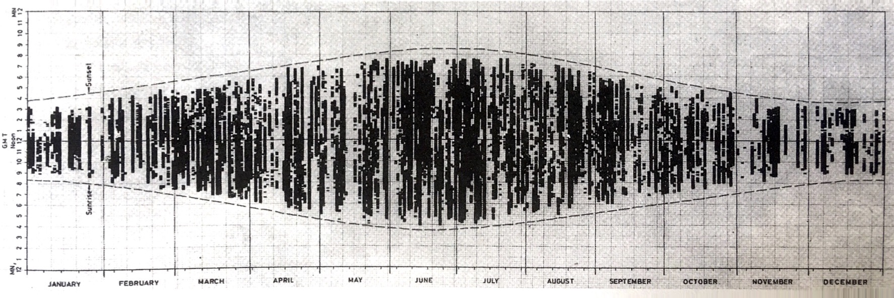
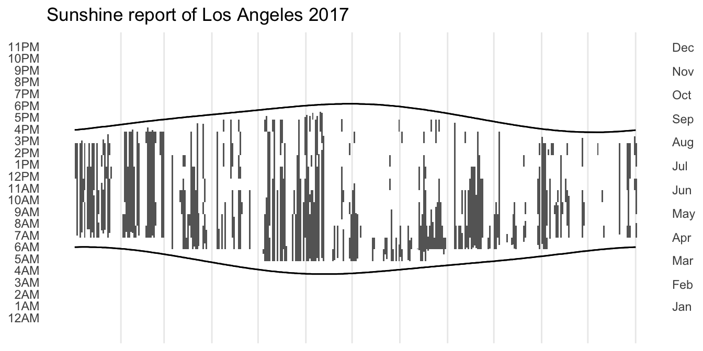
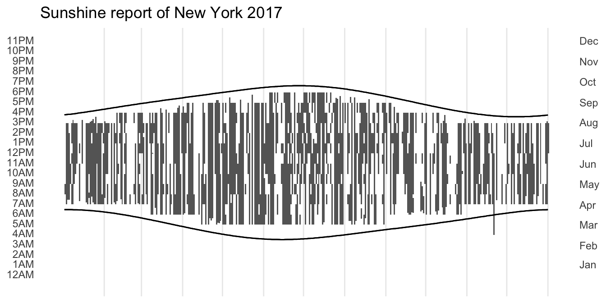

::: {.callout-note}
This code has been lightly revised to make sure it works as of 2018-12-16.
:::

Hello again! I this mini-series (of in-determined length) will I try as best as I can to recreate great visualizations in tidyverse. The recreation may be exact in terms of data or using data of a similar style. 

## The goal - An annual sunshine record report

I have recently read [The Visual Display of Quantitative Information](https://www.edwardtufte.com/tufte/books_vdqi) by Edward R Tufte, which I highly recommend. In the book the following chart was displayed which showed the sunshine record for each day of the year.  




F.J. Monkhouse and H.R. Wilkinson, *Maps and Diagrams* (London, third edition 1971), 242-243.  

The goal for the rest of this post is to create something similar. Since we don't have direct access to the data, we will scrape some data for ourselves. All code will be shown together at the end of the post and this [gist](https://gist.github.com/EmilHvitfeldt/53e5e33a0ebc5e084dcbcdefacb8ed9a)

## R packages

First, we need some packages


```r
library(rvest)
library(tidyverse)
library(lubridate)
library(glue)
library(ehlib) # devtools::install_github("EmilHvitfeldt/ehlib")
```

The last package is my [personal R package](https://hilaryparker.com/2013/04/03/personal-r-packages/) [ehlib](https://github.com/EmilHvitfeldt/ehlib) where I store some frequently used functions. If you do not wish to install/load this package just run the following code:


```r
str_between <- function(string, start, end) {
  stringr::str_extract(string,
                       stringr::str_c(start, '(.*?)', end, collapse = '')) %>%
    stringr::str_replace(start, "") %>%
    stringr::str_replace(end, "")
}

str_before <- function(string, pattern) {
  stringr::str_extract(string, stringr::str_c(".+?(?=", pattern, ")"))
}
```

## Data collection

So for this production, we need Weather information. But more specifically we need information about if the sun is shining for various times during the day, preferable for all days of the year. In addition, sunrise and sunset times are also needed.

We will be scraping weather history from [wunderground](https://www.wunderground.com). On the button of the page <https://www.wunderground.com/history/airport/KCQT/2018/1/1/DailyHistory.html>, we locate a table with "Time" and "Conditions". Furthermore, both sunrise and sunset times are present on the page.

For the website, we need an airport code, year, month, and day. Airport codes will have to be found manually by browsing the website. For a vector of all the days in a given year, we use the following function that uses


```r
all_dates_in <- function(year) {
  if(ymd(glue::glue("{year}0101")) > as.Date(Sys.time())) {
    stop("Please select a past or current year.")
  }
  
  start <- ymd(glue::glue("{year}0101"))
  
  if(as.Date(Sys.time()) > ymd(glue::glue("{year}1231"))) {
    end <- ymd(glue::glue("{year}1231"))
  } else {
    end <- as.Date(Sys.time())
  }
  
  seq(start, end, by = "day")
}
```

this function will work even if you pick a year that has not ended yet. As 2017 has just ended I thought it would be appropriate to look back on that year.


```r
year <- 2017
dates <- all_dates_in(year)
head(dates)
## [1] "2017-01-01" "2017-01-02" "2017-01-03" "2017-01-04" "2017-01-05"
## [6] "2017-01-06"
```

next, we have a little function that creates a URL from the airport code and the date. For safety, we will wrap that function in `purrr::safely`.


```r
weather_data_html <- function(date, code) {
  url <- str_c("https://www.wunderground.com/history/airport/", code, "/",
               year(date), "/", month(date), "/", mday(date), "/DailyHistory.html")
  
  html_url <- read_html(url)
}

weather_data_html <- purrr::safely(weather_data_html)
```

For this code-though will be using airport code KCQT, which is placed in Los Angeles Downtown, CA. 


We add some ‘crawl-delay’ of 5 seconds and let it run. Please remember that this will take over 30 minutes to run with a delay in place but we do it to be nice.


```r
airport_code <- "KCQT"

full_data <- map(dates, ~{
  weather_data_html(.x, airport_code)
  Sys.sleep(5)
  cat(month(.x), "/", mday(.x), "\n", sep = "")
  })
```

We can check whether all of the links went through.


```r
map_lgl(full_data, ~ is.null(.x$error))
```

## Data wrangling

Since we will be working with times quite a lot in the section we will use the `lubridate` package for quite some time. In addition to that package, I have devised the following function to turn something of the form "2:51 PM" into the number of minutes after midnight.


```r
ampm_minutes <- function(x) {
  as.numeric(str_between(x, ":", " ")) +
  as.numeric(str_replace(str_before(x, ":"), "12", "0")) * 60 +
  60 * 12 * str_detect(x, "PM")
}
```

Next, we have the main wrangling function that takes the input, extracts the sunrise, sunset times, and adds them to the table that is also extracted.


```r
data_wrangling <- function(html_url, date) {
  
  # Sun rise time
    sun_rise <- html_url %>%
    html_nodes('div[id="astronomy-mod"] table') %>%
    html_text() %>%
    .[1] %>%
    str_between("Time\n\t\t", "\n\t\t")
  # Sun set time
  sun_set <- html_url %>%
    html_nodes('div[id="astronomy-mod"] table') %>%
    html_text() %>%
    .[1] %>%
    str_between("\n\t\t", "\n\t\tCivil")

  # Table
  table <- html_url %>%
    html_nodes('table[id="obsTable"]') %>%
    html_table() %>% 
    .[[1]]
  
  # Time column standardization 
  is_daylight <- any("Time (PDT)" == names(table),
                     "Time (MDT)" == names(table),
                     "Time (CDT)" == names(table),
                     "Time (EDT)" == names(table))
  
  time_names <- str_c("Time", c(" (PDT)", " (MDT)", " (CDT)", " (EDT)",
                                " (PST)", " (MST)", " (CST)", " (EST)"))
  
  names(table) <- if_else(names(table) %in% time_names,
                          "Time",
                          names(table))
  
  table %>%
    mutate(sun_set = sun_set,
           sun_rise = sun_rise,
           date = date,
           yday = yday(date), 
           day_minutes = ampm_minutes(Time) - is_daylight * 60,
           set_minutes = ampm_minutes(sun_set) - is_daylight * 60,
           rise_minutes = ampm_minutes(sun_rise) - is_daylight * 60,
           sun_up = day_minutes > (rise_minutes + 90) & 
                    day_minutes < (set_minutes - 30))
}
```

In this function, we arbitrarily decide that the sun is up if it is 90 minutes after sunrise and 30 minutes before sunset. This is done because our future visualization is being made with rectangles and the `lag` function, and to ensure that all the sunshine hours are within sunset and sunrise we have to put in some restrains. 

It seems that the 30th of October doesn't have hourly history data available so we will exclude it in the following:


```r
full_data2 <- map2_df(full_data[-303], dates[-303], ~ .x$result %>%
                      data_wrangling(.y))
```

At this point, it would be wise to save our data.


```r
save(full_data2, file = glue("{airport_code}-{year}.Rdata"))
```


## Plotting data

Now that we have all the data we need it is time to turn our heads to ggplot2. But before we do that let us create some axis breaks that we will need.


```r
x_axis <- dates %>% month() %>% table() %>% cumsum()
names(x_axis) <- month.abb[1:12]

y_axis <- 1:24 * 60
names(y_axis) <- str_c(c(12, rep(1:12, 2, length.out = 23)), 
                       rep(c("AM", "PM"), each = 12))
```

So we start by creating a new condition for "Clear", creating a new day_minutes variable to act as the other side for our sunshine rectangles and lastly remove all the observations where the sun isn't up. Using `geom_rect()` to create all the little rectangles and `geom_line()`'s to show the sun set and sun rise, we lastly fiddle a little with the theme giving us the final result:


```r
full_data2 %>%
  mutate(con = Conditions == "Clear",
         day_minutes2 = lag(day_minutes)) %>%
  filter(sun_up) %>%
  ggplot(aes(fill = con)) +
  geom_rect(aes(xmin = yday, xmax = yday + 1,
                ymin = day_minutes, ymax = day_minutes2)) +
  geom_line(aes(yday, set_minutes)) +
  geom_line(aes(yday, rise_minutes)) +
  scale_fill_manual(values = c("grey40", NA)) +
  theme_minimal() +
  guides(fill = "none") +
  theme(
  panel.grid.major.y = element_blank(),
  panel.grid.minor.y = element_blank(),
  panel.grid.minor.x = element_blank(), 
  axis.text.x.bottom = element_text(hjust = 1.7)
  ) +
  scale_x_continuous(breaks = x_axis, position = "right") +
  scale_y_continuous(breaks = y_axis, limits = c(0, 24 * 60)) +
  labs(x = NULL, y = NULL, title = "Sunshine report of Los Angeles 2017")
## Warning: Position guide is perpendicular to the intended axis. Did you mean to
## specify a different guide `position`?
```



## Extra 


```
## Warning: Position guide is perpendicular to the intended axis. Did you mean to
## specify a different guide `position`?
```



## Code


```r
library(rvest)
library(tidyverse)
library(lubridate)
library(glue)
#library(ehlib) # devtools::install_github("EmilHvitfeldt/ehlib")

str_between <- function(string, start, end) {
  stringr::str_extract(string,
                       stringr::str_c(start, '(.*?)', end, collapse = '')) %>%
    stringr::str_replace(start, "") %>%
    stringr::str_replace(end, "")
}

str_before <- function(string, pattern) {
  stringr::str_extract(string, stringr::str_c(".+?(?=", pattern, ")"))
}

all_dates_in <- function(year) {
  if(ymd(glue::glue("{year}0101")) > as.Date(Sys.time())) {
    stop("Please select a past or current year.")
  }
  
  start <- ymd(glue::glue("{year}0101"))
  
  if(as.Date(Sys.time()) > ymd(glue::glue("{year}1231"))) {
    end <- ymd(glue::glue("{year}1231"))
  } else {
    end <- as.Date(Sys.time())
  }
  
  seq(start, end, by = "day")
}

airport_code <- "KCQT"

full_data <- map(dates, ~{
  weather_data_html(.x, airport_code)
  Sys.sleep(5)
  cat(month(dates), "/", mday(dates), "\n", sep = "")
  })

map_lgl(full_data, ~ is.null(.x$error))

ampm_minutes <- function(x) {
  as.numeric(str_between(x, ":", " ")) +
  as.numeric(str_replace(str_before(x, ":"), "12", "0")) * 60 +
  60 * 12 * str_detect(x, "PM")
}

data_wrangling <- function(html_url, date) {
  
  # Sun rise time
    sun_rise <- html_url %>%
    html_nodes('div[id="astronomy-mod"] table') %>%
    html_text() %>%
    .[1] %>%
    str_between("Time\n\t\t", "\n\t\t")
  # Sun set time
  sun_set <- html_url %>%
    html_nodes('div[id="astronomy-mod"] table') %>%
    html_text() %>%
    .[1] %>%
    str_between("\n\t\t", "\n\t\tCivil")

  # Table
  table <- html_url %>%
    html_nodes('table[id="obsTable"]') %>%
    html_table() %>% 
    .[[1]]
  
  # Time column standardization 
  is_daylight <- any("Time (PDT)" == names(table),
                     "Time (MDT)" == names(table),
                     "Time (CDT)" == names(table),
                     "Time (EDT)" == names(table))
  
  time_names <- str_c("Time", c(" (PDT)", " (MDT)", " (CDT)", " (EDT)",
                                " (PST)", " (MST)", " (CST)", " (EST)"))
  
  names(table) <- if_else(names(table) %in% time_names,
                          "Time",
                          names(table))
  
  table %>%
    mutate(sun_set = sun_set,
           sun_rise = sun_rise,
           date = date,
           yday = yday(date), 
           day_minutes = ampm_minutes(Time) - is_daylight * 60,
           set_minutes = ampm_minutes(sun_set) - is_daylight * 60,
           rise_minutes = ampm_minutes(sun_rise) - is_daylight * 60,
           sun_up = day_minutes > (rise_minutes + 90) & 
                    day_minutes < (set_minutes - 30))
}

full_data2 <- map2_df(full_data[-303], dates[-303], ~ .x$result %>%
                      data_wrangling(.y))

x_axis <- dates %>% month() %>% table() %>% cumsum()
names(x_axis) <- month.abb[1:12]

y_axis <- 1:24 * 60
names(y_axis) <- str_c(c(12, rep(1:12, 2, length.out = 23)), 
                       rep(c("AM", "PM"), each = 12))

full_data2 %>%
  mutate(con = Conditions == "Clear",
         day_minutes2 = lag(day_minutes)) %>%
  filter(sun_up) %>%
  ggplot(aes(fill = con)) +
  geom_rect(aes(xmin = yday, xmax = yday + 1,
                ymin = day_minutes, ymax = day_minutes2)) +
  geom_line(aes(yday, set_minutes)) +
  geom_line(aes(yday, rise_minutes)) +
  scale_fill_manual(values = c("grey40", NA)) +
  theme_minimal() +
  guides(fill = "none") +
  theme(
  panel.grid.major.y = element_blank(),
  panel.grid.minor.y = element_blank(),
  panel.grid.minor.x = element_blank(), 
  axis.text.x.bottom = element_text(hjust = 1.7)
  ) +
  scale_x_continuous(breaks = x_axis, position = "right") +
  scale_y_continuous(breaks = y_axis, limits = c(0, 24 * 60)) +
  labs(x = NULL, y = NULL, title = "Sunshine report of Los Angeles 2017")
```

<details closed>
<summary> <span title='Click to Expand'> session information </span> </summary>

```r

─ Session info ───────────────────────────────────────────────────────────────
 setting  value                       
 version  R version 4.0.5 (2021-03-31)
 os       macOS Big Sur 10.16         
 system   x86_64, darwin17.0          
 ui       X11                         
 language (EN)                        
 collate  en_US.UTF-8                 
 ctype    en_US.UTF-8                 
 tz       Pacific/Honolulu            
 date     2021-07-05                  

─ Packages ───────────────────────────────────────────────────────────────────
 package     * version date       lib source                              
 assertthat    0.2.1   2019-03-21 [1] CRAN (R 4.0.0)                      
 backports     1.2.1   2020-12-09 [1] CRAN (R 4.0.2)                      
 blogdown      1.3     2021-04-14 [1] CRAN (R 4.0.2)                      
 bookdown      0.22    2021-04-22 [1] CRAN (R 4.0.2)                      
 broom         0.7.6   2021-04-05 [1] CRAN (R 4.0.2)                      
 bslib         0.2.5.1 2021-05-18 [1] CRAN (R 4.0.2)                      
 cellranger    1.1.0   2016-07-27 [1] CRAN (R 4.0.0)                      
 cli           3.0.0   2021-06-30 [1] CRAN (R 4.0.2)                      
 clipr         0.7.1   2020-10-08 [1] CRAN (R 4.0.2)                      
 colorspace    2.0-2   2021-06-24 [1] CRAN (R 4.0.2)                      
 crayon        1.4.1   2021-02-08 [1] CRAN (R 4.0.2)                      
 DBI           1.1.1   2021-01-15 [1] CRAN (R 4.0.2)                      
 dbplyr        2.1.1   2021-04-06 [1] CRAN (R 4.0.2)                      
 desc          1.3.0   2021-03-05 [1] CRAN (R 4.0.2)                      
 details     * 0.2.1   2020-01-12 [1] CRAN (R 4.0.0)                      
 digest        0.6.27  2020-10-24 [1] CRAN (R 4.0.2)                      
 dplyr       * 1.0.7   2021-06-18 [1] CRAN (R 4.0.2)                      
 ehlib       * 0.2.7   2021-07-05 [1] Github (emilhvitfeldt/ehlib@8c40172)
 ellipsis      0.3.2   2021-04-29 [1] CRAN (R 4.0.2)                      
 evaluate      0.14    2019-05-28 [1] CRAN (R 4.0.0)                      
 fansi         0.5.0   2021-05-25 [1] CRAN (R 4.0.2)                      
 forcats     * 0.5.1   2021-01-27 [1] CRAN (R 4.0.2)                      
 fs            1.5.0   2020-07-31 [1] CRAN (R 4.0.2)                      
 generics      0.1.0   2020-10-31 [1] CRAN (R 4.0.2)                      
 ggplot2     * 3.3.5   2021-06-25 [1] CRAN (R 4.0.2)                      
 glue        * 1.4.2   2020-08-27 [1] CRAN (R 4.0.2)                      
 gtable        0.3.0   2019-03-25 [1] CRAN (R 4.0.0)                      
 haven         2.4.1   2021-04-23 [1] CRAN (R 4.0.2)                      
 hms           1.1.0   2021-05-17 [1] CRAN (R 4.0.2)                      
 htmltools     0.5.1.1 2021-01-22 [1] CRAN (R 4.0.2)                      
 httr          1.4.2   2020-07-20 [1] CRAN (R 4.0.2)                      
 jquerylib     0.1.4   2021-04-26 [1] CRAN (R 4.0.2)                      
 jsonlite      1.7.2   2020-12-09 [1] CRAN (R 4.0.2)                      
 knitr       * 1.33    2021-04-24 [1] CRAN (R 4.0.2)                      
 lifecycle     1.0.0   2021-02-15 [1] CRAN (R 4.0.2)                      
 lubridate   * 1.7.10  2021-02-26 [1] CRAN (R 4.0.2)                      
 magrittr      2.0.1   2020-11-17 [1] CRAN (R 4.0.2)                      
 modelr        0.1.8   2020-05-19 [1] CRAN (R 4.0.0)                      
 munsell       0.5.0   2018-06-12 [1] CRAN (R 4.0.0)                      
 pillar        1.6.1   2021-05-16 [1] CRAN (R 4.0.2)                      
 pkgconfig     2.0.3   2019-09-22 [1] CRAN (R 4.0.0)                      
 png           0.1-7   2013-12-03 [1] CRAN (R 4.0.0)                      
 purrr       * 0.3.4   2020-04-17 [1] CRAN (R 4.0.0)                      
 R6            2.5.0   2020-10-28 [1] CRAN (R 4.0.2)                      
 Rcpp          1.0.6   2021-01-15 [1] CRAN (R 4.0.2)                      
 readr       * 1.4.0   2020-10-05 [1] CRAN (R 4.0.2)                      
 readxl        1.3.1   2019-03-13 [1] CRAN (R 4.0.2)                      
 reprex        2.0.0   2021-04-02 [1] CRAN (R 4.0.2)                      
 rlang         0.4.11  2021-04-30 [1] CRAN (R 4.0.2)                      
 rmarkdown     2.9     2021-06-15 [1] CRAN (R 4.0.2)                      
 rprojroot     2.0.2   2020-11-15 [1] CRAN (R 4.0.2)                      
 rstudioapi    0.13    2020-11-12 [1] CRAN (R 4.0.2)                      
 rvest       * 1.0.0   2021-03-09 [1] CRAN (R 4.0.2)                      
 sass          0.4.0   2021-05-12 [1] CRAN (R 4.0.2)                      
 scales        1.1.1   2020-05-11 [1] CRAN (R 4.0.0)                      
 sessioninfo   1.1.1   2018-11-05 [1] CRAN (R 4.0.0)                      
 stringi       1.6.2   2021-05-17 [1] CRAN (R 4.0.2)                      
 stringr     * 1.4.0   2019-02-10 [1] CRAN (R 4.0.0)                      
 tibble      * 3.1.2   2021-05-16 [1] CRAN (R 4.0.2)                      
 tidyr       * 1.1.3   2021-03-03 [1] CRAN (R 4.0.2)                      
 tidyselect    1.1.1   2021-04-30 [1] CRAN (R 4.0.2)                      
 tidyverse   * 1.3.1   2021-04-15 [1] CRAN (R 4.0.2)                      
 utf8          1.2.1   2021-03-12 [1] CRAN (R 4.0.2)                      
 vctrs         0.3.8   2021-04-29 [1] CRAN (R 4.0.2)                      
 withr         2.4.2   2021-04-18 [1] CRAN (R 4.0.2)                      
 xfun          0.23    2021-05-15 [1] CRAN (R 4.0.2)                      
 xml2          1.3.2   2020-04-23 [1] CRAN (R 4.0.0)                      
 yaml          2.2.1   2020-02-01 [1] CRAN (R 4.0.0)                      

[1] /Library/Frameworks/R.framework/Versions/4.0/Resources/library

```

</details>
<br>
