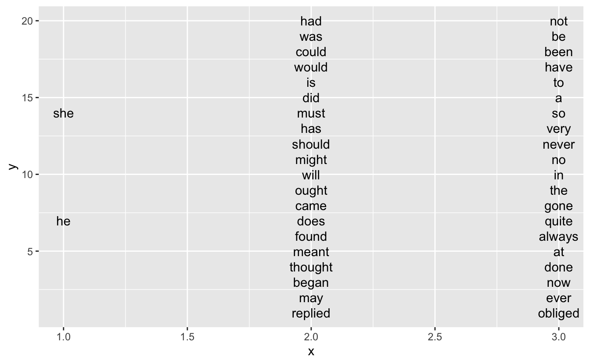
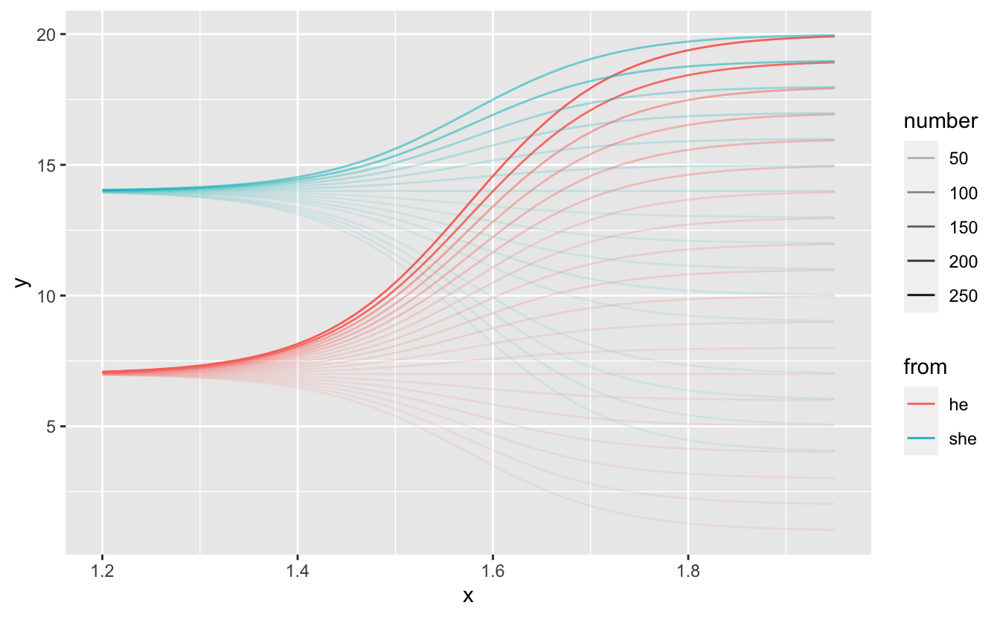
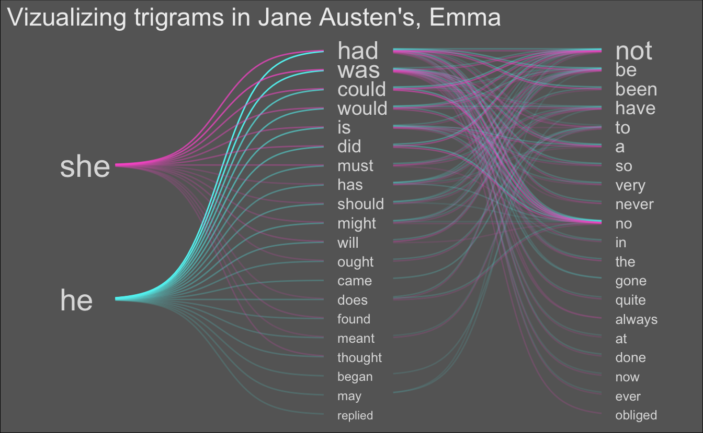
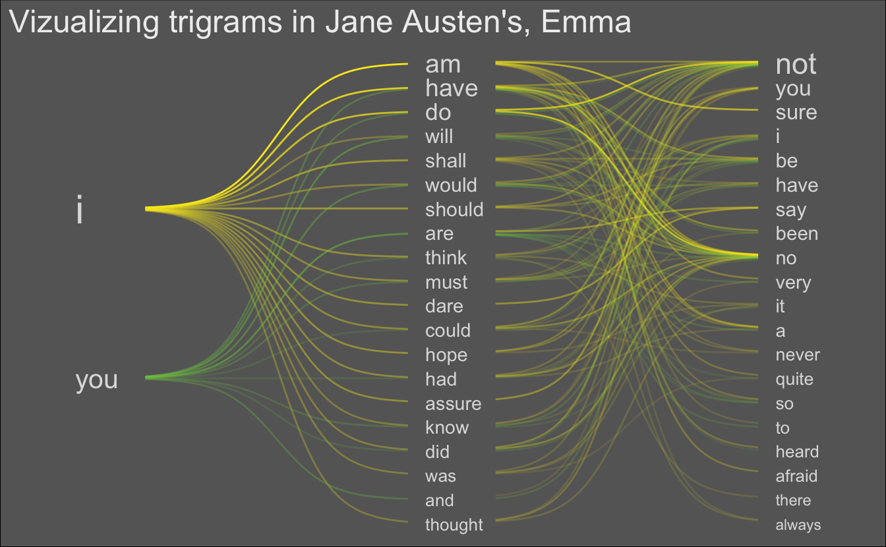
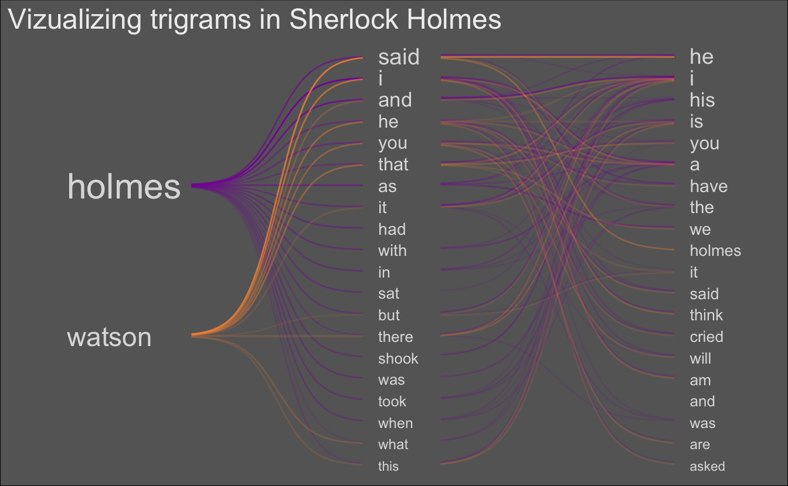

<script src="index_files/twitter-widget/widgets.js"></script>

<div class="note">

This code has been lightly revised to make sure it works as of 2018-12-16.

</div>

In this post I’ll go through how I created the data visualization I posted yesterday on Twitter:

<blockquote class="twitter-tweet" data-width="550" data-lang="en" data-dnt="true" data-theme="light"><p lang="en" dir="ltr">Trying something new! Visualizing top trigrams in Jane Austen&#39;s Emma using <a href="https://twitter.com/hashtag/tidytext?src=hash&amp;ref_src=twsrc%5Etfw">#tidytext</a> and <a href="https://twitter.com/hashtag/tidyverse?src=hash&amp;ref_src=twsrc%5Etfw">#tidyverse</a>! Blogpost coming soon! 🤗 <a href="https://twitter.com/hashtag/rstats?src=hash&amp;ref_src=twsrc%5Etfw">#rstats</a> <a href="https://twitter.com/hashtag/dataviz?src=hash&amp;ref_src=twsrc%5Etfw">#dataviz</a> <a href="https://t.co/Sy1fQJB5Ih">pic.twitter.com/Sy1fQJB5Ih</a></p>&mdash; Emil Hvitfeldt (@Emil_Hvitfeldt) <a href="https://twitter.com/Emil_Hvitfeldt/status/955675169422327808?ref_src=twsrc%5Etfw">January 23, 2018</a></blockquote>

## What am I looking at?

So for this particular data-viz I took the novel Emma by Jane Austen, extracted all the trigrams (sentences of length 3), took the 150 most frequent ones, and visualized those.

This visualization is a layered horizontal tree graph where the 3 levels (vertical columns of words) correspond to words that appear at the nth place in the trigrams, e.g. first column has the first words of the trigram, the second column has middle words of trigrams, etc. Up to 20 words in each column are kept and they are ordered and sized according to occurrence in the data.

The curves represent how often two words co-occur, with the color representing starting word and transparency related to frequency.

All code is presented in the following [gist](https://gist.github.com/EmilHvitfeldt/f69a65436915ff8b0406cdd27a194e28).

## Packages and parameters

We will be using the following packages:

``` r
library(tidyverse)
library(tidytext)
library(purrrlyr)
```

And the overall parameters outlined in description are defined here:

``` r
n_word <- 20
n_top <- 150
n_gramming <- 3
```

## Trigrams

If you have read [Text Mining with R](https://www.tidytextmining.com/) I’m sure you have encountered the `janeaustenr` package. We will use the Emma novel, and `tidytext`’s `unnest_tokens` to calculate the trigrams we need. We also specify the starting words.

``` r
trigrams <- tibble(text = janeaustenr::emma) %>%
  unnest_tokens(trigram, text, token = "ngrams", n = n_gramming)

start_words <- c("he", "she")
```

next, we find the top 150 trigrams using `count` and some regex magic. And we use those top words to filter such that we only will be looking at the top 150.

``` r
pattern <- str_c("^", start_words, " ", collapse = "|")
top_words <- trigrams %>%
  filter(str_detect(trigram, pattern)) %>%
  count(trigram, sort = TRUE) %>%
  slice(seq_len(n_top)) %>%
  pull(trigram)

trigrams <- trigrams %>%
  filter(trigram %in% top_words)
```

## Nodes

Since we know that each trigram has a sample format, we can create a simple function to extract the nth word in a string.

``` r
str_nth_word <- function(x, n, sep = " ") {
  str_split(x, pattern = " ") %>%
  map_chr(~ .x[n])
}
```

The following `purrr::map_df`

1.  Extracts the nth word in the trigram  
2.  Counts and sorts the occurrences  
3.  Grabs the top 20 words
4.  Equally space them along the y-axis

``` r
nodes <- map_df(seq_len(n_gramming),
       ~ trigrams %>%
           mutate(word = str_nth_word(trigram, .x)) %>%
           count(word, sort = TRUE) %>%
           slice(seq_len(n_word)) %>% 
           mutate(y = seq(from = n_word + 1, to = 0, 
                          length.out = n() + 2)[seq_len(n()) + 1],
                  x = .x))
```

### plot of node positions

Lets see the words so far:

``` r
nodes %>% 
  ggplot(aes(x, y, label = word)) +
  geom_text()
```



## Edges

When we look at the final visualization we see that the words are connected by curved lines. I achieved that by using a sigmoid curve and then transform it to match the starting and endpoints.

``` r
sigmoid <- function(x_from, x_to, y_from, y_to, scale = 5, n = 100) {
  x <- seq(-scale, scale, length = n)
  y <- exp(x) / (exp(x) + 1)
  tibble(x = (x + scale) / (scale * 2) * (x_to - x_from) + x_from,
         y = y * (y_to - y_from) + y_from)
}
```

The following function takes

-   a list of trigrams
-   a data.frame of “from” nodes
-   a data.frame of “to” nodes

and returns a data.frame containing the data points for the curves we need to draw with correct starting and ending points.

``` r
egde_lines <- function(trigram, from_word, to_word, scale = 5, n = 50, 
                       x_space = 0) {

  from_word <- from_word %>%
    select(-n) %>%
    set_names(c("from", "y_from", "x_from"))
  
  to_word <- to_word %>%
    select(-n) %>%
    set_names(c("to", "y_to", "x_to"))
  
  links <- crossing(from = from_word$from, 
                    to = to_word$to) %>%
    mutate(word_pair = paste(from, to),
           number = map_dbl(word_pair, 
                            ~ sum(str_detect(trigram$trigram, .x)))) %>%
    left_join(from_word, by = "from") %>%
    left_join(to_word, by = "to")
  
  links %>%
    by_row(~ sigmoid(x_from = .x$x_from + 0.2 + x_space,
                     x_to = .x$x_to - 0.05, 
                     y_from = .x$y_from, y_to = .x$y_to, 
                     scale = scale, n = n) %>%
    mutate(word_pair = .x$word_pair,
           number = .x$number,
           from = .x$from)) %>%
    pull(.out) %>%
    bind_rows()
}
```

### plot of the first set of edges

Let’s take a look at the first set of edges to see if it is working.

``` r
egde_lines(trigram = trigrams, 
           from_word = filter(nodes, x == 1), 
           to_word = filter(nodes, x == 2)) %>%
  filter(number > 0) %>%
  ggplot(aes(x, y, group = word_pair, alpha = number, color = from)) +
  geom_line()
```



### Calculating all egdes

For ease (and laziness) I have desired to calculate the edges in sections

-   edges between the first and second column
-   edges between the second and third column for words that start with “he”
-   edges between the second and third columns for words that start with “she”

and combine by the end.

``` r
# egdes between first and second column
egde1 <- egde_lines(trigram = trigrams, 
           from_word = filter(nodes, x == 1), 
           to_word = filter(nodes, x == 2), 
           n = 50) %>%
           filter(number > 0) %>%
  mutate(id = word_pair)

# Words in second colunm
## That start with he
second_word_he <- nodes %>%
  filter(x == 2) %>%
  select(-n) %>%
  left_join(
    trigrams %>% 
      filter(str_nth_word(trigram, 1) == start_words[1]) %>%
      mutate(word = str_nth_word(trigram, 2)) %>%
      count(word), 
    by = "word"
  ) %>%
  replace_na(list(n = 0))

## That start with she
second_word_she <- nodes %>%
  filter(x == 2) %>%
  select(-n) %>%
  left_join(
    trigrams %>% 
      filter(str_nth_word(trigram, 1) == start_words[2]) %>%
      mutate(word = str_nth_word(trigram, 2)) %>%
      count(word), 
    by = "word"
  ) %>%
  replace_na(list(n = 0))

# Words in third colunm
## That start with he
third_word_he <- nodes %>%
  filter(x == 3) %>%
  select(-n) %>%
  left_join(
    trigrams %>% 
      filter(str_nth_word(trigram, 1) == start_words[1]) %>%
      mutate(word = str_nth_word(trigram, 3)) %>%
      count(word), 
    by = "word"
  ) %>%
  replace_na(list(n = 0))

## That start with she
third_word_she <- nodes %>%
  filter(x == 3) %>%
  select(-n) %>%
  left_join(
    trigrams %>% 
      filter(str_nth_word(trigram, 1) == start_words[2]) %>%
      mutate(word = str_nth_word(trigram, 3)) %>%
      count(word), 
    by = "word"
  ) %>%
  replace_na(list(n = 0))

# egdes between second and third column that starts with he
egde2_he <- egde_lines(filter(trigrams, 
                              str_detect(trigram, paste0("^", start_words[1], " "))), 
             second_word_he, third_word_he, n = 50) %>%
  mutate(y = y + 0.05,
         from = start_words[1],
         id = str_c(from, word_pair, sep = " ")) %>%
  filter(number > 0)

# egdes between second and third column that starts with she
egde2_she <- egde_lines(filter(trigrams, 
                              str_detect(trigram, paste0("^", start_words[2], " "))), 
             second_word_she, third_word_she, n = 50) %>%
  mutate(y = y - 0.05,
         from = start_words[2],
         id = str_c(from, word_pair, sep = " ")) %>%
  filter(number > 0)

# All edges
edges <- bind_rows(egde1, egde2_he, egde2_she)
```

## vizualisation

Now we just add it all together. All labels, change colors, adjust `xlim` to fit words on the page.

``` r
p <- nodes %>% 
  ggplot(aes(x, y, label = word, size = n)) +
  geom_text(hjust = 0, color = "#DDDDDD") +
  theme_void() +
  geom_line(data = edges,
            aes(x, y, group = id, color = from, alpha = sqrt(number)),
            inherit.aes = FALSE) +
  theme(plot.background = element_rect(fill = "#666666", colour = 'black'),
        text = element_text(color = "#EEEEEE", size = 15)) +
  guides(alpha = "none", color = "none", size = "none") +
  xlim(c(0.9, 3.2)) +
  scale_color_manual(values = c("#5EF1F1", "#FA62D0")) +
  labs(title = " Vizualizing trigrams in Jane Austen's, Emma") + 
  scale_size(range = c(3, 8))
p
```



## Notes

There are a couple of differences between the Viz I posted online yesterday and the result here in this post due to a couple of mistakes found in the code during cleanup.

## Extra vizualisations

``` r
n_word <- 20
n_top <- 150
n_gramming <- 3

trigrams <- tibble(text = janeaustenr::emma) %>%
  unnest_tokens(trigram, text, token = "ngrams", n = n_gramming)

start_words <- c("i", "you")
```



``` r
n_word <- 20
n_top <- 150
n_gramming <- 3

library(rvest)
sherlock_holmes <- read_html("https://sherlock-holm.es/stories/plain-text/cnus.txt") %>%
  html_text() %>% 
  str_split("\n") %>%
  unlist()

trigrams <- tibble(text = sherlock_holmes) %>%
  unnest_tokens(trigram, text, token = "ngrams", n = n_gramming)

start_words <- c("holmes", "watson")
```



<details closed>
<summary>
<span title="Click to Expand"> session information </span>
</summary>

``` r
─ Session info ───────────────────────────────────────────────────────────────
 setting  value                       
 version  R version 4.0.5 (2021-03-31)
 os       macOS Big Sur 10.16         
 system   x86_64, darwin17.0          
 ui       X11                         
 language (EN)                        
 collate  en_US.UTF-8                 
 ctype    en_US.UTF-8                 
 tz       Pacific/Honolulu            
 date     2021-07-05                  

─ Packages ───────────────────────────────────────────────────────────────────
 package     * version date       lib source        
 assertthat    0.2.1   2019-03-21 [1] CRAN (R 4.0.0)
 backports     1.2.1   2020-12-09 [1] CRAN (R 4.0.2)
 blogdown      1.3     2021-04-14 [1] CRAN (R 4.0.2)
 bookdown      0.22    2021-04-22 [1] CRAN (R 4.0.2)
 broom         0.7.6   2021-04-05 [1] CRAN (R 4.0.2)
 bslib         0.2.5.1 2021-05-18 [1] CRAN (R 4.0.2)
 cellranger    1.1.0   2016-07-27 [1] CRAN (R 4.0.0)
 cli           3.0.0   2021-06-30 [1] CRAN (R 4.0.2)
 clipr         0.7.1   2020-10-08 [1] CRAN (R 4.0.2)
 codetools     0.2-18  2020-11-04 [1] CRAN (R 4.0.5)
 colorspace    2.0-2   2021-06-24 [1] CRAN (R 4.0.2)
 crayon        1.4.1   2021-02-08 [1] CRAN (R 4.0.2)
 curl          4.3.2   2021-06-23 [1] CRAN (R 4.0.2)
 DBI           1.1.1   2021-01-15 [1] CRAN (R 4.0.2)
 dbplyr        2.1.1   2021-04-06 [1] CRAN (R 4.0.2)
 desc          1.3.0   2021-03-05 [1] CRAN (R 4.0.2)
 details     * 0.2.1   2020-01-12 [1] CRAN (R 4.0.0)
 digest        0.6.27  2020-10-24 [1] CRAN (R 4.0.2)
 dplyr       * 1.0.7   2021-06-18 [1] CRAN (R 4.0.2)
 ellipsis      0.3.2   2021-04-29 [1] CRAN (R 4.0.2)
 evaluate      0.14    2019-05-28 [1] CRAN (R 4.0.0)
 fansi         0.5.0   2021-05-25 [1] CRAN (R 4.0.2)
 farver        2.1.0   2021-02-28 [1] CRAN (R 4.0.2)
 forcats     * 0.5.1   2021-01-27 [1] CRAN (R 4.0.2)
 fs            1.5.0   2020-07-31 [1] CRAN (R 4.0.2)
 generics      0.1.0   2020-10-31 [1] CRAN (R 4.0.2)
 ggplot2     * 3.3.5   2021-06-25 [1] CRAN (R 4.0.2)
 glue          1.4.2   2020-08-27 [1] CRAN (R 4.0.2)
 gtable        0.3.0   2019-03-25 [1] CRAN (R 4.0.0)
 haven         2.4.1   2021-04-23 [1] CRAN (R 4.0.2)
 highr         0.9     2021-04-16 [1] CRAN (R 4.0.2)
 hms           1.1.0   2021-05-17 [1] CRAN (R 4.0.2)
 htmltools     0.5.1.1 2021-01-22 [1] CRAN (R 4.0.2)
 httr          1.4.2   2020-07-20 [1] CRAN (R 4.0.2)
 janeaustenr   0.1.5   2017-06-10 [1] CRAN (R 4.0.0)
 jquerylib     0.1.4   2021-04-26 [1] CRAN (R 4.0.2)
 jsonlite      1.7.2   2020-12-09 [1] CRAN (R 4.0.2)
 knitr       * 1.33    2021-04-24 [1] CRAN (R 4.0.2)
 labeling      0.4.2   2020-10-20 [1] CRAN (R 4.0.2)
 lattice       0.20-41 2020-04-02 [1] CRAN (R 4.0.5)
 lifecycle     1.0.0   2021-02-15 [1] CRAN (R 4.0.2)
 lubridate     1.7.10  2021-02-26 [1] CRAN (R 4.0.2)
 magrittr      2.0.1   2020-11-17 [1] CRAN (R 4.0.2)
 Matrix        1.3-2   2021-01-06 [1] CRAN (R 4.0.5)
 modelr        0.1.8   2020-05-19 [1] CRAN (R 4.0.0)
 munsell       0.5.0   2018-06-12 [1] CRAN (R 4.0.0)
 pillar        1.6.1   2021-05-16 [1] CRAN (R 4.0.2)
 pkgconfig     2.0.3   2019-09-22 [1] CRAN (R 4.0.0)
 png           0.1-7   2013-12-03 [1] CRAN (R 4.0.0)
 purrr       * 0.3.4   2020-04-17 [1] CRAN (R 4.0.0)
 purrrlyr    * 0.0.7   2020-12-16 [1] CRAN (R 4.0.2)
 R6            2.5.0   2020-10-28 [1] CRAN (R 4.0.2)
 Rcpp          1.0.6   2021-01-15 [1] CRAN (R 4.0.2)
 readr       * 1.4.0   2020-10-05 [1] CRAN (R 4.0.2)
 readxl        1.3.1   2019-03-13 [1] CRAN (R 4.0.2)
 reprex        2.0.0   2021-04-02 [1] CRAN (R 4.0.2)
 rlang         0.4.11  2021-04-30 [1] CRAN (R 4.0.2)
 rmarkdown     2.9     2021-06-15 [1] CRAN (R 4.0.2)
 rprojroot     2.0.2   2020-11-15 [1] CRAN (R 4.0.2)
 rstudioapi    0.13    2020-11-12 [1] CRAN (R 4.0.2)
 rvest       * 1.0.0   2021-03-09 [1] CRAN (R 4.0.2)
 sass          0.4.0   2021-05-12 [1] CRAN (R 4.0.2)
 scales        1.1.1   2020-05-11 [1] CRAN (R 4.0.0)
 sessioninfo   1.1.1   2018-11-05 [1] CRAN (R 4.0.0)
 SnowballC     0.7.0   2020-04-01 [1] CRAN (R 4.0.0)
 stringi       1.6.2   2021-05-17 [1] CRAN (R 4.0.2)
 stringr     * 1.4.0   2019-02-10 [1] CRAN (R 4.0.0)
 tibble      * 3.1.2   2021-05-16 [1] CRAN (R 4.0.2)
 tidyr       * 1.1.3   2021-03-03 [1] CRAN (R 4.0.2)
 tidyselect    1.1.1   2021-04-30 [1] CRAN (R 4.0.2)
 tidytext    * 0.3.1   2021-04-10 [1] CRAN (R 4.0.2)
 tidyverse   * 1.3.1   2021-04-15 [1] CRAN (R 4.0.2)
 tokenizers    0.2.1   2018-03-29 [1] CRAN (R 4.0.0)
 utf8          1.2.1   2021-03-12 [1] CRAN (R 4.0.2)
 vctrs         0.3.8   2021-04-29 [1] CRAN (R 4.0.2)
 withr         2.4.2   2021-04-18 [1] CRAN (R 4.0.2)
 xfun          0.23    2021-05-15 [1] CRAN (R 4.0.2)
 xml2          1.3.2   2020-04-23 [1] CRAN (R 4.0.0)
 yaml          2.2.1   2020-02-01 [1] CRAN (R 4.0.0)

[1] /Library/Frameworks/R.framework/Versions/4.0/Resources/library
```

</details>

<br>
