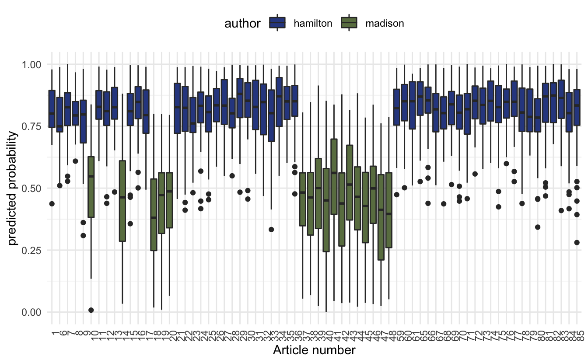
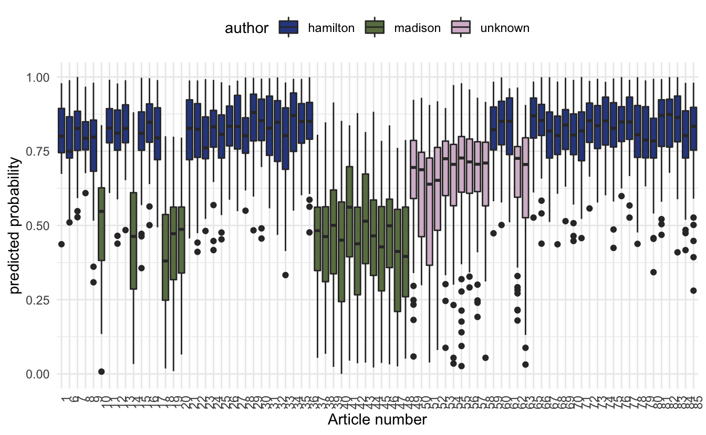
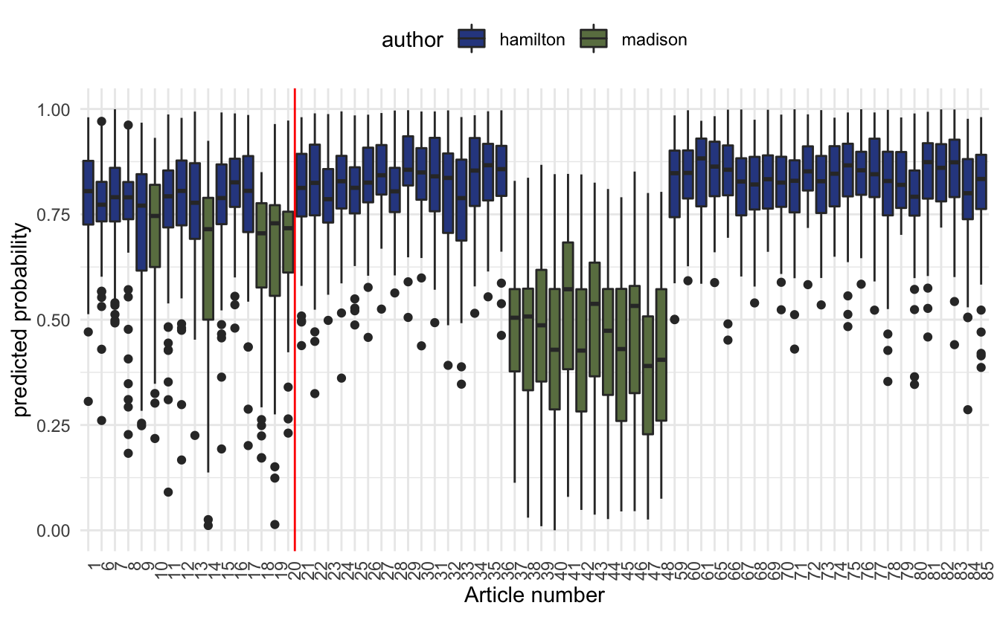

::: {.callout-note}
This code has been lightly revised to make sure it works as of 2018-12-16.
:::

::: {.callout-note}
This post was early in my predictive modeling with text journey. For a more up to date version on this process see <a href="https://smltar.com/mlclassification.html">smltar.com - Classification</a>.
:::

## Overview

In this post, we will

- talk about The Federalist Papers
- access and tidy the text using the tidytext package
- apply our model to the data to predict the author of the disputed papers

## The Federalist Papers

In the early days of The United States of America around the time when the Constitution was being signed did a series of articles were published in various newspapers. These papers were writing under the false name *Publius*. It was later revealed to have been the collected works of Alexander Hamilton, James Madison, and John Jay.  

The Interesting thing in this was that the authorship of these papers was not consistent. This is where we come in, in this blog post will we try to see if we are able to classify the troublesome papers.  

If you would like to read more about this story including past attempts to solve this problem please read [How Statistics Solved a 175-Year-Old Mystery About Alexander Hamilton](https://priceonomics.com/how-statistics-solved-a-175-year-old-mystery-about/) by Ben Christopher. 

## Libraries

We will start by loading the libraries which includes `glmnet` that will be used to construct the predictive model later.


```r
library(tidyverse)
library(tidytext)
library(gutenbergr)
library(glmnet)
```

## Data

We are lucky today because all of The Federalist Papers happens to be on Gutenberg, which is written in English^[[#benderrule](https://thegradient.pub/the-benderrule-on-naming-the-languages-we-study-and-why-it-matters/)]


```r
papers <- gutenberg_download(1404)
head(papers, n = 10)
## # A tibble: 10 x 2
##    gutenberg_id text                                                
##           <int> <chr>                                               
##  1         1404 "THE FEDERALIST PAPERS"                             
##  2         1404 ""                                                  
##  3         1404 "By Alexander Hamilton, John Jay, and James Madison"
##  4         1404 ""                                                  
##  5         1404 ""                                                  
##  6         1404 ""                                                  
##  7         1404 ""                                                  
##  8         1404 "FEDERALIST No. 1"                                  
##  9         1404 ""                                                  
## 10         1404 "General Introduction"
```

For the predictive modeling we are going to do later, I would like to divide each paper up into sentences. This is a rather complicated affair, but I will take a rather ad hoc approach that will be good enough for the purpose of this post. We will do this by collapsing all the lines together and splitting them by ., ! and ?'s.


```r
papers_sentences <- pull(papers, text) %>% 
  str_c(collapse = " ") %>%
  str_split(pattern = "\\.|\\?|\\!") %>%
  unlist() %>%
  tibble(text = .) %>%
  mutate(sentence = row_number())
```

We would like to assign each of these sentences to the corresponding article number and author. Thus we will first assign each of the 85 papers to the 3 authors and a group for the papers of interest. 


```r
hamilton <- c(1, 6:9, 11:13, 15:17, 21:36, 59:61, 65:85)
madison <- c(10, 14, 18:20, 37:48)
jay <- c(2:5, 64)
unknown <- c(49:58, 62:63)
```

Next, we will simply look for lines that include "FEDERALIST No" as they would indicate the start of a paper and then label them accordingly.


```r
papers_words <- papers_sentences %>%
  mutate(no = cumsum(str_detect(text, regex("FEDERALIST No",
                                            ignore_case = TRUE)))) %>%
  unnest_tokens(word, text) %>%
  mutate(author = case_when(no %in% hamilton ~ "hamilton",
                            no %in% madison ~ "madison",
                            no %in% jay ~ "jay",
                            no %in% unknown ~ "unknown"),
         id = paste(no, sentence, sep = "-"))
```

let us take a quick count before we move on


```r
papers_words %>%
  count(author)
## # A tibble: 4 x 2
##   author        n
##   <chr>     <int>
## 1 hamilton 114688
## 2 jay        8539
## 3 madison   45073
## 4 unknown   24471
```

We see that Jay didn't post as many articles as the other two gentlemen so we will exclude him from further analysis


```r
papers_words <- papers_words %>%
  filter(author != "jay")
```

## Predictive modeling

To make this predictive model we will use the term-frequency matrix as our input and as the response will be an indicator that Hamilton wrote the paper. For this modeling we will use the `glmnet` package which fits a generalized linear model via penalized maximum likelihood. It is quite fast and works great with sparse matrix input, hence the term-frequency matrix.  

The response is set to the binomial family because of the binary nature of the response (did Hamilton write the sentence).  

First, we get the term-frequency matrix with the `cast_` family in tidytext.


```r
papers_dtm <- papers_words %>%
  count(id, word, sort = TRUE) %>%
  cast_sparse(id, word, n)
```

We will need to define a response variable, which we will do with a simple `mutate`, along with an indicator for our training set which will be the articles with known authors.


```r
meta <- data.frame(id = dimnames(papers_dtm)[[1]]) %>%
  left_join(papers_words[!duplicated(papers_words$id), ], by = "id") %>%
  mutate(y = as.numeric(author == "hamilton"),
         train = author != "unknown")
```

We will use cross-validation to obtain the best value of the model tuning parameter. This part takes a couple of minutes.


```r
predictor <- papers_dtm[meta$train, ]
response <- meta$y[meta$train]

model <- cv.glmnet(predictor, response, family = "binomial", alpha = 0.9)
```

After running the model, we will add the predicted values to our `meta` data.frame.


```r
meta <- meta %>%
  mutate(pred = predict(model, newx = as.matrix(papers_dtm), type = "response",
                        s = model$lambda.1se) %>% as.numeric())
```

It is now time to visualize the results. First, we will look at how the training set have been separated.


```r
meta %>%
  filter(train) %>%
  ggplot(aes(factor(no), pred)) + 
  geom_boxplot(aes(fill = author)) +
  theme_minimal() +
  labs(y = "predicted probability",
       x = "Article number") +
  theme(legend.position = "top") +
  scale_fill_manual(values = c("#304890", "#6A7E50")) +
  theme(axis.text.x = element_text(angle = 90, hjust = 1))
```



The box plot of predicted probabilities, one value for each sentence, for the 68 papers by
Alexander Hamilton and James Madison. The probability represents the extent to which the
model believes the sentence was written by Alexander Hamilton. 

Let us see if this model can settle the dispute of the 12 papers. We will plot the predicted probabilities of the unknown papers alongside the training set.


```r
meta %>%
  ggplot(aes(factor(no), pred)) + 
  geom_boxplot(aes(fill = author)) +
  theme_minimal() +
  labs(y = "predicted probability",
       x = "Article number") +
  theme(legend.position = "top") +
  scale_fill_manual(values = c("#304890", "#6A7E50", "#D6BBD0")) +
  theme(axis.text.x = element_text(angle = 90, hjust = 1))
```



we notice that the predicted probabilities don't quite make up able to determine who the original author is. This can be due to a variety of different reasons. One of them could be that Madison wrote them and Hamilton edited them.

Despite the unsuccessful attempt to predict the secret author we still managed to showcase the method which while being unsuccessful in this case could provide useful in other cases.

## Working showcase

Since the method proved unsuccessful in determining the secret author did I decide to add an example where the authorship is known. We will use the same data from earlier, only look at known Hamilton and Madison papers, train on some of them, and show that the algorithm is able to detect the authorship of the other.


```r
papers_dtm <- papers_words %>%
  filter(author != "unknown") %>%
  count(id, word, sort = TRUE) %>% 
  cast_dtm(id, word, n)
```

here we let the first 16 papers that they wrote be the test set and the rest be the training set.


```r
meta <- data.frame(id = dimnames(papers_dtm)[[1]]) %>%
  left_join(papers_words[!duplicated(papers_words$id), ], by = "id") %>%
  mutate(y = as.numeric(author == "hamilton"),
         train = no > 20)
```


```r
predictor <- papers_dtm[meta$train, ] %>% as.matrix()
response <- meta$y[meta$train]

model <- cv.glmnet(predictor, response, family = "binomial", alpha = 0.9)
```


```r
meta <- meta %>%
  mutate(pred = predict(model, newx = as.matrix(papers_dtm), type = "response",
                        s = model$lambda.1se) %>% as.numeric())
```


```r
meta %>%
  ggplot(aes(factor(no), pred)) + 
  geom_boxplot(aes(fill = author)) +
  theme_minimal() +
  labs(y = "predicted probability",
       x = "Article number") +
  theme(legend.position = "top") +
  scale_fill_manual(values = c("#304890", "#6A7E50")) +
  theme(axis.text.x = element_text(angle = 90, hjust = 1)) +
  geom_vline(aes(xintercept = 16.5), color = "red")
```



So we see that while it isn't as crystal clear what the test set predictions are giving us, they still give a pretty good indication.

<details closed>
<summary> <span title='Click to Expand'> session information </span> </summary>

```r

─ Session info ───────────────────────────────────────────────────────────────
 setting  value                       
 version  R version 4.0.5 (2021-03-31)
 os       macOS Big Sur 10.16         
 system   x86_64, darwin17.0          
 ui       X11                         
 language (EN)                        
 collate  en_US.UTF-8                 
 ctype    en_US.UTF-8                 
 tz       Pacific/Honolulu            
 date     2021-07-05                  

─ Packages ───────────────────────────────────────────────────────────────────
 package     * version date       lib source        
 assertthat    0.2.1   2019-03-21 [1] CRAN (R 4.0.0)
 backports     1.2.1   2020-12-09 [1] CRAN (R 4.0.2)
 blogdown      1.3     2021-04-14 [1] CRAN (R 4.0.2)
 bookdown      0.22    2021-04-22 [1] CRAN (R 4.0.2)
 broom         0.7.6   2021-04-05 [1] CRAN (R 4.0.2)
 bslib         0.2.5.1 2021-05-18 [1] CRAN (R 4.0.2)
 cellranger    1.1.0   2016-07-27 [1] CRAN (R 4.0.0)
 cli           3.0.0   2021-06-30 [1] CRAN (R 4.0.2)
 clipr         0.7.1   2020-10-08 [1] CRAN (R 4.0.2)
 codetools     0.2-18  2020-11-04 [1] CRAN (R 4.0.5)
 colorspace    2.0-2   2021-06-24 [1] CRAN (R 4.0.2)
 crayon        1.4.1   2021-02-08 [1] CRAN (R 4.0.2)
 curl          4.3.2   2021-06-23 [1] CRAN (R 4.0.2)
 DBI           1.1.1   2021-01-15 [1] CRAN (R 4.0.2)
 dbplyr        2.1.1   2021-04-06 [1] CRAN (R 4.0.2)
 desc          1.3.0   2021-03-05 [1] CRAN (R 4.0.2)
 details     * 0.2.1   2020-01-12 [1] CRAN (R 4.0.0)
 digest        0.6.27  2020-10-24 [1] CRAN (R 4.0.2)
 dplyr       * 1.0.7   2021-06-18 [1] CRAN (R 4.0.2)
 ellipsis      0.3.2   2021-04-29 [1] CRAN (R 4.0.2)
 evaluate      0.14    2019-05-28 [1] CRAN (R 4.0.0)
 fansi         0.5.0   2021-05-25 [1] CRAN (R 4.0.2)
 farver        2.1.0   2021-02-28 [1] CRAN (R 4.0.2)
 forcats     * 0.5.1   2021-01-27 [1] CRAN (R 4.0.2)
 foreach       1.5.1   2020-10-15 [1] CRAN (R 4.0.2)
 fs            1.5.0   2020-07-31 [1] CRAN (R 4.0.2)
 generics      0.1.0   2020-10-31 [1] CRAN (R 4.0.2)
 ggplot2     * 3.3.5   2021-06-25 [1] CRAN (R 4.0.2)
 glmnet      * 4.1-1   2021-02-21 [1] CRAN (R 4.0.2)
 glue          1.4.2   2020-08-27 [1] CRAN (R 4.0.2)
 gtable        0.3.0   2019-03-25 [1] CRAN (R 4.0.0)
 gutenbergr  * 0.1.5   2019-09-10 [1] CRAN (R 4.0.0)
 haven         2.4.1   2021-04-23 [1] CRAN (R 4.0.2)
 highr         0.9     2021-04-16 [1] CRAN (R 4.0.2)
 hms           1.1.0   2021-05-17 [1] CRAN (R 4.0.2)
 htmltools     0.5.1.1 2021-01-22 [1] CRAN (R 4.0.2)
 httr          1.4.2   2020-07-20 [1] CRAN (R 4.0.2)
 iterators     1.0.13  2020-10-15 [1] CRAN (R 4.0.2)
 janeaustenr   0.1.5   2017-06-10 [1] CRAN (R 4.0.0)
 jquerylib     0.1.4   2021-04-26 [1] CRAN (R 4.0.2)
 jsonlite      1.7.2   2020-12-09 [1] CRAN (R 4.0.2)
 knitr       * 1.33    2021-04-24 [1] CRAN (R 4.0.2)
 labeling      0.4.2   2020-10-20 [1] CRAN (R 4.0.2)
 lattice       0.20-41 2020-04-02 [1] CRAN (R 4.0.5)
 lifecycle     1.0.0   2021-02-15 [1] CRAN (R 4.0.2)
 lubridate     1.7.10  2021-02-26 [1] CRAN (R 4.0.2)
 magrittr      2.0.1   2020-11-17 [1] CRAN (R 4.0.2)
 Matrix      * 1.3-2   2021-01-06 [1] CRAN (R 4.0.5)
 modelr        0.1.8   2020-05-19 [1] CRAN (R 4.0.0)
 munsell       0.5.0   2018-06-12 [1] CRAN (R 4.0.0)
 NLP           0.2-0   2018-10-18 [1] CRAN (R 4.0.0)
 pillar        1.6.1   2021-05-16 [1] CRAN (R 4.0.2)
 pkgconfig     2.0.3   2019-09-22 [1] CRAN (R 4.0.0)
 png           0.1-7   2013-12-03 [1] CRAN (R 4.0.0)
 purrr       * 0.3.4   2020-04-17 [1] CRAN (R 4.0.0)
 R6            2.5.0   2020-10-28 [1] CRAN (R 4.0.2)
 Rcpp          1.0.6   2021-01-15 [1] CRAN (R 4.0.2)
 readr       * 1.4.0   2020-10-05 [1] CRAN (R 4.0.2)
 readxl        1.3.1   2019-03-13 [1] CRAN (R 4.0.2)
 reprex        2.0.0   2021-04-02 [1] CRAN (R 4.0.2)
 rlang         0.4.11  2021-04-30 [1] CRAN (R 4.0.2)
 rmarkdown     2.9     2021-06-15 [1] CRAN (R 4.0.2)
 rprojroot     2.0.2   2020-11-15 [1] CRAN (R 4.0.2)
 rstudioapi    0.13    2020-11-12 [1] CRAN (R 4.0.2)
 rvest         1.0.0   2021-03-09 [1] CRAN (R 4.0.2)
 sass          0.4.0   2021-05-12 [1] CRAN (R 4.0.2)
 scales        1.1.1   2020-05-11 [1] CRAN (R 4.0.0)
 sessioninfo   1.1.1   2018-11-05 [1] CRAN (R 4.0.0)
 shape         1.4.5   2020-09-13 [1] CRAN (R 4.0.2)
 slam          0.1-47  2019-12-21 [1] CRAN (R 4.0.0)
 SnowballC     0.7.0   2020-04-01 [1] CRAN (R 4.0.0)
 stringi       1.6.2   2021-05-17 [1] CRAN (R 4.0.2)
 stringr     * 1.4.0   2019-02-10 [1] CRAN (R 4.0.0)
 survival      3.2-10  2021-03-16 [1] CRAN (R 4.0.5)
 tibble      * 3.1.2   2021-05-16 [1] CRAN (R 4.0.2)
 tidyr       * 1.1.3   2021-03-03 [1] CRAN (R 4.0.2)
 tidyselect    1.1.1   2021-04-30 [1] CRAN (R 4.0.2)
 tidytext    * 0.3.1   2021-04-10 [1] CRAN (R 4.0.2)
 tidyverse   * 1.3.1   2021-04-15 [1] CRAN (R 4.0.2)
 tm            0.7-7   2019-12-12 [1] CRAN (R 4.0.0)
 tokenizers    0.2.1   2018-03-29 [1] CRAN (R 4.0.0)
 triebeard     0.3.0   2016-08-04 [1] CRAN (R 4.0.0)
 urltools      1.7.3   2019-04-14 [1] CRAN (R 4.0.0)
 utf8          1.2.1   2021-03-12 [1] CRAN (R 4.0.2)
 vctrs         0.3.8   2021-04-29 [1] CRAN (R 4.0.2)
 withr         2.4.2   2021-04-18 [1] CRAN (R 4.0.2)
 xfun          0.24    2021-06-15 [1] CRAN (R 4.0.2)
 xml2          1.3.2   2020-04-23 [1] CRAN (R 4.0.0)
 yaml          2.2.1   2020-02-01 [1] CRAN (R 4.0.0)

[1] /Library/Frameworks/R.framework/Versions/4.0/Resources/library

```

</details>
<br>
