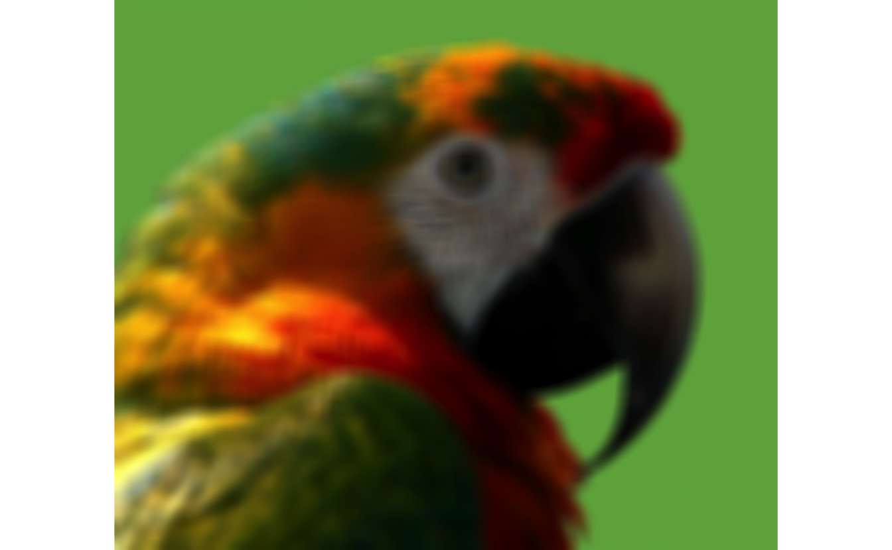
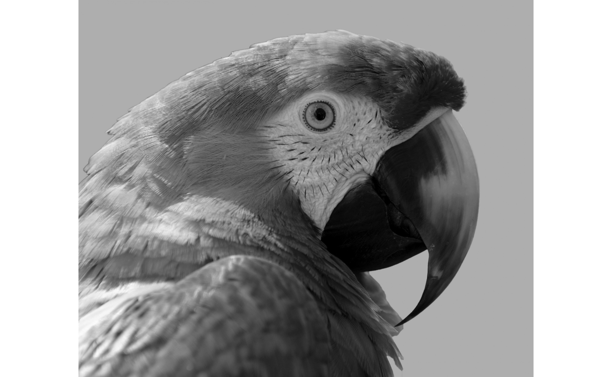
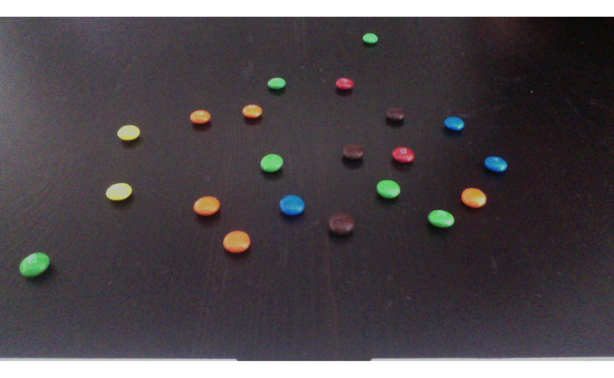
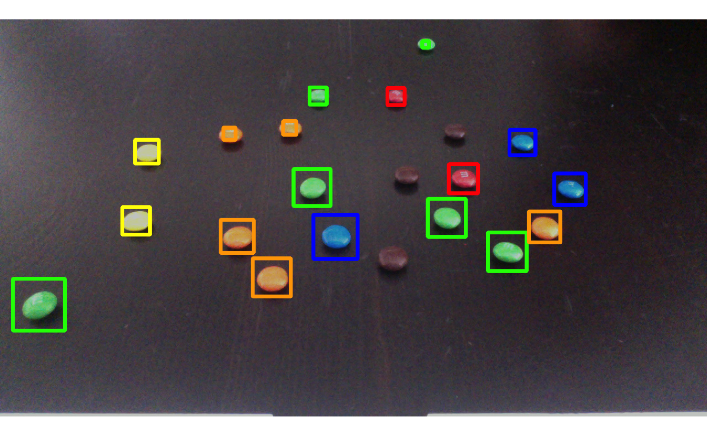

::: {.callout-note}
This code has been lightly revised to make sure it works as of 2018-12-16.
:::

## Overview

Recently I stumbled across the `Rvision` package, which frankly looks amazing so far (still in development at this time of writing). So I decided to take it for a spin and show you what I found.

## Setup

So for this, you will need a computer with a webcam and the `Rvision` package with its dependencies. It will use `ROpenCVLite` to access `OpenCV`'s functionalities. If not already installed, ROpenCVLite will be installed first by the command line below. Furthermore while not necessary for `Rvision` I have imported `dplyr` for general data manipulation.


```r
#devtools::install_github("swarm-lab/Rvision")
library(Rvision)
library(dplyr)
```

## Minimal Setup - working with a photo

We will start by simply loading a picture of a parrot. This is done using the function `image`, which creates an object of class `Image`. `Image` objects are pointers toward C++ objects stored in memory and will therefore not work with some functions in base R such `sum`, `%%`, etc.


```r
img <- image("parrot.jpg")
```


If we want to see the image we loaded we simply plot it:


```r
plot(img)
```


For more information about the `Image` object we can turn to the property functions: 


```r
dim(img)
## [1] 1595 1919    3
nrow(img)
## [1] 1595
ncol(img)
## [1] 1919
nchan(img)
## [1] 3
bitdepth(img)
## [1] "8U"
colorspace(img)
## [1] "BGR"
```

## Blurs

Now that we have an `Image` object we can use some of tools at our disposal, which includes standard things like blurs:


```r
boxFilter(img, k_height = 25, k_width = 25) %>% plot()
```


```r
gaussianBlur(img, k_height = 25, k_width = 25, sigma_x = 5, sigma_y = 5) %>% plot()
```


```r
medianBlur(img, k_size = 25) %>% plot()
```


```r
sqrBoxFilter(img, k_height = 25, k_width = 25) %>% plot()
```



## Operators

Other kinds of operations can be done, such as changing the color space:


```r
changeColorSpace(img, "GRAY") %>% plot()
```



And apply edge detection algorithms such as `sobel` and `laplacian`.


```r
sobel(img) %>% plot()
```


## Draws

The package also includes a number of drawing functions starting with the prefix `draw`, ending with `Arrow`, `Circle`, `Ellipse`, `Line`, `Rectangle` and `text`. These functions, unlike the others, modify the `Image` object that is taken in, instead of returning another `Image` object.


```r
img1 <- cloneImage(img)
drawCircle(img1, x = 750, y = 750, radius = 200, color = "blue", 
           thickness = 10)
plot(img1)
```


## Blob detection

By now we looked at a bunch of different functions but all of them have been used separately. Now let's combine them to detect something inside the picture.


```r
img <- image("balls.jpg")
plot(img)
```


For our further calculations, we need to know what color space this image is in


```r
colorspace(img)
## [1] "BGR"
```

Which is different than the correctly commonly used RGB. In the following code, I tried to find all the blue balls. For that, I used the `split` function to split the `Image` object into 3, one for each color channel. Then I used a `do.call` to return an object where the blue channel is more the 200, and the red and green are less than 200, in the hope that it would be enough to identify the blue color without also finding bright areas. This being a logical expression gives us an image file that is white when true and black when it isn't. Lastly, we used the `medianBlur` to remove any rough edges and flicker. (you can try comment out the  `medianBlur` and see what changes)


```r
img %>%
  split() %>%
  do.call(function(B, G, R) B > 200 & G < 200 & R < 200, .) %>%
  medianBlur() %>%
  plot()
```

If we would like to highlight these balls on the original image we have to detect where these white blobs are and use the draw functions to draw on our original image. We use `simpleBlobDetector` and play around with the settings till we get something reasonable.


```r
blue_balls <- img %>%
  split() %>%
  do.call(function(B, G, R) B > 200 & G < 200 & R < 200, .) %>%
  medianBlur() %>%
  simpleBlobDetector(max_area = Inf, min_area = 10, blob_color = 255,
                     filter_by_convexity = FALSE, 
                     filter_by_inertia = FALSE, min_threshold = 0)
blue_balls
```

We use the `cloneImage` as it creates a new `Image` object such that the drawing doesn't change the original `Image` object.


```r
img1 <- cloneImage(img)

for (i in seq_len(nrow(blue_balls))) {
  drawRectangle(image = img1,
                pt1_x = blue_balls$x[i] - 1 + blue_balls$size[i] / 2, 
                pt1_y = blue_balls$y[i] - 1 + blue_balls$size[i] / 2, 
                pt2_x = blue_balls$x[i] - 1 - blue_balls$size[i] / 2, 
                pt2_y = blue_balls$y[i] - 1 - blue_balls$size[i] / 2, 
                thickness = 3, color = "blue")
}

plot(img)
```

We see that it worked fairly well, it didn't go all the way till the edges of the balls and it appeared to catch the blue artifact on the lower left side, but more careful ranges could take care of that problem. 

## Streams

`Rvision` also has a `Stream` object that we can utilize.  the `stream` function creates a `Stream` object from the camera connected to your computer. In my case, number 0 is the webcam in my Macbook. Its corresponding function is `release` which closes the stream object. To capture something we use the handy `readNext` function that reads the next frame and returns an `Image` object.


```r
my_stream <- stream(0)   # 0 will start your default webcam in general. 
my_img <- readNext(my_stream)
release(my_stream)
```


Let us take a look at the image that was captured on my webcam.


```r
plot(my_img)
```



and what a coincidence!! Its a handful of distinctly colored m&m's against a dark background. Lets try against to locate the different colors, but before we do that let us reuse what we did earlier and make it into some custom functions:


```r
blob_fun <- function(img, fun, color = character()) {
  img %>%
    split() %>%
    do.call(fun, .) %>%
    medianBlur(15) %>%
    simpleBlobDetector(max_area = Inf, min_area = 10, blob_color = 255,
                       filter_by_convexity = FALSE, 
                       filter_by_inertia = FALSE, min_threshold = 0) %>%
    mutate(color = color)
} 

multi_draw <- function(img, blobs) {
  if (nrow(blobs) > 0) {
    for (i in 1:nrow(blobs)) {
      drawRectangle(img, 
                    blobs$x[i] - 1 + blobs$size[i], 
                    blobs$y[i] - 1 + blobs$size[i],
                    blobs$x[i] - 1 - blobs$size[i], 
                    blobs$y[i] - 1 - blobs$size[i], 
                    thickness = 5, color = blobs$color[1])
    }
  }
}
```

Like before we found the blue balls by identifying the region in the BGR color space where it is blue, we expand the same idea to the other colors. (I have not attempted brown as it is fairly similar in color to the table)


```r
blue <-   function(B, G, R) B > 150 & R < 200 & G < 200
red <-    function(B, G, R) R > 150 & B < 200 & G < 150
green <-  function(B, G, R) G > 150 & B < 200 & R < 200
yellow <- function(B, G, R) G > 150 & B < 200 & B > 150 & R > 150
orange <- function(B, G, R) G > 150 & B < 150 & R > 150
```

Now we just have to run our custom blob detection function and custom drawing function for each color and see the final result


```r
blue_mms <-   blob_fun(my_img, blue, "blue")
red_mms <-    blob_fun(my_img, red, "red")
green_mms <-  blob_fun(my_img, green, "green")
yellow_mms <- blob_fun(my_img, yellow, "yellow")
orange_mms <- blob_fun(my_img, orange, "orange")

multi_draw(my_img, blue_mms)
multi_draw(my_img, red_mms)
multi_draw(my_img, green_mms)
multi_draw(my_img, yellow_mms)
multi_draw(my_img, orange_mms)

plot(my_img)
```



And it is wonderful!

## Displays

The last trip of the tour is a look at the Displays that `Rvision` facilitates. And in its simplest form, it creates a window where `Image` objects can be displayed. This means that we are able to do live m&m's detection!!  

In a minimal setup, you would have this following chunk of code, which sets up a stream, a display, and then populates that display with new images taken from the camera till you stop it. And then termination functions for the stream and display. However, this is no different than a video feed.


```r
my_stream <- stream(0)
newDisplay("Live test", 360, 640)
while(TRUE) {
  img <- readNext(my_stream)
  display(img, "Live test", 25, 360, 640)
}
destroyDisplay("Live test")
release(my_stream)
```

So instead we will use the functions from earlier to detect and highlight the colored m&m's!


```r
my_stream <- stream(0)
newDisplay("Live test", 360, 640)

while(TRUE) {
  img <- readNext(my_stream)
  
  blue_mms <- blob_fun(img, blue, "blue")
  red_mms <- blob_fun(img, red, "red")
  green_mms <- blob_fun(img, green, "green")
  yellow_mms <- blob_fun(img, yellow, "yellow")
  orange_mms <- blob_fun(img, orange, "orange")
  
  multi_draw(img, blue_mms)
  multi_draw(img, red_mms)
  multi_draw(img, green_mms)
  multi_draw(img, yellow_mms)
  multi_draw(img, orange_mms)
  
  display(img, "Live test", 25, 360, 640)
}
destroyDisplay("Live test")
release(my_stream)
```


It's a little choppy but that might be because of my now quite old Macbook.

## Conclusion

I had a blast working with `Rvision` and I look forward to using it in future projects! I would also recommend against using eatable data points as they tend to disappear over time. 

<details closed>
<summary> <span title='Click to Expand'> session information </span> </summary>

```r

─ Session info ───────────────────────────────────────────────────────────────
 setting  value                       
 version  R version 4.0.5 (2021-03-31)
 os       macOS Big Sur 10.16         
 system   x86_64, darwin17.0          
 ui       X11                         
 language (EN)                        
 collate  en_US.UTF-8                 
 ctype    en_US.UTF-8                 
 tz       Pacific/Honolulu            
 date     2021-07-05                  

─ Packages ───────────────────────────────────────────────────────────────────
 package     * version date       lib source                            
 assertthat    0.2.1   2019-03-21 [1] CRAN (R 4.0.0)                    
 blogdown      1.3     2021-04-14 [1] CRAN (R 4.0.2)                    
 bookdown      0.22    2021-04-22 [1] CRAN (R 4.0.2)                    
 bslib         0.2.5.1 2021-05-18 [1] CRAN (R 4.0.2)                    
 cli           3.0.0   2021-06-30 [1] CRAN (R 4.0.2)                    
 clipr         0.7.1   2020-10-08 [1] CRAN (R 4.0.2)                    
 codetools     0.2-18  2020-11-04 [1] CRAN (R 4.0.5)                    
 crayon        1.4.1   2021-02-08 [1] CRAN (R 4.0.2)                    
 DBI           1.1.1   2021-01-15 [1] CRAN (R 4.0.2)                    
 desc          1.3.0   2021-03-05 [1] CRAN (R 4.0.2)                    
 details     * 0.2.1   2020-01-12 [1] CRAN (R 4.0.0)                    
 digest        0.6.27  2020-10-24 [1] CRAN (R 4.0.2)                    
 dplyr       * 1.0.7   2021-06-18 [1] CRAN (R 4.0.2)                    
 ellipsis      0.3.2   2021-04-29 [1] CRAN (R 4.0.2)                    
 evaluate      0.14    2019-05-28 [1] CRAN (R 4.0.0)                    
 fansi         0.5.0   2021-05-25 [1] CRAN (R 4.0.2)                    
 generics      0.1.0   2020-10-31 [1] CRAN (R 4.0.2)                    
 glue          1.4.2   2020-08-27 [1] CRAN (R 4.0.2)                    
 highr         0.9     2021-04-16 [1] CRAN (R 4.0.2)                    
 htmltools     0.5.1.1 2021-01-22 [1] CRAN (R 4.0.2)                    
 httr          1.4.2   2020-07-20 [1] CRAN (R 4.0.2)                    
 jquerylib     0.1.4   2021-04-26 [1] CRAN (R 4.0.2)                    
 jsonlite      1.7.2   2020-12-09 [1] CRAN (R 4.0.2)                    
 knitr       * 1.33    2021-04-24 [1] CRAN (R 4.0.2)                    
 lifecycle     1.0.0   2021-02-15 [1] CRAN (R 4.0.2)                    
 magrittr      2.0.1   2020-11-17 [1] CRAN (R 4.0.2)                    
 pbapply       1.4-3   2020-08-18 [1] CRAN (R 4.0.2)                    
 pillar        1.6.1   2021-05-16 [1] CRAN (R 4.0.2)                    
 pkgconfig     2.0.3   2019-09-22 [1] CRAN (R 4.0.0)                    
 png           0.1-7   2013-12-03 [1] CRAN (R 4.0.0)                    
 purrr         0.3.4   2020-04-17 [1] CRAN (R 4.0.0)                    
 R6            2.5.0   2020-10-28 [1] CRAN (R 4.0.2)                    
 Rcpp          1.0.6   2021-01-15 [1] CRAN (R 4.0.2)                    
 rlang         0.4.11  2021-04-30 [1] CRAN (R 4.0.2)                    
 rmarkdown     2.9     2021-06-15 [1] CRAN (R 4.0.2)                    
 ROpenCVLite   4.52.0  2021-07-05 [1] CRAN (R 4.0.5)                    
 rprojroot     2.0.2   2020-11-15 [1] CRAN (R 4.0.2)                    
 Rvision     * 0.6.0   2021-07-05 [1] Github (swarm-lab/Rvision@0377e45)
 sass          0.4.0   2021-05-12 [1] CRAN (R 4.0.2)                    
 sessioninfo   1.1.1   2018-11-05 [1] CRAN (R 4.0.0)                    
 stringi       1.6.2   2021-05-17 [1] CRAN (R 4.0.2)                    
 stringr       1.4.0   2019-02-10 [1] CRAN (R 4.0.0)                    
 tibble        3.1.2   2021-05-16 [1] CRAN (R 4.0.2)                    
 tidyselect    1.1.1   2021-04-30 [1] CRAN (R 4.0.2)                    
 utf8          1.2.1   2021-03-12 [1] CRAN (R 4.0.2)                    
 vctrs         0.3.8   2021-04-29 [1] CRAN (R 4.0.2)                    
 withr         2.4.2   2021-04-18 [1] CRAN (R 4.0.2)                    
 xfun          0.24    2021-06-15 [1] CRAN (R 4.0.2)                    
 xml2          1.3.2   2020-04-23 [1] CRAN (R 4.0.0)                    
 yaml          2.2.1   2020-02-01 [1] CRAN (R 4.0.0)                    

[1] /Library/Frameworks/R.framework/Versions/4.0/Resources/library

```

</details>
<br>
