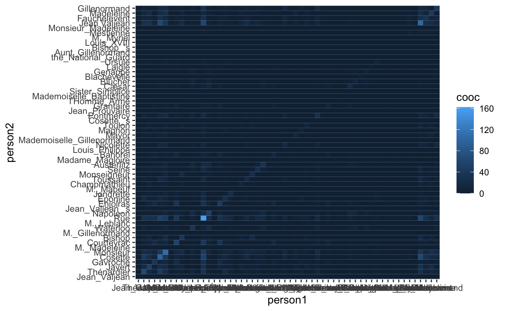
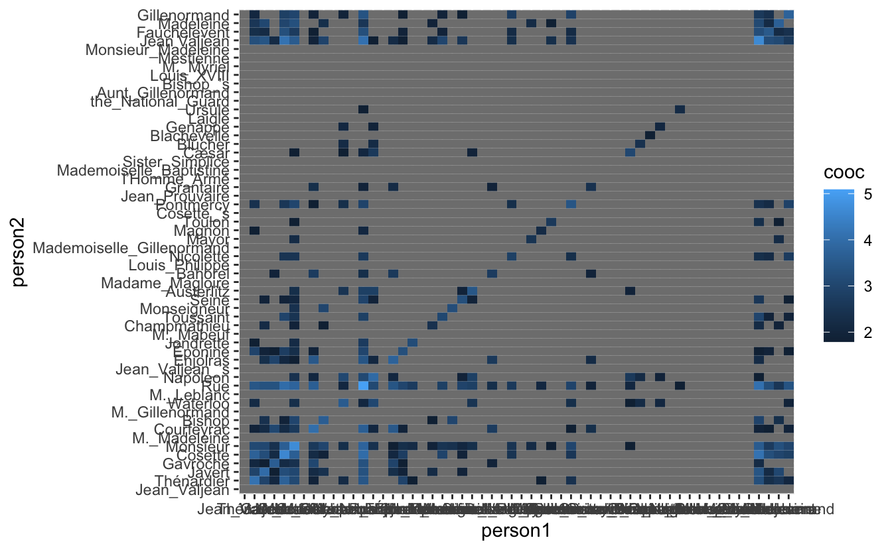
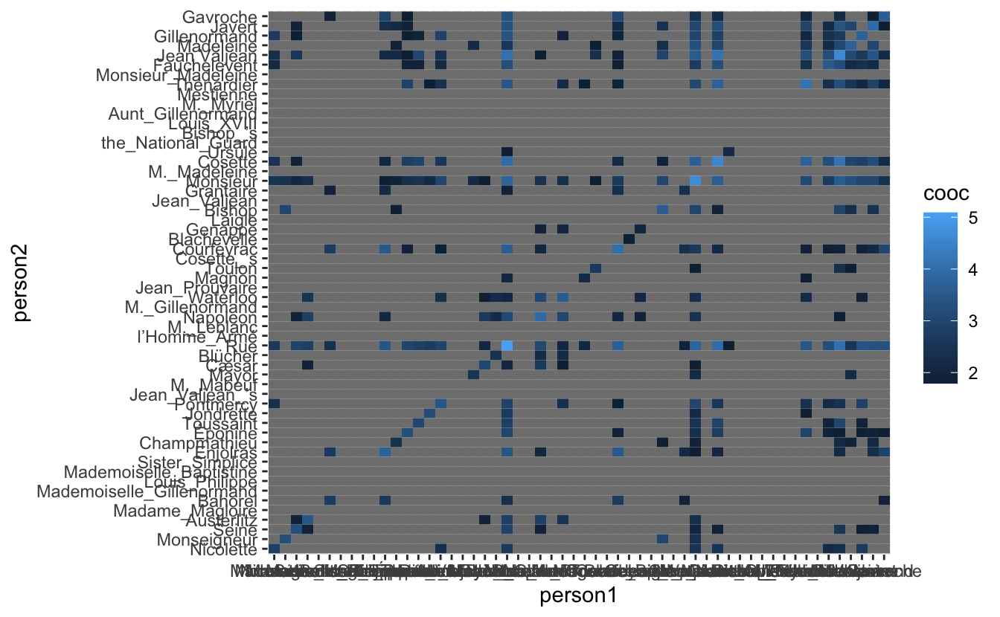
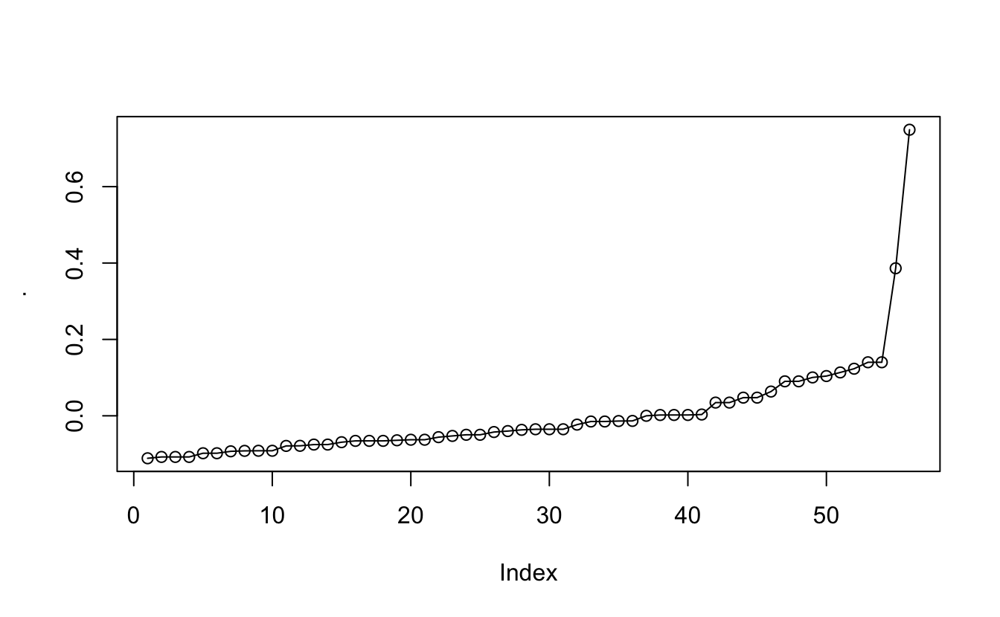
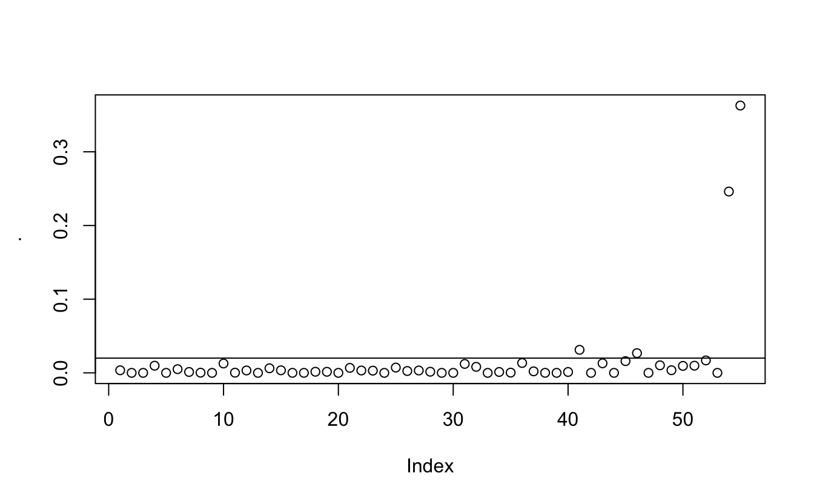
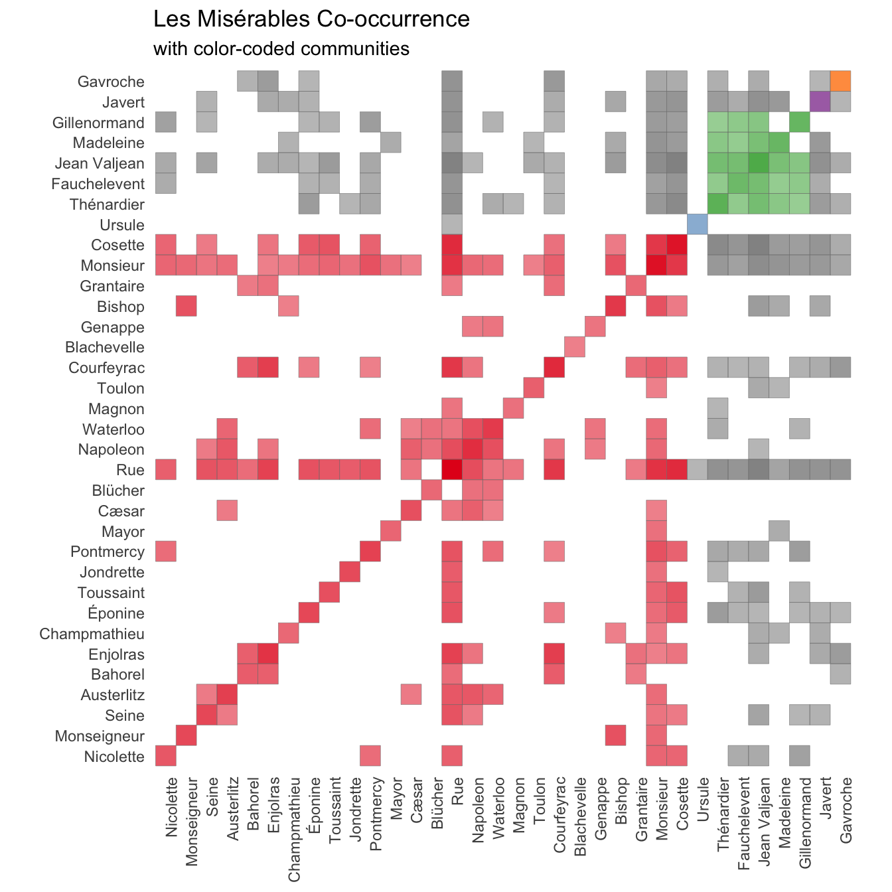

::: {.callout-note}
This code has been lightly revised to make sure it works as of 2018-12-16.
:::

## What are we doing?

The inspiration for this post is [this beautiful vizualization](https://bost.ocks.org/mike/miserables/) from [Mike Bostock](https://bost.ocks.org/mike/). It nicely visualizes the co-occurrence of characters (when two characters appear in the same chapter) in the English^[[#benderrule](https://thegradient.pub/the-benderrule-on-naming-the-languages-we-study-and-why-it-matters/)] version of the novel [Les Misérables](https://en.wikipedia.org/wiki/Les_Mis%C3%A9rables) by [Victor Hugo](https://en.wikipedia.org/wiki/Victor_Hugo) using the data collected by [Jacques Bertin](https://en.wikipedia.org/wiki/Jacques_Bertin) (and his assistants).  

The way this post will differentiate itself from this is that we are going to collect the data ourselves using [named entity recognition](https://en.wikipedia.org/wiki/Named-entity_recognition). Named entity recognition is the discipline of location and classifying named entities in text. Furthermore, will we also try to cluster the characters according to their appearance in the novel. 

disclaimer! I have of the time of writing this analysis not read of familiarized myself with Les Misérables in an attempt to show how a blind text analysis would run.

## Loading package and backend

for this we will need `tidyverse` for general data science tasks, `spacyr` for the named entity recognition, and `igraph` for some graph related transformation.


```r
library(tidyverse)
library(spacyr)
library(igraph)
```

We will be using the [spacy](https://spacy.io/) NLP back-end as the parser for this analysis since it provides named entity recognition as one of its functionalities.

## Data

Les Miserable is quite a long novel, in the terms of words and pages, however, due to its age is it in the public domain and is easily available on [Project Gutenberg](https://www.gutenberg.org/).


```r
lesmis_raw <- gutenbergr::gutenberg_download(135)
```

Looking through the beginning of the text we notice how a large part of the beginning of the document is a table of content and other information that isn't of interest in this analysis. Manually checking leads us to discard the first 650 lines of the data. We will also add a `chapter` column using a regex.


```r
lesmis_line <- lesmis_raw %>%
  slice(-(1:650)) %>%
  mutate(chapter = cumsum(str_detect(text, "CHAPTER ")))
```

For the use in `cnlp_annotate()` we need a data.frame where each row is a full chapter, with the 2 necessary columns `id` and `text`. This is accomplished using a simple `map`.


```r
lesmis <- map_df(seq_len(max(lesmis_line$chapter)),
                 ~ tibble(id = .x,
                          text = lesmis_line %>% 
                                   filter(chapter == .x) %>% 
                                   pull(text) %>% 
                                   paste(collapse = " ")))
```

Now we are all ready to run the spacy parser which will only take a couple of minutes.


```r
lesmis_obj <- spacy_parse(lesmis$text)
## Found 'spacy_condaenv'. spacyr will use this environment
## successfully initialized (spaCy Version: 3.0.5, language model: en_core_web_sm)
## (python options: type = "condaenv", value = "spacy_condaenv")
```

the output we are given nothing more than a simple tibble


```r
lesmis_obj
```


```
##   doc_id sentence_id token_id   token   lemma   pos entity
## 1  text1           1        1                 SPACE       
## 2  text1           1        2 CHAPTER chapter  NOUN       
## 3  text1           1        3       I       i  NOUN       
## 4  text1           1        4       —       — PUNCT       
## 5  text1           1        5       A       a   DET       
## 6  text1           1        6   WOUND   WOUND PROPN
```

the entity information can be extracted using `entity_extract()`


```r
entity_extract(lesmis_obj)
```


```
##   doc_id sentence_id           entity entity_type
## 1  text2           1       CHAPTER_II         LAW
## 2  text2           2 THE_END_OF_WHICH         ORG
## 3  text4           1       CHAPTER_II         LAW
## 4  text5           1        TOUSSAINT      PERSON
## 5  text6           1            STONE         ORG
## 6  text8           1       CHAPTER_VI         LAW
```

We see quite a few different `entity_type`s, in fact, lets take a quick look at the different types that are in this text


```r
entity_extract(lesmis_obj) %>%
  pull(entity_type) %>%
  unique()
##  [1] "LAW"      "ORG"      "PERSON"   "EVENT"    "GPE"      "PRODUCT" 
##  [7] "WORK"     "FAC"      "NORP"     "LOC"      "LANGUAGE"
```

This labeling is explained [here](https://spacy.io/api/annotation#named-entities). After a bit of investigating I have decided that we only will look at "PERSON" and "ORG" (which is due in part to Napoleon being classified as an organization.) Furthermore, I will limit further analysis to about the 50 most mentioned characters. The rationale behind this is that it hopefully would capture most of the important characters, with the weight that characters that are mentioned sparingly but consistently are more important than characters with high density in a few chapters. We will include a few more characters in case we have to exclude some of them after looking.


```r
top_person_df <- entity_extract(lesmis_obj) %>%
  filter(entity_type %in% c("ORG", "PERSON")) %>%
  count(entity, sort = TRUE) %>%
  slice(seq_len(60))

top_person_vec <- top_person_df %>% pull(entity)
top_person_vec
##  [1] "Jean_Valjean"              "Thénardier"               
##  [3] "Javert"                    "Gavroche"                 
##  [5] "Cosette"                   "Monsieur"                 
##  [7] "M._Madeleine"              "Courfeyrac"               
##  [9] "Fantine"                   "Bishop"                   
## [11] "M._Gillenormand"           "Waterloo"                 
## [13] "Montparnasse"              "M._Leblanc"               
## [15] "Rue"                       "Napoleon"                 
## [17] "Madeleine"                 "Jean_Valjean_’s"          
## [19] "Enjolras"                  "Éponine"                  
## [21] "Jondrette"                 "M._Mabeuf"                
## [23] "Champmathieu"              "Toussaint"                
## [25] "Monseigneur"               "Seine"                    
## [27] "Austerlitz"                "Madame_Magloire"          
## [29] "Théodule"                  "Bahorel"                  
## [31] "Louis_Philippe"            "Nicolette"                
## [33] "Gillenormand"              "M._Fauchelevent"          
## [35] "Mademoiselle_Gillenormand" "Mayor"                    
## [37] "Magnon"                    "Toulon"                   
## [39] "Cosette_’s"                "Pontmercy"                
## [41] "Jean_Prouvaire"            "Thou"                     
## [43] "Grantaire"                 "l’Homme_Armé"             
## [45] "Mademoiselle_Baptistine"   "Sister_Simplice"          
## [47] "Cæsar"                     "Blücher"                  
## [49] "Blachevelle"               "Genappe"                  
## [51] "Laigle"                    "Ursule"                   
## [53] "the_National_Guard"        "Aunt_Gillenormand"        
## [55] "Bishop_’s"                 "Bossuet"                  
## [57] "Louis_XVIII"               "M._Myriel"                
## [59] "Mestienne"                 "Monsieur_Madeleine"
```

After looking we see a few things we would like to fix before moving on. Firstly is "CHAPTER IV" and "CHAPTER VI" wrongly both classified as "ORG"s. " ", "-" and "exclaimed:--" and "Monsieur" have also been misclassified. "Jean Valjean's" have been classified differently than "Jean Valjean" which is also the case with "Fauchelevent" and "M. Fauchelevent", "M. Madeleine" and "Madeleine", "M. Gillenormand", "Gillenormand" and "Mademoiselle Gillenormand". We will remove the miss-classifications here, and create a list of all the characters with all of their names. The list is named with the character's main name for later subsetting. 


```r
top_person_vec_clean <- top_person_vec[-c(9, 13, 29, 34, 42, 56)] 

complications <- list(c("Jean Valjean", "Jean Valjean's"),
                      c("Fauchelevent", "M. Fauchelevent"),
                      c("Madeleine", "M. Madeleine"),
                      c("Gillenormand", "M. Gillenormand", "Mademoiselle Gillenormand"))

characters <- setdiff(top_person_vec_clean, unlist(complications)) %>%
  as.list() %>%
  c(complications)

names(characters) <- map_chr(characters, ~ .x[1])
```

We expand the grid of all possible co-occurrences and count how many times they both occur within a chapter.


```r
co_occurrence <- expand.grid(map_chr(characters, ~ .x[1]), 
                             map_chr(characters, ~ .x[1])) %>%
  set_names(c("person1", "person2")) %>%
  mutate(cooc = map2_dbl(person1, person2,
                         ~ sum(str_detect(lesmis$text, str_c(.x, collapse = "|")) & 
                               str_detect(lesmis$text, str_c(.y, collapse = "|")))))
```

## Visualize

now that we have the co-occurrence data we can make some visualizations!! (I will take care of labels etc in the end. Hang on!)


```r
co_occurrence %>%
  ggplot(aes(person1, person2, fill = cooc)) +
  geom_tile()
```



So at a first glance is it hard to see anything due to the default color scale and the fact that a couple of people, Jean Valjean and Marius, appear in a much higher number of chapters (perhaps they are main characters?). To get a more manageable scale we disregard co-occurrence if they have been in less than 5 chapters together(remember that there are a total of 365 chapters in the novel).


```r
co_occurrence_1 <- co_occurrence %>%
  mutate(cooc = ifelse(cooc > 5, log(cooc), NA))

co_occurrence_1 %>%
    ggplot(aes(person1, person2, fill = cooc)) +
  geom_tile()
```



Now we finally see some of the fruit of our earlier work. It is definitely clear that there are groups of people that might form communities but it is unclear which and how many from this heat-map by itself. We would like to reorder the axis's in the hope that it would create more clarity.  

This data here can be seen as a [Adjacency matrix](https://en.wikipedia.org/wiki/Adjacency_matrix) here the row numbers are vertices and the tiles-values are the edges connecting them. So in a sense, we would like to do some cluster analysis on this graph. This can be done by doing some Spectral Graph Partitioning in which we calculate the eigenvectors and sort the vertices by the second smallest eigenvector.


```r
eigen <- co_occurrence_1 %>%
#  mutate(cooc = !is.na(cooc)) %>%
  igraph::graph_from_data_frame() %>%
  igraph::as_adj() %>%
  eigen()

eigenvec2_sort <- data.frame(eigen = eigen$vectors[, length(eigen$values) - 1]) %>%
  mutate(row = row_number(),
         names = names(characters)) %>%
  arrange(eigen)

eigen_names <- eigenvec2_sort %>% pull(names)
```

We use sorted names to re-level the factors in the co-occurrence data and see if it reveals more structure.


```r
co_occurrence_1 %>%
  mutate(person1 = factor(person1, levels = eigen_names),
         person2 = factor(person2, levels = eigen_names)) %>%
    ggplot(aes(person1, person2, fill = cooc)) +
  geom_tile()
```



it isn't much but it appears to have moved the data slightly closer to the diagonal. We will still need to locate some communities in this data. this can be done using the plotted eigenvector.


```r
eigenvec2_sort %>% pull(eigen) %>% plot(type = "o")
```



And what we are looking at is not their position but at the jumps. There can more easily be seen when we look at the diffs


```r
eigenvec2_sort %>% pull(eigen) %>% diff() %>% plot()
abline(h = 0.02)
```



And after playing around a little it seems that `0.02` is an appropriate cutoff. 


```r
cummunity_df <- eigenvec2_sort %>%
  mutate(community = c(0, diff(eigen) > 0.02) %>% cumsum()) %>%
  select(names, community)
```

We will color-code the final visualization according to this clustering. So with a couple of joins


```r
co_occurrence_comm <- co_occurrence_1 %>%
  filter(!is.na(cooc)) %>%
  mutate(person1_chr = as.character(person1),
         person2_chr = as.character(person2),
         person1 = factor(person1, levels = eigen_names),
         person2 = factor(person2, levels = eigen_names)) %>%
  left_join(cummunity_df, by = c("person1_chr" = "names")) %>%
  left_join(cummunity_df, by = c("person2_chr" = "names")) %>%
  mutate(community = ifelse(community.x == community.y, community.x, NA),
         community = ifelse(!is.na(cooc), community, NA))
```

With a couple of final touch-ups and we arrive at the final result:


```r
co_occurrence_comm %>%
  ggplot(aes(person1, person2, alpha = cooc, fill = factor(community))) +
  geom_tile(color = "grey50") +
  scale_alpha(range = c(0.5, 1)) +
  scale_fill_brewer(palette = "Set1", na.value = "grey50") +
  theme_minimal() + 
  theme(panel.grid.major = element_blank(),
        axis.text.x = element_text(angle = 90, hjust = 1)) +
  guides(fill = "none", alpha = "none") +
  coord_fixed() +
  labs(x = NULL, y = NULL, 
       title = "Les Misérables Co-occurrence", 
       subtitle = "with color-coded communities")
```



## Conclusion

While I wasn't able to find as full clusters as Jacques Bertin I still managed to get quite a lot of information out of the text regardless. I had fun in the progress and there are many more things I see myself doing with this new data set and `spacyr`.  
And while I couldn't find a good way to include it in the main body of the text. I almost finished the main analysis before realizing what [Monsieur](https://en.wikipedia.org/wiki/Monsieur) means. Mention your mistakes in your posts so others can learn from them!

<details closed>
<summary> <span title='Click to Expand'> session information </span> </summary>

```r

─ Session info ───────────────────────────────────────────────────────────────
 setting  value                       
 version  R version 4.0.5 (2021-03-31)
 os       macOS Big Sur 10.16         
 system   x86_64, darwin17.0          
 ui       X11                         
 language (EN)                        
 collate  en_US.UTF-8                 
 ctype    en_US.UTF-8                 
 tz       Pacific/Honolulu            
 date     2021-07-05                  

─ Packages ───────────────────────────────────────────────────────────────────
 package      * version date       lib source        
 assertthat     0.2.1   2019-03-21 [1] CRAN (R 4.0.0)
 backports      1.2.1   2020-12-09 [1] CRAN (R 4.0.2)
 blogdown       1.3     2021-04-14 [1] CRAN (R 4.0.2)
 bookdown       0.22    2021-04-22 [1] CRAN (R 4.0.2)
 broom          0.7.6   2021-04-05 [1] CRAN (R 4.0.2)
 bslib          0.2.5.1 2021-05-18 [1] CRAN (R 4.0.2)
 cellranger     1.1.0   2016-07-27 [1] CRAN (R 4.0.0)
 cli            3.0.0   2021-06-30 [1] CRAN (R 4.0.2)
 clipr          0.7.1   2020-10-08 [1] CRAN (R 4.0.2)
 codetools      0.2-18  2020-11-04 [1] CRAN (R 4.0.5)
 colorspace     2.0-2   2021-06-24 [1] CRAN (R 4.0.2)
 crayon         1.4.1   2021-02-08 [1] CRAN (R 4.0.2)
 curl           4.3.2   2021-06-23 [1] CRAN (R 4.0.2)
 data.table     1.14.0  2021-02-21 [1] CRAN (R 4.0.2)
 DBI            1.1.1   2021-01-15 [1] CRAN (R 4.0.2)
 dbplyr         2.1.1   2021-04-06 [1] CRAN (R 4.0.2)
 desc           1.3.0   2021-03-05 [1] CRAN (R 4.0.2)
 details      * 0.2.1   2020-01-12 [1] CRAN (R 4.0.0)
 digest         0.6.27  2020-10-24 [1] CRAN (R 4.0.2)
 dplyr        * 1.0.7   2021-06-18 [1] CRAN (R 4.0.2)
 ellipsis       0.3.2   2021-04-29 [1] CRAN (R 4.0.2)
 evaluate       0.14    2019-05-28 [1] CRAN (R 4.0.0)
 fansi          0.5.0   2021-05-25 [1] CRAN (R 4.0.2)
 farver         2.1.0   2021-02-28 [1] CRAN (R 4.0.2)
 forcats      * 0.5.1   2021-01-27 [1] CRAN (R 4.0.2)
 fs             1.5.0   2020-07-31 [1] CRAN (R 4.0.2)
 generics       0.1.0   2020-10-31 [1] CRAN (R 4.0.2)
 ggplot2      * 3.3.5   2021-06-25 [1] CRAN (R 4.0.2)
 glue           1.4.2   2020-08-27 [1] CRAN (R 4.0.2)
 gtable         0.3.0   2019-03-25 [1] CRAN (R 4.0.0)
 gutenbergr     0.1.5   2019-09-10 [1] CRAN (R 4.0.0)
 haven          2.4.1   2021-04-23 [1] CRAN (R 4.0.2)
 highr          0.9     2021-04-16 [1] CRAN (R 4.0.2)
 hms            1.1.0   2021-05-17 [1] CRAN (R 4.0.2)
 htmltools      0.5.1.1 2021-01-22 [1] CRAN (R 4.0.2)
 httr           1.4.2   2020-07-20 [1] CRAN (R 4.0.2)
 igraph       * 1.2.6   2020-10-06 [1] CRAN (R 4.0.2)
 jquerylib      0.1.4   2021-04-26 [1] CRAN (R 4.0.2)
 jsonlite       1.7.2   2020-12-09 [1] CRAN (R 4.0.2)
 knitr        * 1.33    2021-04-24 [1] CRAN (R 4.0.2)
 labeling       0.4.2   2020-10-20 [1] CRAN (R 4.0.2)
 lattice        0.20-41 2020-04-02 [1] CRAN (R 4.0.5)
 lifecycle      1.0.0   2021-02-15 [1] CRAN (R 4.0.2)
 lubridate      1.7.10  2021-02-26 [1] CRAN (R 4.0.2)
 magrittr       2.0.1   2020-11-17 [1] CRAN (R 4.0.2)
 Matrix         1.3-2   2021-01-06 [1] CRAN (R 4.0.5)
 modelr         0.1.8   2020-05-19 [1] CRAN (R 4.0.0)
 munsell        0.5.0   2018-06-12 [1] CRAN (R 4.0.0)
 pillar         1.6.1   2021-05-16 [1] CRAN (R 4.0.2)
 pkgconfig      2.0.3   2019-09-22 [1] CRAN (R 4.0.0)
 png            0.1-7   2013-12-03 [1] CRAN (R 4.0.0)
 purrr        * 0.3.4   2020-04-17 [1] CRAN (R 4.0.0)
 R6             2.5.0   2020-10-28 [1] CRAN (R 4.0.2)
 RColorBrewer   1.1-2   2014-12-07 [1] CRAN (R 4.0.2)
 Rcpp           1.0.6   2021-01-15 [1] CRAN (R 4.0.2)
 readr        * 1.4.0   2020-10-05 [1] CRAN (R 4.0.2)
 readxl         1.3.1   2019-03-13 [1] CRAN (R 4.0.2)
 reprex         2.0.0   2021-04-02 [1] CRAN (R 4.0.2)
 reticulate     1.20    2021-05-03 [1] CRAN (R 4.0.2)
 rlang          0.4.11  2021-04-30 [1] CRAN (R 4.0.2)
 rmarkdown      2.9     2021-06-15 [1] CRAN (R 4.0.2)
 rprojroot      2.0.2   2020-11-15 [1] CRAN (R 4.0.2)
 rstudioapi     0.13    2020-11-12 [1] CRAN (R 4.0.2)
 rvest          1.0.0   2021-03-09 [1] CRAN (R 4.0.2)
 sass           0.4.0   2021-05-12 [1] CRAN (R 4.0.2)
 scales         1.1.1   2020-05-11 [1] CRAN (R 4.0.0)
 sessioninfo    1.1.1   2018-11-05 [1] CRAN (R 4.0.0)
 spacyr       * 1.2.1   2020-03-04 [1] CRAN (R 4.0.2)
 stringi        1.6.2   2021-05-17 [1] CRAN (R 4.0.2)
 stringr      * 1.4.0   2019-02-10 [1] CRAN (R 4.0.0)
 tibble       * 3.1.2   2021-05-16 [1] CRAN (R 4.0.2)
 tidyr        * 1.1.3   2021-03-03 [1] CRAN (R 4.0.2)
 tidyselect     1.1.1   2021-04-30 [1] CRAN (R 4.0.2)
 tidyverse    * 1.3.1   2021-04-15 [1] CRAN (R 4.0.2)
 triebeard      0.3.0   2016-08-04 [1] CRAN (R 4.0.0)
 urltools       1.7.3   2019-04-14 [1] CRAN (R 4.0.0)
 utf8           1.2.1   2021-03-12 [1] CRAN (R 4.0.2)
 vctrs          0.3.8   2021-04-29 [1] CRAN (R 4.0.2)
 withr          2.4.2   2021-04-18 [1] CRAN (R 4.0.2)
 xfun           0.24    2021-06-15 [1] CRAN (R 4.0.2)
 xml2           1.3.2   2020-04-23 [1] CRAN (R 4.0.0)
 yaml           2.2.1   2020-02-01 [1] CRAN (R 4.0.0)

[1] /Library/Frameworks/R.framework/Versions/4.0/Resources/library

```

</details>
<br>
