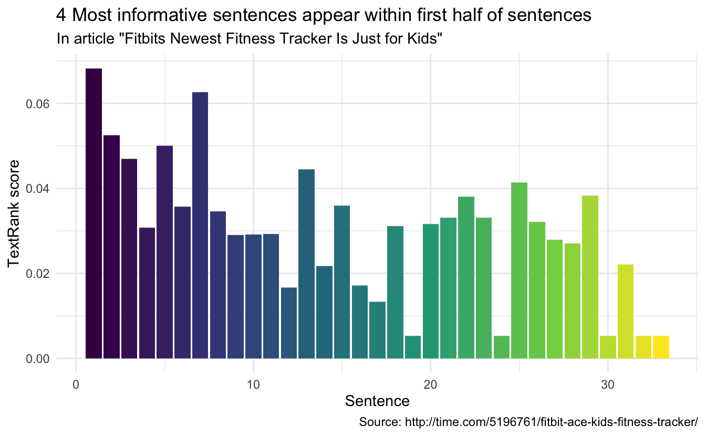

:::note
This code has been lightly revised to make sure it works as of 2018-12-19.
:::

## Text summarization

In the realm of text summarization there two main paths:

- extractive summarization
- abstractive summarization

Where extractive scoring words and sentences according to some metric and then using that information to summarize the text. Usually done by copy/pasting (extracting) the most informative parts of the text.  

The abstractive methods aim to build a semantic representation of the text and then use natural language generation techniques to generate text describing the informative parts.  

Extractive summarization is primarily the simpler task, with a handful of algorithms do will do the scoring. While with the advent of deep learning did NLP has a boost in abstractive summarization methods.  

This post will focus on an example of an extractive summarization method called [TextRank](https://web.eecs.umich.edu/~mihalcea/papers/mihalcea.emnlp04.pdf) which is based on the [PageRank](https://en.wikipedia.org/wiki/PageRank) algorithm that is used by Google to rank websites by their importance.

## TextRank Algorithm

The TextRank algorithm is based on a graph-based ranking algorithm. Generally used in web searches at Google, but have many other applications. Graph-based ranking algorithms try to decide the importance of a vertex by taking into account information about the entire graph rather than the vertex-specific information. A typical piece of information would be the information between relationships (edges) between the vertices.  

In the NLP case, we need to define what we want to use as vertices and edges. In our case will we be using sentences as the vertices and words as the connection edges. So sentences with words that appear in many other sentences are seen as more important.

## Data preparation

We start by loading the appropriate packages, which include `tidyverse` for general tasks, `tidytext` for text manipulations, `textrank` for the implementation of the TextRank algorithm, and finally `rvest` to scrape an article to use as an example. The GitHub for the `textrank` package can be found [here](https://github.com/bnosac/textrank).


```r
library(tidyverse)
library(tidytext)
library(textrank)
library(rvest)
```

To showcase this method I have randomly (EXTENSIVELY filtered political and controversial) selected an article as our guinea pig. The main body is selected using the `html_nodes`.


```r
url <- "http://time.com/5196761/fitbit-ace-kids-fitness-tracker/"
article <- read_html(url) %>%
  html_nodes('div[class="padded"]') %>%
  html_text()
```

next, we load the article into a `tibble` (since tidytext required the input as a data.frame). We start by tokenizing according to sentences which are done by setting `token = "sentences"` in `unnest_tokens`. The tokenization is not always perfect using this tokenizer, but it has a low number of dependencies and is sufficient for this showcase. Lastly, we add a sentence number column and switch the order of the columns (`textrank_sentences` prefers the columns in a certain order).


```r
article_sentences <- tibble(text = article) %>%
  unnest_tokens(sentence, text, token = "sentences") %>%
  mutate(sentence_id = row_number()) %>%
  select(sentence_id, sentence)
```

next, we will tokenize again but this time to get words. In doing this we will retain the `sentence_id` column in our data.


```r
article_words <- article_sentences %>%
  unnest_tokens(word, sentence)
```

now we have all the sufficient input for the `textrank_sentences` function. However, we will go one step further and remove the stop words in `article_words` since they would appear in most of the sentences and don't really carry any information in themself.


```r
article_words <- article_words %>%
  anti_join(stop_words, by = "word")
```

## Running TextRank

Running the TextRank algorithm is easy, the `textrank_sentences` function only required 2 inputs. 

- A data.frame with sentences
- A data.frame with tokens (in our case words) which are part of each sentence

So we are ready to run


```r
article_summary <- textrank_sentences(data = article_sentences, 
                                      terminology = article_words)
```

The output has its own printing method that displays the top 5 sentences:


```r
article_summary
## Textrank on sentences, showing top 5 most important sentences found:
##   1. fitbit is launching a new fitness tracker designed for children called the fitbit ace, which will go on sale for $99.95 in the second quarter of this year.
##   2. fitbit says the tracker is designed for children eight years old and up.
##   3. the fitbit ace looks a lot like the company’s alta tracker, but with a few child-friendly tweaks.
##   4. like many of fitbit’s other products, the fitbit ace can automatically track steps, monitor active minutes, and remind kids to move when they’ve been still for too long.
##   5. the most important of which is fitbit’s new family account option, which gives parents control over how their child uses their tracker and is compliant with the children’s online privacy protection act, or coppa.
```

Which in itself is pretty good.

## Digging deeper

While the printing method is good, we can extract the information to good some further analysis. The information about the sentences is stored in `sentences`. It includes the information `article_sentences` plus the calculated textrank score.


```r
article_summary[["sentences"]]
```

Let's begging by extracting the top 3 and bottom 3 sentences to see how they differ.


```r
article_summary[["sentences"]] %>%
  arrange(desc(textrank)) %>% 
  slice(1:3) %>%
  pull(sentence)
## [1] "fitbit is launching a new fitness tracker designed for children called the fitbit ace, which will go on sale for $99.95 in the second quarter of this year."
## [2] "fitbit says the tracker is designed for children eight years old and up."                                                                                   
## [3] "the fitbit ace looks a lot like the company’s alta tracker, but with a few child-friendly tweaks."
```

As expected these are the same sentences as we saw earlier. However, the button sentences don't include the word Fitbit (properly a rather important word) and focus more on "other" things, like the reference to another product in the second sentence.


```r
article_summary[["sentences"]] %>%
  arrange(textrank) %>% 
  slice(1:3) %>%
  pull(sentence)
## [1] "conversations with the most influential leaders in business and tech."           
## [2] "please try again later."                                                         
## [3] "click the link to confirm your subscription and begin receiving our newsletters."
```

If we look at the article over time, it would be interesting to see where the important sentences appear.


```r
article_summary[["sentences"]] %>%
  ggplot(aes(textrank_id, textrank, fill = textrank_id)) +
  geom_col() +
  theme_minimal() +
  scale_fill_viridis_c() +
  guides(fill = "none") +
  labs(x = "Sentence",
       y = "TextRank score",
       title = "4 Most informative sentences appear within first half of sentences",
       subtitle = 'In article "Fitbits Newest Fitness Tracker Is Just for Kids"',
       caption = "Source: http://time.com/5196761/fitbit-ace-kids-fitness-tracker/")
```



## Working with books???

Summaries help cut down the reading when used on articles. Would the same approach work on books? Let's see what happens when you exchange "sentence" in "article" with "chapter" in "book". I'll go to my old friend `emma` from the `janeaustenr` package. We will borrow some code from the [Text Mining with R](https://www.tidytextmining.com/tidytext.html) book to create the chapters. Remember that we want 1 chapter per row.


```r
emma_chapters <- janeaustenr::emma %>%
  tibble(text = .) %>%
  mutate(chapter_id = cumsum(str_detect(text, regex("^chapter [\\divxlc]",
                                                 ignore_case = TRUE)))) %>%
  filter(chapter_id > 0) %>%
  group_by(chapter_id) %>%
  summarise(text = paste(text, collapse = ' '))
```

and proceed as before to find the words and remove the stop words.


```r
emma_words <- emma_chapters %>%
  unnest_tokens(word, text) %>%
  anti_join(stop_words, by = "word")
```

We run the `textrank_sentences` function again. It should still be very quick, as the bottleneck of the algorithm is more with the number of vertices rather than their individual size.


```r
emma_summary <- textrank_sentences(data = emma_chapters, 
                                   terminology = emma_words)
```

We will be careful not to use the standard printing method as it would print 5 whole chapters!!  

Instead, we will look at the bar chart again to see if the important chapters appear in any particular order.


```r
emma_summary[["sentences"]] %>%
  ggplot(aes(textrank_id, textrank, fill = textrank_id)) +
  geom_col() +
  theme_minimal() +
  scale_fill_viridis_c(option = "inferno") +
  guides(fill = "none") +
  labs(x = "Chapter",
       y = "TextRank score",
       title = "Chapter importance in the novel Emma by Jane Austen") +
  scale_x_continuous(breaks = seq(from = 0, to = 55, by = 5))
```


Which doesn't appear to be the case in this particular text (which is properly good since skipping a chapter would be discouraged in a book like Emma). however, it might prove helpful in non-chronological texts.

<details closed>
<summary> <span title='Click to Expand'> session information </span> </summary>

```r

─ Session info ───────────────────────────────────────────────────────────────
 setting  value                       
 version  R version 4.0.5 (2021-03-31)
 os       macOS Big Sur 10.16         
 system   x86_64, darwin17.0          
 ui       X11                         
 language (EN)                        
 collate  en_US.UTF-8                 
 ctype    en_US.UTF-8                 
 tz       Pacific/Honolulu            
 date     2021-07-05                  

─ Packages ───────────────────────────────────────────────────────────────────
 package     * version date       lib source        
 assertthat    0.2.1   2019-03-21 [1] CRAN (R 4.0.0)
 backports     1.2.1   2020-12-09 [1] CRAN (R 4.0.2)
 blogdown      1.3     2021-04-14 [1] CRAN (R 4.0.2)
 bookdown      0.22    2021-04-22 [1] CRAN (R 4.0.2)
 broom         0.7.6   2021-04-05 [1] CRAN (R 4.0.2)
 bslib         0.2.5.1 2021-05-18 [1] CRAN (R 4.0.2)
 cellranger    1.1.0   2016-07-27 [1] CRAN (R 4.0.0)
 cli           3.0.0   2021-06-30 [1] CRAN (R 4.0.2)
 clipr         0.7.1   2020-10-08 [1] CRAN (R 4.0.2)
 codetools     0.2-18  2020-11-04 [1] CRAN (R 4.0.5)
 colorspace    2.0-2   2021-06-24 [1] CRAN (R 4.0.2)
 crayon        1.4.1   2021-02-08 [1] CRAN (R 4.0.2)
 curl          4.3.2   2021-06-23 [1] CRAN (R 4.0.2)
 data.table    1.14.0  2021-02-21 [1] CRAN (R 4.0.2)
 DBI           1.1.1   2021-01-15 [1] CRAN (R 4.0.2)
 dbplyr        2.1.1   2021-04-06 [1] CRAN (R 4.0.2)
 desc          1.3.0   2021-03-05 [1] CRAN (R 4.0.2)
 details     * 0.2.1   2020-01-12 [1] CRAN (R 4.0.0)
 digest        0.6.27  2020-10-24 [1] CRAN (R 4.0.2)
 dplyr       * 1.0.7   2021-06-18 [1] CRAN (R 4.0.2)
 ellipsis      0.3.2   2021-04-29 [1] CRAN (R 4.0.2)
 evaluate      0.14    2019-05-28 [1] CRAN (R 4.0.0)
 fansi         0.5.0   2021-05-25 [1] CRAN (R 4.0.2)
 farver        2.1.0   2021-02-28 [1] CRAN (R 4.0.2)
 forcats     * 0.5.1   2021-01-27 [1] CRAN (R 4.0.2)
 fs            1.5.0   2020-07-31 [1] CRAN (R 4.0.2)
 generics      0.1.0   2020-10-31 [1] CRAN (R 4.0.2)
 ggplot2     * 3.3.5   2021-06-25 [1] CRAN (R 4.0.2)
 glue          1.4.2   2020-08-27 [1] CRAN (R 4.0.2)
 gtable        0.3.0   2019-03-25 [1] CRAN (R 4.0.0)
 haven         2.4.1   2021-04-23 [1] CRAN (R 4.0.2)
 highr         0.9     2021-04-16 [1] CRAN (R 4.0.2)
 hms           1.1.0   2021-05-17 [1] CRAN (R 4.0.2)
 htmltools     0.5.1.1 2021-01-22 [1] CRAN (R 4.0.2)
 httr          1.4.2   2020-07-20 [1] CRAN (R 4.0.2)
 igraph        1.2.6   2020-10-06 [1] CRAN (R 4.0.2)
 janeaustenr   0.1.5   2017-06-10 [1] CRAN (R 4.0.0)
 jquerylib     0.1.4   2021-04-26 [1] CRAN (R 4.0.2)
 jsonlite      1.7.2   2020-12-09 [1] CRAN (R 4.0.2)
 knitr       * 1.33    2021-04-24 [1] CRAN (R 4.0.2)
 labeling      0.4.2   2020-10-20 [1] CRAN (R 4.0.2)
 lattice       0.20-41 2020-04-02 [1] CRAN (R 4.0.5)
 lifecycle     1.0.0   2021-02-15 [1] CRAN (R 4.0.2)
 lubridate     1.7.10  2021-02-26 [1] CRAN (R 4.0.2)
 magrittr      2.0.1   2020-11-17 [1] CRAN (R 4.0.2)
 Matrix        1.3-2   2021-01-06 [1] CRAN (R 4.0.5)
 modelr        0.1.8   2020-05-19 [1] CRAN (R 4.0.0)
 munsell       0.5.0   2018-06-12 [1] CRAN (R 4.0.0)
 pillar        1.6.1   2021-05-16 [1] CRAN (R 4.0.2)
 pkgconfig     2.0.3   2019-09-22 [1] CRAN (R 4.0.0)
 png           0.1-7   2013-12-03 [1] CRAN (R 4.0.0)
 purrr       * 0.3.4   2020-04-17 [1] CRAN (R 4.0.0)
 R6            2.5.0   2020-10-28 [1] CRAN (R 4.0.2)
 Rcpp          1.0.6   2021-01-15 [1] CRAN (R 4.0.2)
 readr       * 1.4.0   2020-10-05 [1] CRAN (R 4.0.2)
 readxl        1.3.1   2019-03-13 [1] CRAN (R 4.0.2)
 reprex        2.0.0   2021-04-02 [1] CRAN (R 4.0.2)
 rlang         0.4.11  2021-04-30 [1] CRAN (R 4.0.2)
 rmarkdown     2.9     2021-06-15 [1] CRAN (R 4.0.2)
 rprojroot     2.0.2   2020-11-15 [1] CRAN (R 4.0.2)
 rstudioapi    0.13    2020-11-12 [1] CRAN (R 4.0.2)
 rvest       * 1.0.0   2021-03-09 [1] CRAN (R 4.0.2)
 sass          0.4.0   2021-05-12 [1] CRAN (R 4.0.2)
 scales        1.1.1   2020-05-11 [1] CRAN (R 4.0.0)
 selectr       0.4-2   2019-11-20 [1] CRAN (R 4.0.0)
 sessioninfo   1.1.1   2018-11-05 [1] CRAN (R 4.0.0)
 SnowballC     0.7.0   2020-04-01 [1] CRAN (R 4.0.0)
 stringi       1.6.2   2021-05-17 [1] CRAN (R 4.0.2)
 stringr     * 1.4.0   2019-02-10 [1] CRAN (R 4.0.0)
 textrank    * 0.3.1   2020-10-12 [1] CRAN (R 4.0.2)
 tibble      * 3.1.2   2021-05-16 [1] CRAN (R 4.0.2)
 tidyr       * 1.1.3   2021-03-03 [1] CRAN (R 4.0.2)
 tidyselect    1.1.1   2021-04-30 [1] CRAN (R 4.0.2)
 tidytext    * 0.3.1   2021-04-10 [1] CRAN (R 4.0.2)
 tidyverse   * 1.3.1   2021-04-15 [1] CRAN (R 4.0.2)
 tokenizers    0.2.1   2018-03-29 [1] CRAN (R 4.0.0)
 utf8          1.2.1   2021-03-12 [1] CRAN (R 4.0.2)
 vctrs         0.3.8   2021-04-29 [1] CRAN (R 4.0.2)
 viridisLite   0.4.0   2021-04-13 [1] CRAN (R 4.0.2)
 withr         2.4.2   2021-04-18 [1] CRAN (R 4.0.2)
 xfun          0.24    2021-06-15 [1] CRAN (R 4.0.2)
 xml2          1.3.2   2020-04-23 [1] CRAN (R 4.0.0)
 yaml          2.2.1   2020-02-01 [1] CRAN (R 4.0.0)

[1] /Library/Frameworks/R.framework/Versions/4.0/Resources/library

```

</details>
<br>
