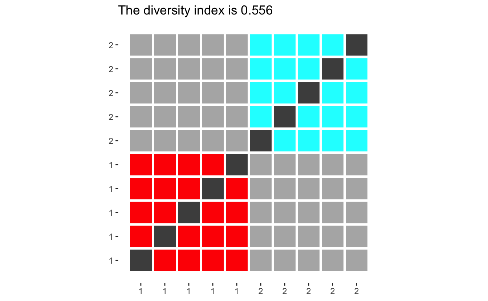
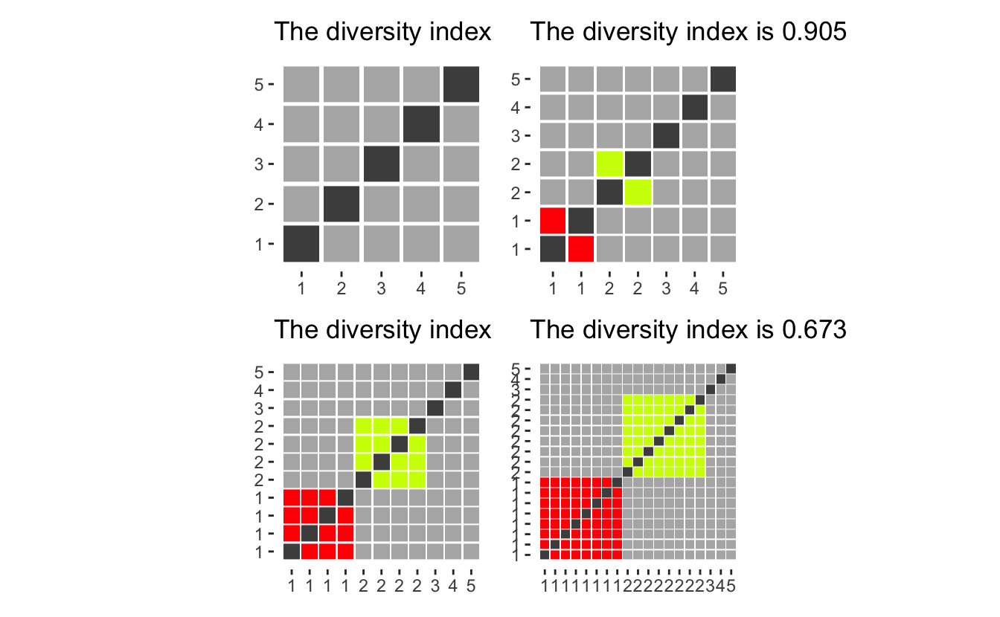

::: {.callout-note}
This code has been lightly revised to make sure it works as of 2018-12-16.
:::

I will In this post explore the ethnic diversity of the student population in schools in California. We will utilize the data provided by [California Department of Education](https://www.cde.ca.gov/) that has [Enrollment by School](https://www.cde.ca.gov/ds/sd/sd/filesenr.asp) which includes "school-level enrollment by racial/ethnic designation, gender, and grade".  

We will combine this data with two other datasets that contain:  

- Longitude and latitude of the schools
- Income information of the cities the schools are located in

Hopefully, we will be able to draw some cool inferences using these datasets while working through the complications you get when you combine datasets from the wild.

## Loading packages

This will be a fairly standard data science exercise so we will stick to the `tidyverse`, `rvest` for scraping, `patchwork` for plot stitching, and add a little fanciness with `ggmap` for local maps. 


```r
library(tidyverse)
library(rvest)
library(patchwork)
library(ggmap)
```

## Enrollment data

We start by downloading the dataset to our local disk and read it from there this is mainly to be nice, and for the fact, the download speed on the files we work with are a little slow. This can be done using `readr`'s `read_tsv()`.


```r
data <- readr::read_tsv("filesenr.asp.txt")
```


To get an idea of the data let's have a quick `glimpse()`


```r
glimpse(data)
## Rows: 129,813
## Columns: 23
## $ CDS_CODE  <chr> "33672490000001", "33672490000001", "33672490000001", "33672…
## $ COUNTY    <chr> "Riverside", "Riverside", "Riverside", "Riverside", "Riversi…
## $ DISTRICT  <chr> "San Jacinto Unified", "San Jacinto Unified", "San Jacinto U…
## $ SCHOOL    <chr> "Nonpublic, Nonsectarian Schools", "Nonpublic, Nonsectarian …
## $ ETHNIC    <dbl> 9, 5, 1, 9, 7, 6, 6, 7, 5, 5, 9, 9, 7, 6, 4, 3, 6, 1, 4, 5, …
## $ GENDER    <chr> "M", "M", "M", "F", "F", "M", "F", "M", "F", "F", "M", "F", …
## $ KDGN      <dbl> 0, 0, 0, 0, 0, 0, 0, 0, 0, 6, 3, 0, 17, 1, 1, 1, 1, 0, 1, 4,…
## $ GR_1      <dbl> 0, 0, 0, 0, 0, 0, 0, 0, 0, 4, 3, 2, 18, 2, 1, 0, 0, 0, 1, 4,…
## $ GR_2      <dbl> 0, 1, 0, 0, 0, 1, 0, 0, 0, 3, 2, 5, 28, 1, 3, 0, 0, 0, 1, 3,…
## $ GR_3      <dbl> 1, 0, 1, 0, 0, 0, 0, 2, 0, 4, 5, 3, 24, 1, 3, 0, 0, 0, 3, 6,…
## $ GR_4      <dbl> 0, 2, 0, 1, 1, 0, 0, 0, 0, 6, 5, 1, 26, 0, 0, 0, 0, 0, 1, 4,…
## $ GR_5      <dbl> 0, 1, 0, 0, 0, 3, 0, 1, 0, 6, 7, 7, 30, 2, 2, 0, 1, 1, 1, 6,…
## $ GR_6      <dbl> 0, 4, 0, 0, 0, 1, 0, 2, 0, 0, 0, 0, 0, 0, 0, 0, 0, 0, 0, 0, …
## $ GR_7      <dbl> 0, 0, 0, 0, 0, 1, 1, 0, 0, 0, 0, 0, 0, 0, 0, 0, 0, 0, 0, 0, …
## $ GR_8      <dbl> 1, 2, 0, 0, 0, 0, 0, 2, 1, 0, 0, 0, 0, 0, 0, 0, 0, 0, 0, 0, …
## $ UNGR_ELM  <dbl> 0, 0, 0, 0, 0, 0, 0, 0, 0, 0, 0, 0, 0, 0, 0, 0, 0, 0, 0, 0, …
## $ GR_9      <dbl> 0, 1, 0, 0, 0, 0, 0, 0, 0, 0, 0, 0, 0, 0, 0, 0, 0, 0, 0, 0, …
## $ GR_10     <dbl> 0, 0, 0, 0, 0, 0, 1, 0, 0, 0, 0, 0, 0, 0, 0, 0, 0, 0, 0, 0, …
## $ GR_11     <dbl> 0, 1, 0, 0, 0, 0, 0, 0, 1, 0, 0, 0, 0, 0, 0, 0, 0, 0, 0, 0, …
## $ GR_12     <dbl> 0, 1, 0, 0, 0, 0, 0, 0, 0, 0, 0, 0, 0, 0, 0, 0, 0, 0, 0, 0, …
## $ UNGR_SEC  <dbl> 0, 3, 0, 0, 0, 0, 0, 0, 0, 0, 0, 0, 0, 0, 0, 0, 0, 0, 0, 0, …
## $ ENR_TOTAL <dbl> 2, 16, 1, 1, 1, 6, 2, 7, 2, 29, 25, 18, 143, 7, 10, 1, 2, 1,…
## $ ADULT     <dbl> 0, 0, 0, 0, 0, 0, 0, 0, 0, 0, 0, 0, 0, 0, 0, 0, 0, 0, 0, 0, …
```

and we notice that `CDS_CODE` is being read as a chr which is favorable in this case since we don't want it as an integer but rather as an ID variable. If this column had been converted to integers we would have lost leading zeros which could lead to trouble.

## Longitude and latitude data

The longitude and latitude of the schools are also available on the California Department of Education's website [here](https://www.cde.ca.gov/ds/si/ds/fspubschls.asp). It includes quite a lot of information, a lot of it uninteresting for this project so will take a subset of it for further analysis. `read_tsv` complaints a little bit when reading it in, but after some crosschecking with the .xls file also provided, does it seem to be correct so we will ignore the error (don't just ignore error all the time! most of the time they are telling you something important! in this case, the problems stem from missing values and tab-separated values don't mix that nicely).


```r
longlat_raw <- read_tsv("pubschls.txt")
longlat <- longlat_raw %>%
  select(CDSCode, Latitude, Longitude, School, City)
```


Let us have a peek at the data:


```r
glimpse(longlat)
## Rows: 10,014
## Columns: 5
## $ CDSCode   <chr> "01100170000000", "01100170109835", "01100170112607", "01100…
## $ Latitude  <dbl> 37.65821, 37.52144, 37.80452, 37.86899, 37.78465, 37.84737, …
## $ Longitude <dbl> -122.0971, -121.9939, -122.2682, -122.2784, -122.2386, -122.…
## $ School    <chr> NA, "FAME Public Charter", "Envision Academy for Arts & Tech…
## $ City      <chr> "Hayward", "Newark", "Oakland", "Berkeley", "Oakland", "Oakl…
```

we see that the columns have been read in appropriate ways. We recognize the `CDS_CODE` from before as `CDSCode` in this dataset which we will use to combine the datasets later.

## Income data

Lastly, we will get some income data, I found some fairly good data on [Wikipedia](https://en.wikipedia.org/wiki/List_of_California_locations_by_income). We use simple `rvest` tools to extract the table from the website and give it column names.  

While the income data is quite lovely, would it be outside the scope of this post to identify which census-designated place (CDP) each of the schools belongs it. The second best option is to use the income data on a county-by-county basis. This will mean that we trade a bit of granularity for time. But hopefully, it will still lead to some meaningful findings.


```r
url <- "https://en.wikipedia.org/wiki/List_of_California_locations_by_income"
income_data <- read_html(url) %>%
  html_nodes("table") %>%
  .[2] %>%
  html_table() %>%
  .[[1]] %>%
  set_names(c("county", "population", "population_density", 
              "per_capita_income", "median_household_income",
              "median_family_income"))
```

lets take a look at the table:


```r
glimpse(income_data)
## Rows: 58
## Columns: 6
## $ county                  <chr> "Alameda", "Alpine", "Amador", "Butte", "Calav…
## $ population              <chr> "1,559,308", "1,202", "37,159", "221,578", "44…
## $ population_density      <chr> "2,109.8", "1.6", "62.5", "135.4", "44.0", "18…
## $ per_capita_income       <chr> "$36,439", "$24,375", "$27,373", "$24,430", "$…
## $ median_household_income <chr> "$73,775", "$61,343", "$52,964", "$43,165", "$…
## $ median_family_income    <chr> "$90,822", "$71,932", "$68,765", "$56,934", "$…
```

here we see a couple of things that look weirds. Every column character is valued, which it shouldn't be since 5 out of the 6 variables should be numerical.  

We will use the wonderful `parse_number` function from the `readr` package to convert the character values to numeric.


```r
income_data_clean <- income_data %>%
  mutate_at(vars(population:median_family_income), parse_number)
```

a quick glimpse to see everything went well


```r
glimpse(income_data_clean)
## Rows: 58
## Columns: 6
## $ county                  <chr> "Alameda", "Alpine", "Amador", "Butte", "Calav…
## $ population              <dbl> 1559308, 1202, 37159, 221578, 44921, 21424, 10…
## $ population_density      <dbl> 2109.8, 1.6, 62.5, 135.4, 44.0, 18.6, 1496.0, …
## $ per_capita_income       <dbl> 36439, 24375, 27373, 24430, 29296, 22211, 3877…
## $ median_household_income <dbl> 73775, 61343, 52964, 43165, 54936, 50503, 7979…
## $ median_family_income    <dbl> 90822, 71932, 68765, 56934, 67100, 56472, 9508…
```

And we are good to go!

## Ethnic diversity

To be able to compare the ethnic diversity between schools we need a measure that describes diversity, to begin with. I'll use the diversity index [developed in 1991](https://www.unc.edu/~pmeyer/carstat/tools.html) by a researcher at the University of North Carolina at Chapel Hill. The index simply asks: "What is the probability that two people in a population picked at random will be from different ethnicity". At first, this can be seen as a daunting task, but if we look at it geometrically we notice that the calculations are quite straightforward.  

If we imagine a population of 10 people split into two ethnicities, with 5 in each. Then we can draw the following outcome space:


```r
diversity_plot(makeup = rep(5, 2))
```



(the code for `diversity_plot` is displayed at the end of the article for those interested.)

Where the colored squares represent random picks with the same ethnicity, light grey squares pick with different ethnicities. Dark grey indicates impossible picks (the same person picked twice) and should be ignored. Now the diversity index can be calculated by dividing the number of light grey squares by the sum of light grey and colored squares.  

Before we go on, let us look at how different populations have different diversity indexes. If we only have two groups, will the diversity score converge to 0.5 for large populations, however with small populations will the index be quite large since each person contributes such a big percentage of the group, making it harder to pick another one in the same group.


```r
diversity_plot(rep(1, 2)) + 
  diversity_plot(rep(2, 2)) +
  diversity_plot(rep(4, 2)) +
  diversity_plot(rep(8, 2))
```


Effectively giving that adding a single person from a new group will maximize the contribution to the index.


```r
diversity_plot(c(rep(1, 2), 1, 1, 1)) + 
  diversity_plot(c(rep(2, 2), 1, 1, 1)) +
  diversity_plot(c(rep(4, 2), 1, 1, 1)) +
  diversity_plot(c(rep(8, 2), 1, 1, 1))
```



```r
diversity_plot(c(2, 3, 4, 5, 6) * 1) + 
  diversity_plot(c(2, 3, 4, 5, 6) * 2) +
  diversity_plot(c(2, 3, 4, 5, 6) * 3) +
  diversity_plot(c(2, 3, 4, 5, 6) * 4)
```


Now that we have seen the diversity index in use let's apply it to the data we have collected.

We would like to have the data in a different kind of tidy format, namely we want each row to represent each school. Taking another look at the data


```r
glimpse(data)
## Rows: 129,813
## Columns: 23
## $ CDS_CODE  <chr> "33672490000001", "33672490000001", "33672490000001", "33672…
## $ COUNTY    <chr> "Riverside", "Riverside", "Riverside", "Riverside", "Riversi…
## $ DISTRICT  <chr> "San Jacinto Unified", "San Jacinto Unified", "San Jacinto U…
## $ SCHOOL    <chr> "Nonpublic, Nonsectarian Schools", "Nonpublic, Nonsectarian …
## $ ETHNIC    <dbl> 9, 5, 1, 9, 7, 6, 6, 7, 5, 5, 9, 9, 7, 6, 4, 3, 6, 1, 4, 5, …
## $ GENDER    <chr> "M", "M", "M", "F", "F", "M", "F", "M", "F", "F", "M", "F", …
## $ KDGN      <dbl> 0, 0, 0, 0, 0, 0, 0, 0, 0, 6, 3, 0, 17, 1, 1, 1, 1, 0, 1, 4,…
## $ GR_1      <dbl> 0, 0, 0, 0, 0, 0, 0, 0, 0, 4, 3, 2, 18, 2, 1, 0, 0, 0, 1, 4,…
## $ GR_2      <dbl> 0, 1, 0, 0, 0, 1, 0, 0, 0, 3, 2, 5, 28, 1, 3, 0, 0, 0, 1, 3,…
## $ GR_3      <dbl> 1, 0, 1, 0, 0, 0, 0, 2, 0, 4, 5, 3, 24, 1, 3, 0, 0, 0, 3, 6,…
## $ GR_4      <dbl> 0, 2, 0, 1, 1, 0, 0, 0, 0, 6, 5, 1, 26, 0, 0, 0, 0, 0, 1, 4,…
## $ GR_5      <dbl> 0, 1, 0, 0, 0, 3, 0, 1, 0, 6, 7, 7, 30, 2, 2, 0, 1, 1, 1, 6,…
## $ GR_6      <dbl> 0, 4, 0, 0, 0, 1, 0, 2, 0, 0, 0, 0, 0, 0, 0, 0, 0, 0, 0, 0, …
## $ GR_7      <dbl> 0, 0, 0, 0, 0, 1, 1, 0, 0, 0, 0, 0, 0, 0, 0, 0, 0, 0, 0, 0, …
## $ GR_8      <dbl> 1, 2, 0, 0, 0, 0, 0, 2, 1, 0, 0, 0, 0, 0, 0, 0, 0, 0, 0, 0, …
## $ UNGR_ELM  <dbl> 0, 0, 0, 0, 0, 0, 0, 0, 0, 0, 0, 0, 0, 0, 0, 0, 0, 0, 0, 0, …
## $ GR_9      <dbl> 0, 1, 0, 0, 0, 0, 0, 0, 0, 0, 0, 0, 0, 0, 0, 0, 0, 0, 0, 0, …
## $ GR_10     <dbl> 0, 0, 0, 0, 0, 0, 1, 0, 0, 0, 0, 0, 0, 0, 0, 0, 0, 0, 0, 0, …
## $ GR_11     <dbl> 0, 1, 0, 0, 0, 0, 0, 0, 1, 0, 0, 0, 0, 0, 0, 0, 0, 0, 0, 0, …
## $ GR_12     <dbl> 0, 1, 0, 0, 0, 0, 0, 0, 0, 0, 0, 0, 0, 0, 0, 0, 0, 0, 0, 0, …
## $ UNGR_SEC  <dbl> 0, 3, 0, 0, 0, 0, 0, 0, 0, 0, 0, 0, 0, 0, 0, 0, 0, 0, 0, 0, …
## $ ENR_TOTAL <dbl> 2, 16, 1, 1, 1, 6, 2, 7, 2, 29, 25, 18, 143, 7, 10, 1, 2, 1,…
## $ ADULT     <dbl> 0, 0, 0, 0, 0, 0, 0, 0, 0, 0, 0, 0, 0, 0, 0, 0, 0, 0, 0, 0, …
```

and we would like to across each `ETHNIC` category within each school, ignoring `GENDER` (including gender could be an interesting question for another time). Luckily the total enrollment is already calculated for us `ENR_TOTAL` so we don't have to do that manually.


```r
small_data <- data %>%
  select(CDS_CODE, ETHNIC, ENR_TOTAL) %>%
  group_by(CDS_CODE, ETHNIC) %>%
  summarize(ENR_TOTAL = sum(ENR_TOTAL)) %>%
  spread(ETHNIC, ENR_TOTAL, fill = 0) %>%
  ungroup()
## `summarise()` has grouped output by 'CDS_CODE'. You can override using the `.groups` argument.
```


```r
glimpse(small_data)
## Rows: 10,483
## Columns: 10
## $ CDS_CODE <chr> "01100170112607", "01100170123968", "01100170124172", "011001…
## $ `0`      <dbl> 0, 3, 0, 2, 0, 0, 1, 0, 0, 0, 0, 0, 0, 3, 23, 0, 4, 2, 7, 0, …
## $ `1`      <dbl> 5, 6, 0, 2, 0, 0, 1, 1, 1, 0, 1, 0, 0, 3, 6, 0, 0, 4, 1, 1, 0…
## $ `2`      <dbl> 8, 24, 161, 22, 0, 11, 0, 15, 0, 3, 30, 3, 98, 109, 49, 91, 4…
## $ `3`      <dbl> 5, 2, 1, 0, 0, 2, 0, 23, 0, 2, 2, 0, 4, 16, 0, 1, 1, 9, 0, 0,…
## $ `4`      <dbl> 1, 2, 7, 5, 1, 1, 2, 2, 1, 0, 18, 0, 21, 35, 16, 34, 21, 104,…
## $ `5`      <dbl> 212, 125, 18, 96, 21, 109, 123, 452, 425, 21, 190, 8, 17, 97,…
## $ `6`      <dbl> 150, 23, 14, 75, 58, 95, 21, 84, 23, 1, 33, 6, 7, 81, 98, 63,…
## $ `7`      <dbl> 18, 16, 35, 115, 2, 13, 1, 1, 8, 10, 85, 12, 30, 98, 177, 164…
## $ `9`      <dbl> 4, 7, 121, 57, 5, 11, 0, 10, 4, 2, 21, 2, 6, 41, 64, 62, 34, …
```
Before we move on, let us reference the data documentation to see what each of the `ETHNIC` numbers means. [File Structure](https://www.cde.ca.gov/ds/sd/sd/fsenr.asp) which states the following:

- Code 0 = Not reported
- Code 1 = American Indian or Alaska Native, Not Hispanic
- Code 2 = Asian, Not Hispanic
- Code 3 = Pacific Islander, Not Hispanic
- Code 4 = Filipino, Not Hispanic
- Code 5 = Hispanic or Latino
- Code 6 = African American, not Hispanic
- Code 7 = White, not Hispanic
- Code 9 = Two or More Races, Not Hispanic

So now we have two decisions we need to deal with before moving on. How to take care of the "Not reported" cases, and "Two or More Races, Not Hispanic". The second point has been discussed before [Updating the USA TODAY Diversity Index](https://www.unc.edu/~pmeyer/carstat/tools.html).

Let's start with the case of code 0. We notice that the category generally is quite small compared to the other groups, so we need to reason about what would happen if we drop them.


```r
diversity_plot(c(10, 10, 2)) +
  diversity_plot(c(10, 10)) +
  diversity_plot(c(11, 11)) +
  diversity_plot(c(10, 10, 10, 3)) +
  diversity_plot(c(10, 10, 10)) +
  diversity_plot(c(11, 11, 11)) +
  plot_layout(nrow = 2)
```


as we see that having them be a separate group (first column), gives a higher diversity score than ignoring them (second column) or adding them evenly to the remaining groups (third column). However, ignoring them and spreading them gives mostly the same diversity index (when the group is small compared to the whole). Thus we will drop the "Not reported" column as it would otherwise inflate the diversity index.  

Coping with multi-ethnicity is quite hard, and we will pick between four options. 

- Assume everyone in "Two or More Races, Not Hispanic" is the same ethnicity
- Assume everyone in "Two or More Races, Not Hispanic" is all different ethnicities
- Ignore the group "Two or More Races, Not Hispanic"
- Distribute the group "Two or More Races, Not Hispanic" evenly into the other groups

Let us evaluate the different choices with some visualizations.

Assume we have 3 main groups. with 5 in each, and an additional 3 people who have picked "Two or More Races, Not Hispanic". 


```r
diversity_plot(c(5, 5, 5, 3)) +
  diversity_plot(c(5, 5, 5, rep(1, 3))) +
  diversity_plot(c(5, 5, 5)) +
  diversity_plot(c(6, 6, 6))
```


Option 3 and 4 both yield low diversity index considering that the choice of "Two or More Races, Not Hispanic" must indicate that they are different enough not to be put into one of the more precisely defined groups. The first option while appalling from a computational standpoint would treat a black-white mixture and an Asian-American Indian as members of the same group even though they had no racial identity in common. Thus We will work with the second option which in any case might overestimate the diversity of any given population as they oath to be some people "Two or More Races, Not Hispanic" with identical mixes (siblings would be a prime example).  

After deciding we can create a `dplyr` friendly function to calculate the diversity index based on a collection of columns. Here we denote `y` as the column denoting "Two or More Races, Not Hispanic".


```r
diversity <- function(..., y) {
 x <- sapply(list(...), cbind)
 total <- cbind(x, y)
 1 - (rowSums(x ^ 2) - rowSums(x)) / (rowSums(total) ^ 2 - rowSums(total))
}
```

## Bring back the data!

We are finally able to calculate some diversity indexes!!! Using our recently made function within `mutate` gives us what we need.


```r
data_diversity <- small_data %>%
  mutate(diversity = diversity(`1`, `2`, `3`, `4`, `5`, `6`, `7`, y = `9`))
```

Let us run a `summary` to see what ranges we get.
 

```r
summary(data_diversity$diversity)
##    Min. 1st Qu.  Median    Mean 3rd Qu.    Max.    NA's 
##  0.0000  0.3113  0.5216  0.4686  0.6351  1.0000      88
```

Interesting. All the numbers are between 0 and 1 which is good! that means that the `diversity` worked as intended. However there are 88 schools have `NA` valued diversity, lets look at those schools:


```r
filter(data_diversity, is.na(diversity)) %>% head()
## # A tibble: 6 x 11
##   CDS_CODE         `0`   `1`   `2`   `3`   `4`   `5`   `6`   `7`   `9` diversity
##   <chr>          <dbl> <dbl> <dbl> <dbl> <dbl> <dbl> <dbl> <dbl> <dbl>     <dbl>
## 1 01612590121210     0     0     0     0     0     0     1     0     0       NaN
## 2 04755070000001     2     0     0     0     0     0     0     1     0       NaN
## 3 06615980000001     0     0     0     0     0     0     0     1     0       NaN
## 4 07618040000000     0     0     0     0     0     0     0     1     0       NaN
## 5 09619600000001     0     0     0     0     0     0     0     1     0       NaN
## 6 10622400114587     0     0     0     0     0     1     0     0     0       NaN
```

So it seems like some of the schools have such a low number of kids that the calculations break down. We will exclude these schools for now.


```r
data_diversity <- data_diversity %>%
  filter(!is.na(diversity))
```

Next let us look at the distribution of diversity indexes.


```r
ggplot(data_diversity, aes(diversity)) +
  geom_histogram(binwidth = 0.01)
```


We notice that most of the schools follow a nice shape, except a spike at 0 and 1. Lets look at the 0's first:


```r
data_diversity %>%
  filter(diversity == 0) %>%
  head(20)
## # A tibble: 20 x 11
##    CDS_CODE        `0`   `1`   `2`   `3`   `4`   `5`   `6`   `7`   `9` diversity
##    <chr>         <dbl> <dbl> <dbl> <dbl> <dbl> <dbl> <dbl> <dbl> <dbl>     <dbl>
##  1 016116800000…     0     0     0     0     0     0     2     0     0         0
##  2 021002502300…     0     2     0     0     0     0     0     0     0         0
##  3 076171300000…     0     0     0     0     0     0     0     6     0         0
##  4 096195200000…     0     0     0     0     0     0     0     3     0         0
##  5 096197800000…     0     0     0     0     0     0     0     4     0         0
##  6 106212510304…     0     0     0     0     0    26     0     0     0         0
##  7 106212510308…     0     0     0     0     0     2     0     0     0         0
##  8 106215801089…     1     0     0     0     0    13     0     0     0         0
##  9 106236401268…     0     0     0     0     0    47     0     0     0         0
## 10 107380910301…     0     0     0     0     0    12     0     0     0         0
## 11 107399900000…     0     0     0     0     0     3     0     0     0         0
## 12 107512710302…     0     0     0     0     0    18     0     0     0         0
## 13 107512710307…     0     0     0     0     0     5     0     0     0         0
## 14 107523410303…     0     0     0     0     0     8     0     0     0         0
## 15 107523460058…     0     0     0     0     0   174     0     0     0         0
## 16 117656211300…     2     0     0     0     0     9     0     0     0         0
## 17 126281000000…     0     0     0     0     0     0     0     2     0         0
## 18 127538212300…     0     0     0     0     0     0     0    11     0         0
## 19 127538261078…     0     0     0     0     0     0     0     7     0         0
## 20 131013213301…     0     0     0     0     0     8     0     0     0         0
```

These all appear to be schools with just one race in them, most appear to be of category 5 which is "Hispanic or Latino". Next lets take a look at the 1's:


```r
data_diversity %>%
  filter(diversity == 1) %>%
  head(20)
## # A tibble: 20 x 11
##    CDS_CODE        `0`   `1`   `2`   `3`   `4`   `5`   `6`   `7`   `9` diversity
##    <chr>         <dbl> <dbl> <dbl> <dbl> <dbl> <dbl> <dbl> <dbl> <dbl>     <dbl>
##  1 016112700000…     0     0     1     0     0     1     0     1     0         1
##  2 046152300000…     0     0     0     0     0     0     0     1     1         1
##  3 056155600000…     0     0     0     0     0     1     0     1     0         1
##  4 076176200000…     0     0     0     0     0     0     1     1     0         1
##  5 076177000000…     1     0     1     0     0     1     0     1     0         1
##  6 097378300000…     1     1     0     0     0     1     0     1     0         1
##  7 106215801202…     0     0     0     0     0     0     1     1     0         1
##  8 117548111301…     0     0     0     0     0     1     0     1     0         1
##  9 141014014300…     0     1     0     0     0     1     0     1     0         1
## 10 156336200000…     0     0     0     0     0     1     1     0     0         1
## 11 176402200000…     0     0     0     0     0     1     0     1     0         1
## 12 196456819961…     0     0     0     0     0     1     0     1     0         1
## 13 197343761144…     0     0     0     0     0     1     1     0     1         1
## 14 207641420300…     0     0     0     0     0     1     0     1     0         1
## 15 246578900000…     0     0     0     0     0     0     1     1     0         1
## 16 257358525301…     0     0     0     0     0     0     0     1     1         1
## 17 261026401286…     0     0     0     0     0     1     0     1     1         1
## 18 286624100000…     0     0     0     0     0     1     0     1     0         1
## 19 316684500000…     0     0     0     0     0     1     0     1     0         1
## 20 336697701341…     0     0     0     0     0     1     1     1     0         1
```

As we have seen before, a diversity index of 1 can only happen if the maximal number of students in each category is 1. These schools seem to be rather small.  Taking a look at the first school here


```r
data %>% filter(CDS_CODE == "17640220000001") %>% pull(SCHOOL)
## [1] "Nonpublic, Nonsectarian Schools" "Nonpublic, Nonsectarian Schools"
```

and we get that it is a "Nonpublic, Nonsectarian Schools" which by further investigation shows that there are quite a few of those. Lets take a look at the total enrollment in each of the schools, we have seen a couple of instances with low enrollment and we wouldn't want those to distort our view.


```r
total_students <- data %>% 
  select(CDS_CODE:SCHOOL, ENR_TOTAL) %>% 
  group_by(CDS_CODE) %>%
  summarise(ENR_TOTAL = sum(ENR_TOTAL)) %>% 
  ungroup() 
```

We also create a `meta` data.frame which stores the `CDS_CODE` along with county, district, and school name.


```r
meta <- data %>%
  select(CDS_CODE:SCHOOL) %>%
  distinct() 
```

Looking at the distribution of total enrollment


```r
total_students %>% 
  ggplot(aes(ENR_TOTAL)) +
  geom_histogram(bins = 1000)
```


We see a big hump around the 600-700 mark, but also a big spike towards 0, lets take a closer look at the small values


```r
total_students %>% 
  filter(ENR_TOTAL < 250) %>%
  ggplot(aes(ENR_TOTAL)) +
  geom_histogram(bins = 250)
```


Here we make another choice that will ultimately change the outcome of the analysis. But I will restrict the investigation to schools with a total enrollment of 50 or more.


```r
data_big <- total_students %>%
  left_join(meta, by = "CDS_CODE") %>%
  filter(ENR_TOTAL >= 50)
```

Then we join that back to our enrollment data such that we have meta and diversity information in the same data.frame.


```r
data_enrollment <- data_diversity %>%
  right_join(data_big, by = "CDS_CODE")
```

We start by looking to see if there is some correlation between total enrollment (`ENR_TOTAL`) and the diversity index (`diversity`). We fit with a simple linear model, to begin with.


```r
data_enrollment %>%
  ggplot(aes(ENR_TOTAL, diversity)) +
  geom_point(alpha = 0.1) +
  geom_smooth(method = "lm") +
  theme_minimal() +
  ylim(0, 1) +
  labs(x = "Enrollment", 
       y = "Diversity Index",
       title = "Larger Californian schools tend to have a higher diversity index")
## `geom_smooth()` using formula 'y ~ x'
```


It is quite a small slope but still about a 5% increase in diversity per 2000 students. Let us verify the correlation by checking the null hypothesis.


```r
data_enrollment %>%
  mutate(ENR_TOTAL = ENR_TOTAL / 1000) %>%
  lm(diversity ~ ENR_TOTAL, data = .) %>%
  summary()
## 
## Call:
## lm(formula = diversity ~ ENR_TOTAL, data = .)
## 
## Residuals:
##     Min      1Q  Median      3Q     Max 
## -0.5053 -0.1584  0.0533  0.1658  0.3926 
## 
## Coefficients:
##             Estimate Std. Error t value Pr(>|t|)    
## (Intercept) 0.447968   0.003489 128.399  < 2e-16 ***
## ENR_TOTAL   0.023239   0.004132   5.624 1.92e-08 ***
## ---
## Signif. codes:  0 '***' 0.001 '**' 0.01 '*' 0.05 '.' 0.1 ' ' 1
## 
## Residual standard error: 0.2111 on 9407 degrees of freedom
## Multiple R-squared:  0.003351,	Adjusted R-squared:  0.003245 
## F-statistic: 31.63 on 1 and 9407 DF,  p-value: 1.923e-08
```

We can't reject the null hypothesis of no correlation and we get a better estimate of the slope to 2.3%. Of cause, we can't extrapolate the results outside the range of the existing data since the response variable is bounded.

## Where are we?

Let's try to join the enrollment data to the geographical data so we can bring out some maps! The `longlat` dataset has quite an unfortunate number of missing values.


```r
longlat$Latitude %>% is.na() %>% mean()
## [1] 0.2784102
```

But we will see if we can work with it anyways.


```r
miss_lat_div <- data_enrollment %>%
  left_join(longlat, by = c("CDS_CODE" = "CDSCode")) %>% 
  filter(is.na(Latitude)) %>%
  pull(diversity)

have_lat_div <- data_enrollment %>%
  left_join(longlat, by = c("CDS_CODE" = "CDSCode")) %>% 
  filter(!is.na(Latitude)) %>%
  pull(diversity)
```

Sadly it turns out that the longitude and latitude are NOT missing at random as the distribution of the diversity index is not the same for missing and non-missing data.


```r
density(miss_lat_div) %>% plot()
```


```r
density(have_lat_div) %>% plot()
```


We will still venture on with the remaining data, but with a higher caution than before. Hopefully, we will still be able to see some clustering in the remaining data.


```r
map <- map_data("state") %>%
  filter(region == "california")

map_point <- data_enrollment %>%
  left_join(longlat, by = c("CDS_CODE" = "CDSCode")) %>%
  filter(!is.na(Latitude)) 

map %>%
  ggplot(aes(long, lat, group = group)) +
  geom_polygon(fill = "grey80") +
  coord_map() +
  theme_minimal() +
  geom_point(aes(Longitude, Latitude, color = diversity),
             data = map_point,
             inherit.aes = FALSE, alpha = 0.1) +
  scale_color_viridis_c(option = "A") +
  labs(title = "Diversity of schools across California")
```


We don't notice any major geographical trends. However, there are still some gold nuggets here. Dark grey points are overlapping low-diversity index points since the alpha is set to `0.1` therefore we see a couple of instances in mid-California where there are a couple of low-diversity index schools, with each point landing on a certain city.  

The two major cities (Los Angeles and San Francisco) both have quite a few schools with high diversity, however, Los Angeles has some quite dark spots. Let us zoom in to the city level. Since we are getting more local, we will be using the `ggmap` package to quarry the Google Maps so we get a nice underlying map.


```r
LA_map <- get_map(location = 'Los Angeles', zoom = 9)
ggmap(LA_map) +
  geom_point(data = map_point %>%
                      filter(Longitude > -119, Longitude < -117,
                             Latitude < 34.5, Latitude > 33.5), 
             aes(Longitude, Latitude, color = diversity),
             alpha = 0.2) +
  scale_color_viridis_c(option = "A") +
  labs(title = "Low diversity areas tends towards city centers \nin Greater Los Angeles Area")
```


This map shows much more interesting trends!! It appears that low diversity schools cluster together near city centers.

## Where is the money?

We will end this post by taking a look at if the median household income in the county in which the school is located correlates with the diversity index we have calculated for each school.  

This is simply done by joining the two data.frames together and piping them into `ggplot`.


```r
data_enrollment %>% 
  left_join(income_data_clean, by = c("COUNTY" = "county")) %>%
  ggplot(aes(median_household_income, diversity)) +
  geom_jitter(alpha = 0.1, width = 500) +
  geom_smooth(method = "lm") +
  ylim(0, 1) +
  theme_minimal() +
  labs(x = "Median household income", y = "Diversity Index",
       title = "Higher diversity index in CA counties with high Median household income")
```


and we do indeed see a positive correlation between median household income and ethnic diversity in schools in California.  

This is the end of this analysis, I hope you enjoyed it! See you again next time.

## Diversity plotting function


```r
diversity_plot <- function(makeup, fix = 0.45) {
  df <- tibble(id = seq_len(sum(makeup)),
               race = imap(makeup, ~ rep(.y, .x)) %>% unlist())
  
  cols <- structure(rainbow(length(makeup)), 
            names = as.character(seq_len(length(makeup)))) %>%
    c("diag" = "grey30",
      "other" = "grey70")
  
  df1 <- crossing(df, df) %>%
    mutate(fill = case_when(id == id1 ~ "diag",
                            race == race1 ~ as.character(race),
                            TRUE ~ "other")) 
  
  df1 %>%
    ggplot(aes(xmin = id - fix, xmax = id + fix,
               ymin = id1 - fix, ymax = id1 + fix)) +
    geom_rect(aes(fill = fill)) +
    theme(panel.background = element_blank(), 
          panel.border = element_blank()) +
    scale_y_continuous(breaks = df[["id"]], labels = df[["race"]]) +
    scale_x_continuous(breaks = df[["id"]], labels = df[["race"]]) +
    coord_fixed() +
    scale_fill_manual(values = cols) +
    guides(fill = "none") +
    labs(title = paste0("The diversity score is ", 
                        signif(mean(df1$fill %in% c("diag", "other")), digits = 3)))
}
```

<details closed>
<summary> <span title='Click to Expand'> session information </span> </summary>

```r

─ Session info ───────────────────────────────────────────────────────────────
 setting  value                       
 version  R version 4.1.0 (2021-05-18)
 os       macOS Big Sur 10.16         
 system   x86_64, darwin17.0          
 ui       X11                         
 language (EN)                        
 collate  en_US.UTF-8                 
 ctype    en_US.UTF-8                 
 tz       America/Los_Angeles         
 date     2021-07-13                  

─ Packages ───────────────────────────────────────────────────────────────────
 package     * version date       lib source                           
 assertthat    0.2.1   2019-03-21 [1] CRAN (R 4.1.0)                   
 backports     1.2.1   2020-12-09 [1] CRAN (R 4.1.0)                   
 bitops        1.0-7   2021-04-24 [1] CRAN (R 4.1.0)                   
 blogdown      1.3.2   2021-06-09 [1] Github (rstudio/blogdown@00a2090)
 bookdown      0.22    2021-04-22 [1] CRAN (R 4.1.0)                   
 broom         0.7.8   2021-06-24 [1] CRAN (R 4.1.0)                   
 bslib         0.2.5.1 2021-05-18 [1] CRAN (R 4.1.0)                   
 cellranger    1.1.0   2016-07-27 [1] CRAN (R 4.1.0)                   
 cli           3.0.0   2021-06-30 [1] CRAN (R 4.1.0)                   
 clipr         0.7.1   2020-10-08 [1] CRAN (R 4.1.0)                   
 codetools     0.2-18  2020-11-04 [1] CRAN (R 4.1.0)                   
 colorspace    2.0-2   2021-06-24 [1] CRAN (R 4.1.0)                   
 crayon        1.4.1   2021-02-08 [1] CRAN (R 4.1.0)                   
 DBI           1.1.1   2021-01-15 [1] CRAN (R 4.1.0)                   
 dbplyr        2.1.1   2021-04-06 [1] CRAN (R 4.1.0)                   
 desc          1.3.0   2021-03-05 [1] CRAN (R 4.1.0)                   
 details     * 0.2.1   2020-01-12 [1] CRAN (R 4.1.0)                   
 digest        0.6.27  2020-10-24 [1] CRAN (R 4.1.0)                   
 dplyr       * 1.0.7   2021-06-18 [1] CRAN (R 4.1.0)                   
 ellipsis      0.3.2   2021-04-29 [1] CRAN (R 4.1.0)                   
 evaluate      0.14    2019-05-28 [1] CRAN (R 4.1.0)                   
 fansi         0.5.0   2021-05-25 [1] CRAN (R 4.1.0)                   
 farver        2.1.0   2021-02-28 [1] CRAN (R 4.1.0)                   
 forcats     * 0.5.1   2021-01-27 [1] CRAN (R 4.1.0)                   
 fs            1.5.0   2020-07-31 [1] CRAN (R 4.1.0)                   
 generics      0.1.0   2020-10-31 [1] CRAN (R 4.1.0)                   
 ggmap       * 3.0.0   2019-02-05 [1] CRAN (R 4.1.0)                   
 ggplot2     * 3.3.5   2021-06-25 [1] CRAN (R 4.1.0)                   
 glue          1.4.2   2020-08-27 [1] CRAN (R 4.1.0)                   
 gtable        0.3.0   2019-03-25 [1] CRAN (R 4.1.0)                   
 haven         2.4.1   2021-04-23 [1] CRAN (R 4.1.0)                   
 highr         0.9     2021-04-16 [1] CRAN (R 4.1.0)                   
 hms           1.1.0   2021-05-17 [1] CRAN (R 4.1.0)                   
 htmltools     0.5.1.1 2021-01-22 [1] CRAN (R 4.1.0)                   
 httr          1.4.2   2020-07-20 [1] CRAN (R 4.1.0)                   
 jpeg          0.1-8.1 2019-10-24 [1] CRAN (R 4.1.0)                   
 jquerylib     0.1.4   2021-04-26 [1] CRAN (R 4.1.0)                   
 jsonlite      1.7.2   2020-12-09 [1] CRAN (R 4.1.0)                   
 knitr       * 1.33    2021-04-24 [1] CRAN (R 4.1.0)                   
 labeling      0.4.2   2020-10-20 [1] CRAN (R 4.1.0)                   
 lattice       0.20-44 2021-05-02 [1] CRAN (R 4.1.0)                   
 lifecycle     1.0.0   2021-02-15 [1] CRAN (R 4.1.0)                   
 lubridate     1.7.10  2021-02-26 [1] CRAN (R 4.1.0)                   
 magrittr      2.0.1   2020-11-17 [1] CRAN (R 4.1.0)                   
 mapproj       1.2.7   2020-02-03 [1] CRAN (R 4.1.0)                   
 maps          3.3.0   2018-04-03 [1] CRAN (R 4.1.0)                   
 Matrix        1.3-3   2021-05-04 [1] CRAN (R 4.1.0)                   
 mgcv          1.8-35  2021-04-18 [1] CRAN (R 4.1.0)                   
 modelr        0.1.8   2020-05-19 [1] CRAN (R 4.1.0)                   
 munsell       0.5.0   2018-06-12 [1] CRAN (R 4.1.0)                   
 nlme          3.1-152 2021-02-04 [1] CRAN (R 4.1.0)                   
 patchwork   * 1.1.1   2020-12-17 [1] CRAN (R 4.1.0)                   
 pillar        1.6.1   2021-05-16 [1] CRAN (R 4.1.0)                   
 pkgconfig     2.0.3   2019-09-22 [1] CRAN (R 4.1.0)                   
 plyr          1.8.6   2020-03-03 [1] CRAN (R 4.1.0)                   
 png           0.1-7   2013-12-03 [1] CRAN (R 4.1.0)                   
 purrr       * 0.3.4   2020-04-17 [1] CRAN (R 4.1.0)                   
 R6            2.5.0   2020-10-28 [1] CRAN (R 4.1.0)                   
 Rcpp          1.0.7   2021-07-07 [1] CRAN (R 4.1.0)                   
 readr       * 1.4.0   2020-10-05 [1] CRAN (R 4.1.0)                   
 readxl        1.3.1   2019-03-13 [1] CRAN (R 4.1.0)                   
 reprex        2.0.0   2021-04-02 [1] CRAN (R 4.1.0)                   
 RgoogleMaps   1.4.5.3 2020-02-12 [1] CRAN (R 4.1.0)                   
 rjson         0.2.20  2018-06-08 [1] CRAN (R 4.1.0)                   
 rlang         0.4.11  2021-04-30 [1] CRAN (R 4.1.0)                   
 rmarkdown     2.9     2021-06-15 [1] CRAN (R 4.1.0)                   
 rprojroot     2.0.2   2020-11-15 [1] CRAN (R 4.1.0)                   
 rstudioapi    0.13    2020-11-12 [1] CRAN (R 4.1.0)                   
 rvest       * 1.0.0   2021-03-09 [1] CRAN (R 4.1.0)                   
 sass          0.4.0   2021-05-12 [1] CRAN (R 4.1.0)                   
 scales        1.1.1   2020-05-11 [1] CRAN (R 4.1.0)                   
 sessioninfo   1.1.1   2018-11-05 [1] CRAN (R 4.1.0)                   
 sp            1.4-5   2021-01-10 [1] CRAN (R 4.1.0)                   
 stringi       1.6.2   2021-05-17 [1] CRAN (R 4.1.0)                   
 stringr     * 1.4.0   2019-02-10 [1] CRAN (R 4.1.0)                   
 tibble      * 3.1.2   2021-05-16 [1] CRAN (R 4.1.0)                   
 tidyr       * 1.1.3   2021-03-03 [1] CRAN (R 4.1.0)                   
 tidyselect    1.1.1   2021-04-30 [1] CRAN (R 4.1.0)                   
 tidyverse   * 1.3.1   2021-04-15 [1] CRAN (R 4.1.0)                   
 utf8          1.2.1   2021-03-12 [1] CRAN (R 4.1.0)                   
 vctrs         0.3.8   2021-04-29 [1] CRAN (R 4.1.0)                   
 viridisLite   0.4.0   2021-04-13 [1] CRAN (R 4.1.0)                   
 withr         2.4.2   2021-04-18 [1] CRAN (R 4.1.0)                   
 xfun          0.24    2021-06-15 [1] CRAN (R 4.1.0)                   
 xml2          1.3.2   2020-04-23 [1] CRAN (R 4.1.0)                   
 yaml          2.2.1   2020-02-01 [1] CRAN (R 4.1.0)                   

[1] /Library/Frameworks/R.framework/Versions/4.1/Resources/library

```

</details>
<br>
