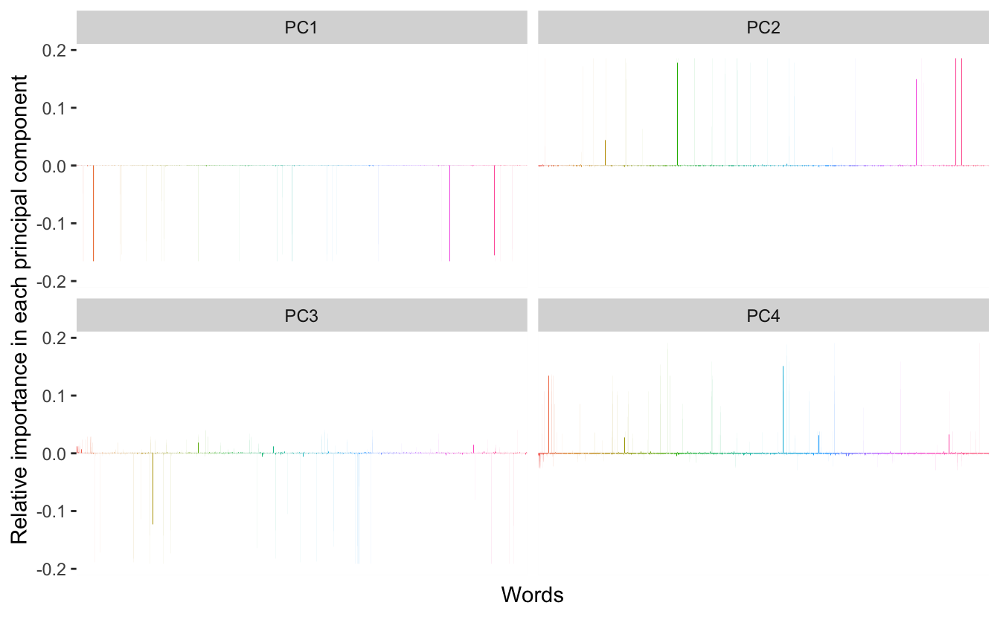
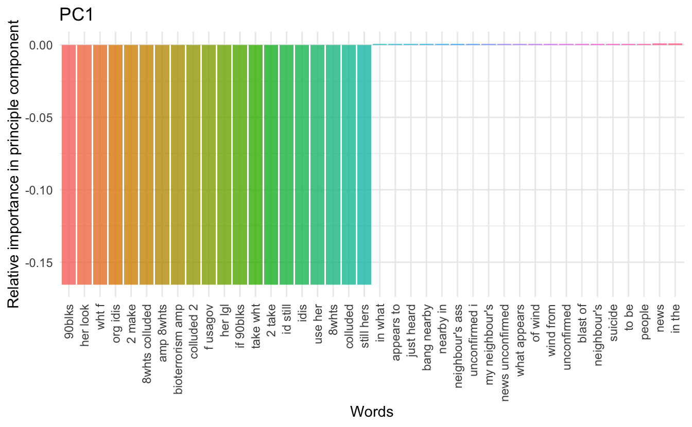
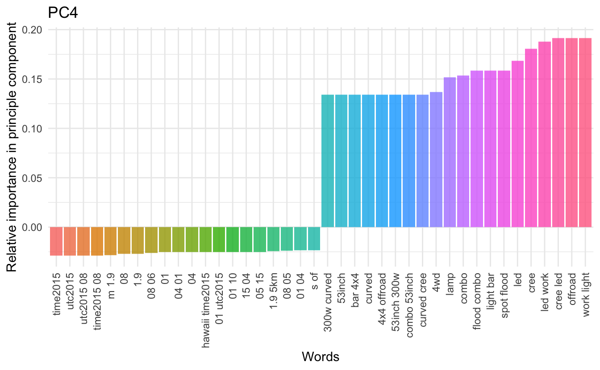

In my earlier post on [binary text classification](https://www.hvitfeldt.me/2018/03/binary-text-classification-with-tidytext-and-caret/) was one of the problems that occurred was the sheer size of the data when trying to fit a model. The bag of words method of having each column describe the occurrence of a specific word in each document (row) is appealing from a mathematical perspective but gives rise to large sparse matrices which aren't handled well by some models in R. This leads to slow running code at best and crashing at worst.  

We will try to combat this problem by using something called [word embedding](https://en.wikipedia.org/wiki/Word_embedding) which is a general term for the process of mapping textural information to a lower-dimensional space. This is a special case of dimensionality reduction, and we will use the simple well-known method [Principal component analysis](https://en.wikipedia.org/wiki/Principal_component_analysis) for our word embedding today. We are essentially trying to squeeze as much information into as little space as possible such that our models can run in a reasonable time.  

We will use the same data as in the earlier post, and the PCA procedure is very inspired by Julia Silge recent post [Understanding PCA using Stack Overflow data](https://juliasilge.com/blog/stack-overflow-pca/) which you should read if you haven't already!!

## Data prepossessing

We will use the standard `tidyverse` toolset for this post. We will use `randomForest` model as this approach should be much faster.


```r
library(tidyverse)
library(tidytext)
library(broom)
library(randomForest)
```

The data we will be using for this demonstration will be some English^[[#benderrule](https://thegradient.pub/the-benderrule-on-naming-the-languages-we-study-and-why-it-matters/)] [social media disaster tweets](https://data.world/crowdflower/disasters-on-social-media) discussed in [this article](https://arxiv.org/pdf/1705.02009.pdf). 
It consists of several tweets regarding accidents mixed in with a selection of control tweets (not about accidents). We start by loading the data.


```r
data <- read_csv("https://raw.githubusercontent.com/EmilHvitfeldt/blog/750dc28aa8d514e2c0b8b418ade584df8f4a8c92/data/socialmedia-disaster-tweets-DFE.csv")
```

And for this exercise, we will only look at the body of the text. Furthermore, a handful of the tweets weren't classified, marked `"Can't Decide"` so we are removing those as well. Since we are working with tweet data we have the constraint that most tweets don't have that much information in them as they are limited in characters and some only contain a couple of words.  

We will at this stage remove what appears to be URLs using some regex and `str_replace_all`, and we will select the columns `id`, `disaster`, and `text`.


```r
data_clean <- data %>%
  filter(choose_one != "Can't Decide") %>%
  mutate(id = `_unit_id`,
         disaster = choose_one == "Relevant",
         text = str_replace_all(text, " ?(f|ht)tp(s?)://(.*)[.][a-z]+", "")) %>%
  select(id, disaster, text)
```

We then extract all unigrams, bigrams and remove stopwords. 


```r
data_counts <- map_df(1:2,
                      ~ unnest_tokens(data_clean, word, text, 
                                      token = "ngrams", n = .x)) %>%
  anti_join(stop_words, by = "word")
```

We will only focus on the top 10000 most used words for the remainder of the analysis.


```r
top10000 <- data_counts %>%
  count(word, sort = TRUE) %>%
  slice(1:10000) %>%
  select(word)
```

we will then count the words again, but this time we will count the word occurrence within each document and remove the underused words.


```r
unnested_words <- data_counts %>%
  count(id, word, sort = TRUE) %>%
  inner_join(top10000, by = "word")
```

We then cast the data.frame to a sparse matrix.


```r
sparse_word_matrix <- unnested_words %>%
  cast_sparse(id, word, n)
```

In the last post, we used this matrix for the modeling, but the size was quite an obstacle. 


```r
dim(sparse_word_matrix)
## [1] 10829 10000
```

We have a row for each document and a row for each of the top 10000 words, but most of the elements are empty so each of the variables doesn't contain much information. We will do word embedding by applying PCA to the sparse word count matrix. Like Julia Silge we will use the wonderful [irlba](https://bwlewis.github.io/irlba/) package that facilities PCA on sparse matrices. First, we scale the matrix and then we apply PCA where we request 64 columns.  

This stage will take some time, but that is the trade-off we will be making when using word embedding. We take some computation time upfront in exchange for quick computation later down the line.


```r
word_scaled <- scale(sparse_word_matrix)
word_pca <- irlba::prcomp_irlba(word_scaled, n = 64)
```

Then we will create a meta data.frame to take care of tweets that disappeared when we cleaned them earlier.


```r
meta <- tibble(id = as.numeric(dimnames(sparse_word_matrix)[[1]])) %>%
  left_join(data_clean[!duplicated(data_clean$id), ], by = "id")
```

Now we combine the PCA matrix with the proper response variable (disaster/non-disaster) with the addition of a training/testing split variable.


```r
class_df <- data.frame(word_pca$x) %>%
  mutate(response = factor(meta$disaster),
         split = sample(0:1, NROW(meta), replace = TRUE, prob = c(0.2, 0.8)))
```

We now have a data frame with 64 explanatory variables instead of the 10000 we started with. This a huge reduction which hopefully should pay off. For this demonstration will we try using two kinds of models. Standard logistic regression and a random forest model. Logistic regression is a good baseline which should be blazing fast now since the reduction has taken place and the random forest model which generally was quite slow should be more manageable this time around.


```r
model <- glm(response ~ ., 
             data = filter(class_df, split == 1), 
             family = binomial)
## Warning: glm.fit: fitted probabilities numerically 0 or 1 occurred

y_pred <- predict(model, 
                  type = "response",
                  newdata = filter(class_df, split == 0) %>% select(-response))
## Warning in predict.lm(object, newdata, se.fit, scale = 1, type = if (type == :
## prediction from a rank-deficient fit may be misleading

y_pred_logical <- if_else(y_pred > 0.5, 1, 0)
(con <- table(y_pred_logical, filter(class_df, split == 0) %>% pull(response)))
##               
## y_pred_logical FALSE TRUE
##              0  1163  591
##              1    70  356
sum(diag(con)) / sum(con)
## [1] 0.696789
```

it work fairly quickly and we get a decent accuracy of 70%. Remember this method isn't meant to improve the accuracy but rather to improve the computational time. 


```r
model <- randomForest(response ~ ., 
                      data = filter(class_df, split == 1))

y_pred <- predict(model, 
                  type = "class",
                  newdata = filter(class_df, split == 0) %>% select(-response))

(con <- table(y_pred, filter(class_df, split == 0) %>% pull(response)))
##        
## y_pred  FALSE TRUE
##   FALSE  1086  383
##   TRUE    147  564
sum(diag(con)) / sum(con)
## [1] 0.7568807
```
This one takes slightly longer to run due to the number of trees, but it does give us the nifty 76% accuracy which is pretty good considering we only look at tweets.

And this is all that there is to it! The dimensionality reduction method was able to reduce the number of variables while retaining most of the information within those variables such that we can run our procedures at a faster phase without much loss. There is still a lot of individual improvements to be done if this was to be used further, both in terms of hyper-parameter selection in the modeling choices but also the number of PCA variables that should be used in the final modeling. Remember that this is just one of the simpler methods, with more advanced word representation methods being [glove](https://nlp.stanford.edu/projects/glove/) and [word2vec](https://www.tensorflow.org/tutorials/word2vec).

## Data viz

Since Julia did most of the legwork for the visualizations so we will take a look at how each of the words contributes to the first four components. 


```r
tidied_pca <- bind_cols(Tag = colnames(word_scaled),
                        word_pca$rotation) %>%
    gather(PC, Contribution, PC1:PC4)

tidied_pca %>% 
    filter(PC %in% paste0("PC", 1:4)) %>%
    ggplot(aes(Tag, Contribution, fill = Tag)) +
    geom_col(show.legend = FALSE) +
    theme(axis.text.x = element_blank(), 
          axis.ticks.x = element_blank()) + 
    labs(x = "Words",
         y = "Relative importance in each principal component") +
    facet_wrap(~ PC, ncol = 2)
```



What we see is quite different then what Julia found in her study. We have just a few words doing most of the contributions in each of component. Lets zoom in to take a look at the words with the most influence on the different components:


```r
map_df(c(-1, 1) * 20,
    ~ tidied_pca %>%
        filter(PC == "PC1") %>% 
        top_n(.x, Contribution)) %>%
    mutate(Tag = reorder(Tag, Contribution)) %>%
    ggplot(aes(Tag, Contribution, fill = Tag)) +
    geom_col(show.legend = FALSE, alpha = 0.8) +
    theme_minimal() +
    theme(axis.text.x = element_text(angle = 90, hjust = 1, vjust = 0.5), 
          axis.ticks.x = element_blank()) +
    labs(x = "Words",
         y = "Relative importance in principle component",
         title = "PC1")
```



We would like to see some sensible separation between the positive words and the negative words (concerning contribution). However, I haven't been able to come up with a meaningful full grouping for the first 3 components. The fourth on the other hand have all the positive influencing words containing numbers in one way or another.


```r
map_df(c(-1, 1) * 20,
    ~ tidied_pca %>%
        filter(PC == "PC4") %>% 
        top_n(.x, Contribution)) %>%
    mutate(Tag = reorder(Tag, Contribution)) %>%
    ggplot(aes(Tag, Contribution, fill = Tag)) +
    geom_col(show.legend = FALSE, alpha = 0.8) +
    theme_minimal() +
    theme(axis.text.x = element_text(angle = 90, hjust = 1, vjust = 0.5), 
          axis.ticks.x = element_blank()) +
    labs(x = "Words",
         y = "Relative importance in principle component",
         title = "PC4")
```



This is all I have for this time. Hope you enjoyed it!

<details closed>
<summary> <span title='Click to Expand'> session information </span> </summary>

```r

─ Session info ───────────────────────────────────────────────────────────────
 setting  value                       
 version  R version 4.1.0 (2021-05-18)
 os       macOS Big Sur 10.16         
 system   x86_64, darwin17.0          
 ui       X11                         
 language (EN)                        
 collate  en_US.UTF-8                 
 ctype    en_US.UTF-8                 
 tz       America/Los_Angeles         
 date     2021-07-13                  

─ Packages ───────────────────────────────────────────────────────────────────
 package      * version date       lib source                           
 assertthat     0.2.1   2019-03-21 [1] CRAN (R 4.1.0)                   
 backports      1.2.1   2020-12-09 [1] CRAN (R 4.1.0)                   
 blogdown       1.3.2   2021-06-09 [1] Github (rstudio/blogdown@00a2090)
 bookdown       0.22    2021-04-22 [1] CRAN (R 4.1.0)                   
 broom        * 0.7.8   2021-06-24 [1] CRAN (R 4.1.0)                   
 bslib          0.2.5.1 2021-05-18 [1] CRAN (R 4.1.0)                   
 cellranger     1.1.0   2016-07-27 [1] CRAN (R 4.1.0)                   
 cli            3.0.0   2021-06-30 [1] CRAN (R 4.1.0)                   
 clipr          0.7.1   2020-10-08 [1] CRAN (R 4.1.0)                   
 codetools      0.2-18  2020-11-04 [1] CRAN (R 4.1.0)                   
 colorspace     2.0-2   2021-06-24 [1] CRAN (R 4.1.0)                   
 crayon         1.4.1   2021-02-08 [1] CRAN (R 4.1.0)                   
 DBI            1.1.1   2021-01-15 [1] CRAN (R 4.1.0)                   
 dbplyr         2.1.1   2021-04-06 [1] CRAN (R 4.1.0)                   
 desc           1.3.0   2021-03-05 [1] CRAN (R 4.1.0)                   
 details      * 0.2.1   2020-01-12 [1] CRAN (R 4.1.0)                   
 digest         0.6.27  2020-10-24 [1] CRAN (R 4.1.0)                   
 dplyr        * 1.0.7   2021-06-18 [1] CRAN (R 4.1.0)                   
 ellipsis       0.3.2   2021-04-29 [1] CRAN (R 4.1.0)                   
 evaluate       0.14    2019-05-28 [1] CRAN (R 4.1.0)                   
 fansi          0.5.0   2021-05-25 [1] CRAN (R 4.1.0)                   
 farver         2.1.0   2021-02-28 [1] CRAN (R 4.1.0)                   
 forcats      * 0.5.1   2021-01-27 [1] CRAN (R 4.1.0)                   
 fs             1.5.0   2020-07-31 [1] CRAN (R 4.1.0)                   
 generics       0.1.0   2020-10-31 [1] CRAN (R 4.1.0)                   
 ggplot2      * 3.3.5   2021-06-25 [1] CRAN (R 4.1.0)                   
 glue           1.4.2   2020-08-27 [1] CRAN (R 4.1.0)                   
 gtable         0.3.0   2019-03-25 [1] CRAN (R 4.1.0)                   
 haven          2.4.1   2021-04-23 [1] CRAN (R 4.1.0)                   
 highr          0.9     2021-04-16 [1] CRAN (R 4.1.0)                   
 hms            1.1.0   2021-05-17 [1] CRAN (R 4.1.0)                   
 htmltools      0.5.1.1 2021-01-22 [1] CRAN (R 4.1.0)                   
 httr           1.4.2   2020-07-20 [1] CRAN (R 4.1.0)                   
 janeaustenr    0.1.5   2017-06-10 [1] CRAN (R 4.1.0)                   
 jquerylib      0.1.4   2021-04-26 [1] CRAN (R 4.1.0)                   
 jsonlite       1.7.2   2020-12-09 [1] CRAN (R 4.1.0)                   
 knitr        * 1.33    2021-04-24 [1] CRAN (R 4.1.0)                   
 labeling       0.4.2   2020-10-20 [1] CRAN (R 4.1.0)                   
 lattice        0.20-44 2021-05-02 [1] CRAN (R 4.1.0)                   
 lifecycle      1.0.0   2021-02-15 [1] CRAN (R 4.1.0)                   
 lubridate      1.7.10  2021-02-26 [1] CRAN (R 4.1.0)                   
 magrittr       2.0.1   2020-11-17 [1] CRAN (R 4.1.0)                   
 Matrix         1.3-3   2021-05-04 [1] CRAN (R 4.1.0)                   
 modelr         0.1.8   2020-05-19 [1] CRAN (R 4.1.0)                   
 munsell        0.5.0   2018-06-12 [1] CRAN (R 4.1.0)                   
 pillar         1.6.1   2021-05-16 [1] CRAN (R 4.1.0)                   
 pkgconfig      2.0.3   2019-09-22 [1] CRAN (R 4.1.0)                   
 png            0.1-7   2013-12-03 [1] CRAN (R 4.1.0)                   
 purrr        * 0.3.4   2020-04-17 [1] CRAN (R 4.1.0)                   
 R6             2.5.0   2020-10-28 [1] CRAN (R 4.1.0)                   
 randomForest * 4.6-14  2018-03-25 [1] CRAN (R 4.1.0)                   
 Rcpp           1.0.7   2021-07-07 [1] CRAN (R 4.1.0)                   
 readr        * 1.4.0   2020-10-05 [1] CRAN (R 4.1.0)                   
 readxl         1.3.1   2019-03-13 [1] CRAN (R 4.1.0)                   
 reprex         2.0.0   2021-04-02 [1] CRAN (R 4.1.0)                   
 rlang          0.4.11  2021-04-30 [1] CRAN (R 4.1.0)                   
 rmarkdown      2.9     2021-06-15 [1] CRAN (R 4.1.0)                   
 rprojroot      2.0.2   2020-11-15 [1] CRAN (R 4.1.0)                   
 rstudioapi     0.13    2020-11-12 [1] CRAN (R 4.1.0)                   
 rvest          1.0.0   2021-03-09 [1] CRAN (R 4.1.0)                   
 sass           0.4.0   2021-05-12 [1] CRAN (R 4.1.0)                   
 scales         1.1.1   2020-05-11 [1] CRAN (R 4.1.0)                   
 sessioninfo    1.1.1   2018-11-05 [1] CRAN (R 4.1.0)                   
 SnowballC      0.7.0   2020-04-01 [1] CRAN (R 4.1.0)                   
 stringi        1.6.2   2021-05-17 [1] CRAN (R 4.1.0)                   
 stringr      * 1.4.0   2019-02-10 [1] CRAN (R 4.1.0)                   
 tibble       * 3.1.2   2021-05-16 [1] CRAN (R 4.1.0)                   
 tidyr        * 1.1.3   2021-03-03 [1] CRAN (R 4.1.0)                   
 tidyselect     1.1.1   2021-04-30 [1] CRAN (R 4.1.0)                   
 tidytext     * 0.3.1   2021-04-10 [1] CRAN (R 4.1.0)                   
 tidyverse    * 1.3.1   2021-04-15 [1] CRAN (R 4.1.0)                   
 tokenizers     0.2.1   2018-03-29 [1] CRAN (R 4.1.0)                   
 utf8           1.2.1   2021-03-12 [1] CRAN (R 4.1.0)                   
 vctrs          0.3.8   2021-04-29 [1] CRAN (R 4.1.0)                   
 withr          2.4.2   2021-04-18 [1] CRAN (R 4.1.0)                   
 xfun           0.24    2021-06-15 [1] CRAN (R 4.1.0)                   
 xml2           1.3.2   2020-04-23 [1] CRAN (R 4.1.0)                   
 yaml           2.2.1   2020-02-01 [1] CRAN (R 4.1.0)                   

[1] /Library/Frameworks/R.framework/Versions/4.1/Resources/library

```

</details>
<br>
