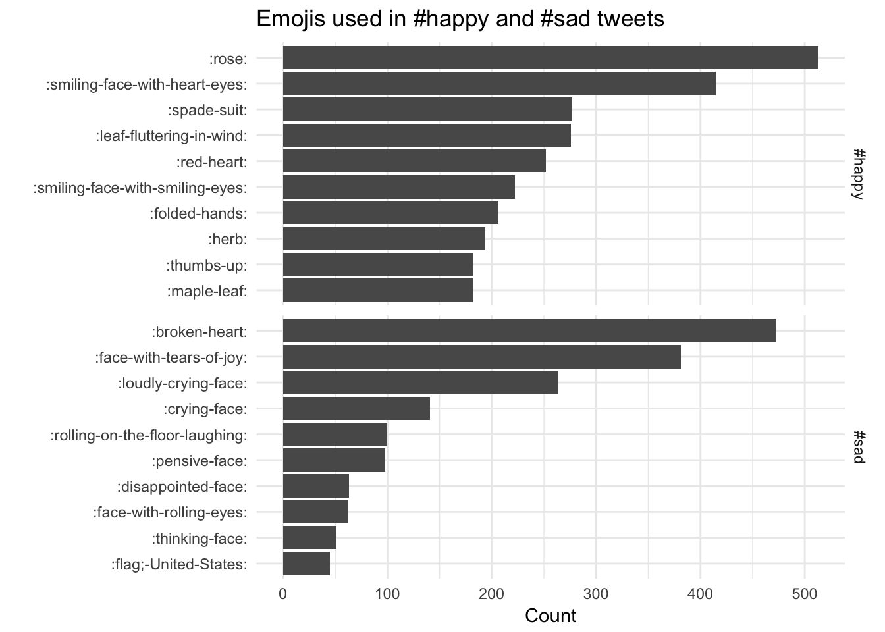

:::note
This code has been lightly revised to make sure it works as of 2018-12-16.
:::

This post will be a short demonstration of how the occurrence of emojis on Twitter can be analyzed using tidytools. We start loading the necessary packages.


```r
library(tidyverse)
library(tidytext)
library(rtweet)
```

I have decided that for this example that I would focus on tweets that include the hashtags #happy and #sad in the hope that both would include a similar number of emojis but hopefully of different groups. We will use the `rtweet` package which already conforms to the tidy principles. Notice the `retryonratelimit = TRUE` argument as the combined number of tweets (10000 + 10000 = 20000) is larger than the 15 min limit of 18000.
 

```r
tweets_happy <- search_tweets("#happy", n = 10000, include_rts = FALSE)
tweets_sad <- search_tweets("#sad", n = 10000, include_rts = FALSE, 
                            retryonratelimit = TRUE)
```

we will safely save these tweets. 


```r
write_as_csv(tweets_happy, "tweets_happy.csv")
write_as_csv(tweets_sad, "tweets_sad.csv")
```

Now we load this data.frame that contains information regarding the various emojis.


```r
emoji <- readr::read_csv("https://raw.githubusercontent.com/EmilHvitfeldt/Emoji-table/master/emoji.csv")
```


Next, we add the hash tag label as the `emotion` variable, next we tokenize all the tweets according to characters (this is done since a lot of the tweets didn't use spaces emojis rendering them hard to detect.) and left join with the `emoji` data.frame such that we get the descriptions.


```r
tweets_all <- bind_rows(
  tweets_happy %>% mutate(emotion = "#happy"),
  tweets_sad %>% mutate(emotion = "#sad")
)

emoji_all <- unnest_tokens(tweets_all, word, text, 
                           token = "characters") %>%
  select(word, emotion) %>%
  left_join(emoji, by = c("word" = "utf")) %>%
  filter(!is.na(shortname))
```

Lastly, we create a simple faceted bar chart of the number of emojis used within each hashtag.


```r
emoji_all %>%
  count(word, emotion, shortname) %>%
  group_by(emotion) %>%
  arrange(desc(n)) %>%
  top_n(10, n) %>%
  ungroup() %>%
  mutate(emoji = reorder(shortname, n)) %>%
  ggplot(aes(emoji, n)) +
  geom_col() +
  facet_grid(emotion ~ ., scales = "free_y") +
  coord_flip() +
  theme_minimal() +
  labs(title = "Emojis used in #happy and #sad tweets",
       y = "Count", x = "")
```



Using the `emoji` data.frame allows us to gain quick insight with the descriptive short names.

<details closed>
<summary> <span title='Click to Expand'> session information </span> </summary>

```r

─ Session info ───────────────────────────────────────────────────────────────
 setting  value                       
 version  R version 4.1.0 (2021-05-18)
 os       macOS Big Sur 10.16         
 system   x86_64, darwin17.0          
 ui       X11                         
 language (EN)                        
 collate  en_US.UTF-8                 
 ctype    en_US.UTF-8                 
 tz       America/Los_Angeles         
 date     2021-07-15                  

─ Packages ───────────────────────────────────────────────────────────────────
 package     * version date       lib source                           
 assertthat    0.2.1   2019-03-21 [1] CRAN (R 4.1.0)                   
 backports     1.2.1   2020-12-09 [1] CRAN (R 4.1.0)                   
 blogdown      1.3.2   2021-06-09 [1] Github (rstudio/blogdown@00a2090)
 bookdown      0.22    2021-04-22 [1] CRAN (R 4.1.0)                   
 broom         0.7.8   2021-06-24 [1] CRAN (R 4.1.0)                   
 bslib         0.2.5.1 2021-05-18 [1] CRAN (R 4.1.0)                   
 cellranger    1.1.0   2016-07-27 [1] CRAN (R 4.1.0)                   
 cli           3.0.0   2021-06-30 [1] CRAN (R 4.1.0)                   
 clipr         0.7.1   2020-10-08 [1] CRAN (R 4.1.0)                   
 codetools     0.2-18  2020-11-04 [1] CRAN (R 4.1.0)                   
 colorspace    2.0-2   2021-06-24 [1] CRAN (R 4.1.0)                   
 crayon        1.4.1   2021-02-08 [1] CRAN (R 4.1.0)                   
 DBI           1.1.1   2021-01-15 [1] CRAN (R 4.1.0)                   
 dbplyr        2.1.1   2021-04-06 [1] CRAN (R 4.1.0)                   
 desc          1.3.0   2021-03-05 [1] CRAN (R 4.1.0)                   
 details     * 0.2.1   2020-01-12 [1] CRAN (R 4.1.0)                   
 digest        0.6.27  2020-10-24 [1] CRAN (R 4.1.0)                   
 dplyr       * 1.0.7   2021-06-18 [1] CRAN (R 4.1.0)                   
 ellipsis      0.3.2   2021-04-29 [1] CRAN (R 4.1.0)                   
 evaluate      0.14    2019-05-28 [1] CRAN (R 4.1.0)                   
 fansi         0.5.0   2021-05-25 [1] CRAN (R 4.1.0)                   
 forcats     * 0.5.1   2021-01-27 [1] CRAN (R 4.1.0)                   
 fs            1.5.0   2020-07-31 [1] CRAN (R 4.1.0)                   
 generics      0.1.0   2020-10-31 [1] CRAN (R 4.1.0)                   
 ggplot2     * 3.3.5   2021-06-25 [1] CRAN (R 4.1.0)                   
 glue          1.4.2   2020-08-27 [1] CRAN (R 4.1.0)                   
 gtable        0.3.0   2019-03-25 [1] CRAN (R 4.1.0)                   
 haven         2.4.1   2021-04-23 [1] CRAN (R 4.1.0)                   
 highr         0.9     2021-04-16 [1] CRAN (R 4.1.0)                   
 hms           1.1.0   2021-05-17 [1] CRAN (R 4.1.0)                   
 htmltools     0.5.1.1 2021-01-22 [1] CRAN (R 4.1.0)                   
 httr          1.4.2   2020-07-20 [1] CRAN (R 4.1.0)                   
 janeaustenr   0.1.5   2017-06-10 [1] CRAN (R 4.1.0)                   
 jquerylib     0.1.4   2021-04-26 [1] CRAN (R 4.1.0)                   
 jsonlite      1.7.2   2020-12-09 [1] CRAN (R 4.1.0)                   
 knitr       * 1.33    2021-04-24 [1] CRAN (R 4.1.0)                   
 lattice       0.20-44 2021-05-02 [1] CRAN (R 4.1.0)                   
 lifecycle     1.0.0   2021-02-15 [1] CRAN (R 4.1.0)                   
 lubridate     1.7.10  2021-02-26 [1] CRAN (R 4.1.0)                   
 magrittr      2.0.1   2020-11-17 [1] CRAN (R 4.1.0)                   
 Matrix        1.3-3   2021-05-04 [1] CRAN (R 4.1.0)                   
 modelr        0.1.8   2020-05-19 [1] CRAN (R 4.1.0)                   
 munsell       0.5.0   2018-06-12 [1] CRAN (R 4.1.0)                   
 pillar        1.6.1   2021-05-16 [1] CRAN (R 4.1.0)                   
 pkgconfig     2.0.3   2019-09-22 [1] CRAN (R 4.1.0)                   
 png           0.1-7   2013-12-03 [1] CRAN (R 4.1.0)                   
 purrr       * 0.3.4   2020-04-17 [1] CRAN (R 4.1.0)                   
 R6            2.5.0   2020-10-28 [1] CRAN (R 4.1.0)                   
 Rcpp          1.0.7   2021-07-07 [1] CRAN (R 4.1.0)                   
 readr       * 1.4.0   2020-10-05 [1] CRAN (R 4.1.0)                   
 readxl        1.3.1   2019-03-13 [1] CRAN (R 4.1.0)                   
 reprex        2.0.0   2021-04-02 [1] CRAN (R 4.1.0)                   
 rlang         0.4.11  2021-04-30 [1] CRAN (R 4.1.0)                   
 rmarkdown     2.9     2021-06-15 [1] CRAN (R 4.1.0)                   
 rprojroot     2.0.2   2020-11-15 [1] CRAN (R 4.1.0)                   
 rstudioapi    0.13    2020-11-12 [1] CRAN (R 4.1.0)                   
 rtweet      * 0.7.0   2020-01-08 [1] CRAN (R 4.1.0)                   
 rvest         1.0.0   2021-03-09 [1] CRAN (R 4.1.0)                   
 sass          0.4.0   2021-05-12 [1] CRAN (R 4.1.0)                   
 scales        1.1.1   2020-05-11 [1] CRAN (R 4.1.0)                   
 sessioninfo   1.1.1   2018-11-05 [1] CRAN (R 4.1.0)                   
 SnowballC     0.7.0   2020-04-01 [1] CRAN (R 4.1.0)                   
 stringi       1.6.2   2021-05-17 [1] CRAN (R 4.1.0)                   
 stringr     * 1.4.0   2019-02-10 [1] CRAN (R 4.1.0)                   
 tibble      * 3.1.2   2021-05-16 [1] CRAN (R 4.1.0)                   
 tidyr       * 1.1.3   2021-03-03 [1] CRAN (R 4.1.0)                   
 tidyselect    1.1.1   2021-04-30 [1] CRAN (R 4.1.0)                   
 tidytext    * 0.3.1   2021-04-10 [1] CRAN (R 4.1.0)                   
 tidyverse   * 1.3.1   2021-04-15 [1] CRAN (R 4.1.0)                   
 tokenizers    0.2.1   2018-03-29 [1] CRAN (R 4.1.0)                   
 utf8          1.2.1   2021-03-12 [1] CRAN (R 4.1.0)                   
 vctrs         0.3.8   2021-04-29 [1] CRAN (R 4.1.0)                   
 withr         2.4.2   2021-04-18 [1] CRAN (R 4.1.0)                   
 xfun          0.24    2021-06-15 [1] CRAN (R 4.1.0)                   
 xml2          1.3.2   2020-04-23 [1] CRAN (R 4.1.0)                   
 yaml          2.2.1   2020-02-01 [1] CRAN (R 4.1.0)                   

[1] /Library/Frameworks/R.framework/Versions/4.1/Resources/library

```

</details>
<br>
