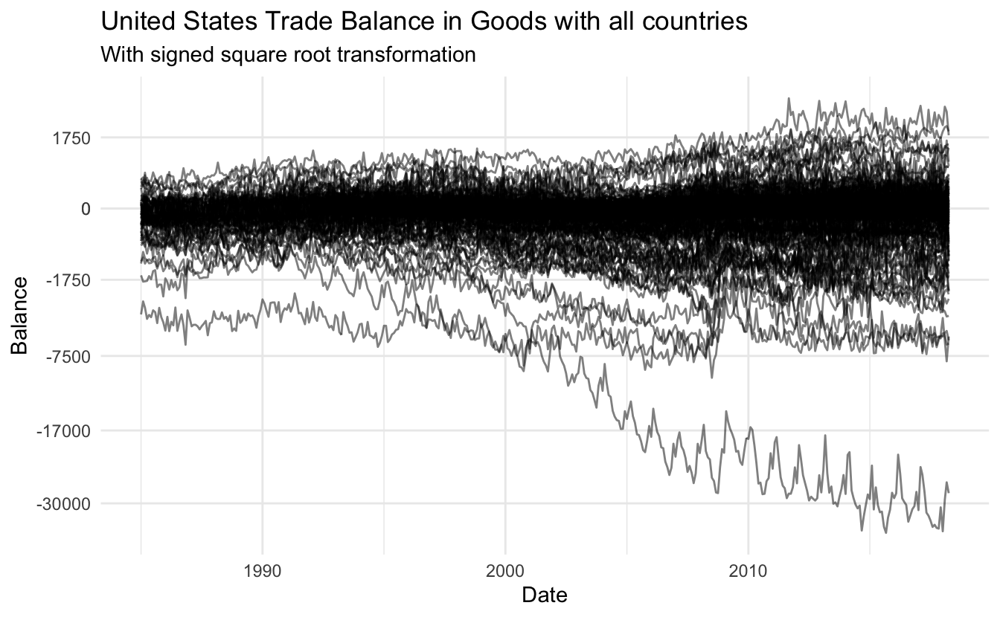

::: {.callout-note}
This code has been lightly revised to make sure it works as of 2018-12-16.
:::

This blog post will showcase an example of a workflow and its associated thought process when iterating through visualization styles working with `ggplot2`. For this reason, will this post include a lot of sub-par charts as you are seeing the steps, not just the final product.  

We will use census data concerning US trade with other nations which we scrape as well.

## Setting up

We will using a standard set of packages, `tidyverse` for general data manipulation, `rvest` and `httr` for scraping and manipulation.


```r
library(tidyverse)
library(rvest)
library(httr)
```

## Getting the data

This project started when I found the following link [https://www.census.gov/foreign-trade/balance/c4099.html](https://www.census.gov/foreign-trade/balance/c4099.html). It includes a month by month breakdown of U.S. trade in goods with Denmark from 1985 till the present. Unfortunately, the data is given in yearly tables, so we have a little bit of munching to do. First, we notice that the last part of the URL includes `c4099`, which after some googling reveals that 4099 is the country code for Denmark. The fill list of country trade codes is given on the following page [https://www.census.gov/foreign-trade/schedules/c/countrycode.html](https://www.census.gov/foreign-trade/schedules/c/countrycode.html) which also include a `.txt` file so we don't have to scrape. We will remove the first entry and last 6 since the US doesn't trade with itself.


```r
continent_df <- tibble(number = as.character(1:7),
                       continent = c("North America", "Central America", 
                                     "South America", "Europe", "Asia", 
                                     "Australia and Oceania", "Africa"))

code_df <- read_lines("https://www.census.gov/foreign-trade/schedules/c/country.txt",
                      skip = 5) %>%
  tibble(code = .) %>%
  separate(code, c("code", "name", "iso"), sep = "\\|") %>%
  mutate_all(trimws) %>%
  mutate(con_code = str_sub(code, 1, 1)) %>%
  filter(!is.na(iso), 
         name != "United States of America", 
         con_code != 9) %>%
  left_join(continent_df, by = c("con_code" = "number")) %>%
  select(-con_code)
```

With these codes we create the targeted URLs we will be scraping


```r
target_urls <- str_glue("https://www.census.gov/foreign-trade/balance/c{code_df$code}.html")
```

We will be replication hrbrmstr's scraping code [found here](https://rud.is/b/2017/09/19/pirating-web-content-responsibly-with-r/) since it works wonderfully.


```r
s_GET <- safely(GET)

pb <- progress_estimated(length(target_urls))
map(target_urls, ~{
  pb$tick()$print()
  Sys.sleep(5)
  s_GET(.x)
}) -> httr_raw_responses

write_rds(httr_raw_responses, "data/2018-us-trade-raw-httr-responses.rds")

good_responses <- keep(httr_raw_responses, ~!is.null(.x$result))
```

then we wrangle all the HTML files by extracting all the tables, parse the numeric variables, and combining them into one table.


```r
wrangle <- function(x, name) {
  # Read html and extract tables
  read_html(x[[1]]) %>%
  html_nodes("table") %>%
  html_table() %>%
  # parse numeric columns
  map(~ mutate_at(.x, vars(Exports:Balance), funs(parse_number))) %>%
  bind_rows() %>%
  mutate(Country = name)
}

full_data <- map2_df(good_responses, code_df$code, wrangle)
```

Lastly, we do some polishing up with the date variables and join in the country information.


```r
trade_data <- full_data %>%
  filter(!str_detect(Month, "TOTAL")) %>%
  mutate(Date = parse_date(Month, format = "%B %Y"), 
         Month = lubridate::month(Date),
         Year = lubridate::year(Date)) %>%
  left_join(code_df, by = c("Country" = "code"))
```

Giving us this data to work with:


```r
glimpse(trade_data)
## Rows: 75,379
## Columns: 10
## $ Month     <dbl> 1, 2, 3, 4, 1, 2, 3, 4, 5, 6, 7, 8, 9, 10, 11, 12, 1, 2, 3, …
## $ Exports   <dbl> 0.1, 0.4, 1.8, 0.2, 0.1, 1.3, 3.2, 0.6, 0.3, 0.6, 0.7, 1.4, …
## $ Imports   <dbl> 1.0, 2.4, 2.2, 0.8, 0.2, 0.5, 0.8, 0.9, 0.4, 2.4, 0.5, 1.0, …
## $ Balance   <dbl> -0.8, -2.0, -0.4, -0.6, -0.1, 0.7, 2.4, -0.3, -0.1, -1.8, 0.…
## $ Country   <dbl> 1010, 1010, 1010, 1010, 1010, 1010, 1010, 1010, 1010, 1010, …
## $ Date      <date> 2018-01-01, 2018-02-01, 2018-03-01, 2018-04-01, 2017-01-01,…
## $ Year      <dbl> 2018, 2018, 2018, 2018, 2017, 2017, 2017, 2017, 2017, 2017, …
## $ name      <chr> "Greenland", "Greenland", "Greenland", "Greenland", "Greenla…
## $ iso       <chr> "GL", "GL", "GL", "GL", "GL", "GL", "GL", "GL", "GL", "GL", …
## $ continent <chr> "North America", "North America", "North America", "North Am…
```

## Let's get visualizing!

Let's set a different theme for now.


```r
theme_set(theme_minimal())
```

Let's start nice and simple by plotting a simple scatter plot for just a single country to get a feel for the data.


```r
trade_data %>% 
  filter(name == "Greenland") %>%
  ggplot(aes(Date, Balance)) +
  geom_point() +
  labs(title = "United States Trade Balance in Goods with Greenland")
```


Which looks good already! Let's see how it would look with as a line chart instead


```r
trade_data %>% 
  filter(name == "Greenland") %>%
  ggplot(aes(Date, Balance)) +
  geom_line() +
  labs(title = "United States Trade Balance in Goods with Greenland")
```


it sure is quite jagged! Let's take a look at the 4 biggest spiked to see if it is an indication of a trend


```r
trade_data %>% 
  filter(name == "Greenland", Balance > 5)
## # A tibble: 4 x 10
##   Month Exports Imports Balance Country Date        Year name   iso   continent 
##   <dbl>   <dbl>   <dbl>   <dbl>   <dbl> <date>     <dbl> <chr>  <chr> <chr>     
## 1     3     7.9     0.5     7.4    1010 2014-03-01  2014 Green… GL    North Ame…
## 2     3    10.4     1       9.4    1010 2013-03-01  2013 Green… GL    North Ame…
## 3     3    10.5     0.6     9.9    1010 2012-03-01  2012 Green… GL    North Ame…
## 4     9    20       1.3    18.8    1010 2008-09-01  2008 Green… GL    North Ame…
```

Which didn't give us much, 3 of the spikes happened in March, and the last one was a random September. It was worth a try, back to plotting! Let's see how a smooth curve would look overlaid the line chart


```r
trade_data %>% 
  filter(name == "Greenland") %>%
  ggplot(aes(Date, Balance)) +
  geom_line() +
  geom_smooth(se = FALSE) +
  labs(title = "United States Trade Balance in Goods with Greenland")
```


This looks nice in and off itself, however, since this chart looks at the trade balance between two countries is the value 0 is quite important and should be highlighted better. I will add a line behind the data points such that it highlights rather than hides


```r
trade_data %>% 
  filter(name == "Greenland") %>%
  ggplot(aes(Date, Balance)) +
  geom_abline(slope = 0, intercept = 0, color = "orange") +
  geom_line() +
  geom_smooth(se = FALSE) +
  labs(title = "United States Trade Balance in Goods with Greenland")
```


This gives us a better indication of when the trade is positive or negative with respect to the United States. Let's take it up a notch and include a couple more countries. We remove the filter and add `Country` as the `group` aesthetic.


```r
trade_data %>% 
  ggplot(aes(Date, Balance, group = Country)) +
  geom_line() +
  labs(title = "United States Trade Balance in Goods with all countries")
```


So we have 3 different problems I would like to fix right now. The scale between these different countries is massively different! The very negative balance of one country is making it hard to see what happens to the other countries. Secondly, it is hard to distinguish the different countries since they are all the same color. And lastly, there is some serious overplotting, this point is tired to the other problems so let us see if we can fix them one at a time.

First, let us transform the scales on the y axis such that we better can identify individual lines. We do this with the square root transformation which gives weights to values close to 0 and shrinks values far away from 0.


```r
trade_data %>% 
  ggplot(aes(Date, Balance, group = Country)) +
  geom_line() + 
  scale_y_sqrt() +
  labs(title = "United States Trade Balance in Goods with all countries",
       subtitle = "With square root transformation")
## Warning in self$trans$transform(x): NaNs produced
## Warning: Transformation introduced infinite values in continuous y-axis
## Warning: Removed 11918 row(s) containing missing values (geom_path).
```


Oh no! We lost all the negative values. This happened because the normal square root operation only works with positive numbers. We fix this by using the *signed square root* which applies the square root to both the positive and negative as if they were positive and then sign them accordingly. For this, we create a new transformation with the `scales` package.


```r
S_sqrt <- function(x) sign(x) * sqrt(abs(x))
IS_sqrt <- function(x) x ^ 2 * sign(x) 
S_sqrt_trans <- function() scales::trans_new("S_sqrt", S_sqrt, IS_sqrt)

trade_data %>% 
  ggplot(aes(Date, Balance, group = Country)) +
  geom_line() + 
  coord_trans(y = "S_sqrt") +
  labs(title = "United States Trade Balance in Goods with all countries",
       subtitle = "With signed square root transformation")
```


Much better! We will fix the breaks a little bit too.


```r
trade_data %>% 
  ggplot(aes(Date, Balance, group = Country)) +
  geom_line() + 
  coord_trans(y = "S_sqrt") +
  scale_y_continuous(breaks = c(0, -1750, -7500, -17000, -30000, 0, 1750, 7500),
                     minor_breaks = NULL) +
  labs(title = "United States Trade Balance in Goods with all countries",
       subtitle = "With signed square root transformation")
```


Now let's solve the problem with overplotting, a standard trick is to introduce transparency, this is done using the `alpha` aesthetic. Let us start with `0.5` alpha.


```r
trade_data %>% 
  ggplot(aes(Date, Balance, group = Country)) +
  geom_line(alpha = 0.5) + 
  coord_trans(y = "S_sqrt") +
  scale_y_continuous(breaks = c(0, -1750, -7500, -17000, -30000, 0, 1750, 7500),
                     minor_breaks = NULL) +
  labs(title = "United States Trade Balance in Goods with all countries",
       subtitle = "With signed square root transformation")
```



slightly better but not good enough, lets try `0.2`


```r
trade_data %>% 
  ggplot(aes(Date, Balance, group = Country)) +
  geom_line(alpha = 0.2) + 
  coord_trans(y = "S_sqrt") +
  scale_y_continuous(breaks = c(0, -1750, -7500, -17000, -30000, 0, 1750, 7500),
                     minor_breaks = NULL) +
  labs(title = "United States Trade Balance in Goods with all countries",
       subtitle = "With signed square root transformation")
```


much better! Another thing we could do is coloring depending on the continent.


```r
trade_data %>% 
  ggplot(aes(Date, Balance, group = Country, color = continent)) +
  geom_line(alpha = 0.2) + 
  coord_trans(y = "S_sqrt") +
  scale_y_continuous(breaks = c(0, -1750, -7500, -17000, -30000, 0, 1750, 7500),
                     minor_breaks = NULL) +
  labs(title = "United States Trade Balance in Goods with all countries",
       subtitle = "With signed square root transformation")
```


This is quite messy, however, we notice that the data for the African countries don't cover the same range as the other countries. Let's see if there are some overall trends within each continent. 


```r
trade_data %>% 
  ggplot(aes(Date, Balance, group = Country)) +
  geom_line(alpha = 0.2) + 
  geom_smooth(aes(Date, Balance, group = continent, color = continent), se = FALSE) +
  coord_trans(y = "S_sqrt") +
  scale_y_continuous(breaks = c(0, -1750, -7500, -17000, -30000, 0, 1750, 7500),
                     minor_breaks = NULL) +
  labs(title = "United States Trade Balance in Goods with all countries",
       subtitle = "With signed square root transformation")
```


This gives some more tangible information. There is an upwards trend within North America for the last 10 years, where Asia has had a slow decline since the beginning of the data collection.  

Next, let's see what happens when you facet depending on continent


```r
trade_data %>% 
  ggplot(aes(Date, Balance, group = Country)) +
  facet_wrap(~ continent) +
  geom_line(alpha = 0.2) + 
  coord_trans(y = "S_sqrt") +
  scale_y_continuous(breaks = c(0, -1750, -7500, -17000, -30000, 0, 1750, 7500),
                     minor_breaks = NULL) +
  labs(title = "United States Trade Balance in Goods with all countries",
       subtitle = "With signed square root transformation faceted depending on continent")
```


These look nice, lets free up the scale on the y axis within each facet such that we can differentiate the lines better, on top of that let us reintroduce the colors.


```r
trade_data %>% 
  ggplot(aes(Date, Balance, group = Country, color = continent)) +
  facet_wrap(~ continent, scales = "free_y") +
  geom_line(alpha = 0.2) + 
  coord_trans(y = "S_sqrt") +
  scale_y_continuous(breaks = c(0, -1750, -7500, -17000, -30000, 0, 1750, 7500),
                     minor_breaks = NULL) +
  labs(title = "United States Trade Balance in Goods with all countries",
       subtitle = "With signed square root transformation faceted depending on continent")
```


let us remove the color legend as the information is already present in the facet labels. 


```r
trade_data %>% 
  ggplot(aes(Date, Balance, group = Country, color = continent)) +
  facet_wrap(~ continent, scales = "free_y") +
  geom_line(alpha = 0.2) + 
  coord_trans(y = "S_sqrt") +
  scale_y_continuous(breaks = c(0, -1750, -7500, -17000, -30000, 0, 1750, 7500),
                     minor_breaks = NULL) +
  labs(title = "United States Trade Balance in Goods with all countries",
       subtitle = "With signed square root transformation faceted depending on continent") +
  guides(color = "none")
```


Lastly, lets overlay the smooth continent average


```r
trade_data %>% 
  ggplot(aes(Date, Balance, group = Country, color = continent)) +
  facet_wrap(~ continent, scales = "free_y") +
  geom_line(alpha = 0.2) + 
  geom_smooth(aes(group = continent), color = "grey40", se = FALSE) +
  coord_trans(y = "S_sqrt") +
  scale_y_continuous(breaks = c(0, -1750, -7500, -17000, -30000, 0, 1750, 7500),
                     minor_breaks = NULL) +
  labs(title = "United States Trade Balance in Goods with all countries",
       subtitle = "With signed square root transformation faceted depending on continent") +
  guides(color = "none")
## `geom_smooth()` using method = 'gam' and formula 'y ~ s(x, bs = "cs")'
```


Unfortunately doesn't add too much information so let's remove it again. Lastly, let's update the labels to reflect the unit.


```r
trade_data %>% 
  ggplot(aes(Date, Balance, group = Country, color = continent)) +
  facet_wrap(~ continent, scales = "free_y") +
  geom_line(alpha = 0.2) + 
  coord_trans(y = "S_sqrt") +
  scale_y_continuous(breaks = c(0, -1750, -7500, -17000, -30000, 0, 1750, 7500),
                     minor_breaks = NULL) +
  labs(title = "United States Trade Balance in Goods with all countries",
       subtitle = "With signed square root transformation faceted depending on continent",
       y = "Balance (in millions of U.S. dollars on a nominal basis)") +
  guides(color = "none")
```


<details closed>
<summary> <span title='Click to Expand'> session information </span> </summary>

```r

─ Session info ───────────────────────────────────────────────────────────────
 setting  value                       
 version  R version 4.1.0 (2021-05-18)
 os       macOS Big Sur 10.16         
 system   x86_64, darwin17.0          
 ui       X11                         
 language (EN)                        
 collate  en_US.UTF-8                 
 ctype    en_US.UTF-8                 
 tz       America/Los_Angeles         
 date     2021-07-15                  

─ Packages ───────────────────────────────────────────────────────────────────
 package     * version date       lib source                           
 assertthat    0.2.1   2019-03-21 [1] CRAN (R 4.1.0)                   
 backports     1.2.1   2020-12-09 [1] CRAN (R 4.1.0)                   
 blogdown      1.3.2   2021-06-09 [1] Github (rstudio/blogdown@00a2090)
 bookdown      0.22    2021-04-22 [1] CRAN (R 4.1.0)                   
 broom         0.7.8   2021-06-24 [1] CRAN (R 4.1.0)                   
 bslib         0.2.5.1 2021-05-18 [1] CRAN (R 4.1.0)                   
 cellranger    1.1.0   2016-07-27 [1] CRAN (R 4.1.0)                   
 cli           3.0.0   2021-06-30 [1] CRAN (R 4.1.0)                   
 clipr         0.7.1   2020-10-08 [1] CRAN (R 4.1.0)                   
 codetools     0.2-18  2020-11-04 [1] CRAN (R 4.1.0)                   
 colorspace    2.0-2   2021-06-24 [1] CRAN (R 4.1.0)                   
 crayon        1.4.1   2021-02-08 [1] CRAN (R 4.1.0)                   
 DBI           1.1.1   2021-01-15 [1] CRAN (R 4.1.0)                   
 dbplyr        2.1.1   2021-04-06 [1] CRAN (R 4.1.0)                   
 desc          1.3.0   2021-03-05 [1] CRAN (R 4.1.0)                   
 details     * 0.2.1   2020-01-12 [1] CRAN (R 4.1.0)                   
 digest        0.6.27  2020-10-24 [1] CRAN (R 4.1.0)                   
 dplyr       * 1.0.7   2021-06-18 [1] CRAN (R 4.1.0)                   
 ellipsis      0.3.2   2021-04-29 [1] CRAN (R 4.1.0)                   
 evaluate      0.14    2019-05-28 [1] CRAN (R 4.1.0)                   
 fansi         0.5.0   2021-05-25 [1] CRAN (R 4.1.0)                   
 farver        2.1.0   2021-02-28 [1] CRAN (R 4.1.0)                   
 forcats     * 0.5.1   2021-01-27 [1] CRAN (R 4.1.0)                   
 fs            1.5.0   2020-07-31 [1] CRAN (R 4.1.0)                   
 generics      0.1.0   2020-10-31 [1] CRAN (R 4.1.0)                   
 ggplot2     * 3.3.5   2021-06-25 [1] CRAN (R 4.1.0)                   
 glue          1.4.2   2020-08-27 [1] CRAN (R 4.1.0)                   
 gtable        0.3.0   2019-03-25 [1] CRAN (R 4.1.0)                   
 haven         2.4.1   2021-04-23 [1] CRAN (R 4.1.0)                   
 highr         0.9     2021-04-16 [1] CRAN (R 4.1.0)                   
 hms           1.1.0   2021-05-17 [1] CRAN (R 4.1.0)                   
 htmltools     0.5.1.1 2021-01-22 [1] CRAN (R 4.1.0)                   
 httr        * 1.4.2   2020-07-20 [1] CRAN (R 4.1.0)                   
 jquerylib     0.1.4   2021-04-26 [1] CRAN (R 4.1.0)                   
 jsonlite      1.7.2   2020-12-09 [1] CRAN (R 4.1.0)                   
 knitr       * 1.33    2021-04-24 [1] CRAN (R 4.1.0)                   
 labeling      0.4.2   2020-10-20 [1] CRAN (R 4.1.0)                   
 lattice       0.20-44 2021-05-02 [1] CRAN (R 4.1.0)                   
 lifecycle     1.0.0   2021-02-15 [1] CRAN (R 4.1.0)                   
 lubridate     1.7.10  2021-02-26 [1] CRAN (R 4.1.0)                   
 magrittr      2.0.1   2020-11-17 [1] CRAN (R 4.1.0)                   
 Matrix        1.3-3   2021-05-04 [1] CRAN (R 4.1.0)                   
 mgcv          1.8-35  2021-04-18 [1] CRAN (R 4.1.0)                   
 modelr        0.1.8   2020-05-19 [1] CRAN (R 4.1.0)                   
 munsell       0.5.0   2018-06-12 [1] CRAN (R 4.1.0)                   
 nlme          3.1-152 2021-02-04 [1] CRAN (R 4.1.0)                   
 pillar        1.6.1   2021-05-16 [1] CRAN (R 4.1.0)                   
 pkgconfig     2.0.3   2019-09-22 [1] CRAN (R 4.1.0)                   
 png           0.1-7   2013-12-03 [1] CRAN (R 4.1.0)                   
 purrr       * 0.3.4   2020-04-17 [1] CRAN (R 4.1.0)                   
 R6            2.5.0   2020-10-28 [1] CRAN (R 4.1.0)                   
 Rcpp          1.0.7   2021-07-07 [1] CRAN (R 4.1.0)                   
 readr       * 1.4.0   2020-10-05 [1] CRAN (R 4.1.0)                   
 readxl        1.3.1   2019-03-13 [1] CRAN (R 4.1.0)                   
 reprex        2.0.0   2021-04-02 [1] CRAN (R 4.1.0)                   
 rlang         0.4.11  2021-04-30 [1] CRAN (R 4.1.0)                   
 rmarkdown     2.9     2021-06-15 [1] CRAN (R 4.1.0)                   
 rprojroot     2.0.2   2020-11-15 [1] CRAN (R 4.1.0)                   
 rstudioapi    0.13    2020-11-12 [1] CRAN (R 4.1.0)                   
 rvest       * 1.0.0   2021-03-09 [1] CRAN (R 4.1.0)                   
 sass          0.4.0   2021-05-12 [1] CRAN (R 4.1.0)                   
 scales        1.1.1   2020-05-11 [1] CRAN (R 4.1.0)                   
 sessioninfo   1.1.1   2018-11-05 [1] CRAN (R 4.1.0)                   
 stringi       1.6.2   2021-05-17 [1] CRAN (R 4.1.0)                   
 stringr     * 1.4.0   2019-02-10 [1] CRAN (R 4.1.0)                   
 tibble      * 3.1.2   2021-05-16 [1] CRAN (R 4.1.0)                   
 tidyr       * 1.1.3   2021-03-03 [1] CRAN (R 4.1.0)                   
 tidyselect    1.1.1   2021-04-30 [1] CRAN (R 4.1.0)                   
 tidyverse   * 1.3.1   2021-04-15 [1] CRAN (R 4.1.0)                   
 utf8          1.2.1   2021-03-12 [1] CRAN (R 4.1.0)                   
 vctrs         0.3.8   2021-04-29 [1] CRAN (R 4.1.0)                   
 withr         2.4.2   2021-04-18 [1] CRAN (R 4.1.0)                   
 xfun          0.24    2021-06-15 [1] CRAN (R 4.1.0)                   
 xml2          1.3.2   2020-04-23 [1] CRAN (R 4.1.0)                   
 yaml          2.2.1   2020-02-01 [1] CRAN (R 4.1.0)                   

[1] /Library/Frameworks/R.framework/Versions/4.1/Resources/library

```

</details>
<br>
