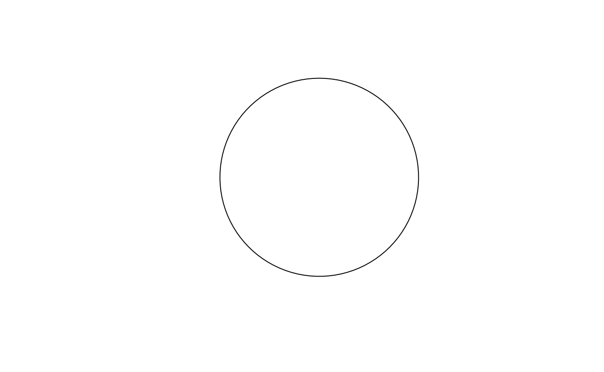
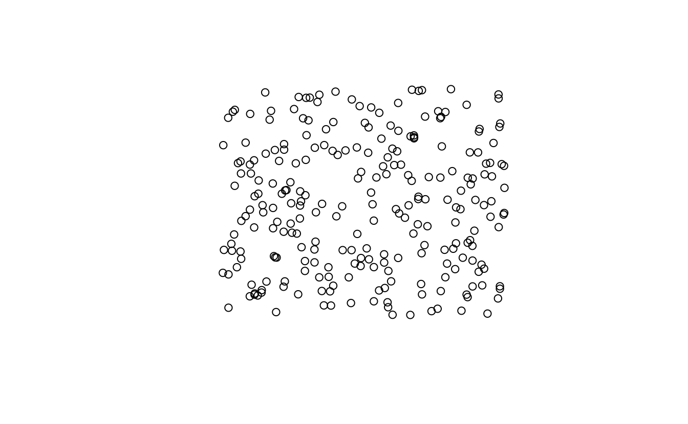
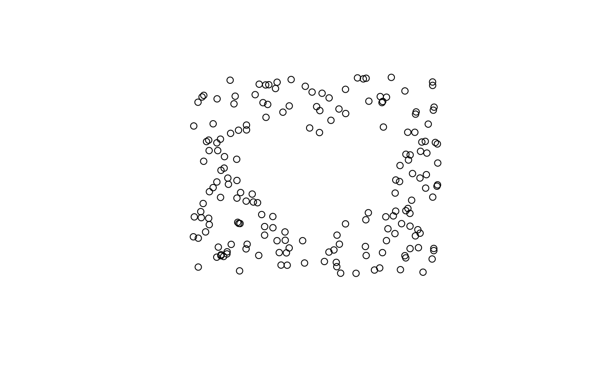
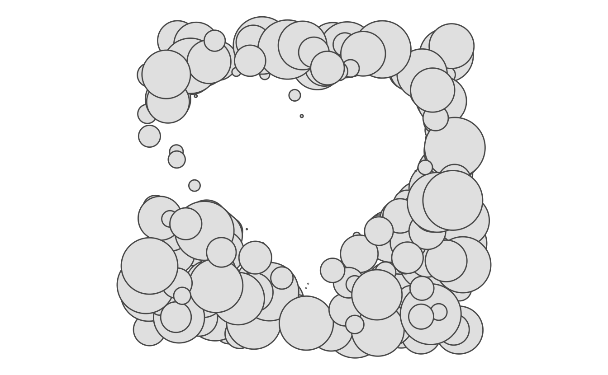
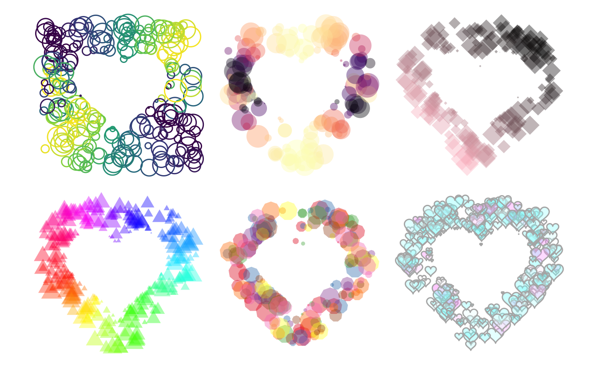

# Why are we here?

Some days ago I saw this little cute pen and it sparked something inside me. 

<p class="codepen" data-height="265" data-theme-id="0" data-default-tab="html,result" data-user="chrisgannon" data-slug-hash="EJBxRx" style="height: 265px; box-sizing: border-box; display: flex; align-items: center; justify-content: center; border: 2px solid; margin: 1em 0; padding: 1em;" data-pen-title="Heart is Home">
  <span>See the Pen <a href="https://codepen.io/chrisgannon/pen/EJBxRx/">
  Heart is Home</a> by Chris Gannon (<a href="https://codepen.io/chrisgannon">chrisgannon</a>)
  on <a href="https://codepen.io">CodePen</a>.</span>
</p>
<script async src="https://static.codepen.io/assets/embed/ei.js"></script>

I throw together some lines of code and took my first splash into using [simple Features](https://github.com/r-spatial/sf). This post is not meant as an introduction to sf, a great introduction to the sf objects is made by [Jesse Sadler](https://www.jessesadler.com/post/simple-feature-objects/).

# Loading packages


```r
library(tidyverse)
library(sf)
library(patchwork)
```

# First run

First, we create the center shape. I have gone for the heart shape, for which I found a parametric expression, I have wrapped all of this in a little function such that I can specify the number of points the polygon has.


```r
heart_fun <- function(n) {
  t <- c(seq(0, 2 * pi, length.out = n), 0)
  
  out <- data.frame(
    x = c(16 * sin(t) ^ 3),
    y = 13 * cos(t) - 5 * cos(2 * t) - 2 * cos(3 * t) - cos(4 * t)
  )
  out <- as.matrix(out)
  out <- list(out)
  st_polygon(out)
}
```

Let us check that the function works


```r
heart_fun(100)
## POLYGON ((0 5, 0.004082058 5.082247, 0.03245962 5.325084, 0.1084517 5.716992, 0.2534598 6.239393, 0.4860975 6.867539, 0.8214215 7.571701, 1.270293 8.31857, 1.838891 9.072817, 2.528404 9.798711, 3.334892 10.46172, 4.24935 11.03003, 5.25795 11.47583, 6.342465 11.77642, 7.480851 11.915, 8.647981 11.88112, 9.816481 11.67082, 10.95766 11.28641, 12.04251 10.736, 13.04268 10.03268, 13.93146 9.193568, 14.68474 8.238708, 15.28179 7.189845, 15.70606 6.069255, 15.94569 4.898625, 15.99396 3.698075, 15.8495 2.485356, 15.51639 1.275288, 15.00393 0.07943237, 14.32642 -1.093982, 13.50257 -2.239884, 12.5549 -3.355982, 11.50893 -4.442201, 10.3923 -5.5, 9.233833 -6.531618, 8.062492 -7.539309, 6.906432 -8.524629, 5.792014 -9.487815, 4.742924 -10.42731, 3.77938 -11.33948, 2.917472 -12.21848, 2.168659 -13.05638, 1.539432 -13.84345, 1.031163 -14.56857, 0.6401401 -15.21987, 0.3577924 -15.78537, 0.1710904 -16.25367, 0.06311066 -16.61466, 0.01374229 -16.86016, 0.0005110288 -16.9844, -0.0005110288 -16.9844, -0.01374229 -16.86016, -0.06311066 -16.61466, -0.1710904 -16.25367, -0.3577924 -15.78537, -0.6401401 -15.21987, -1.031163 -14.56857, -1.539432 -13.84345, -2.168659 -13.05638, -2.917472 -12.21848, -3.77938 -11.33948, -4.742924 -10.42731, -5.792014 -9.487815, -6.906432 -8.524629, -8.062492 -7.539309, -9.233833 -6.531618, -10.3923 -5.5, -11.50893 -4.442201, -12.5549 -3.355982, -13.50257 -2.239884, -14.32642 -1.093982, -15.00393 0.07943237, -15.51639 1.275288, -15.8495 2.485356, -15.99396 3.698075, -15.94569 4.898625, -15.70606 6.069255, -15.28179 7.189845, -14.68474 8.238708, -13.93146 9.193568, -13.04268 10.03268, -12.04251 10.736, -10.95766 11.28641, -9.816481 11.67082, -8.647981 11.88112, -7.480851 11.915, -6.342465 11.77642, -5.25795 11.47583, -4.24935 11.03003, -3.334892 10.46172, -2.528404 9.798711, -1.838891 9.072817, -1.270293 8.31857, -0.8214215 7.571701, -0.4860975 6.867539, -0.2534598 6.239393, -0.1084517 5.716992, -0.03245962 5.325084, -0.004082058 5.082247, -2.350945e-46 5, 0 5))
```

and that it plots correctly.


```r
plot(heart_fun(100))
```


We also create a helper function to create a unit circle.


```r
circle_fun <- function(n) {
  t <- c(seq(0, 2 * pi, length.out = n), 0)
  
  out <- data.frame(
    x = sin(t),
    y = cos(t)
  )
  out <- as.matrix(out)
  out <- list(out)
  st_polygon(out)
}

plot(circle_fun(100))
```



So we have a heart shape, lets check the boundaries of that shape.


```r
st_bbox(heart_fun(100))
##      xmin      ymin      xmax      ymax 
## -15.99396 -16.98440  15.99396  11.91500
```

Lets generate a sf polygon of both the heart and circle polygon.


```r
circle <- circle_fun(100)
heart <- heart_fun(100)
```

Next, we want to generate a list of candidate points where we try to place circles. for now we will just randomly sample between -25 and 25 on the x-axis and -20 and 20 on the y axis. then we will save them as an sf object.


```r
points <- data.frame(x = runif(250, -25, 25),
                     y = runif(250, -20, 20)) %>% 
  sf::st_as_sf(coords = c(1, 2))

plot(points)
```



Next, we will filter the points such that we only consider points that are outside the heart shape.


```r
points <- points[!lengths(st_intersects(points, heart)), ]
plot(points)
```



Next, we will loop through every single point and calculate the distance (using `st_distance`) from the point to the heart. then we will place a circle on that point and scale it such that it has a radius equal to the distance we calculated. That way the heart shape should show given enough points.


```r
all_polygons <- map(points[[1]],
    ~ (circle * st_distance(heart, .x, by_element = TRUE)) + .x) %>%
  st_sfc()
```


```r
plot(all_polygons)
```


And we get something nice! however, some of the circles become quite big. Let's bound the radius and give it some variation.


```r
bound <- function(x, limit) {
  ifelse(x > limit, runif(1, limit / 4, limit), x)
}

all_polygons <- map(points[[1]],
    ~ (circle * bound(st_distance(heart, .x, by_element = TRUE), 4)) + .x) %>%
  st_sfc()

plot(all_polygons)
```


Now let's turn this into a data.frame and extract the x and y coordinate so we can use them for coloring.


```r
plotting_data <- data.frame(all_polygons) %>%
  mutate(x = map_dbl(geometry, ~st_centroid(.x)[[1]]),
         y = map_dbl(geometry, ~st_centroid(.x)[[2]])) 
```

Now that we have everything we need we will turn to `ggplot2` to pretty everything up.


```r
plotting_data %>%
  ggplot() +
  geom_sf(aes(color = y, geometry = geometry), alpha = 0.2, fill = NA) +
  coord_sf(datum = NA) +
  theme_void() + 
  guides(color = "none")
```


And we are done! It looks nice and pretty, now there is a bunch of things we can change.

- color scales
- coloring patterns
- circle arrangement (rectangle, circle, buffer)

# One function plotting

Everything from before is not wrapped up nicely and tight in this function.


```r
circle_heart <- function(n, center_sf, outside_sf, outside_filter = "None", plotting_margin = 5, ...) {
  
  bound <- function(x, limit) {
    ifelse(x > limit, runif(1, limit / 4, limit), x)
  }
  
  range <- st_bbox(center_sf)
  points <- data.frame(x = runif(n, range[["xmin"]] - plotting_margin, 
                                    range[["xmax"]] + plotting_margin),
                       y = runif(n, range[["ymin"]] - plotting_margin, 
                                    range[["ymax"]] + plotting_margin)) %>% 
    sf::st_as_sf(coords = c(1, 2))
  
  if (outside_filter == "buffer") {
    points <- st_intersection(points, st_buffer(center_sf, plotting_margin))
  } 
  
  points <- points[!lengths(st_intersects(points, center_sf)), ]
  
  all_polygons <- map(points[[1]],
    ~ (outside_sf * bound(st_distance(center_sf, .x, by_element = TRUE), 4)) + .x) %>%
  st_sfc()
  
  plotting_data <- data.frame(all_polygons) %>%
  mutate(x = map_dbl(geometry, ~st_centroid(.x)[[1]]),
         y = map_dbl(geometry, ~st_centroid(.x)[[2]])) 
  
  plotting_data %>%
    ggplot() +
    geom_sf(..., mapping = aes(geometry = geometry)) +
    coord_sf(datum = NA) +
    theme_void()
}
```

It returns a simple ggplot2 object that we then can further modify to our visual liking.


```r
circle_heart(300, heart_fun(100), circle_fun(100))
```



A handful of examples


```r
p1 <- circle_heart(300, heart_fun(100), circle_fun(100), 
                   plotting_margin = 10, fill = NA) +
  aes(color = sin(x / y)) +
  scale_color_viridis_c() +
  guides(color = "none")

p2 <- circle_heart(300, heart_fun(100), circle_fun(100), 
                   outside_filter = "buffer", plotting_margin = 10, color = NA, alpha = 0.4) +
  aes(fill = cos(x / y)) +
  scale_fill_viridis_c(option = "A") +
  guides(fill = "none")

p3 <- circle_heart(300, heart_fun(100), circle_fun(5), 
                   outside_filter = "buffer", plotting_margin = 10, color = NA, alpha = 0.4) +
  aes(fill = x + y) +
  scale_fill_gradient(low = "pink", high = "black") +
  guides(fill = "none")

p4 <- circle_heart(500, heart_fun(100), circle_fun(4), 
                   outside_filter = "buffer", plotting_margin = 10, color = NA, alpha = 0.4) +
  aes(fill = atan2(y, x)) +
  scale_fill_gradientn(colours = rainbow(256)) +
  guides(fill = "none")

p5 <- circle_heart(300, heart_fun(100), circle_fun(10), 
                   outside_filter = "buffer", plotting_margin = 10, color = NA, alpha = 0.4) +
  aes(fill = factor(floor(x * y) %% 8)) +
  scale_fill_brewer(palette = "Set1") +
  guides(fill = "none")

p6 <- circle_heart(500, heart_fun(100), heart_fun(100) / 20, 
                   outside_filter = "buffer", plotting_margin = 10, color = "grey70", alpha = 0.4) +
  aes(fill = (y %% 4) * (x %% 1)) +
  scale_fill_gradientn(colours = cm.colors(256)) +
  guides(fill = "none")

p1 + p2 + p3 + p4 + p5 + p6 + plot_layout(ncol = 3)
```



<details closed>
<summary> <span title='Click to Expand'> session information </span> </summary>

```r

─ Session info ───────────────────────────────────────────────────────────────
 setting  value                       
 version  R version 4.1.0 (2021-05-18)
 os       macOS Big Sur 10.16         
 system   x86_64, darwin17.0          
 ui       X11                         
 language (EN)                        
 collate  en_US.UTF-8                 
 ctype    en_US.UTF-8                 
 tz       America/Los_Angeles         
 date     2021-07-15                  

─ Packages ───────────────────────────────────────────────────────────────────
 package      * version date       lib source                           
 assertthat     0.2.1   2019-03-21 [1] CRAN (R 4.1.0)                   
 backports      1.2.1   2020-12-09 [1] CRAN (R 4.1.0)                   
 blogdown       1.3.2   2021-06-09 [1] Github (rstudio/blogdown@00a2090)
 bookdown       0.22    2021-04-22 [1] CRAN (R 4.1.0)                   
 broom          0.7.8   2021-06-24 [1] CRAN (R 4.1.0)                   
 bslib          0.2.5.1 2021-05-18 [1] CRAN (R 4.1.0)                   
 cellranger     1.1.0   2016-07-27 [1] CRAN (R 4.1.0)                   
 class          7.3-19  2021-05-03 [1] CRAN (R 4.1.0)                   
 classInt       0.4-3   2020-04-07 [1] CRAN (R 4.1.0)                   
 cli            3.0.0   2021-06-30 [1] CRAN (R 4.1.0)                   
 clipr          0.7.1   2020-10-08 [1] CRAN (R 4.1.0)                   
 codetools      0.2-18  2020-11-04 [1] CRAN (R 4.1.0)                   
 colorspace     2.0-2   2021-06-24 [1] CRAN (R 4.1.0)                   
 crayon         1.4.1   2021-02-08 [1] CRAN (R 4.1.0)                   
 DBI            1.1.1   2021-01-15 [1] CRAN (R 4.1.0)                   
 dbplyr         2.1.1   2021-04-06 [1] CRAN (R 4.1.0)                   
 desc           1.3.0   2021-03-05 [1] CRAN (R 4.1.0)                   
 details      * 0.2.1   2020-01-12 [1] CRAN (R 4.1.0)                   
 digest         0.6.27  2020-10-24 [1] CRAN (R 4.1.0)                   
 dplyr        * 1.0.7   2021-06-18 [1] CRAN (R 4.1.0)                   
 e1071          1.7-7   2021-05-23 [1] CRAN (R 4.1.0)                   
 ellipsis       0.3.2   2021-04-29 [1] CRAN (R 4.1.0)                   
 evaluate       0.14    2019-05-28 [1] CRAN (R 4.1.0)                   
 fansi          0.5.0   2021-05-25 [1] CRAN (R 4.1.0)                   
 farver         2.1.0   2021-02-28 [1] CRAN (R 4.1.0)                   
 forcats      * 0.5.1   2021-01-27 [1] CRAN (R 4.1.0)                   
 fs             1.5.0   2020-07-31 [1] CRAN (R 4.1.0)                   
 generics       0.1.0   2020-10-31 [1] CRAN (R 4.1.0)                   
 ggplot2      * 3.3.5   2021-06-25 [1] CRAN (R 4.1.0)                   
 glue           1.4.2   2020-08-27 [1] CRAN (R 4.1.0)                   
 gtable         0.3.0   2019-03-25 [1] CRAN (R 4.1.0)                   
 haven          2.4.1   2021-04-23 [1] CRAN (R 4.1.0)                   
 highr          0.9     2021-04-16 [1] CRAN (R 4.1.0)                   
 hms            1.1.0   2021-05-17 [1] CRAN (R 4.1.0)                   
 htmltools      0.5.1.1 2021-01-22 [1] CRAN (R 4.1.0)                   
 httr           1.4.2   2020-07-20 [1] CRAN (R 4.1.0)                   
 jquerylib      0.1.4   2021-04-26 [1] CRAN (R 4.1.0)                   
 jsonlite       1.7.2   2020-12-09 [1] CRAN (R 4.1.0)                   
 KernSmooth     2.23-20 2021-05-03 [1] CRAN (R 4.1.0)                   
 knitr        * 1.33    2021-04-24 [1] CRAN (R 4.1.0)                   
 lifecycle      1.0.0   2021-02-15 [1] CRAN (R 4.1.0)                   
 lubridate      1.7.10  2021-02-26 [1] CRAN (R 4.1.0)                   
 magrittr       2.0.1   2020-11-17 [1] CRAN (R 4.1.0)                   
 modelr         0.1.8   2020-05-19 [1] CRAN (R 4.1.0)                   
 munsell        0.5.0   2018-06-12 [1] CRAN (R 4.1.0)                   
 patchwork    * 1.1.1   2020-12-17 [1] CRAN (R 4.1.0)                   
 pillar         1.6.1   2021-05-16 [1] CRAN (R 4.1.0)                   
 pkgconfig      2.0.3   2019-09-22 [1] CRAN (R 4.1.0)                   
 png            0.1-7   2013-12-03 [1] CRAN (R 4.1.0)                   
 proxy          0.4-26  2021-06-07 [1] CRAN (R 4.1.0)                   
 purrr        * 0.3.4   2020-04-17 [1] CRAN (R 4.1.0)                   
 R6             2.5.0   2020-10-28 [1] CRAN (R 4.1.0)                   
 RColorBrewer   1.1-2   2014-12-07 [1] CRAN (R 4.1.0)                   
 Rcpp           1.0.7   2021-07-07 [1] CRAN (R 4.1.0)                   
 readr        * 1.4.0   2020-10-05 [1] CRAN (R 4.1.0)                   
 readxl         1.3.1   2019-03-13 [1] CRAN (R 4.1.0)                   
 reprex         2.0.0   2021-04-02 [1] CRAN (R 4.1.0)                   
 rlang          0.4.11  2021-04-30 [1] CRAN (R 4.1.0)                   
 rmarkdown      2.9     2021-06-15 [1] CRAN (R 4.1.0)                   
 rprojroot      2.0.2   2020-11-15 [1] CRAN (R 4.1.0)                   
 rstudioapi     0.13    2020-11-12 [1] CRAN (R 4.1.0)                   
 rvest          1.0.0   2021-03-09 [1] CRAN (R 4.1.0)                   
 sass           0.4.0   2021-05-12 [1] CRAN (R 4.1.0)                   
 scales         1.1.1   2020-05-11 [1] CRAN (R 4.1.0)                   
 sessioninfo    1.1.1   2018-11-05 [1] CRAN (R 4.1.0)                   
 sf           * 1.0-0   2021-06-09 [1] CRAN (R 4.1.0)                   
 stringi        1.6.2   2021-05-17 [1] CRAN (R 4.1.0)                   
 stringr      * 1.4.0   2019-02-10 [1] CRAN (R 4.1.0)                   
 tibble       * 3.1.2   2021-05-16 [1] CRAN (R 4.1.0)                   
 tidyr        * 1.1.3   2021-03-03 [1] CRAN (R 4.1.0)                   
 tidyselect     1.1.1   2021-04-30 [1] CRAN (R 4.1.0)                   
 tidyverse    * 1.3.1   2021-04-15 [1] CRAN (R 4.1.0)                   
 units          0.7-2   2021-06-08 [1] CRAN (R 4.1.0)                   
 utf8           1.2.1   2021-03-12 [1] CRAN (R 4.1.0)                   
 vctrs          0.3.8   2021-04-29 [1] CRAN (R 4.1.0)                   
 viridisLite    0.4.0   2021-04-13 [1] CRAN (R 4.1.0)                   
 withr          2.4.2   2021-04-18 [1] CRAN (R 4.1.0)                   
 xfun           0.24    2021-06-15 [1] CRAN (R 4.1.0)                   
 xml2           1.3.2   2020-04-23 [1] CRAN (R 4.1.0)                   
 yaml           2.2.1   2020-02-01 [1] CRAN (R 4.1.0)                   

[1] /Library/Frameworks/R.framework/Versions/4.1/Resources/library

```

</details>
<br>
