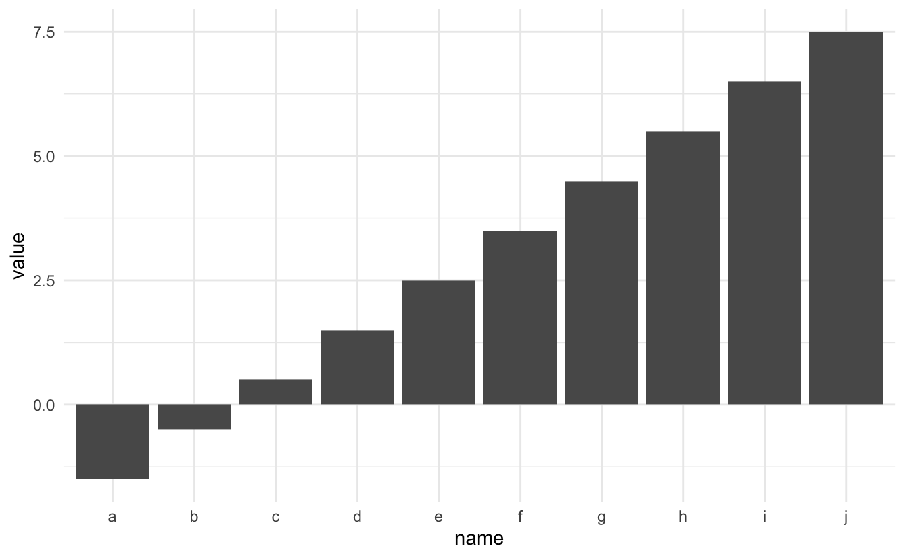
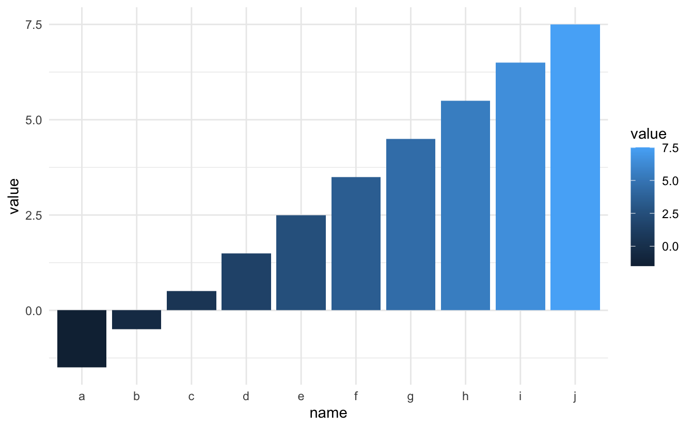
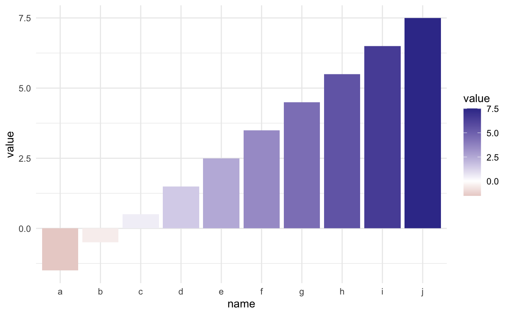
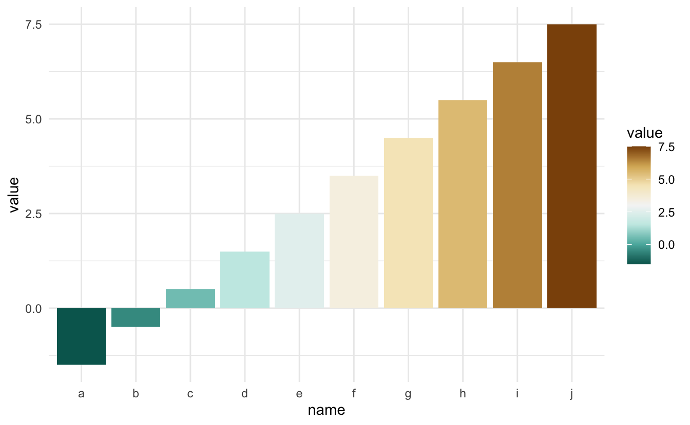
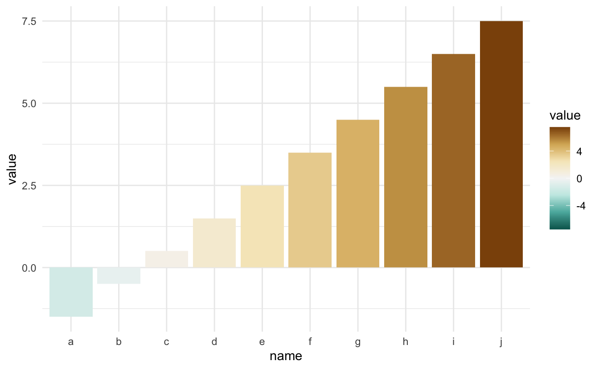
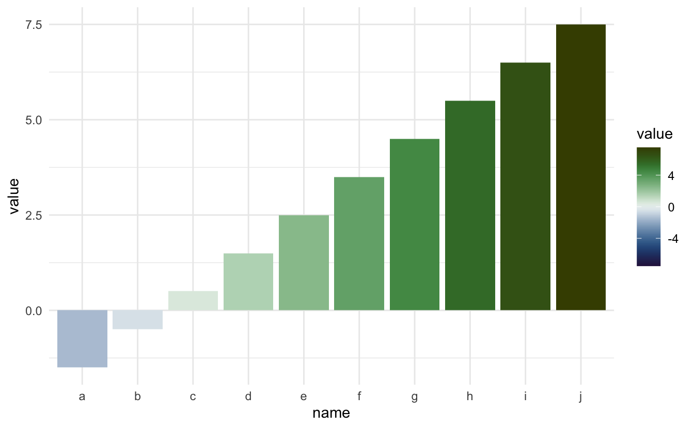

Using a divergent color palette can be beneficial when you want to draw attention to some values compared to a fixed point. Like temperature around freezing, monetary values around zero, and so on. However, it can be hard to align 0 to the middle of a continuous color scale. This post will explain how to do this correctly for `scale_colour_distiller` and `scale_fill_distiller`, and this will also work for extension packages such as [scico](https://github.com/thomasp85/scico).

# Packages and data


```r
library(ggplot2)
library(scico)

theme_set(theme_minimal())

example_data <- data.frame(name = letters[1:10],
                           value = -2:7 + 0.5)
```

# The problem

First, let's construct a simple chart, we have a bar chart where some of the bars go up, and some of the bars go down.


```r
ggplot(example_data, aes(name, value)) +
  geom_col()
```



Next, let's add some color by assigning the value to the fill aesthetic.


```r
ggplot(example_data, aes(name, value, fill = value)) +
  geom_col()
```



Using a sequential palette for a chart like this doesn't give us much insight. Lets add a divergent scale with `scale_fill_gradient2()`. While it is doing its job, you still have to define the colors yourself.


```r
ggplot(example_data, aes(name, value, fill = value)) +
  geom_col() +
  scale_fill_gradient2()
```



Lets instead use the `scale_fill_distiller()` function to access the continuous versions of the [brewer scales](http://colorbrewer2.org).


```r
ggplot(example_data, aes(name, value, fill = value)) +
  geom_col() +
  scale_fill_distiller(type = "div")
```



But look! some of the upwards-facing bars are colored green instead of orange.

# The solution

The solution is to manually specify the limits of the color palette such that the center of the palette appears in the middle of the range. This is simply done by finding the absolute maximum of the range of the variable to are mapping to the color. We then set the limits to go from negative max to positive max, thus making zero appear in the middle.


```r
limit <- max(abs(example_data$value)) * c(-1, 1)

ggplot(example_data, aes(name, value, fill = value)) +
  geom_col() +
  scale_fill_distiller(type = "div", limit = limit)
```



This approach also works with the `scico` package.


```r
limit <- max(abs(example_data$value)) * c(-1, 1)

ggplot(example_data, aes(name, value, fill = value)) +
  geom_col() +
  scale_fill_scico(palette = "cork", limit = limit) 
```



<details closed>
<summary> <span title='Click to Expand'> session information </span> </summary>

```r

─ Session info ───────────────────────────────────────────────────────────────
 setting  value                       
 version  R version 4.1.0 (2021-05-18)
 os       macOS Big Sur 10.16         
 system   x86_64, darwin17.0          
 ui       X11                         
 language (EN)                        
 collate  en_US.UTF-8                 
 ctype    en_US.UTF-8                 
 tz       America/Los_Angeles         
 date     2021-07-15                  

─ Packages ───────────────────────────────────────────────────────────────────
 package      * version date       lib source                           
 assertthat     0.2.1   2019-03-21 [1] CRAN (R 4.1.0)                   
 blogdown       1.3.2   2021-06-09 [1] Github (rstudio/blogdown@00a2090)
 bookdown       0.22    2021-04-22 [1] CRAN (R 4.1.0)                   
 bslib          0.2.5.1 2021-05-18 [1] CRAN (R 4.1.0)                   
 cli            3.0.0   2021-06-30 [1] CRAN (R 4.1.0)                   
 clipr          0.7.1   2020-10-08 [1] CRAN (R 4.1.0)                   
 codetools      0.2-18  2020-11-04 [1] CRAN (R 4.1.0)                   
 colorspace     2.0-2   2021-06-24 [1] CRAN (R 4.1.0)                   
 crayon         1.4.1   2021-02-08 [1] CRAN (R 4.1.0)                   
 DBI            1.1.1   2021-01-15 [1] CRAN (R 4.1.0)                   
 desc           1.3.0   2021-03-05 [1] CRAN (R 4.1.0)                   
 details      * 0.2.1   2020-01-12 [1] CRAN (R 4.1.0)                   
 digest         0.6.27  2020-10-24 [1] CRAN (R 4.1.0)                   
 dplyr          1.0.7   2021-06-18 [1] CRAN (R 4.1.0)                   
 ellipsis       0.3.2   2021-04-29 [1] CRAN (R 4.1.0)                   
 evaluate       0.14    2019-05-28 [1] CRAN (R 4.1.0)                   
 fansi          0.5.0   2021-05-25 [1] CRAN (R 4.1.0)                   
 farver         2.1.0   2021-02-28 [1] CRAN (R 4.1.0)                   
 generics       0.1.0   2020-10-31 [1] CRAN (R 4.1.0)                   
 ggplot2      * 3.3.5   2021-06-25 [1] CRAN (R 4.1.0)                   
 glue           1.4.2   2020-08-27 [1] CRAN (R 4.1.0)                   
 gtable         0.3.0   2019-03-25 [1] CRAN (R 4.1.0)                   
 highr          0.9     2021-04-16 [1] CRAN (R 4.1.0)                   
 htmltools      0.5.1.1 2021-01-22 [1] CRAN (R 4.1.0)                   
 httr           1.4.2   2020-07-20 [1] CRAN (R 4.1.0)                   
 jquerylib      0.1.4   2021-04-26 [1] CRAN (R 4.1.0)                   
 jsonlite       1.7.2   2020-12-09 [1] CRAN (R 4.1.0)                   
 knitr        * 1.33    2021-04-24 [1] CRAN (R 4.1.0)                   
 labeling       0.4.2   2020-10-20 [1] CRAN (R 4.1.0)                   
 lifecycle      1.0.0   2021-02-15 [1] CRAN (R 4.1.0)                   
 magrittr       2.0.1   2020-11-17 [1] CRAN (R 4.1.0)                   
 munsell        0.5.0   2018-06-12 [1] CRAN (R 4.1.0)                   
 pillar         1.6.1   2021-05-16 [1] CRAN (R 4.1.0)                   
 pkgconfig      2.0.3   2019-09-22 [1] CRAN (R 4.1.0)                   
 png            0.1-7   2013-12-03 [1] CRAN (R 4.1.0)                   
 purrr          0.3.4   2020-04-17 [1] CRAN (R 4.1.0)                   
 R6             2.5.0   2020-10-28 [1] CRAN (R 4.1.0)                   
 RColorBrewer   1.1-2   2014-12-07 [1] CRAN (R 4.1.0)                   
 rlang          0.4.11  2021-04-30 [1] CRAN (R 4.1.0)                   
 rmarkdown      2.9     2021-06-15 [1] CRAN (R 4.1.0)                   
 rprojroot      2.0.2   2020-11-15 [1] CRAN (R 4.1.0)                   
 sass           0.4.0   2021-05-12 [1] CRAN (R 4.1.0)                   
 scales         1.1.1   2020-05-11 [1] CRAN (R 4.1.0)                   
 scico        * 1.2.0   2020-06-08 [1] CRAN (R 4.1.0)                   
 sessioninfo    1.1.1   2018-11-05 [1] CRAN (R 4.1.0)                   
 stringi        1.6.2   2021-05-17 [1] CRAN (R 4.1.0)                   
 stringr        1.4.0   2019-02-10 [1] CRAN (R 4.1.0)                   
 tibble         3.1.2   2021-05-16 [1] CRAN (R 4.1.0)                   
 tidyselect     1.1.1   2021-04-30 [1] CRAN (R 4.1.0)                   
 utf8           1.2.1   2021-03-12 [1] CRAN (R 4.1.0)                   
 vctrs          0.3.8   2021-04-29 [1] CRAN (R 4.1.0)                   
 withr          2.4.2   2021-04-18 [1] CRAN (R 4.1.0)                   
 xfun           0.24    2021-06-15 [1] CRAN (R 4.1.0)                   
 xml2           1.3.2   2020-04-23 [1] CRAN (R 4.1.0)                   
 yaml           2.2.1   2020-02-01 [1] CRAN (R 4.1.0)                   

[1] /Library/Frameworks/R.framework/Versions/4.1/Resources/library

```

</details>
<br>
