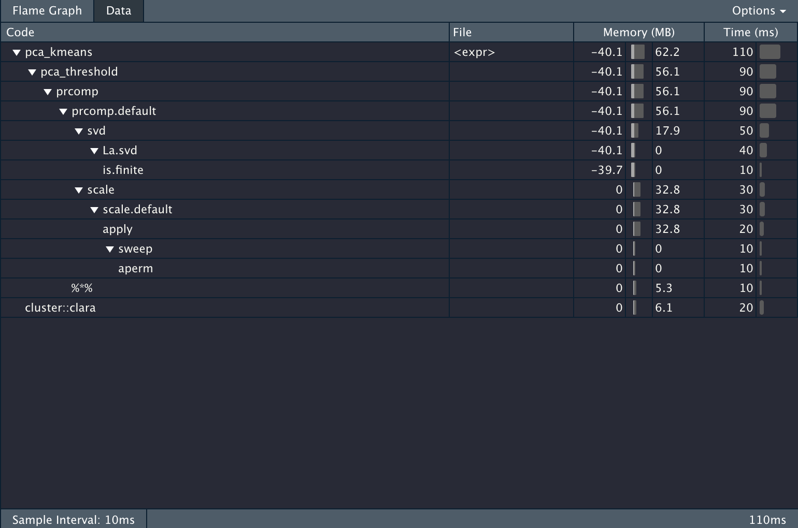
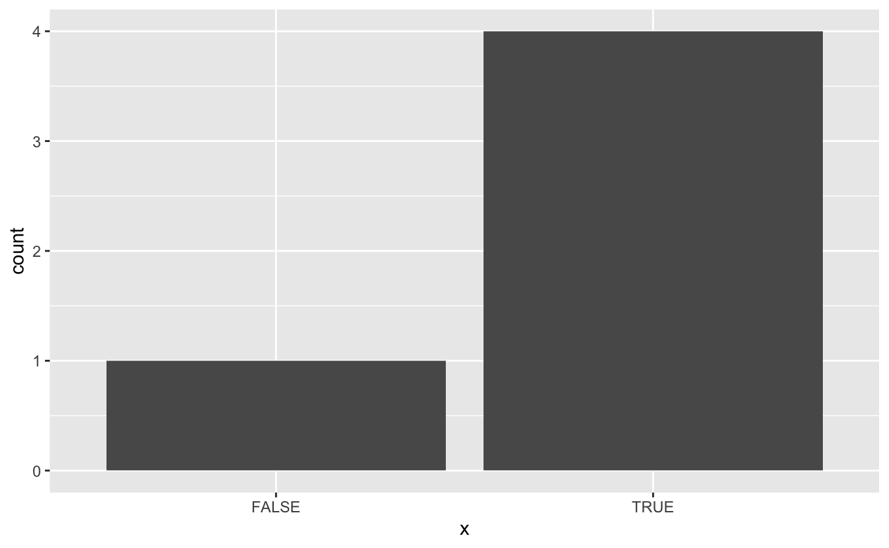

This blog post is going to describe how to write a customizable profiling function. If you are not familiar with profiling read the [Profiling](https://adv-r.hadley.nz/perf-measure.html#profiling) section of [Advanced R](https://adv-r.hadley.nz/) to familiarize yourself, I'll wait.

...

Welcome back!

## Packages

While these packages aren't strictly needed since most of what we are doing is happening in base R, am I still loading in `tidyverse` to do some easier string manipulations and plotting.


```r
library(tidyverse)
```

## Profiling basics

You have properly used the [profvis](https://rstudio.github.io/profvis/index.html) package. It is an amazing package and I use it on a daily basis. However, the amount of information you get can be overwhelming at times depending on your profiling goals.

Let's propose in this scenario that we take in some data, scale and center it, apply [PCA](https://en.wikipedia.org/wiki/Principal_component_analysis) while only keeping the components that explain 90% of the variance and lastly apply [CLARA](https://www.datanovia.com/en/lessons/clara-in-r-clustering-large-applications/) clustering and return the classification.

The code to do that is contained in the following chunk.


```r
pca_threshold <- function(x, threshold) {
  data_pca <- prcomp(x, scale. = TRUE)
  total_var <- sum(data_pca$sdev ^ 2)
  num_comp <- which.max(cumsum(data_pca$sdev ^ 2 / total_var) >= threshold)
  data_pca$x[, seq_len(num_comp)]
}

pca_kmeans <- function(x, threshold = 0.9, centers = 2) {
  data_matrix <- as.matrix(x)
  data_pca <- pca_threshold(data_matrix, threshold = threshold)
  data_kmeans <- cluster::clara(data_pca, k = centers)
  data_kmeans$cluster
}
```

Now we create some data and run profvis on it


```r
large_data <- diamonds %>%
  select_if(is.numeric) %>%
  sample_n(100000, replace = TRUE)
```


```r
profvis::profvis({
  pca_kmeans(large_data)
})
```

And we get the following information back.




## The Problem

It is very informative, but it is also giving a LOT of information. Let's propose we want to know the percentage of the computation time is used to do the PCA calculations. In the `profvis` framework you would need to do the calculation manually. All while waiting for the HTML widget to load.

## The Idea

`profvis` uses the `Rprof` function internally to inspect what is happening. By using `Rprof` directly we can extract the profile and calculate our output/matrix.

The base profiling steps are


```r
tmp <- tempfile()
Rprof(tmp)
##################
# Code goes here #
##################
Rprof(NULL)
profile <- readLines(tmp)
```

This chunk will set up a temporary file, start the profiler and set it to write to the temporary file, stop the profiler and read the result from the profiler.

Trying it with our code we get


```r
tmp <- tempfile()
Rprof(tmp)
x <- pca_kmeans(large_data)
Rprof(NULL)
profile <- readLines(tmp)

head(profile)
```

```
## [1] "sample.interval=20000"                                                                                                            
## [2] "\"aperm.default\" \"aperm\" \"apply\" \"scale.default\" \"scale\" \"prcomp.default\" \"prcomp\" \"pca_threshold\" \"pca_kmeans\" "
## [3] "\"is.na\" \"FUN\" \"apply\" \"scale.default\" \"scale\" \"prcomp.default\" \"prcomp\" \"pca_threshold\" \"pca_kmeans\" "          
## [4] "\"is.na\" \"FUN\" \"apply\" \"scale.default\" \"scale\" \"prcomp.default\" \"prcomp\" \"pca_threshold\" \"pca_kmeans\" "          
## [5] "\"is.na\" \"FUN\" \"apply\" \"scale.default\" \"scale\" \"prcomp.default\" \"prcomp\" \"pca_threshold\" \"pca_kmeans\" "          
## [6] "\"is.na\" \"FUN\" \"apply\" \"scale.default\" \"scale\" \"prcomp.default\" \"prcomp\" \"pca_threshold\" \"pca_kmeans\" "
```

Let's see what these lines mean. First, we notice that the first line is just denoting the sample interval, so we can ignore that for now. Let's look at the next line


```
## [1] "\"aperm.default\" \"aperm\" \"apply\" \"scale.default\" \"scale\" \"prcomp.default\" \"prcomp\" \"pca_threshold\" \"pca_kmeans\" "
```

This is a snapshot of the "call-stack", and it reads inside-out. So we have that `aperm.default` is called inside `aperm` which is called inside `apply` which is called inside `scale.default` and so on and so forth all the way up to `pca_kmeans`.

Now that we know how `Rprof` works, we can write some code that checks whether "pca_threshold" appears in the call stack and then find the percentage.

## The Solution

We can now create a function that will calculate the percentage of the time is being spent in a certain function.


```r
prof_procentage <- function(expr, pattern) {
  tmp <- tempfile()
  Rprof(tmp)
  expr
  Rprof(NULL)
  profile <- readLines(tmp)[-1]
  
  mean(grepl(pattern, profile))
}
```

This function can now easily be used in our calculation.


```r
prof_procentage(
  x <- pca_kmeans(large_data),
  pattern = "pca_threshold"
)
## [1] 0.875
```

And this is how to create a custom profiler. Simply modify the last line in the skeleton function `prof_procentage` to change its behavior.

## the Extensions

The sky's the limit! you are only limited by your regex abilities. You can also change the output. In the last example, I returned a numeric of the percentage, But we can also have the output be a plot


```r
prof_procentage_plot <- function(expr, pattern) {
  tmp <- tempfile()
  Rprof(tmp)
  expr
  Rprof(NULL)
  profile <- readLines(tmp)[-1]
  
  data.frame(x = grepl(pattern, profile)) %>%
    ggplot(aes(x)) +
    geom_bar()
}

prof_procentage_plot(
  x <- pca_kmeans(large_data),
  pattern = "pca_threshold"
)
```



## The follow-up

After my initial announcement of this post, I got a helpful tweet from [Hadley Wickham](https://twitter.com/hadleywickham/status/1132737794760237059) about the `profvis::parse_rprof()`. In essence, it will help you parse the file you write with `Rprof` to help you get to your answer faster and safer.

So some output like


```
## [1] "sample.interval=20000"                                                                                                            
## [2] "\"aperm.default\" \"aperm\" \"apply\" \"scale.default\" \"scale\" \"prcomp.default\" \"prcomp\" \"pca_threshold\" \"pca_kmeans\" "
## [3] "\"is.na\" \"FUN\" \"apply\" \"scale.default\" \"scale\" \"prcomp.default\" \"prcomp\" \"pca_threshold\" \"pca_kmeans\" "          
## [4] "\"is.na\" \"FUN\" \"apply\" \"scale.default\" \"scale\" \"prcomp.default\" \"prcomp\" \"pca_threshold\" \"pca_kmeans\" "          
## [5] "\"is.na\" \"FUN\" \"apply\" \"scale.default\" \"scale\" \"prcomp.default\" \"prcomp\" \"pca_threshold\" \"pca_kmeans\" "          
## [6] "\"is.na\" \"FUN\" \"apply\" \"scale.default\" \"scale\" \"prcomp.default\" \"prcomp\" \"pca_threshold\" \"pca_kmeans\" "
```

Will be transformed to a nice data.frame with `profvis::parse_rprof()`


```
##    time depth          label filenum linenum memalloc meminc filename
## 1     1     9  aperm.default      NA      NA        0      0     <NA>
## 2     1     8          aperm      NA      NA        0      0     <NA>
## 3     1     7          apply      NA      NA        0      0     <NA>
## 4     1     6  scale.default      NA      NA        0      0     <NA>
## 5     1     5          scale      NA      NA        0      0     <NA>
## 6     1     4 prcomp.default      NA      NA        0      0     <NA>
## 7     1     3         prcomp      NA      NA        0      0     <NA>
## 8     1     2  pca_threshold      NA      NA        0      0     <NA>
## 9     1     1     pca_kmeans      NA      NA        0      0     <NA>
## 10    2     9          is.na      NA      NA        0      0     <NA>
## 11    2     8            FUN      NA      NA        0      0     <NA>
## 12    2     7          apply      NA      NA        0      0     <NA>
## 13    2     6  scale.default      NA      NA        0      0     <NA>
## 14    2     5          scale      NA      NA        0      0     <NA>
## 15    2     4 prcomp.default      NA      NA        0      0     <NA>
## 16    2     3         prcomp      NA      NA        0      0     <NA>
## 17    2     2  pca_threshold      NA      NA        0      0     <NA>
## 18    2     1     pca_kmeans      NA      NA        0      0     <NA>
## 19    3     9          is.na      NA      NA        0      0     <NA>
## 20    3     8            FUN      NA      NA        0      0     <NA>
## 21    3     7          apply      NA      NA        0      0     <NA>
## 22    3     6  scale.default      NA      NA        0      0     <NA>
## 23    3     5          scale      NA      NA        0      0     <NA>
## 24    3     4 prcomp.default      NA      NA        0      0     <NA>
## 25    3     3         prcomp      NA      NA        0      0     <NA>
## 26    3     2  pca_threshold      NA      NA        0      0     <NA>
## 27    3     1     pca_kmeans      NA      NA        0      0     <NA>
## 28    4     9          is.na      NA      NA        0      0     <NA>
## 29    4     8            FUN      NA      NA        0      0     <NA>
## 30    4     7          apply      NA      NA        0      0     <NA>
## 31    4     6  scale.default      NA      NA        0      0     <NA>
## 32    4     5          scale      NA      NA        0      0     <NA>
## 33    4     4 prcomp.default      NA      NA        0      0     <NA>
## 34    4     3         prcomp      NA      NA        0      0     <NA>
## 35    4     2  pca_threshold      NA      NA        0      0     <NA>
## 36    4     1     pca_kmeans      NA      NA        0      0     <NA>
## 37    5     9          is.na      NA      NA        0      0     <NA>
## 38    5     8            FUN      NA      NA        0      0     <NA>
## 39    5     7          apply      NA      NA        0      0     <NA>
## 40    5     6  scale.default      NA      NA        0      0     <NA>
## 41    5     5          scale      NA      NA        0      0     <NA>
## 42    5     4 prcomp.default      NA      NA        0      0     <NA>
## 43    5     3         prcomp      NA      NA        0      0     <NA>
## 44    5     2  pca_threshold      NA      NA        0      0     <NA>
## 45    5     1     pca_kmeans      NA      NA        0      0     <NA>
```

<details closed>
<summary> <span title='Click to Expand'> session information </span> </summary>

```r

─ Session info ───────────────────────────────────────────────────────────────
 setting  value                       
 version  R version 4.1.0 (2021-05-18)
 os       macOS Big Sur 10.16         
 system   x86_64, darwin17.0          
 ui       X11                         
 language (EN)                        
 collate  en_US.UTF-8                 
 ctype    en_US.UTF-8                 
 tz       America/Los_Angeles         
 date     2021-07-15                  

─ Packages ───────────────────────────────────────────────────────────────────
 package     * version date       lib source                           
 assertthat    0.2.1   2019-03-21 [1] CRAN (R 4.1.0)                   
 backports     1.2.1   2020-12-09 [1] CRAN (R 4.1.0)                   
 blogdown      1.3.2   2021-06-09 [1] Github (rstudio/blogdown@00a2090)
 bookdown      0.22    2021-04-22 [1] CRAN (R 4.1.0)                   
 broom         0.7.8   2021-06-24 [1] CRAN (R 4.1.0)                   
 bslib         0.2.5.1 2021-05-18 [1] CRAN (R 4.1.0)                   
 cellranger    1.1.0   2016-07-27 [1] CRAN (R 4.1.0)                   
 cli           3.0.0   2021-06-30 [1] CRAN (R 4.1.0)                   
 clipr         0.7.1   2020-10-08 [1] CRAN (R 4.1.0)                   
 cluster       2.1.2   2021-04-17 [1] CRAN (R 4.1.0)                   
 codetools     0.2-18  2020-11-04 [1] CRAN (R 4.1.0)                   
 colorspace    2.0-2   2021-06-24 [1] CRAN (R 4.1.0)                   
 crayon        1.4.1   2021-02-08 [1] CRAN (R 4.1.0)                   
 DBI           1.1.1   2021-01-15 [1] CRAN (R 4.1.0)                   
 dbplyr        2.1.1   2021-04-06 [1] CRAN (R 4.1.0)                   
 desc          1.3.0   2021-03-05 [1] CRAN (R 4.1.0)                   
 details     * 0.2.1   2020-01-12 [1] CRAN (R 4.1.0)                   
 digest        0.6.27  2020-10-24 [1] CRAN (R 4.1.0)                   
 dplyr       * 1.0.7   2021-06-18 [1] CRAN (R 4.1.0)                   
 ellipsis      0.3.2   2021-04-29 [1] CRAN (R 4.1.0)                   
 evaluate      0.14    2019-05-28 [1] CRAN (R 4.1.0)                   
 fansi         0.5.0   2021-05-25 [1] CRAN (R 4.1.0)                   
 farver        2.1.0   2021-02-28 [1] CRAN (R 4.1.0)                   
 forcats     * 0.5.1   2021-01-27 [1] CRAN (R 4.1.0)                   
 fs            1.5.0   2020-07-31 [1] CRAN (R 4.1.0)                   
 generics      0.1.0   2020-10-31 [1] CRAN (R 4.1.0)                   
 ggplot2     * 3.3.5   2021-06-25 [1] CRAN (R 4.1.0)                   
 glue          1.4.2   2020-08-27 [1] CRAN (R 4.1.0)                   
 gtable        0.3.0   2019-03-25 [1] CRAN (R 4.1.0)                   
 haven         2.4.1   2021-04-23 [1] CRAN (R 4.1.0)                   
 highr         0.9     2021-04-16 [1] CRAN (R 4.1.0)                   
 hms           1.1.0   2021-05-17 [1] CRAN (R 4.1.0)                   
 htmltools     0.5.1.1 2021-01-22 [1] CRAN (R 4.1.0)                   
 httr          1.4.2   2020-07-20 [1] CRAN (R 4.1.0)                   
 jquerylib     0.1.4   2021-04-26 [1] CRAN (R 4.1.0)                   
 jsonlite      1.7.2   2020-12-09 [1] CRAN (R 4.1.0)                   
 knitr       * 1.33    2021-04-24 [1] CRAN (R 4.1.0)                   
 labeling      0.4.2   2020-10-20 [1] CRAN (R 4.1.0)                   
 lifecycle     1.0.0   2021-02-15 [1] CRAN (R 4.1.0)                   
 lubridate     1.7.10  2021-02-26 [1] CRAN (R 4.1.0)                   
 magrittr      2.0.1   2020-11-17 [1] CRAN (R 4.1.0)                   
 modelr        0.1.8   2020-05-19 [1] CRAN (R 4.1.0)                   
 munsell       0.5.0   2018-06-12 [1] CRAN (R 4.1.0)                   
 pillar        1.6.1   2021-05-16 [1] CRAN (R 4.1.0)                   
 pkgconfig     2.0.3   2019-09-22 [1] CRAN (R 4.1.0)                   
 png           0.1-7   2013-12-03 [1] CRAN (R 4.1.0)                   
 purrr       * 0.3.4   2020-04-17 [1] CRAN (R 4.1.0)                   
 R6            2.5.0   2020-10-28 [1] CRAN (R 4.1.0)                   
 Rcpp          1.0.7   2021-07-07 [1] CRAN (R 4.1.0)                   
 readr       * 1.4.0   2020-10-05 [1] CRAN (R 4.1.0)                   
 readxl        1.3.1   2019-03-13 [1] CRAN (R 4.1.0)                   
 reprex        2.0.0   2021-04-02 [1] CRAN (R 4.1.0)                   
 rlang         0.4.11  2021-04-30 [1] CRAN (R 4.1.0)                   
 rmarkdown     2.9     2021-06-15 [1] CRAN (R 4.1.0)                   
 rprojroot     2.0.2   2020-11-15 [1] CRAN (R 4.1.0)                   
 rstudioapi    0.13    2020-11-12 [1] CRAN (R 4.1.0)                   
 rvest         1.0.0   2021-03-09 [1] CRAN (R 4.1.0)                   
 sass          0.4.0   2021-05-12 [1] CRAN (R 4.1.0)                   
 scales        1.1.1   2020-05-11 [1] CRAN (R 4.1.0)                   
 sessioninfo   1.1.1   2018-11-05 [1] CRAN (R 4.1.0)                   
 stringi       1.6.2   2021-05-17 [1] CRAN (R 4.1.0)                   
 stringr     * 1.4.0   2019-02-10 [1] CRAN (R 4.1.0)                   
 tibble      * 3.1.2   2021-05-16 [1] CRAN (R 4.1.0)                   
 tidyr       * 1.1.3   2021-03-03 [1] CRAN (R 4.1.0)                   
 tidyselect    1.1.1   2021-04-30 [1] CRAN (R 4.1.0)                   
 tidyverse   * 1.3.1   2021-04-15 [1] CRAN (R 4.1.0)                   
 utf8          1.2.1   2021-03-12 [1] CRAN (R 4.1.0)                   
 vctrs         0.3.8   2021-04-29 [1] CRAN (R 4.1.0)                   
 withr         2.4.2   2021-04-18 [1] CRAN (R 4.1.0)                   
 xfun          0.24    2021-06-15 [1] CRAN (R 4.1.0)                   
 xml2          1.3.2   2020-04-23 [1] CRAN (R 4.1.0)                   
 yaml          2.2.1   2020-02-01 [1] CRAN (R 4.1.0)                   

[1] /Library/Frameworks/R.framework/Versions/4.1/Resources/library

```

</details>
<br>
