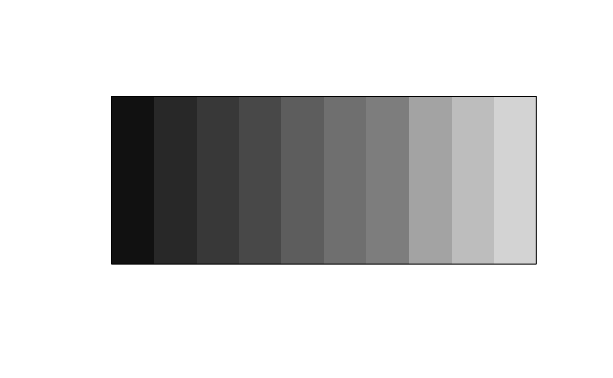
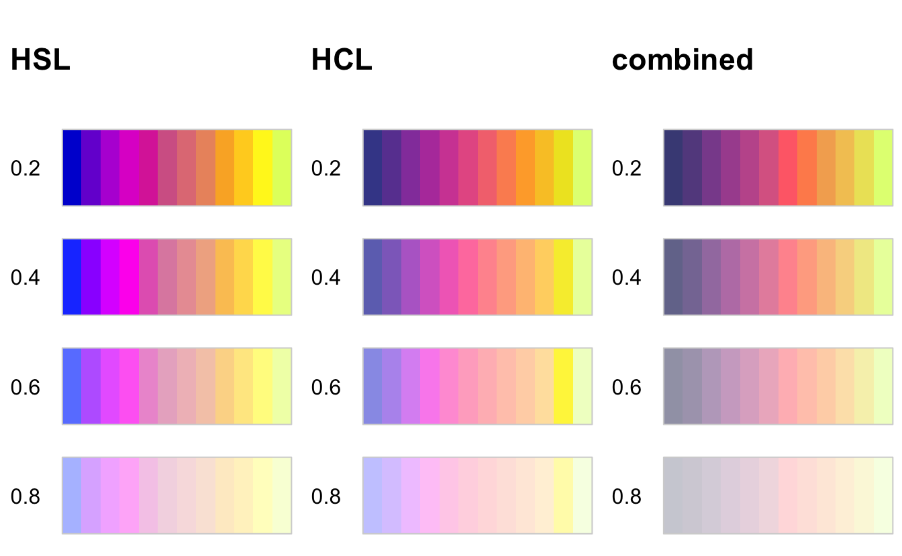

I'm happy to announce my newest package [prismatic](https://github.com/EmilHvitfeldt/prismatic) which facilitates simple manipulations of colors. I had been working on this package online and offline for some time, but the [promise of easy manipulation of mapped data in ggplot2](https://github.com/tidyverse/ggplot2/pull/3534) forced me to get some work done to get this package out before ggplot2 version 3.3.0. (as of the time of writing.)

This post will go over some of the finer details with lots of pretty pictures!

## Loading Packages

The prismatic package is a fairly low dependency with only 1 import being [farver](https://github.com/thomasp85/farver) for lightning-fast conversion between color spaces. I have also loaded the [colorspace](http://colorspace.r-forge.r-project.org/) package, from which some of the following functions have been inspired. I will use colorspace to enable the plotting of multiple color palettes side by side, but I will not showcase the code each time. Go to the end of the post for example code for comparison plots.


```r
library(prismatic)
library(colorspace) # for plotting functions
## 
## Attaching package: 'colorspace'
## The following object is masked from 'package:prismatic':
## 
##     contrast_ratio
library(magrittr) # for the glorious pipe
```

## Let me see the colors!!

If you have seen my work, you will properly know that I [like](https://github.com/EmilHvitfeldt/r-color-palettes) [colors](https://github.com/EmilHvitfeldt/paletteer) [alot](https://github.com/EmilHvitfeldt/quickpalette)! But being also to quickly inspect some colors have always been a little too much work. Now all you have to do it pass your colors to `color()` (or `colour()` for our friends across the pond) to get a <color> object which has a nice `plot()` method


```r
rainbow(10) %>% color() %>% plot()
```


```r
hcl.colors(25) %>% color() %>% plot()
```


```r
scico::scico(256, palette = "buda") %>% color() %>% plot()
```


Which I would like to think is one of the main features of the package. If you happen to have [crayon](https://github.com/r-lib/crayon) available you will see an approximation of the colors with a filled-in background (this is limited to 256 colors so your mileage might vary, when in doubt use `plot()`)


This is the extent of what the color object can do.

## Manipulations

The second star of the package is the [collection of functions](https://emilhvitfeldt.github.io/prismatic/reference/index.html) to manipulate the colors. All these functions have a couple of things in common.

- They all start with `clr_` for easy auto-completion in your favorite IDE.
- They all take a vector of colors as the first argument and results in a colors object of the same length.

these two facts make the function super pipe friendly.

### Saturation

The two functions `clr_saturate()` and `clr_desaturate()` both modifies the [saturation](https://en.wikipedia.org/wiki/HSL_and_HSV#Saturation) of a color. It takes a single additional argument to specify the degree to which the (de)saturation should occur. These values should be between 0(nothing happens) and 1(full on power!).

notice how you don't have to call `color()` on the output of `clr_desaturate()` as it already returns a colors object.


```r
hcl.colors(10, "plasma") %>%
  clr_desaturate(0.8) %>%
  plot()
```


Examples are done with Mango palette from [LaCroixColoR](https://github.com/johannesbjork/LaCroixColoR) package.


### Seeing life in black and white

Turns out there is a [lot of different ways](https://www.tannerhelland.com/3643/grayscale-image-algorithm-vb6/) to turn colors into grayscale. Prismatic has implemented a handful of these. Notice how the viridis palette is still working once you have it transformed to black and white.


```r
hcl.colors(10) %>%
  clr_greyscale() %>%
  plot()
```



Be advised that not all of these methods are meant to be perceptually uniform.


### Negate

Negation of color is pretty simple. it will just pick the opposite color in [RGB space](https://en.wikipedia.org/wiki/RGB_color_space).


```r
terrain.colors(10) %>%
  clr_negate() %>%
  plot()
```


### Mixing

Mixing is just adding colors together. Thus my mixing a color with red would make the color redder.


```r
rainbow(10) %>%
  clr_mix("red") %>%
  plot()
```


### Rotation

the `clr_rotate()` function will take a color and rotate its hue, which is a way to walk around the rainbow.


```r
terrain.colors(10) %>%
  clr_rotate(90) %>%
  plot()
```


### Colorblindness

also includes 3 functions (`clr_protan()`, `clr_deutan()` and `clr_tritan()`) to simulate colorblindness. These functions has a `severity` argument to control the strength of the deficiency.


```r
hcl.colors(10) %>%
  clr_deutan() %>%
  plot()
```


### Light and darkness

Lastly, we have functions to simulate lightness and darkness. This is surprisingly hard to do and no one way works great all the time. Please refer to the excellent [colorspace paper](https://arxiv.org/abs/1903.06490) for more information. These functions (`clr_lighten()` and `clr_darken()`) also include a `space` argument to determine the space in which to perform the transformation. Please try each of these to find the optimal method for your use case.


```r
rainbow(10) %>%
  clr_darken() %>%
  plot()
```





## Comparison Code


```r
swatchplot(
  list(
    saturate = rbind("0" = clr_rotate(terrain.colors(10),  0),
                     "60" = clr_rotate(terrain.colors(10),  60),
                     "120" = clr_rotate(terrain.colors(10),  120),
                     "180" = clr_rotate(terrain.colors(10),  180),
                     "240" = clr_rotate(terrain.colors(10),  240),
                     "300" = clr_rotate(terrain.colors(10),  300)),
    desaturate = rbind("0" = clr_rotate(hcl.colors(10),  0),
                       "60" = clr_rotate(hcl.colors(10),  60),
                       "120" = clr_rotate(hcl.colors(10),  120),
                       "180" = clr_rotate(hcl.colors(10),  180),
                       "240" = clr_rotate(hcl.colors(10),  240),
                       "300" = clr_rotate(hcl.colors(10),  300))
  ),
  nrow = 7, line = 2.5
)
```

<details closed>
<summary> <span title='Click to Expand'> session information </span> </summary>

```r

─ Session info ───────────────────────────────────────────────────────────────
 setting  value                       
 version  R version 4.1.0 (2021-05-18)
 os       macOS Big Sur 10.16         
 system   x86_64, darwin17.0          
 ui       X11                         
 language (EN)                        
 collate  en_US.UTF-8                 
 ctype    en_US.UTF-8                 
 tz       America/Los_Angeles         
 date     2021-07-16                  

─ Packages ───────────────────────────────────────────────────────────────────
 package      * version date       lib
 blogdown       1.3.2   2021-06-09 [1]
 bookdown       0.22    2021-04-22 [1]
 bslib          0.2.5.1 2021-05-18 [1]
 cli            3.0.0   2021-06-30 [1]
 clipr          0.7.1   2020-10-08 [1]
 codetools      0.2-18  2020-11-04 [1]
 colorspace   * 2.0-2   2021-06-24 [1]
 crayon         1.4.1   2021-02-08 [1]
 desc           1.3.0   2021-03-05 [1]
 details      * 0.2.1   2020-01-12 [1]
 digest         0.6.27  2020-10-24 [1]
 evaluate       0.14    2019-05-28 [1]
 farver         2.1.0   2021-02-28 [1]
 highr          0.9     2021-04-16 [1]
 htmltools      0.5.1.1 2021-01-22 [1]
 httr           1.4.2   2020-07-20 [1]
 jquerylib      0.1.4   2021-04-26 [1]
 jsonlite       1.7.2   2020-12-09 [1]
 knitr        * 1.33    2021-04-24 [1]
 LaCroixColoR   0.1.0   2021-07-17 [1]
 magrittr     * 2.0.1   2020-11-17 [1]
 png            0.1-7   2013-12-03 [1]
 prismatic    * 1.0.0   2021-01-05 [1]
 R6             2.5.0   2020-10-28 [1]
 rlang          0.4.11  2021-04-30 [1]
 rmarkdown      2.9     2021-06-15 [1]
 rprojroot      2.0.2   2020-11-15 [1]
 sass           0.4.0   2021-05-12 [1]
 sessioninfo    1.1.1   2018-11-05 [1]
 stringi        1.6.2   2021-05-17 [1]
 stringr        1.4.0   2019-02-10 [1]
 withr          2.4.2   2021-04-18 [1]
 xfun           0.24    2021-06-15 [1]
 xml2           1.3.2   2020-04-23 [1]
 yaml           2.2.1   2020-02-01 [1]
 source                                     
 Github (rstudio/blogdown@00a2090)          
 CRAN (R 4.1.0)                             
 CRAN (R 4.1.0)                             
 CRAN (R 4.1.0)                             
 CRAN (R 4.1.0)                             
 CRAN (R 4.1.0)                             
 CRAN (R 4.1.0)                             
 CRAN (R 4.1.0)                             
 CRAN (R 4.1.0)                             
 CRAN (R 4.1.0)                             
 CRAN (R 4.1.0)                             
 CRAN (R 4.1.0)                             
 CRAN (R 4.1.0)                             
 CRAN (R 4.1.0)                             
 CRAN (R 4.1.0)                             
 CRAN (R 4.1.0)                             
 CRAN (R 4.1.0)                             
 CRAN (R 4.1.0)                             
 CRAN (R 4.1.0)                             
 Github (johannesbjork/LaCroixColoR@57e6c09)
 CRAN (R 4.1.0)                             
 CRAN (R 4.1.0)                             
 CRAN (R 4.1.0)                             
 CRAN (R 4.1.0)                             
 CRAN (R 4.1.0)                             
 CRAN (R 4.1.0)                             
 CRAN (R 4.1.0)                             
 CRAN (R 4.1.0)                             
 CRAN (R 4.1.0)                             
 CRAN (R 4.1.0)                             
 CRAN (R 4.1.0)                             
 CRAN (R 4.1.0)                             
 CRAN (R 4.1.0)                             
 CRAN (R 4.1.0)                             
 CRAN (R 4.1.0)                             

[1] /Library/Frameworks/R.framework/Versions/4.1/Resources/library

```

</details>
<br>
