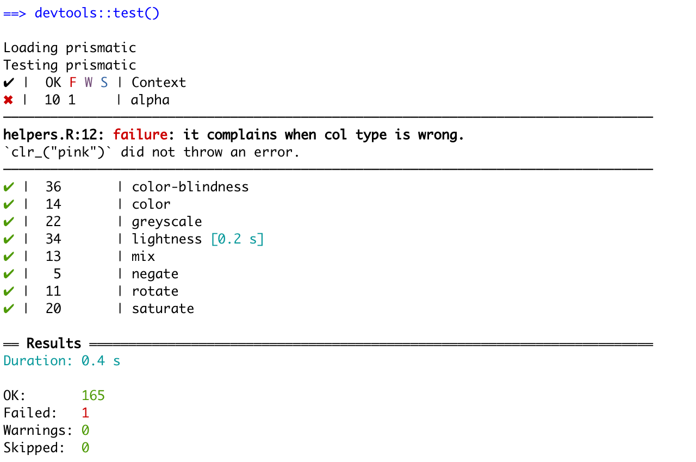
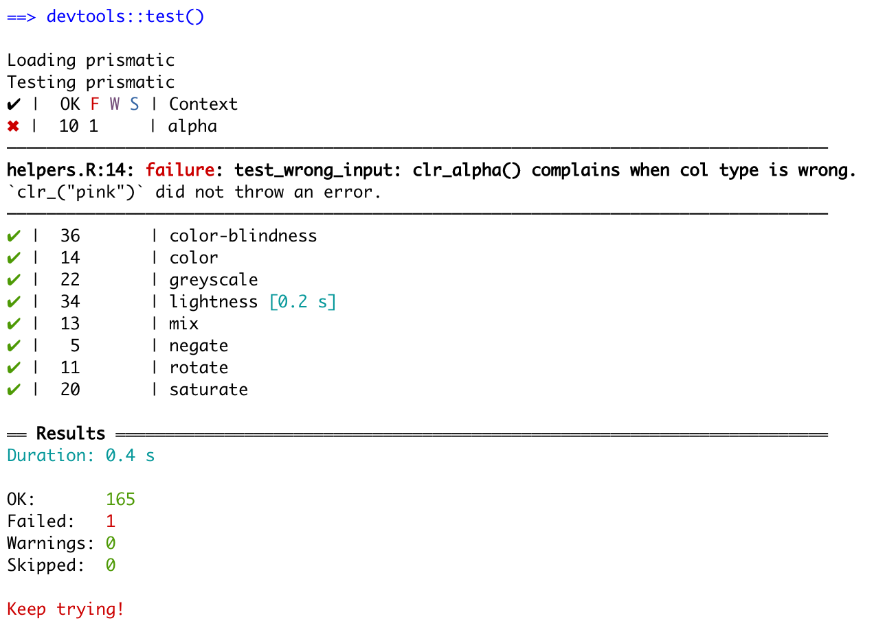

We all know the saying 

> When you’ve written the same code 3 times, write a function

However, I would like to expand that to

> When you're written the same test 3 times, write a test function

During my lasting packages such as [prismatic](https://github.com/EmilHvitfeldt/prismatic),
I found myself copy-pasting tests around whenever I needed to test a new function.
I realized that the refactoring practices I try to apply in my general code writing
weren't carried over to the way I was writing my tests. 
I would frequently copy-paste hundreds of lines of tests only to replace the function name.
This post will go over a refactoring scenario I am working on at the moment. 

# The copy-pasted test

The **prismatic** package includes almost a dozen different functions that work mostly the same way.
They all take the same type of arguments, return the returns in the same fashion, and so on.
This leads me to have a great overlap between what tests I'm performing for each function.

Taking a look at the following code chuck we see a test that makes sure that the function `clr_alpha()` complains when given the wrong type of the first argument.


```r
test_that("complain when `col` type is wrong.", {
  expect_error(clr_alpha("not a color"))

  expect_error(clr_alpha(list(pal = "#000000")))

  expect_error(clr_alpha(character()))
})
```

When looking at the same test for `clr_mix()` we see that it is a carbon copy except for the function name.


```r
test_that("it complains when col type is wrong.", {
  expect_error(clr_mix("not a color"))

  expect_error(clr_mix(list(pal = "#000000")))

  expect_error(clr_mix(character()))
})
```

I'm going to propose 2 different styles of refactoring, 
with the main difference being how RStudio returns the error when tests are not met.

## Fix #1 - Plays well with error messages

The first solution is to wrap the inside of your test into a function.
The above test would create the refactored testing-function


```r
test_wrong_input <- function(clr_) {
  expect_error(clr_("not a color"))

  expect_error(clr_(list(pal = "#000000")))

  expect_error(clr_(character()))
}
```

and the test would be changed to


```r
test_that("it complains when col type is wrong.", {
  test_wrong_input(clr_alpha)
})
```

this change will perform the tests,
and adding tests for the new function would only need 1 change in the test instead of 3.


```r
test_that("it complains when col type is wrong.", {
  test_wrong_input(clr_mix)
})
```

More importantly, let's imagine that we want to extend the types of wrong inputs we what to screen.
Now we simply just need to add it once and it propagates to all the functions.

The main benefit of this refactoring style is that when an error appears,
It will denote the line where the test broke.


## Fix #2 - Less typing, worse error message

The second solution is to wrap the entire testing statement inside a function.
For this example, the function would look like this


```r
test_wrong_input <- function(clr_) {
  test_that("it complains when col type is wrong.", {
  expect_error(clr_("not a color"))

  expect_error(clr_(list(pal = "#000000")))

  expect_error(clr_(character()))
  })
}
```

and the testing would look like


```r
test_wrong_input(clr_mix)
```

This reduces the number of lines needed for each test from 3 down to 1.
However, it comes with a downside. 
When an error appears **testthat** will give the location of the definition of the test function,
not the location from where it was called.


We can still see that the error happens inside the "alpha" Context,
but it is slightly harder to track down.

## Fix #2.1 - ugly hack to give me the location

The second solution can be made slightly better by making the description of the test more informative.


```r
test_wrong_input <- function(clr_) {
  test_that(paste0("test_wrong_input: ",
                   deparse(substitute(clr_)),
                   "() complains when col type is wrong."), {
  expect_error(clr_("not a color"))

  expect_error(clr_(list(pal = "#000000")))

  expect_error(clr_("pink"))
  })
}
```



It takes more work upfront when writing the test functions.
But it gives a compromise between the brevity of test files and the clarity of the debugging page.

Thanks for reading along! I hope you found it useful!

<details closed>
<summary> <span title='Click to Expand'> session information </span> </summary>

```r

─ Session info ───────────────────────────────────────────────────────────────
 setting  value                       
 version  R version 4.1.0 (2021-05-18)
 os       macOS Big Sur 10.16         
 system   x86_64, darwin17.0          
 ui       X11                         
 language (EN)                        
 collate  en_US.UTF-8                 
 ctype    en_US.UTF-8                 
 tz       America/Los_Angeles         
 date     2021-07-16                  

─ Packages ───────────────────────────────────────────────────────────────────
 package     * version date       lib source                           
 blogdown      1.3.2   2021-06-09 [1] Github (rstudio/blogdown@00a2090)
 bookdown      0.22    2021-04-22 [1] CRAN (R 4.1.0)                   
 bslib         0.2.5.1 2021-05-18 [1] CRAN (R 4.1.0)                   
 cli           3.0.0   2021-06-30 [1] CRAN (R 4.1.0)                   
 clipr         0.7.1   2020-10-08 [1] CRAN (R 4.1.0)                   
 codetools     0.2-18  2020-11-04 [1] CRAN (R 4.1.0)                   
 crayon        1.4.1   2021-02-08 [1] CRAN (R 4.1.0)                   
 desc          1.3.0   2021-03-05 [1] CRAN (R 4.1.0)                   
 details     * 0.2.1   2020-01-12 [1] CRAN (R 4.1.0)                   
 digest        0.6.27  2020-10-24 [1] CRAN (R 4.1.0)                   
 evaluate      0.14    2019-05-28 [1] CRAN (R 4.1.0)                   
 highr         0.9     2021-04-16 [1] CRAN (R 4.1.0)                   
 htmltools     0.5.1.1 2021-01-22 [1] CRAN (R 4.1.0)                   
 httr          1.4.2   2020-07-20 [1] CRAN (R 4.1.0)                   
 jquerylib     0.1.4   2021-04-26 [1] CRAN (R 4.1.0)                   
 jsonlite      1.7.2   2020-12-09 [1] CRAN (R 4.1.0)                   
 knitr       * 1.33    2021-04-24 [1] CRAN (R 4.1.0)                   
 magrittr      2.0.1   2020-11-17 [1] CRAN (R 4.1.0)                   
 png           0.1-7   2013-12-03 [1] CRAN (R 4.1.0)                   
 R6            2.5.0   2020-10-28 [1] CRAN (R 4.1.0)                   
 rlang         0.4.11  2021-04-30 [1] CRAN (R 4.1.0)                   
 rmarkdown     2.9     2021-06-15 [1] CRAN (R 4.1.0)                   
 rprojroot     2.0.2   2020-11-15 [1] CRAN (R 4.1.0)                   
 sass          0.4.0   2021-05-12 [1] CRAN (R 4.1.0)                   
 sessioninfo   1.1.1   2018-11-05 [1] CRAN (R 4.1.0)                   
 stringi       1.6.2   2021-05-17 [1] CRAN (R 4.1.0)                   
 stringr       1.4.0   2019-02-10 [1] CRAN (R 4.1.0)                   
 withr         2.4.2   2021-04-18 [1] CRAN (R 4.1.0)                   
 xfun          0.24    2021-06-15 [1] CRAN (R 4.1.0)                   
 xml2          1.3.2   2020-04-23 [1] CRAN (R 4.1.0)                   
 yaml          2.2.1   2020-02-01 [1] CRAN (R 4.1.0)                   

[1] /Library/Frameworks/R.framework/Versions/4.1/Resources/library

```

</details>
<br>
