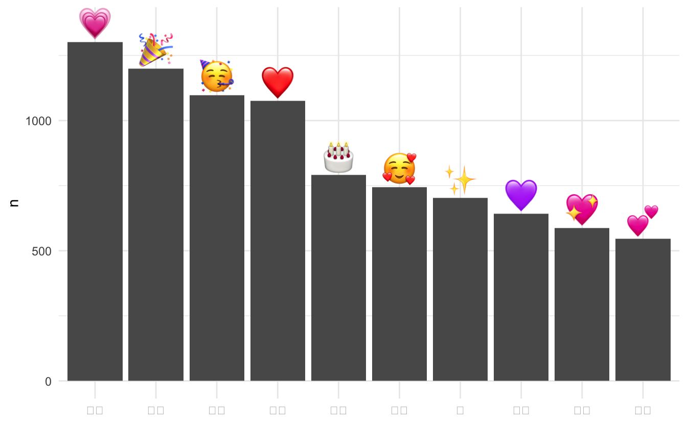

::: {.callout-note}
Emojis are now fully supported in {ggplot2} thanks to the {ragg} package. Read more about it here: <a href="https://www.tidyverse.org/blog/2021/02/modern-text-features/">Modern Text Features in R</a>.
:::

I have been trying to use [Emojis](https://en.wikipedia.org/wiki/Emoji) for a long time. 
It was part of my very first [post](https://www.hvitfeldt.me/blog/2017-world-press-freedom-index-with-emojis/) on this blog.
Others have made progress such as with [emojifont](https://cran.r-project.org/web/packages/emojifont/vignettes/emojifont.html), but it is not using the classical [Apple Color Emoji](https://en.wikipedia.org/wiki/Apple_Color_Emoji) font which is the most commonly recognized.
I made a breakthrough when I was writing the [packagecalander](https://www.hvitfeldt.me/packagecalendar/2019/) entry on [ggtext](https://github.com/clauswilke/ggtext).
While the method is the best I have found it does have some cons.

Pros:

- Works
- Doesn't require the use of SVG
- Previews nicely

Cons:

- Relies on experimental package **ggtext**
- Needs web scraping
- Required access to the internet to render
- Size can't be adjusted using the size aesthetic 

All in all, it is a fair trade for my needs.

## Packages 📦

We load the essential packages to wrangle, collect data (we will use tweets), scrape websites, and handle emojis.


```r
library(tidyverse)
library(rtweet)
library(rvest)
# devtools::install_github("clauswilke/ggtext")
library(ggtext)
library(emo)
```

## Getting the tweets 🐦

For a simple dataset where we find emojis I'm going to get some tweets with the word "happy".


```r
happy <- search_tweets("happy", include_rts = FALSE, n = 1000)
```


we can use the `ji_extract_all()` function from the [emo](https://github.com/hadley/emo) package.
This will give us a list of emojis so we can use the `unnest()` function to get back to a tidy format.
I'm going to do a simple `count()` of the emojis for the following visualizations. 


```r
happy_emojis <- happy %>%
  mutate(emoji = emo::ji_extract_all(text)) %>%
  unnest(cols = c(emoji)) %>%
  count(emoji, sort = TRUE)
```

Next is where the magic happens.
We don't have a way to displays emojis in **ggplot2**, but we can use **ggtext** to embed images into the text using HTML.
Now we just need to get an image of each emoji.
The following function will accept an emoji as a string and return the URL to a .png of that emoji.


```r
emoji_to_link <- function(x) {
  paste0("https://emojipedia.org/emoji/",x) %>%
    read_html() %>%
    html_nodes("tr td a") %>%
    .[1] %>%
    html_attr("href") %>%
    paste0("https://emojipedia.org/", .) %>%
    read_html() %>%
    html_node('div[class="vendor-image"] img') %>%
    html_attr("src")
}
```

Then this function will take that URL and construct the necessary HTML code to show the emoji PNGs.


```r
link_to_img <- function(x, size = 25) {
  paste0("")
}
```

To be courteous we are only going to scrape the emojis we are going to use.
So we will `slice()` the 10 most frequent emojis.
We will also be adding a 5 second delay using `slowly()` and `rate_delay()` from **purrr**.


```r
top_happy <- happy_emojis %>%
  slice(1:10) %>%
  mutate(url = map_chr(emoji, slowly(~emoji_to_link(.x), rate_delay(1))),
         label = link_to_img(url))
```

## emoji-scatter plot 📈

Now we can use the `geom_richtext()` function from **ggtext** to create a emoji scatter chart.


```r
top_happy %>%
  ggplot(aes(emoji, n, label = label)) +
  geom_richtext(aes(y = n), fill = NA, label.color = NA, # remove background and outline
                label.padding = grid::unit(rep(0, 4), "pt") # remove padding
  ) +
  theme_minimal()
```


This is a little off, so let's other these by counts and put them over a bar chart.
I'm also going to the x-axis ticks and text.


```r
offset <- max(top_happy$n) / 20

top_happy %>%
  ggplot(aes(fct_reorder(emoji, n, .desc = TRUE), n, label = label)) +
  geom_col() +
  geom_richtext(aes(y = n + offset), fill = NA, label.color = NA,
                label.padding = grid::unit(rep(0, 4), "pt")
  ) +
  theme(axis.ticks.x = element_blank(),
        axis.text.x = element_blank()) +
  labs(x = NULL) +
  theme_minimal()
```



## Emojis in labels and text 📊

We are not only limited to using emojis in the geoms.
We can set the text element using emojis to `element_markdown()`.
Below we have the same bar chart as above but with the emoji as labels below instead of on top.


```r
top_happy %>%
  ggplot(aes(fct_reorder(label, n, .desc = TRUE), n)) +
  geom_col() +
  theme_minimal() +
  theme(axis.text.x = element_markdown()) +
  labs(x = NULL)
```


## Adding a splash of color 🌈

We can employ a little more scraping and color calculations to had colors to the bars according to the colors of the emoji.
The following function takes a URL to a .png file and returns the most common color that isn't purely black or pure white.


```r
mean_emoji_color <- function(x) {
  data <- png::readPNG(RCurl::getURLContent(x))
  color_freq <- names(sort(table(rgb(data[,,1], data[,,2], data[,,3])), 
                           decreasing = TRUE))
  setdiff(color_freq, c("#FFFFFF", "#000000"))[1]
}
```

We apply this to all the emoji URLs and color the bars accordingly. 


```r
plot_data <- top_happy %>%
  mutate(color = map_chr(url, slowly(~mean_emoji_color(.x), rate_delay(1))))

plot_data %>%
  ggplot(aes(fct_reorder(label, n, .desc = TRUE), 
             color = color, 
             fill = unclass(prismatic::clr_lighten(color, 0.4)), n)) +
  geom_col() +
  scale_fill_identity() +
  scale_color_identity() +
  theme_minimal() +
  theme(axis.text.x = element_markdown()) +
  labs(x = NULL, y = "Count",
       title = "Emojis used in (small sample) of 'happy' tweets",
       subtitle = "Displayed in ggplot2!!!",
       caption = "@Emil_Hvitfeldt")
```


## Final note 🗒

If you want to use emojis in the text you need to call `theme_*()` before `theme()` such that `element_markdown()` isn't being overwritten.

<details closed>
<summary> <span title='Click to Expand'> current session info </span> </summary>

```r

─ Session info ───────────────────────────────────────────────────────────────
 setting  value                       
 version  R version 4.1.0 (2021-05-18)
 os       macOS Big Sur 10.16         
 system   x86_64, darwin17.0          
 ui       X11                         
 language (EN)                        
 collate  en_US.UTF-8                 
 ctype    en_US.UTF-8                 
 tz       America/Los_Angeles         
 date     2021-07-16                  

─ Packages ───────────────────────────────────────────────────────────────────
 package     * version    date       lib source                           
 askpass       1.1        2019-01-13 [1] CRAN (R 4.1.0)                   
 assertthat    0.2.1      2019-03-21 [1] CRAN (R 4.1.0)                   
 backports     1.2.1      2020-12-09 [1] CRAN (R 4.1.0)                   
 bitops        1.0-7      2021-04-24 [1] CRAN (R 4.1.0)                   
 blogdown      1.3.2      2021-06-09 [1] Github (rstudio/blogdown@00a2090)
 bookdown      0.22       2021-04-22 [1] CRAN (R 4.1.0)                   
 broom         0.7.8      2021-06-24 [1] CRAN (R 4.1.0)                   
 bslib         0.2.5.1    2021-05-18 [1] CRAN (R 4.1.0)                   
 cellranger    1.1.0      2016-07-27 [1] CRAN (R 4.1.0)                   
 cli           3.0.0      2021-06-30 [1] CRAN (R 4.1.0)                   
 clipr         0.7.1      2020-10-08 [1] CRAN (R 4.1.0)                   
 codetools     0.2-18     2020-11-04 [1] CRAN (R 4.1.0)                   
 colorspace    2.0-2      2021-06-24 [1] CRAN (R 4.1.0)                   
 crayon        1.4.1      2021-02-08 [1] CRAN (R 4.1.0)                   
 curl          4.3.2      2021-06-23 [1] CRAN (R 4.1.0)                   
 DBI           1.1.1      2021-01-15 [1] CRAN (R 4.1.0)                   
 dbplyr        2.1.1      2021-04-06 [1] CRAN (R 4.1.0)                   
 desc          1.3.0      2021-03-05 [1] CRAN (R 4.1.0)                   
 details     * 0.2.1      2020-01-12 [1] CRAN (R 4.1.0)                   
 digest        0.6.27     2020-10-24 [1] CRAN (R 4.1.0)                   
 dplyr       * 1.0.7      2021-06-18 [1] CRAN (R 4.1.0)                   
 ellipsis      0.3.2      2021-04-29 [1] CRAN (R 4.1.0)                   
 emo         * 0.0.0.9000 2021-07-17 [1] Github (hadley/emo@3f03b11)      
 evaluate      0.14       2019-05-28 [1] CRAN (R 4.1.0)                   
 fansi         0.5.0      2021-05-25 [1] CRAN (R 4.1.0)                   
 farver        2.1.0      2021-02-28 [1] CRAN (R 4.1.0)                   
 forcats     * 0.5.1      2021-01-27 [1] CRAN (R 4.1.0)                   
 fs            1.5.0      2020-07-31 [1] CRAN (R 4.1.0)                   
 generics      0.1.0      2020-10-31 [1] CRAN (R 4.1.0)                   
 ggplot2     * 3.3.5      2021-06-25 [1] CRAN (R 4.1.0)                   
 ggtext      * 0.1.1      2020-12-17 [1] CRAN (R 4.1.0)                   
 glue          1.4.2      2020-08-27 [1] CRAN (R 4.1.0)                   
 gridtext      0.1.4      2020-12-10 [1] CRAN (R 4.1.0)                   
 gtable        0.3.0      2019-03-25 [1] CRAN (R 4.1.0)                   
 haven         2.4.1      2021-04-23 [1] CRAN (R 4.1.0)                   
 highr         0.9        2021-04-16 [1] CRAN (R 4.1.0)                   
 hms           1.1.0      2021-05-17 [1] CRAN (R 4.1.0)                   
 htmltools     0.5.1.1    2021-01-22 [1] CRAN (R 4.1.0)                   
 httr          1.4.2      2020-07-20 [1] CRAN (R 4.1.0)                   
 jquerylib     0.1.4      2021-04-26 [1] CRAN (R 4.1.0)                   
 jsonlite      1.7.2      2020-12-09 [1] CRAN (R 4.1.0)                   
 knitr       * 1.33       2021-04-24 [1] CRAN (R 4.1.0)                   
 labeling      0.4.2      2020-10-20 [1] CRAN (R 4.1.0)                   
 lifecycle     1.0.0      2021-02-15 [1] CRAN (R 4.1.0)                   
 lubridate     1.7.10     2021-02-26 [1] CRAN (R 4.1.0)                   
 magrittr      2.0.1      2020-11-17 [1] CRAN (R 4.1.0)                   
 markdown      1.1        2019-08-07 [1] CRAN (R 4.1.0)                   
 modelr        0.1.8      2020-05-19 [1] CRAN (R 4.1.0)                   
 munsell       0.5.0      2018-06-12 [1] CRAN (R 4.1.0)                   
 openssl       1.4.4      2021-04-30 [1] CRAN (R 4.1.0)                   
 pillar        1.6.1      2021-05-16 [1] CRAN (R 4.1.0)                   
 pkgconfig     2.0.3      2019-09-22 [1] CRAN (R 4.1.0)                   
 png           0.1-7      2013-12-03 [1] CRAN (R 4.1.0)                   
 prettyunits   1.1.1      2020-01-24 [1] CRAN (R 4.1.0)                   
 prismatic     1.0.0      2021-01-05 [1] CRAN (R 4.1.0)                   
 progress      1.2.2      2019-05-16 [1] CRAN (R 4.1.0)                   
 purrr       * 0.3.4      2020-04-17 [1] CRAN (R 4.1.0)                   
 R6            2.5.0      2020-10-28 [1] CRAN (R 4.1.0)                   
 Rcpp          1.0.7      2021-07-07 [1] CRAN (R 4.1.0)                   
 RCurl         1.98-1.3   2021-03-16 [1] CRAN (R 4.1.0)                   
 readr       * 1.4.0      2020-10-05 [1] CRAN (R 4.1.0)                   
 readxl        1.3.1      2019-03-13 [1] CRAN (R 4.1.0)                   
 reprex        2.0.0      2021-04-02 [1] CRAN (R 4.1.0)                   
 rlang         0.4.11     2021-04-30 [1] CRAN (R 4.1.0)                   
 rmarkdown     2.9        2021-06-15 [1] CRAN (R 4.1.0)                   
 rprojroot     2.0.2      2020-11-15 [1] CRAN (R 4.1.0)                   
 rstudioapi    0.13       2020-11-12 [1] CRAN (R 4.1.0)                   
 rtweet      * 0.7.0      2020-01-08 [1] CRAN (R 4.1.0)                   
 rvest       * 1.0.0      2021-03-09 [1] CRAN (R 4.1.0)                   
 sass          0.4.0      2021-05-12 [1] CRAN (R 4.1.0)                   
 scales        1.1.1      2020-05-11 [1] CRAN (R 4.1.0)                   
 selectr       0.4-2      2019-11-20 [1] CRAN (R 4.1.0)                   
 sessioninfo   1.1.1      2018-11-05 [1] CRAN (R 4.1.0)                   
 stringi       1.6.2      2021-05-17 [1] CRAN (R 4.1.0)                   
 stringr     * 1.4.0      2019-02-10 [1] CRAN (R 4.1.0)                   
 tibble      * 3.1.2      2021-05-16 [1] CRAN (R 4.1.0)                   
 tidyr       * 1.1.3      2021-03-03 [1] CRAN (R 4.1.0)                   
 tidyselect    1.1.1      2021-04-30 [1] CRAN (R 4.1.0)                   
 tidyverse   * 1.3.1      2021-04-15 [1] CRAN (R 4.1.0)                   
 utf8          1.2.1      2021-03-12 [1] CRAN (R 4.1.0)                   
 vctrs         0.3.8      2021-04-29 [1] CRAN (R 4.1.0)                   
 withr         2.4.2      2021-04-18 [1] CRAN (R 4.1.0)                   
 xfun          0.24       2021-06-15 [1] CRAN (R 4.1.0)                   
 xml2          1.3.2      2020-04-23 [1] CRAN (R 4.1.0)                   
 yaml          2.2.1      2020-02-01 [1] CRAN (R 4.1.0)                   

[1] /Library/Frameworks/R.framework/Versions/4.1/Resources/library

```

</details>
<br>
