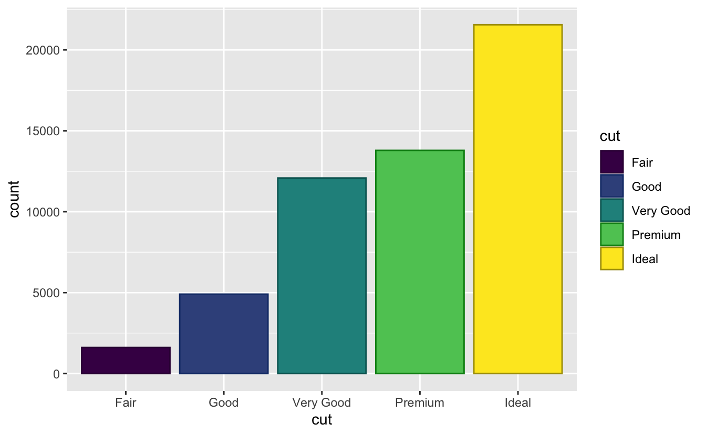
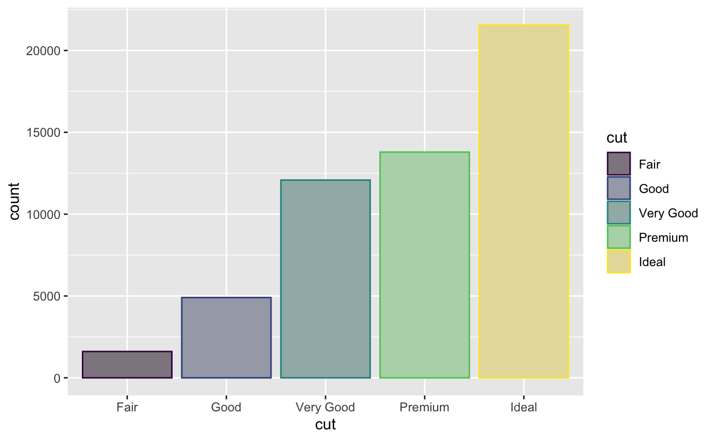
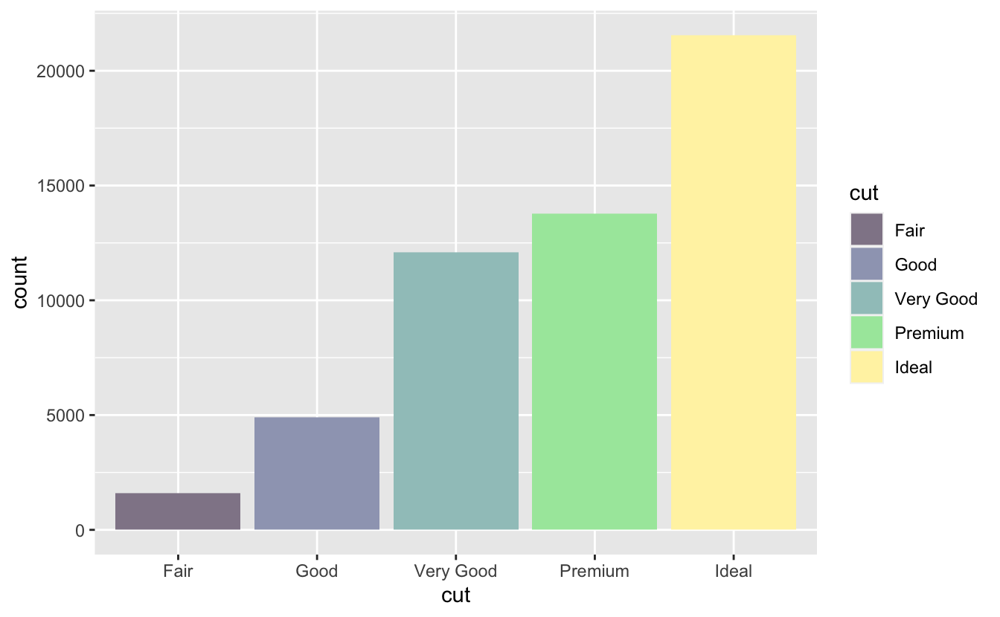

With the release of version 3.3.0 of ggplot2 came the ability to have more control over the aesthetic evaluation.
This allows us to modify the colors of the mapped palettes with [prismatic](https://github.com/EmilHvitfeldt/prismatic) now easier than ever.

## Packages 📦

We load the essential packages to wrangle, collect data (we will use tweets), scrape websites, and handle emojis.


```r
library(ggplot2)
library(prismatic)
```

## Examples

Suppose you have a simple bar chart and you have added colors to each bar.


```r
ggplot(diamonds, aes(cut)) +
  geom_bar(aes(fill = cut))
```


Next, suppose you would like to add a border around each bar.
Traditionally you could add a single color like black but it isn't that satisfying as it doesn't have any relation to the mapped colors.


```r
ggplot(diamonds, aes(cut)) +
  geom_bar(aes(fill = cut), color = "black")
```

![])index_files/figure-html/unnamed-chunk-2-1.png)

now that `after_scale()` is available for us we can base the color based on the mapped fill colors.
Below I have used `clr_darken()` to create a border that is just slightly darker than the fill color.


```r
ggplot(diamonds, aes(cut)) +
  geom_bar(aes(fill = cut, color = after_scale(clr_darken(fill, 0.3))))
```



this could also have been done in reverse by supplying the color and modifying the fill after.
Notice how we can chain multiple color modifications together.
Here we are taking the color, then desaturating it followed by some lighting.


```r
ggplot(diamonds, aes(cut)) +
  geom_bar(aes(color = cut, 
               fill = after_scale(clr_lighten(clr_desaturate(color), 
                                              space = "combined"))))
```



If you only need to specify one color directly you can use the `stage()` function.


```r
ggplot(diamonds, aes(cut)) +
  geom_bar(aes(fill = stage(start = cut, 
                            after_scale = clr_lighten(fill, space = "combined"))))
```



<details closed>
<summary> <span title='Click to Expand'> current session info </span> </summary>

```r

─ Session info ───────────────────────────────────────────────────────────────
 setting  value                       
 version  R version 4.1.0 (2021-05-18)
 os       macOS Big Sur 10.16         
 system   x86_64, darwin17.0          
 ui       X11                         
 language (EN)                        
 collate  en_US.UTF-8                 
 ctype    en_US.UTF-8                 
 tz       America/Los_Angeles         
 date     2021-07-16                  

─ Packages ───────────────────────────────────────────────────────────────────
 package     * version    date       lib source                           
 assertthat    0.2.1      2019-03-21 [1] CRAN (R 4.1.0)                   
 blogdown      1.3.2      2021-06-09 [1] Github (rstudio/blogdown@00a2090)
 bookdown      0.22       2021-04-22 [1] CRAN (R 4.1.0)                   
 bslib         0.2.5.1    2021-05-18 [1] CRAN (R 4.1.0)                   
 cli           3.0.0      2021-06-30 [1] CRAN (R 4.1.0)                   
 clipr         0.7.1      2020-10-08 [1] CRAN (R 4.1.0)                   
 codetools     0.2-18     2020-11-04 [1] CRAN (R 4.1.0)                   
 colorspace    2.0-2      2021-06-24 [1] CRAN (R 4.1.0)                   
 crayon        1.4.1      2021-02-08 [1] CRAN (R 4.1.0)                   
 DBI           1.1.1      2021-01-15 [1] CRAN (R 4.1.0)                   
 desc          1.3.0      2021-03-05 [1] CRAN (R 4.1.0)                   
 details     * 0.2.1      2020-01-12 [1] CRAN (R 4.1.0)                   
 digest        0.6.27     2020-10-24 [1] CRAN (R 4.1.0)                   
 dplyr         1.0.7      2021-06-18 [1] CRAN (R 4.1.0)                   
 ellipsis      0.3.2      2021-04-29 [1] CRAN (R 4.1.0)                   
 emo           0.0.0.9000 2021-07-17 [1] Github (hadley/emo@3f03b11)      
 evaluate      0.14       2019-05-28 [1] CRAN (R 4.1.0)                   
 fansi         0.5.0      2021-05-25 [1] CRAN (R 4.1.0)                   
 farver        2.1.0      2021-02-28 [1] CRAN (R 4.1.0)                   
 generics      0.1.0      2020-10-31 [1] CRAN (R 4.1.0)                   
 ggplot2     * 3.3.5      2021-06-25 [1] CRAN (R 4.1.0)                   
 glue          1.4.2      2020-08-27 [1] CRAN (R 4.1.0)                   
 gtable        0.3.0      2019-03-25 [1] CRAN (R 4.1.0)                   
 highr         0.9        2021-04-16 [1] CRAN (R 4.1.0)                   
 htmltools     0.5.1.1    2021-01-22 [1] CRAN (R 4.1.0)                   
 httr          1.4.2      2020-07-20 [1] CRAN (R 4.1.0)                   
 jquerylib     0.1.4      2021-04-26 [1] CRAN (R 4.1.0)                   
 jsonlite      1.7.2      2020-12-09 [1] CRAN (R 4.1.0)                   
 knitr       * 1.33       2021-04-24 [1] CRAN (R 4.1.0)                   
 labeling      0.4.2      2020-10-20 [1] CRAN (R 4.1.0)                   
 lifecycle     1.0.0      2021-02-15 [1] CRAN (R 4.1.0)                   
 lubridate     1.7.10     2021-02-26 [1] CRAN (R 4.1.0)                   
 magrittr      2.0.1      2020-11-17 [1] CRAN (R 4.1.0)                   
 munsell       0.5.0      2018-06-12 [1] CRAN (R 4.1.0)                   
 pillar        1.6.1      2021-05-16 [1] CRAN (R 4.1.0)                   
 pkgconfig     2.0.3      2019-09-22 [1] CRAN (R 4.1.0)                   
 png           0.1-7      2013-12-03 [1] CRAN (R 4.1.0)                   
 prismatic   * 1.0.0      2021-01-05 [1] CRAN (R 4.1.0)                   
 purrr         0.3.4      2020-04-17 [1] CRAN (R 4.1.0)                   
 R6            2.5.0      2020-10-28 [1] CRAN (R 4.1.0)                   
 Rcpp          1.0.7      2021-07-07 [1] CRAN (R 4.1.0)                   
 rlang         0.4.11     2021-04-30 [1] CRAN (R 4.1.0)                   
 rmarkdown     2.9        2021-06-15 [1] CRAN (R 4.1.0)                   
 rprojroot     2.0.2      2020-11-15 [1] CRAN (R 4.1.0)                   
 sass          0.4.0      2021-05-12 [1] CRAN (R 4.1.0)                   
 scales        1.1.1      2020-05-11 [1] CRAN (R 4.1.0)                   
 sessioninfo   1.1.1      2018-11-05 [1] CRAN (R 4.1.0)                   
 stringi       1.6.2      2021-05-17 [1] CRAN (R 4.1.0)                   
 stringr       1.4.0      2019-02-10 [1] CRAN (R 4.1.0)                   
 tibble        3.1.2      2021-05-16 [1] CRAN (R 4.1.0)                   
 tidyselect    1.1.1      2021-04-30 [1] CRAN (R 4.1.0)                   
 utf8          1.2.1      2021-03-12 [1] CRAN (R 4.1.0)                   
 vctrs         0.3.8      2021-04-29 [1] CRAN (R 4.1.0)                   
 viridisLite   0.4.0      2021-04-13 [1] CRAN (R 4.1.0)                   
 withr         2.4.2      2021-04-18 [1] CRAN (R 4.1.0)                   
 xfun          0.24       2021-06-15 [1] CRAN (R 4.1.0)                   
 xml2          1.3.2      2020-04-23 [1] CRAN (R 4.1.0)                   
 yaml          2.2.1      2020-02-01 [1] CRAN (R 4.1.0)                   

[1] /Library/Frameworks/R.framework/Versions/4.1/Resources/library

```

</details>
<br>
