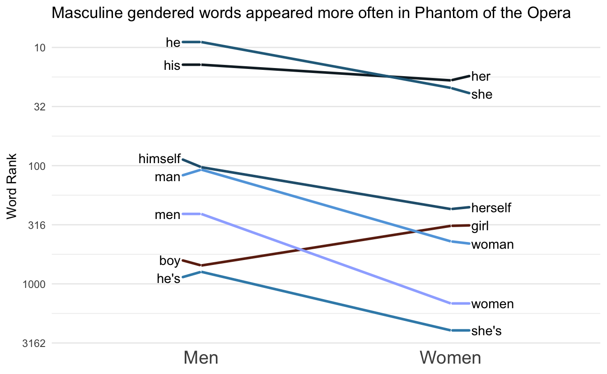
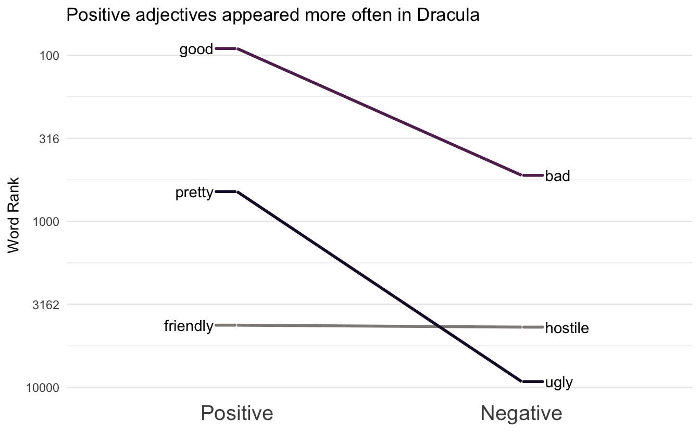

I have been working on visualizing how different kinds of words are used in texts and I finally found a good visualization style with the [slope chart](https://datavizproject.com/data-type/slope-chart/).
More specifically I'm thinking of two groups of paired words.

## Packages 📦

```r
library(tidyverse)
library(hcandersenr)
library(tidytext)
library(paletteer)
library(ggrepel)
```

## Minimal Example 1️⃣

First I'll walk you through a minimal example of how the chart is created.
Afterward, I have created a function to automate the whole procedure so we can quickly iterate.
We start with an example of gendered words in fairy tales by H.C. Andersen using the [hcandersenr](https://github.com/EmilHvitfeldt/hcandersenr) package.
We start by generating a data.frame of paired words.
This is easily done using the `tribble()` function.


```r
gender_words <- tribble(
  ~men, ~women,
  "he", "she",
  "his", "her",
  "man", "woman",
  "men", "women",
  "boy", "girl",
  "he's", "she's",
  "he'd", "she'd",
  "he'll", "she'll",
  "himself", "herself"
)
```

Next, we are going to tokenize and count the tokens in the corpus,


```r
ordered_words <- hcandersen_en %>% 
  unnest_tokens(word, text) %>% 
  count(word, sort = TRUE) %>% 
  pull(word)
```

Next, we are going to get the index for each word, which we will put on a log scale since it will be [easier to visualize](https://en.wikipedia.org/wiki/Zipf%27s_law).
Next, we will calculate a slope between the points and add the correct labels.


```r
gender_words_plot <- gender_words %>%
  mutate(male_index = match(men, ordered_words),
         female_index = match(women, ordered_words)) %>%
  mutate(slope = log10(male_index) - log10(female_index)) %>%
  pivot_longer(male_index:female_index) %>%
  mutate(value = log10(value),
         label = ifelse(name == "male_index", men, women)) %>%
  mutate(name = factor(name, c("male_index", "female_index"), c("men", "women")))
```

Next, we are going to manually calculate the limits to make sure a diverging color scale will have the colors [done directly](https://www.hvitfeldt.me/blog/center-continuous-palettes-in-ggplot2/).


```r
limit <- max(abs(gender_words_plot$slope)) * c(-1, 1)
```

Lastly, we just put everything into ggplot2, and voila!!


```r
gender_words_plot %>%
  ggplot(aes(name, value, group = women, label = label)) +
  geom_line(aes(color = slope)) +
  scale_y_reverse(labels = function(x) 10 ^ x) +
  geom_text() +
  guides(color = "none") +
  scale_color_distiller(type = "div", limit = limit) +
  theme_minimal() +
  theme(panel.border = element_blank(), panel.grid.major.x = element_blank()) +
  labs(x = NULL, y = "Word Rank") +
  labs(title = "Masculine gendered words appeared more often in H.C. Andersen's fairy tales")
```


## Make it into a function ✨

This function is mostly the same as the code you saw earlier.
Main difference is using `.data` from [rlang](https://rlang.r-lib.org/reference/tidyeval-data.html) to generalize.
The function also includes other beautifications such as improved themes and theme support with [paletteer](https://github.com/EmilHvitfeldt/paletteer).


```r
plot_fun <- function(words, ref, palette = "scico::roma", ...) {
  
  names <- colnames(ref)
  
  ordered_words <- names(sort(table(words), decreasing = TRUE))

  plot_data <- ref %>%
    mutate(index1 = match(.data[[names[1]]], ordered_words),
           index2 = match(.data[[names[2]]], ordered_words)) %>%
    mutate(slope = log10(index1) - log10(index2)) %>%
    pivot_longer(index1:index2) %>%
    mutate(value = log10(value),
           label = ifelse(name == "index1", 
                          .data[[names[1]]], 
                          .data[[names[2]]]),
           name = factor(name, c("index1", "index2"), names))
  
  limit <- max(abs(plot_data$slope)) * c(-1, 1)

  plot_data %>%
    ggplot(aes(name, value, group = .data[[names[2]]], label = label)) +
    geom_line(aes(color = slope), size = 1) +
    scale_y_reverse(labels = function(x) round(10 ^ x)) +
    geom_text_repel(data = subset(plot_data, name == names[1]),
                    aes(segment.color = slope),
                    nudge_x       = -0.1,
                    segment.size  = 1,
                    direction     = "y",
                    hjust         = 1) + 
    geom_text_repel(data = subset(plot_data, name == names[2]),
                    aes(segment.color = slope),
                    nudge_x       = 0.1,
                    segment.size  = 1,
                    direction     = "y",
                    hjust         = 0) + 
    scale_color_paletteer_c(palette, 
                            limit = limit,
                            aesthetics = c("color", "segment.color"), 
                            ...) +
    guides(color = "none", segment.color = "none") +
    theme_minimal() +
    theme(panel.border = element_blank(), 
          panel.grid.major.x = element_blank(), axis.text.x = element_text(size = 15)) +
    labs(x = NULL, y = "Word Rank")
}
```

Now we can recreate the previous chart with ease


```r
ref <- tribble(
  ~Men, ~Women,
  "he", "she",
  "his", "her",
  "man", "woman",
  "men", "women",
  "boy", "girl",
  "he's", "she's",
  "he'd", "she'd",
  "he'll", "she'll",
  "himself", "herself"
)

words <- hcandersen_en %>% 
  unnest_tokens(word, text) %>%
  pull(word)

plot_fun(words, ref, direction = -1) +
  labs(title = "Masculine gendered words appeared more often in H.C. Andersen's fairy tales")
```


## Gallery 🖼


```r
ref <- tribble(
  ~Men, ~Women,
  "he", "she",
  "his", "her",
  "man", "woman",
  "men", "women",
  "boy", "girl",
  "himself", "herself"
)

words <- janeaustenr::austen_books() %>% 
  unnest_tokens(word, text) %>%
  pull(word)

plot_fun(words, ref, direction = -1) +
  labs(title = "Masculine gendered words appeared less often in Jane Austen Novels")
```


More examples using the [tidygutenbergr](https://github.com/EmilHvitfeldt/tidygutenbergr) package.


```r
ref <- tribble(
  ~Men, ~Women,
  "he", "she",
  "his", "her",
  "man", "woman",
  "men", "women",
  "boy", "girl",
  "he's", "she's",
  "himself", "herself"
)

words <- tidygutenbergr::phantom_of_the_opera() %>% 
  unnest_tokens(word, text) %>%
  pull(word)

plot_fun(words, ref, "scico::berlin") +
  labs(title = "Masculine gendered words appeared more often in Phantom of the Opera")
```




```r
ref <- tribble(
  ~Positive, ~Negative,
  "good", "bad",
  "pretty", "ugly",
  "friendly", "hostile"
)

words <- tidygutenbergr::dracula() %>% 
  unnest_tokens(word, text) %>%
  pull(word)

plot_fun(words, ref, palette = "scico::tokyo") +
  labs(title = "Positive adjectives appeared more often in Dracula")
```



<details closed>
<summary> <span title='Click to Expand'> session information </span> </summary>

```r

─ Session info ───────────────────────────────────────────────────────────────
 setting  value                       
 version  R version 4.1.0 (2021-05-18)
 os       macOS Big Sur 10.16         
 system   x86_64, darwin17.0          
 ui       X11                         
 language (EN)                        
 collate  en_US.UTF-8                 
 ctype    en_US.UTF-8                 
 tz       America/Los_Angeles         
 date     2021-07-16                  

─ Packages ───────────────────────────────────────────────────────────────────
 package        * version    date       lib
 assertthat       0.2.1      2019-03-21 [1]
 backports        1.2.1      2020-12-09 [1]
 blogdown         1.3.2      2021-06-09 [1]
 bookdown         0.22       2021-04-22 [1]
 broom            0.7.8      2021-06-24 [1]
 bslib            0.2.5.1    2021-05-18 [1]
 cellranger       1.1.0      2016-07-27 [1]
 cli              3.0.0      2021-06-30 [1]
 clipr            0.7.1      2020-10-08 [1]
 codetools        0.2-18     2020-11-04 [1]
 colorspace       2.0-2      2021-06-24 [1]
 crayon           1.4.1      2021-02-08 [1]
 curl             4.3.2      2021-06-23 [1]
 DBI              1.1.1      2021-01-15 [1]
 dbplyr           2.1.1      2021-04-06 [1]
 desc             1.3.0      2021-03-05 [1]
 details        * 0.2.1      2020-01-12 [1]
 digest           0.6.27     2020-10-24 [1]
 dplyr          * 1.0.7      2021-06-18 [1]
 ellipsis         0.3.2      2021-04-29 [1]
 emo              0.0.0.9000 2021-07-17 [1]
 evaluate         0.14       2019-05-28 [1]
 fansi            0.5.0      2021-05-25 [1]
 farver           2.1.0      2021-02-28 [1]
 forcats        * 0.5.1      2021-01-27 [1]
 fs               1.5.0      2020-07-31 [1]
 generics         0.1.0      2020-10-31 [1]
 ggplot2        * 3.3.5      2021-06-25 [1]
 ggrepel        * 0.9.1      2021-01-15 [1]
 glue             1.4.2      2020-08-27 [1]
 gtable           0.3.0      2019-03-25 [1]
 gutenbergr       0.2.1      2021-06-01 [1]
 haven            2.4.1      2021-04-23 [1]
 hcandersenr    * 0.2.0      2019-01-19 [1]
 highr            0.9        2021-04-16 [1]
 hms              1.1.0      2021-05-17 [1]
 htmltools        0.5.1.1    2021-01-22 [1]
 httr             1.4.2      2020-07-20 [1]
 janeaustenr      0.1.5      2017-06-10 [1]
 jquerylib        0.1.4      2021-04-26 [1]
 jsonlite         1.7.2      2020-12-09 [1]
 knitr          * 1.33       2021-04-24 [1]
 labeling         0.4.2      2020-10-20 [1]
 lattice          0.20-44    2021-05-02 [1]
 lifecycle        1.0.0      2021-02-15 [1]
 lubridate        1.7.10     2021-02-26 [1]
 magrittr         2.0.1      2020-11-17 [1]
 Matrix           1.3-3      2021-05-04 [1]
 modelr           0.1.8      2020-05-19 [1]
 munsell          0.5.0      2018-06-12 [1]
 paletteer      * 1.3.0      2021-01-06 [1]
 pillar           1.6.1      2021-05-16 [1]
 pkgconfig        2.0.3      2019-09-22 [1]
 png              0.1-7      2013-12-03 [1]
 prismatic        1.0.0      2021-01-05 [1]
 purrr          * 0.3.4      2020-04-17 [1]
 R6               2.5.0      2020-10-28 [1]
 Rcpp             1.0.7      2021-07-07 [1]
 readr          * 1.4.0      2020-10-05 [1]
 readxl           1.3.1      2019-03-13 [1]
 rematch2         2.1.2      2020-05-01 [1]
 reprex           2.0.0      2021-04-02 [1]
 rlang            0.4.11     2021-04-30 [1]
 rmarkdown        2.9        2021-06-15 [1]
 rprojroot        2.0.2      2020-11-15 [1]
 rstudioapi       0.13       2020-11-12 [1]
 rvest            1.0.0      2021-03-09 [1]
 sass             0.4.0      2021-05-12 [1]
 scales           1.1.1      2020-05-11 [1]
 scico            1.2.0      2020-06-08 [1]
 sessioninfo      1.1.1      2018-11-05 [1]
 SnowballC        0.7.0      2020-04-01 [1]
 stringi          1.6.2      2021-05-17 [1]
 stringr        * 1.4.0      2019-02-10 [1]
 tibble         * 3.1.2      2021-05-16 [1]
 tidygutenbergr   0.0.0.9000 2021-07-17 [1]
 tidyr          * 1.1.3      2021-03-03 [1]
 tidyselect       1.1.1      2021-04-30 [1]
 tidytext       * 0.3.1      2021-04-10 [1]
 tidyverse      * 1.3.1      2021-04-15 [1]
 tokenizers       0.2.1      2018-03-29 [1]
 triebeard        0.3.0      2016-08-04 [1]
 urltools         1.7.3      2019-04-14 [1]
 utf8             1.2.1      2021-03-12 [1]
 vctrs            0.3.8      2021-04-29 [1]
 withr            2.4.2      2021-04-18 [1]
 xfun             0.24       2021-06-15 [1]
 xml2             1.3.2      2020-04-23 [1]
 yaml             2.2.1      2020-02-01 [1]
 source                                       
 CRAN (R 4.1.0)                               
 CRAN (R 4.1.0)                               
 Github (rstudio/blogdown@00a2090)            
 CRAN (R 4.1.0)                               
 CRAN (R 4.1.0)                               
 CRAN (R 4.1.0)                               
 CRAN (R 4.1.0)                               
 CRAN (R 4.1.0)                               
 CRAN (R 4.1.0)                               
 CRAN (R 4.1.0)                               
 CRAN (R 4.1.0)                               
 CRAN (R 4.1.0)                               
 CRAN (R 4.1.0)                               
 CRAN (R 4.1.0)                               
 CRAN (R 4.1.0)                               
 CRAN (R 4.1.0)                               
 CRAN (R 4.1.0)                               
 CRAN (R 4.1.0)                               
 CRAN (R 4.1.0)                               
 CRAN (R 4.1.0)                               
 Github (hadley/emo@3f03b11)                  
 CRAN (R 4.1.0)                               
 CRAN (R 4.1.0)                               
 CRAN (R 4.1.0)                               
 CRAN (R 4.1.0)                               
 CRAN (R 4.1.0)                               
 CRAN (R 4.1.0)                               
 CRAN (R 4.1.0)                               
 CRAN (R 4.1.0)                               
 CRAN (R 4.1.0)                               
 CRAN (R 4.1.0)                               
 CRAN (R 4.1.0)                               
 CRAN (R 4.1.0)                               
 CRAN (R 4.1.0)                               
 CRAN (R 4.1.0)                               
 CRAN (R 4.1.0)                               
 CRAN (R 4.1.0)                               
 CRAN (R 4.1.0)                               
 CRAN (R 4.1.0)                               
 CRAN (R 4.1.0)                               
 CRAN (R 4.1.0)                               
 CRAN (R 4.1.0)                               
 CRAN (R 4.1.0)                               
 CRAN (R 4.1.0)                               
 CRAN (R 4.1.0)                               
 CRAN (R 4.1.0)                               
 CRAN (R 4.1.0)                               
 CRAN (R 4.1.0)                               
 CRAN (R 4.1.0)                               
 CRAN (R 4.1.0)                               
 CRAN (R 4.1.0)                               
 CRAN (R 4.1.0)                               
 CRAN (R 4.1.0)                               
 CRAN (R 4.1.0)                               
 CRAN (R 4.1.0)                               
 CRAN (R 4.1.0)                               
 CRAN (R 4.1.0)                               
 CRAN (R 4.1.0)                               
 CRAN (R 4.1.0)                               
 CRAN (R 4.1.0)                               
 CRAN (R 4.1.0)                               
 CRAN (R 4.1.0)                               
 CRAN (R 4.1.0)                               
 CRAN (R 4.1.0)                               
 CRAN (R 4.1.0)                               
 CRAN (R 4.1.0)                               
 CRAN (R 4.1.0)                               
 CRAN (R 4.1.0)                               
 CRAN (R 4.1.0)                               
 CRAN (R 4.1.0)                               
 CRAN (R 4.1.0)                               
 CRAN (R 4.1.0)                               
 CRAN (R 4.1.0)                               
 CRAN (R 4.1.0)                               
 CRAN (R 4.1.0)                               
 Github (emilhvitfeldt/tidygutenbergr@89e4049)
 CRAN (R 4.1.0)                               
 CRAN (R 4.1.0)                               
 CRAN (R 4.1.0)                               
 CRAN (R 4.1.0)                               
 CRAN (R 4.1.0)                               
 CRAN (R 4.1.0)                               
 CRAN (R 4.1.0)                               
 CRAN (R 4.1.0)                               
 CRAN (R 4.1.0)                               
 CRAN (R 4.1.0)                               
 CRAN (R 4.1.0)                               
 CRAN (R 4.1.0)                               
 CRAN (R 4.1.0)                               

[1] /Library/Frameworks/R.framework/Versions/4.1/Resources/library

```

</details>
<br>
