With the new [Github Actions](https://github.com/features/actions) comes many possibilities. 
Some new and some old.
One of the benefits is that you don't have to use third-party applications to do continuous integration.

This post will show you how you can set up a [bookdown](https://bookdown.org/yihui/bookdown/) site with [Netlify](https://netlify.com/) using Github Actions.
This was previously and still is possible to do with Travis-CI.

This post wouldn't have been possible without [Jim Hester's](https://twitter.com/jimhester_) work on [Github Actions](https://github.com/r-lib/actions).

If you are transferring a book from Travis-CI build look at the notes at the end of this post.

## Create Repository

First, you need to create a bookdown repository. 
For this, I suggest you follow the [Getting Started](https://bookdown.org/yihui/bookdown/get-started.html) chapter from the [Bookdown Book](https://bookdown.org/yihui/bookdown/) and download the GitHub repository https://github.com/rstudio/bookdown-demo as a [Zip file](https://github.com/rstudio/bookdown-demo/archive/master.zip), then unzip it locally.
I recommend that you change the name of the `.Rproj` file so isn't the default value.

The next step isn't necessary but is still highly recommended.
Go fill in the information in the `DESCRIPTION` file.
Most importantly the `Package` and `Title` fields.
The `Package` field will be used as the name of the repository and the `Title` field will be the description of the repository once it hits Github.

## Connect to Github

Now we want to connect our repository to Github.
For this, I will use the [usethis](https://usethis.r-lib.org/) package which is wonderful for things like this.
If you haven't used **usethis** before please go do the [usethis setup](https://usethis.r-lib.org/articles/articles/usethis-setup.html) before moving forward.

Simply add Git to the repository by running `usethis::use_git()` and connect it to Github with `usethis::use_github()`.
This should open up a webpage with the newly linked repository.

## Create Netlify account

If you haven't already got a Netlify account, go to [netlify.com/](https://www.netlify.com/) to create one for free.
I have it set up with Github for easier interaction.

## Create Netlify site

Once you have logged into Netlify go to your team page and create a "New site from Git"

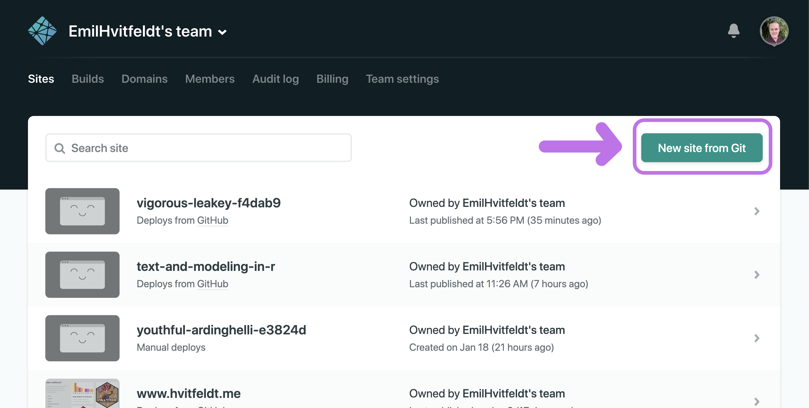

Select Github for Continuous Deployment

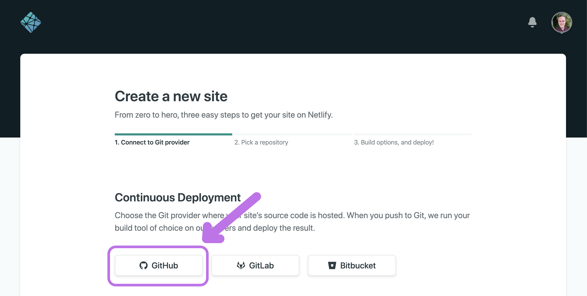

Now we need to select the GitHub repository.
Depending on how many repositories you have you can find it in the list or search for it with the search bar.
Once you have found it click the little arrow to the right of it.

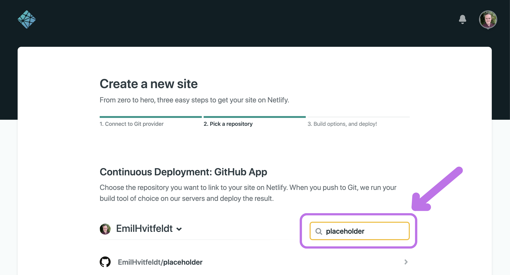

Don't touch any of the settings.

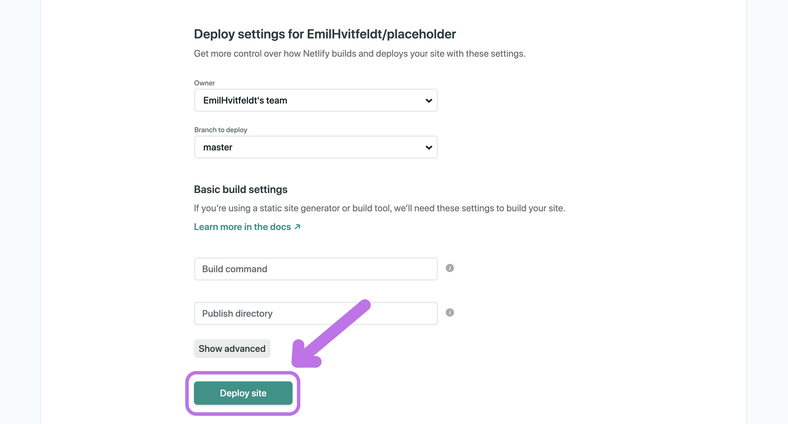

And voila!
Here is your new site, it is currently empty. 
Now click on the "Site settings" button

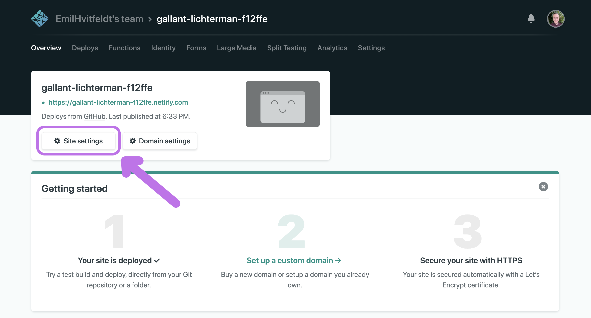

copy the API ID and save it, you will need it in a little bit.
If you lose it you can always come back here and copy it again.

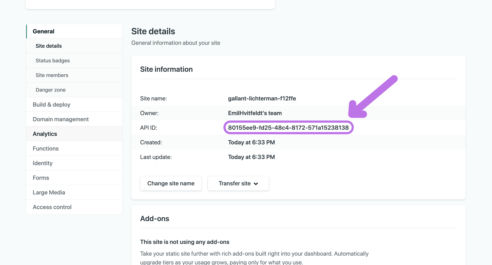

You might have noticed that the website is completely random.
If you click on the "Change site name" button you can set a new prefix name.

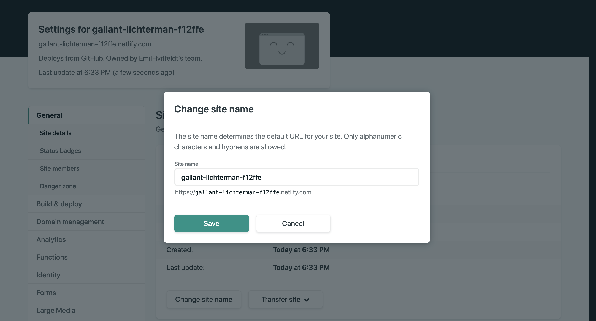

Scroll down to get the Status Badge, you can copy this too and put it at the top of your README.md file if you want.

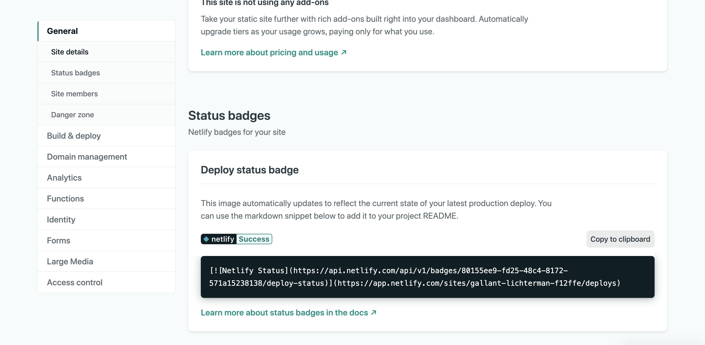

## Get a Netlify personal access token

Scroll all the way up and click on your icon in the top right corner.
Then go to "User settings"

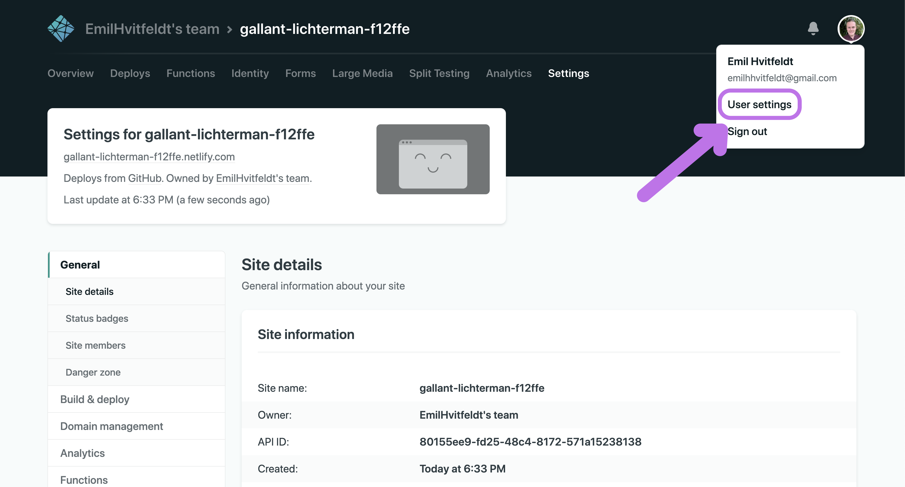

go to "Applications"

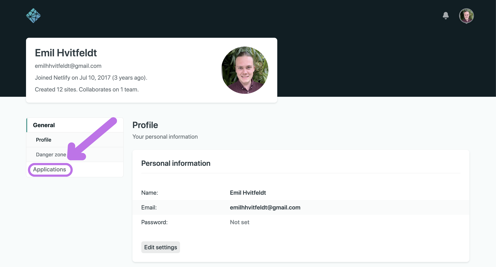

And click on "New access token" to create a personal access token

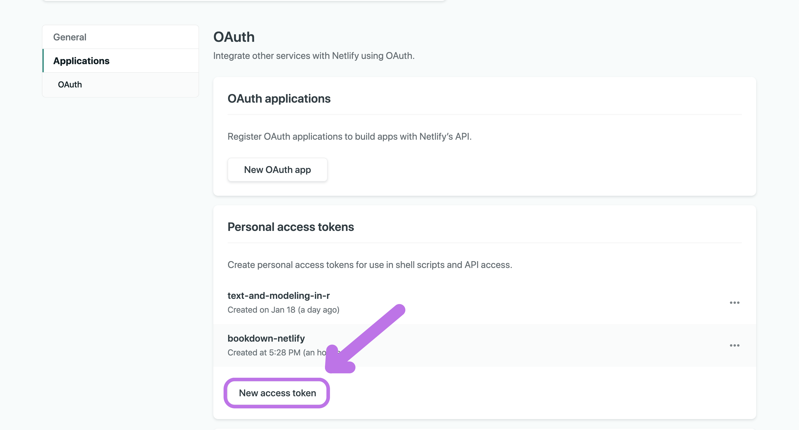

The description of your token isn't important but try to make it related to your book so you remember.
Click "Generate token" when you are done.

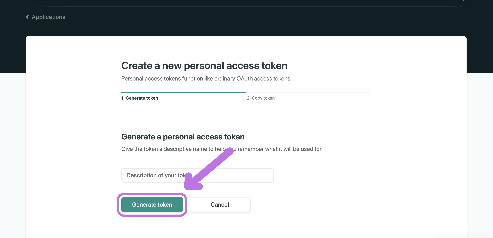

Here is your authentication token. 
Copy it and don't lose it!
Once you leave this site you **can not** get it back.

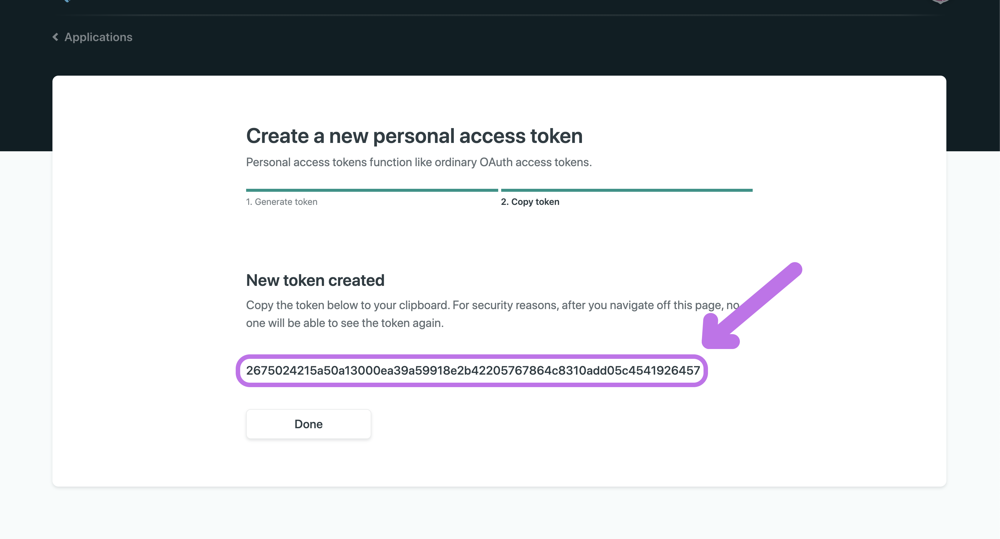

## Store Your Secrets

Now that you have the API ID and personal access token go back to your Github repository and go to "Settings"

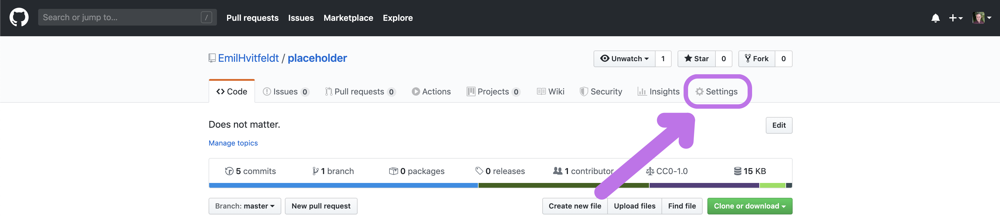

go to "Secrets"


Click on "Add a new secret"

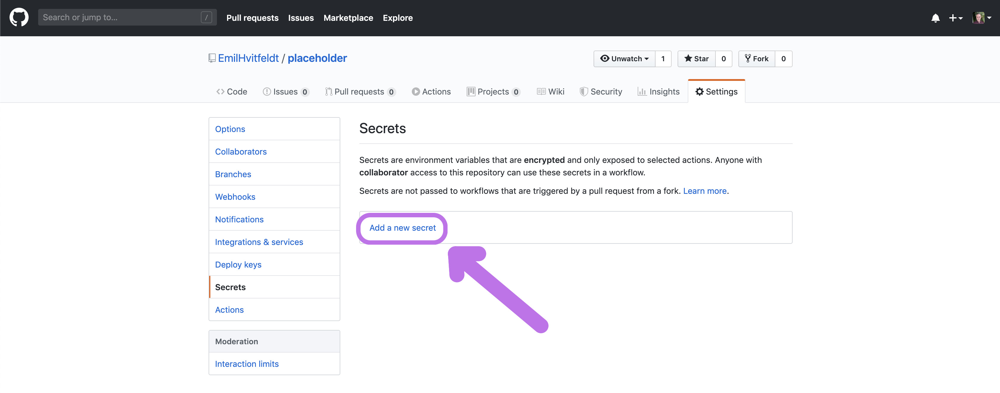

You need to do this twice.

- one named "NETLIFY_AUTH_TOKEN" where you put the personal access token as the value and,
- one named "NETLIFY_SITE_ID" where you put the API ID as the value.


## Create Github workflow

Now add the GitHub workflow file.

For this, you will need version `1.5.1.9000` or higher of **usethis** for it to work. 
You can get the newest version of usethis from github with


```r
# install.packages("devtools")
devtools::install_github("r-lib/usethis")

```

then you run `use_github_action("bookdown.yaml")` which will create the .yaml file in the right directory for you.

## Run renv::snapshot

Install the [renv](https://github.com/rstudio/renv) package and run `renv::snapshot()`.
This will ensure the package versions remain consistent across builds.

Once you need more packages, add them to the description like you normally would with an R package.

## Push changes

And that is everything you need to do, just commit the workflow file and the **renv** files you created and the website should build for you.

My example can be found [here](https://bookdown-github-actions-netlify.netlify.com/) with the [repository](https://github.com/EmilHvitfeldt/bookdown-github-actions-netlify).

## Notes

the line

```{}
netlify deploy --prod --dir _book
```

the workflow files it the one that deploys the built book to Netlify. 
It defaults to the `_book` folder.
In the `_bookdown.yml` file you can change the output folder.
So if you have set it to `output_dir: "docs"` then you need to change the deploy option to

```{}
netlify deploy --prod --dir docs
```

<details closed>
<summary> <span title='Click to Expand'> session information </span> </summary>

```r

─ Session info ───────────────────────────────────────────────────────────────
 setting  value                       
 version  R version 4.0.2 (2020-06-22)
 os       macOS Mojave 10.14.6        
 system   x86_64, darwin17.0          
 ui       X11                         
 language (EN)                        
 collate  en_US.UTF-8                 
 ctype    en_US.UTF-8                 
 tz       America/Los_Angeles         
 date     2020-09-04                  

─ Packages ───────────────────────────────────────────────────────────────────
 package     * version    date       lib source                       
 assertthat    0.2.1      2019-03-21 [1] CRAN (R 4.0.0)               
 backports     1.1.8      2020-06-17 [1] CRAN (R 4.0.0)               
 blogdown      0.20       2020-06-23 [1] CRAN (R 4.0.0)               
 bookdown      0.20       2020-06-23 [1] CRAN (R 4.0.0)               
 cli           2.0.2      2020-02-28 [1] CRAN (R 4.0.0)               
 clipr         0.7.0      2019-07-23 [1] CRAN (R 4.0.0)               
 crayon        1.3.4.9000 2020-08-22 [1] Github (r-lib/crayon@6b3f0c6)
 desc          1.2.0      2018-05-01 [1] CRAN (R 4.0.0)               
 details     * 0.2.1      2020-01-12 [1] CRAN (R 4.0.0)               
 digest        0.6.25     2020-02-23 [1] CRAN (R 4.0.0)               
 evaluate      0.14       2019-05-28 [1] CRAN (R 4.0.0)               
 fansi         0.4.1      2020-01-08 [1] CRAN (R 4.0.0)               
 glue          1.4.2      2020-08-27 [1] CRAN (R 4.0.2)               
 htmltools     0.5.0      2020-06-16 [1] CRAN (R 4.0.0)               
 httr          1.4.2      2020-07-20 [1] CRAN (R 4.0.2)               
 knitr       * 1.29       2020-06-23 [1] CRAN (R 4.0.0)               
 magrittr      1.5        2014-11-22 [1] CRAN (R 4.0.0)               
 png           0.1-7      2013-12-03 [1] CRAN (R 4.0.0)               
 R6            2.4.1      2019-11-12 [1] CRAN (R 4.0.0)               
 rlang         0.4.7      2020-07-09 [1] CRAN (R 4.0.2)               
 rmarkdown     2.3        2020-06-18 [1] CRAN (R 4.0.0)               
 rprojroot     1.3-2      2018-01-03 [1] CRAN (R 4.0.0)               
 sessioninfo   1.1.1      2018-11-05 [1] CRAN (R 4.0.0)               
 stringi       1.4.6      2020-02-17 [1] CRAN (R 4.0.0)               
 stringr       1.4.0      2019-02-10 [1] CRAN (R 4.0.0)               
 withr         2.2.0      2020-04-20 [1] CRAN (R 4.0.0)               
 xfun          0.16       2020-07-24 [1] CRAN (R 4.0.2)               
 xml2          1.3.2      2020-04-23 [1] CRAN (R 4.0.0)               
 yaml          2.2.1      2020-02-01 [1] CRAN (R 4.0.0)               

[1] /Library/Frameworks/R.framework/Versions/4.0/Resources/library

```

</details>
<br>
