# Introduction

The newest version of [ggplot2 3.2.0](https://www.tidyverse.org/articles/2019/06/ggplot2-3-2-0/) gave us the ability to change the glyph in the legend like so


```r
library(ggplot2)

ggplot(economics_long, aes(date, value01, colour = variable)) +
  geom_line(key_glyph = "timeseries")
```


And they can likewise be specified with the `draw_key_*` functions as well


```r
ggplot(economics_long, aes(date, value01, colour = variable)) +
  geom_line(key_glyph = draw_key_timeseries)
```


# Showcase

The following are all the available `draw_key_*` functions in ggplot2. Notice that the dark gray color in dot-plot and polygon is a result of an unspecified `fill` aesthetic. Code to generate these figures can be found at the end of this post.


```
## 
## Attaching package: 'dplyr'
## The following objects are masked from 'package:stats':
## 
##     filter, lag
## The following objects are masked from 'package:base':
## 
##     intersect, setdiff, setequal, union
```

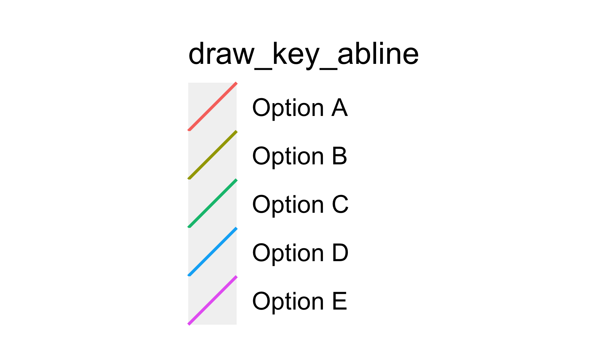
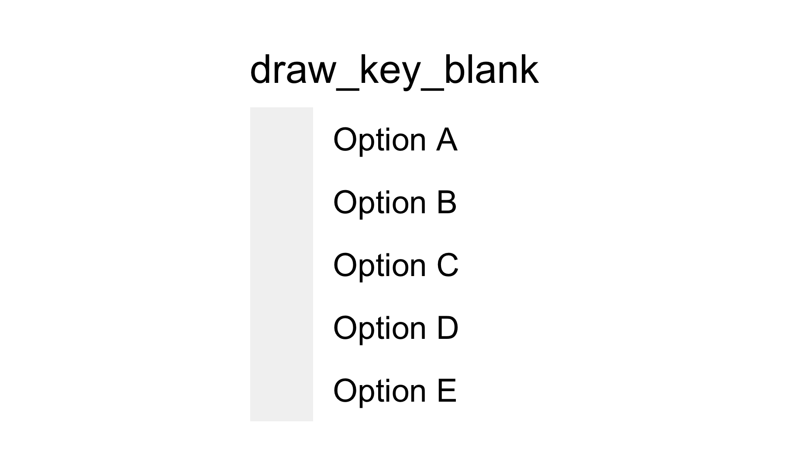

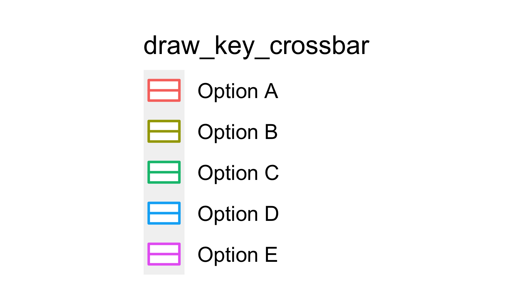
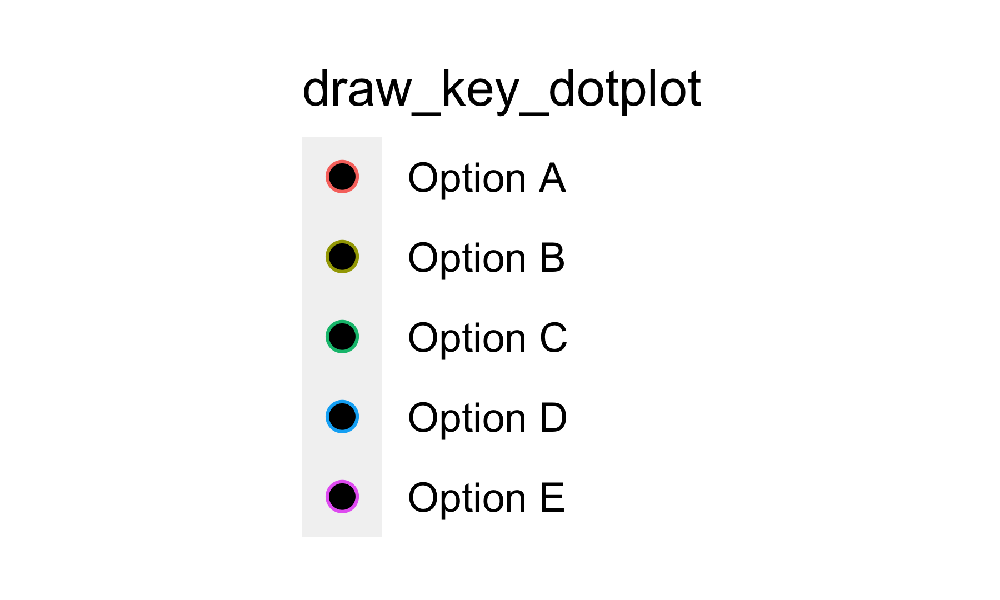
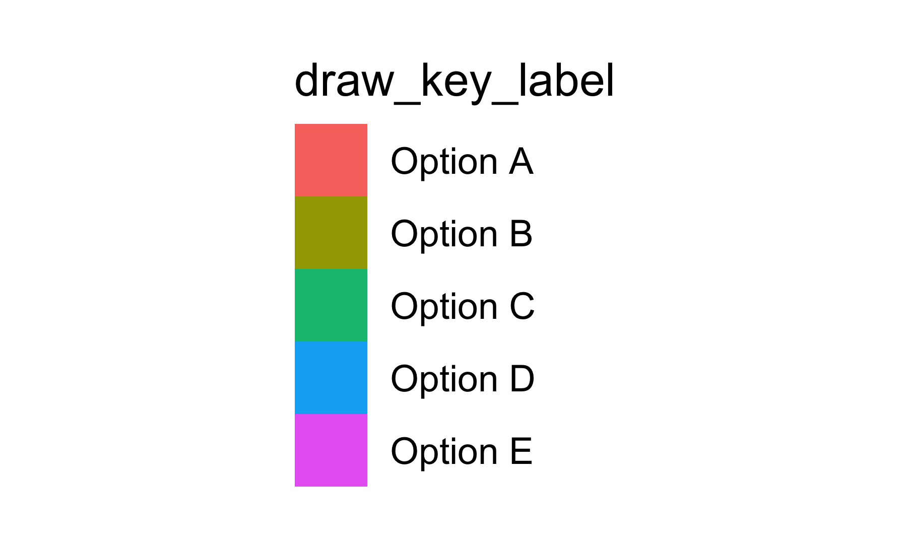
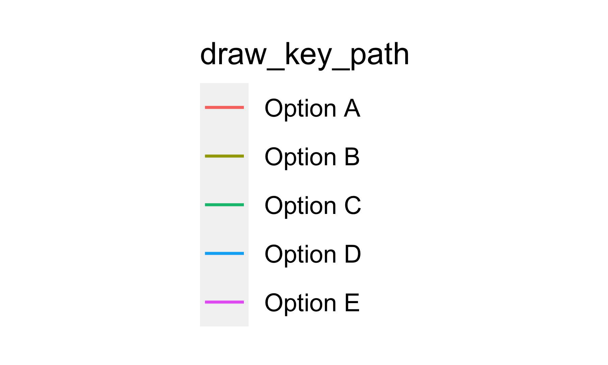
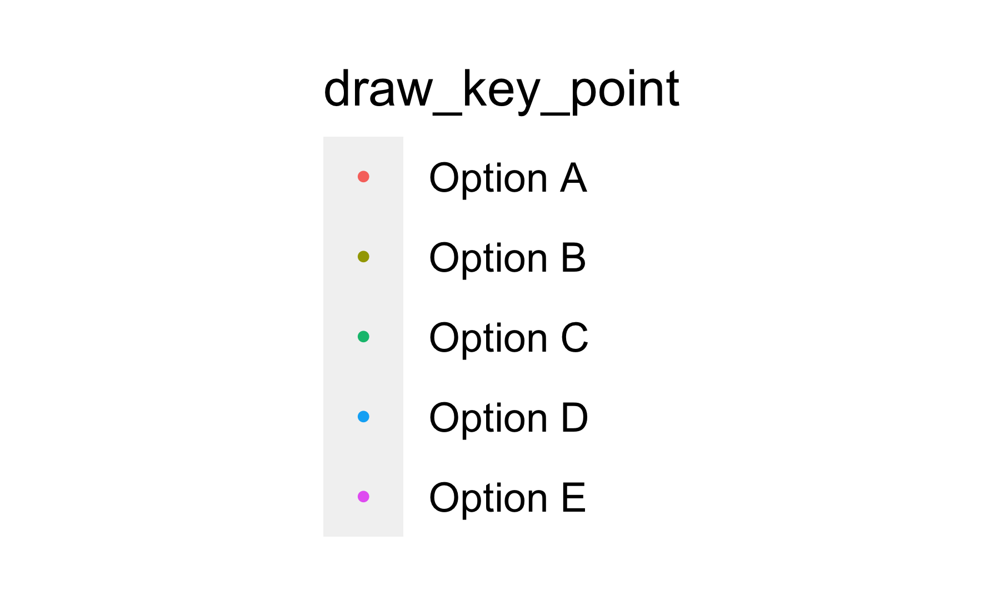
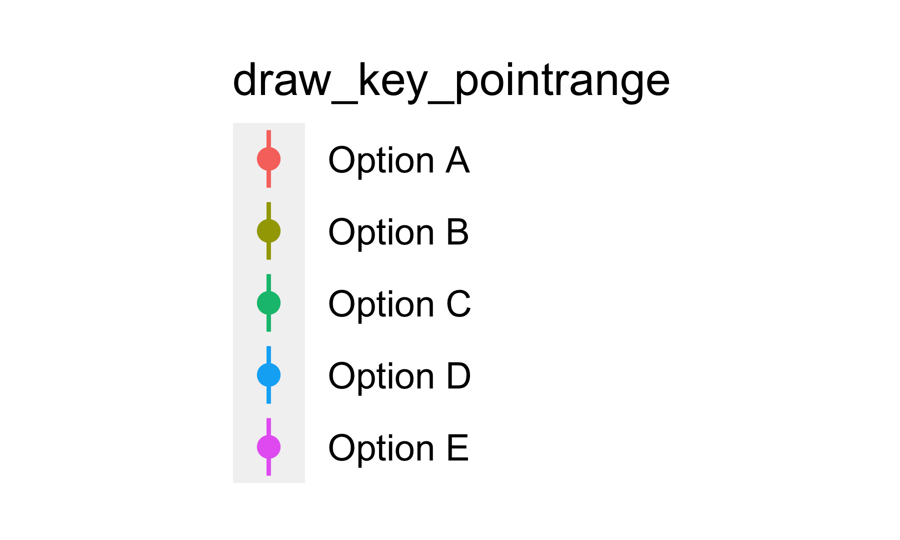
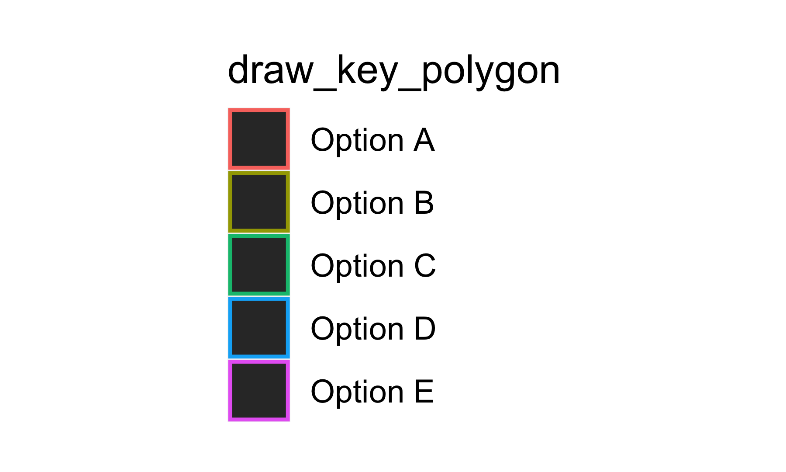

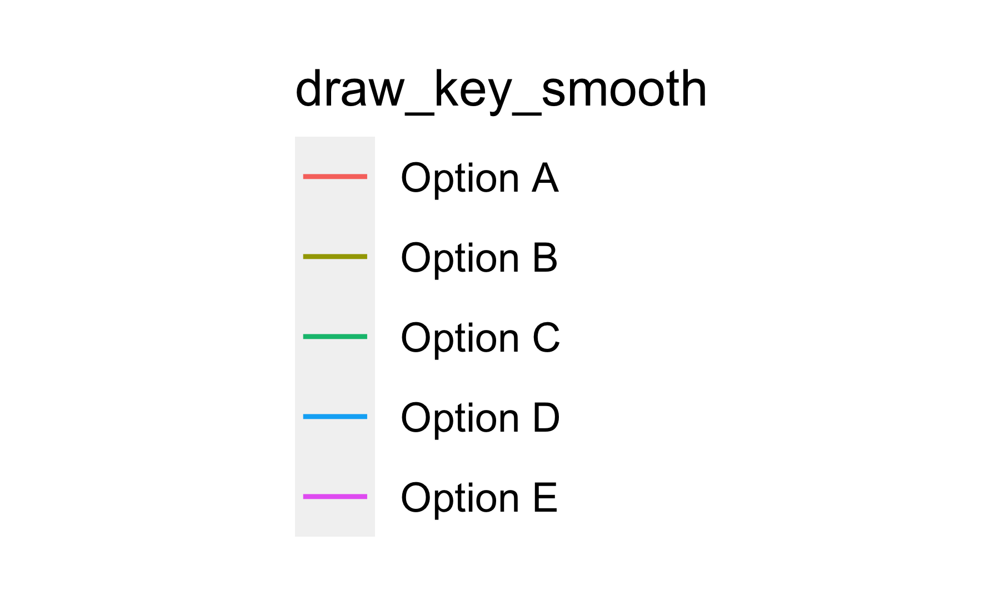

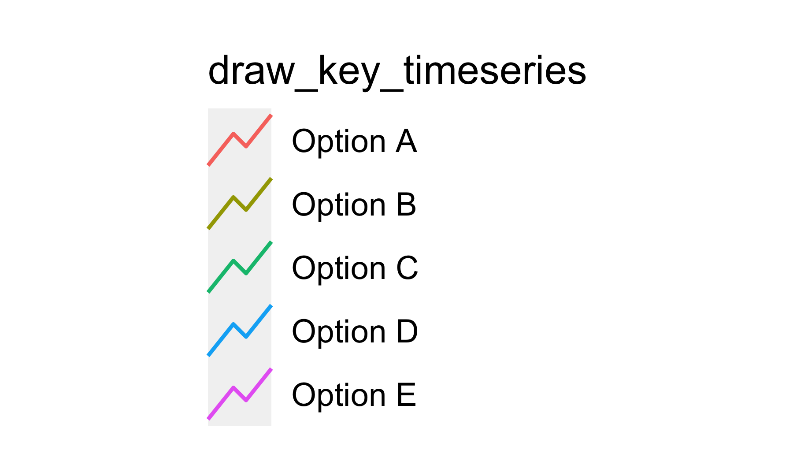
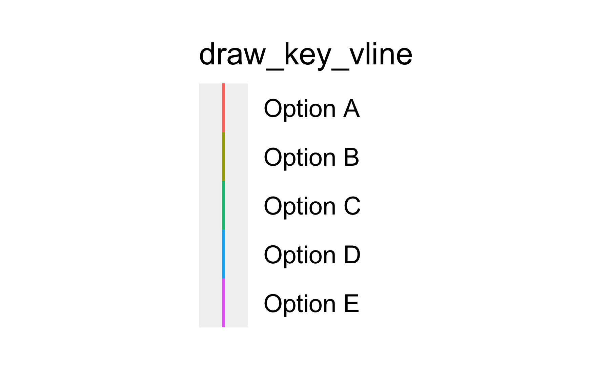
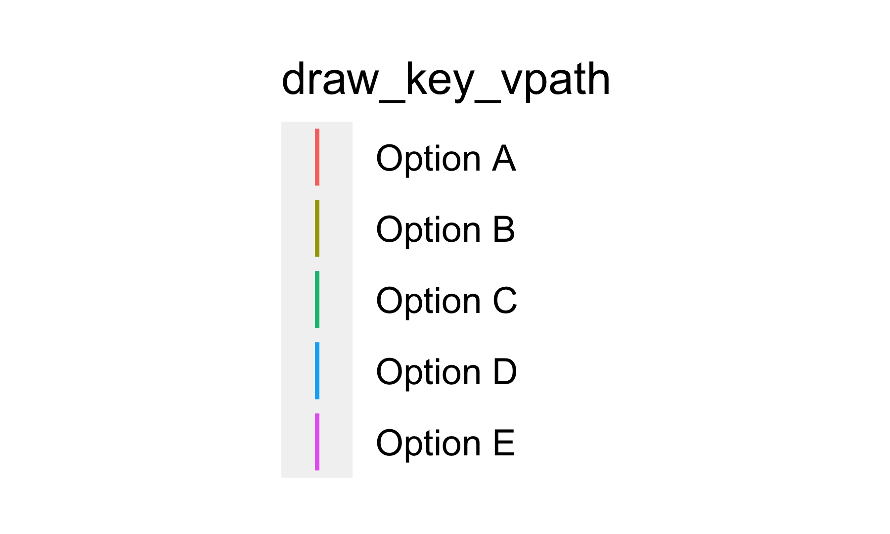

# Custom glyph key

Since the `draw_key_*` function just returns a grob, you can use spend some time and create your own custom glyphs! Taking inspiration from `draw_key_boxplot`


```r
draw_key_boxplot
## function (data, params, size) 
## {
##     grobTree(linesGrob(0.5, c(0.1, 0.25)), linesGrob(0.5, c(0.75, 
##         0.9)), rectGrob(height = 0.5, width = 0.75), linesGrob(c(0.125, 
##         0.875), 0.5), gp = gpar(col = data$colour %||% "grey20", 
##         fill = alpha(data$fill %||% "white", data$alpha), lwd = (data$size %||% 
##             0.5) * .pt, lty = data$linetype %||% 1))
## }
## <bytecode: 0x7fcdd88de808>
## <environment: namespace:ggplot2>
```

will I try to make a glyph by myself using both points and lines.


```r
library(grid)
library(rlang)
draw_key_smile <- function(data, params, size) {
  grobTree(
    pointsGrob(0.25, 0.75, size = unit(.25, "npc"), pch = 16),
    pointsGrob(0.75, 0.75, size = unit(.25, "npc"), pch = 16),
    linesGrob(c(0.9, 0.87, 0.78, 0.65, 0.5, 0.35, 0.22, 0.13, 0.1), 
              c(0.5, 0.35, 0.22, 0.13, 0.1, 0.13, 0.22, 0.35, 0.5)),
    gp = gpar(
      col = data$colour %||% "grey20",
      fill = alpha(data$fill %||% "white", data$alpha),
      lwd = (data$size %||% 0.5) * .pt,
      lty = data$linetype %||% 1
    )
  )
}

ggplot(economics_long, aes(date, value01, colour = variable)) +
  geom_line(key_glyph = draw_key_smile)
```

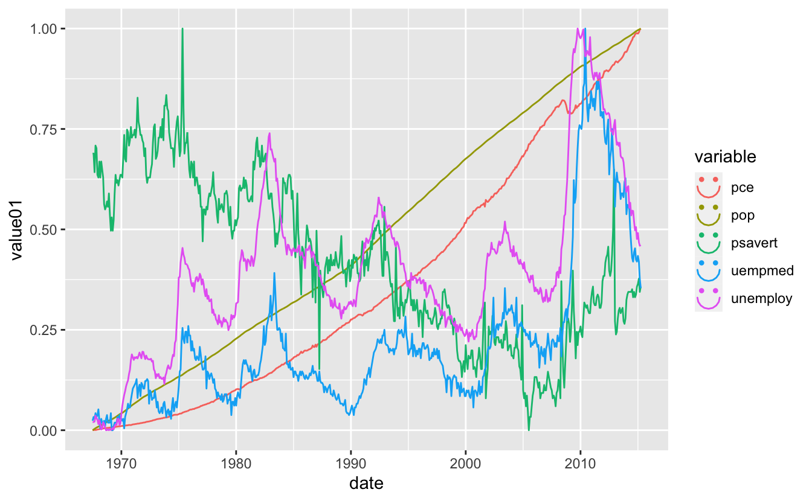

And it looks so happy!

# Appendix


```r
library(dplyr)
library(magrittr)
library(ggplot2)
library(grid)

draws <- ls(getNamespace("ggplot2"), pattern = "^draw_key_")

legend_fun <- function(x) {
  ggg <- economics_long %>%
    mutate(variable = factor(variable, labels = paste("Option", LETTERS[1:5]))) %>%
    ggplot(aes(date, value01, colour = variable)) +
  geom_line(key_glyph = get(x)) +
    labs(color = x) 
  
  legend <- cowplot::get_legend(ggg)
  
  grid.newpage()
  grid.draw(legend)
}

purrr::walk(draws[1:12], legend_fun)
p <- ggplot(mtcars, aes(wt, mpg, label = rownames(mtcars))) + 
  geom_text(aes(colour = factor(ceiling(seq_len(nrow(mtcars)) %% 5), labels = paste("Option", LETTERS[1:5])))) +
  labs(color = "draw_key_text")
legend <- cowplot::get_legend(p)

grid.newpage()
grid.draw(legend)
purrr::walk(draws[14:16], legend_fun)
```

<details closed>
<summary> <span title='Click to Expand'> session information </span> </summary>

```r

─ Session info ───────────────────────────────────────────────────────────────
 setting  value                       
 version  R version 4.1.0 (2021-05-18)
 os       macOS Big Sur 10.16         
 system   x86_64, darwin17.0          
 ui       X11                         
 language (EN)                        
 collate  en_US.UTF-8                 
 ctype    en_US.UTF-8                 
 tz       America/Los_Angeles         
 date     2021-07-15                  

─ Packages ───────────────────────────────────────────────────────────────────
 package     * version date       lib source                           
 assertthat    0.2.1   2019-03-21 [1] CRAN (R 4.1.0)                   
 blogdown      1.3.2   2021-06-09 [1] Github (rstudio/blogdown@00a2090)
 bookdown      0.22    2021-04-22 [1] CRAN (R 4.1.0)                   
 bslib         0.2.5.1 2021-05-18 [1] CRAN (R 4.1.0)                   
 cli           3.0.0   2021-06-30 [1] CRAN (R 4.1.0)                   
 clipr         0.7.1   2020-10-08 [1] CRAN (R 4.1.0)                   
 codetools     0.2-18  2020-11-04 [1] CRAN (R 4.1.0)                   
 colorspace    2.0-2   2021-06-24 [1] CRAN (R 4.1.0)                   
 cowplot       1.1.1   2020-12-30 [1] CRAN (R 4.1.0)                   
 crayon        1.4.1   2021-02-08 [1] CRAN (R 4.1.0)                   
 DBI           1.1.1   2021-01-15 [1] CRAN (R 4.1.0)                   
 desc          1.3.0   2021-03-05 [1] CRAN (R 4.1.0)                   
 details     * 0.2.1   2020-01-12 [1] CRAN (R 4.1.0)                   
 digest        0.6.27  2020-10-24 [1] CRAN (R 4.1.0)                   
 dplyr       * 1.0.7   2021-06-18 [1] CRAN (R 4.1.0)                   
 ellipsis      0.3.2   2021-04-29 [1] CRAN (R 4.1.0)                   
 evaluate      0.14    2019-05-28 [1] CRAN (R 4.1.0)                   
 fansi         0.5.0   2021-05-25 [1] CRAN (R 4.1.0)                   
 farver        2.1.0   2021-02-28 [1] CRAN (R 4.1.0)                   
 generics      0.1.0   2020-10-31 [1] CRAN (R 4.1.0)                   
 ggplot2     * 3.3.5   2021-06-25 [1] CRAN (R 4.1.0)                   
 glue          1.4.2   2020-08-27 [1] CRAN (R 4.1.0)                   
 gtable        0.3.0   2019-03-25 [1] CRAN (R 4.1.0)                   
 highr         0.9     2021-04-16 [1] CRAN (R 4.1.0)                   
 htmltools     0.5.1.1 2021-01-22 [1] CRAN (R 4.1.0)                   
 httr          1.4.2   2020-07-20 [1] CRAN (R 4.1.0)                   
 jquerylib     0.1.4   2021-04-26 [1] CRAN (R 4.1.0)                   
 jsonlite      1.7.2   2020-12-09 [1] CRAN (R 4.1.0)                   
 knitr       * 1.33    2021-04-24 [1] CRAN (R 4.1.0)                   
 labeling      0.4.2   2020-10-20 [1] CRAN (R 4.1.0)                   
 lifecycle     1.0.0   2021-02-15 [1] CRAN (R 4.1.0)                   
 magrittr    * 2.0.1   2020-11-17 [1] CRAN (R 4.1.0)                   
 munsell       0.5.0   2018-06-12 [1] CRAN (R 4.1.0)                   
 pillar        1.6.1   2021-05-16 [1] CRAN (R 4.1.0)                   
 pkgconfig     2.0.3   2019-09-22 [1] CRAN (R 4.1.0)                   
 png           0.1-7   2013-12-03 [1] CRAN (R 4.1.0)                   
 purrr         0.3.4   2020-04-17 [1] CRAN (R 4.1.0)                   
 R6            2.5.0   2020-10-28 [1] CRAN (R 4.1.0)                   
 rlang       * 0.4.11  2021-04-30 [1] CRAN (R 4.1.0)                   
 rmarkdown     2.9     2021-06-15 [1] CRAN (R 4.1.0)                   
 rprojroot     2.0.2   2020-11-15 [1] CRAN (R 4.1.0)                   
 sass          0.4.0   2021-05-12 [1] CRAN (R 4.1.0)                   
 scales        1.1.1   2020-05-11 [1] CRAN (R 4.1.0)                   
 sessioninfo   1.1.1   2018-11-05 [1] CRAN (R 4.1.0)                   
 stringi       1.6.2   2021-05-17 [1] CRAN (R 4.1.0)                   
 stringr       1.4.0   2019-02-10 [1] CRAN (R 4.1.0)                   
 tibble        3.1.2   2021-05-16 [1] CRAN (R 4.1.0)                   
 tidyselect    1.1.1   2021-04-30 [1] CRAN (R 4.1.0)                   
 utf8          1.2.1   2021-03-12 [1] CRAN (R 4.1.0)                   
 vctrs         0.3.8   2021-04-29 [1] CRAN (R 4.1.0)                   
 withr         2.4.2   2021-04-18 [1] CRAN (R 4.1.0)                   
 xfun          0.24    2021-06-15 [1] CRAN (R 4.1.0)                   
 xml2          1.3.2   2020-04-23 [1] CRAN (R 4.1.0)                   
 yaml          2.2.1   2020-02-01 [1] CRAN (R 4.1.0)                   

[1] /Library/Frameworks/R.framework/Versions/4.1/Resources/library

```

</details>
<br>
