I had the idea behind this blog post for a while,
but [tidytuesday](https://github.com/rfordatascience/tidytuesday/blob/main/data/2025/2025-04-01/readme.md) was doing Pokemon data this week I had to do it.
I have been thinking about [Feature Engineering](https://feaz-book.com/) for a while now,
and the idea of using data about something I like and know about seems like a perfect match.

The general idea in this post is to apply different transformations to the data and see how reveals structure and similarity in the data.
Since we don't have a specific target in mind,
I will be using [UMAP](https://umap-learn.readthedocs.io/en/latest/) on the different data sets.
Then we can look at the placements to see if we can recognize what happened in the transformation. 

::: {.callout-note}
I'm fully aware of the pros and cons of using UMAP.
This is a toy example and you will find that it serves its purpose fine for this post.
:::

For ease of visualization, I will only be using Generation 1 (first 151) Pokemon.
Partly to avoid overplotting and because those are the most well-known Pokemon for the readers.

## Packages and data

We load tidyverse for wrangling and plotting, ggimage to add pokemon as sprites, recipes, and embed to perform feature engineering including UMAP, pokemon for the data sources, fs for file system operations since I will be working with some images as well, patchwork to combine some charts, png to read png files.


::: {.cell}

```{.r .cell-code}
library(tidyverse)
library(ggimage)
library(recipes)
library(embed)
library(pokemon)
library(fs)
library(patchwork)
library(png)
```
:::


Then we filter the data down to only include generation 1,
The `generation_id` column comes in handy for this.


::: {.cell}

```{.r .cell-code}
pokemon <- pokemon |>
  filter(generation_id == 1)
glimpse(pokemon)
```

::: {.cell-output .cell-output-stdout}

```
Rows: 151
Columns: 22
$ id              <dbl> 1, 2, 3, 4, 5, 6, 7, 8, 9, 10, 11, 12, 13, 14, 15, 16,…
$ pokemon         <chr> "bulbasaur", "ivysaur", "venusaur", "charmander", "cha…
$ species_id      <dbl> 1, 2, 3, 4, 5, 6, 7, 8, 9, 10, 11, 12, 13, 14, 15, 16,…
$ height          <dbl> 0.7, 1.0, 2.0, 0.6, 1.1, 1.7, 0.5, 1.0, 1.6, 0.3, 0.7,…
$ weight          <dbl> 6.9, 13.0, 100.0, 8.5, 19.0, 90.5, 9.0, 22.5, 85.5, 2.…
$ base_experience <dbl> 64, 142, 236, 62, 142, 240, 63, 142, 239, 39, 72, 178,…
$ type_1          <chr> "grass", "grass", "grass", "fire", "fire", "fire", "wa…
$ type_2          <chr> "poison", "poison", "poison", NA, NA, "flying", NA, NA…
$ hp              <dbl> 45, 60, 80, 39, 58, 78, 44, 59, 79, 45, 50, 60, 40, 45…
$ attack          <dbl> 49, 62, 82, 52, 64, 84, 48, 63, 83, 30, 20, 45, 35, 25…
$ defense         <dbl> 49, 63, 83, 43, 58, 78, 65, 80, 100, 35, 55, 50, 30, 5…
$ special_attack  <dbl> 65, 80, 100, 60, 80, 109, 50, 65, 85, 20, 25, 90, 20, …
$ special_defense <dbl> 65, 80, 100, 50, 65, 85, 64, 80, 105, 20, 25, 80, 20, …
$ speed           <dbl> 45, 60, 80, 65, 80, 100, 43, 58, 78, 45, 30, 70, 50, 3…
$ color_1         <chr> "#78C850", "#78C850", "#78C850", "#F08030", "#F08030",…
$ color_2         <chr> "#A040A0", "#A040A0", "#A040A0", NA, NA, "#A890F0", NA…
$ color_f         <chr> "#81A763", "#81A763", "#81A763", NA, NA, "#DE835E", NA…
$ egg_group_1     <chr> "monster", "monster", "monster", "monster", "monster",…
$ egg_group_2     <chr> "plant", "plant", "plant", "dragon", "dragon", "dragon…
$ url_icon        <chr> "//archives.bulbagarden.net/media/upload/7/7b/001MS6.p…
$ generation_id   <dbl> 1, 1, 1, 1, 1, 1, 1, 1, 1, 1, 1, 1, 1, 1, 1, 1, 1, 1, …
$ url_image       <chr> "https://raw.githubusercontent.com/HybridShivam/Pokemo…
```


:::
:::


To make the visualizations easy to read I'm going to be using small sprites or each Pokemon as their plotting.
I'll download them for easy use using the below code.


::: {.cell}

```{.r .cell-code}
sprites_urls <- paste0("https:", pokemon$url_icon)

sprites_path <- fs::path(
  "sprites", 
 pokemon$pokemon, 
 ext = "png"
)
```
:::

::: {.cell}

```{.r .cell-code}
walk2(sprites_urls, sprites_path, slowly(download.file))
```
:::


Then we create a tibble of all the sprites we just downloaded with matching names.


::: {.cell}

```{.r .cell-code}
sprites_tbl <- tibble(
 pokemon = pokemon$pokemon,
 sprite = sprites_path
)
sprites_tbl
```

::: {.cell-output .cell-output-stdout}

```
# A tibble: 151 × 2
   pokemon    sprite                
   <chr>      <fs::path>            
 1 bulbasaur  sprites/bulbasaur.png 
 2 ivysaur    sprites/ivysaur.png   
 3 venusaur   sprites/venusaur.png  
 4 charmander sprites/charmander.png
 5 charmeleon sprites/charmeleon.png
 6 charizard  sprites/charizard.png 
 7 squirtle   sprites/squirtle.png  
 8 wartortle  sprites/wartortle.png 
 9 blastoise  sprites/blastoise.png 
10 caterpie   sprites/caterpie.png  
# ℹ 141 more rows
```


:::
:::


Now we are ready to get to plotting.

## Random - how to plot Pokemon sprites

I'm using the ggimage package to add the Pokemon as sprites.
With this, we can use `geom_image()` which takes an aesthetic `image` which should be a path to an image.
Lastly, we need to change the `size` used in `geom_image()` as the default is way too large for what we are trying to do.


::: {.cell}

```{.r .cell-code}
set.seed(1234)

sprites_tbl |>
  mutate(
 x = rnorm(151),
 y = rnorm(151),
 ) |>
  ggplot(aes(x, y)) + 
  geom_image(aes(image = sprite), size = .1)
```

::: {.cell-output-display}
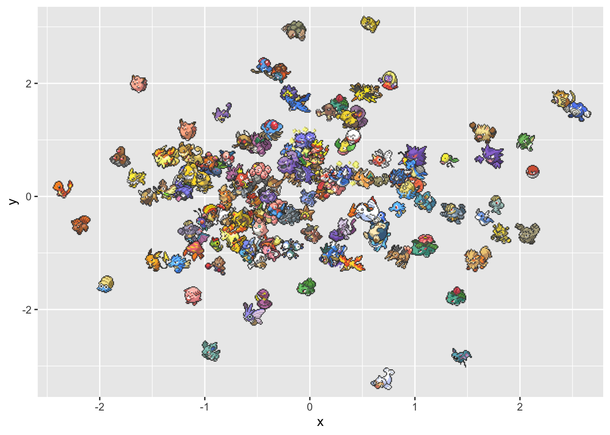{width=672}
:::
:::


Since the axes won't have any meaning because we are using UMAP,
We will be using `theme_void()` to remove everything,
along wit `theme()` and `labs()` to add a simple title.


::: {.cell}

```{.r .cell-code}
set.seed(1234)
sprites_tbl |>
  mutate(
 x = rnorm(151),
 y = rnorm(151),
 ) |>
  ggplot(aes(x, y)) + 
  geom_image(aes(image = sprite), size = .1) +
  theme_void() +
  theme(plot.title = element_text(hjust = 0.5)) +
  labs(title = "Random Position")
```

::: {.cell-output-display}
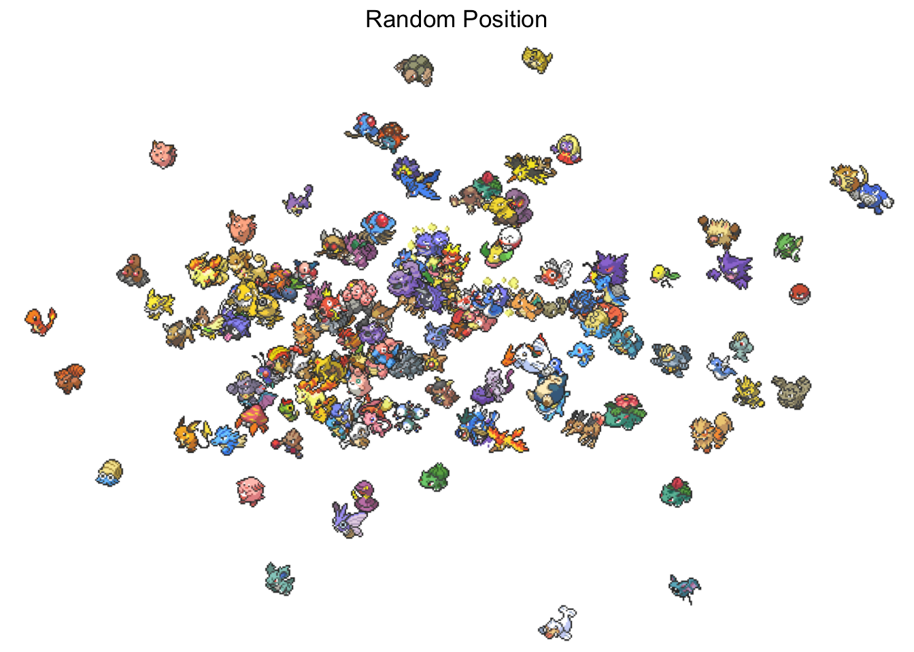{width=672}
:::
:::


The only difference moving forward will be the data we pass in,
so I'll create a little helper function to do our plotting.
Using `aes(UMAP1, UMAP2)` instead of `aes(x, y)` since I know that is the name that will come out of recipes by default.


::: {.cell}

```{.r .cell-code}
pokemon_umap_plot <- function(data, title) {
 data |>
    ggplot(aes(UMAP1, UMAP2)) + 
    geom_image(aes(image = sprite), size = .1) +
    theme_void() +
    theme(plot.title = element_text(hjust = 0.5)) +
    labs(title = title)
}
```
:::


## Stats

First, we will see what happens when we just look at the 6 main [stats](https://bulbapedia.bulbagarden.net/wiki/Stat#List_of_stats).


::: {.cell}

```{.r .cell-code  code-fold="true"}
set.seed(1)
pokemon |>
  select(pokemon, hp:speed) |>
  recipe() |>
  step_umap(all_numeric()) |>
  prep() |>
  bake(NULL) |>
  left_join(sprites_tbl, by = join_by(pokemon)) |>
  pokemon_umap_plot("Stats")
```

::: {.cell-output-display}
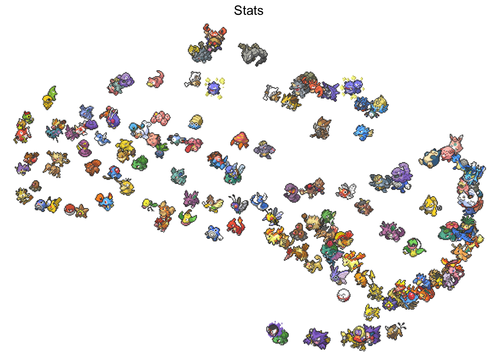{width=672}
:::
:::


Remember that UMAP mostly cares about local distances.
So left-right up-down doesn't mean much,
instead, we look at if neighboring Pokemon have similar data which for this plot is stats.

We can verify this by seeing that all legendary Pokemon, [Articuno](https://bulbapedia.bulbagarden.net/wiki/Articuno_(Pok%C3%A9mon)), [Zapdos](https://bulbapedia.bulbagarden.net/wiki/Zapdos_(Pok%C3%A9mon)), [Moltres](https://bulbapedia.bulbagarden.net/wiki/Moltres_(Pok%C3%A9mon)), and [Mewtwo](https://bulbapedia.bulbagarden.net/wiki/Mewtwo_(Pok%C3%A9mon)) are hanging out on the right side near a lot high stated pokemon. 
And the left-hand side appears to have some low stated Pokemon with [Weedle](https://bulbapedia.bulbagarden.net/wiki/Weedle_(Pok%C3%A9mon)), [Caterpie](https://bulbapedia.bulbagarden.net/wiki/Caterpie_(Pok%C3%A9mon)), and [Magikarp](https://bulbapedia.bulbagarden.net/wiki/Magikarp_(Pok%C3%A9mon)).

## Stats - normalized

Before we use the stats by themselves,
let us see if something happens if we normalize them.
Normalizing here is specifically meant as a part of the total stat distribution. 
This should hopefully mean that a Pokemon that is very fast would be near other fast Pokemon, regardless of whether its total stats are high or low.


::: {.cell}

```{.r .cell-code  code-fold="true"}
set.seed(1)
pokemon |>
  select(pokemon, hp:speed) |>
   mutate(total = rowSums(across(where(is.numeric)))) |>
  mutate(across(hp:speed, \(x) x / total)) |>
  select(-total) |>
  recipe() |>
  step_umap(all_numeric()) |>
  prep() |>
  bake(NULL) |>
  left_join(sprites_tbl, by = join_by(pokemon)) |>
  pokemon_umap_plot("Stats normalized by total")
```

::: {.cell-output-display}
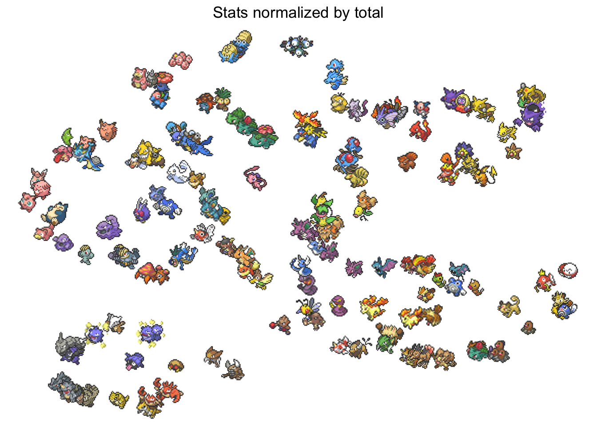{width=672}
:::
:::


The main difference I see is that Pokemon from their evolutionary family stay together.
[Krabby](https://bulbapedia.bulbagarden.net/wiki/Krabby_(Pok%C3%A9mon)) and [Kingler](https://bulbapedia.bulbagarden.net/wiki/Kingler_(Pok%C3%A9mon)), [Ponyta](https://bulbapedia.bulbagarden.net/wiki/Ponyta_(Pok%C3%A9mon)) and [Rapidash](https://bulbapedia.bulbagarden.net/wiki/Rapidash_(Pok%C3%A9mon)), [Omanyte](https://bulbapedia.bulbagarden.net/wiki/Omanyte_(Pok%C3%A9mon)) and [Omastar](https://bulbapedia.bulbagarden.net/wiki/Omastar_(Pok%C3%A9mon)).
This feels right as you would expect many Pokemon to preserve their stat spread when evolving.

## Moves

I went ahead a [scraped](scrape.R) from [The RESTful Pokémon API](https://pokeapi.co/) some more data than what came in the package.
I wanted to look at their moves and see what happens with them.
The data set contains one row for each Pokemon and one column for each move. 
A 1 indicates whether the Pokemon can learn that move.


::: {.cell}

```{.r .cell-code}
moves <- read_csv(
  "moves.csv", 
 show_col_types = FALSE
)

moves
```

::: {.cell-output .cell-output-stdout}

```
# A tibble: 151 × 593
   name  razor_wind swords_dance   cut  bind vine_whip headbutt tackle body_slam
   <chr>      <dbl>        <dbl> <dbl> <dbl>     <dbl>    <dbl>  <dbl>     <dbl>
 1 bulb…          1            1     1     1         1        1      1         1
 2 cate…          0            0     0     0         0        0      1         0
 3 volt…          0            0     0     0         0        1      1         0
 4 elec…          0            0     0     0         0        1      1         0
 5 exeg…          0            1     0     0         0        1      0         0
 6 exeg…          0            1     0     0         0        1      0         1
 7 cubo…          0            1     0     0         0        1      0         1
 8 maro…          0            1     0     0         0        1      0         1
 9 hitm…          0            1     0     0         0        1      1         1
10 hitm…          0            1     0     0         0        1      1         1
# ℹ 141 more rows
# ℹ 584 more variables: take_down <dbl>, double_edge <dbl>, growl <dbl>,
#   strength <dbl>, mega_drain <dbl>, leech_seed <dbl>, growth <dbl>,
#   razor_leaf <dbl>, solar_beam <dbl>, poison_powder <dbl>,
#   sleep_powder <dbl>, petal_dance <dbl>, string_shot <dbl>, toxic <dbl>,
#   rage <dbl>, mimic <dbl>, double_team <dbl>, defense_curl <dbl>,
#   light_screen <dbl>, reflect <dbl>, bide <dbl>, sludge <dbl>, …
```


:::
:::


We use the same UMAP on these predictors now.


::: {.cell}

```{.r .cell-code  code-fold="true"}
set.seed(1)
moves |>
  recipe() |>
  step_umap(all_numeric()) |>
  prep() |>
  bake(NULL) |>
  left_join(sprites_tbl, by = c("name" = "pokemon")) |>
  pokemon_umap_plot("Moves")
```

::: {.cell-output-display}
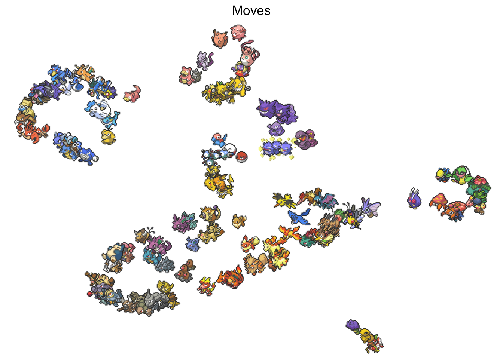{width=672}
:::
:::


And it appears that it is working as intended.
We again see evolution likes close to each other which makes sense,
we also see a little bit of a color clustering which could be explained a little by the fact that a lot of Pokemon of the same types have similar colors.
The last thing I wanted to point out is that it perfectly captures the Pokemon that doens't learn many moves including; [Ditto](https://bulbapedia.bulbagarden.net/wiki/Ditto_(Pok%C3%A9mon)), [Kakuna](https://bulbapedia.bulbagarden.net/wiki/Kakuna_(Pok%C3%A9mon)), and [Magikarp](https://bulbapedia.bulbagarden.net/wiki/Magikarp_(Pok%C3%A9mon)).

## Moves types

Each move has metadata associated with it. 
Let's see what we can pull out of this.


::: {.cell}

```{.r .cell-code}
moves_meta <- read_csv(
  "moves-meta.csv", 
 show_col_types = FALSE
)

moves_meta
```

::: {.cell-output .cell-output-stdout}

```
# A tibble: 592 × 4
   moves        type   priority category      
   <chr>        <chr>     <dbl> <chr>         
 1 razor_wind   normal        0 damage        
 2 swords_dance normal        0 net-good-stats
 3 cut          normal        0 damage        
 4 bind         normal        0 damage+ailment
 5 vine_whip    grass         0 damage        
 6 headbutt     normal        0 damage        
 7 tackle       normal        0 damage        
 8 body_slam    normal        0 damage+ailment
 9 take_down    normal        0 damage        
10 double_edge  normal        0 damage        
# ℹ 582 more rows
```


:::
:::


We look at how many of each type a Pokemon can learn.
E.i. how many grass type moves does it learn, how many fire time moves does it learn, etc etc.


::: {.cell}

```{.r .cell-code}
set.seed(5)
moves |>
  pivot_longer(cols = -name, names_to = "moves") |>
  filter(value == 1) |>
  left_join(moves_meta, by = join_by(moves)) |>
  count(name, type) |>
  pivot_wider(names_from = type, values_from = n, values_fill = 0) |>
  recipe() |>
  step_umap(all_numeric()) |>
  prep() |>
  bake(NULL) |>
  left_join(sprites_tbl, by = c("name" = "pokemon")) |>
  pokemon_umap_plot("Number of Moves by Type")
```

::: {.cell-output-display}
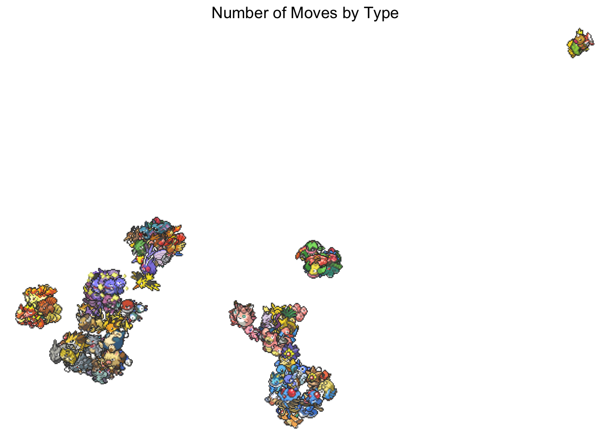{width=672}
:::
:::


This one is very skewed by the handful of Pokemon that don't know any moves.

## Move types normalized

We do the same normalization we talked about earlier.


::: {.cell}

```{.r .cell-code  code-fold="true"}
set.seed(2)
moves |>
  pivot_longer(cols = -name, names_to = "moves") |>
  filter(value == 1) |>
  left_join(moves_meta, by = join_by(moves)) |>
  count(name, type) |>
  pivot_wider(names_from = type, values_from = n, values_fill = 0) |>
  mutate(total = rowSums(across(where(is.numeric)))) |>
  mutate(across(where(is.numeric), \(x) x / total)) |>
  select(-total) |>
  recipe() |>
  step_umap(all_numeric()) |>
  prep() |>
  bake(NULL) |>
  left_join(sprites_tbl, by = c("name" = "pokemon")) |>
  pokemon_umap_plot("Number of Moves by Type - Normalized")
```

::: {.cell-output-display}
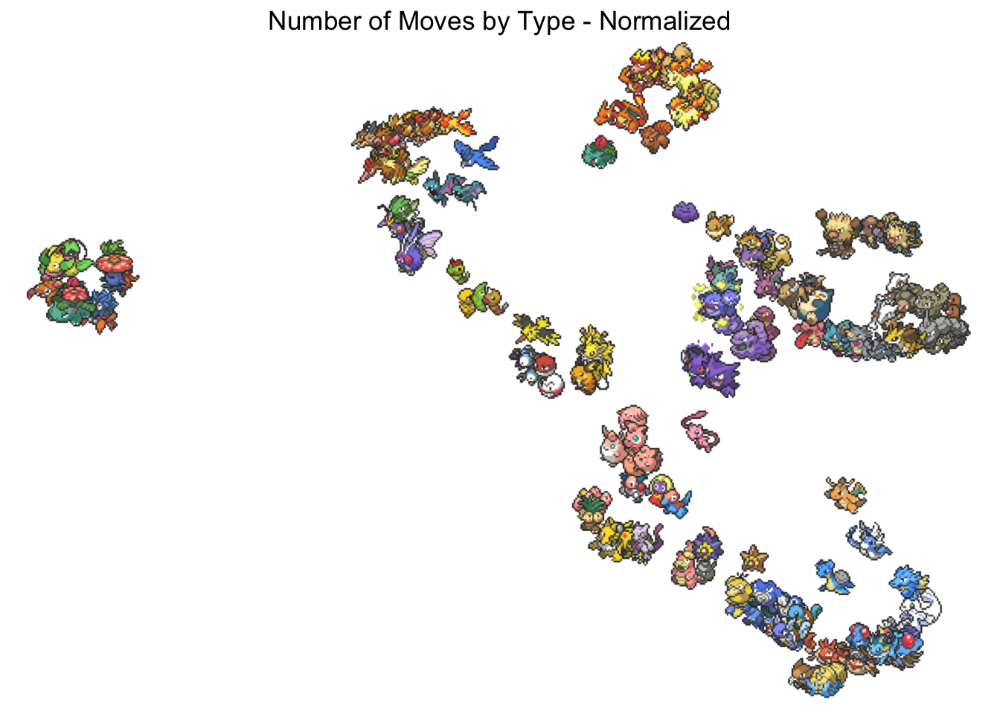{width=672}
:::
:::


There might be a bit more separation.
One thing to point out here is that it looks very similar to the moves embedding, 
but this is done on 18 columns (1 for each type) which is a lot less than moves alone which contains 592 columns.

## Move Category

I extracted a category field as well.
This one lets us see what type of move it is in broad categories.


::: {.cell}

```{.r .cell-code}
moves_meta |>
  count(category)
```

::: {.cell-output .cell-output-stdout}

```
# A tibble: 15 × 2
   category               n
   <chr>              <int>
 1 ailment               29
 2 damage               245
 3 damage+ailment        62
 4 damage+heal            7
 5 damage+lower          39
 6 damage+raise          16
 7 field-effect          12
 8 force-switch           2
 9 heal                  10
10 net-good-stats        52
11 ohko                   4
12 swagger                2
13 unique                79
14 whole-field-effect    15
15 <NA>                  18
```


:::
:::


We will use it the same as before.


::: {.cell}

```{.r .cell-code  code-fold="true"}
set.seed(5)
moves |>
  pivot_longer(cols = -name, names_to = "moves") |>
  filter(value == 1) |>
  left_join(moves_meta, by = join_by(moves)) |>
  count(name, category) |>
  pivot_wider(names_from = category, values_from = n, values_fill = 0) |>
  recipe() |>
  step_umap(all_numeric()) |>
  prep() |>
  bake(NULL) |>
  left_join(sprites_tbl, by = c("name" = "pokemon")) |>
  pokemon_umap_plot("Number of Moves by Category")
```

::: {.cell-output-display}
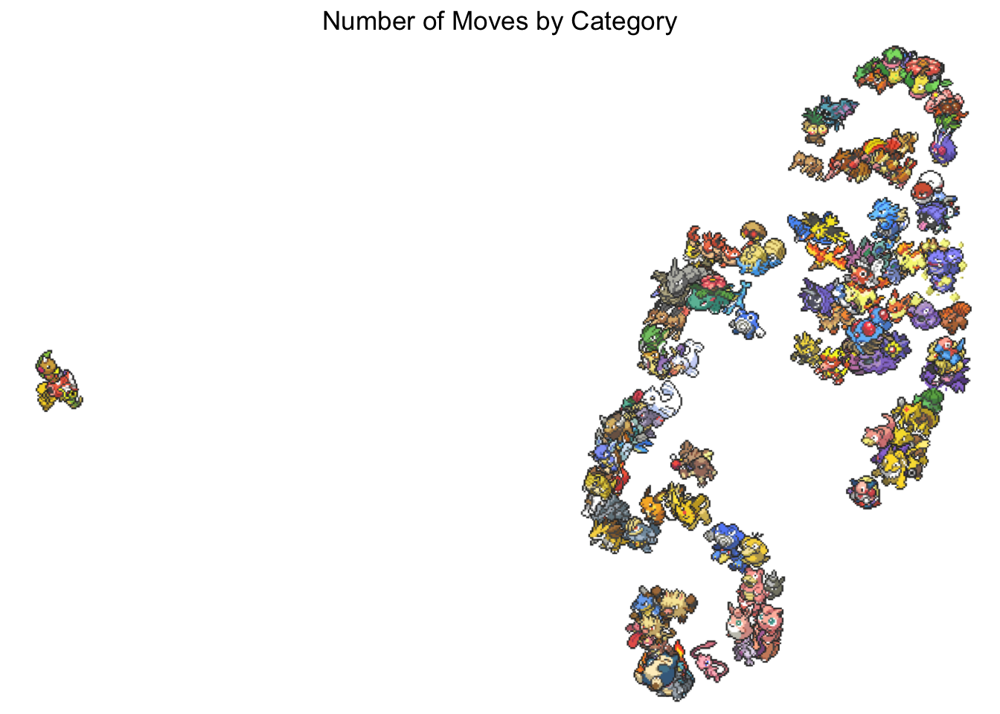{width=672}
:::
:::


I find this one harder to analyze,
I'm not able to many trends in this data set beyond our useless friends.

## Move Category normalized

If we normalize the above we get the following.


::: {.cell}

```{.r .cell-code  code-fold="true"}
set.seed(5)
moves |>
  pivot_longer(cols = -name, names_to = "moves") |>
  filter(value == 1) |>
  left_join(moves_meta, by = join_by(moves)) |>
  count(name, category) |>
  pivot_wider(names_from = category, values_from = n, values_fill = 0) |>
  mutate(total = rowSums(across(where(is.numeric)))) |>
  mutate(across(where(is.numeric), \(x) x / total)) |>
  select(-total) |>
  recipe() |>
  step_umap(all_numeric()) |>
  prep() |>
  bake(NULL) |>
  left_join(sprites_tbl, by = c("name" = "pokemon")) |>
  pokemon_umap_plot("Number of Moves by Category - normalized")
```

::: {.cell-output-display}
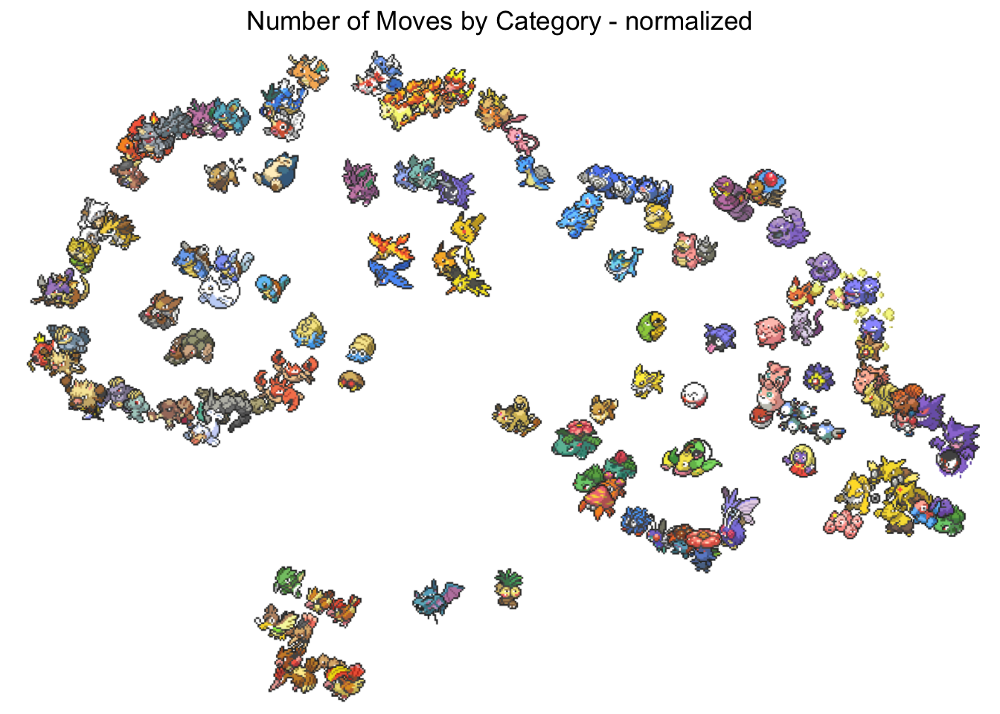{width=672}
:::
:::


What I like about this one is that you see Pokemon from the same evolution lines near each other.
As well as the legendary birds together in the middle.

## Sprites

Lastly, let's see what we can do with the sprites.
This will be a very rough approach.
I'm going to count the number of colors for each pixel in the images from the `Pokemon` data set and use those counts as the input to UMAP.

Below is the code used to download the images.


::: {.cell}

```{.r .cell-code}
image_urls <- pokemon$url_image

image_path <- fs::path(
  "images", 
 pokemon$pokemon, 
 ext = "png"
)
```
:::

::: {.cell}

```{.r .cell-code}
walk2(image_urls, image_path, slowly(download.file))
```
:::


I wrote a little helper function to get pixel color counts.


::: {.cell}

```{.r .cell-code}
count_colors <- function(path, name) {
 png <- readPNG(path)
 color <- rgb(png[,,1], png[,,2], png[,,3])
 res <- tibble(color) |>
    count(color)
    
  bind_cols(
 name = name,
 res
 )
} 
```
:::


Now we are ready to use the data.


::: {.cell}

```{.r .cell-code  code-fold="true"}
set.seed(1)
map2(
 image_path, 
 pokemon$pokemon, 
 count_colors
) |>
  list_rbind() |>
  filter(color != "#000000") |>
  pivot_wider(names_from = color, values_from = n, values_fill = 0) |>
  recipe() |>
  step_umap(all_numeric()) |>
  prep() |>
  bake(NULL) |>
  left_join(sprites_tbl, by = c("name" = "pokemon")) |>
  pokemon_umap_plot("Number of Moves by Type")
```

::: {.cell-output-display}
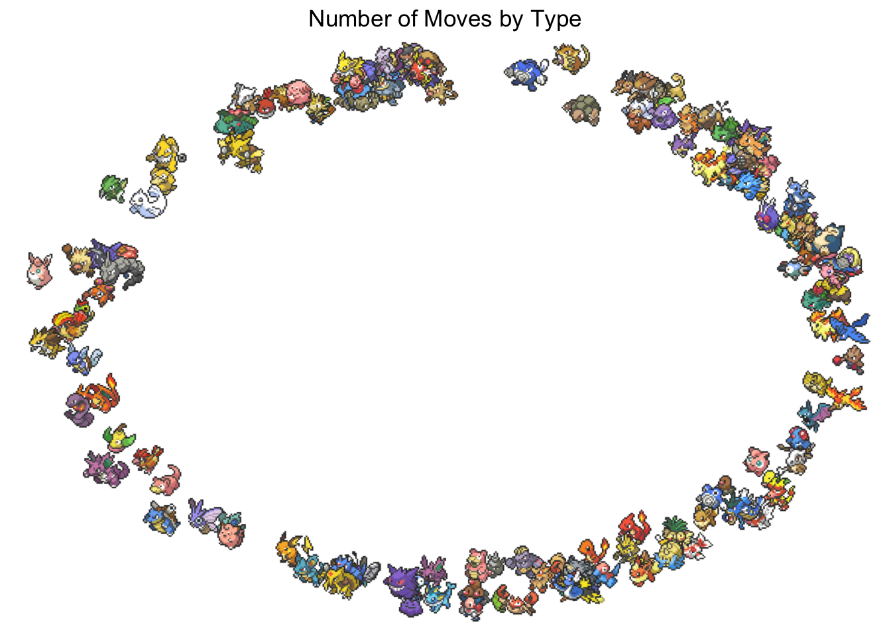{width=672}
:::
:::


What we see right away is that something didn't work right.
A likely explanation is that the precise colors were too specific, 
and we thus didn't see enough overlap between the Pokemon for UMAP to pick up on.

Let's try to round the colors a bit after there are 16,777,216 (`16 ^ 6`) colors. Lets instead round them,
so instead of using two hex values per color, we just use the more important one.
This will leave us with 4096 (`16 * 16 * 16`) colors.


::: {.cell}

```{.r .cell-code  code-fold="true"}
set.seed(1)
map2(
 image_path, 
 pokemon$pokemon, 
 count_colors) |>
  list_rbind() |>
  mutate(color = paste0(
    str_sub(color, 1, 2), 
    str_sub(color, 3, 3),
    str_sub(color, 5, 5)
 )
 ) |>
    mutate(color = str_replace_all(
 color, 
      c(
        "0" = "0", 
        "1" = "0",
        "2" = "0",
        "3" = "0",
        "4" = "1", 
        "5" = "1",
        "6" = "1",
        "7" = "1",
        "8" = "2", 
        "9" = "2",
        "A" = "2",
        "B" = "2",
        "C" = "3", 
        "D" = "3",
        "E" = "3",
        "F" = "3"
 )
 )
 ) |>
  count(name, color, wt = n) |>
  filter(color != "#000") |>
  pivot_wider(names_from = color, values_from = n, values_fill = 0) |>
  recipe() |>
  step_umap(all_numeric()) |>
  prep() |>
  bake(NULL) |>
  left_join(sprites_tbl, by = c("name" = "pokemon")) |>
  pokemon_umap_plot("Number of Moves by Type")
```

::: {.cell-output-display}
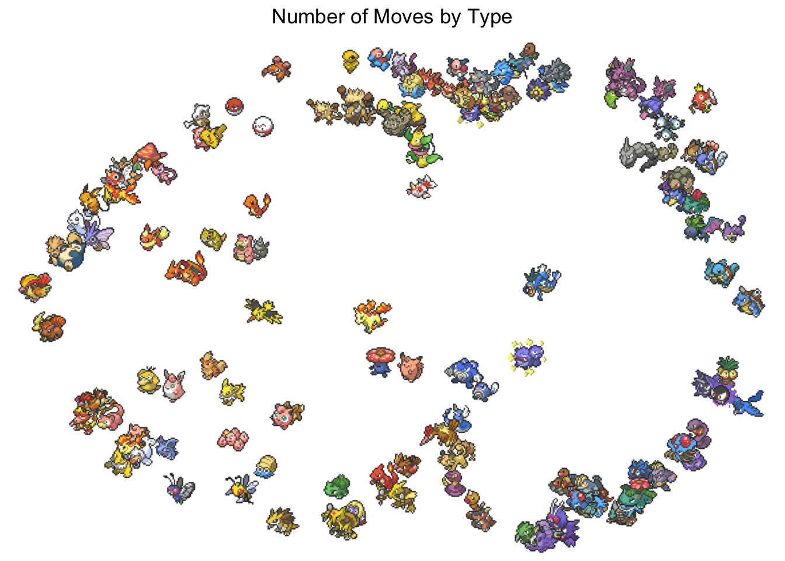{width=672}
:::
:::


The results are better as there now is a color separation between the Pokemon.
Let's see what would happen if we discretize the colors even more. 
Below each color channel (red, green, blue) is made to only contain 4 different values,
leaving us with 64 unique colors to be counted.


::: {.cell}

```{.r .cell-code  code-fold="true"}
set.seed(1)
map2(
 image_path, 
 pokemon$pokemon, 
 count_colors) |>
  list_rbind() |>
  mutate(color = paste0(
    str_sub(color, 1, 2), 
    str_sub(color, 3, 3),
    str_sub(color, 5, 5)
 )
 ) |>
    mutate(color = str_replace_all(
 color, 
      c(
        "0" = "0", 
        "1" = "0",
        "2" = "0",
        "3" = "0",
        "4" = "1", 
        "5" = "1",
        "6" = "1",
        "7" = "1",
        "8" = "2", 
        "9" = "2",
        "A" = "2",
        "B" = "2",
        "C" = "3", 
        "D" = "3",
        "E" = "3",
        "F" = "3"
 )
 )
 ) |>
  count(name, color, wt = n) |>
  filter(color != "#000") |>
  pivot_wider(names_from = color, values_from = n, values_fill = 0) |>
    mutate(total = rowSums(across(where(is.numeric)))) |>
  mutate(across(where(is.numeric), \(x) x / total)) |>
  select(-total) |>
  recipe() |>
  step_umap(all_numeric()) |>
  prep() |>
  bake(NULL) |>
  left_join(sprites_tbl, by = c("name" = "pokemon")) |>
  pokemon_umap_plot("Number of Moves by Type")
```

::: {.cell-output-display}
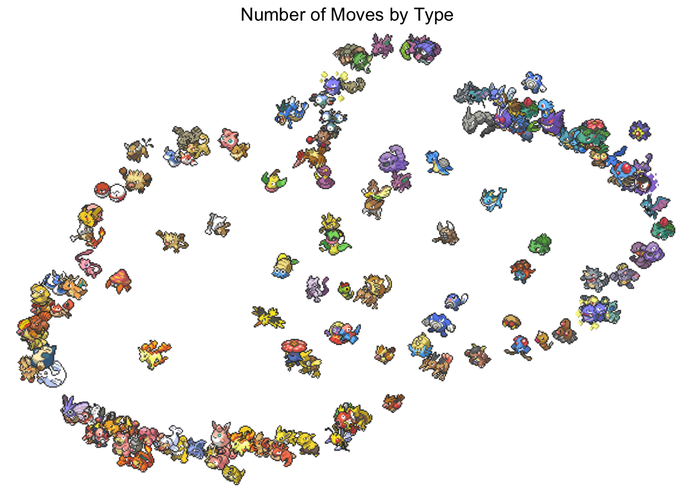{width=672}
:::
:::


This worked pretty well considering how limited RGB color space is for these types of analysis.

## Further ideas

In no particular order

- co-occurrence in moves
- Resistances
- Body style, exp rates, potential (what they can be envolve into)
- types
    - Full resistances
    - combinations
- text embedding
- image embeddings
    - so many things to do here
    - actual embeddings
    - different color spaces
- what types can this Pokemon hit with the moves it can learn
    - can it hit or not for each type
    - how many moves can hit count vs percentage
    - highest dmg value for the attack that hits each type

## Other similar work

- https://gibsramen.github.io/gUMAP/docs/pokemon.html
- https://minimaxir.com/2024/06/pokemon-embeddings/