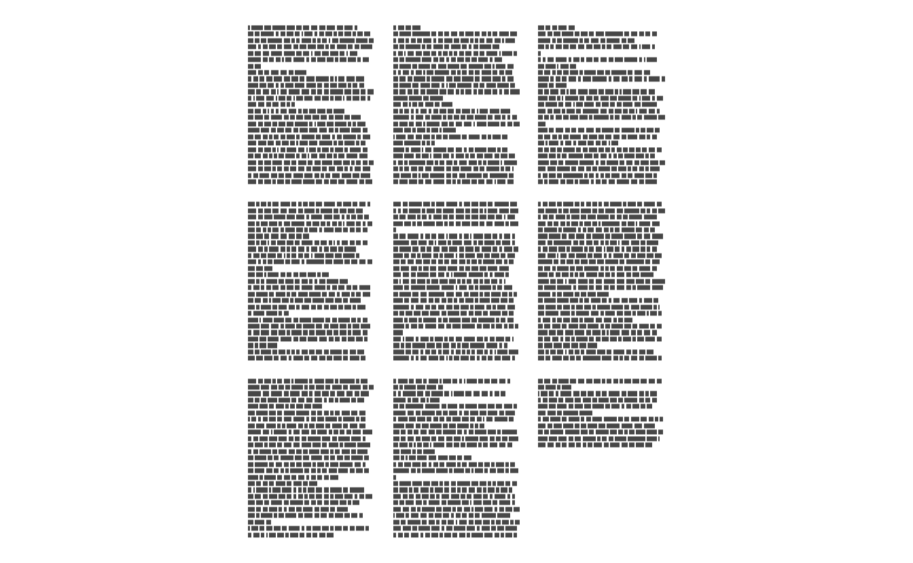
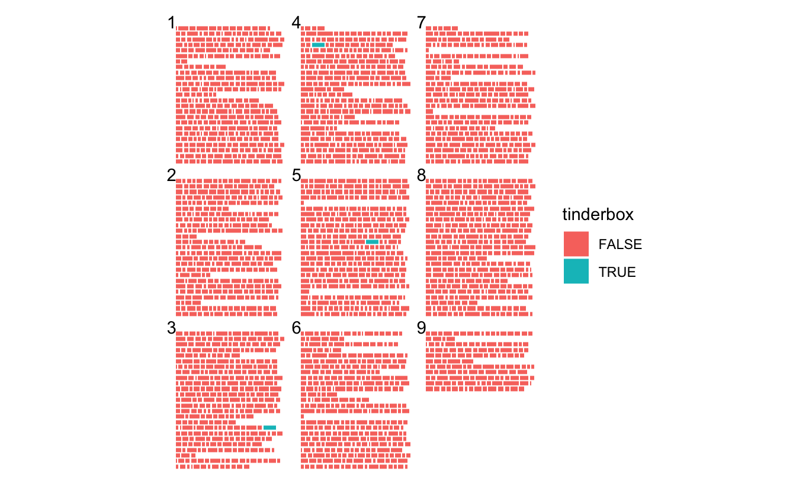
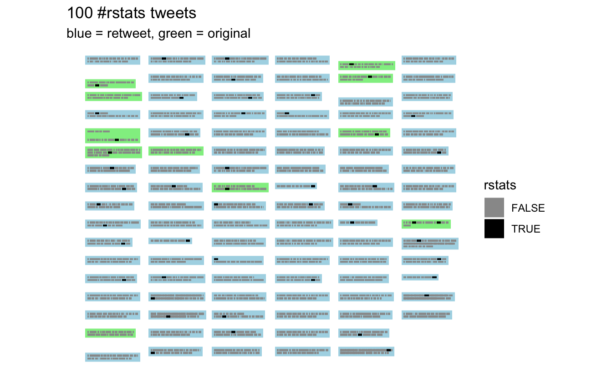
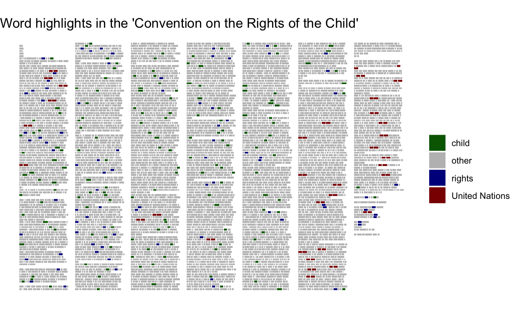

::: {.callout-note}
This code has been lightly revised to make sure it works as of 2018-12-16.
:::

## ggpage version 0.2.0

In this post I will highlight a couple of the new features in the new update of my package [ggpage](https://github.com/EmilHvitfeldt/ggpage).  

first we load the packages we need, which is `tidyverse` for general tidy tools, `ggpage` for visualization and finally `rtweet` and `rvest` for data collection.


```r
library(tidyverse)
library(ggpage)
library(rtweet)
library(rvest)
```

## The basics

The packages includes 2 main functions, `ggpage_build` and `ggpage_plot` that will transform the data in the right way and plot it respectively. The reason for the split of the functions is to allow additional transformations to be done on the tokenized data to be used in the plotting.  

The package includes a example data set of the text Tinderbox by H.C. Andersen


```r
tinderbox %>%
  head()
## # A tibble: 6 x 2
##   text                                                              book        
##   <chr>                                                             <chr>       
## 1 "A soldier came marching along the high road: \"Left, right - le… The tinder-…
## 2 "had his knapsack on his back, and a sword at his side; he had b… The tinder-…
## 3 "and was now returning home. As he walked on, he met a very frig… The tinder-…
## 4 "witch in the road. Her under-lip hung quite down on her breast,… The tinder-…
## 5 "and said, \"Good evening, soldier; you have a very fine sword, … The tinder-…
## 6 "knapsack, and you are a real soldier; so you shall have as much… The tinder-…
```

This data set can be used directly with `ggpage_build` and `ggpage_plot`. 


```r
ggpage_build(tinderbox) %>%
  ggpage_plot()
```



`ggpage_build` expects the column containing the text to be named "text" which it is in the tinderbox object. This visualization gets exiting when you start combining it with the other tools. We can show where the word "tinderbox" appears along with adding some page numbers.


```r
ggpage_build(tinderbox) %>%
  mutate(tinderbox = word == "tinderbox") %>%
  ggpage_plot(mapping = aes(fill = tinderbox), page.number = "top-left")
```



And we see that the word tinderbox only appear 3 times in the middle of the story.

## Vizualizing tweets

We can also use this to showcase a number of tweets. For this we will use the `rtweet` package. We will load in 100 tweets that contain the hash tag #rstats.


```r
## whatever name you assigned to your created app
appname <- "********"

## api key (example below is not a real key)
key <- "**********"

## api secret (example below is not a real key)
secret <- "********"

## create token named "twitter_token"
twitter_token <- create_token(
  app = appname,
  consumer_key = key,
  consumer_secret = secret)
```


```r
rstats_tweets <- rtweet::search_tweets("#rstats") %>%
  mutate(status_id = as.numeric(as.factor(status_id)))
```


Since each tweet is too long by itself will we use the `nest_paragraphs` function to wrap the texts within each tweet. By passing the tweet id to `page.col` we will make it such that we have a tweet per page. Additionally we can indicate both whether the tweet is a retweet by coloring the paper blue if it is and green if it isn't. Lastly we highlight where "rstats" is used.


```r
rstats_tweets %>%
  select(status_id, text) %>%
  nest_paragraphs(text) %>%
  ggpage_build(page.col = "status_id", lpp = 4, ncol = 6) %>%
  mutate(rstats = word == "rstats") %>%
  ggpage_plot(mapping = aes(fill = rstats), paper.show = TRUE, 
              paper.color = ifelse(rstats_tweets$is_retweet, "lightblue", "lightgreen")) +
  scale_fill_manual(values = c("grey60", "black")) +
  labs(title = "100 #rstats tweets",
       subtitle = "blue = retweet, green = original")
```



## Vizualizing documents

Next we will look at the [Convention on the Rights of the Child](http://www.ohchr.org/EN/ProfessionalInterest/Pages/CRC.aspx) which we will scrape with `rvest`.


```r
url <- "http://www.ohchr.org/EN/ProfessionalInterest/Pages/CRC.aspx"

rights_text <- read_html(url) %>%
  html_nodes('div[class="boxtext"]') %>%
  html_text() %>%
  str_split("\n") %>%
  unlist() %>%
  str_wrap() %>%
  str_split("\n") %>%
  unlist() %>%
  data.frame(text = ., stringsAsFactors = FALSE)
```

In this case will we remove the vertical space between the pages have it appear as a long paper like the website.  

The wonderful `case_when` comes in vary handy here when we want to highlight multiple different words.

for the purpose of the "United Nations" was it necessary to check that the words "united" and "nations" only appeared in pairs.


```r
rights_text %>%
  ggpage_build(wtl = FALSE, y_space_pages = 0, ncol = 7) %>%
  mutate(highlight = case_when(word %in% c("child", "children") ~ "child",
                               word %in% c("right", "rights") ~ "rights",
                               word %in% c("united", "nations") ~ "United Nations",
                               TRUE ~ "other")) %>%
  ggpage_plot(mapping = aes(fill = highlight)) +
  scale_fill_manual(values = c("darkgreen", "grey", "darkblue", "darkred")) +
  labs(title = "Word highlights in the 'Convention on the Rights of the Child'",
       fill = NULL)
```



This is just a couple of different ways to use this package. I look forward to see what you guys can come up with.

<details closed>
<summary> <span title='Click to Expand'> session information </span> </summary>

```r

─ Session info ───────────────────────────────────────────────────────────────
 setting  value                       
 version  R version 4.1.0 (2021-05-18)
 os       macOS Big Sur 10.16         
 system   x86_64, darwin17.0          
 ui       X11                         
 language (EN)                        
 collate  en_US.UTF-8                 
 ctype    en_US.UTF-8                 
 tz       America/Los_Angeles         
 date     2021-07-13                  

─ Packages ───────────────────────────────────────────────────────────────────
 package     * version date       lib source                           
 assertthat    0.2.1   2019-03-21 [1] CRAN (R 4.1.0)                   
 backports     1.2.1   2020-12-09 [1] CRAN (R 4.1.0)                   
 blogdown      1.3.2   2021-06-09 [1] Github (rstudio/blogdown@00a2090)
 bookdown      0.22    2021-04-22 [1] CRAN (R 4.1.0)                   
 broom         0.7.8   2021-06-24 [1] CRAN (R 4.1.0)                   
 bslib         0.2.5.1 2021-05-18 [1] CRAN (R 4.1.0)                   
 cellranger    1.1.0   2016-07-27 [1] CRAN (R 4.1.0)                   
 cli           3.0.0   2021-06-30 [1] CRAN (R 4.1.0)                   
 clipr         0.7.1   2020-10-08 [1] CRAN (R 4.1.0)                   
 codetools     0.2-18  2020-11-04 [1] CRAN (R 4.1.0)                   
 colorspace    2.0-2   2021-06-24 [1] CRAN (R 4.1.0)                   
 crayon        1.4.1   2021-02-08 [1] CRAN (R 4.1.0)                   
 DBI           1.1.1   2021-01-15 [1] CRAN (R 4.1.0)                   
 dbplyr        2.1.1   2021-04-06 [1] CRAN (R 4.1.0)                   
 desc          1.3.0   2021-03-05 [1] CRAN (R 4.1.0)                   
 details     * 0.2.1   2020-01-12 [1] CRAN (R 4.1.0)                   
 digest        0.6.27  2020-10-24 [1] CRAN (R 4.1.0)                   
 dplyr       * 1.0.7   2021-06-18 [1] CRAN (R 4.1.0)                   
 ellipsis      0.3.2   2021-04-29 [1] CRAN (R 4.1.0)                   
 evaluate      0.14    2019-05-28 [1] CRAN (R 4.1.0)                   
 fansi         0.5.0   2021-05-25 [1] CRAN (R 4.1.0)                   
 farver        2.1.0   2021-02-28 [1] CRAN (R 4.1.0)                   
 forcats     * 0.5.1   2021-01-27 [1] CRAN (R 4.1.0)                   
 fs            1.5.0   2020-07-31 [1] CRAN (R 4.1.0)                   
 generics      0.1.0   2020-10-31 [1] CRAN (R 4.1.0)                   
 ggpage      * 0.2.3   2019-06-13 [1] CRAN (R 4.1.0)                   
 ggplot2     * 3.3.5   2021-06-25 [1] CRAN (R 4.1.0)                   
 glue          1.4.2   2020-08-27 [1] CRAN (R 4.1.0)                   
 gtable        0.3.0   2019-03-25 [1] CRAN (R 4.1.0)                   
 haven         2.4.1   2021-04-23 [1] CRAN (R 4.1.0)                   
 highr         0.9     2021-04-16 [1] CRAN (R 4.1.0)                   
 hms           1.1.0   2021-05-17 [1] CRAN (R 4.1.0)                   
 htmltools     0.5.1.1 2021-01-22 [1] CRAN (R 4.1.0)                   
 httr          1.4.2   2020-07-20 [1] CRAN (R 4.1.0)                   
 janeaustenr   0.1.5   2017-06-10 [1] CRAN (R 4.1.0)                   
 jquerylib     0.1.4   2021-04-26 [1] CRAN (R 4.1.0)                   
 jsonlite      1.7.2   2020-12-09 [1] CRAN (R 4.1.0)                   
 knitr       * 1.33    2021-04-24 [1] CRAN (R 4.1.0)                   
 labeling      0.4.2   2020-10-20 [1] CRAN (R 4.1.0)                   
 lattice       0.20-44 2021-05-02 [1] CRAN (R 4.1.0)                   
 lifecycle     1.0.0   2021-02-15 [1] CRAN (R 4.1.0)                   
 lubridate     1.7.10  2021-02-26 [1] CRAN (R 4.1.0)                   
 magrittr      2.0.1   2020-11-17 [1] CRAN (R 4.1.0)                   
 Matrix        1.3-3   2021-05-04 [1] CRAN (R 4.1.0)                   
 modelr        0.1.8   2020-05-19 [1] CRAN (R 4.1.0)                   
 munsell       0.5.0   2018-06-12 [1] CRAN (R 4.1.0)                   
 pillar        1.6.1   2021-05-16 [1] CRAN (R 4.1.0)                   
 pkgconfig     2.0.3   2019-09-22 [1] CRAN (R 4.1.0)                   
 png           0.1-7   2013-12-03 [1] CRAN (R 4.1.0)                   
 purrr       * 0.3.4   2020-04-17 [1] CRAN (R 4.1.0)                   
 R6            2.5.0   2020-10-28 [1] CRAN (R 4.1.0)                   
 Rcpp          1.0.7   2021-07-07 [1] CRAN (R 4.1.0)                   
 readr       * 1.4.0   2020-10-05 [1] CRAN (R 4.1.0)                   
 readxl        1.3.1   2019-03-13 [1] CRAN (R 4.1.0)                   
 reprex        2.0.0   2021-04-02 [1] CRAN (R 4.1.0)                   
 rlang         0.4.11  2021-04-30 [1] CRAN (R 4.1.0)                   
 rmarkdown     2.9     2021-06-15 [1] CRAN (R 4.1.0)                   
 rprojroot     2.0.2   2020-11-15 [1] CRAN (R 4.1.0)                   
 rstudioapi    0.13    2020-11-12 [1] CRAN (R 4.1.0)                   
 rtweet      * 0.7.0   2020-01-08 [1] CRAN (R 4.1.0)                   
 rvest       * 1.0.0   2021-03-09 [1] CRAN (R 4.1.0)                   
 sass          0.4.0   2021-05-12 [1] CRAN (R 4.1.0)                   
 scales        1.1.1   2020-05-11 [1] CRAN (R 4.1.0)                   
 sessioninfo   1.1.1   2018-11-05 [1] CRAN (R 4.1.0)                   
 SnowballC     0.7.0   2020-04-01 [1] CRAN (R 4.1.0)                   
 stringi       1.6.2   2021-05-17 [1] CRAN (R 4.1.0)                   
 stringr     * 1.4.0   2019-02-10 [1] CRAN (R 4.1.0)                   
 tibble      * 3.1.2   2021-05-16 [1] CRAN (R 4.1.0)                   
 tidyr       * 1.1.3   2021-03-03 [1] CRAN (R 4.1.0)                   
 tidyselect    1.1.1   2021-04-30 [1] CRAN (R 4.1.0)                   
 tidytext      0.3.1   2021-04-10 [1] CRAN (R 4.1.0)                   
 tidyverse   * 1.3.1   2021-04-15 [1] CRAN (R 4.1.0)                   
 tokenizers    0.2.1   2018-03-29 [1] CRAN (R 4.1.0)                   
 utf8          1.2.1   2021-03-12 [1] CRAN (R 4.1.0)                   
 vctrs         0.3.8   2021-04-29 [1] CRAN (R 4.1.0)                   
 withr         2.4.2   2021-04-18 [1] CRAN (R 4.1.0)                   
 xfun          0.24    2021-06-15 [1] CRAN (R 4.1.0)                   
 xml2          1.3.2   2020-04-23 [1] CRAN (R 4.1.0)                   
 yaml          2.2.1   2020-02-01 [1] CRAN (R 4.1.0)                   

[1] /Library/Frameworks/R.framework/Versions/4.1/Resources/library

```

</details>
<br>
