Love Island is baaaack,
We got the drama and everything.
One of the aspects of reality dating shows in general is the idea of a love triangle.
True love triangles typically don't happen in these reality dating shows, as they are heavily hetero normative.
I'm thus changing the premise of my analysis to be a couple of groups of people who have all been coupled up with each other at some point in the show.
Specifically, a set of two women and two men who have all been coupled up with each other at some point in the show.
I am calling these "double dates" for lack of a better word.
I will explore the number of double dates per season and visualize the connections between contestants in each season.


::: {.cell}

```{.r .cell-code}
library(tidyverse)
library(ggraph)
library(tidygraph)
library(igraph)

data <- readr::read_csv("data/data.csv", show_col_types = FALSE)
```
:::


I have limited myself in this post to only look at the [Love Island UK](https://loveisland.fandom.com/wiki/Love_Island) version of the show.
I have also limited myself to only looking at past seasons, as there is one ongoing right now.
This gives us a total number of seasons of 12 to work with.


::: {.cell}

```{.r .cell-code}
chart_graph <- function(data) {
as_tbl_graph(data, directed = FALSE) |>
  ggraph(layout = "fr") +
    geom_edge_link() +
    geom_node_point() +
    geom_node_text(aes(label = name), repel = TRUE) +
    theme_graph() +
    theme(
      plot.background = element_rect(fill = "transparent", color = NA),
      panel.background = element_rect(fill = "transparent", color = NA)
 )
}
```
:::


I will be treating each contestant as a node in a graph,
drawing an edge between them if they have been coupled up at any given time.
What makes these types of graphs a little bit atypical is that we have this artificial sparsity.
This is due to the fact that we don't have same-sex coupling happening in the show.
Only contestants who have actively been coupled up will be shown in the graph.

::: {.panel-tabset}


::: {.cell}

```{.r .cell-code}
set.seed(1234)

for (season in sort(unique(data$season))) {
  cat("\n\n## Season", season, "\n\n")
  print(chart_graph(data[data$season == season, ]))
}
```
:::


```{.r .cell-code}
set.seed(1234)

for (season in sort(unique(data$season))) {
  cat("\n\n## Season", season, "\n\n")
  print(chart_graph(data[data$season == season, ]))
}
```


## Season 1 

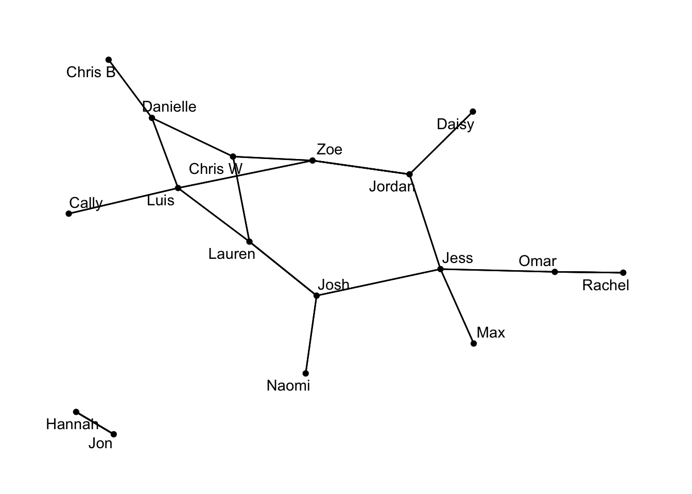{width=672}

## Season 2 

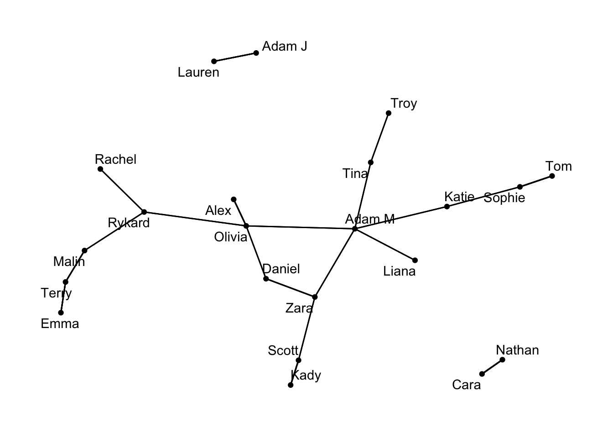{width=672}

## Season 3 

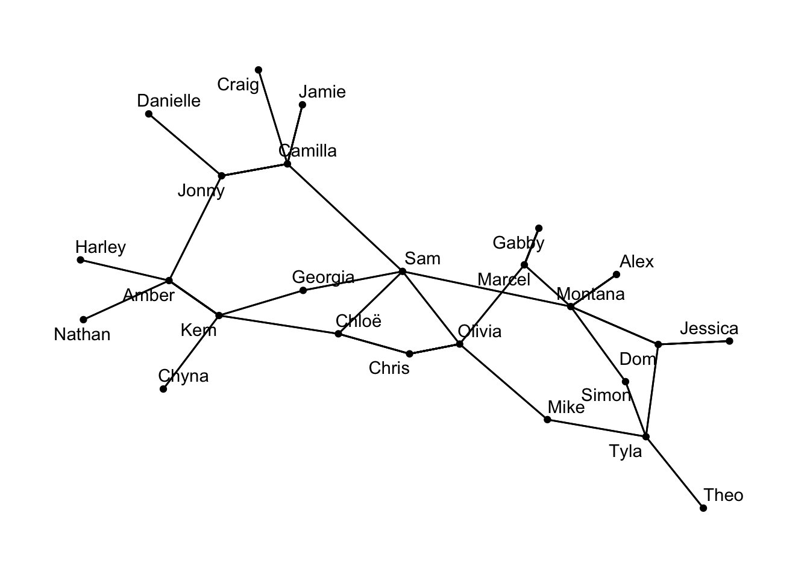{width=672}

## Season 4 

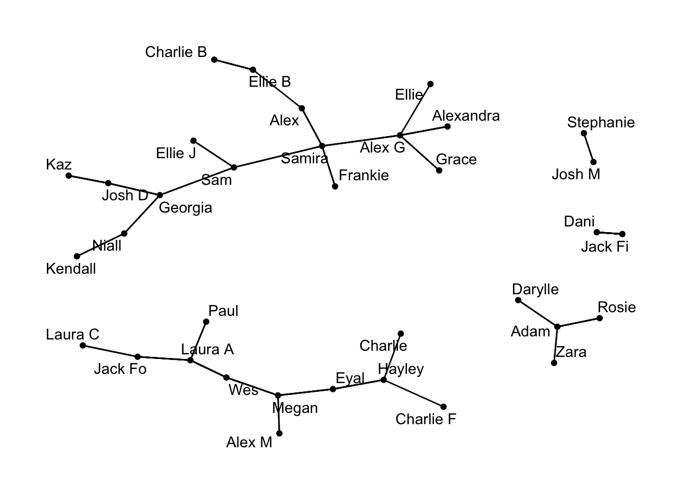{width=672}

## Season 5 

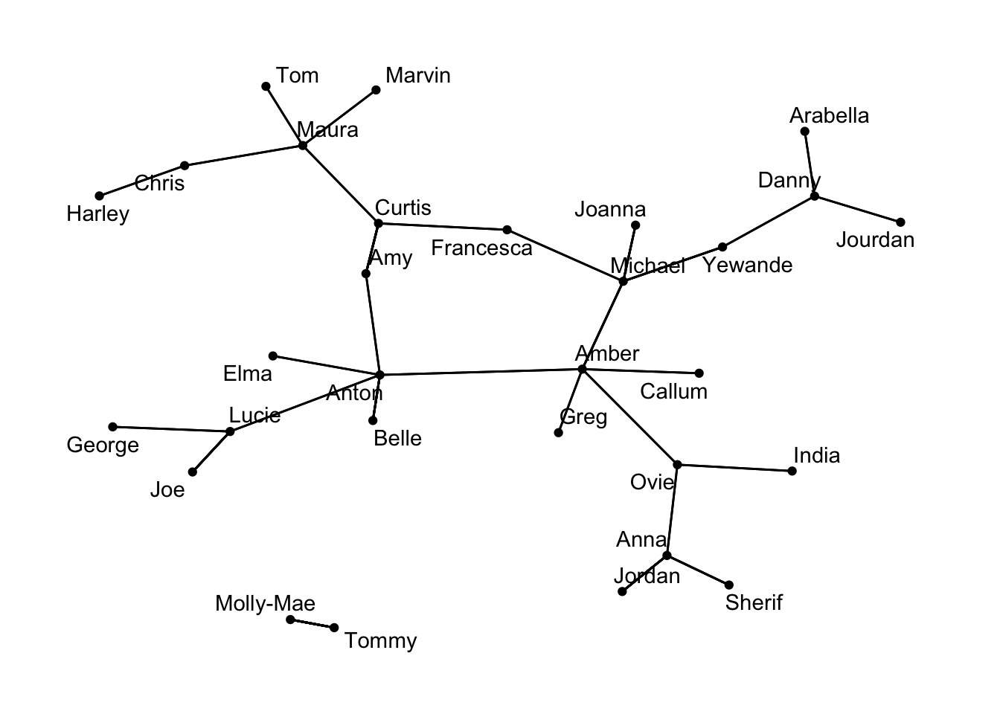{width=672}

## Season 6 

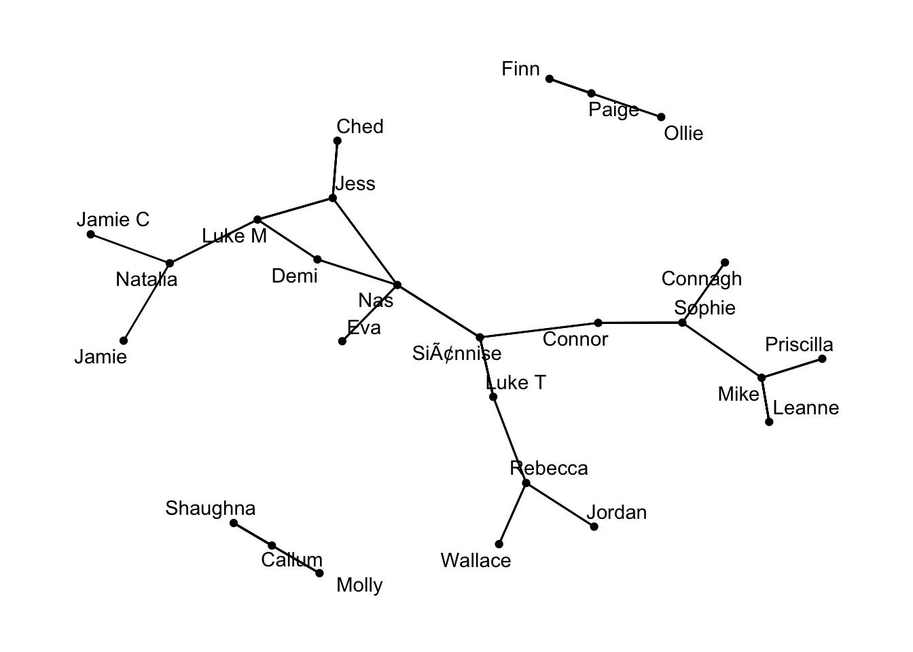{width=672}

## Season 7 

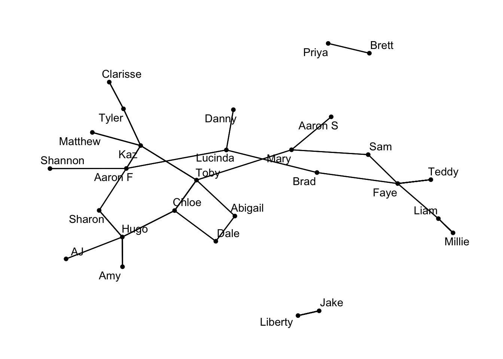{width=672}

## Season 8 

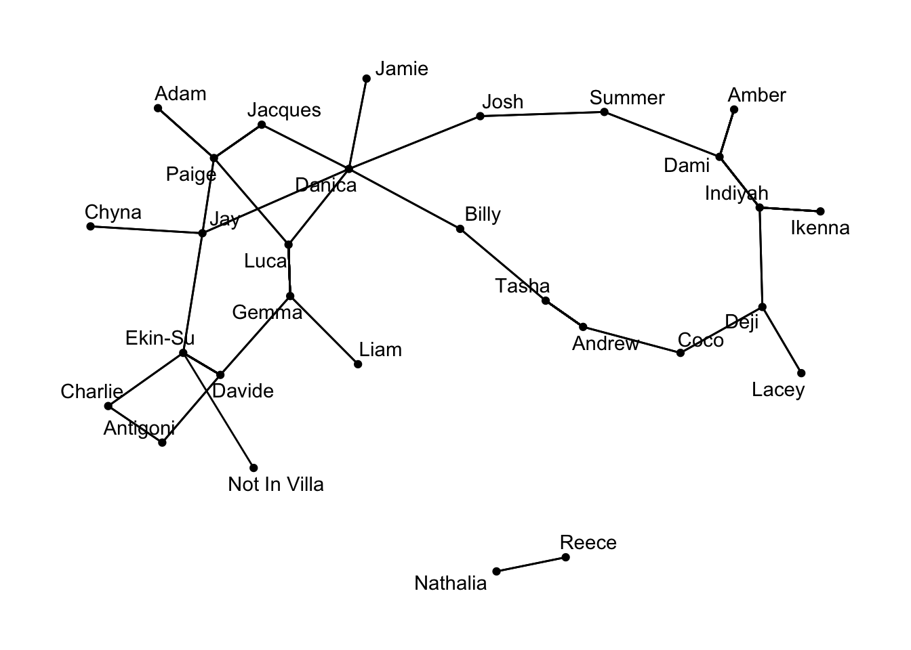{width=672}

## Season 9 

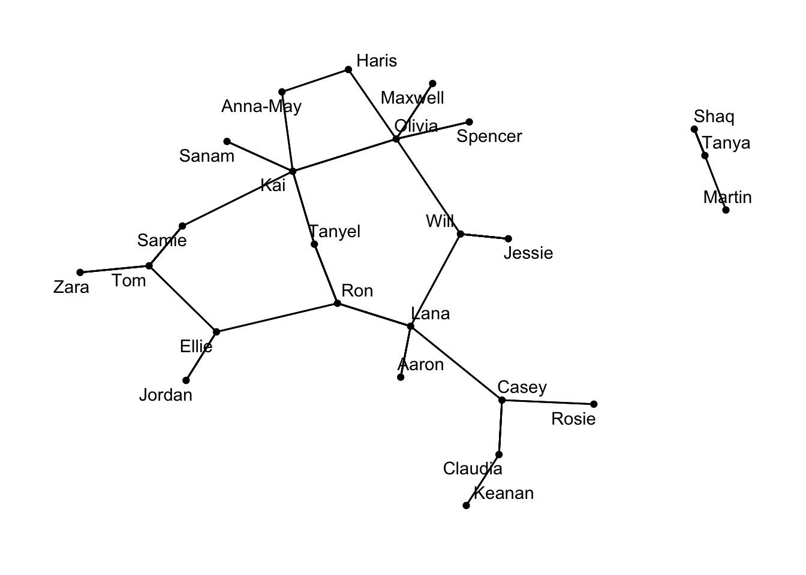{width=672}

## Season 10 

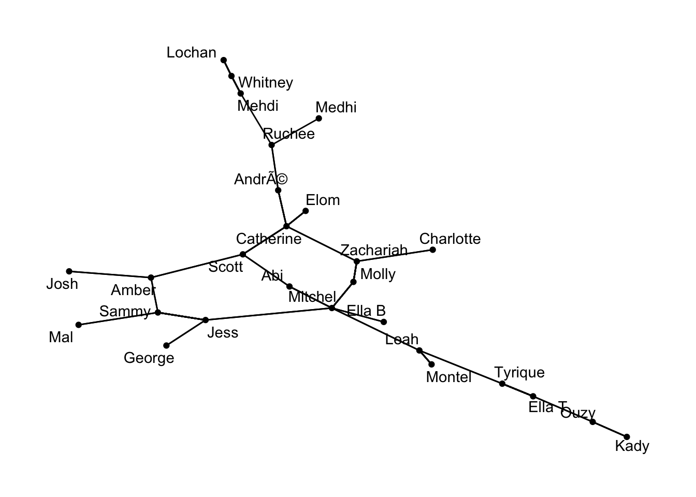{width=672}

## Season 11 

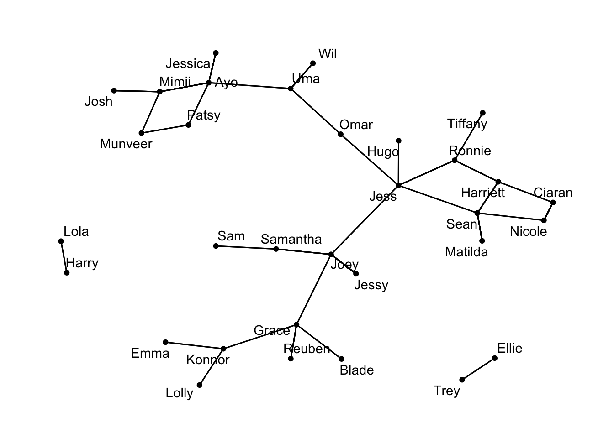{width=672}

## Season 12 

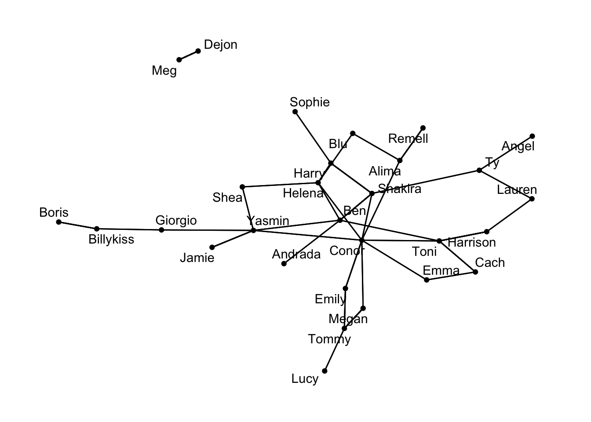{width=672}

:::

You can use the tabset to explore our coupling graph for each season of the show.
A couple of interesting observations show up,
I'll list what I see in no particular order of importance.

- Season 10 is the only season with a fully connected coupling graph.
- Season 4 has the biggest split in its graph, having a total of 5 sections.
- Connor is the epicenter of season 12!!


::: {.cell}

```{.r .cell-code}
find_double_dates <- function(data) {
  as_tbl_graph(data, directed = FALSE) |>
  simplify() |>
  simple_cycles(min = 4, max = 4) |>
  pluck("vertices") |>
  map_chr(\(v) paste(names(v), collapse = ", "))
}
```
:::


I have listed out all of the double dates below for each season.

What is of note is that Conor is part of every one but one of them for season 12. 


::: {.cell}

```{.r .cell-code}
for (season in sort(unique(data$season))) {
  cat("\n\n## Season", season, "\n\n")
 dates <- find_double_dates(data[data$season == season, ])
  if (length(dates) == 0) {
    cat("_No double dates this season._\n")
 } else {
    cat(paste0("- ", dates, "\n"))
 }
}
```
:::


::: {.panel-tabset}


```{.r .cell-code}
for (season in sort(unique(data$season))) {
  cat("\n\n## Season", season, "\n\n")
 dates <- find_double_dates(data[data$season == season, ])
  if (length(dates) == 0) {
    cat("_No double dates this season._\n")
 } else {
    cat(paste0("- ", dates, "\n"))
 }
}
```


## Season 1 

- Lauren, Luis, Zoe, Chris W
 - Lauren, Luis, Danielle, Chris W
 - Luis, Zoe, Chris W, Danielle


## Season 2 

- Olivia, Adam M, Zara, Daniel


## Season 3 

- Kem, Georgia, Sam, Chloë
 - Olivia, Chris, Chloë, Sam
 - Olivia, Marcel, Montana, Sam
 - Montana, Dom, Tyla, Simon


## Season 4 

_No double dates this season._


## Season 5 

_No double dates this season._


## Season 6 

- Luke M, Demi, Nas, Jess


## Season 7 

- Chloe, Toby, Abigail, Dale


## Season 8 

- Davide, Ekin-Su, Charlie, Antigoni
 - Luca, Paige, Jacques, Danica
 - Luca, Paige, Jay, Danica
 - Paige, Jacques, Danica, Jay


## Season 9 

- Kai, Olivia, Haris, Anna-May


## Season 10 

_No double dates this season._


## Season 11 

- Mimii, Ayo, Patsy, Munveer
 - Ciaran, Nicole, Sean, Harriett
 - Sean, Jess, Ronnie, Harriett


## Season 12 

- Cach, Toni, Conor, Emma
 - Toni, Conor, Shakira, Ben
 - Toni, Conor, Yasmin, Ben
 - Toni, Conor, Helena, Ben
 - Harry, Shakira, Conor, Helena
 - Harry, Shakira, Ben, Helena
 - Shakira, Conor, Yasmin, Ben
 - Shakira, Conor, Helena, Ben
 - Yasmin, Conor, Helena, Ben
 - Yasmin, Conor, Helena, Shea
 - Yasmin, Ben, Helena, Shea
 - Conor, Megan, Tommy, Emily
 - Conor, Helena, Blu, Alima

:::

Is this a crazy outlier or a new trend?
I guess we will all have to tune in to see for ourselves.


::: {.cell}

```{.r .cell-code}
split(data, data$season) |>
  map(find_double_dates) |>
  lengths() |>
  as_tibble() |>
  mutate(season = row_number()) |>
  ggplot2::ggplot(aes(x = season, y = value)) +
  ggplot2::geom_col() +
  ggplot2::scale_x_continuous(breaks = unique(data$season)) +
  ggplot2::labs(
    title = "Number of double dates per season",
    x = "Season",
    y = "Number of double dates"
 ) +
  theme(
      plot.background = element_rect(fill = "transparent", color = NA),
      panel.background = element_rect(fill = "transparent", color = NA)
 )
```

::: {.cell-output-display}
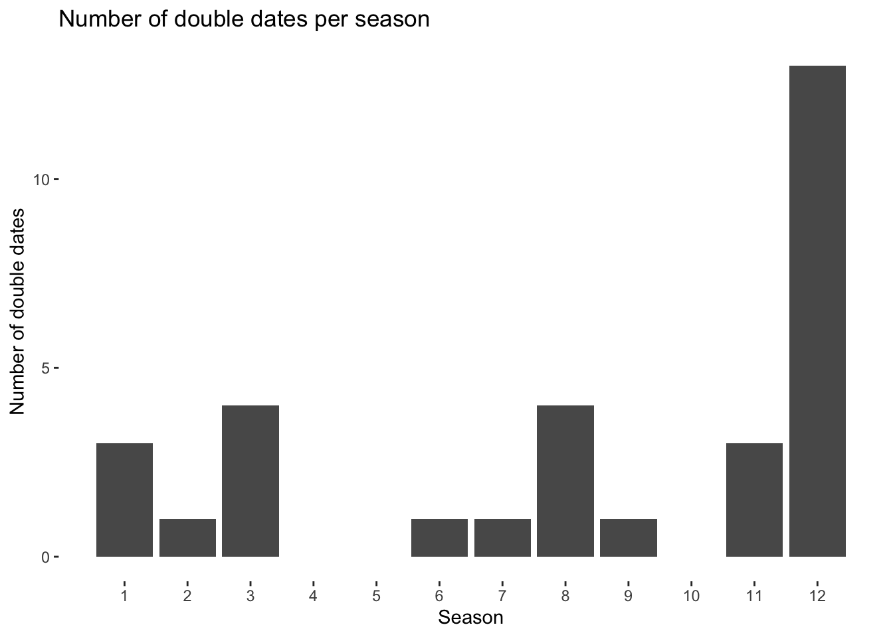{width=672}
:::
:::


```{=html}
<style>
.panel-tabset > .nav-tabs {
  display: flex;
  flex-wrap: wrap;
}
.panel-tabset > .nav-tabs > .nav-item {
  flex: 0 0 25%;
}
.panel-tabset > .nav-tabs > .nav-item > .nav-link {
  width: 100%;
  text-align: center;
}
</style>
```

```{=html}
<script>
document.addEventListener("DOMContentLoaded", function () {
  let syncing = false;

  function syncTabs(sourceLink) {
    if (syncing) return;
    const label = sourceLink.textContent.trim();
    const sourceTabset = sourceLink.closest(".panel-tabset");

 syncing = true;
 document.querySelectorAll(".panel-tabset").forEach(function (tabset) {
      if (tabset === sourceTabset) return;
 tabset.querySelectorAll(".nav-link").forEach(function (link) {
        if (link.textContent.trim() === label && !link.classList.contains("active")) {
 link.click();
        }
      });
    });
 syncing = false;
  }

 document.querySelectorAll(".panel-tabset .nav-link").forEach(function (link) {
 link.addEventListener("click", function () {
      syncTabs(link);
    });
  });
});
</script>
```


