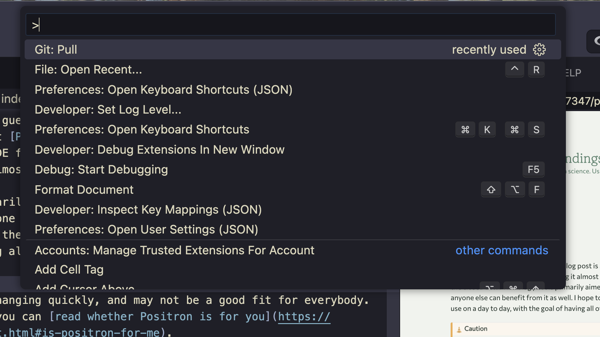
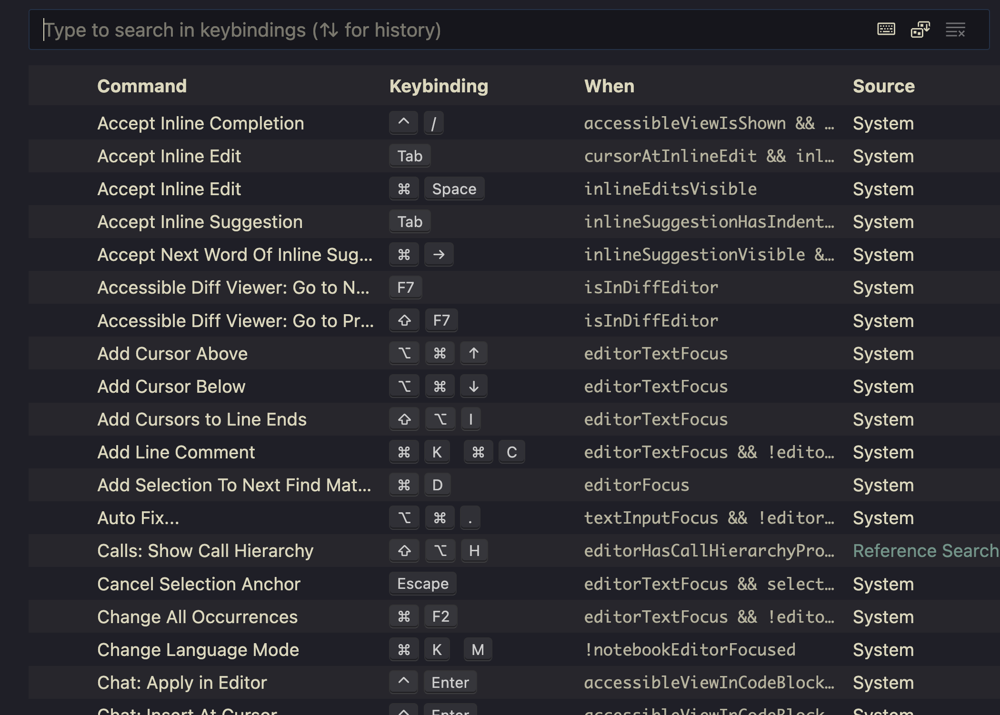
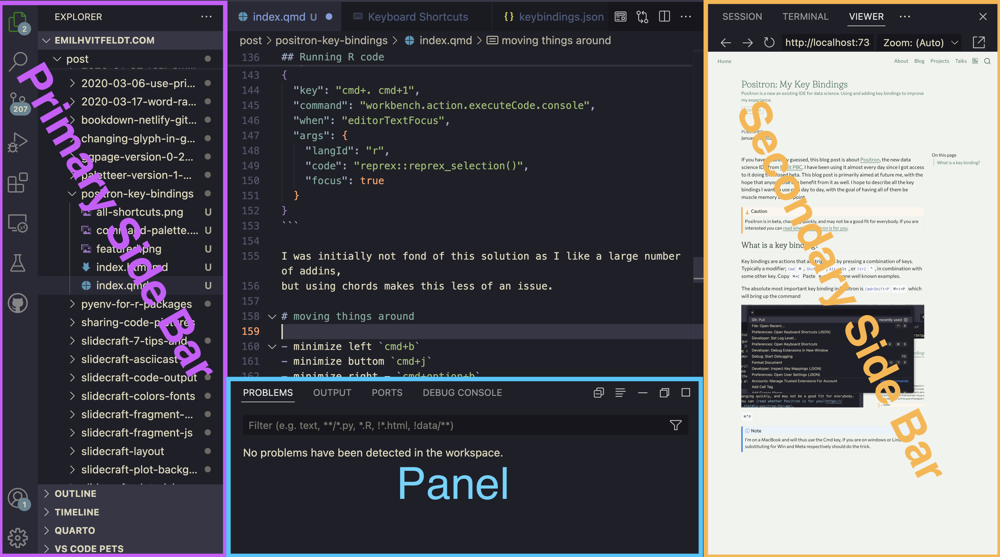

If you haven't already guessed,
this blog post is about [Positron](https://positron.posit.co/),
the new data science IDE from [Posit PBC](https://posit.co/).
I have been using it almost every day since I got access to it doing the closed beta.
This blog post is primarily aimed at future me,
with the hope that anyone else can benefit from it as well.
I hope to describe all the key bindings I want to use on a day-to-day basis,
with the goal of having all of them be muscle memory at one point.

::: {.callout-caution}
Positron is in beta, changing quickly, and may not be a good fit for everybody.
If you are interested you can [read whether Positron is for you](https://positron.posit.co/start.html#is-positron-for-me).
:::

## What is a key binding?

Key bindings are actions that are triggered by pressing a combination of keys. 
Typically a modifier; `Cmd`, `Shift`, `Alt`, or `Ctrl`, in combination with some other key.
Copy `Cmd+C` Paste `Cmd+P` being well-known examples.

::: {.callout-note}
I'm on a MacBook and will thus use the Cmd key, if you are on windows or Linux, substituting for Win and Meta respectively should do the trick.
:::

The absolute most important key binding in Positron is `Cmd+Shift+P` which will bring up the Command Palette. 
This is one of my favorite features of Positron,
and it allows you to search and execute a vast number of actions without remembering the key binding.



If you are ever in doubt, the command palette is there for you.

## Where to find key bindings

Using the command palette you can open the list of all keyboard shortcuts by searching for `Preferences: Open Keyboard Shortcuts`.



This gives you all the key bindings and a way to change specific ones if you want.
Notice how the command palette also shows the key bindings for each action if assigned.

## How to add new key bindings

I find that adding my own keybindings to be easiest in the JSON config file.
Find `Preferences: Open Keyboard Shortcuts (JSON)` in the command palette to open said file.

A keybinding requires the fields `key` and `command` but can take the optional `args` and `when` fields if needed.

The following config would clear the terminal when `Cmd+Shift+Alt+C` is being pressed.

```json
{
  "key": "cmd+shift+alt+c",
  "command": "workbench.action.terminal.clear"
}
```

::: {.callout-tip}
The field value specified by `command` allows for tap-completion for possible actions.
:::

If you instead wanted to restrict this command to only work when we are using the terminal.
Then we add a `when` statement as well.

```json
{
  "key": "cmd+shift+alt+c",
  "command": "workbench.action.terminal.clear",
  "when": "terminalFocus"
}
```

The when field can also allow you to have one key bindings serve multiple purposes depending on what is happening.

```json
{
  "key": "f5",
  "command": "workbench.action.debug.continue",
  "when": "inDebugMode"
},
{
  "key": "f5",
  "command": "workbench.action.debug.start",
  "when": "!inDebugMode"
}
```

We will see examples of the `args` field in just a little bit.

## Chords

We end up being quite limited with how we can add new key bindings,
as most of the combinations have already been taken.
We could overwrite some of them but it becomes a little bit of a mess.

This is where **chords** come in.
You press two key bindings one after another.
We saw this in `Preferences: Open Keyboard Shortcuts` which uses the chord `Cmd+K Cmd+S` which means you press `Cmd+K` followed by `Cmd+S`.
This can be quite ergonomic as you don't have to lift your finger between presses,
thus the motion becomes `put finger on cmd key -> click K -> click S -> lift cmd finger`.

I found that `Cmd+.` (period) wasn't really used and will thus use it as the basis for my chords.

## Running Multiple Commands

Sometimes a single action doesn't do everything you want it to do.
Luckily we can run as many as we want from one key binding by using the `runCommands` action.
I was not able to find a command that restarted the terminal.
But I was able to replicate that feeling by first killing the terminal and then opening a new one.

```json
{
  "key": "cmd+shift+9",
  "command": "runCommands",
  "args": {
    "commands": [
      "workbench.action.terminal.kill",  
      "workbench.action.terminal.new"
    ]
  }
}
```

## Running R Code

Likewise, there is also a command to send code to be executed in the console.
We can use this to send R code to run,
which will make them work like [RStudio Addins](https://rstudio.github.io/rstudio-extensions/rstudio_addins.html).

```json
{
  "key": "cmd+. cmd+1",
  "command": "workbench.action.executeCode.console",
  "when": "editorTextFocus",
  "args": {
    "langId": "r",
    "code": "reprex::reprex_selection()",
    "focus": false
  }
}
```

Above is the base form.
You can set `focus` to `true` if you want the focus to be transfered to the console.
You can use the command `workbench.action.executeCode.silently` if you don't want printing in the console.


I was initially not fond of this solution as I like a large number of addins,
but using chords makes this less of an issue.

::: {.callout-note}
There will be a single code chunk at the end of this post will all my custom key bindings.
:::

## Moving Things Around

The general layout of Positron often looks like this for me.



And I use the folllowing key bindings to change this:

- View: Toggle Primary Side Bar Visibility `Cmd+B`
- View: Toggle Secondary Side Bar Visibility `Cmd+J`
- View: Toggle Panel Visibility `Cmd+Alt+B`
- Activate Positron Data Science layout `Cmd+. Cmd+L`

```json
{
  "key": "cmd+. cmd+l",
  "command": "workbench.action.positronTwoPaneDataScienceLayout"
}
```

## Cursors

- Copy Line Up and Down `Cmd+Alt+Up`, `Cmd+Alt+Down`
- Move Line Up and Down `Alt+Up`, `Alt+Down`
- Expand Line selection `Cmd+L`
    - Highlights the whole active line 

## Multiple Cursors

- Selects next matching word of what you have selected `Cmd+d`
- Selects all matching words `Cmd+Shift+L`
- Adds cursors above or below `Cmd+Shift+Up`, `Cmd+Shift+Down`
- Adds cursor at location `Alt+Click`
- Selects region `Alt+Shift+Click`

## Switching Focus

I'm trying this thing where Editor means `C`, Console means `V` and Terminal means `B`.
These keys don't map to the concepts, but are physically close on the keyboard,
and are ordered in how they feel in my brain.

Notice I how used the shift modifier to denote clearing. And 

### Editor

- Switch Focus to Editor `Cmd+. Cmd+C`

```json
{
  "key": "cmd+. cmd+c",
  "command": "workbench.action.focusActiveEditorGroup"
}
```

### Console

- Switch Focus to Console `Cmd+. Cmd+V`
- Clear Console `Cmd+. Cmd+Shift+V`
- Restart Console `Cmd+Shift+0`

```json
{
  "key": "cmd+. cmd+v",
  "command": "workbench.action.positronConsole.focusConsole"
},
{
  "key": "cmd+. cmd+shift+v",
  "command": "workbench.action.positronConsole.clearConsole"
}
```

### Terminal

- Switch Focus to Terminal `Cmd+. Cmd+B`
- Clear Terminal `Cmd+. Cmd+Shift+B`
- Restart Terminal `Cmd+Shift+9` (similar to Restart Console)

```json
{
  "key": "cmd+. cmd+b",
  "command": "workbench.action.terminal.focus"
},
{
  "key": "cmd+. cmd+shift+b",
  "command": "workbench.action.terminal.clear"
},
{ // Restart terminal
  "key": "cmd+shift+9",
  "command": "runCommands",
  "args": {
    "commands": [
      "workbench.action.terminal.kill",
      "workbench.action.terminal.new"
    ]
  }
}
```

Wishlist:

- Switch Interpreter/console (between Python and R) tracked <https://github.com/posit-dev/positron/issues/2418>

## Files and Projects

- Open New R File `cmd+. cmd+n`

```json
{
  "key": "cmd+. cmd+n",
  "command": "r.createNewFile"
}
```

- switch in and out of working tree `Cmd+. Cmd+E` both ways

```json
{
    "key": "cmd+. cmd+e",
    "command": "git.openFile",
    "when": "isInDiffEditor"
  },
  {
    "key": "cmd+. cmd+e",
    "command": "git.openChange",
    "when": "!isInDiffEditor"
  }
```

- Open Recent Projects `Ctrl+R`
    - This more or less replaced my [Alfred](https://www.alfredapp.com/) usage to open projects.

## Addins

I don't have a lot of addins set up yet, my current plan is ot let them sit on the numbers.
The down0sides to adding addins like this is that there is no validation that the packages are installed.

- Generate Reprex

```json
{
  "key": "cmd+. cmd+1",
  "command": "workbench.action.executeCode.silently",
  "when": "editorTextFocus",
  "args": {
    "langId": "r",
    "code": "reprex::reprex_selection()",
    "focus": false
  }
}
```

- run `bench::mark()` on selected code

```json
{
  "key": "cmd+. cmd+2",
  "command": "workbench.action.executeCode.console",
  "when": "editorTextFocus",
  "args": {
    "langId": "r",
    "code": "eval(parse(text = paste0('bench::mark(', reprex:::rstudio_selection(), ')')))",
    "focus": false
  }
}
```

## Package development

- Install R Package And Restart R `Cmd+Shift+B`
- Load R Package `Cmd+Shift+L`
- Test R Package `Cmd+Shift+T`
- Check R Package `Cmd+Shift+E`

The following keybindings only work if consistantly name the test files in accordance to the R files in your package.

- Move from test file to R file

```json
{
  "key": "cmd+. cmd+r",
  "command": "workbench.action.executeCode.silently",
  "when": "editorTextFocus",
  "args": {
    "langId": "r",
    "code": "usethis::use_r()",
    "focus": false
  }
}
```

- Move from R file to test file

```json
{
  "key": "cmd+. cmd+t",
  "command": "workbench.action.executeCode.silently",
  "when": "editorTextFocus",
  "args": {
    "langId": "r",
    "code": "usethis::use_test()",
    "focus": false
  }
}
```

- Test active file

```json
{
  "key": "cmd+. cmd+shift+t",
  "command": "workbench.action.executeCode.console",
  "when": "editorTextFocus",
  "args": {
    "langId": "r",
    "code": "devtools::test_active_file()",
    "focus": false
  }
}
```

## The End

That is all i have right now.
I might go back later and revise some things, 
don't treat this as a static document.

## All Custom Keybindings

```json
[
  // Moving things around
  {
    "key": "cmd+. cmd+l",
    "command": "workbench.action.positronTwoPaneDataScienceLayout"
  },
  // Focus
  //// Editor
  {
    "key": "cmd+. cmd+c",
    "command": "workbench.action.focusActiveEditorGroup"
  },
  //// Console
  {
    "key": "cmd+. cmd+v",
    "command": "workbench.action.positronConsole.focusConsole"
  },
  {
    "key": "cmd+. cmd+shift+v",
    "command": "workbench.action.positronConsole.clearConsole"
  },
  //// Terminal
  {
    "key": "cmd+. cmd+b",
    "command": "workbench.action.terminal.focus"
  },
  {
    "key": "cmd+. cmd+shift+b",
    "command": "workbench.action.terminal.clear"
  },
  { // Restart terminal
    "key": "cmd+shift+9",
    "command": "runCommands",
    "args": {
      "commands": [
        "workbench.action.terminal.kill",
        "workbench.action.terminal.new"
      ]
    }
  },
  // Files
  {
    "key": "cmd+. cmd+n",
    "command": "r.createNewFile"
  },
  {
    "key": "cmd+. cmd+e",
    "command": "git.openFile",
    "when": "isInDiffEditor"
  },
  {
    "key": "cmd+. cmd+e",
    "command": "git.openChange",
    "when": "!isInDiffEditor"
  },
  // Addins
  {
    "key": "cmd+. cmd+1",
    "command": "workbench.action.executeCode.silently",
    "when": "editorTextFocus",
    "args": {
      "langId": "r",
      "code": "reprex::reprex_selection()",
      "focus": false
    }
  },
  {
    "key": "cmd+. cmd+2",
    "command": "workbench.action.executeCode.console",
    "when": "editorTextFocus",
    "args": {
      "langId": "r",
      "code": "eval(parse(text = paste0('bench::mark(', reprex:::rstudio_selection(), ')')))",
      "focus": false
    }
  },
  // Package Development
  {
    "key": "cmd+. cmd+r",
    "command": "workbench.action.executeCode.silently",
    "when": "editorTextFocus",
    "args": {
      "langId": "r",
      "code": "usethis::use_r()",
      "focus": false
    }
  },
  {
    "key": "cmd+. cmd+t",
    "command": "workbench.action.executeCode.silently",
    "when": "editorTextFocus",
    "args": {
      "langId": "r",
      "code": "usethis::use_test()",
      "focus": false
    }
  },
  {
    "key": "cmd+. cmd+shift+t",
    "command": "workbench.action.executeCode.console",
    "when": "editorTextFocus",
    "args": {
      "langId": "r",
      "code": "devtools::test_active_file()",
      "focus": false
    }
  }
]
```
