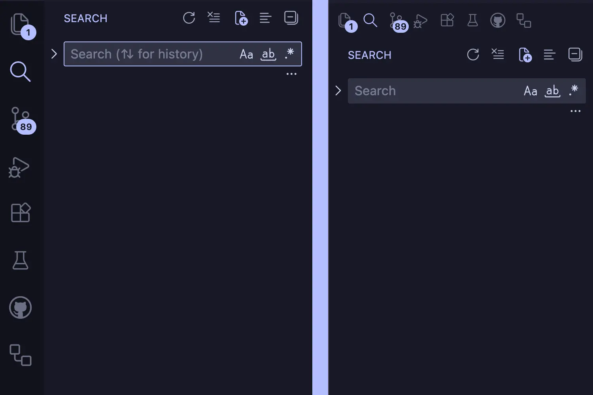
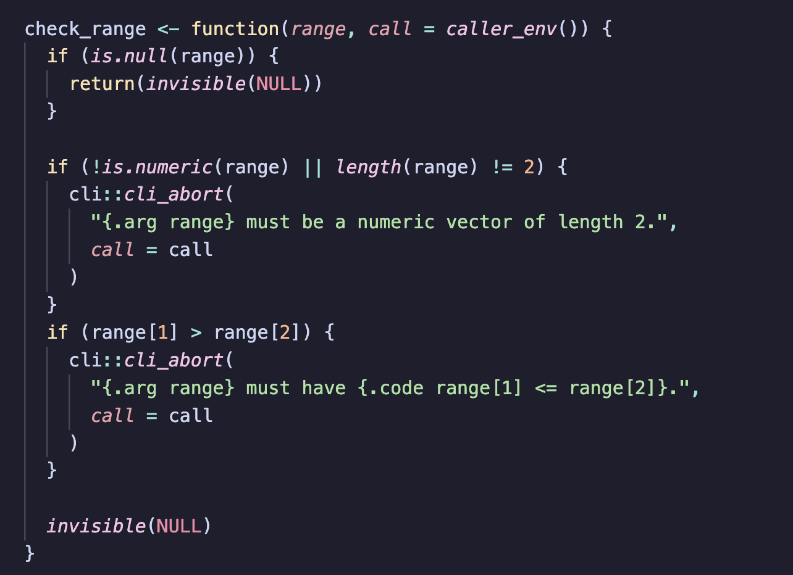
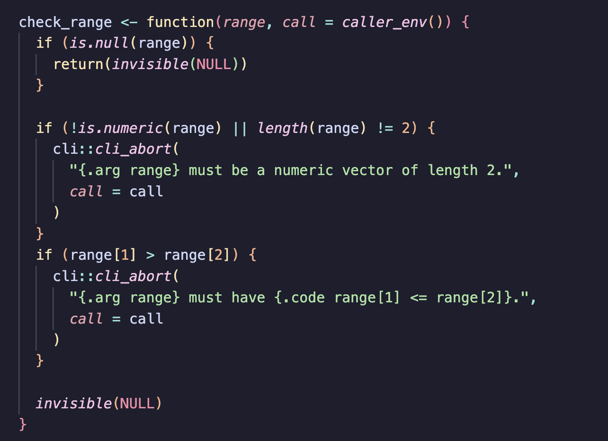
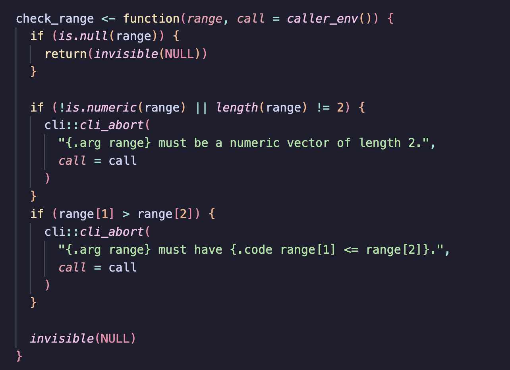
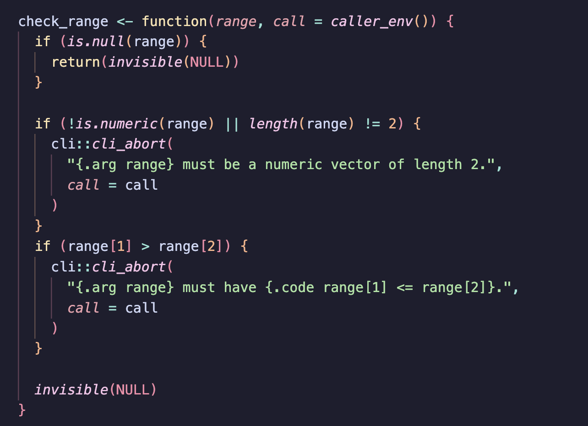
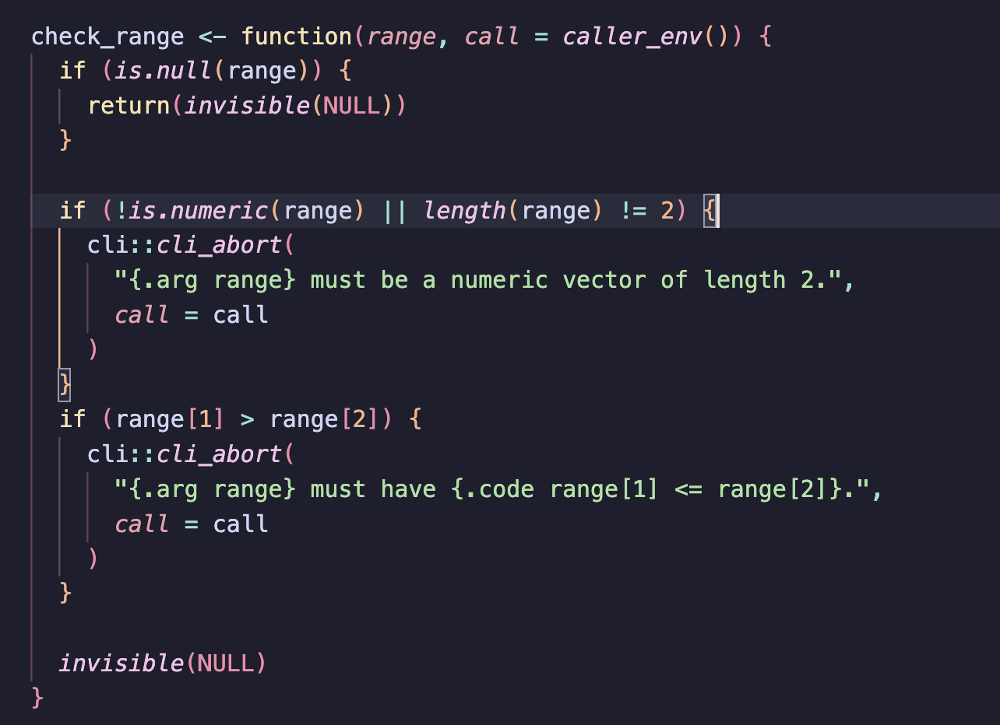
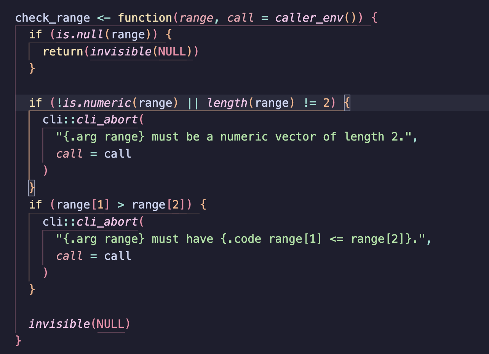
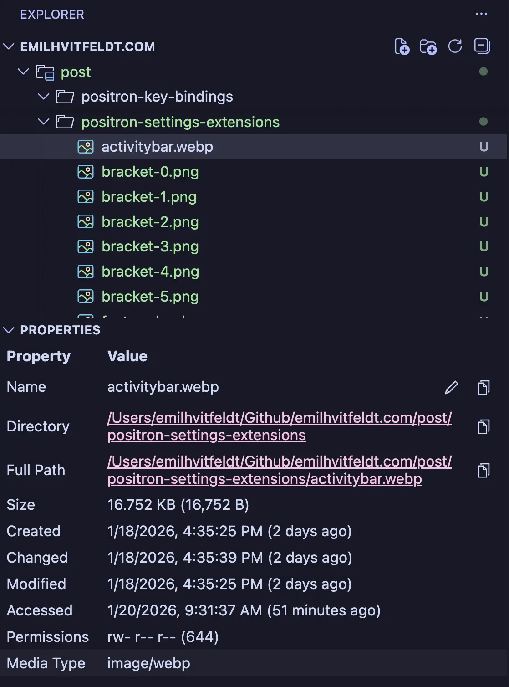

This post is another one to complement my [Positron Keybindings](../positron-key-bindings/index.qmd) post, 
and it will go over both the extension I am currently using and the settings that I have set.
This blog post is about [Positron](https://positron.posit.co/),
the new data science IDE from [Posit PBC](https://posit.co/),
However, most, if not all, of these settings and extensions work with [VS Code](https://code.visualstudio.com/) too.

::: {.callout-tip}
All the settings in this blog post are listed as JSON and can be applied by copying them into your `settings.JSON` file.
To open this, open the command palette (Cmd+Shift+P) and type `Preferences: Open User Settings (JSON)`.
:::

## Theme

For the theme, I recently started using the [Catppuccin theme](https://marketplace.visualstudio.com/items?itemName=Catppuccin.catppuccin-vsc) after using [Kanagawa Flavors](https://marketplace.visualstudio.com/items?itemName=metaphore.kanagawa-vscode-color-theme) for a while.
It also comes with a neat icon pack called [Catppuccin Icons](https://marketplace.visualstudio.com/items?itemName=Catppuccin.catppuccin-vsc-icons), which helps for a more cohesive experience for the whole editor.
#### [Catppuccin for VSCode](https://marketplace.visualstudio.com/items?itemName=Catppuccin.catppuccin-vsc)

The Catppuccin theme comes in 4 variants; [Latte, Frappé, Macchiato, and Mocha](https://catppuccin.com/palette/),
And I personally use the Mocha as I like the slightly higher contrasts.
Both of these extensions are applied using the following settings.

```json
"workbench.colorTheme": "Catppuccin Mocha",
"workbench.iconTheme": "catppuccin-mocha",
```

One of the neat things about the Catppuccin theme is that it allows for modifications.
Such as setting the accent color or changing colors completely.
I chose lavender as my accent, but there are plenty more to choose from [in the palette](https://catppuccin.com/palette/).
I found the colors used in the IDE to be too much blue and purple, 
and I was looking for a happier and lighter theme.
So I was able to swap the usages of blue (`blue` and `sapphire`) to pink (`#f5c2e7`) and the usage of one of the purples (`mauve`) to yellow (`#f9e2af`).
Adding these changes changes everything for me, and the theme still works together because I stayed within the palette.
I just swapped some usages around.

```json
"catppuccin.accentColor": "lavender",
"catppuccin.colorOverrides": {
  "all": {
    "blue": "#f5c2e7",
    "sapphire": "#f5c2e7",
    "mauve": "#f9e2af"
  }
},
```

## Appearance

Above all else, I think having the right level of zoom is very important for your work.
And I found that you can set the zoom level to be a decimal value, which totally changes everything for me.
I also keybinded the command `View: Reset Zoom` such that I can quickly go back to my preferred zoom level after zooming in and out.

```json
"window.zoomLevel": 1.2,
```

The following settings remove the custom title bar, which I don't need.
and enables native tabs, which makes it so that when you have multiple Positrons open at the same time, they become tabs inside the app instead of being multiple apps.

```json
"window.customTitleBarVisibility": "never",
"window.nativeTabs": true,
```

The following setting also comes in handy as it puts `file, project, profile, and git branch` in the header of the window,
making it easy to see which project I'm in and what branch I'm working on.

```json
"window.title": "${activeEditorShort}${separator}${rootName}${separator}${profileName}${separator}${activeRepositoryBranchName}",
```

The startup editor is nice, but by now I know where to get to the things I want, so I'm happy I am able to turn it off.

```json
"workbench.startupEditor": "none",
```

The activity defaults to the far left of your screen (left),
and has icons that toggle between different panels such as the File Explorer, Extension, Source Control, and so on.
I find it much nicer to move it on top (right) as it frees up a lot of real estate.



```json
"workbench.activityBar.location": "top",
```

I furthermore set the following settings to remove even more elements that I don't use.

```json
"workbench.layoutControl.enabled": false,
"breadcrumbs.enabled": false,
```

## Editor Settings

This one setting is for all you people who have clumpy fingers like me!
Setting it to `false` prevents copying the entire line when nothing is selected.
Once I started working at Positron, I realized I did that a lot by accident,
and I'm so happy that I figured out that I was able to turn it off.

```json
"editor.emptySelectionClipboard": false,
```

The next couple of settings are about Bracket Pair Colorization,
which you can get directly from the editor instead of relying on an extension.

Without any of the settings, your code looks like this:



turning on Bracket Pair Colorization with 

```json
"editor.bracketPairColorization.enabled": true,
```

makes it look like this.
Notice how the parentheses/brackets have been colored depending on how nested they are.



While that is all well and good,
It can be a little much.
Especially since the square brackets for indexing will change color depending on what level they are at.
You can make it a little less wild by turning on this setting as well.

```json
"editor.bracketPairColorization.independentColorPoolPerBracketType": true,
```



Next up is the idea about guides,
which are the horizontal lines that show the scope of each function and control structure.
So far, they are showing up in grey,
and you could remove them completely if you want, but I kinda like it.
Especially if you turn on the colors.

```json
"editor.guides.bracketPairs": true,
```

Now each level of indentation has a different color.



Furthermore, the guide highlights the current scope, which I find quite nice.



There is also the idea of the horizontal guide, which shows a line at the beginning of the scope.

```json
"editor.guides.bracketPairsHorizontal": false,
```

I don't like this setting that much, so I have it turned off.
But this is what it looks like when it is on.



My last little editor-related setting is that I have the diff editor ignore trailing whitespace differences, 
reducing noise in comparisons.

```json
"diffEditor.ignoreTrimWhitespace": true,
```

## Language Support

One of the really nice things about VS Code and Positron is that it allows for [Language Specific editor settings](https://code.visualstudio.com/docs/configure/settings#_language-specific-editor-settings).
I won't go over every single setting I use for each language, as they have a lot of overlap.
I will instead go over some of the settings that work really well on a language-by-language basis.

You set language-specific using the following syntax,
Here are the settings I have for R files.

```json
"[r]": {
  "debug.saveBeforeStart": "nonUntitledEditorsInActiveGroup",
  "editor.rulers": [80]
},
```

The first setting makes it so I'm not prompted to save an untitled file when I start the debugger.
The second setting adds a horizontal line indicating the 80th character.
This setting is becoming less and less useful with [Air](https://posit-dev.github.io/air/), but I still kinda like it.

Another type of setting I end up setting is the default formatter for the specific language.

```json
"[python]": {
  "editor.defaultFormatter": "ms-python.black-formatter"
},
```

One of the nice things about VS Code and Positron is that since we have access to the extensions, we automatically get support for many programming languages and file types.

For my C work, I use [clangd](https://marketplace.visualstudio.com/items?itemName=llvm-vs-code-extensions.vscode-clangd) and [CodeLLDB](https://marketplace.visualstudio.com/items?itemName=vadimcn.vscode-lldb) for C language support and debugger.

I use [LaTeX Workshop](https://marketplace.visualstudio.com/items?itemName=James-Yu.latex-workshop) to allow me to format `.bib` files.

And similarly, we have [Tombi](https://marketplace.visualstudio.com/items?itemName=tombi-toml.tombi) for OML language support with validation, formatting, and schema support

## Git & GitHub

These two extensions are fairly new on my list,
at least in terms of usage.
I have high hopes for them, and I think they are worth sharing,
I, however, have not used them to their fullest potential yet.

- [GitHub Actions](https://marketplace.visualstudio.com/items?itemName=github.vscode-github-actions)
- [GitHub Pull Requests](https://marketplace.visualstudio.com/items?itemName=GitHub.vscode-pull-request-github)

They do what you would expect.
Allow you to view and manage GitHub actions and Pull Requests without leaving Positron.

The main git related setting I wanna showcase is smart commits. 
By allowing them, you stage all changes automatically if nothing is staged.

```json
"git.enableSmartCommit": true,
```

## Utilities

I use [File Properties Viewer](https://marketplace.visualstudio.com/items?itemName=brunnerh.file-properties-viewer) to be able to view detailed file properties, including size, creation date, modification date, and file permissions, directly in the editor.




And I use the [SVG](https://marketplace.visualstudio.com/items?itemName=jock.svg) extension almost purely to view SVGs direction in the editor, the same way I do other image files.
This requires the following settings.

```json
"svg.preview.mode": "svg",
```

I realize that this makes it a little harder to see the code of the SVG,
But that is less of a priority for me at the moment. 

## Positron-Specific Settings

```json
"workbench.keybindings.rstudioKeybindings": true,
```

RStudio-style keybindings are enabled for familiarity when transitioning from RStudio.


```json
"dataExplorer.summaryCollapsed": true,
```

Data Explorer summary panel starts **collapsed**.

## Other Settings

A setting I haven't spent too long on,
But I see a lot of potential for it.
The `renv.lock` file is very useful, but Positron doesn't quite know what to think of it because it doesn't recognize `.lock` files.
But it is actually a JSON file, so `files.associations` helps with that. 

```json
"files.associations": {
  "renv.lock": "json"
},
```

Normally, when you use the Quick Open (Cmd+P) search in Positron, it gives you files and such.
Turning on these settings adds **symbols** to the mix. 
Which, for my use cases, means that functions in R packages become available.

```json
"search.quickOpen.includeSymbols": true,
```
