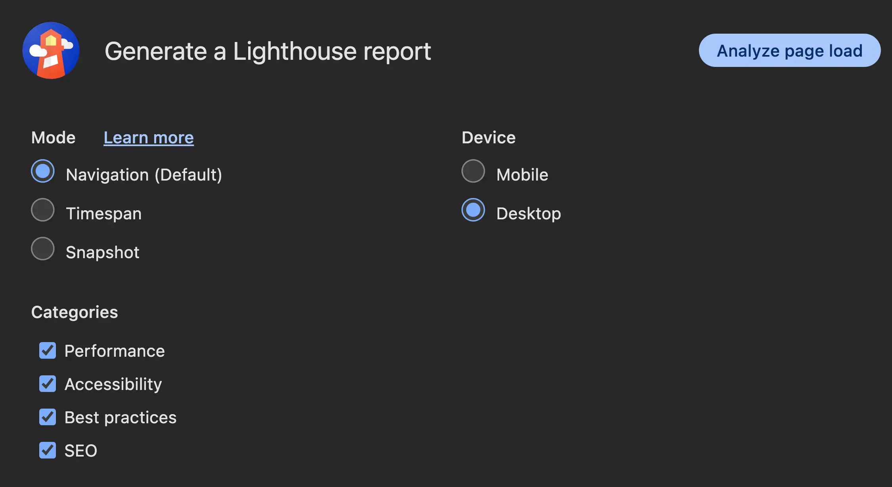
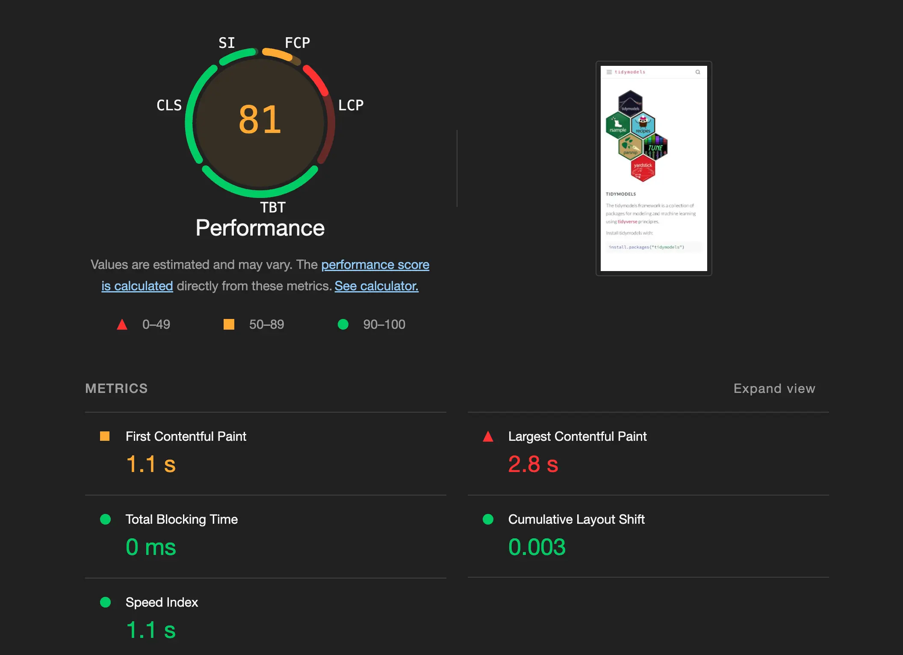
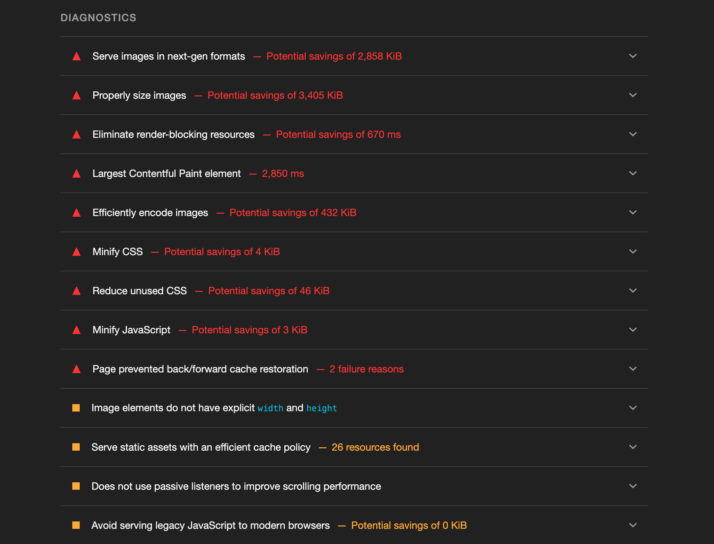
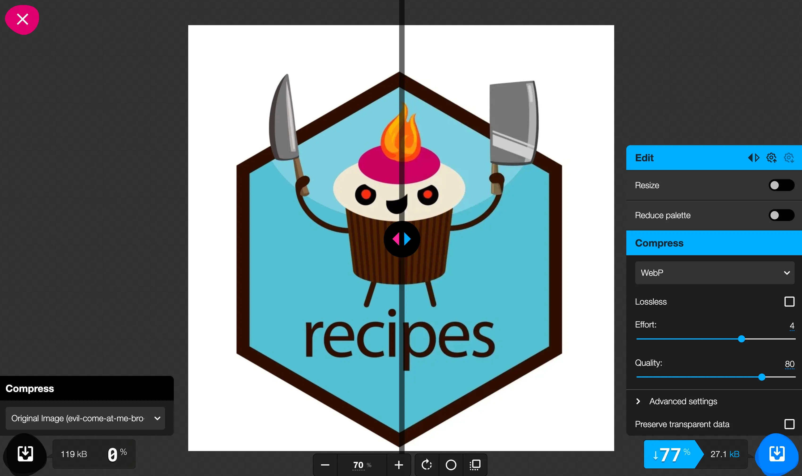

I have a number of Quarto websites I manage professionally and recreationally.
Lately, I have been bothered enough about slowness on those sites that I decided to do something about it.
This post goes over what I did to improve the load times of Quarto websites and what else could be done that I didn't do.

::: {.callout-tip}
Websites here mean anything HTML that Quarto produces, including revealjs slides.
:::

## Lighthouse

The tool I used to analyse the performance of the websites is [Lighthouse by Google Chrome](https://developer.chrome.com/docs/lighthouse).
It is a tool to provide audits for performance, accessibility, best practices, and SEO.
There is both a [direct website](https://pagespeed.web.dev/) you can paste a site into,
There is also a [Chrome extension](https://chromewebstore.google.com/detail/lighthouse/blipmdconlkpinefehnmjammfjpmpbjk) which is what I personally used as I found it easier to use.

Below is what the extension looks like when you open it.



There are 3 modes: Navigation, timespan, and snapshot.
For performance, we are mostly interested in Navigation as it looks at what happens when you try to load a specific page.
Arriving on a page for the first time and seeing how long it takes to load is roughly what we care about.
Timespan starts the analyzer to profile things until it is stopped.
Which could be useful if you are trying to analyse some interactivity on your site.
Spanshot takes a snapshot of the page, which is useful for when you try to look at accessibility and SEO,
but not when looking at performance, as it requires a time component.
You could also toggle the different components down and toggle between website and mobile view.

::: {.callout-note}
I found different results when using uncognito mode as it disables [Chrome Extensions](https://chromewebstore.google.com/category/extensions), some of which slow down page load.
:::

::: {.callout-note}
You will likewise get different results when you are in preview mode compared to a website on the internet, as the way it fetches and downloads files is different.
:::

When running Lighthouse, you get some that look like this.



It gives you an overall score and number of metrics.
They are [First Contentful Paint](https://developer.chrome.com/docs/lighthouse/performance/first-contentful-paint), [Largest Contentful Paint](https://developer.chrome.com/docs/lighthouse/performance/lighthouse-largest-contentful-paint), [Total Blocking Time](https://developer.chrome.com/docs/lighthouse/performance/lighthouse-total-blocking-time), [Cumulative Layout Shift](https://web.dev/articles/cls), [Speed Index](https://developer.chrome.com/docs/lighthouse/performance/speed-index).

In my experience, I had the most issues with Largest Contentful Paint and a little with First Contentful Paint.
Largest Contentful Paint is defined as: "LCP measures when the largest content element in the viewport is rendered to the screen. This approximates when the main content of the page is visible to users".
As of the time of writing, less than 1.2 seconds is a green light for Largest Contentful Paint on desktop.
Meaning that is what we should attempt to get under.

Next is a list of issues that Lighthouse has identified.
Clicking on these gives explanations of the problem,
with a link to how it should be fixed,
and offending elements.



These are the action items we will be dealing with for the rest of the blog post.
I will only go over the items that I have done and considered.
The goal isn't to eliminate all the issues,
just to get it fast enough.
This is especially worth noting since we are using a framework like [Quarto](https://quarto.org/), which I use to trade convenience for control.
There will be some things that are harder to fix because they happen on Quarto's end, and undoing them is more trouble than it's worth.

The last thing to notice is that we need to run Lighthouse on a page-by-page basis.
This might seem like a lot at first,
but it isn't that big of a deal for the websites I manage, as there is a small number of types of pages,
and all blog post pages tend to have the same type of issues.

## Images

What appeared to be the biggest offender for my sites was images that weren't sized or formatted optimally.
This means that these files take up more memory than needed and thus require longer download times for the page to load.
And sadly, there is virtually no upper limit on how bad this can be.
Clicking these items, if they pop up as issues in Lighthouse, will show the offending images for you.

Images on a website will have a set or variable size.
They could be hard-coded to be 400px wide,
take up 100% or 50% width,
or some conditional combination of the above.

Imagine you have a header image for a blog post,
And it is set to be 1500x1000px.
But you are using a nice and fancy image from [Unsplash](https://unsplash.com/) that has a 6000x4000px resolution.
If you don't do anything and just apply it directly, then you are making visitors download an image file that is 16 times larger than it needs to be,
only for it to be resized by the browser.
A file of that size would be around 2Mb, which, just by resizing, could be 125Kb,
a drastic reduction.
On the other hand, you might have images that need to take up the full width of the screen or 75% of the screen.
I'm not going to give concrete sizes as they will degrade as internet speeds get faster.
Instead, [google "website image size guide"](https://www.google.com/search?q=website+image+size+guide) to see current recommendations.

While we are resizing, we can look into using optimal file formats.
There are generally 3 types of images:

- images that can be compressed losslessly
- images that cannot be lossy
- images constructed with math and vectors

The last item on this list will mostly be done with [SVG](https://en.wikipedia.org/wiki/SVG) files.
These images are created using a number of mathematical rules and will thus have the same file size regardless of what resolution you are viewing them at.
These are great for logos, two-dimensional graphics, charts, and illustrations.
[PNG](https://en.wikipedia.org/wiki/PNG) files are a raster-based format that you don't often don't want to reduce lossily. 
It also supports transparency.
[JPEG](https://en.wikipedia.org/wiki/JPEG) files are used for images such as photography,
where lossy compression is often acceptable as long as you handle it well.

There is a new file format on the block called [WebP](https://en.wikipedia.org/wiki/WebP) which: "is a raster graphics file format developed by Google intended as a replacement for JPEG, PNG, and GIF file formats. It supports both lossy and lossless compression, as well as animation and alpha transparency."

So by using this format, we are now down to 2 choices: SVG for files that can be created with perfect resolution, and WebP for everything.
This is not a hard and fast rule, as there will be times when we want to use other files.

Most tools allow for the creation of both types of files, and converting tools are also available both as packages, CLI, and websites.

Since I didn't have too many images that were too large, I went with a website converter.
[squoosh.app](https://squoosh.app/) is my image converter of choice.
Because it allows for resizing,
compression using various formats, including WebP,
and it has a before-and-after slider so you can see whether the compression is acceptable.

Below is an example usage of the website.
The slider down the middle can be dragged left and write to help you determine whether the compression is too hard.


This example has way too harsh compression, as the Effort and Slight loss were turned way down.
This result is a very small file that doesn't look good.
Instead, let's move those sliders a bit to see if we can find a good compromise.



With these settings, we are getting a 77% decrease in file size with minimal compression artifacts.

::: {.callout-tip}
Note that the image I was working on was sized to around 50% of the screen.
You should try to size the image in the viewer to approximate the size it will be on your website.
More compression artifacts are undetectable when the image is smaller. 
:::

Depending on your site, this can take a while to do.
I put on a podcast and grinded for a little bit at a time.

The other thing to do is to use SVGs whenever you can, as they are mostly smaller than the alternatives, and you don't have to change resolutions.
Here is one of the [commits](https://github.com/EmilHvitfeldt/emilhvitfeldt.com/commit/6b2040b392d930ade0a418f4a2113d97bee7b029#diff-45a95a5810e0eb789f6210a3ebd5d7119afe49dfe84ed467e66956bba09ceb10) where I went over all the [project images](https://emilhvitfeldt.com/projects) on this site, some having over 90% reduction in file size.

Generated images from plotting, such as ggplot2, generally have good defaults and won't need to be post-processed as far as I have seen.

## Fonts

Listed under "Eliminate render-blocking resources," you might see Google Fonts.
This is happening if you are importing fonts into your theme.
I found this to be less of an issue than the image files,
but still big enough to deal with.
There are 2 main ways of doing this: be very specific in what weights you download, and use self-hosted fonts.

The reason why this is slowing us down is that you have to download the fonts from Google when you visit the page.
Some fonts come with a number of different weights,
and if you don't specify what weights you want, it will download all of them.
This is obviously wasteful.
Noting which font weights you use and only downloading those is a good first step.

A different way is to self-host them.
This requires a bit of effort, but it helps the speed as we don't have to wait for results to come back from Google fonts.
And we can optimize the files a little bit too.

To self-host a font, first download the selected fonts from Google Fonts to your computer.
Then use a `@font-face` generator such as [transfonter.org](https://transfonter.org/) to turn those files into files we can use for our website.
You will need the `woff2` and `woff` files.
Technically, `woff2` is a newer format than `woff` and we are including both such that `woff` is the fallback option in case the users browser doesn't support `woff2`.
I moved these files into `assets/fonts/`, but you can put them wherever fits your folder structure.

Then you need to change your CSS or SCSS to use these files instead of importing from Google Fonts.
Take the following example, 
it loads in [Source Code Pro](https://fonts.google.com/specimen/Source+Code+Pro), which is a monospaced font.
This font is used for code, and it is typically only used in 1 weight.

```scss
@import url('https://fonts.googleapis.com/css2?family=Source+Code_Pro&display=swap');
```

So we will only add in the `font-weight: 500` case.
Using the following code.

```scss

@font-face {
  font-family: 'Source Code Pro';
  font-weight: 500;
  src: url('assets/fonts/SourceCodePro-Medium.woff2') format('woff2'),
       url('assets/fonts/SourceCodePro-Medium.woff') format('woff');
}
```

Notice that the filename doesn't have the number 500 in it,
and instead has the name Medium.
Below is a [table of weight names and values](https://developer.mozilla.org/en-US/docs/Web/CSS/font-weight#common_weight_name_mapping) to help you select the right file.

| Value Common | weight name               |
|--------------|---------------------------|
| 100          | Thin (Hairline)           |
| 200          | Extra Light (Ultra Light) |
| 300          | Light                     |
| 400          | Normal (Regular)          |
| 500          | Medium                    |
| 600          | Semi Bold (Demi Bold)     |
| 700          | Bold                      |
| 800          | Extra Bold (Ultra Bold)   |
| 900          | Black (Heavy)             |
| 950          | Extra Black (Ultra Black) |

You will need one `@font-face` block for each font/font-weight combination.
So you will need 4 of you to use weights 200, 400, 600, and 800.
You will also need a separate block for each italics font by setting `font-style: italic;` in the `@font-face` block while pointing to a italics font file.
See this [commit](https://github.com/EmilHvitfeldt/feature-engineering-az/commit/6b10d8b7f4ec7acd1c2ed7d2fbe24ae0afb1dcdc) as an example of how this was done.

Remember to rerender the Quarto site so it gets updated with new defaults.

::: {.callout-tip}
I found that [some quarto themes](https://github.com/quarto-dev/quarto-cli/blob/6202430787bc0787b97c19026cb96aa4e8a3ea19/src/resources/formats/html/bootstrap/themes/cosmo.scss#L78) use imported Google Fonts as well.
Which might be why you see it pop up in Lighthouse.
:::

Other resources:

- [5 Tips To Make Google Fonts Faster](https://requestmetrics.com/web-performance/5-tips-to-make-google-fonts-faster/#:~:text=Even%20if%20you%20are%20only,each%20font%20variation%20you%20use)
- [Self-hosting fonts explained (including Google fonts) // @font-face tutorial](https://www.youtube.com/watch?v=zK-yy6C2Nck)

## Settings

There are also some settings in Quarto that you can change that allow for slightly faster websites.
This is not an exhaustive list and just some of the things I have found so far.
This all falls under the mantra "only import what you need".

### Mathjax

One of the benefits of Quarto is that it allows for the display of equations out of the box.
However, if you know your website doesn't need that, then you can [turn it off](https://quarto.org/docs/reference/formats/html.html#format-options) by setting `format: html: html-math-method: plain` in `_quarto.yml`.
This way, you don't need to load the JS needed for equation rendering.

### Search

As noted in [this Quarto Github discussion](https://github.com/quarto-dev/quarto-cli/discussions/9330) one can save some time by [disabling search](https://quarto.org/docs/websites/website-search.html#disablingforcing-search) on a wesite with

```yml
website:
  search: false
```

Only do this if you don't think the website should have the search bar.

### minimal: true

Quarto comes with many neat things bundled in,
However, if you want a fairly basic website or are willing to spin these features up yourself one by one,
You can [ask for minimal HTML](https://quarto.org/docs/output-formats/html-basics.html#minimal-html).

```yml
format:
  html:
    minimal: true
```

This change is quite aggressive and will likely not be useful for most people's websites.

## Minify JS and CSS

Since we are using Quarto as a framework,
which in turn uses [Bootstrap](https://getbootstrap.com/), we get some large CSS and JS files as they come bundled with many things.
They include a lot of CSS rules you won't use on your site.
And the bad news is that [removing unused CSS is really hard](https://css-tricks.com/how-do-you-remove-unused-css-from-a-site/).
I have therefore not done much in that area.
There is some talk in [this Quarto Github discussion](https://github.com/quarto-dev/quarto-cli/discussions/9330) about how this can be done,
But it feels IMO too work for my benefit for me right now as it requires a post-rendering stage to run some commands.
Which adds to the rendering experience in ways I don't see as a worthwhile trade-off.
But I'm including it here in case you disagree.