```{=html}
<style>
/* Example 3 — hex stickers */
.timeline .event img.hex {
  /* R hex stickers are pointy-top: PNG height is point-to-point,
     width is flat-edge to flat-edge (height / width == 2 / sqrt(3)). */
  height: 72px;
  width: auto;
  margin: 0;
  display: block;
  filter: drop-shadow(0 1px 2px rgba(0, 0, 0, 0.25));
}
.timeline .event .hexrow > p {
  display: flex;
  gap: 0;          /* vertical flat edges meet, so the row tessellates */
  margin: 0;
}
.timeline .event .hexrow + .hexrow {
  margin-top: -18px;   /* pull the next row up by 1/4 of the hex height */
}
.timeline .event .hexrow.offset > p {
  margin-left: 31px;   /* shift by half a hex width so points interlock */
}
/* Left-side events (.vertical-alt odd) hug the timeline: right-align the comb */
.timeline.vertical-alt .event:nth-child(odd) .hexrow > p {
  justify-content: flex-end;
}
.timeline.vertical-alt .event:nth-child(odd) .hexrow.offset > p {
  margin-left: 0;
  margin-right: 31px;
}

/* Example 1 — plots rendered inside events */
.analysis .event img {
  max-width: 100%;
  height: auto;
  border-radius: 6px;
}

/* Example 2 — composite "magazine" cards */
.olympics .event .mag {
  display: flex;
  align-items: center;
  gap: 1rem;
}
.olympics .event .mag > .quarto-figure {   /* the flag, wrapped by Quarto */
  margin: 0;
  flex: 0 0 auto;
}
.olympics .event .mag > .quarto-figure figure,
.olympics .event .mag > .quarto-figure p { margin: 0; }
.olympics .event img.flag {
  width: 160px;
  height: auto;
  border: 1px solid rgba(0, 0, 0, 0.15);
  border-radius: 3px;
  display: block;
}
.olympics .event .mag-body { flex: 1 1 auto; }
.olympics .event .mag-body h4 { margin: 0 0 0.15rem; }
.olympics .event .mag-body p { margin: 0.1rem 0; }
.olympics .event .mag-body .stat { font-size: 1.05rem; }
.olympics .event .mag-body img { max-width: 100%; }   /* the sparkline */
</style>
```

A little while back I [announced quarto-timeline](../quarto-timeline/),
a Quarto extension for styled timelines.
It showed some of the basic use cases and how you could change some settings.
In this blogpost I will show how we can push the envelope a little bit.
The main thing that makes this possible is that `.event` can contain anything we want.

## Example 1: Watching an analysis take shape

A first easy one is have chunk output appear in `.event`s,
specifically generated plots.
This example uses the `penguins` data set and shows the progression of the chart.


The pattern is just a code chunk dropped inside an `.event`:

````markdown
:::: {.event data-label="Model"}
```{{r}}
ggplot(clean, aes(flipper_len, body_mass, colour = species)) +
  geom_point(alpha = 0.6) +
  geom_smooth(method = "lm", se = FALSE)
```
::::
````

::: {.callout-note collapse="true"}
## CSS for this example

```html
<style>
.analysis .event img {
  max-width: 100%;
  height: auto;
  border-radius: 6px;
}
</style>
```
:::

:::: {.timeline .vertical .tl-card .analysis style="--tl-color-line: #2c7fb8; --tl-color-dot: #2c7fb8; --tl-color-label: #2c7fb8;"}
:::: {.event data-label="Raw"}
**Load the raw data.** Straight from the source.


::: {.cell}
::: {.cell-output-display}
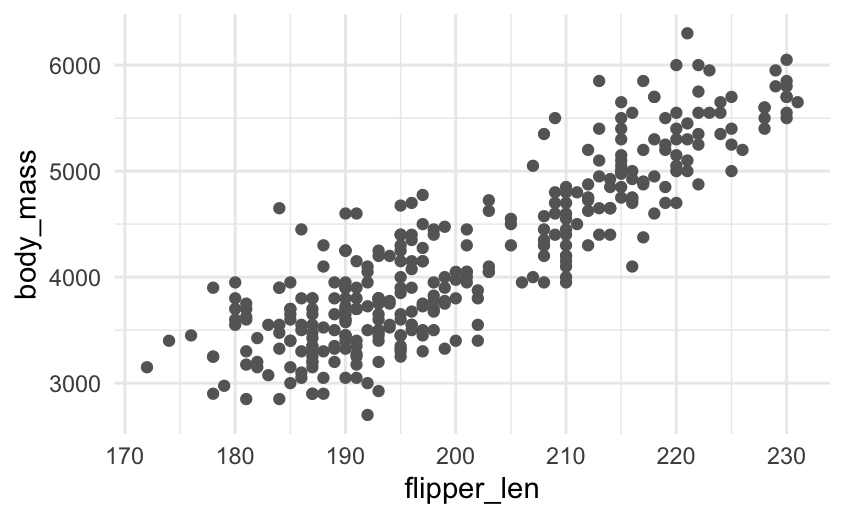{fig-alt='Penguins analysis step' width=422.4}
:::
:::

::::
:::: {.event data-label="Explore"}
**Colour by species.** Three clusters separate out almost immediately.


::: {.cell}
::: {.cell-output-display}
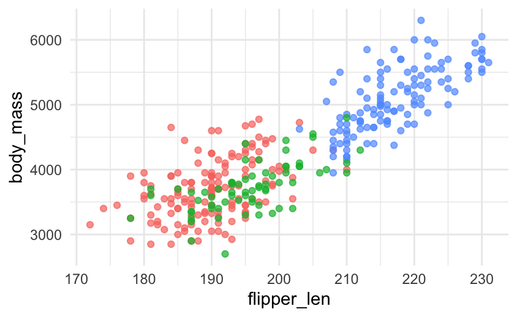{fig-alt='Penguins analysis step' width=422.4}
:::
:::

::::
:::: {.event data-label="Model"}
**Fit a line per species.** Body mass scales with flipper length within each.


::: {.cell}
::: {.cell-output-display}
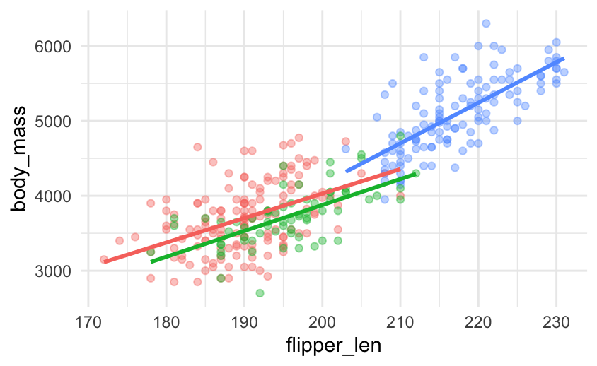{fig-alt='Penguins analysis step' width=422.4}
:::
:::

::::
:::: {.event data-label="Report"}
**Polish for the audience** with labels, a clear palette, and a title.


::: {.cell}
::: {.cell-output-display}
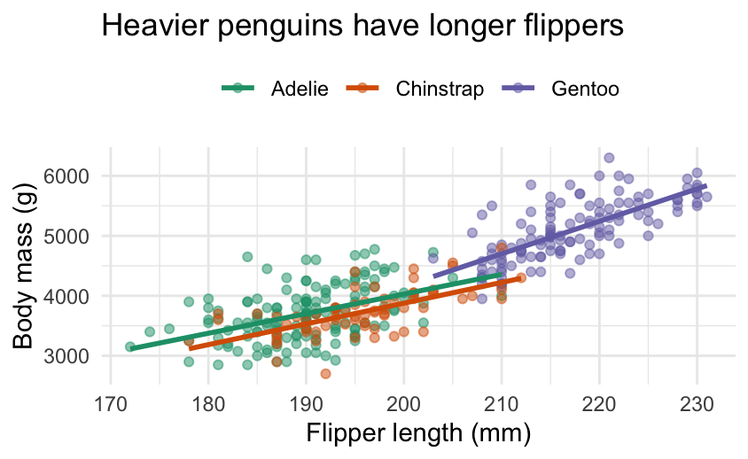{fig-alt='Penguins analysis step' width=422.4}
:::
:::

::::
::::

Because the timeline only cares about the rendered output,
the same approach works for tables,
leaflet maps, htmlwidgets, anything Quarto can put on the page.

## Example 2: The Summer Games, by the numbers

But we are not even limited to 1 thing inside an `.event`,
it can contain as much or as little as you want.
Here each marker is a little magazine card that combines three things:
the host country's flag, a headline stat,
and a sparkline showing where that edition sits in the long-run trend of athlete numbers.
The flags are static images,
the sparklines are generated on the fly,
and a flexbox lays them side by side,
all inside one `.event`.


The card is a `.mag` flexbox wrapping the flag and a `.mag-body`,
and the sparkline is just an `{r}` chunk that highlights the current Games:

````markdown
:::: {.event data-label="2008"}
::: {.mag}
{.flag}
::: {.mag-body}
#### Beijing
[204]{.stat} nations · [10,942]{.stat} athletes
```{{r}}
spark(2008)
```
:::
:::
::::
````

::: {.callout-note collapse="true"}
## CSS for this example

```html
<style>
.olympics .event .mag {
  display: flex;
  align-items: center;
  gap: 1rem;
}
.olympics .event .mag > .quarto-figure {   /* the flag, wrapped by Quarto */
  margin: 0;
  flex: 0 0 auto;
}
.olympics .event .mag > .quarto-figure figure,
.olympics .event .mag > .quarto-figure p { margin: 0; }
.olympics .event img.flag {
  width: 160px;
  height: auto;
  border: 1px solid rgba(0, 0, 0, 0.15);
  border-radius: 3px;
  display: block;
}
.olympics .event .mag-body { flex: 1 1 auto; }
.olympics .event .mag-body h4 { margin: 0 0 0.15rem; }
.olympics .event .mag-body p { margin: 0.1rem 0; }
.olympics .event .mag-body .stat { font-size: 1.05rem; }
.olympics .event .mag-body img { max-width: 100%; }   /* the sparkline */
</style>
```
:::

:::::: {.timeline .vertical .tl-card .olympics style="--tl-color-line: #b8860b; --tl-color-dot: #b8860b; --tl-color-label: #b8860b;"}

::::: {.event data-label="2000"}

:::: {.mag}

{.flag title="Australia"}

::: {.mag-body}

#### Sydney

[199]{.stat} nations · [10,651]{.stat} athletes


::: {.cell}
::: {.cell-output-display}
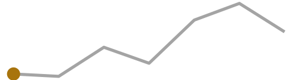{fig-alt='Athletes per Summer Games, Sydney 2000 highlighted' width=249.6}
:::
:::


:::

::::

:::::

::::: {.event data-label="2004"}

:::: {.mag}

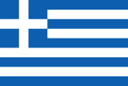{.flag title="Greece"}

::: {.mag-body}

#### Athens

[201]{.stat} nations · [10,625]{.stat} athletes


::: {.cell}
::: {.cell-output-display}
{fig-alt='Athletes per Summer Games, Athens 2004 highlighted' width=249.6}
:::
:::


:::

::::

:::::

::::: {.event data-label="2008"}

:::: {.mag}

{.flag title="China"}

::: {.mag-body}

#### Beijing

[204]{.stat} nations · [10,942]{.stat} athletes


::: {.cell}
::: {.cell-output-display}
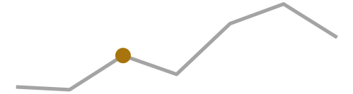{fig-alt='Athletes per Summer Games, Beijing 2008 highlighted' width=249.6}
:::
:::


:::

::::

:::::

::::: {.event data-label="2012"}

:::: {.mag}

{.flag title="Great Britain"}

::: {.mag-body}

#### London

[204]{.stat} nations · [10,768]{.stat} athletes


::: {.cell}
::: {.cell-output-display}
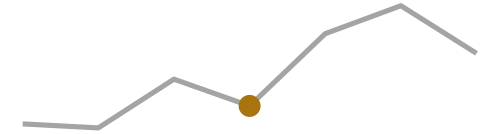{fig-alt='Athletes per Summer Games, London 2012 highlighted' width=249.6}
:::
:::


:::

::::

:::::

::::: {.event data-label="2016"}

:::: {.mag}

{.flag title="Brazil"}

::: {.mag-body}

#### Rio de Janeiro

[207]{.stat} nations · [11,238]{.stat} athletes


::: {.cell}
::: {.cell-output-display}
{fig-alt='Athletes per Summer Games, Rio de Janeiro 2016 highlighted' width=249.6}
:::
:::


:::

::::

:::::

::::: {.event data-label="2020"}

:::: {.mag}

{.flag title="Japan"}

::: {.mag-body}

#### Tokyo

[205]{.stat} nations · [11,420]{.stat} athletes


::: {.cell}
::: {.cell-output-display}
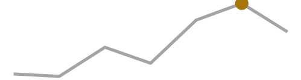{fig-alt='Athletes per Summer Games, Tokyo 2020 highlighted' width=249.6}
:::
:::


:::

::::

:::::

::::: {.event data-label="2024"}

:::: {.mag}

{.flag title="France"}

::: {.mag-body}

#### Paris

[204]{.stat} nations · [11,110]{.stat} athletes


::: {.cell}
::: {.cell-output-display}
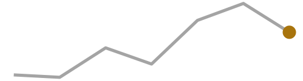{fig-alt='Athletes per Summer Games, Paris 2024 highlighted' width=249.6}
:::
:::


:::

::::

:::::

::::::

## Example 3: A decade of tidymodels in hex stickers

If we are willing to dive a little bit deeper with some CSS then we can do even more.
I always wanted to see how the number of tidymodels hexes happened over time.
With some CSS we can create a new class that tiles the hexes as we would expect.

::: {.callout-note collapse="true"}
## CSS for this example

```html
<style>
.timeline .event img.hex {
  /* R hex stickers are pointy-top: PNG height is point-to-point,
     width is flat-edge to flat-edge (height / width == 2 / sqrt(3)). */
  height: 72px;
  width: auto;
  margin: 0;
  display: block;
}
.timeline .event .hexrow > p {
  display: flex;
  gap: 0;          /* vertical flat edges meet, so the row tessellates */
  margin: 0;
}
/* Left-side events (.vertical-alt odd) hug the timeline: right-align the comb */
.timeline.vertical-alt .event:nth-child(odd) .hexrow > p {
  justify-content: flex-end;
}
.timeline.vertical-alt .event:nth-child(odd) .hexrow.offset > p {
  margin-left: 0;
  margin-right: 31px;
}
</style>
```
:::

Each year is then split into one or two `.hexrow` divs,
with every second row getting an `.offset` class:

```markdown
:::: {.event data-label="2018"}
::: {.hexrow}
{.hex}
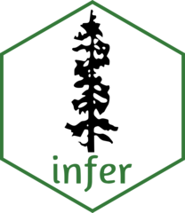{.hex}
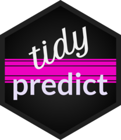{.hex}
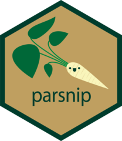{.hex}
:::
::: {.hexrow .offset}
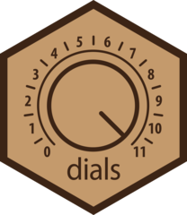{.hex}
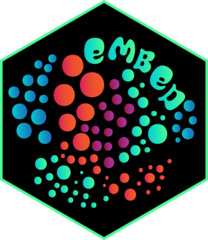{.hex}
{.hex}
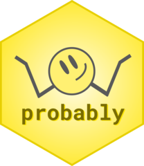{.hex}
:::
::::
```

:::: {.timeline .vertical-alt .tl-card style="--tl-gap: 1rem; --tl-color-line: #CA562C; --tl-color-dot: #CA562C; --tl-color-label: #CA562C;"}
:::: {.event data-label="2014"}
::: {.hexrow}
{.hex title="broom"}
:::
::::
:::: {.event data-label="2016"}
::: {.hexrow}
{.hex title="corrr"}
:::
::::
:::: {.event data-label="2017"}
::: {.hexrow}
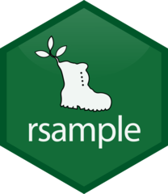{.hex title="rsample"}
{.hex title="recipes"}
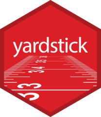{.hex title="yardstick"}
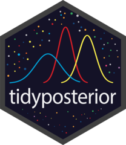{.hex title="tidyposterior"}
:::
::::
:::: {.event data-label="2018"}
::: {.hexrow}
{.hex title="tidymodels"}
{.hex title="infer"}
{.hex title="tidypredict"}
{.hex title="parsnip"}
:::
::: {.hexrow .offset}
{.hex title="dials"}
{.hex title="embed"}
{.hex title="textrecipes"}
{.hex title="probably"}
:::
::::
:::: {.event data-label="2019"}
::: {.hexrow}
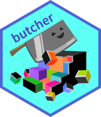{.hex title="butcher"}
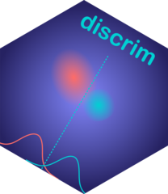{.hex title="discrim"}
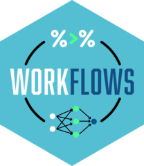{.hex title="workflows"}
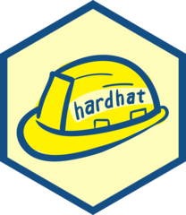{.hex title="hardhat"}
:::
::::
:::: {.event data-label="2020"}
::: {.hexrow}
{.hex title="themis"}
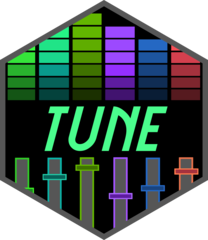{.hex title="tune"}
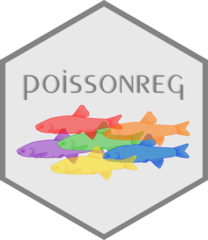{.hex title="poissonreg"}
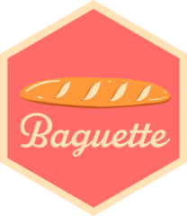{.hex title="baguette"}
:::
::: {.hexrow .offset}
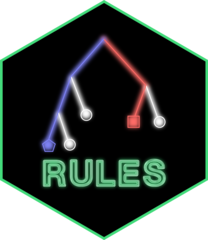{.hex title="rules"}
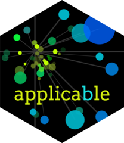{.hex title="applicable"}
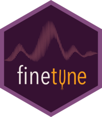{.hex title="finetune"}
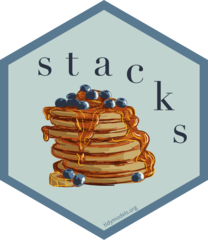{.hex title="stacks"}
:::
::::
:::: {.event data-label="2021"}
::: {.hexrow}
{.hex title="spatialsample"}
:::
::::
:::: {.event data-label="2022"}
::: {.hexrow}
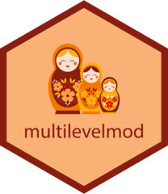{.hex title="multilevelmod"}
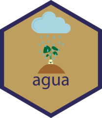{.hex title="agua"}
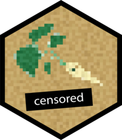{.hex title="censored"}
:::
::: {.hexrow .offset}
{.hex title="bonsai"}
{.hex title="tidyclust"}
:::
::::
::::


## Wrapping up

Three examples, one idea: 
treat the `.event` as a normal block of content and the timeline handles the arrangement. 

The full documentation, including the gallery, lives at
<https://emilhvitfeldt.github.io/quarto-timeline/>.
