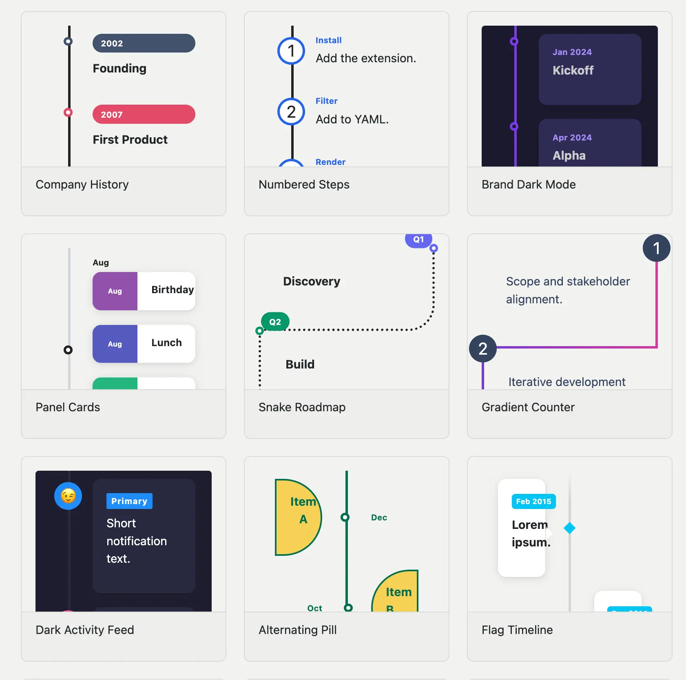

I'm happy to announce [quarto-timeline](https://emilhvitfeldt.github.io/quarto-timeline/), 
a Quarto extension for creating styled timelines in HTML documents and RevealJS presentations.

## Installation

```bash
quarto add EmilHvitfeldt/quarto-timeline
```

Then add the filter to your document YAML:

```yaml
filters:
  - timeline
```

## Writing timelines

Timelines are written as nested divs. The outer `.timeline` div sets the layout; each inner `.event` div is one entry, with a `data-label` attribute for the marker text.

```markdown
::: {.timeline}
::: {.event data-label="2020"}
**Project Started**
Initial concept and planning phase.
:::
::: {.event data-label="2021"}
**First Release**
Launched version 1.0 to early users.
:::
::: {.event data-label="2022"}
**Major Update**
Rewrote core engine for performance.
:::
:::
```

::: {.timeline}
::: {.event data-label="2020"}
**Project Started**
Initial concept and planning phase.
:::
::: {.event data-label="2021"}
**First Release**
Launched version 1.0 to early users.
:::
::: {.event data-label="2022"}
**Major Update**
Rewrote core engine for performance.
:::
:::

## Layouts

There are a number of didferent ways we can change how the timeline looks.
the first one is by changing the [layout](https://emilhvitfeldt.github.io/quarto-timeline/layouts.html)
You can switch between the layouts by adding classes to the `.timeline` divs. 

Below is a `.vertical` timeline.

::: {.timeline .vertical}
::: {.event data-label="2020"}
**Project Started** — Initial concept and planning phase.
:::
::: {.event data-label="2021"}
**First Release** — Launched version 1.0 to early users.
:::
::: {.event data-label="2022"}
**Major Update** — Rewrote core engine for performance.
:::
::: {.event data-label="2023"}
**Scale Up** — Reached 1 million users worldwide.
:::
:::

And a `.vertical-alt` timeline.

::: {.timeline .vertical-alt}
::: {.event data-label="2020"}
**Project Started**
Initial concept and planning phase.
:::
::: {.event data-label="2021"}
**First Release**
Launched version 1.0 to early users.
:::
::: {.event data-label="2022"}
**Major Update**
Rewrote core engine for performance.
:::
::: {.event data-label="2023"}
**Scale Up**
Reached 1 million users worldwide.
:::
:::

Multiple events sharing the same `data-label` are automatically grouped under a single marker.

::: timeline
::: {.event data-label="2020"}
**Project Started**
Initial concept and planning phase.
:::
::: {.event data-label="2020"}
**Team Formed**
Hired first three engineers.
:::
::: {.event data-label="2021"}
**First Release**
Launched version 1.0 to early users.
:::
::: {.event data-label="2022"}
**Major Update**
Rewrote core engine for performance.
:::
:::

An event with no content with just a `data-label`,
will still appear on the timeline.
Allowing you to indicate gaps more easily.

::: {.timeline .vertical}
::: {.event data-label="2020"}
**Project Started** — Initial concept and planning phase.
:::
::: {.event data-label="2021"}
**First Release** — Launched version 1.0 to early users.
:::
::: {.event data-label="2022"}
:::
::: {.event data-label="2023"}
**Scale Up** — Reached 1 million users worldwide.
:::
:::

## Customization

Visual properties are exposed as CSS custom properties on `.timeline`, 
so you can override them inline or document-wide. 
The full reference is on the [customization page](https://emilhvitfeldt.github.io/quarto-timeline/customization.html).

There are modifier classes for common variations. 
Here is `.tl-card` with `.tl-label-banner` on a vertical alternating layout:

::: {.timeline .vertical-alt .tl-card .tl-label-banner style="--tl-color-line: #3b82f6; --tl-color-dot: #3b82f6; --tl-color-label: #3b82f6;"}
::: {.event data-label="2020"}
**Project Started**
Initial concept and planning phase.
:::
::: {.event data-label="2021"}
**First Release**
Launched version 1.0 to early users.
:::
::: {.event data-label="2022"}
**Major Update**
Rewrote core engine for performance.
:::
::: {.event data-label="2023"}
**Scale Up**
Reached 1 million users worldwide.
:::
:::

Overriding CSS variables inline:

```markdown
::: {.timeline .vertical-alt .tl-card .tl-label-banner style="--tl-color-line: #3b82f6; --tl-color-dot: #3b82f6; --tl-color-label: #3b82f6;"}
...
:::
```

## RevealJS fragments

In RevealJS presentations, 
add `.fragment` to individual `.event` divs to reveal them one at a time as you advance. 
The [fragments page](https://emilhvitfeldt.github.io/quarto-timeline/fragments.html) covers all the options, 
including two pan modes (`.fragment-slide` and `.fragment-conveyor`) for timelines with more events than fit on a slide.

<iframe class="slide-deck" src="_fragment-example.html" style="width: 100%; height: 500px;">
</iframe>

## Gallery and docs

The full documentation lives at <https://emilhvitfeldt.github.io/quarto-timeline/>, 
including a [gallery](https://emilhvitfeldt.github.io/quarto-timeline/gallery.html) of styled examples showing what's possible with the built-in modifier classes and CSS variables.

