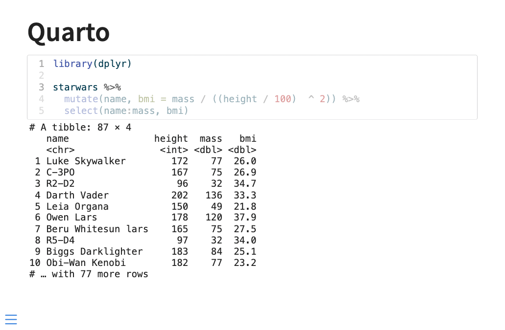
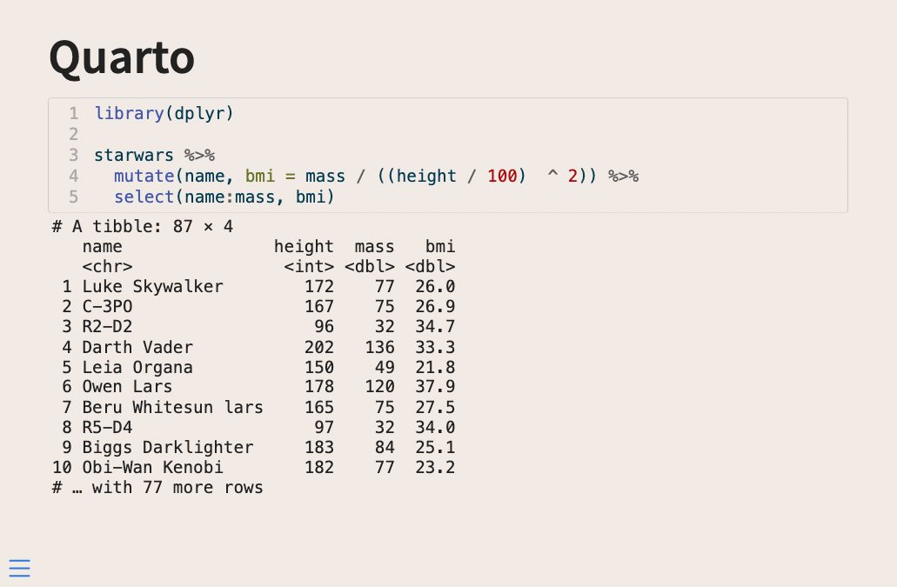
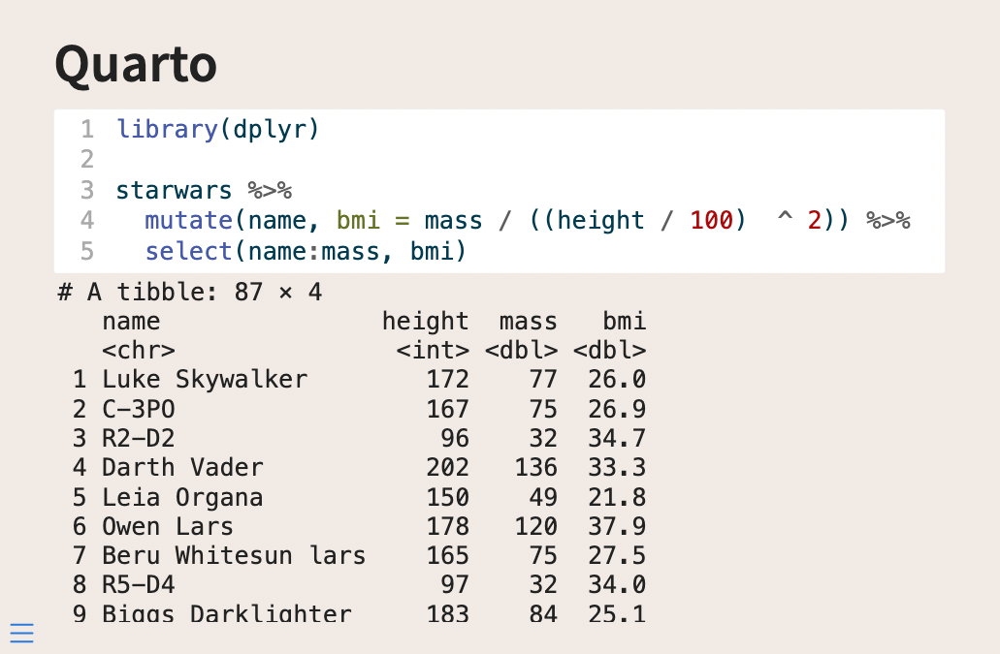
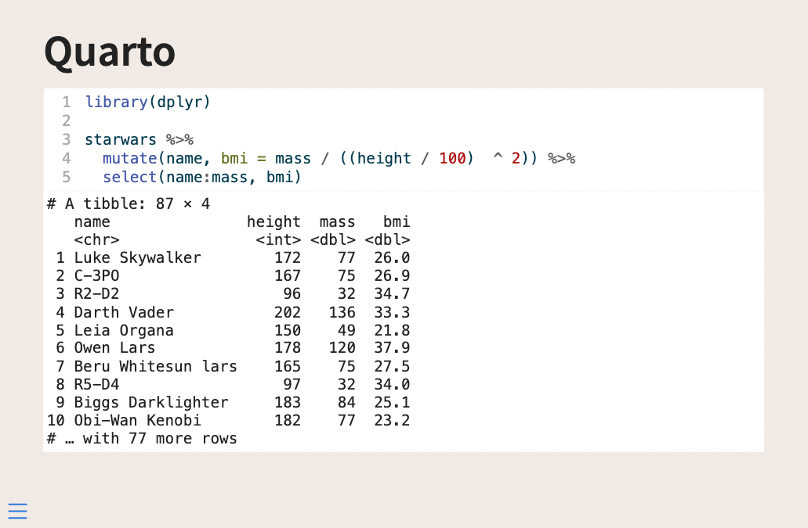
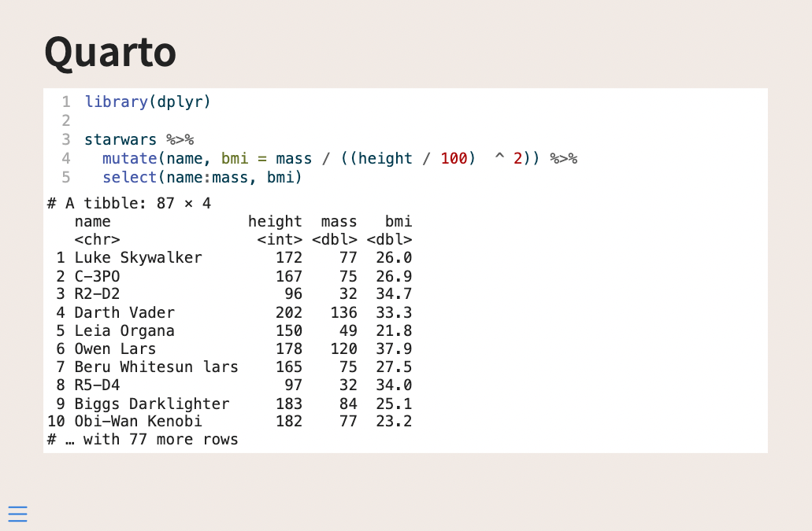
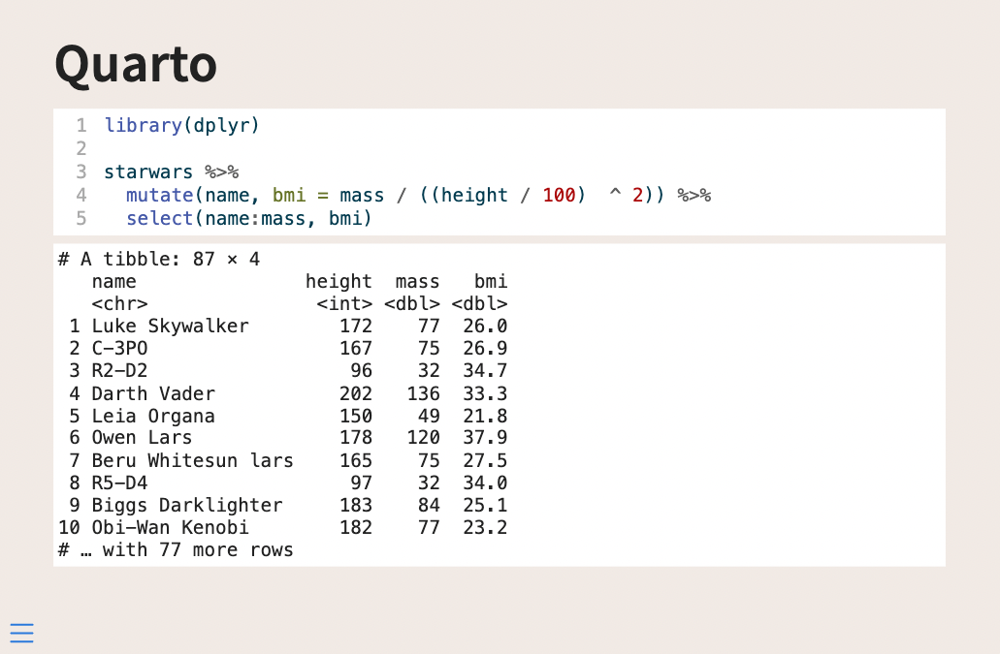
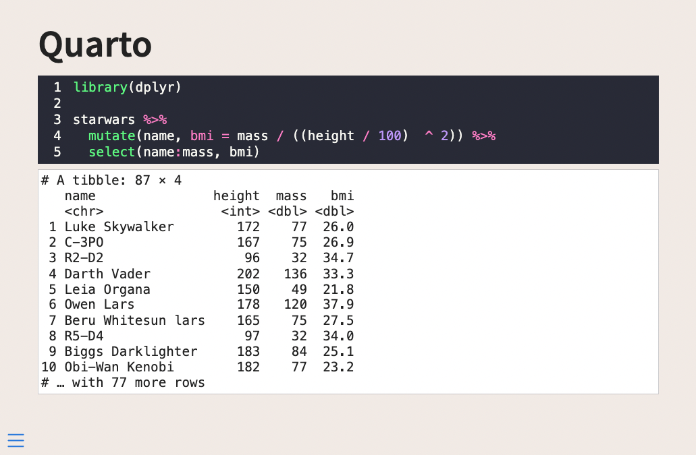
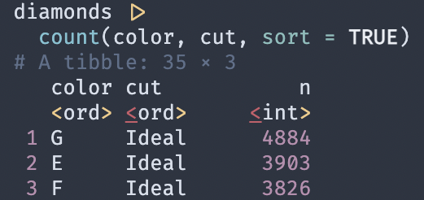
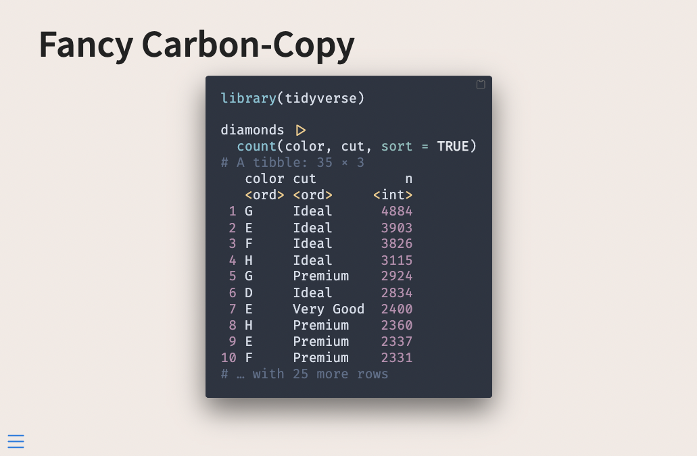

::: {.callout-note}
The information contained in this blogpost has been cleaned up and reformulated on <https://slidecrafting-book.com/>.
:::

Hello and welcome back to my multi-part series about what I like to call **slidecrafting**; The art of putting together slides that are functional and aesthetically pleasing. I will be using [quarto presentations](https://quarto.org/) as my medium, but the advice should be fairly tool-agnostic. This is the second post, you can find all other posts in the [slidecraft 101](../../project/slidecraft-101/index.qmd#blog-posts) project.

Today we will be looking at how we can style the code and the resulting output from our code chunks using the different options that quarto provides, as well as how we can use CSS to jazz it up even further.

## Style Code

to start with we need some code that produces some output, I'll use the following dplyr example, but any code and language will work the same. Notice how we are setting `echo: true` to include the source code in the output.

````r
```r
#| echo: true
library(dplyr)

starwars %>% 
  mutate(name, bmi = mass / ((height / 100)  ^ 2)) %>%
  select(name:mass, bmi)
```
````

without any styling, this gives us the following slide


Now we have a couple of my favorite quarto arguments and then some CSS.

First, we have `code-copy` and `code-link` which both can be found in [quarto revealjs reference](https://quarto.org/docs/reference/formats/presentations/revealjs.html#code). `code-copy` adds a little icon that when clicked copies the entire code block (super useful for teaching/reference slides) and `code-link` allows you to have [downlit](https://downlit.r-lib.org/) add clickable links to function in the code.

Lastly, I will point out `code-line-numbers`. This argument can either turn off or on the line numbers in the code block. This is nice and has a lot of benefits. Firstly you can turn off the numbering if you don't find that it is a good use of slide real estate. Secondly, you can specify line numbers to be put into focus. So setting `code-line-numbers: "1,3"` in the above example yields us the following output



Which is a quick and easy way for you to direct the viewer's attention. 

Next, let us talk about some styling. Before we do anything custom ourselves I should note that the 10 different built-in themes also affect the styling of the code and output, and these might give you what you need.


If you want to do a little bit more you need to get your hands dirty with some CSS and SCSS. Much like we did in the [first blog post](https://www.emilhvitfeldt.com/post/slidecraft-colors-fonts/#applying-colors) we are setting up a theme and applying it. I'm going with this new sandy background color I found.



what I don't like about this slide right now is that the code block doesn't stand out that much. We have 3 major sass variables I want to introduce today; `$code-block-bg`, `$code-block-border-color`, and `$code-block-font-size`. `$code-block-bg` as the name suggests modifies the background of the code block, setting this color to white makes the code pop a little bit more


We can also change the border color with `$code-block-border-color`. This quantity defaults to being a lightened version of the main text color. We can instead set it to be a slightly darker version of the background color by setting `$code-block-border-color: darken($body-bg, 20%);` and getting this


Or remove it entirely by setting it to be transparent with `$code-block-border-color: #00000000;`, for this look:


Lastly, we can change the font size with `$code-block-font-size`. While the size is pretty good right now, it is important that we know how to change it as it will depend on the fonts we use throughout the theme.

Below is an example where I turned up the size every so slightly



## Style Output

The next thing we want to look at is how to style the output. I found that adding styles to `.reveal pre code` did the trick in only changing the output, not the source.

Using the following code in our `.scss` file

````scss
/*-- scss:rules --*/

.reveal pre code {
  background-color: #FFFFFF;
}
````

Will give us the following output



Which is already Quite a bit better. For this, I would do either one of two things.

- Make the source and output appear to be one large box
- Separate the source and output more clearly

Let us see how we can do both of these things.

To make the source and output appear as one, we need to modify the source box, since it has a little bit of a border that is making them unequal. Setting `.reveal div.sourceCode {border: none}` should remove the existing border, and we can remove the slight rounded border as well by also adding `border-radius: 0px;`. This gives a full `.scss` as follows

````scss
/*-- scss:defaults --*/
$theme-sand: #F1EAE5;
$theme-white: #FFFFFF;

$body-bg: $theme-sand;
$code-block-bg: $theme-white;

/*-- scss:rules --*/
.reveal pre code {
  background-color: $theme-white;
}

.reveal div.sourceCode {
  border: none;
  border-radius: 0px;
}
````

This gives us the following slides



If we want some space, we can add `margin-bottom: 10px !important;` to the `.reveal div.sourceCode` specification, making it so there will be 10 pixels worth of space below the source, which gives some spacing between the two boxes. You need the `!important` to overwrite a more general style specification.

Making it so that part of the `.scss` file now looks like this

````scss
.reveal div.sourceCode {
  border: none;
  border-radius: 0px;
  margin-bottom: 10px !important;
}
````

And you now have a little bit of air between the boxes



## Change highlighting theme

One thing we haven't looked at yet is how to change the highlighting theme. We will see how we can do that here. This is an often overlooked part of a presentation, that if you spend some time can tie your presentation together.

This is being controlled in the `highlight-style` argument. I would generally recommend that you set this option globally in your document by including it in your YAML file like so

````yaml
---
format:
  revealjs: 
    theme: [default, custom.scss]
highlight-style: "dracula"
---
````

Which would result in the following output



::: {.callout-warning}
Some of the themes such as the `"dracula"` theme come with a built-in background color. If you set `$code-block-bg` in your `.scss` file it will be overwritten.
:::

````json
{
    "text-color": null,
    "background-color": "#f8f8f8",
    "line-number-color": "#aaaaaa",
    "line-number-background-color": null,
    "text-styles": {
        "Other": {
            "text-color": "#8f5902",
            "background-color": null,
            "bold": false,
            "italic": false,
            "underline": false
        },
        "Attribute": {
            "text-color": "#c4a000",
            "background-color": null,
            "bold": false,
            "italic": false,
            "underline": false
        },
````

There are [many different highlighting themes](https://github.com/quarto-dev/quarto-cli/tree/main/src/resources/pandoc/highlight-styles) that come shipped with Quarto. The ones with `-dark` and `-light` postfixes are themes that will adjust depending on whether your slides are dark or light.

If none of these are what you want, you can create your own. I would suggest taking one of the themes you like from the list linked above and modifying it to your liking. Copy that file into the same directory as your slides, and point to the file name instead. Like so:

````yaml
---
format:
  revealjs: 
    theme: [default, custom.scss]
highlight-style: "darkula.theme"
---
````

If your slides use both dark and light backgrounds you will likely need two sets of highlighting theme files, which you can set with:

````yaml
---
format:
  revealjs: 
    theme: [default, custom.scss]
highlight-style:
  light: light.theme
  dark: dark.theme
---
````

I slowly modified the base theme, using the [Working with Color Themes documentation](https://docs.kde.org/trunk5/en/kate/katepart/color-themes.html) to help me figure out what the different names mean.

Another thing that can aid, is opening the developer tools in your browser and hovering over the kind of elements you care about. Below I am doing just that, and I see that the pipe is of class `sc`


From that, you can look at this list and see that it is a `SpecialChar` and you can modify your theme accordingly.

- ot: **Other** 
- at: **Attribute**
- ss: **SpecialString**
- an: **Annotation**
- fu: **Function**
- st: **String** 
- cf: **ControlFlow** 
- op: **Operator** 
- er: **Error** 
- bn: **BaseN** 
- al: **Alert** 
- va: **Variable** 
- pp: **Preprocessor** 
- in: **Information** 
- vs: **VerbatimString** 
- wa: **Warning** 
- do: **Documentation** 
- ch: **Char** 
- dt: **DataType** 
- fl: **Float** 
- co: **Comment** 
- cv: **CommentVar** 
- cn: **Constant** 
- sc: **SpecialChar** 
- dv: **DecVal** 
- kw: **Keyword** 

With these changes in place, I get to the following slides


For this theme, I also updated `.reveal pre code` to change the background color and the text color of the output to match the rest of the theme.

You generally don't need to update all the items in the theme as you are unlikely to use all of them. I tend to update as I go, only updating the classes that I use.

## Use fonts with ligatures

I just added some new code to a slide


and this code uses some multi-character symbols like `!=` and `|>`. These and many like them are common all over the different programming languages, so much so that people have created special fonts with ligatures to make them prettier.

One such font is [FiraCode](https://github.com/tonsky/FiraCode).


And we can add these types of fonts to our slides as well! Start by downloading the font from the site, and copy over a `.woff` and `.woff2` file to your slide directory. I selected `FiraCode-Regular.woff` and `FiraCode-Regular.woff2`.

In the `/*-- scss:defaults --*/` part of our `.scss` file, we are going to add the following code. This is done to register the font family from the files we have included and to have it selected for use for monospace fonts.

````scss
@font-face {
    font-family: 'FiraCode';
    src: url('../../../../../FiraCode-Regular.woff2') format('woff2'),
         url('../../../../../FiraCode-Regular.woff') format('woff');
}

$font-family-monospace: 'FiraCode';
````

You might have noticed some ugliness with the `../../../../../`s. To my knowledge, this is the best way of using a local font-face from a file.

With all of that, we now have beautiful ligatures


## Step up your style

Every time I have shared some code with [carbon.now.sh](https://carbon.now.sh/) people go crazy because it always looks so good. And I agree, the defaults are really really nice. 

So we are going to replicate this. This is going to be a little more involved, but if you don't have that much code on your slides it will be a nice touch!

What I do in this case is use [reprex](https://reprex.tidyverse.org/) to generate the code and output as one, I paste that into my chunk and turn off evaluation with `#| eval: false`. I do this because then I don't have to worry about styling the output to match.

I switch over to using the `"nord"` highlight palette. It has this weird mistake because it thinks that the opening bracket is an error. 



I could copy over the `.theme` file and modify it in the right place, but I'm lazy and modify it directly in the `.scss` file instead by adding which will fix the color and remove the underline

````scss
code span.er {
  color: #ebcb8b;
  text-decoration: none;
}
````

The line numbers are not too important this code chunk so I set `#| code-line-numbers: false`. Then I start working on styling the source div.

````scss
.reveal div.sourceCode {
  border: none;
  border-radius: 5px;
  margin-bottom: 10px !important;
  box-shadow: 0 20px 47px rgb(0 0 0 / 55%);
  width: fit-content;
  margin: auto !important;
}
````

The main thing that changes is that I brought back the `border-radius`. I added some `box-shadow`s. These things alone make a huge difference in appearance.

Next, I changed `width: fit-content;`, this makes it so the width of the div changes with the width of the code, the code I have right now isn't that wide and it looked a little lopsided. Lastly, I set `margin: auto !important;`, which centers the div so it doesn't cling to the left side.

The very final thing I changed is adding some padding to the code, this is the space between the code itself and the inside border of the div, I did this by adding

````scss
.reveal div.sourceCode pre code {
  padding: 25px;
}
````

All of this results in the following slide:



## Roundup

I hoped you learned a lot! There are a lot of themes, colors, and options to play with. But with a little patience, you can create some nice code chunks for your slides.

Here are the [.qmd file](_example_code.qmd) and the [.scss file](custom.scss) used for the last example in this post.
