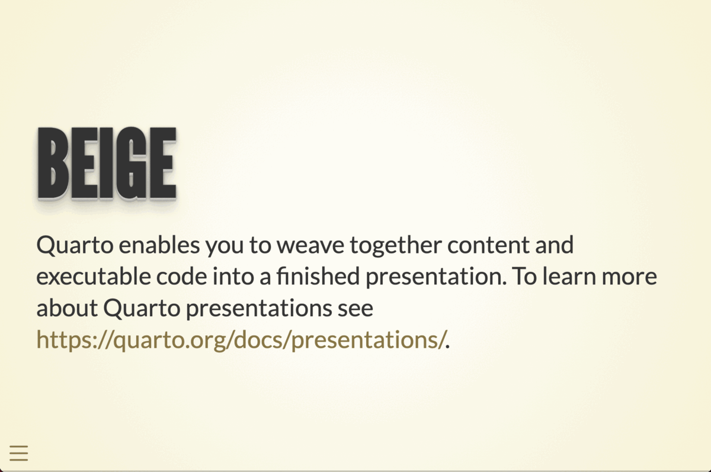
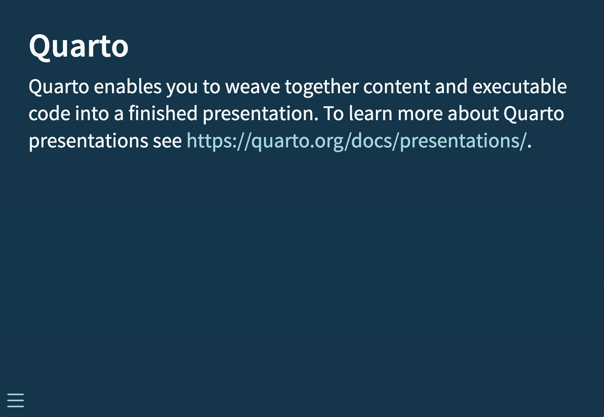
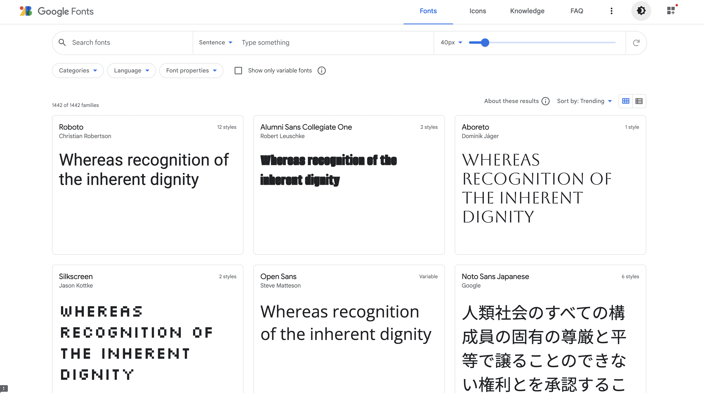
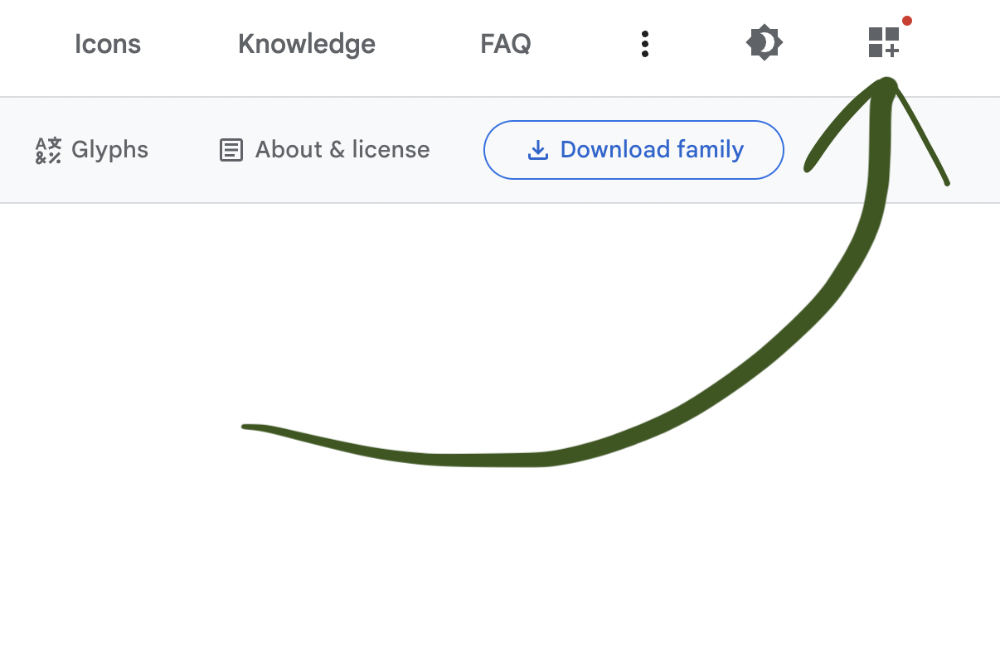
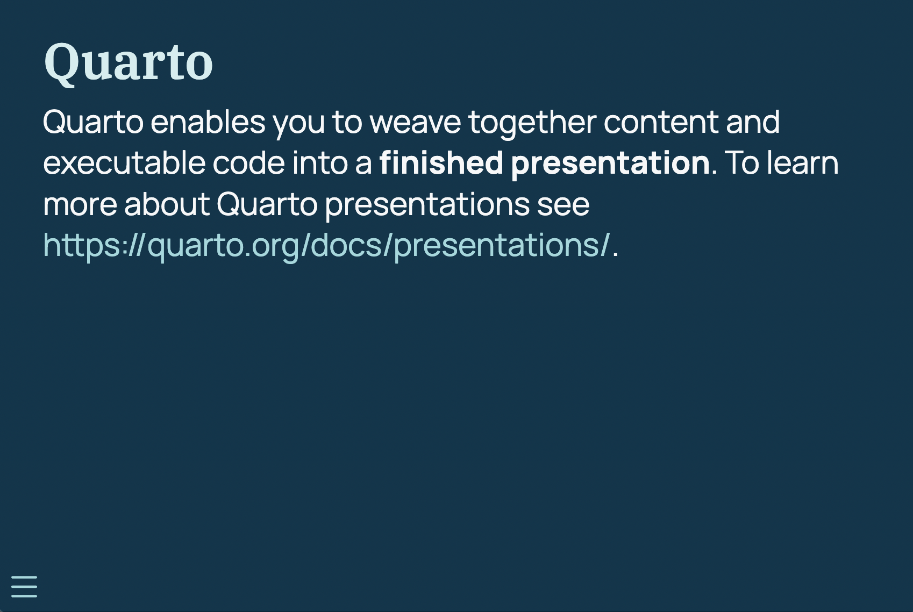
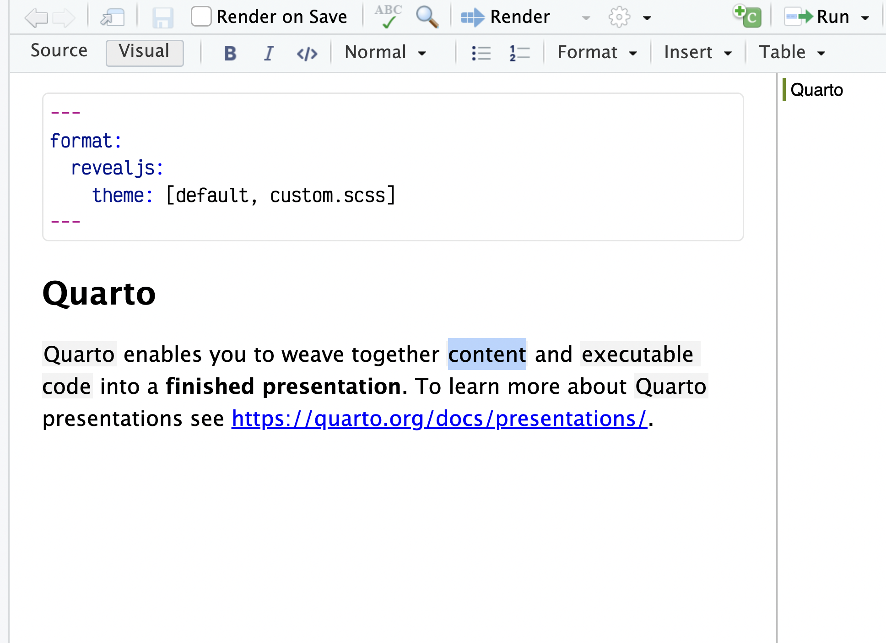
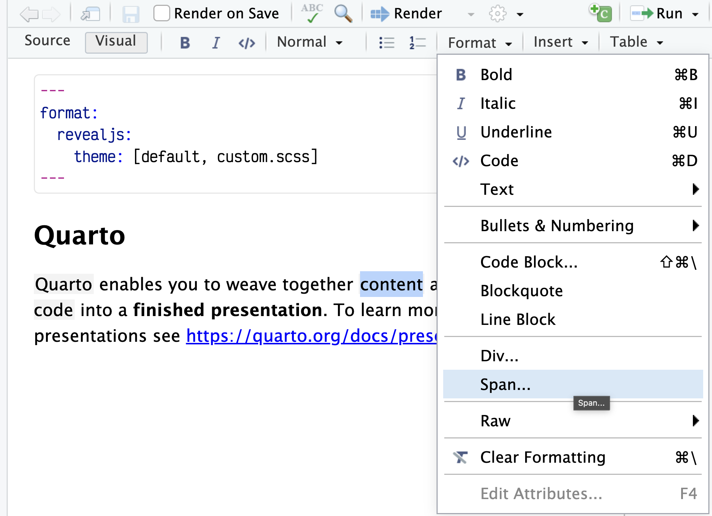
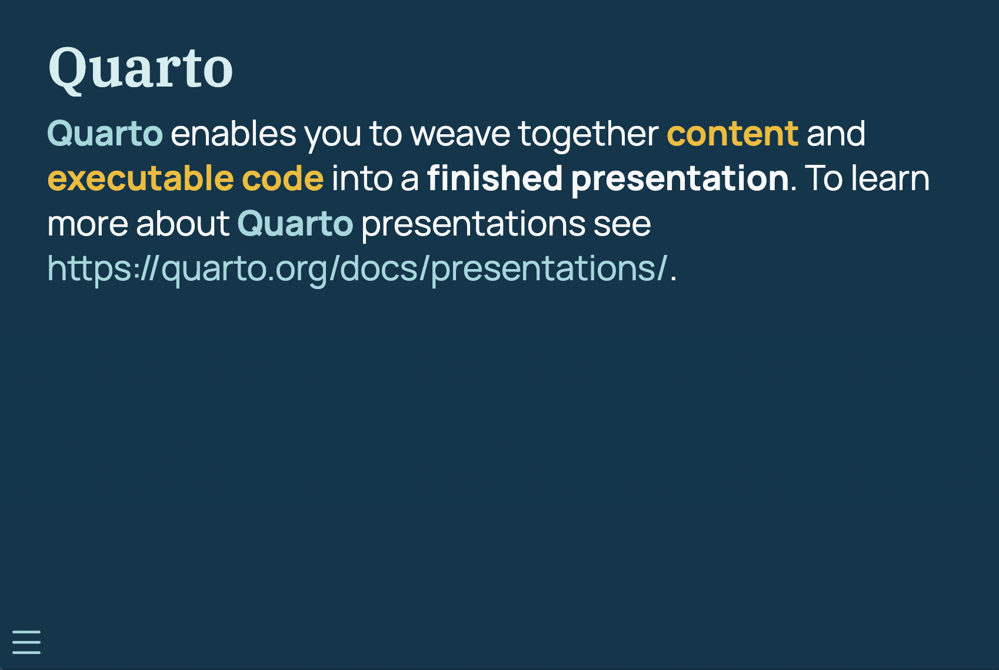
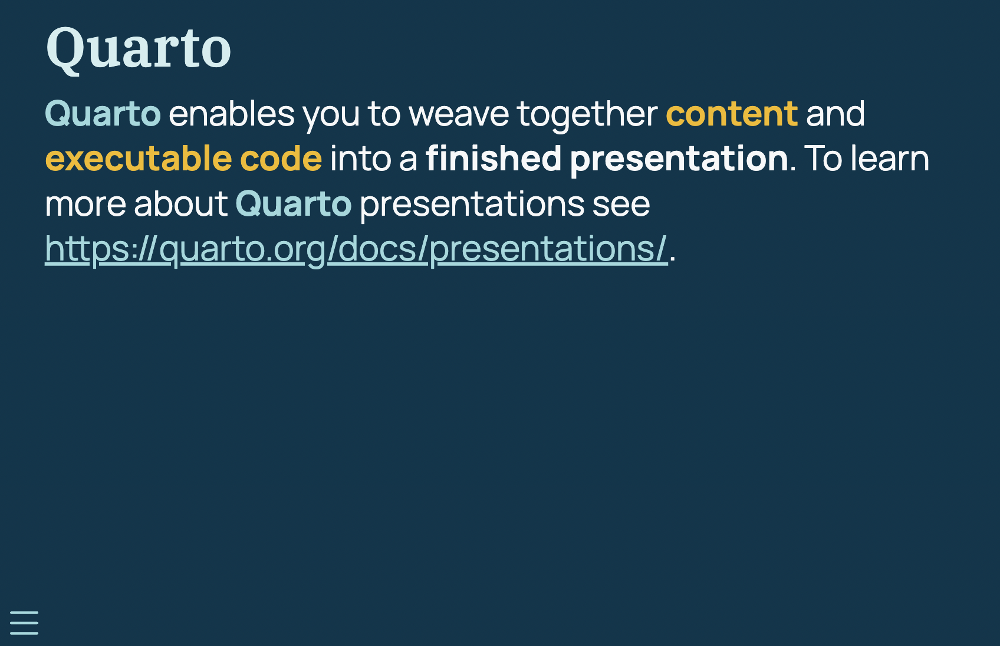

Hello! This will be a multi-part series about what I like to call **slidecrafting**; The art of putting together slides that are functional and aesthetically pleasing. I will be using [quarto presentations](https://quarto.org/) as my medium, but the advice should be fairly tool-agnostic. 

I think of slidecrafting as an art because of the inexact nature of many of the decisions you will be making. After all many slide decks can be distilled down into a series of still images, each of which should be carefully crafted.

This series will not be able to teach you everything you need, but it will cover the parts of the process that stay constant from deck to deck, so you can focus on the content and develop your brand/style. You can find all other posts in the [slidecraft 101](../../project/slidecraft-101/index.qmd#blog-posts) project.

## Theming

When I think of theming I think of all the different parts of the page I can change, this includes colors, fonts, sizes, shapes, etc etc. The two most impactful elements of a theme to modify are **colors** and **fonts**, let us see how we can find and apply these few changes.

A little can go a long way! We like to joke that styling slides are a never-ending task. And while that is accurate, especially if you are a perfectionist or a beginner in the CSS/JS landscape, it shouldn't be a reason why you don't do any styling at all. If I'm strapped for time, I will spend 20-30 minutes up front creating and applying a minimal theme. After reading this post you should be able to as well.

In a quarto presentation, we can [customize the theme](https://quarto.org/docs/presentations/revealjs/themes.html#customizing-themes) beyond the basics by supplying a [.scss](https://sass-lang.com/) file.

We can set this up by using the `theme` argument to the `revealjs` format like so:

````r
---
format:
  revealjs: 
    theme: [default, custom.scss]
---
````

Next, we create the corresponding `custom.scss` file, which we will populate throughout this post. These comments are functional, we will go over what to put where when we get to it.

````scss
/*-- scss:defaults --*/

/*-- scss:rules --*/

````

## Finding Colors

When finding your colors you will mainly look for 3 different types of colors:

- background colors,
- text colors,
- contrast colors

this is a simplistic model and it will do us just fine. In general, I think having 3-6 colors is about the right amount of colors. This doesn't mean that you couldn't have 10 colors in your theme, but that you should be very deliberate in your choices.

For a small color theme, you would want a light and dark color for the background and text color. Dark text on a light background, or light text on dark background. Lastly, you pick a contrast color, something that looks good with both your background and text color.

This is what you get with the default themes that are provided in Quarto, and you can see them here in this gif:



This is also a perfect place to start looking for inspiration. using these themes with one or two modifications might get you all the way where you want to go. It is in general a good idea to look for inspiration in other people's work.

Another personal favorite place of mine to go color theme hunting is on [pinterest](https://www.pinterest.com/). I do a google search for "Pinterest color palettes" and go wild. 


If you have any specific ideas in mind you can expand your search to include words like "sea", "beach", "Halloween", or "pastel".

The main thing you need to keep in mind, and the biggest difference from other types of colors you may have worked with, such as in data visualization, is that you need to have **high contrast** between your colors. This is by far the most important thing that separates a good theme from a bad theme. The goal for your slides is for other people to see them, if your contrast is low then people can't.

There are many color contrast checking websites out there, I like the [https://colourcontrast.cc/](https://colourcontrast.cc/) and [Color Contrast Checker by Coolors](https://coolors.co/contrast-checker/580b3a-f8f8f8). If possible I try to have a contrast of at least 12, but something like 10 will be okay from time to time. Which is quite a high contrast without being impossible to hit.


This contrast requirement means that both your background and text color will be quite dark and light, as it is quite hard for most highly saturated colors to have high contrasts to anything else.

::: {.callout-warning}
You should try to avoid pure black and pure white. These colors can be a bit much and can be unpleasant to look at for long periods of time.
:::

This contrast is related to font size, the smaller and finer the text is, the more important it is that you have good contrast.

Next, we take a look at **highlight** colors! This is my term for the colors you use to add some pop and to direct the viewers' eyes. These colors are used for anything from link colors, highlighting, buttons, and artistic elements. 

you generally want 1 to 3 of these colors. Having at least 1 is perfectly sufficient and you can use it to great effect to direct the colors. 3 colors are where I'm still comfortable that they don't get diluted. Using too many highlighting colors can confuse your viewers.

These colors should be different enough from the background and text color that they stand out. If you are using multiple highlighting colors you should make sure that they are colorblind-friendly with each other. I like to use the `check_color_blindness()` function from the [prismatic](https://emilhvitfeldt.github.io/prismatic/) package.


As we see above, the green and red colors don't work well together because they are almost identical for people with Deuteranopia.

To recap:

- I think of or search for a palette I like
- I pull out 1-2 background colors, 1-2 text colors, and 1-3 highlight colors
- I use my color contrast checkers to validate and possibly modify my colors so that they are within range
- I check that the colors I have are colorblind-friendly
- ...
- Done!

As long as I can keep the searching under 10 minutes the whole theme creation doesn't take more than 15 minutes.

## Applying Colors

Let us try all of that in practice. I found this nice [blue and yellow](https://www.pinterest.com/pin/281123201723784541/) color palette on Pinterest.


using a color picking tool, I love [ColorSlurp](https://colorslurp.com/) I can extract the colors to be


```r
*Orient*
02577B

*Fountain Blue*
5CB4C2

*Morning Glory*
99D9DD

*Mystic*
E1E8EB

*Selective Yellow*
F4BA02
```

I'm thinking I want to use dark blue as my background colors, and the lightest color as my text color. Before I do any modification I get the following


And by playing the sliders a little bit I have a contrast and some colors I'm happy with


We now open up our `.scss` file and fill in a couple of values. Many of the colorings are done by relations, so we can get a lot done by setting `$body-bg`, `$body-color`, and `$link-color`. This needs to be done inside `scss:defaults`.

````scss
/*-- scss:defaults --*/
$body-bg: #01364C;
$body-color: #F7F8F9;
$link-color: #99D9DD;

/*-- scss:rules --*/

````

While the above configurations are perfectly fine, I find that using [sass](https://quarto.org/docs/presentations/revealjs/themes.html#creating-themes) [variables](https://sass-lang.com/documentation/variables) to be clear, and it helps us tremendously if we start making more changes. So I create variables all with the prefix `theme-` and descriptive names so I know what is what.

::: {.callout-tip}
I suggest that you read [slidecraft 101: Better SCSS files](../slidecraft-scss-uses/index.qmd) if you find this helpful, as it takes these ideas to the next level.
:::

````scss
/*-- scss:defaults --*/
$theme-darkblue: #01364C;
$theme-blue: #99D9DD;
$theme-white: #F7F8F9;
$theme-yellow: #F4BA02;

$body-bg: $theme-darkblue;
$body-color: $theme-white;
$link-color: $theme-blue;

/*-- scss:rules --*/

````

This is more code, but now I can read at a glance what is happening. This gives us the following colors on our slides. All done with minimal code and effort. Using one of the highlight colors here to color the links, which also affects the hamburger menu and the progress bar at the bottom.



There are [several sass variables](https://quarto.org/docs/presentations/revealjs/themes.html#sass-variables) that are used to control how our slides look. Notice how many of the values are defined as transformations of other values. So by setting `$body-bg`, `$body-color`, and `$link-color` we automatically gets things like `$text-muted`, `$selection-bg`, `$border-color` with values that works pretty well.

Let us modify our theme just a bit more before moving on to fonts. We can use [sass color functions](https://sass-lang.com/documentation/modules/color) to modify colors based on our theme.

I want the headers to pop a little bit more, So I'm going to see if I can make them ever so slightly lighter blue. I see that the sass variable that controls the header color is `$presentation-heading-color` and that it defaults to `$body-color`. I use the `lighten()` function with `$theme-blue`, iterating a couple of times to find the perfect value.

````scss
/*-- scss:defaults --*/
$theme-darkblue: #01364C;
$theme-blue: #99D9DD;
$theme-white: #F7F8F9;
$theme-yellow: #F4BA02;

$body-bg: $theme-darkblue;
$body-color: $theme-white;
$link-color: $theme-blue;
$presentation-heading-color: lighten($theme-blue, 15%);

/*-- scss:rules --*/

````


## Finding Fonts

We find fonts the same way we find color; using our favorites of lots of googling. I always gravitate towards [fonts.google.com](https://fonts.google.com/). Generally, it is nice to use these online fonts because they are free and you don't have to embed/ship them if you want to share your slides with others.



Once we are in here to can search around, looking for a font you like. For these slides, I'm going with [Manrope](https://fonts.google.com/specimen/Manrope) for the text, and [IBM Plex Serif](https://fonts.google.com/specimen/IBM+Plex+Serif) for the headers. You must find a legible font, with a couple of styles and bold/italics support. This is going to make your life a lot easier once you get going.

To use "select" these fonts for use, you click on these links for each font type combination.


Then you click this button to have a sidebar menu pop up.



This menu lets you select and deselect the fonts you have selected. When you are done, you can go to the "Use on the web" section, and click `@import`.


And you want to copy the code inside the `<style>` tags. We are now ready to apply these fonts to our slides!

## Applying Fonts

Start by adding the `@import` calls we found in the previous section. This should again go into the `scss:defaults` section of the `.scss` file. to modify the font we have 2 sass variables. First, we have `$font-family-sans-serif` to modify the general text, and `$presentation-heading-font` to modify the headers. Applying these changes gives us the following `.scss` file

````scss
/*-- scss:defaults --*/
$theme-darkblue: #01364C;
$theme-blue: #99D9DD;
$theme-white: #F7F8F9;
$theme-yellow: #F4BA02;

@import url('https://fonts.googleapis.com/css2?family=IBM+Plex+Serif:ital,wght@0,100;0,200;0,300;0,400;0,500;0,600;0,700;1,100;1,200;1,300;1,400;1,500;1,600;1,700&display=swap');
@import url('https://fonts.googleapis.com/css2?family=Manrope:wght@200;300;400;500;600;700;800&display=swap');

$body-bg: $theme-darkblue;
$body-color: $theme-white;
$link-color: $theme-blue;
$presentation-heading-color: lighten($theme-blue, 15%);

$font-family-sans-serif: 'Manrope', sans-serif;
$presentation-heading-font: 'IBM Plex Serif', serif;

/*-- scss:rules --*/

````

Which when renders results in the following slides.



Notice how the fonts we used allows us to bold the words "finished presentation".

Another thing you sometimes need to change depending on the font is the sizing of the text. The sass variable `$presentation-font-size-root` controls this, and defaults to `40px`. Changing this one variable will affect everything on your slides.

You can also change the code font, this should ideally be a monospaced font. This is done using the `$font-family-monospace` sass variable.

## Using CSS Classes

The last tip for this blog post is the idea of using CSS classes, which is a quick and powerful way to add styling to your slides.

Remember how we have 2 highlighting colors? We should have a way to apply these colors in our slides. For starters let us add a way to turn text these colors. Below are two CSS classes, named `.blue` and `.yellow`, that change the `color` and make the text bold with `font-weight: bold;`. Note that we need to put these classes into the `scss:rules` section.

````scss
/*-- scss:rules --*/

.blue {
  color: $theme-blue;
  font-weight: bold;
}

.yellow {
  color: $theme-yellow;
  font-weight: bold;
}
````

Now that we have our classes defined, you can either apply them using the visual editor in RStudio. Start by highlighting the text you want to apply the class to



Click "Format" and select "Span..." This will only apply the changes to the highlighted words, instead of the whole paragraph.



And then write in the class name in the "Classes" field. We see the word yellow by using the class ".yellow".


We can also apply these changes in the source editor by using the `[text]{.class}` syntax. I added (slightly excessive) highlighting to a couple of words. See below

````markdown
[Quarto]{.blue} enables you to weave together [content]{.yellow} and [executable code]{.yellow} into a **finished presentation**. To learn more about [Quarto]{.blue} presentations see <https://quarto.org/docs/presentations/>.
````

And we get the following slide



CSS classes were a game changer for my slide-making. It is a little bit more manual, but if you can write the CSS you can apply it to your slides which IMO is a super powerful tool.

There are also changes where you just want to modify the CSS directly, these changes should also be applied in the `scss:rules` section. For example, in our example so far, we have used the blue color both to color the links, and as a highlighting color. This is very confusing, so let us make sure that all links are underlined. We can make this happen by adding.

Note that CSS rules that target Reveal content generally need to use the `.reveal .slide` prefix to successfully override the theme’s default styles.

````scss
.reveal .slide a {
  text-decoration: underline;
}
````

And the changes have been applied.



## Roundup

I hoped you learned a lot! Creating and using themes might at first seem like a daunting task but I hope I have been able to convince you otherwise!

Here are the [.qmd file](_theme-example.qmd) and the [.scss file](custom.scss) used for the examples in this post.
