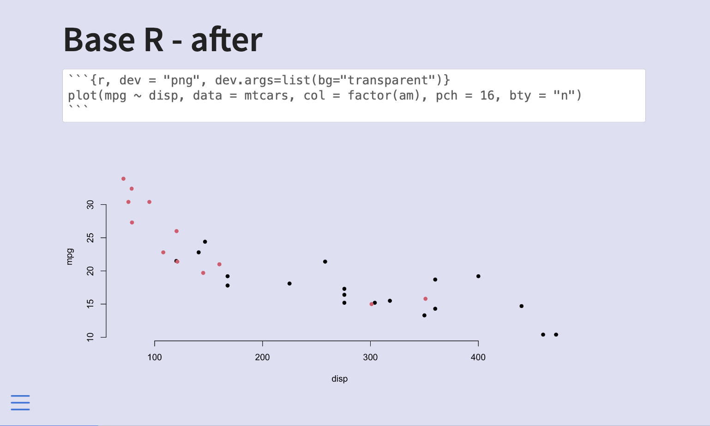
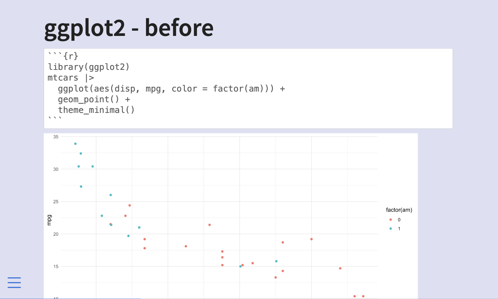
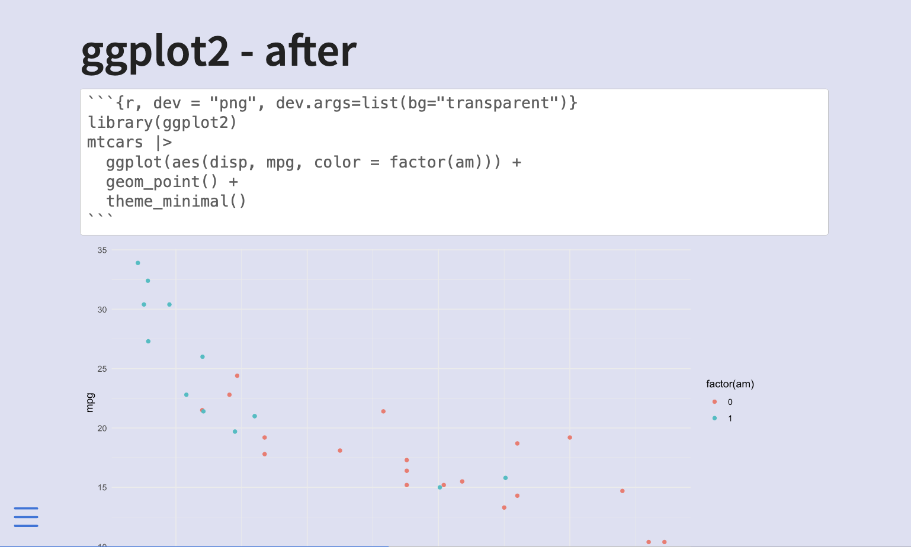
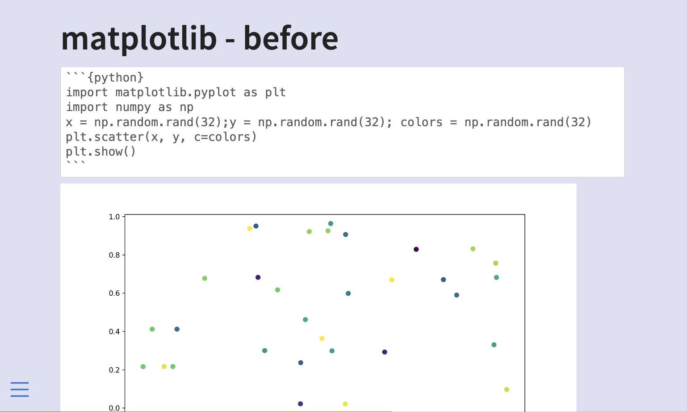
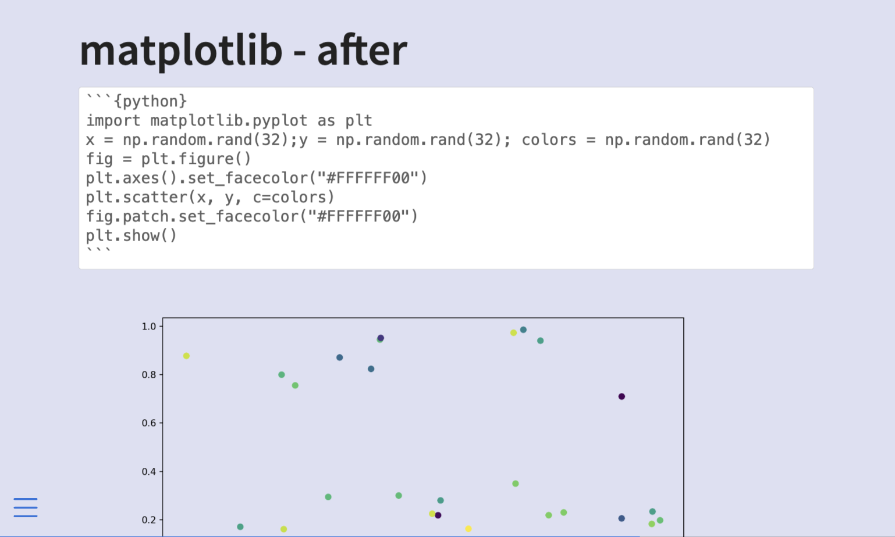
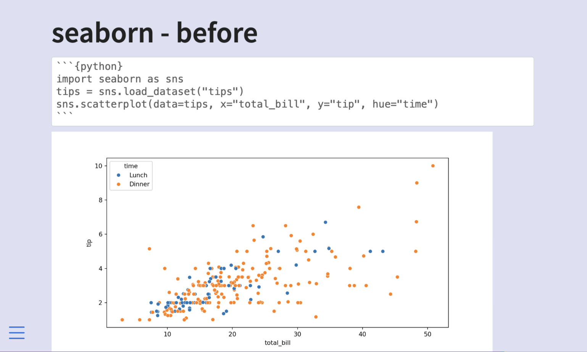
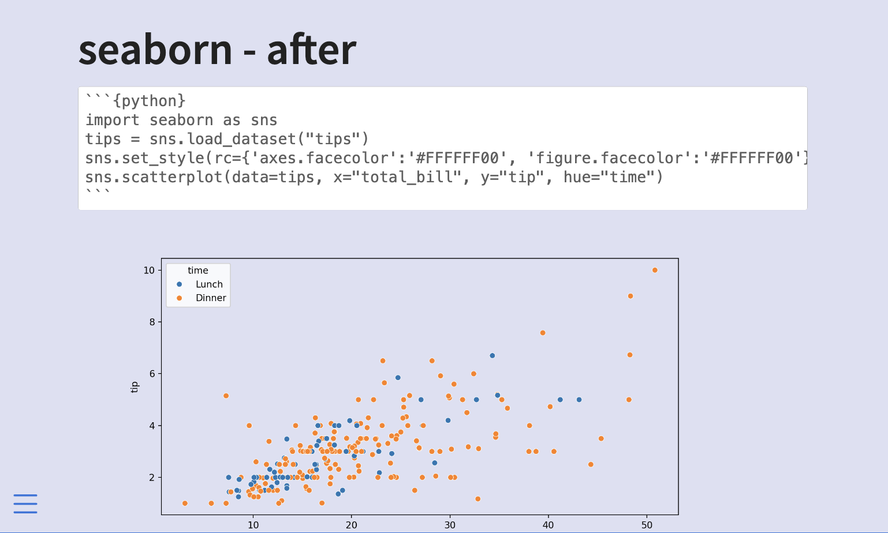

::: {.callout-note}
The information contained in this blogpost has been cleaned up and reformulated on <https://slidecrafting-book.com/>.
:::

Hello and welcome back to my multi-part series about what I like to call **slidecrafting**; The art of putting together slides that are functional and aesthetically pleasing. I will be using [quarto presentations](https://quarto.org/). This is the tenth post, you can find all other posts in the [slidecraft 101](../../project/slidecraft-101/index.qmd#blog-posts) project.

Plots and charts are useful in slides. Changing the background makes them fit in. This post will go over how to change the background of your plots to better match the slide background, in a handful of different libraries.

## Why are we doing this?

If you are styling your slides to change the background color, you will find that most plotting libraries default to using a white background color. If your background is non-white it will stick out like a sore thumb. I find that changing the background color to something transparent `#FFFFFF00` is the easiest course of action.

> Why make the background transparent instead of making it match the background?

It is simply easier that way. There is only one color we need to set and it is `#FFFFFF00`. This works even if the slide background color is different from slide to slide, or if the background is a non-solid color.

## base R

we don't have to make any changes to the R code, we can supply the chunk options `dev` and `dev.args` for the chunk to `"png"` and `list(bg="transparent")` respectively and you are good. The chunk will look like this.

````md
```{{r, dev = "png", dev.args=list(bg="transparent")}}
plot(mpg ~ disp, data = mtcars, col = factor(am), pch = 16, bty = "n")
```
````

You can also change the options globally using the following options in the yaml.

```yaml
knitr:
  opts_chunk:
    dev: png
    dev.args: { bg: "transparent" }
```

::: {layout-ncol=2}



:::

## ggplot2

ggplot2 are handled the same way as base R plotting, so we don't have to make any changes to the R code, we can supply the chunk options `dev` and `dev.args` for the chunk to `"png"` and `list(bg="transparent")` respectively and you are good. The chunk will look like this.

````md
```{{r, dev = "png", dev.args=list(bg="transparent")}}
library(ggplot2)
mtcars |>
  ggplot(aes(disp, mpg, color = factor(am))) +
  geom_point() +
  theme_minimal()
```
````

You can also change the options globally using the following options in the yaml.

```yaml
knitr:
  opts_chunk:
    dev: png
    dev.args: { bg: "transparent" }
```

::: {layout-ncol=2}



:::

## matplotlib

With matplotlib, we need to set the background color twice, once for the plotting area, and once for the area outside the plotting area.

```python
fig = plt.figure()
# outside plotting area
plt.axes().set_facecolor("#FFFFFF00")

# your plot
plt.scatter(x, y, c=colors)

# sinde plotting area
fig.patch.set_facecolor("#FFFFFF00")
```

::: {layout-ncol=2}



:::

## seaborn

For seaborn, we also set it twice, both of them in `set_style()`

```python
sns.set_style(rc={'axes.facecolor':'#FFFFFF00', 
                  'figure.facecolor':'#FFFFFF00'})
```

::: {layout-ncol=2}



:::

## Source Document

The above was generated with this document.

<a href="_examples.qmd" target="_blank" class="listing-slides btn-links">source document<a>

## Roundup

I just recently learned about {asciicast} and I love it. If you know of any other cool tools or packages, please reach out and share them with me!

