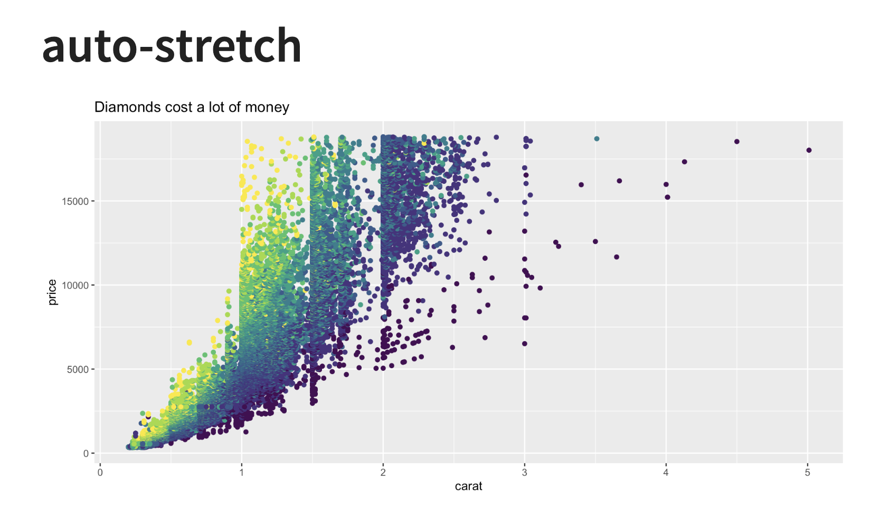

Hello and welcome back to my multi-part series about what I like to call **slidecrafting**; The art of putting together slides that are functional and aesthetically pleasing. I will be using [quarto presentations](https://quarto.org/). This is the 12th post, you can find all other posts in the [slidecraft 101](../../project/slidecraft-101/index.qmd#blog-posts) project.

Plots and charts are useful in slides. But we need to make sure they are sized correctly to be as effective as possible.

## auto-stretch option

Revealjs slides default to having the option [auto-stretch: true](https://quarto.org/docs/presentations/revealjs/advanced.html#stretch), this ensures that figures always fit inside the slide. You can turn it off globally like this.

```yaml
format:
  revealjs:
    auto-stretch: false
```

or on a slide-by-slide basis by adding the `.nostretch` class to the slide.

```md
## Slide Title {.nostretch}
```

We see how they affect sizing in the following slides first with the default, and second with `.nostretch`.




By themselves, they look pretty similar. One occasion where you really notice the difference is when there are other elements on the slide. `auto-stretch` makes sure the image fits by making the image smaller as seen below.


## Sizing Options

When sizing plots we need to remember that we have to deal with two kinds of sizes. First is the size of the actual file on disk, this is controlled using `out-width` and `out-height`. Next is how big the image is supposed to be in the document, which is controlled using `fig-width`, `fig-height`, and/or `fig-asp`. Lastly, you can control the location using `fig-align` and the resolution using `fig-dpi`.

All of these numbers will change depending on whether you have a title or other elements on your slides, what fonts you use, and the aspect ratio of the slides themselves.

### out-width, out-height

Setting these options affects the size of the resulting image on disk. If they are set smaller than usual, we get an image that doesn't take up the whole screen.

```{{r}}
#| out-width: 6in
#| out-height: 3.5in
```


I don't find myself using these options much as I tend to want images that take up most of the space, but they are useful to know.

### fig-width, fig-height

I end up using `fig-width` and `fig-height` the most out of the options shown in this blog post. I find that the default values are too high, making the text on the plot too small for the viewer to see. Especially for an in-person audience.

Below is the same chart 4 times with different value pairs for `fig-width` and `fig-height`. notice how the default values appear to be around `fig-width: 9` and `fig-height: 5`.


All of the above figures have roughly the same aspect ratios, but if you want others you just specify different values. Like this square chart below.


### fig-asp

You might have noticed that the ratios shown in the last section weren't identical. Because unless you deal with 1-2 or 1-1 ratios you are going to get decimals very fast. And you have to recalculate small things over and over again. This is why `fig-asp` is amazing. Simply determine the aspect ratio between the height and width, set that as the `fig-asp` and then you just have to set one of `fig-height` or `fig-width`. Is it too small? increase `fig-height` and keep `fig-asp` the same. is it too big? decrease `fig-height` and keep `fig-asp` the same.


### fig-align

Unless your chart fits fully inside the slide then it tends to be left aligned, you can change that with `fig-align`, setting it to `left`, `center` or `right`.


### fig-dpi

Lastly, something you might need to worry about is the **D**ots **P**er **I**nch (DPI) specified by `fig-dpi`. This is a measure of resolution in your chart. If you see your chart becoming a little blurry, increase the dpi until it isn't anymore. Note that dpi will result in larger file sizes, so only change if you have to.


## Make work with columns

even if you set the option globally, you will have to make slide-by-slide adjustments, such as with charts in `.columns`. Below is one example of how we can modify the `fig-asp` to make it look decent in a column layout.


## Source Document

The above was generated with this document.

<a href="_examples.qmd" target="_blank" class="listing-slides btn-links">source document<a>

## Roundup

I just recently learned about {asciicast} and I love it. If you know of any other cool tools or packages, please reach out and share them with me!

