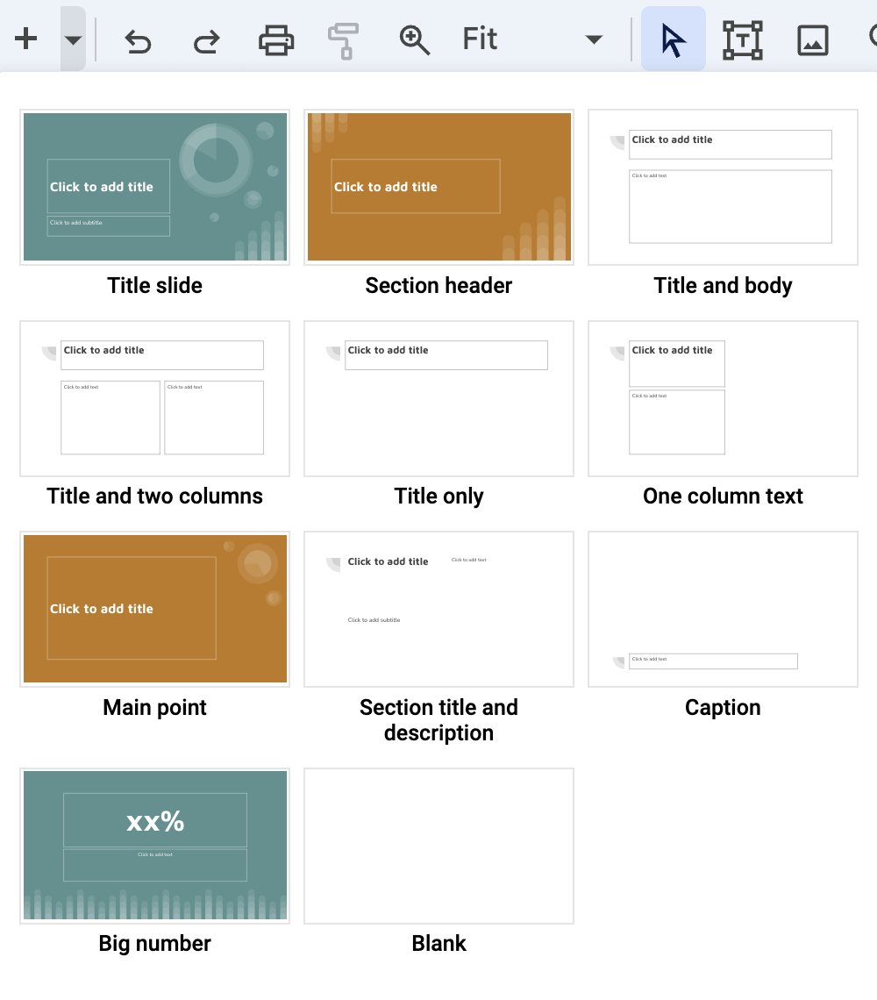

Hello and welcome back to my multi-part series about what I like to call **slidecrafting**; The art of putting together slides that are functional and aesthetically pleasing. I will be using [quarto presentations](https://quarto.org/). This is the third post, you can find the previous post under the category [slidecraft 101](https://www.emilhvitfeldt.com/blog#category=slidecraft%20101).

Last time we say how to create [theme-variants](https://www.emilhvitfeldt.com/post/slidecraft-theme-variants/), and that is a really useful technique! This post will showcase how we can take that idea even further, and create slide themes.

## What is a slide theme?

The inspiration for this style of slidecraft isn't anything new. If you have used conventional slide-making tools you have seen a dropdown menu before



With these menus, you can swiftly select the style of slide you intend to write and fill in the content. I find that for some presentations that I all I need.

Below is one such theme I created (it is a real revealjs slide deck, touch and advance the slides)

<iframe class="slide-deck" style="height:475px; max-width: 100%; resize:both;" src="https://emilhvitfeldt.github.io/quarto-revealjs-earth/"></iframe>

<div class="project-buttons">
<a href="https://github.com/EmilHvitfeldt/quarto-revealjs-earth">
   Github
</a>
<a href="https://emilhvitfeldt.github.io/quarto-revealjs-earth/">
   Website
</a>
</div>

Instead of carefully managing the style of all the elements of each slide. They all have an overall slide theme that controls all the content on the slide. This controls colors and sizes but can go further and control backgrounds and even the positioning of elements. 

Take `.theme-section1` as an example. Not only are the text and colors modified. The text region is being modified such that the text isn't going to overlap with the globe on the right. Setting this up beforehand is quite nice. While the backgrounds might seem complicated, they are all SVGs, but you can use any other type of image or none at all.

Once you have created the theme, your slides will look like this:

```md
## Happy slides {.theme-title1 .center}

## Fancy Section {.theme-section3 .center}

### Less Fancy Subtitle

## Funny title {.theme-slide1}

Content

## Exciting title {.theme-slide2}

Content

## Sad title {.theme-slide3}

Content
```

Each slide will have minimal CSS, just one or two classes specified on the slide level.

## How to create your own

We will assume that we start our project the same way as we did [in previous blog posts](https://www.emilhvitfeldt.com/post/slidecraft-theme-variants/#the-sass-basics).
What we will be doing is creating several `CSS` classes. I find it easier to prefix all of them with `.theme-` but that is not a requirement. We will also be using the feature that [Sass lets us create nesting rules css](https://sass-lang.com/documentation/style-rules/#nesting).

We start with a simple class rule

```scss
.theme-slide1 {
}
```

if we are following my advice on [creating css color palettes](https://www.emilhvitfeldt.com/post/slidecraft-colors-fonts/#applying-colors) then we can use those to specify header colors

```scss
.theme-slide1 {
  h3 {
    color: $theme-blue; // or #5CB4C2
  }
}
```

And we can specify anything want in here. Note that anything inside `h3` applies to all `h3` headers in `.theme-slide1` slides. 

```scss
.theme-slide1 {
  h3 {
    color: $theme-blue; // or #5CB4C2
    font-size: 2em;
  }
}
```

We could specify specific background colors

```scss
.theme-slide1 {
  background-color: #E1E8EB
  h3 {
    color: $theme-blue; // or #5CB4C2
    font-size: 2em;
  }
}
```

Or we could specify background images, for reasons I don't want to get into, this is the way to include an image nicely. With `../../../../../assets/slide1.svg` being a valid path to the slides. You may have to modify the number of `../` for this to work

```scss
.theme-slide1 {
  &:is(.slide-background) {
    background-image: url('../../../../../assets/slide1.svg');
    background-size: cover;
    background-position: center;
    background-repeat: no-repeat;
  }
  h3 {
    color: $theme-blue; // or #5CB4C2
    font-size: 2em;
  }
}
```

depending on your slides you might have repeated styles a lot. Sass has a way to help us with [@mixin and. @include](https://sass-lang.com/documentation/at-rules/mixin/). You can create a `@mixin` with several styles, and then instead of copying around all the styles, you can `@include` the mixin for the same effect. Using this we now have the following

```scss
@mixin background-full {
  background-size: cover;
  background-position: center;
  background-repeat: no-repeat;
}

.theme-slide1 {
  &:is(.slide-background) {
    background-image: url('../../../../../assets/slide1.svg');
    @include background-full;
  }
  h3 {
    color: $theme-blue; // or #5CB4C2
    font-size: 2em;
  }
}
```

Lastly, if you are using images the way I'm using them, you will need to change the text regions to avoid text overlapping with the background image, we can use the `margin-` rules for that

```scss
@mixin background-full {
  background-size: cover;
  background-position: center;
  background-repeat: no-repeat;
}

.theme-slide1 {
  &:is(.slide-background) {
    background-image: url('../../../../../assets/slide1.svg');
    @include background-full;
  }
  h3 {
    color: $theme-blue; // or #5CB4C2
    font-size: 2em;
  }
  h2, h3, h4, h5, p, pre {
    margin-left: 100px;
  }
}
```

I hope you can see that with this style of slidecrafting, the skies the limit. The style sheet for the above example can be [found here](https://github.com/EmilHvitfeldt/quarto-revealjs-earth/blob/main/_extensions/earth/earth.scss).

## More Examples

Below is another theme, following very closely the construction of the previous 

<iframe class="slide-deck" style="height:475px; max-width: 100%; resize:both;" src="https://emilhvitfeldt.github.io/quarto-revealjs-cinco-de-mayo/"></iframe>

<div class="project-buttons">
<a href="https://github.com/EmilHvitfeldt/quarto-revealjs-cinco-de-mayo">
   Github
</a>
<a href="https://emilhvitfeldt.github.io/quarto-revealjs-cinco-de-mayo/">
   Website
</a>
<a href="https://github.com/EmilHvitfeldt/quarto-revealjs-cinco-de-mayo/blob/main/_extensions/cinco-de-mayo/cinco.scss">
   Scss file
</a>
</div>

Another approach to creating these styles of themes is to use Lua to further expand the capabilities of the slides 

<iframe class="slide-deck" style="height:475px; max-width: 100%; resize:both;" src="https://katie.quarto.pub/positconf2023/"></iframe>

<div class="project-buttons">
<a href="https://github.com/kmasiello/positconfslides">
   Github
</a>
<a href="https://katie.quarto.pub/positconf2023/">
   Website
</a>
<a href="https://github.com/kmasiello/positconfslides/blob/main/_extensions/positconfslides/positconfslides.lua">
   Lua file
</a>
</div>

## Roundup

I hoped you learned a lot! I find myself using these types of themes more and more lately, and I hope that you found it useful!
