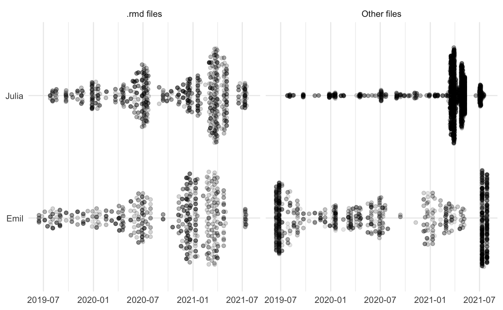

The last couple of years of my life have been quite a journey. I'm standing here now with a book in production, available for preorder, and I couldn't be more proud of the work [Julia Silge](https://twitter.com/juliasilge) and I have done. If you had told me 3 years ago that I would be here now I wouldn't have believed in you.

This post serves three different purposes; 

- Thank the people and community that helped me get to this point
- Visualize and talk about the book writing process itself
- Tell you about how to preorder the book

First, let us get to the thanks! First and foremost I'm thankful to my family and my wife Athena for supporting me through these times. Every time I start a new project Athena has been supporting me in the ways that only she knows how to, no matter how outlandish it may seem ("Hey I'm gonna write a book").

I want to especially give thanks to the #rstats community and all the people who are here to nourish it. I'm especially thankful for the people lifting up the little people. Notable people in this space is [Mara Averick](https://twitter.com/dataandme) and [Jesse Mostipak](https://twitter.com/kierisi) who lift up many newcomers including myself.

I want to thank Julia for working with me through this long project, without her expertise, kindness, and work ethic I doubt I would have finished the book yet alone start it.

I thank our editors at Chapman & Hall; John Kimmel and Robin Lloyd-Starkes. The wonderful and helpful technical reviewers (stick around for the pre-order links to read some of the extracts).

[Yihui Xie](https://yihui.org/) is wonderful and working tirelessly to make document creating easier and easier, this includes his work on [bookdown](https://bookdown.org/yihui/bookdown/). 

[Desirée De Leon](https://desiree.rbind.io/) for the site beautiful design of the book’s website. 

[Max Kuhn](https://twitter.com/topepos), [Davis Vaughan](https://twitter.com/dvaughan32), and [Hannah Frick](https://twitter.com/hfcfrick) for the amazing work on [tidymodels](https://www.tidymodels.org/) which we using in the second section of the book. There are far too many people to list here for thanks so I will end with "Thank you all!".

Now let us she some stories. I have used the [gitsum](https://github.com/lorenzwalthert/gitsum) package to gather information about all the commits that we made when building the book. 

There are many files involved with creating a book. bookdown helps a lot with organization and there is plenty of documentation. Below is a chart of what happened to the main files, which is the rmarkdown files containing the content of each of the chapters in the book. You see how we worked through each of the chapters, one by one. You can see when we sent off a section of the book for review and started working on the next set of chapters.

Next, we see how the size of the chapters slowly but surely growing in size. I'll point out one thing here, you see around March of 2021 how chapters 6 and 7 diverge in size from each other. This was a tough decision on our side where we swapped the data and models around between the two chapters, leading to a lot more work, but what we think ended up being a better flow.

Last we have another overview of changes, here looking at both the rmarkdown files and everything else. I find this to be a neat view of how we are working together to develop the content.

I want to give some tips and tricks we learned along the way. The biggest advice I have for you is to make a [reprex](https://reprex.tidyverse.org/), however, that can be harder when you are working with a book. Julia created this reprex repository [here](https://github.com/juliasilge/toy-bookdown) that mimics the main repository as closely as possible but with minimal code so we can render the book in a minute instead of hours. We have used this repository properly a dozen times for debugging and fast iteration.

The second piece of advice I have is to use `_common.R` file as we do [here](https://github.com/EmilHvitfeldt/smltar/blob/master/_common.R). This helps with uniformity and consistency. [Here](https://github.com/EmilHvitfeldt/smltar/blob/a258d49a60bc9d7d08ba0198c778665779eea9ae/_common.R#L16-L20) we set knitr [chunk option templates](https://bookdown.org/yihui/rmarkdown-cookbook/opts-template.html) to make sure we are using consistent figure sizing. And [here](https://github.com/EmilHvitfeldt/smltar/blob/a258d49a60bc9d7d08ba0198c778665779eea9ae/_common.R#L29-L54) we are setting to default colors and color scales for the whole book.

The book is [available](https://www.routledge.com/Supervised-Machine-Learning-for-Text-Analysis-in-R/Hvitfeldt-Silge/p/book/9780367554194) for [pre-order](https://www.amazon.com/Supervised-Machine-Learning-Analysis-Chapman-dp-0367554186/dp/0367554186) at all the major online [bookstores](https://bookshop.org/books/supervised-machine-learning-for-text-analysis-in-r-9780367554194/9780367554194). We have the whole book freely available for you to read online at [smltar.com/](https://smltar.com/). We want to make sure that this book is accessible for as many people as possible.

We wanted to make sure that this book not only teaching you about natural language processing at the implementation level but to make sure you start thinking about why you are doing what you are doing and the effects it has on the stakeholders of your project. Algorithmic bias and adverse effects of a machine learning model can have large effects and we want to make sure that it is in the back of your mind when working with models like this.

When It came to giving back to the community, [Black Girls Code](https://www.blackgirlscode.com/) was an easy choice. BGC is a not-for-profit organization that focuses on providing technology education for African-American girls that we are happy to support. We are donating all the author proceeds of the presale books.

I'm hoping you will enjoy the book as much as we enjoyed writing it. I don't know what my next big project will be, but I know I'll make sure that it gives back to the community.
