Over the last year, I have worked on [improving sparsity support in tidymodels](https://www.tidyverse.org/blog/2025/03/tidymodels-sparsity/).
With that work, I spend time with various levels of abstraction,
one of the low levels includes the creation of dummy variables.

[Dummy Encoding](https://feaz-book.com/categorical-dummy.html) is what happens when you take a factor variable and return a matrix of indicators,
one for each level in the factor.
Dummy encoding is a large source of sparse data for many modeling tasks,
which is why I'm going to compare and contrasts its dense representation with its sparse representation.
This blog post will mostly be a number of visualizations based on benchmarks.
Trying to pry out some insight into why and when you wanna use sparse encoding of your data.

## Benchmarking

First, I need to create some factors with specific lengths and a specific number of levels. `make_factor()` does that job for us.


::: {.cell}

```{.r .cell-code}
make_factor <- function(len, n_lvl) {
 lvls <- paste0("f", seq_len(n_lvl))
 out <- sample(lvls, len, TRUE)
  factor(out, lvls)
}
```
:::


We notice that it works even when the number of levels is larger than the number of elements in the factor.
This can happen in real life as well and is important that we capture it in our benchmarking.


::: {.cell}

```{.r .cell-code}
make_factor(10, 2)
```

::: {.cell-output .cell-output-stdout}

```
 [1] f1 f1 f2 f2 f1 f1 f1 f2 f2 f2
Levels: f1 f2
```


:::

```{.r .cell-code}
make_factor(10, 20)
```

::: {.cell-output .cell-output-stdout}

```
 [1] f14 f15 f3  f7  f10 f15 f19 f5  f13 f4 
20 Levels: f1 f2 f3 f4 f5 f6 f7 f8 f9 f10 f11 f12 f13 f14 f15 f16 f17 ... f20
```


:::
:::


To do the actual benchmarking I will be using the wonderful [bench](https://bench.r-lib.org/) package.
Using `bench::press()` we are able to perform the benchmarkings for a grid of difference values of length `len` and number of levels `n_lvl`.
To compare sparse and dense creation I will be using `sparsevctrs::sparse_dummy()` to create sparse dummy variables and `hardhat::fct_encode_one_hot()`.
Both of these functions do roughly the same thing,
namely take a factor as input and return dummy variables.
While `hardhat::fct_encode_one_hot()` returns a matrix and `sparsevctrs::sparse_dummy()` returns a list of vectors,
they contain the same information so I won't bother with converting to a common format and will thus set `check = FALSE` to stop `bench::mark()` from complaining.


::: {.cell}

```{.r .cell-code}
bench_res <- bench::press(
 len = 10 * 2^(0:11),
 n_lvl = 10 * 2^(0:11),
 {
 fac <- make_factor(len, n_lvl)
 bench::mark(
 check = FALSE,
 min_iterations = 10,
 dense = hardhat::fct_encode_one_hot(fac),
 sparse = sparsevctrs::sparse_dummy(fac)
 )
 }
)
```
:::

::: {.cell}

:::

::: {.cell}

:::


This data set contains what we need. 
Specifically, we want the following:

- `expression` - sparse or dense
- `len` - length of factor
- `n_lvl` - number of levels in factor
- `median` - the sample median of execution time
- `mem_alloc` - the total amount of memory allocated by R while running the expression.


::: {.cell}

```{.r .cell-code}
library(tidyverse)
library(bench)

bench_res <- bench_res |>
  select(expression, len, n_lvl, median, mem_alloc)
```
:::


## Visualizations for time


::: {.cell}

:::


What we are trying to uncover is some relationships between our inputs `len` and `n_lvl` and the quantities we care about the time taken `median` and memory allocation `mem_alloc`.
All together with how they differ between sparse and dense representation.
That is a lot of information to add to one chart so we will start small and build up.
We will also need multiple charts to explore different facets.

First, we just look at vector length compared to runtime for one value of `n_lvl`.


::: {.cell}

```{.r .cell-code  code-fold="true"}
bench_res |>
  filter(n_lvl == 40) |>
  mutate(expression = as.character(expression)) |>
  mutate(median = as.numeric(median)) |>
  ggplot(aes(len, median, color = expression)) +
  geom_point() +
  labs(
 title = "When number of levels is 40",
 x = "Vector length",
 y = "Median runtime",
 color = NULL
 )
```

::: {.cell-output-display}
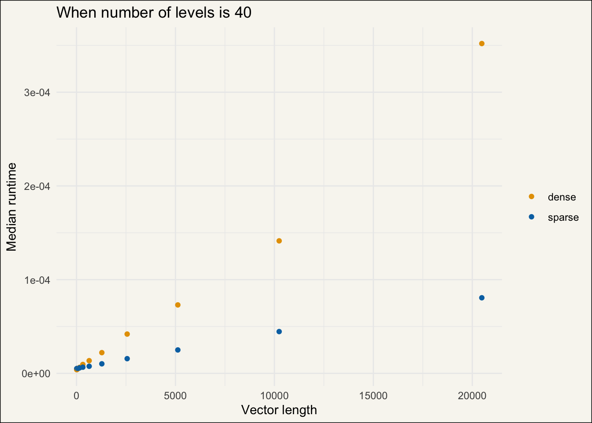{#fig-length-v-runtime-40 width=672}
:::
:::


However, this chart is going to work better on a log-log scale.


::: {.cell}

```{.r .cell-code  code-fold="true"}
bench_res |>
  filter(n_lvl == 40) |>
  mutate(expression = as.character(expression)) |>
  ggplot(aes(len, median, color = expression)) +
  geom_point() +
  scale_x_log10() +
  labs(
 title = "When number of levels is 40",
 x = "Vector length",
 y = "Median runtime",
 color = NULL
 )
```

::: {.cell-output-display}
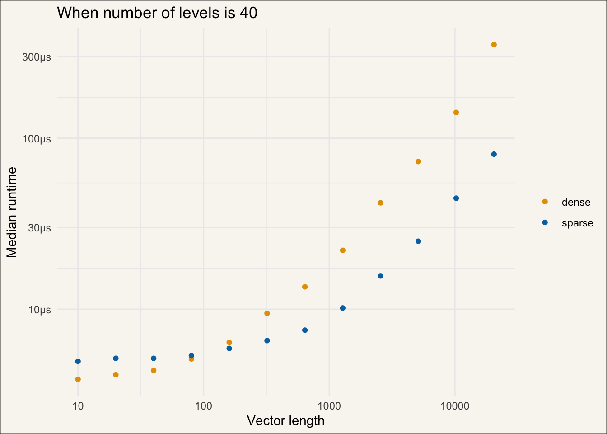{#fig-length-v-runtime-40-loglog width=672}
:::
:::


What we see now is that dense vectors are faster to generate for smaller vectors and sparse vectors are faster to generate for larger vectors.

Let us try a facet chart to explore all values of `n_lvl` at the same time.


::: {.cell}

```{.r .cell-code  code-fold="true"}
bench_res |>
  mutate(expression = as.character(expression)) |>
  ggplot(aes(len, median, color = expression)) +
  geom_point() +
  facet_wrap(~n_lvl, scales = "free_y") +
  scale_x_log10() +
  labs(
 x = "Vector length",
 y = "Median runtime",
 color = NULL,
 title = "Trends change as the number of levels in factor increases",
 subtitle = "Both sparse and dense straightens out with different slopes"
 ) +
  theme(legend.position = "none")
```

::: {.cell-output-display}
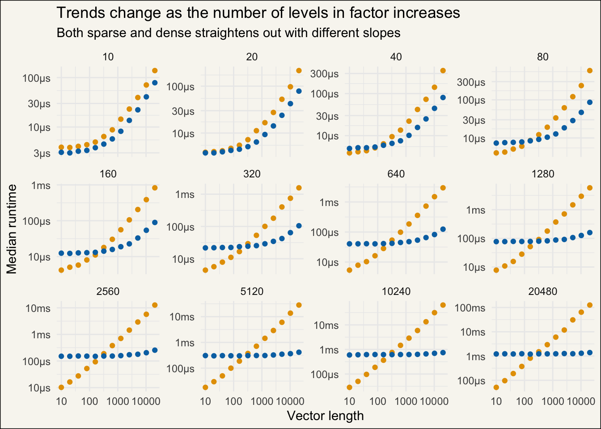{#fig-length-v-runtime width=672}
:::
:::


We now notice a couple of things.
The first thing I notice is that the intersection goes up as we increase the number of levels.
For low-level counts sparse always wins.
as we increase in `n_lvls` the two curves each converge to a linear trend (in our log-log chart),
The difference is the slopes they have.
The slope of the dense times suggests that the relationship between vector length and computation time,
if the vector is 10 times as long it takes 10 times as long.
The sparse time is almost constant over the vector length.
It takes roughly the same time regardless of how long the vector is.

The above results make sense.
When looking at the sparse calculations there are 2 things that take time to do,
setting up the output which is a list of `n_lvl` vectors,
and filling in the non-zero values.
Setting up the output takes the same amount of time regardless of how long the vectors are,
and we can see that values are reflected on the left-hand side of the chart.
Filling in the values does depend on the length,
as it needs to add a value for each element in the input,
we see this as an increase in time.
And that time is more or less independent of the number of levels. 
Hence why the difference between the left and right values for sparse calculations appear to be the same in all facets.

Let us now look at the relationship between how long it takes to run the dense version compared to the sparse version.
Doing it for `n_lvl = 640` for simplicity first. 
The line here is set to represent when the dense time is higher than the sparse time.


::: {.cell}

```{.r .cell-code  code-fold="true"}
bench_res |>
  filter(n_lvl == 640) |>
  select(expression, len, n_lvl, median) |>
  mutate(median = as.numeric(median)) |>
  pivot_wider(names_from = expression, values_from = median) |>
  mutate(ratio = dense / sparse) |>
  ggplot(aes(len, ratio)) +
  geom_point() +
  geom_abline(slope = 0, intercept = 1) +
  scale_x_log10() +
  labs(
 title = "When number of levels is 640",
 x = "Vector length",
 y = "dense runtime / sparse runtime",
 color = NULL
 )
```

::: {.cell-output-display}
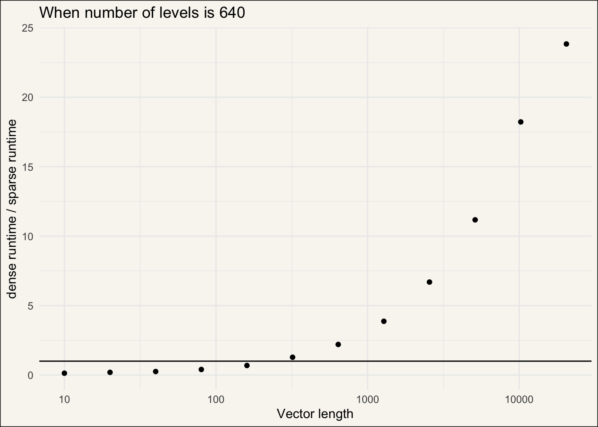{#fig-length-v-ratio-640 width=672}
:::
:::


We notice this shape and see what will happen if we throw a `log()` on the y-axis as well.


::: {.cell}

```{.r .cell-code  code-fold="true"}
bench_res |>
  filter(n_lvl == 640) |>
  select(expression, len, n_lvl, median) |>
  mutate(median = as.numeric(median)) |>
  pivot_wider(names_from = expression, values_from = median) |>
  mutate(ratio = log10(dense / sparse)) |>
  ggplot(aes(len, ratio)) +
  geom_point() +
  geom_abline(slope = 0, intercept = 0) +
  scale_x_log10() +
  labs(
 title = "When number of levels is 640",
 x = "Vector length",
 y = "log(dense runtime / sparse runtime)",
 color = NULL
 )
```

::: {.cell-output-display}
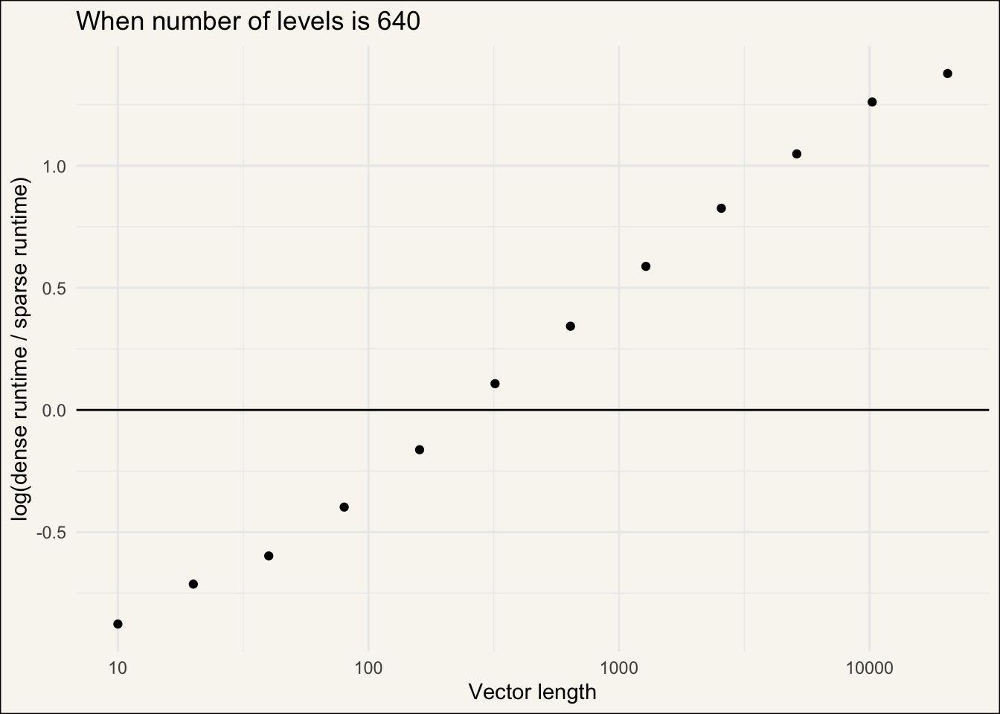{#fig-length-v-ratio-640-loglog width=672}
:::
:::


And look at that!
A linear relationship.
We can use this linear relationship to make some statements about what happens.


::: {.cell}

:::


We can fit a line on this log-log chart and it would give us a slope of ratio_estimate_640`. 
Taking this estimate to the power of 10 gives us 5.34 which is how much the relationship between the dense runtime and the sparse runtime increases each time the length gets 10 times longer.

We can expand this to look at all the different levels.


::: {.cell}

```{.r .cell-code  code-fold="true"}
bench_res |>
  select(expression, len, n_lvl, median) |>
  mutate(median = as.numeric(median)) |>
  pivot_wider(names_from = expression, values_from = median) |>
  mutate(ratio = log(dense / sparse)) |>
  mutate(n_lvl = as.factor(n_lvl)) |>
  ggplot(aes(len, ratio, color = n_lvl)) +
  geom_point() +
  geom_abline(slope = 0, intercept = 0) +
  scale_color_manual(values = diy_rainbow) +
  scale_x_log10() +
  labs(
 x = "Vector length",
 y = "log(dense runtime / sparse runtime)",
 color = "number of levels"
 )
```

::: {.cell-output-display}
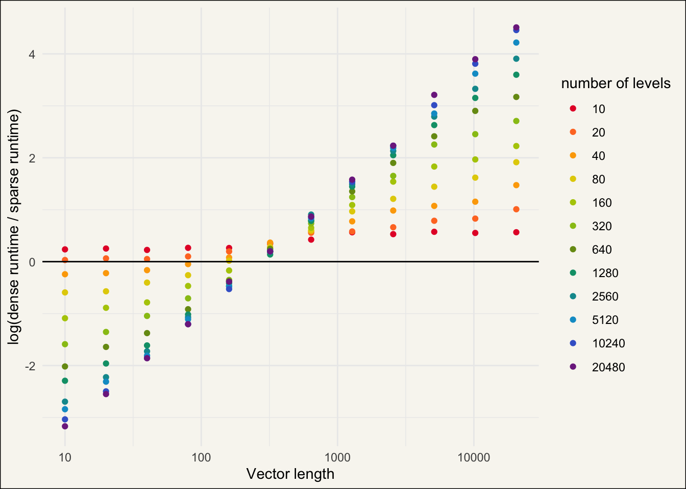{#fig-length-v-ratio-loglog width=672}
:::
:::


Since they all appear to be linear in log-log I'll recreate this chart using fitted lines instead.


::: {.cell}

```{.r .cell-code  code-fold="true"}
bench_res |>
  select(expression, len, n_lvl, median) |>
  mutate(median = as.numeric(median)) |>
  pivot_wider(names_from = expression, values_from = median) |>
  mutate(ratio = log(dense / sparse)) |>
  mutate(n_lvl = as.factor(n_lvl)) |>
  ggplot(aes(len, ratio, color = n_lvl)) +
  geom_smooth(method = "lm", formula = "y ~ x", se = FALSE) +
  geom_abline(slope = 0, intercept = 0) +
  scale_x_log10() +
  scale_color_manual(values = diy_rainbow) +
  labs(
 x = "Vector length",
 y = "log(dense runtime / sparse runtime)",
 color = "number of levels"
 )
```

::: {.cell-output-display}
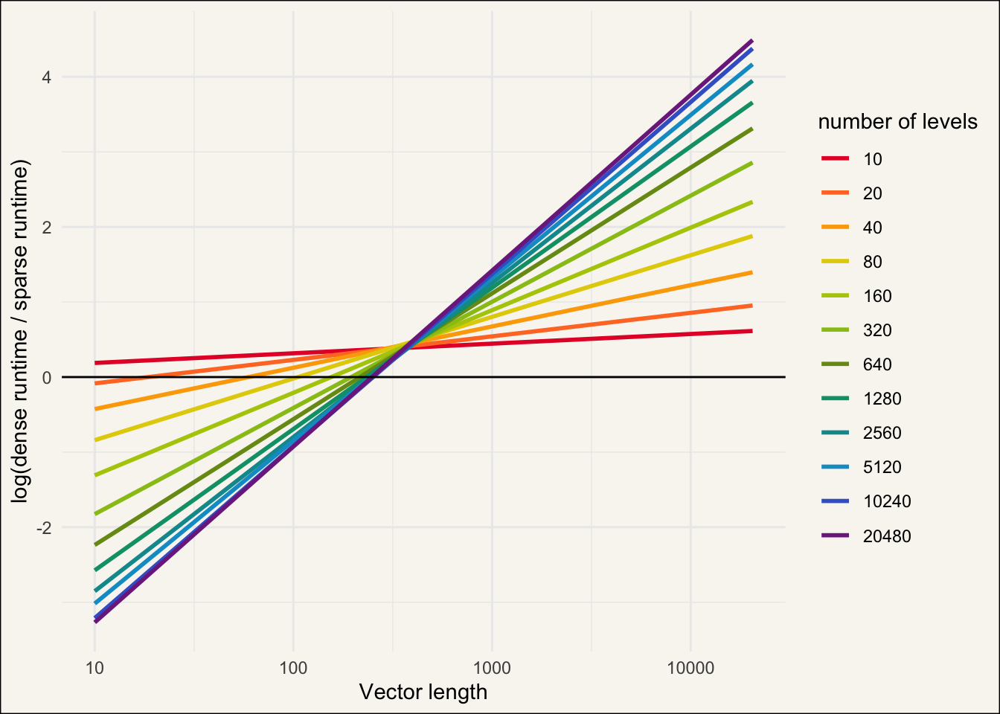{#fig-length-v-ratio-loglog-lines width=672}
:::
:::


The results are not too surprising considering what we have seen so far.
The slopes for each of these curves and their associated effect is seen below.
Notice how big of a difference we get as the number of levels increases.
This makes sense as sparse dummies take up roughly the same amount of memory regardless of how many levels the factor had.


::: {#tbl-ratio_lm_estimates .cell}
::: {.cell-output-display}


| n_lvl| estimate| effect|
|-----:|--------:|------:|
|    10|    0.056|  1.137|
|    20|    0.136|  1.368|
|    40|    0.239|  1.734|
|    80|    0.357|  2.273|
|   160|    0.478|  3.005|
|   320|    0.614|  4.114|
|   640|    0.728|  5.344|
|  1280|    0.818|  6.570|
|  2560|    0.892|  7.797|
|  5120|    0.942|  8.757|
| 10240|    0.995|  9.892|
| 20480|    1.018| 10.414|


:::
:::


If we instead wanted to look at whether the dense and sparse method is fastest for a given vector length and number of levels.
The below chart tries to answer that question.


::: {.cell}

```{.r .cell-code  code-fold="true"}
bench_res |>
  mutate(expression = as.character(expression)) |>
  mutate(median = as.numeric(median)) |>
  mutate(len = factor(len), n_lvl = factor(n_lvl)) |>
  select(expression, len, n_lvl, median) |>
  pivot_wider(names_from = expression, values_from = median) |>
  mutate(ratio = log10(dense / sparse)) |>
  ggplot(aes(len, n_lvl)) +
  geom_tile(aes(fill = ratio)) +
  scale_fill_gradient2(low = "#A06928", mid = "#EEEBC3", high = "#2887A1") +
    labs(
 x = "Vector length",
 y = "number of levels",
 fill = "ratio",
 subtitle = "ratio = log(dense runtime / sparse runtime)"
 )
```

::: {.cell-output-display}
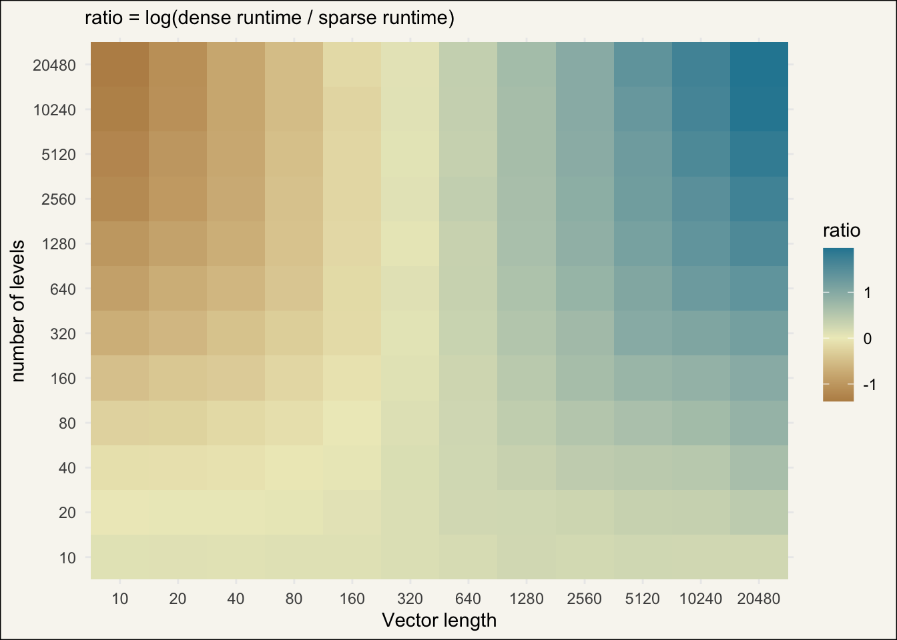{#fig-length-v-n_lvls width=672}
:::
:::


The top left represents the types of factor vectors where it is faster to generate dense versions.
Everything else represents scenarios where generating sparse versions is faster.
The intensity of the colors shows how much faster it is, remember it is on a log scale so `1` means that it is 10 times faster,
and `-1` means it is 0.1 times faster or a 10th of the time.

Below we highlighted the top left area a little bit more.


::: {.cell}

```{.r .cell-code  code-fold="true"}
res_ratio <- bench_res |>
  mutate(expression = as.character(expression)) |>
  mutate(median = as.numeric(median)) |>
  mutate(len = factor(len), n_lvl = factor(n_lvl)) |>
  select(expression, len, n_lvl, median) |>
  pivot_wider(names_from = expression, values_from = median) |>
  mutate(ratio = log10(dense / sparse))

res_ratio |>
  ggplot(aes(len, n_lvl)) +
  geom_tile(aes(fill = ratio)) +
  geom_tile(
 data = filter(res_ratio, ratio < 0),
 color = "#A06928",
 fill = "#00000000"
 ) +
  scale_fill_gradient2(low = "#A06928", mid = "#EEEBC3", high = "#2887A1") +
  labs(
 x = "Vector length",
 y = "number of levels",
 fill = "ratio",
 subtitle = "ratio = log(dense runtime / sparse runtime)"
 )
```

::: {.cell-output-display}
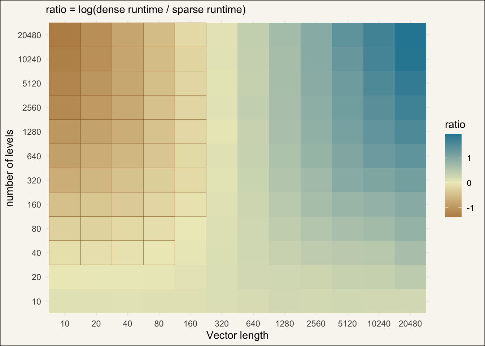{#fig-length-v-n_lvls-highlights width=672}
:::
:::


## Visualisations for memory

Each of the charts we developed in the previous section can be redone to show memory allocation in place of runtime.
We will only show the full charts since we have already built these charts up step by step.


::: {.cell}

```{.r .cell-code  code-fold="true"}
bench_res |>
  mutate(expression = as.character(expression)) |>
  ggplot(aes(len, mem_alloc, color = expression)) +
  geom_point() +
  facet_wrap(~n_lvl, scales = "free_y") +
  scale_x_log10() +
  labs(
 x = "Vector length",
 y = "Memory Allocation",
 color = NULL
 ) +
  theme(legend.position = "none")
```

::: {.cell-output-display}
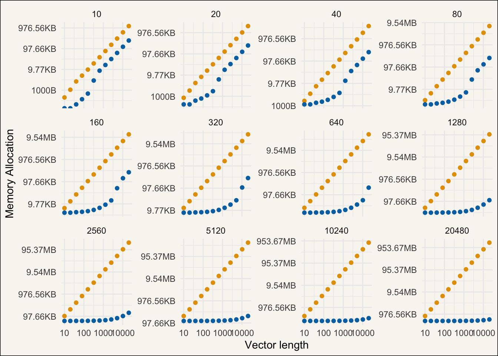{#fig-length-v-memory width=672}
:::
:::


the biggest difference here is that the question isn't whether sparse will take up less than dense,
instead, we can look at how much less memory it will take.
There are technically a few cases both of those happen for very low counts that are hard to see from this chart.

We are seeing a much more interesting chart here than last time.


::: {.cell}

```{.r .cell-code  code-fold="true"}
bench_res |>
  select(expression, len, n_lvl, mem_alloc) |>
  mutate(mem_alloc = as.numeric(mem_alloc)) |>
  pivot_wider(names_from = expression, values_from = mem_alloc) |>
  mutate(ratio = log(dense / sparse)) |>
  mutate(n_lvl = as.factor(n_lvl)) |>
  ggplot(aes(len, ratio, color = n_lvl)) +
  geom_line() +
  geom_abline(slope = 0, intercept = 0) +
  scale_color_manual(values = diy_rainbow) +
  scale_x_log10() +
  labs(
 x = "Vector length",
 y = "log(dense memory / sparse memory)",
 color = "number of levels"
 )
```

::: {.cell-output-display}
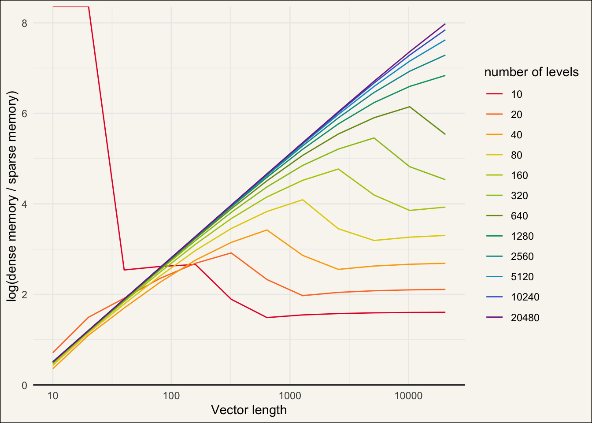{#fig-length-v-ratio-memory-loglog-lines width=672}
:::
:::


We don't look at when sparse will take up less space than dense,
we look at how much and what trends we are seeing.
The main takeaway is that the sparse representation gets better when the vector is longer and when it has more levels.


::: {.cell}

```{.r .cell-code  code-fold="true"}
bench_res |>
  mutate(expression = as.character(expression)) |>
  mutate(mem_alloc = as.numeric(mem_alloc)) |>
  mutate(len = factor(len), n_lvl = factor(n_lvl)) |>
  select(expression, len, n_lvl, mem_alloc) |>
  pivot_wider(names_from = expression, values_from = mem_alloc) |>
  mutate(ratio = log(dense / sparse)) |>
  ggplot(aes(len, n_lvl)) +
  geom_tile(aes(fill = ratio)) +
  scale_fill_viridis_c(begin = 0.05, end = 0.95) +
  labs(
 x = "Vector length",
 y = "number of levels",
 fill = "ratio",
 subtitle = "ratio = log(dense memory / sparse memory)"
 )
```

::: {.cell-output-display}
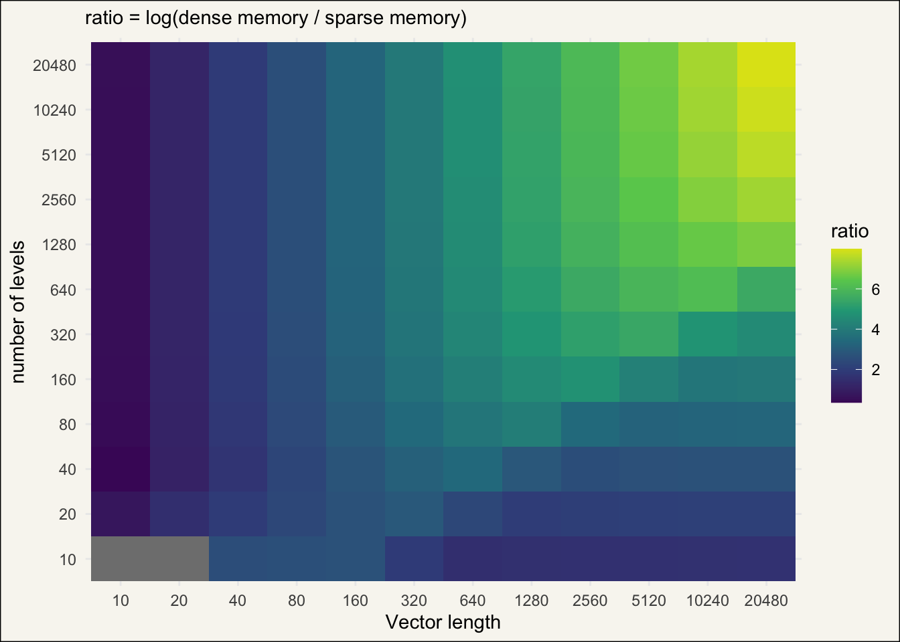{width=672}
:::
:::


## Conclusions

sparse representation "wins" unless the vectors are short (less than 1000),
which would indicate that using it is a good idea all the time.
However the answer is not quite that simple,
the time it takes to perform dummy variables is rarely the dominant factor when using a ML system.
The main deciding factor will often be fitting the model,
the whole process should be done with and without sparsity if you truly wanna know which is faster.
There is also a penalty for creating the wrong type as conversion back and forth takes longer than either of the creations.

Also, these charts are not expected to generalize when the number of levels and vector lengths increase.
When we find linear trends we don't expect them to go on forever.
Especially since we are dealing with memory,
as you eventually  hit the garbage collector which will happen to the dense version much earlier than for the sparse data.
There are also factors that you wouldn't be able to create dummies from densely as the resulting object wouldn't fit in memory,
where the corresponding sparse representation would happen much easier.

The purpose of this post was mainly to explore and contrast the creation of dummies as sparse and dense vectors.