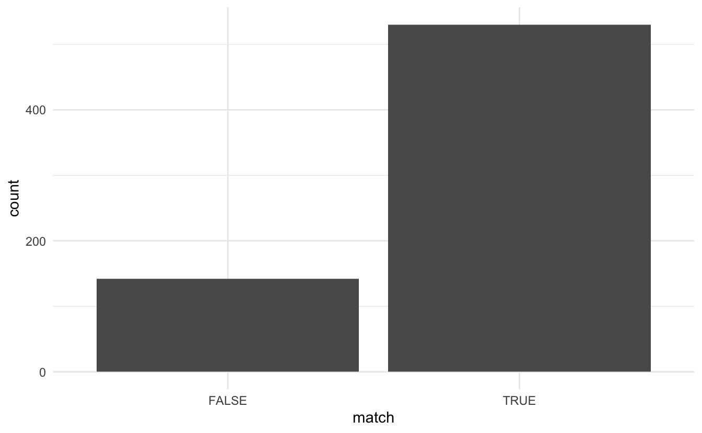

It is known that topic modeling does not benefit from stemming [ref](https://mimno.infosci.cornell.edu/papers/schofield_tacl_2016.pdf).
I propose a workflow to investigate if stemming is appropriate as a method for data reduction. 

1. Take all the tokens and apply the stemming algorithm you would like to test
1. Construct a list of words that should be equal under stemming
1. Apply a topic model to your original data
1. Predict the topic for each word created in 2.

If grouped words are predicted to the same topic then we assume that stemming would not make much of a difference. 
If the words are predicted to be indifferent topics then we have a suspicion that the stemmed and unstemmed words have different uses and stemming would be ill-advised.

First, we load the packages we will be using.


```r
library(tidytext)
library(tidyverse)
library(stm)
library(hcandersenr)
library(SnowballC)
```

As a first test, we pick 3 English^[[#benderrule](https://thegradient.pub/the-benderrule-on-naming-the-languages-we-study-and-why-it-matters/)] fairy tales by H.C. Andersens using the [hcandersenr](https://github.com/EmilHvitfeldt/hcandersenr) package. 
To create multiple "documents" for each fairy tale we start by tokenizing to sentences.
Then we give each sentence a unique identifier.


```r
fairy_tales <- hcandersen_en %>%
  filter(book %in% c("The fir tree", "The tinder-box", "Thumbelina")) %>%
  unnest_tokens(token, text, token = "sentences") %>%
  group_by(book) %>%
  mutate(sentence = row_number()) %>%
  ungroup() %>%
  unite(document, book, sentence)

fairy_tales
## # A tibble: 1,089 x 2
##    document        token                                                        
##    <chr>           <chr>                                                        
##  1 The tinder-box… "a soldier came marching along the high road: \"left, right …
##  2 The tinder-box… "he"                                                         
##  3 The tinder-box… "had his knapsack on his back, and a sword at his side; he h…
##  4 The tinder-box… "and was now returning home."                                
##  5 The tinder-box… "as he walked on, he met a very frightful-looking old"       
##  6 The tinder-box… "witch in the road."                                         
##  7 The tinder-box… "her under-lip hung quite down on her breast, and she stoppe…
##  8 The tinder-box… "and said, \"good evening, soldier; you have a very fine swo…
##  9 The tinder-box… "knapsack, and you are a real soldier; so you shall have as …
## 10 The tinder-box… "you like.\""                                                
## # … with 1,079 more rows
```

Now we unnest the tokens to words and create a new variable of the stemmed words


```r
fairy_tales_tokens <- fairy_tales %>%
  unnest_tokens(token, token) %>%
  mutate(token_stem = wordStem(token))

fairy_tales_tokens
## # A tibble: 10,577 x 3
##    document         token    token_stem
##    <chr>            <chr>    <chr>     
##  1 The tinder-box_1 a        a         
##  2 The tinder-box_1 soldier  soldier   
##  3 The tinder-box_1 came     came      
##  4 The tinder-box_1 marching march     
##  5 The tinder-box_1 along    along     
##  6 The tinder-box_1 the      the       
##  7 The tinder-box_1 high     high      
##  8 The tinder-box_1 road     road      
##  9 The tinder-box_1 left     left      
## 10 The tinder-box_1 right    right     
## # … with 10,567 more rows
```

We can take a look at all the times where stemming we can look at all the times stemming yields a different token.


```r
different <- fairy_tales_tokens %>%
  select(token, token_stem) %>%
  filter(token != token_stem) %>%
  unique()

different
## # A tibble: 759 x 2
##    token     token_stem
##    <chr>     <chr>     
##  1 marching  march     
##  2 his       hi        
##  3 wars      war       
##  4 was       wa        
##  5 returning return    
##  6 as        a         
##  7 walked    walk      
##  8 very      veri      
##  9 frightful fright    
## 10 looking   look      
## # … with 749 more rows
```

In this example, we have 759 different tokens. 
But since stemming can collapse multiple different tokens into one.


```r
different %>%
  count(token_stem, sort = TRUE)
## # A tibble: 672 x 2
##    token_stem     n
##    <chr>      <int>
##  1 seiz           4
##  2 leav           3
##  3 live           3
##  4 look           3
##  5 place          3
##  6 plai           3
##  7 pleas          3
##  8 sai            3
##  9 trembl         3
## 10 appear         2
## # … with 662 more rows
```

We can use the `different` data.frame and construct a list of words that would land in the same bucket after stemming.


```r
stem_buckets <- split(different$token, different$token_stem) %>%
  imap(~ c(.x, .y))

stem_buckets[21:25]
## $anxiou
## [1] "anxious" "anxiou" 
## 
## $anyth
## [1] "anything" "anyth"   
## 
## $apart
## [1] "apartment" "apart"    
## 
## $appear
## [1] "appearance" "appeared"   "appear"    
## 
## $appl
## [1] "apples" "apple"  "appl"
```

Here we see that "anxiou" and "anxious" would look the same after stemming, likewise will "apples", "apple" and "appl".
The main point of this exercise is to see if the words in these groups of words end up in the topic when during topic modeling.


```r
stm_model <- fairy_tales_tokens %>%
  count(document, token) %>%
  cast_sparse(document, token, n) %>%
  stm(K = 3, verbose = FALSE)

stm_model
## A topic model with 3 topics, 1089 documents and a 1518 word dictionary.
```

In this case, I fit the model to 3 topics because I knew that would be the right number since I picked the data.
When doing this on your data you should run multiple models with a varying number of topics to find the best one. 
For more information please read [Training, Evaluating, and Interpreting Topic Models](https://juliasilge.com/blog/evaluating-stm/) by [Julia Silge](https://twitter.com/juliasilge).

Now that we have an `stm` model and a list of words, 
We can inspect the model object to check if multiple words are put in the same topic.
Below is a function that will take a vector of characters and an `stm` model and return `TRUE` if all the words appear in the same topic and `FALSE` if they don't.


```r
stm_match <- function(x, model) {
  topics <- tidy(model) %>%
  filter(term %in% x) %>%
  group_by(term) %>%
  top_n(1, beta) %>%
  ungroup() %>%
  select(topic) %>%
  n_distinct()
  
  topics == 1
}
```

As an example, if we pass the words "believed" and "believ"


```r
stm_match(c("believed", "believ"), stm_model)
## [1] TRUE
```

We see that they did end up in the same bucket.
If we instead pass in "dog" and "happy" they land in different topics.


```r
stm_match(c("dog", "happy"), stm_model)
## [1] FALSE
```

All of this is not perfect, there is still some uncertainty but it is a good first step to evaluate if stemming is appropriate for your application.


```r
tested <- tibble(terms = stem_buckets,
                 stem = names(stem_buckets)) %>%
  mutate(match = map_lgl(terms, stm_match, stm_model))

tested
## # A tibble: 672 x 3
##    terms        stem      match
##    <named list> <chr>     <lgl>
##  1 <chr [2]>    a         FALSE
##  2 <chr [2]>    abl       TRUE 
##  3 <chr [2]>    abov      TRUE 
##  4 <chr [2]>    accompani TRUE 
##  5 <chr [2]>    ach       TRUE 
##  6 <chr [2]>    admir     TRUE 
##  7 <chr [2]>    adorn     FALSE
##  8 <chr [2]>    ag        TRUE 
##  9 <chr [2]>    ala       TRUE 
## 10 <chr [2]>    alarm     TRUE 
## # … with 662 more rows
```

First, we'll look at the distribution of `TRUE`s and `FALSE`s.


```r
tested %>%  
  ggplot(aes(match)) +
  geom_bar()
```



So it looks like most of the word groups were put into the same topic during modeling.
This is a good sign. 
Please note that this category includes a lot of false positives.
This is happening because `stm_match()` also returns true for a case where one of the words appears in the model and all other words don't.
So for the case of "accompanied" and "accompani", the word "accompanied" was present in one of the topics, but the word "accompani" was not present in the original data and hence did not appear in any of the topics.
In this case, the `TRUE` value we are getting is saying that the data doesn't provide enough evidence to indicate that stemming would be bad.
By looking at a sample of `TRUE` cases we see that a lot of them are happening because the stemmed word isn't being used, like the words "aliv", "alon" and "alwai".
On the other side, we have that the words "allowed" and "allow" are both real words AND they appeared in the same topic.


```r
tested %>%
  filter(match) %>%
  slice(10:15) %>%
  pull(terms)
## $aliv
## [1] "alive" "aliv" 
## 
## $allow
## [1] "allowed" "allow"  
## 
## $alon
## [1] "alone" "alon" 
## 
## $alreadi
## [1] "already" "alreadi"
## 
## $alwai
## [1] "always" "alwai" 
## 
## $amus
## [1] "amused" "amus"
```

Turning our head to the `FALSE` cases.
These cases will not have any false positives as both words would have to appear in the original corpus for them to be put into different topics.
These cases are still not going to be perfect, but will again be an indication.


```r
tested %>%
  filter(!match) %>%
  pull(terms) %>%
  head()
## $a
## [1] "as" "a" 
## 
## $adorn
## [1] "adorned" "adorn"  
## 
## $arm
## [1] "arms" "arm" 
## 
## $ask
## [1] "asked" "ask"  
## 
## $back
## [1] "backs" "back" 
## 
## $bag
## [1] "bags" "bag"
```

This is the list I would advise you to look over carefully.
Check to make sure that you are okay with the number and count of misgroupings you would get by applying stemming.

<details closed>
<summary> <span title='Click to Expand'> session information </span> </summary>

```r

─ Session info ───────────────────────────────────────────────────────────────
 setting  value                       
 version  R version 4.1.0 (2021-05-18)
 os       macOS Big Sur 10.16         
 system   x86_64, darwin17.0          
 ui       X11                         
 language (EN)                        
 collate  en_US.UTF-8                 
 ctype    en_US.UTF-8                 
 tz       America/Los_Angeles         
 date     2021-07-16                  

─ Packages ───────────────────────────────────────────────────────────────────
 package     * version date       lib source                           
 assertthat    0.2.1   2019-03-21 [1] CRAN (R 4.1.0)                   
 backports     1.2.1   2020-12-09 [1] CRAN (R 4.1.0)                   
 blogdown      1.3.2   2021-06-09 [1] Github (rstudio/blogdown@00a2090)
 bookdown      0.22    2021-04-22 [1] CRAN (R 4.1.0)                   
 broom         0.7.8   2021-06-24 [1] CRAN (R 4.1.0)                   
 bslib         0.2.5.1 2021-05-18 [1] CRAN (R 4.1.0)                   
 cellranger    1.1.0   2016-07-27 [1] CRAN (R 4.1.0)                   
 cli           3.0.0   2021-06-30 [1] CRAN (R 4.1.0)                   
 clipr         0.7.1   2020-10-08 [1] CRAN (R 4.1.0)                   
 codetools     0.2-18  2020-11-04 [1] CRAN (R 4.1.0)                   
 colorspace    2.0-2   2021-06-24 [1] CRAN (R 4.1.0)                   
 crayon        1.4.1   2021-02-08 [1] CRAN (R 4.1.0)                   
 data.table    1.14.0  2021-02-21 [1] CRAN (R 4.1.0)                   
 DBI           1.1.1   2021-01-15 [1] CRAN (R 4.1.0)                   
 dbplyr        2.1.1   2021-04-06 [1] CRAN (R 4.1.0)                   
 desc          1.3.0   2021-03-05 [1] CRAN (R 4.1.0)                   
 details     * 0.2.1   2020-01-12 [1] CRAN (R 4.1.0)                   
 digest        0.6.27  2020-10-24 [1] CRAN (R 4.1.0)                   
 dplyr       * 1.0.7   2021-06-18 [1] CRAN (R 4.1.0)                   
 ellipsis      0.3.2   2021-04-29 [1] CRAN (R 4.1.0)                   
 evaluate      0.14    2019-05-28 [1] CRAN (R 4.1.0)                   
 fansi         0.5.0   2021-05-25 [1] CRAN (R 4.1.0)                   
 farver        2.1.0   2021-02-28 [1] CRAN (R 4.1.0)                   
 forcats     * 0.5.1   2021-01-27 [1] CRAN (R 4.1.0)                   
 fs            1.5.0   2020-07-31 [1] CRAN (R 4.1.0)                   
 generics      0.1.0   2020-10-31 [1] CRAN (R 4.1.0)                   
 ggplot2     * 3.3.5   2021-06-25 [1] CRAN (R 4.1.0)                   
 glue          1.4.2   2020-08-27 [1] CRAN (R 4.1.0)                   
 gtable        0.3.0   2019-03-25 [1] CRAN (R 4.1.0)                   
 haven         2.4.1   2021-04-23 [1] CRAN (R 4.1.0)                   
 hcandersenr * 0.2.0   2019-01-19 [1] CRAN (R 4.1.0)                   
 highr         0.9     2021-04-16 [1] CRAN (R 4.1.0)                   
 hms           1.1.0   2021-05-17 [1] CRAN (R 4.1.0)                   
 htmltools     0.5.1.1 2021-01-22 [1] CRAN (R 4.1.0)                   
 httr          1.4.2   2020-07-20 [1] CRAN (R 4.1.0)                   
 janeaustenr   0.1.5   2017-06-10 [1] CRAN (R 4.1.0)                   
 jquerylib     0.1.4   2021-04-26 [1] CRAN (R 4.1.0)                   
 jsonlite      1.7.2   2020-12-09 [1] CRAN (R 4.1.0)                   
 knitr       * 1.33    2021-04-24 [1] CRAN (R 4.1.0)                   
 labeling      0.4.2   2020-10-20 [1] CRAN (R 4.1.0)                   
 lattice       0.20-44 2021-05-02 [1] CRAN (R 4.1.0)                   
 lifecycle     1.0.0   2021-02-15 [1] CRAN (R 4.1.0)                   
 lubridate     1.7.10  2021-02-26 [1] CRAN (R 4.1.0)                   
 magrittr      2.0.1   2020-11-17 [1] CRAN (R 4.1.0)                   
 Matrix        1.3-3   2021-05-04 [1] CRAN (R 4.1.0)                   
 modelr        0.1.8   2020-05-19 [1] CRAN (R 4.1.0)                   
 munsell       0.5.0   2018-06-12 [1] CRAN (R 4.1.0)                   
 pillar        1.6.1   2021-05-16 [1] CRAN (R 4.1.0)                   
 pkgconfig     2.0.3   2019-09-22 [1] CRAN (R 4.1.0)                   
 plyr          1.8.6   2020-03-03 [1] CRAN (R 4.1.0)                   
 png           0.1-7   2013-12-03 [1] CRAN (R 4.1.0)                   
 purrr       * 0.3.4   2020-04-17 [1] CRAN (R 4.1.0)                   
 R6            2.5.0   2020-10-28 [1] CRAN (R 4.1.0)                   
 Rcpp          1.0.7   2021-07-07 [1] CRAN (R 4.1.0)                   
 readr       * 1.4.0   2020-10-05 [1] CRAN (R 4.1.0)                   
 readxl        1.3.1   2019-03-13 [1] CRAN (R 4.1.0)                   
 reprex        2.0.0   2021-04-02 [1] CRAN (R 4.1.0)                   
 reshape2      1.4.4   2020-04-09 [1] CRAN (R 4.1.0)                   
 rlang         0.4.11  2021-04-30 [1] CRAN (R 4.1.0)                   
 rmarkdown     2.9     2021-06-15 [1] CRAN (R 4.1.0)                   
 rprojroot     2.0.2   2020-11-15 [1] CRAN (R 4.1.0)                   
 rstudioapi    0.13    2020-11-12 [1] CRAN (R 4.1.0)                   
 rvest         1.0.0   2021-03-09 [1] CRAN (R 4.1.0)                   
 sass          0.4.0   2021-05-12 [1] CRAN (R 4.1.0)                   
 scales        1.1.1   2020-05-11 [1] CRAN (R 4.1.0)                   
 sessioninfo   1.1.1   2018-11-05 [1] CRAN (R 4.1.0)                   
 SnowballC   * 0.7.0   2020-04-01 [1] CRAN (R 4.1.0)                   
 stm         * 1.3.6   2020-09-18 [1] CRAN (R 4.1.0)                   
 stringi       1.6.2   2021-05-17 [1] CRAN (R 4.1.0)                   
 stringr     * 1.4.0   2019-02-10 [1] CRAN (R 4.1.0)                   
 tibble      * 3.1.2   2021-05-16 [1] CRAN (R 4.1.0)                   
 tidyr       * 1.1.3   2021-03-03 [1] CRAN (R 4.1.0)                   
 tidyselect    1.1.1   2021-04-30 [1] CRAN (R 4.1.0)                   
 tidytext    * 0.3.1   2021-04-10 [1] CRAN (R 4.1.0)                   
 tidyverse   * 1.3.1   2021-04-15 [1] CRAN (R 4.1.0)                   
 tokenizers    0.2.1   2018-03-29 [1] CRAN (R 4.1.0)                   
 utf8          1.2.1   2021-03-12 [1] CRAN (R 4.1.0)                   
 vctrs         0.3.8   2021-04-29 [1] CRAN (R 4.1.0)                   
 withr         2.4.2   2021-04-18 [1] CRAN (R 4.1.0)                   
 xfun          0.24    2021-06-15 [1] CRAN (R 4.1.0)                   
 xml2          1.3.2   2020-04-23 [1] CRAN (R 4.1.0)                   
 yaml          2.2.1   2020-02-01 [1] CRAN (R 4.1.0)                   

[1] /Library/Frameworks/R.framework/Versions/4.1/Resources/library

```

</details>
<br>
