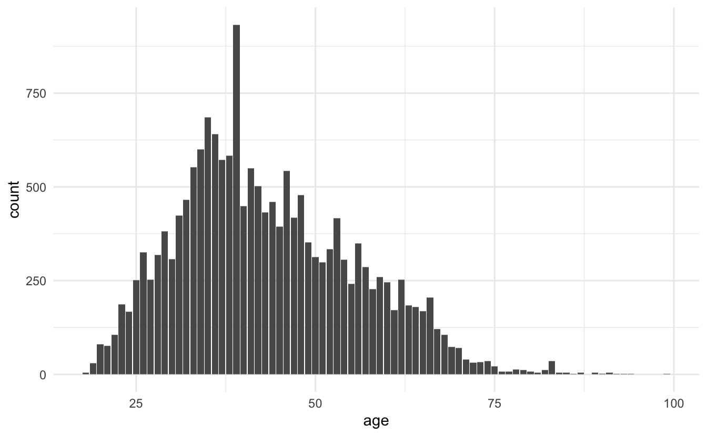

This is the fourth blog post in the [textrecipes](https://github.com/tidymodels/textrecipes) series where I go over the various text preprocessing workflows you can do with textrecipes. This post will be showcasing how to perform [feature hashing](https://en.wikipedia.org/wiki/Feature_hashing)) (also known as the hashing trick). 

## Packages 📦

We will be using  [tidymodels](https://www.tidymodels.org/) for modeling, tidyverse for EDA, and [textrecipes](https://textrecipes.tidymodels.org/) for text preprocessing.


```r
library(tidymodels)
library(tidyverse)
library(textrecipes)
theme_set(theme_minimal())
```

## Exploring the data ⛏

We will use the some data from [Kaggle](https://www.kaggle.com/) containing English^[[#benderrule](https://thegradient.pub/the-benderrule-on-naming-the-languages-we-study-and-why-it-matters/)] [Women's E-Commerce Clothing Reviews](https://www.kaggle.com/nicapotato/womens-ecommerce-clothing-reviews).


```r
reviews <- read_csv("Womens Clothing E-Commerce Reviews.csv")
## Warning: Missing column names filled in: 'X1' [1]
```

We start with a quick `glimpse()` of the data.


```r
glimpse(reviews)
## Rows: 23,486
## Columns: 11
## $ X1                        <dbl> 0, 1, 2, 3, 4, 5, 6, 7, 8, 9, 10, 11, 12, 13…
## $ `Clothing ID`             <dbl> 767, 1080, 1077, 1049, 847, 1080, 858, 858, …
## $ Age                       <dbl> 33, 34, 60, 50, 47, 49, 39, 39, 24, 34, 53, …
## $ Title                     <chr> NA, NA, "Some major design flaws", "My favor…
## $ `Review Text`             <chr> "Absolutely wonderful - silky and sexy and c…
## $ Rating                    <dbl> 4, 5, 3, 5, 5, 2, 5, 4, 5, 5, 3, 5, 5, 5, 3,…
## $ `Recommended IND`         <dbl> 1, 1, 0, 1, 1, 0, 1, 1, 1, 1, 0, 1, 1, 1, 1,…
## $ `Positive Feedback Count` <dbl> 0, 4, 0, 0, 6, 4, 1, 4, 0, 0, 14, 2, 2, 0, 1…
## $ `Division Name`           <chr> "Initmates", "General", "General", "General …
## $ `Department Name`         <chr> "Intimate", "Dresses", "Dresses", "Bottoms",…
## $ `Class Name`              <chr> "Intimates", "Dresses", "Dresses", "Pants", …
```

We have a good split between text variables, numeric and categorical values. 
Let us also take a look at the distribution of the `Rating` variable


```r
reviews %>%
  ggplot(aes(Rating)) +
  geom_bar()
```


Which is quite right-skewed. 
Let us collapse the ratings into 2 groups, 5 and less-then-5.
Before we go on will I remove the row number variable `X1` and clean the column names with the [janitor](https://garthtarr.github.io/meatR/janitor.html) package to remove cases and spaces.


```r
reviews <- reviews %>%
  select(-X1) %>%
  janitor::clean_names() %>%
  mutate(rating = factor(rating == 5, c(TRUE, FALSE), c("5", "<5")))
```

Before we do some exploratory analysis we will split the data into training and testing datasets.
We do this to avoid learning this about the data that would only be available in the testing data set.


```r
set.seed(1234)

reviews_split <- initial_split(reviews)

reviews_train <- training(reviews_split)
```

Our main objective is to predict the rating based on the text review.
This will naturally exclude variables such as `Recommended IND` and `Positive Feedback Count` as that information is unlikely to be known before the rating is given.
We will mostly be using the text variables (`Review Text` and `Title`) but I am going to take a look at some of the other variables before we move on in case they would be easy inclusions.

The ratings were pretty highly right-skewed and even when we collapsed them there are still more 5s.


```r
reviews_train %>%
  ggplot(aes(rating)) +
  geom_bar()
```


Since we have the age let us take a look to make sure it has a reasonable range.


```r
reviews_train %>%
  ggplot(aes(age)) +
  geom_bar()
```



Nothing too out of the ordinary, we have some young people and old people but nothing weird.
Out of curiosity let us take a look at that one age that is above the pack.


```r
reviews_train %>%
  count(age, sort = TRUE)
## # A tibble: 77 x 2
##      age     n
##    <dbl> <int>
##  1    39   932
##  2    35   685
##  3    36   640
##  4    34   600
##  5    38   583
##  6    37   572
##  7    33   552
##  8    41   549
##  9    46   543
## 10    42   502
## # … with 67 more rows
```

Since we have the clothing id, then I want to know if any of the reviews apply to the same articles of clothing.


```r
reviews_train %>%
  count(clothing_id, sort = TRUE) 
## # A tibble: 1,068 x 2
##    clothing_id     n
##          <dbl> <int>
##  1        1078   758
##  2         862   603
##  3        1094   580
##  4         872   420
##  5        1081   415
##  6         829   409
##  7        1110   347
##  8         868   329
##  9         895   309
## 10         936   264
## # … with 1,058 more rows
```

So out of 17614 we have 1068 clothing articles. 
Let us see how the reviews are split between the variables


```r
reviews_train %>%
  count(clothing_id, sort = TRUE) %>%
  mutate(x = row_number()) %>%
  ggplot(aes(x, n)) +
  geom_point()
```


And we see quite a fast drop-off.

I'm trying to create a fairly simple model so I won't be including much information.

## Modeling ⚙️

We will restrict ourselves to only use the two text fields and the age of the customer.

We tokenize the text fields and pass them to `step_texthash()` to perform feature hashing.
The default number of variables created with `step_texthash()` is 1024 and is specified with the `num_terms` argument.
We will leave this parameter to the default, but you can tune it like many other hyperparameters, see [Textrecipes series: Term Frequency](https://www.hvitfeldt.me/blog/textrecipes-series-tf/) for an example of tuning a recipe parameter.


```r
rec_spec <- recipe(rating ~ age + title + review_text, data = reviews_train) %>%
  step_tokenize(title, review_text) %>%
  step_tokenmerge(title, review_text, prefix = "text")

rec_spec_fh <- rec_spec %>%
  step_texthash(text)
```

We are using `step_tokenmerge()` to combine the tokens created in `title` and `review_text` into one list of tokens. There aren't that many tokens in `title` alone for it to warrant treating it as a separate list of tokens.

Next, we specify a lasso model.


```r
lasso_spec <- logistic_reg(penalty = tune(), mixture = 1) %>%
  set_engine("glmnet")
```

I have specified `penalty = tune()` because I want to use [tune](https://tune.tidymodels.org/) to find the best value of the penalty by doing hyperparameter tuning.

We set up a parameter grid using `grid_regular()`


```r
param_grid <- grid_regular(penalty(), levels = 50)
```

searching over 50 levels might seem like a lot. But remember that glmnet can calculate them all at once.
This is because it relies on its warms starts for speed and it is often faster to fit a whole path than compute a single fit.

We will also set up some bootstraps of the data so we can evaluate the performance multiple times for each level.


```r
reviews_boot <- bootstraps(reviews_train, times = 10)
```

the last thing we need to use is to create a workflow object to combine the preprocessing step with the model.
This is important because we want the preprocessing steps to happen in the bootstraps.


```r
wf_fh <- workflow() %>%
  add_recipe(rec_spec_fh) %>%
  add_model(lasso_spec)
```

now we are ready to perform the parameter tuning.


```r
set.seed(42)
lasso_grid <- tune_grid(
  wf_fh,
  resamples = reviews_boot,
  grid = param_grid
) 
```

Once we have finished parameter tuning we can use the `autoplot()` function on the tuning results to get a nice chart showing the performance for different values of the penalty.


```r
lasso_grid %>%
  autoplot()
```


and it appears that the best value for the penalty for this workflow is on the low end.
Similarly, can we use the `show_best()` function from tune to show to the best performing hyperparameter.


```r
lasso_grid %>%
  show_best("roc_auc")
## # A tibble: 5 x 7
##   penalty .metric .estimator  mean     n std_err .config              
##     <dbl> <chr>   <chr>      <dbl> <int>   <dbl> <chr>                
## 1 0.00356 roc_auc binary     0.840    10 0.00125 Preprocessor1_Model38
## 2 0.00569 roc_auc binary     0.839    10 0.00129 Preprocessor1_Model39
## 3 0.00222 roc_auc binary     0.837    10 0.00119 Preprocessor1_Model37
## 4 0.00910 roc_auc binary     0.834    10 0.00147 Preprocessor1_Model40
## 5 0.00139 roc_auc binary     0.833    10 0.00108 Preprocessor1_Model36
```

We will use the `select_best()` function to extract the best performing penalty and finalize the workflow with that value of penalty.


```r
wf_fh_final <- wf_fh %>%
  finalize_workflow(parameters = select_best(lasso_grid, "roc_auc"))
```

Now we can run `last_fit()` on our training/testing split to fit our final model.


```r
final_res <- last_fit(wf_fh_final, reviews_split)
```

With our final model can we create a ROC curve of our final model.


```r
final_res %>%
  collect_predictions() %>%
  roc_curve(rating, .pred_5) %>%
  autoplot()
```


## Compare Feature Hashing with Term frequency

One of the benefits of using feature hashing is that it is only slightly worse than using a standard term frequency as we saw in [the first post of the series](https://www.hvitfeldt.me/blog/textrecipes-series-tf/).
To demonstrate that idea will I fit a second workflow where we preprocess to term frequencies instead of feature hashing as the only chance.
I will not be going over this chunk of code as it is very similar to what we have just seen.


```r
rec_spec_tf <- rec_spec %>%
  step_tokenfilter(text, max_tokens = 1024) %>%
  step_tf(text)

wf_tf <- wf_fh %>%
  update_recipe(rec_spec_tf)

set.seed(123456)
lasso_grid_tf <- tune_grid(
  wf_tf,
  resamples = reviews_boot,
  grid = param_grid
)

wf_tf_final <- wf_tf %>%
  finalize_workflow(parameters = select_best(lasso_grid_tf, "roc_auc"))

final_res_tf <- last_fit(wf_tf_final, reviews_split)
```

Note how we can reuse parts of the original workflow by updating the recipe with `update_recipe()`.

Now that we have the two fitted models can we combine them and generate the ROC curve for both models together.


```r
bind_rows(
  collect_predictions(final_res) %>% mutate(model = "Feature Hashing"),
  collect_predictions(final_res_tf) %>%  mutate(model = "Term Frequency")
) %>%
  group_by(model) %>%
  roc_curve(rating, .pred_5) %>%
  autoplot()
```


And we see that feature hashing is not that far behind Term frequency, despite its ease of use.
Note that this ease of use comes with the downside that it is very difficult to access the model performance of individual tokens.
