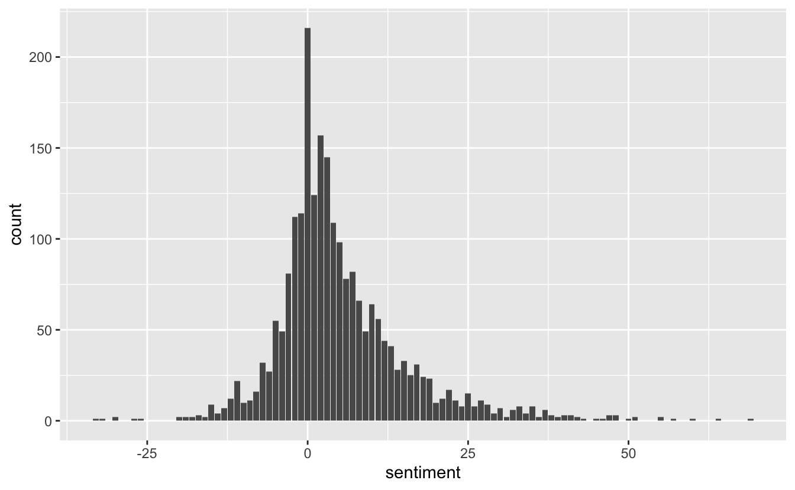
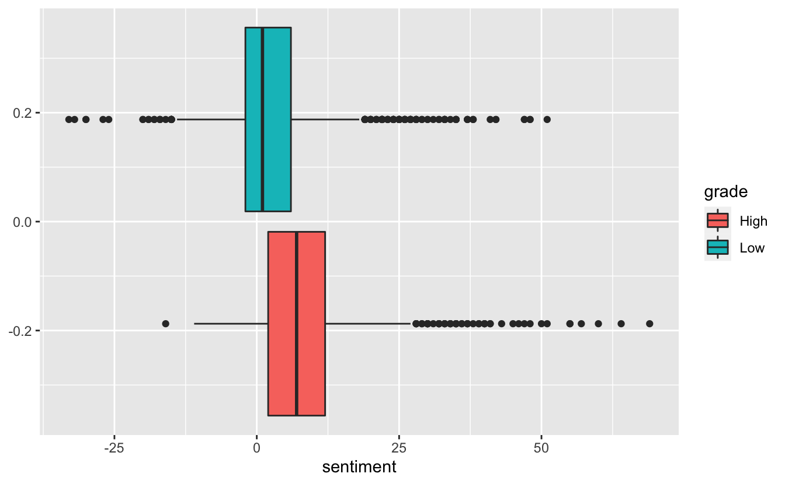

This is the second blog post in the [textrecipes](https://github.com/tidymodels/textrecipes) series where I go over the various text preprocessing workflows you can do with textrecipes. This post will be covering how to use lexicons to create features.
This post will not cover end-to-end modeling but will only look at how to add lexicons information into your recipe.

## Packages 📦

We are going fairly light package wise this time only needing [tidymodels](https://www.tidymodels.org/), textrecipes, and lastly tidytext for EDA. We will also be using [textdata](https://github.com/EmilHvitfeldt/textdata) to provide lexicons.


```r
library(tidymodels)
library(textrecipes)
library(tidytext)
library(textdata)
theme_set(theme_minimal())
```

## What is a lexicon?

A lexicon is a list of words with one or more corresponding values for each word.
You could imagine a sentiment lexicon having entries such as "awesome = 1", "terrible = -1" and "okay = 0".
Having this information could be useful if you want to predict if some text is positively charged or negatively charged.

One real-world lexicon is the [AFINN](http://www2.imm.dtu.dk/pubdb/pubs/6010-full.html) lexicon.
It rates English words on a scale from -5 (negative) to 5 (positive).
The words have been manually labeled by Finn Årup Nielsen in 2009-2011.
It is available in textdata as the function `lexicon_afinn()`


```r
lexicon_afinn()
## # A tibble: 2,477 x 2
##    word       value
##    <chr>      <dbl>
##  1 abandon       -2
##  2 abandoned     -2
##  3 abandons      -2
##  4 abducted      -2
##  5 abduction     -2
##  6 abductions    -2
##  7 abhor         -3
##  8 abhorred      -3
##  9 abhorrent     -3
## 10 abhors        -3
## # … with 2,467 more rows
```

:::note
The first time you use a function in textdata you are given a prompt to download. Please carefully read the prompt to make sure you are able to conform to the license and the demands of the authors.
:::

And we have plenty of words.
Note that this list doesn't give every possible word-value pair, this is partly because words with no apparent sentiment such as (cat, house, government) haven't been encluded.
Always make sure to manually inspect a premade lexicon before using it in your application.
Make sure that the domain you are working in is similar to the domain the lexicon was created for. 
An example of a domain-specific lexicon is the Loughran-McDonald sentiment lexicon (`lexicon_loughran()`) which was created for use with financial documents.

## The data

We will be using the data Animal Crossing data from the last post again.


```r
user_reviews <- readr::read_tsv('https://raw.githubusercontent.com/rfordatascience/tidytuesday/master/data/2020/2020-05-05/user_reviews.tsv')

user_reviews <- user_reviews %>%
  mutate(grade = factor(grade > 7, c(TRUE, FALSE), c("High", "Low")))

set.seed(1234)
review_split <- initial_split(user_reviews)

review_training <- training(review_split)
review_testing <- training(review_split)
```

We can use lexicons in our text mining with tidytext too.
First, we will tokenize


```r
review_tokens <- review_training %>%
  select(grade, user_name, text) %>%
  unnest_tokens(tokens, text)

review_tokens
## # A tibble: 270,013 x 3
##    grade user_name tokens 
##    <fct> <chr>     <chr>  
##  1 Low   mds27272  my     
##  2 Low   mds27272  gf     
##  3 Low   mds27272  started
##  4 Low   mds27272  playing
##  5 Low   mds27272  before 
##  6 Low   mds27272  me     
##  7 Low   mds27272  no     
##  8 Low   mds27272  option 
##  9 Low   mds27272  to     
## 10 Low   mds27272  create 
## # … with 270,003 more rows
```

then we can use a `left_join()` to add a sentiment variable

```r
review_tokens %>%
  left_join(lexicon_afinn(), by = c("tokens" = "word"))
## # A tibble: 270,013 x 4
##    grade user_name tokens  value
##    <fct> <chr>     <chr>   <dbl>
##  1 Low   mds27272  my         NA
##  2 Low   mds27272  gf         NA
##  3 Low   mds27272  started    NA
##  4 Low   mds27272  playing    NA
##  5 Low   mds27272  before     NA
##  6 Low   mds27272  me         NA
##  7 Low   mds27272  no         -1
##  8 Low   mds27272  option     NA
##  9 Low   mds27272  to         NA
## 10 Low   mds27272  create     NA
## # … with 270,003 more rows
```

If we want to look at the overall document-wise sentiment level we can sum the values within each document


```r
review_tokens_sentiment <- review_tokens %>%
  left_join(lexicon_afinn(), by = c("tokens" = "word")) %>%
  group_by(user_name, grade) %>% 
  summarise(sentiment = sum(value, na.rm = TRUE))

review_tokens_sentiment
## # A tibble: 2,250 x 3
## # Groups:   user_name [2,250]
##    user_name     grade sentiment
##    <chr>         <fct>     <dbl>
##  1 11_11         Low          16
##  2 12hwilso      Low           3
##  3 1mooey        High         10
##  4 24ths         Low           1
##  5 3nd3r02       Low          25
##  6 425_Flex      Low         -11
##  7 7kurtis7      Low          -3
##  8 7Swords       Low          -2
##  9 8bheotapus    Low          -7
## 10 A_Mighty_Pleb Low           0
## # … with 2,240 more rows
```

Since the AFINN lexicon is centered around 0 we can very generally say that positive scores tend to be more positive and a negative score will tend to accompany negative texts.

:::note
There are many oversimplifications going on here. We are not taking sentence length into account. There is no reason to believe a 100-word review with a score of 10 is any less positive than a 1000-word review with a score of 100. It is also not obvious that "a breathtaking(5) bastard(-5)" is a neutral statement.
:::

We can visualize the final distribution


```r
review_tokens_sentiment %>% 
  ggplot(aes(sentiment)) +
  geom_bar()
```



But it would be more informative if we include `grade` to see if there is a difference


```r
review_tokens_sentiment %>% 
  ggplot(aes(sentiment, fill = grade)) +
  geom_boxplot()
```



It appears that the lexicon is not entirely useless.
The sentiments for highly-rated reviews are a little bit higher.

## Reshaping a lexicon

A lexicon needs to be in a specific format to be used in textrecipes. 
We need a tibble with the first column containing tokens and any additional columns should contain the numerics.
`lexicon_afinn()` already meets the demand and can be used directly.
The `lexicon_loughran()` doesn't give us the information we want. 


```r
lexicon_loughran()
## # A tibble: 4,150 x 2
##    word         sentiment
##    <chr>        <chr>    
##  1 abandon      negative 
##  2 abandoned    negative 
##  3 abandoning   negative 
##  4 abandonment  negative 
##  5 abandonments negative 
##  6 abandons     negative 
##  7 abdicated    negative 
##  8 abdicates    negative 
##  9 abdicating   negative 
## 10 abdication   negative 
## # … with 4,140 more rows
```

With the sentiment being a character denoting the sentiment of the word. 
What might not be obvious at first glance of this lexicon is that a word can have multiple sentiments such as the word "encumber" which has 3


```r
lexicon_loughran() %>%
  filter(word == "encumber")
## # A tibble: 3 x 2
##   word     sentiment   
##   <chr>    <chr>       
## 1 encumber negative    
## 2 encumber litigious   
## 3 encumber constraining
```

We can use [tidyr](https://tidyr.tidyverse.org/) to turn this into a wide format.


```r
lexicon_loughran_wide <- lexicon_loughran() %>%
  mutate(var = 1) %>% 
  tidyr::pivot_wider(names_from = sentiment, 
                     values_from = var, 
                     values_fill = list(var = 0))

lexicon_loughran_wide
## # A tibble: 3,917 x 7
##    word         negative positive uncertainty litigious constraining superfluous
##    <chr>           <dbl>    <dbl>       <dbl>     <dbl>        <dbl>       <dbl>
##  1 abandon             1        0           0         0            0           0
##  2 abandoned           1        0           0         0            0           0
##  3 abandoning          1        0           0         0            0           0
##  4 abandonment         1        0           0         0            0           0
##  5 abandonments        1        0           0         0            0           0
##  6 abandons            1        0           0         0            0           0
##  7 abdicated           1        0           0         0            0           0
##  8 abdicates           1        0           0         0            0           0
##  9 abdicating          1        0           0         0            0           0
## 10 abdication          1        0           0         0            0           0
## # … with 3,907 more rows
```

This is now be used.
Textrecipes are able to handle multi-axis lexicons with no problems.

## Using textrecipes

To use these lexicons in our modeling step will we use the `step_word_embeddings()` step.
This is normally used for [word embeddings](https://ruder.io/word-embeddings-1/), but you can treat a lexicon (when transformed according to the last section) as a selection of word vector or in other words a word embedding.

To see the effect lets create a minimal recipe that only sums along the lexicons using the AFINN lexicon


```r
recipe(~ text, data = review_training) %>%
  step_tokenize(text) %>%
  step_word_embeddings(text, embeddings = lexicon_afinn()) %>%
  prep() %>%
  juice()
## # A tibble: 2,250 x 1
##    w_embed_sum_value
##                <dbl>
##  1               -11
##  2                 7
##  3                -5
##  4                 9
##  5                 2
##  6                16
##  7                11
##  8                 0
##  9                 4
## 10                -3
## # … with 2,240 more rows
```

This gives us 1 column of the sum of the values. 
If we instead used the `lexicon_loughran_wide` lexicon the get back 6 variables.


```r
recipe(~ text, data = review_training) %>%
  step_tokenize(text) %>%
  step_word_embeddings(text, embeddings = lexicon_loughran_wide, prefix = "loughran") %>%
  prep() %>%
  juice()
## # A tibble: 2,250 x 6
##    loughran_sum_ne… loughran_sum_po… loughran_sum_un… loughran_sum_li…
##               <dbl>            <dbl>            <dbl>            <dbl>
##  1                2                0                0                0
##  2                2                8                0                0
##  3                2                0                0                0
##  4                0                3                0                0
##  5                2                2                1                0
##  6                2                5                6                0
##  7                0                4                0                0
##  8                1                0                0                0
##  9                2                5                0                0
## 10                0                0                0                0
## # … with 2,240 more rows, and 2 more variables:
## #   loughran_sum_constraining <dbl>, loughran_sum_superfluous <dbl>
```

To use the lexicon values along with side term frequencies can we use `step_mutate()` to create a separate variable to be used for lexicon calculations.


```r
rec_spec <- recipe(grade ~ text + date, review_training) %>%
  # Days since release
  step_mutate(date = as.numeric(date - as.Date("2020-03-20"))) %>%
  # Tokenize to words
  step_tokenize(text) %>%
  
  # Create copy of text variable
  step_mutate(text_lexicon = text) %>%
  # Apply lexicon counting
  step_word_embeddings(text_lexicon, embeddings = lexicon_afinn(), prefix = "afinn") %>%
  
  # Remove stopwords
  step_stopwords(text) %>%
  # Remove less frequent words
  step_tokenfilter(text, max_tokens = 100) %>%
  # Calculate term frequencies
  step_tf(text, weight_scheme = "binary")

rec_spec
## Data Recipe
## 
## Inputs:
## 
##       role #variables
##    outcome          1
##  predictor          2
## 
## Operations:
## 
## Variable mutation for date
## Tokenization for text
## Variable mutation for text_lexicon
## Word embeddings aggregated from text_lexicon
## Stop word removal for text
## Text filtering for text
## Term frequency with text
```

By inspectiong the results we get:


```r
rec_spec %>%
  prep() %>%
  juice()
## # A tibble: 2,250 x 103
##     date grade afinn_sum_value tf_text_1 tf_text_10 tf_text_2 tf_text_able
##    <dbl> <fct>           <dbl> <lgl>     <lgl>      <lgl>     <lgl>       
##  1     0 Low               -11 FALSE     FALSE      FALSE     FALSE       
##  2     0 Low                 7 TRUE      FALSE      FALSE     TRUE        
##  3     0 Low                -5 FALSE     FALSE      FALSE     FALSE       
##  4     0 Low                 9 FALSE     FALSE      FALSE     FALSE       
##  5     0 Low                 2 FALSE     FALSE      FALSE     TRUE        
##  6     0 Low                16 FALSE     FALSE      FALSE     FALSE       
##  7     0 Low                11 FALSE     FALSE      FALSE     FALSE       
##  8     0 Low                 0 FALSE     FALSE      FALSE     FALSE       
##  9     0 Low                 4 FALSE     FALSE      FALSE     FALSE       
## 10     0 Low                -3 FALSE     FALSE      FALSE     FALSE       
## # … with 2,240 more rows, and 96 more variables: tf_text_absolutely <lgl>,
## #   tf_text_account <lgl>, tf_text_actually <lgl>, tf_text_also <lgl>,
## #   tf_text_amazing <lgl>, tf_text_animal <lgl>, tf_text_another <lgl>,
## #   tf_text_anything <lgl>, tf_text_back <lgl>, tf_text_bad <lgl>,
## #   tf_text_best <lgl>, tf_text_bought <lgl>, tf_text_buy <lgl>,
## #   tf_text_can <lgl>, tf_text_console <lgl>, tf_text_crossing <lgl>,
## #   tf_text_day <lgl>, tf_text_else <lgl>, tf_text_enjoy <lgl>,
## #   tf_text_even <lgl>, tf_text_ever <lgl>, tf_text_every <lgl>,
## #   tf_text_everyone <lgl>, tf_text_everything <lgl>, tf_text_expand <lgl>,
## #   tf_text_experience <lgl>, tf_text_fact <lgl>, tf_text_family <lgl>,
## #   tf_text_feel <lgl>, tf_text_first <lgl>, tf_text_full <lgl>,
## #   tf_text_fun <lgl>, tf_text_game <lgl>, tf_text_games <lgl>,
## #   tf_text_get <lgl>, tf_text_gets <lgl>, tf_text_give <lgl>,
## #   tf_text_go <lgl>, tf_text_going <lgl>, tf_text_good <lgl>,
## #   tf_text_great <lgl>, tf_text_horizons <lgl>, tf_text_island <lgl>,
## #   tf_text_islands <lgl>, `tf_text_it’s` <lgl>, tf_text_just <lgl>,
## #   tf_text_let <lgl>, tf_text_like <lgl>, tf_text_little <lgl>,
## #   tf_text_lot <lgl>, tf_text_love <lgl>, tf_text_made <lgl>,
## #   tf_text_make <lgl>, tf_text_makes <lgl>, tf_text_many <lgl>,
## #   tf_text_money <lgl>, tf_text_much <lgl>, tf_text_multiplayer <lgl>,
## #   tf_text_multiple <lgl>, tf_text_never <lgl>, tf_text_new <lgl>,
## #   tf_text_nintendo <lgl>, tf_text_now <lgl>, tf_text_one <lgl>,
## #   tf_text_people <lgl>, tf_text_per <lgl>, tf_text_person <lgl>,
## #   tf_text_play <lgl>, tf_text_played <lgl>, tf_text_player <lgl>,
## #   tf_text_players <lgl>, tf_text_playing <lgl>, tf_text_progress <lgl>,
## #   tf_text_really <lgl>, tf_text_review <lgl>, tf_text_save <lgl>,
## #   tf_text_second <lgl>, tf_text_see <lgl>, tf_text_series <lgl>,
## #   tf_text_share <lgl>, tf_text_since <lgl>, tf_text_single <lgl>,
## #   tf_text_start <lgl>, tf_text_still <lgl>, tf_text_switch <lgl>,
## #   tf_text_system <lgl>, tf_text_thing <lgl>, tf_text_things <lgl>,
## #   tf_text_think <lgl>, tf_text_time <lgl>, tf_text_two <lgl>,
## #   tf_text_us <lgl>, tf_text_want <lgl>, tf_text_way <lgl>,
## #   tf_text_well <lgl>, tf_text_wife <lgl>
```

<details closed>
<summary> <span title='Click to Expand'> session information </span> </summary>

```r

─ Session info ───────────────────────────────────────────────────────────────
 setting  value                       
 version  R version 4.0.0 (2020-04-24)
 os       macOS Mojave 10.14.6        
 system   x86_64, darwin17.0          
 ui       X11                         
 language (EN)                        
 collate  en_US.UTF-8                 
 ctype    en_US.UTF-8                 
 tz       America/Los_Angeles         
 date     2020-05-11                  

─ Packages ───────────────────────────────────────────────────────────────────
 package       * version    date       lib source                     
 assertthat      0.2.1      2019-03-21 [1] CRAN (R 4.0.0)             
 backports       1.1.6      2020-04-05 [1] CRAN (R 4.0.0)             
 base64enc       0.1-3      2015-07-28 [1] CRAN (R 4.0.0)             
 bayesplot       1.7.1      2019-12-01 [1] CRAN (R 4.0.0)             
 blogdown        0.18       2020-03-04 [1] CRAN (R 4.0.0)             
 bookdown        0.18       2020-03-05 [1] CRAN (R 4.0.0)             
 boot            1.3-25     2020-04-26 [1] CRAN (R 4.0.0)             
 broom         * 0.5.6      2020-04-20 [1] CRAN (R 4.0.0)             
 callr           3.4.3      2020-03-28 [1] CRAN (R 4.0.0)             
 class           7.3-17     2020-04-26 [1] CRAN (R 4.0.0)             
 cli             2.0.2      2020-02-28 [1] CRAN (R 4.0.0)             
 clipr           0.7.0      2019-07-23 [1] CRAN (R 4.0.0)             
 codetools       0.2-16     2018-12-24 [1] CRAN (R 4.0.0)             
 colorspace      1.4-1      2019-03-18 [1] CRAN (R 4.0.0)             
 colourpicker    1.0        2017-09-27 [1] CRAN (R 4.0.0)             
 crayon          1.3.4      2017-09-16 [1] CRAN (R 4.0.0)             
 crosstalk       1.1.0.1    2020-03-13 [1] CRAN (R 4.0.0)             
 desc            1.2.0      2018-05-01 [1] CRAN (R 4.0.0)             
 details       * 0.2.1      2020-01-12 [1] CRAN (R 4.0.0)             
 dials         * 0.0.6      2020-04-03 [1] CRAN (R 4.0.0)             
 DiceDesign      1.8-1      2019-07-31 [1] CRAN (R 4.0.0)             
 digest          0.6.25     2020-02-23 [1] CRAN (R 4.0.0)             
 dplyr         * 0.8.5      2020-03-07 [1] CRAN (R 4.0.0)             
 DT              0.13       2020-03-23 [1] CRAN (R 4.0.0)             
 dygraphs        1.1.1.6    2018-07-11 [1] CRAN (R 4.0.0)             
 ellipsis        0.3.0      2019-09-20 [1] CRAN (R 4.0.0)             
 emo             0.0.0.9000 2020-05-12 [1] Github (hadley/emo@3f03b11)
 evaluate        0.14       2019-05-28 [1] CRAN (R 4.0.0)             
 fansi           0.4.1      2020-01-08 [1] CRAN (R 4.0.0)             
 fastmap         1.0.1      2019-10-08 [1] CRAN (R 4.0.0)             
 foreach         1.5.0      2020-03-30 [1] CRAN (R 4.0.0)             
 fs              1.4.1      2020-04-04 [1] CRAN (R 4.0.0)             
 furrr           0.1.0      2018-05-16 [1] CRAN (R 4.0.0)             
 future          1.17.0     2020-04-18 [1] CRAN (R 4.0.0)             
 generics        0.0.2      2018-11-29 [1] CRAN (R 4.0.0)             
 ggplot2       * 3.3.0      2020-03-05 [1] CRAN (R 4.0.0)             
 ggridges        0.5.2      2020-01-12 [1] CRAN (R 4.0.0)             
 globals         0.12.5     2019-12-07 [1] CRAN (R 4.0.0)             
 glue            1.4.0      2020-04-03 [1] CRAN (R 4.0.0)             
 gower           0.2.1      2019-05-14 [1] CRAN (R 4.0.0)             
 GPfit           1.0-8      2019-02-08 [1] CRAN (R 4.0.0)             
 gridExtra       2.3        2017-09-09 [1] CRAN (R 4.0.0)             
 gtable          0.3.0      2019-03-25 [1] CRAN (R 4.0.0)             
 gtools          3.8.2      2020-03-31 [1] CRAN (R 4.0.0)             
 htmltools       0.4.0      2019-10-04 [1] CRAN (R 4.0.0)             
 htmlwidgets     1.5.1      2019-10-08 [1] CRAN (R 4.0.0)             
 httpuv          1.5.2      2019-09-11 [1] CRAN (R 4.0.0)             
 httr            1.4.1      2019-08-05 [1] CRAN (R 4.0.0)             
 igraph          1.2.5      2020-03-19 [1] CRAN (R 4.0.0)             
 infer         * 0.5.1      2019-11-19 [1] CRAN (R 4.0.0)             
 inline          0.3.15     2018-05-18 [1] CRAN (R 4.0.0)             
 ipred           0.9-9      2019-04-28 [1] CRAN (R 4.0.0)             
 iterators       1.0.12     2019-07-26 [1] CRAN (R 4.0.0)             
 janeaustenr     0.1.5      2017-06-10 [1] CRAN (R 4.0.0)             
 knitr         * 1.28       2020-02-06 [1] CRAN (R 4.0.0)             
 later           1.0.0      2019-10-04 [1] CRAN (R 4.0.0)             
 lattice         0.20-41    2020-04-02 [1] CRAN (R 4.0.0)             
 lava            1.6.7      2020-03-05 [1] CRAN (R 4.0.0)             
 lhs             1.0.2      2020-04-13 [1] CRAN (R 4.0.0)             
 lifecycle       0.2.0      2020-03-06 [1] CRAN (R 4.0.0)             
 listenv         0.8.0      2019-12-05 [1] CRAN (R 4.0.0)             
 lme4            1.1-23     2020-04-07 [1] CRAN (R 4.0.0)             
 loo             2.2.0      2019-12-19 [1] CRAN (R 4.0.0)             
 lubridate       1.7.8      2020-04-06 [1] CRAN (R 4.0.0)             
 magrittr        1.5        2014-11-22 [1] CRAN (R 4.0.0)             
 markdown        1.1        2019-08-07 [1] CRAN (R 4.0.0)             
 MASS            7.3-51.6   2020-04-26 [1] CRAN (R 4.0.0)             
 Matrix          1.2-18     2019-11-27 [1] CRAN (R 4.0.0)             
 matrixStats     0.56.0     2020-03-13 [1] CRAN (R 4.0.0)             
 mime            0.9        2020-02-04 [1] CRAN (R 4.0.0)             
 miniUI          0.1.1.1    2018-05-18 [1] CRAN (R 4.0.0)             
 minqa           1.2.4      2014-10-09 [1] CRAN (R 4.0.0)             
 munsell         0.5.0      2018-06-12 [1] CRAN (R 4.0.0)             
 nlme            3.1-147    2020-04-13 [1] CRAN (R 4.0.0)             
 nloptr          1.2.2.1    2020-03-11 [1] CRAN (R 4.0.0)             
 nnet            7.3-14     2020-04-26 [1] CRAN (R 4.0.0)             
 parsnip       * 0.1.1      2020-05-06 [1] CRAN (R 4.0.0)             
 pillar          1.4.4      2020-05-05 [1] CRAN (R 4.0.0)             
 pkgbuild        1.0.8      2020-05-07 [1] CRAN (R 4.0.0)             
 pkgconfig       2.0.3      2019-09-22 [1] CRAN (R 4.0.0)             
 plyr            1.8.6      2020-03-03 [1] CRAN (R 4.0.0)             
 png             0.1-7      2013-12-03 [1] CRAN (R 4.0.0)             
 prettyunits     1.1.1      2020-01-24 [1] CRAN (R 4.0.0)             
 pROC            1.16.2     2020-03-19 [1] CRAN (R 4.0.0)             
 processx        3.4.2      2020-02-09 [1] CRAN (R 4.0.0)             
 prodlim         2019.11.13 2019-11-17 [1] CRAN (R 4.0.0)             
 promises        1.1.0      2019-10-04 [1] CRAN (R 4.0.0)             
 ps              1.3.3      2020-05-08 [1] CRAN (R 4.0.0)             
 purrr         * 0.3.4      2020-04-17 [1] CRAN (R 4.0.0)             
 R6              2.4.1      2019-11-12 [1] CRAN (R 4.0.0)             
 Rcpp            1.0.4.6    2020-04-09 [1] CRAN (R 4.0.0)             
 recipes       * 0.1.12     2020-05-01 [1] CRAN (R 4.0.0)             
 reshape2        1.4.4      2020-04-09 [1] CRAN (R 4.0.0)             
 rlang           0.4.6      2020-05-02 [1] CRAN (R 4.0.0)             
 rmarkdown       2.1        2020-01-20 [1] CRAN (R 4.0.0)             
 rpart           4.1-15     2019-04-12 [1] CRAN (R 4.0.0)             
 rprojroot       1.3-2      2018-01-03 [1] CRAN (R 4.0.0)             
 rsample       * 0.0.6      2020-03-31 [1] CRAN (R 4.0.0)             
 rsconnect       0.8.16     2019-12-13 [1] CRAN (R 4.0.0)             
 rstan           2.19.3     2020-02-11 [1] CRAN (R 4.0.0)             
 rstanarm        2.19.3     2020-02-11 [1] CRAN (R 4.0.0)             
 rstantools      2.0.0      2019-09-15 [1] CRAN (R 4.0.0)             
 rstudioapi      0.11       2020-02-07 [1] CRAN (R 4.0.0)             
 scales        * 1.1.1      2020-05-11 [1] CRAN (R 4.0.0)             
 sessioninfo     1.1.1      2018-11-05 [1] CRAN (R 4.0.0)             
 shiny           1.4.0.2    2020-03-13 [1] CRAN (R 4.0.0)             
 shinyjs         1.1        2020-01-13 [1] CRAN (R 4.0.0)             
 shinystan       2.5.0      2018-05-01 [1] CRAN (R 4.0.0)             
 shinythemes     1.1.2      2018-11-06 [1] CRAN (R 4.0.0)             
 SnowballC       0.7.0      2020-04-01 [1] CRAN (R 4.0.0)             
 StanHeaders     2.19.2     2020-02-11 [1] CRAN (R 4.0.0)             
 statmod         1.4.34     2020-02-17 [1] CRAN (R 4.0.0)             
 stopwords       2.0        2020-04-14 [1] CRAN (R 4.0.0)             
 stringi         1.4.6      2020-02-17 [1] CRAN (R 4.0.0)             
 stringr         1.4.0      2019-02-10 [1] CRAN (R 4.0.0)             
 survival        3.1-12     2020-04-10 [1] CRAN (R 4.0.0)             
 textrecipes   * 0.2.2      2020-05-10 [1] CRAN (R 4.0.0)             
 threejs         0.3.3      2020-01-21 [1] CRAN (R 4.0.0)             
 tibble        * 3.0.1      2020-04-20 [1] CRAN (R 4.0.0)             
 tidymodels    * 0.1.0      2020-02-16 [1] CRAN (R 4.0.0)             
 tidyposterior   0.0.2      2018-11-15 [1] CRAN (R 4.0.0)             
 tidypredict     0.4.5      2020-02-10 [1] CRAN (R 4.0.0)             
 tidyr           1.0.3      2020-05-07 [1] CRAN (R 4.0.0)             
 tidyselect      1.1.0      2020-05-11 [1] CRAN (R 4.0.0)             
 tidytext      * 0.2.4      2020-04-17 [1] CRAN (R 4.0.0)             
 timeDate        3043.102   2018-02-21 [1] CRAN (R 4.0.0)             
 tokenizers      0.2.1      2018-03-29 [1] CRAN (R 4.0.0)             
 tune          * 0.1.0      2020-04-02 [1] CRAN (R 4.0.0)             
 usethis         1.6.1      2020-04-29 [1] CRAN (R 4.0.0)             
 vctrs           0.3.0      2020-05-11 [1] CRAN (R 4.0.0)             
 withr           2.2.0      2020-04-20 [1] CRAN (R 4.0.0)             
 workflows     * 0.1.1      2020-03-17 [1] CRAN (R 4.0.0)             
 xfun            0.13       2020-04-13 [1] CRAN (R 4.0.0)             
 xml2            1.3.2      2020-04-23 [1] CRAN (R 4.0.0)             
 xtable          1.8-4      2019-04-21 [1] CRAN (R 4.0.0)             
 xts             0.12-0     2020-01-19 [1] CRAN (R 4.0.0)             
 yaml            2.2.1      2020-02-01 [1] CRAN (R 4.0.0)             
 yardstick     * 0.0.6      2020-03-17 [1] CRAN (R 4.0.0)             
 zoo             1.8-8      2020-05-02 [1] CRAN (R 4.0.0)             

[1] /Library/Frameworks/R.framework/Versions/4.0/Resources/library

```

</details>
<br>
