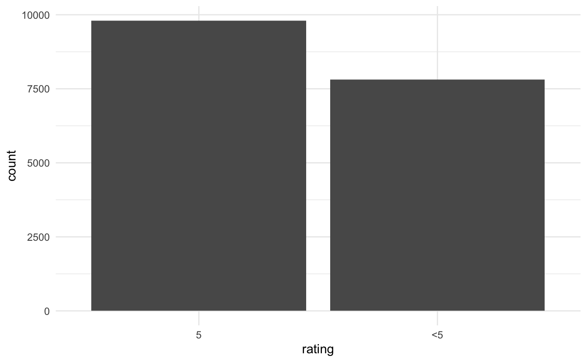
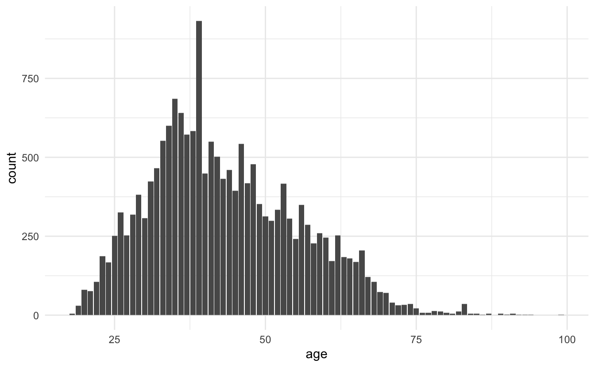
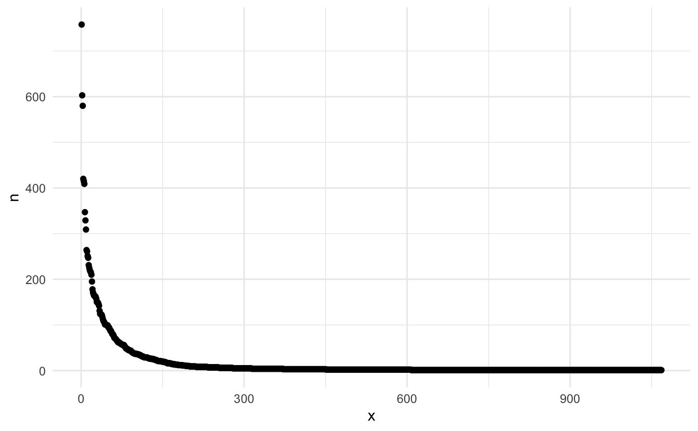
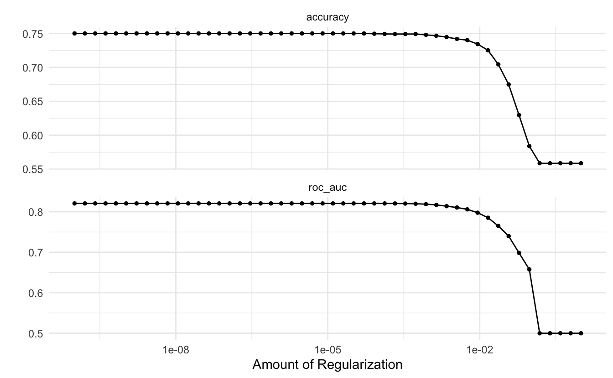
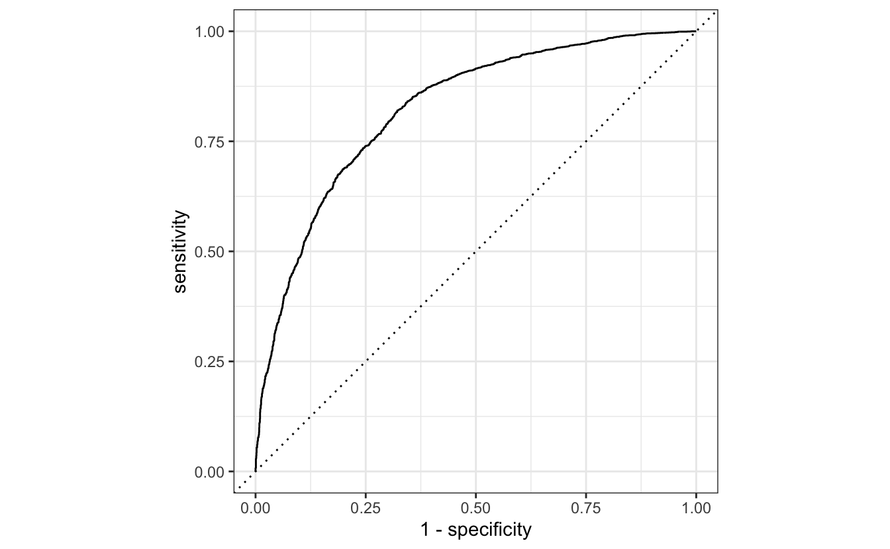

This is the fifth blog post in the [textrecipes](https://github.com/tidymodels/textrecipes) series where I go over the various text preprocessing workflows you can do with textrecipes. This post will be showcasing how to use [pretrained word embeddings](https://www.analyticsvidhya.com/blog/2020/03/pretrained-word-embeddings-nlp/#:~:text=Pretrained%20Word%20Embeddings%20are%20the,a%20form%20of%20Transfer%20Learning).

## Packages 📦

We will be using [tidymodels](https://www.tidymodels.org/) for modeling, tidyverse for EDA, [textrecipes](https://textrecipes.tidymodels.org/) for text preprocessing, and [textdata](https://emilhvitfeldt.github.io/textdata/) to load the pretrained word embedding.


```r
library(tidymodels)
library(tidyverse)
library(textrecipes)
library(textdata)
theme_set(theme_minimal())
```

## Exploring the data ⛏

We will the same data from the previous [blogpost](https://www.hvitfeldt.me/blog/textrecipes-series-featurehashing/). This data comes from [Kaggle](https://www.kaggle.com/) and contains English^[[#benderrule](https://thegradient.pub/the-benderrule-on-naming-the-languages-we-study-and-why-it-matters/)] [Women's E-Commerce Clothing Reviews](https://www.kaggle.com/nicapotato/womens-ecommerce-clothing-reviews).

The following section is unchanged from the last post, if you are already familiar with this section then skip to the modeling section.


```r
reviews <- read_csv("Womens Clothing E-Commerce Reviews.csv")
## Warning: Missing column names filled in: 'X1' [1]
```

We start by a quick `glimpse()` of the data.


```r
glimpse(reviews)
## Rows: 23,486
## Columns: 11
## $ X1                        <dbl> 0, 1, 2, 3, 4, 5, 6, 7, 8, 9, 10, 11, 12, 13…
## $ `Clothing ID`             <dbl> 767, 1080, 1077, 1049, 847, 1080, 858, 858, …
## $ Age                       <dbl> 33, 34, 60, 50, 47, 49, 39, 39, 24, 34, 53, …
## $ Title                     <chr> NA, NA, "Some major design flaws", "My favor…
## $ `Review Text`             <chr> "Absolutely wonderful - silky and sexy and c…
## $ Rating                    <dbl> 4, 5, 3, 5, 5, 2, 5, 4, 5, 5, 3, 5, 5, 5, 3,…
## $ `Recommended IND`         <dbl> 1, 1, 0, 1, 1, 0, 1, 1, 1, 1, 0, 1, 1, 1, 1,…
## $ `Positive Feedback Count` <dbl> 0, 4, 0, 0, 6, 4, 1, 4, 0, 0, 14, 2, 2, 0, 1…
## $ `Division Name`           <chr> "Initmates", "General", "General", "General …
## $ `Department Name`         <chr> "Intimate", "Dresses", "Dresses", "Bottoms",…
## $ `Class Name`              <chr> "Intimates", "Dresses", "Dresses", "Pants", …
```

We have a good split between text variables, numeric and categorical values. 
Let us also take a look at the distribution of the `Rating` variable


```r
reviews %>%
  ggplot(aes(Rating)) +
  geom_bar()
```


Which is quite right-skewed. 
Let us collapse the ratings into 2 groups, 5 and less-then-5.
Before we go on will I remove the row number variable `X1` and clean the column names with the [janitor](https://garthtarr.github.io/meatR/janitor.html) package to remove cases and spaces.


```r
reviews <- reviews %>%
  select(-X1) %>%
  janitor::clean_names() %>%
  mutate(rating = factor(rating == 5, c(TRUE, FALSE), c("5", "<5")))
```

Before we do some exploratory analysis we will split the data into training and testing datasets.
We do this to avoid learning this about the data that would only be available in the testing data set.


```r
set.seed(1234)

reviews_split <- initial_split(reviews)

reviews_train <- training(reviews_split)
```

Our main objective is to predict the rating based on the text review.
This will naturally exclude variables such as `Recommended IND` and `Positive Feedback Count` as that information is unlikely to be known before the rating is given.
We will mostly be using the text variables (`Review Text` and `Title`) but I am going to take a look at some of the other variables before we move on in case they would be easy inclusions.

The ratings were pretty highly right-skewed and even when we collapsed them there are still more 5s.


```r
reviews_train %>%
  ggplot(aes(rating)) +
  geom_bar()
```



Since we have the age let us take a look to make sure it has a reasonable range.


```r
reviews_train %>%
  ggplot(aes(age)) +
  geom_bar()
```



Nothing too out of the ordinary, we have some young people and old people but nothing weird.
Out of curiosity let us take a look at that one age that is above the pack.


```r
reviews_train %>%
  count(age, sort = TRUE)
## # A tibble: 77 x 2
##      age     n
##    <dbl> <int>
##  1    39   932
##  2    35   685
##  3    36   640
##  4    34   600
##  5    38   583
##  6    37   572
##  7    33   552
##  8    41   549
##  9    46   543
## 10    42   502
## # … with 67 more rows
```

Since we have the clothing id, then I want to know if any of the reviews apply to the same articles of clothing.


```r
reviews_train %>%
  count(clothing_id, sort = TRUE) 
## # A tibble: 1,068 x 2
##    clothing_id     n
##          <dbl> <int>
##  1        1078   758
##  2         862   603
##  3        1094   580
##  4         872   420
##  5        1081   415
##  6         829   409
##  7        1110   347
##  8         868   329
##  9         895   309
## 10         936   264
## # … with 1,058 more rows
```

So out of 17614 we have 1068 clothing articles. 
Let us see how the reviews are split between the variables


```r
reviews_train %>%
  count(clothing_id, sort = TRUE) %>%
  mutate(x = row_number()) %>%
  ggplot(aes(x, n)) +
  geom_point()
```



And we see quite a fast drop-off.

I'm trying to create a fairly simple model so I won't be including much information.

## Modeling ⚙️

We will restrict ourselves to only use the two text fields and the age of the customer.
We are doing this so we can compare results with previous results.

Before we go on, let us take a look at the pre-trained word embeddings.
The `embedding_glove6b()` function gives us access to the 6B tokens glove embedding from the [Stanford NLP Group](https://nlp.stanford.edu/projects/glove/).

You will get a prompt the first time you use this function. This is expected and done to make sure that the user agrees to the license and agreements of any given resource.

I have specified `dimensions = 100` to get word vectors with 100 dimensions.


```r
glove6b <- textdata::embedding_glove6b(dimensions = 100)
glove6b
## # A tibble: 400,000 x 101
##    token      d1      d2      d3      d4      d5      d6      d7      d8      d9
##    <chr>   <dbl>   <dbl>   <dbl>   <dbl>   <dbl>   <dbl>   <dbl>   <dbl>   <dbl>
##  1 "the" -0.0382 -0.245   0.728  -0.400   0.0832  0.0440 -0.391   0.334  -0.575 
##  2 ","   -0.108   0.111   0.598  -0.544   0.674   0.107   0.0389  0.355   0.0635
##  3 "."   -0.340   0.209   0.463  -0.648  -0.384   0.0380  0.171   0.160   0.466 
##  4 "of"  -0.153  -0.243   0.898   0.170   0.535   0.488  -0.588  -0.180  -1.36  
##  5 "to"  -0.190   0.0500  0.191  -0.0492 -0.0897  0.210  -0.550   0.0984 -0.201 
##  6 "and" -0.0720  0.231   0.0237 -0.506   0.339   0.196  -0.329   0.184  -0.181 
##  7 "in"   0.0857 -0.222   0.166   0.134   0.382   0.354   0.0129  0.225  -0.438 
##  8 "a"   -0.271   0.0440 -0.0203 -0.174   0.644   0.712   0.355   0.471  -0.296 
##  9 "\""  -0.305  -0.236   0.176  -0.729  -0.283  -0.256   0.266   0.0253 -0.0748
## 10 "'s"   0.589  -0.202   0.735  -0.683  -0.197  -0.180  -0.392   0.342  -0.606 
## # … with 399,990 more rows, and 91 more variables: d10 <dbl>, d11 <dbl>,
## #   d12 <dbl>, d13 <dbl>, d14 <dbl>, d15 <dbl>, d16 <dbl>, d17 <dbl>,
## #   d18 <dbl>, d19 <dbl>, d20 <dbl>, d21 <dbl>, d22 <dbl>, d23 <dbl>,
## #   d24 <dbl>, d25 <dbl>, d26 <dbl>, d27 <dbl>, d28 <dbl>, d29 <dbl>,
## #   d30 <dbl>, d31 <dbl>, d32 <dbl>, d33 <dbl>, d34 <dbl>, d35 <dbl>,
## #   d36 <dbl>, d37 <dbl>, d38 <dbl>, d39 <dbl>, d40 <dbl>, d41 <dbl>,
## #   d42 <dbl>, d43 <dbl>, d44 <dbl>, d45 <dbl>, d46 <dbl>, d47 <dbl>,
## #   d48 <dbl>, d49 <dbl>, d50 <dbl>, d51 <dbl>, d52 <dbl>, d53 <dbl>,
## #   d54 <dbl>, d55 <dbl>, d56 <dbl>, d57 <dbl>, d58 <dbl>, d59 <dbl>,
## #   d60 <dbl>, d61 <dbl>, d62 <dbl>, d63 <dbl>, d64 <dbl>, d65 <dbl>,
## #   d66 <dbl>, d67 <dbl>, d68 <dbl>, d69 <dbl>, d70 <dbl>, d71 <dbl>,
## #   d72 <dbl>, d73 <dbl>, d74 <dbl>, d75 <dbl>, d76 <dbl>, d77 <dbl>,
## #   d78 <dbl>, d79 <dbl>, d80 <dbl>, d81 <dbl>, d82 <dbl>, d83 <dbl>,
## #   d84 <dbl>, d85 <dbl>, d86 <dbl>, d87 <dbl>, d88 <dbl>, d89 <dbl>,
## #   d90 <dbl>, d91 <dbl>, d92 <dbl>, d93 <dbl>, d94 <dbl>, d95 <dbl>,
## #   d96 <dbl>, d97 <dbl>, d98 <dbl>, d99 <dbl>, d100 <dbl>
```

The format of these word vectors is perfectly tailored to work with textrecipes. The first column has the tokens, and the remaining numerical columns are the word vectors.

we need to specify a tokenizer that closely matches the tokenizer that was used in the pre-trained word embedding. Otherwise, will you get mismatches between words.
I was not able to find the same tokenizer used in this case. but I found that the default `tokenizers::tokenize_words()` with `strip_punct = FALSE` gives very similar results.

we can pass arguments to the underlying tokenizer in `step_tokenize()` by passing a named list to the `options = ` argument.

We will be using the default method of aggregating the vectors within each observation which is to sum them together. This can be changed using the `aggregation = ` argument.


```r
rec_spec <- recipe(rating ~ age + title + review_text, data = reviews_train) %>%
  step_tokenize(title, review_text, options = list(strip_punct = FALSE)) %>%
  step_tokenmerge(title, review_text, prefix = "text") %>%
  step_word_embeddings(text, embeddings = glove6b)
```

We are using `step_tokenmerge()` to combine the tokens created in `title` and `review_text` into one list of tokens. There aren't that many tokens in `title` alone for it to warrant treating it as a separate list of tokens.

Next, we specify a lasso model.


```r
lasso_spec <- logistic_reg(penalty = tune(), mixture = 1) %>%
  set_engine("glmnet")
```

I have specified `penalty = tune()` because I want to use [tune](https://tune.tidymodels.org/) to find the best value of the penalty by doing hyperparameter tuning.

We set up a parameter grid using `grid_regular()`


```r
param_grid <- grid_regular(penalty(), levels = 50)
```

searching over 50 levels might seem like a lot. But remember that glmnet can calculate them all at once.
This is because it relies on its warms starts for speed and it is often faster to fit a whole path than compute a single fit.

We will also set up some bootstraps of the data so we can evaluate the performance multiple times for each level.


```r
reviews_boot <- bootstraps(reviews_train, times = 10)
```

the last thing we need to use is to create a workflow object to combine the preprocessing step with the model.
This is important because we want the preprocessing steps to happen in the bootstraps.


```r
wf_fh <- workflow() %>%
  add_recipe(rec_spec) %>%
  add_model(lasso_spec)
```

now we are ready to perform the parameter tuning.


```r
set.seed(42)
lasso_grid <- tune_grid(
  wf_fh,
  resamples = reviews_boot,
  grid = param_grid
) 
```

Once we have finished parameter tuning we can use the `autoplot()` function on the tuning results to get a nice chart showing the performance for different values of the penalty.


```r
lasso_grid %>%
  autoplot()
```



It appears that the best value for the penalty for this workflow is on the low end.

It is worth noting that this data coming out of recipes is dense since we are using word vectors. We will only be having 100 predictors in this model (since we choose `dimensions = 100`). This is an order of magnitude less than the last time where we had 1024 sparse predictors.
This more dense data representation also allows us to use models that we normally can't use when doing count-based preprocessing since some models don't handle sparseness that well.

Similarly, can we use the `show_best()` function from tune to show to the best performing hyperparameter.


```r
lasso_grid %>%
  show_best("roc_auc")
## # A tibble: 5 x 7
##    penalty .metric .estimator  mean     n std_err .config              
##      <dbl> <chr>   <chr>      <dbl> <int>   <dbl> <chr>                
## 1 3.24e- 5 roc_auc binary     0.821    10 0.00129 Preprocessor1_Model28
## 2 1   e-10 roc_auc binary     0.821    10 0.00129 Preprocessor1_Model01
## 3 1.60e-10 roc_auc binary     0.821    10 0.00129 Preprocessor1_Model02
## 4 2.56e-10 roc_auc binary     0.821    10 0.00129 Preprocessor1_Model03
## 5 4.09e-10 roc_auc binary     0.821    10 0.00129 Preprocessor1_Model04
```

We will use the `select_best()` function to extract the best performing penalty and finalize the workflow with that value of penalty.


```r
wf_fh_final <- wf_fh %>%
  finalize_workflow(parameters = select_best(lasso_grid, "roc_auc"))
```

Now we can run `last_fit()` on our training/testing split to fit our final model.


```r
final_res <- last_fit(wf_fh_final, reviews_split)
```

With our final model can we create a ROC curve of our final model.


```r
final_res %>%
  collect_predictions() %>%
  roc_curve(rating, .pred_5) %>%
  autoplot()
```



## Thoughts 🤔

This example is mostly a showcase of how to use pre-trained word embeddings.
We are not getting as good performance as we did with feature hashing of simple term frequencies from the last post.

We can improve the performance in a couple of ways. The first way is to use bigger embeddings. We can increase the number of dimensions we are using. This embedding comes with as many as 300 dimensions. We can also use an embedding with a larger vocabulary. I used the smallest pre-trained glove embedding, but bigger ones are [available too](https://emilhvitfeldt.github.io/textdata/reference/embedding_glove.html).

Another way to get improved performance is to use word vectors that more closely matched the target domain you are working in. Many pre-trained word vectors and trained on text for the general web, Wikipedia and, news articles. The more removed your text is from these kinds of text, the less likely it is that the embedding will be helpful.

I will showcase in a later post how you can train your own word embedding.

If you want to know more about word embeddings, [Julia Silge](https://twitter.com/juliasilge) and I have a chapter in our upcoming book [Supervised Machine Learning for Text Analysis in R](https://smltar.com/) which goes more in dept on [Word Embeddings](https://smltar.com/embeddings.html).

