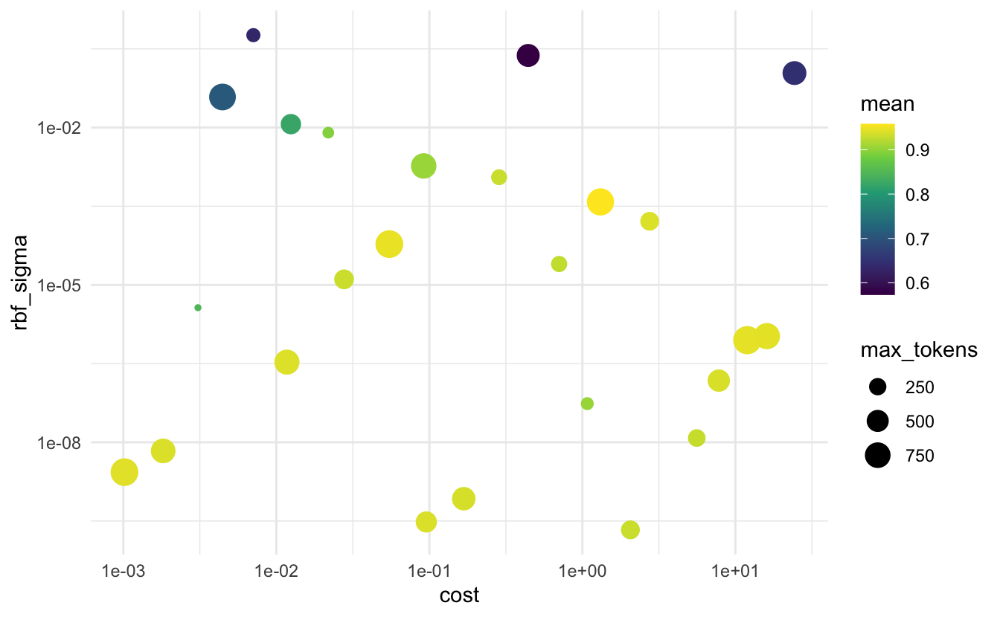

This is the first blog post in a series I am starting to go over the various text preprocessing workflows you can do with [textrecipes](https://github.com/tidymodels/textrecipes). This post will we start simple with [term frequencies](https://en.wikipedia.org/wiki/Tf%E2%80%93idf#Term_frequency_2).

Today we are lucky with timing to be able to use the current [#tidytuesday](https://github.com/rfordatascience/tidytuesday) dataset about [Animal Crossing - New Horizons](https://github.com/rfordatascience/tidytuesday/tree/master/data/2020/2020-05-05).
There are a lot of different datasets available for us this week but we will only be looking at the user reviews.

## Packages 📦

We are going fairly light package-wise this time only needing [tidymodels](https://www.tidymodels.org/), textrecipes, and lastly tidytext for EDA.


```r
library(tidymodels)
library(textrecipes)
library(tidytext)
theme_set(theme_minimal())
```

## Exploring the data ⛏

We start by reading in the data. 
I want to set the goal of this modeling task to predict if a review is positive or not. 
More specifically I (somehow arbitrarily) denote a review with a grade of 8 or higher to be a "High" review and everything else "Low".
I split the data into a training and testing dataset right away before looking at the data.


```r
user_reviews <- readr::read_tsv('https://raw.githubusercontent.com/rfordatascience/tidytuesday/master/data/2020/2020-05-05/user_reviews.tsv')
```


```r
user_reviews <- user_reviews %>%
  mutate(grade = factor(grade > 7, c(TRUE, FALSE), c("High", "Low")))

set.seed(1234)
review_split <- initial_split(user_reviews)

review_training <- training(review_split)
review_testing <- training(review_split)
```

Taking a `glimpse()` of the data reveals 4 variables. 
`grade` is a factor with the two levels "High" and "Low".
This is what we are trying to predict.
Next, we have `user_name` which we won't be using for this analysis, `text` is the most important variable as it contains the reviews. We also get a `date` variable denoting the date the review was submitted. 


```r
glimpse(review_training)
## Rows: 2,250
## Columns: 4
## $ grade     <fct> Low, Low, Low, Low, Low, Low, Low, Low, Low, Low, Low, Low,…
## $ user_name <chr> "mds27272", "lolo2178", "Roachant", "Houndf", "ProfessorFox…
## $ text      <chr> "My gf started playing before me. No option to create my ow…
## $ date      <date> 2020-03-20, 2020-03-20, 2020-03-20, 2020-03-20, 2020-03-20…
```

We First look at the distribution of "High" and "Low" scoring reviews.


```r
review_training %>%
  ggplot(aes(grade)) +
  geom_bar()
```


it is slightly skewed but we will soldier on and ignore it. Next, let us take a look at the distribution of the dates.
Remember that the game release on March 20th of this year, so we can plot the distribution of days since release.
This provides us with an upper bound of how many days they have access to the game before leaving the review.


```r
review_training %>%
  transmute(date = as.numeric(date - as.Date("2020-03-20"))) %>%
  ggplot(aes(date)) +
  geom_bar() +
  labs(title = "Number of days since release")
```


We see a spike on the 1st day as well as the 5th.
This is a little worrisome considering Animal Crossing games tend to be played casually over a long period of time and are tend to be slow and [take a long time to beat](https://howlongtobeat.com/game.php?id=474).

Lastly, let us get ourselves some summary stats of the text itself.


```r
review_tokens <- review_training %>%
  unnest_tokens(tokens, text)
```

We can look at the distribution of the number of tokens in the reviews


```r
review_tokens %>%
  count(user_name) %>%
  ggplot(aes(n)) +
  geom_histogram(binwidth = 10) +
  geom_vline(xintercept = 100, color = "firebrick") +
  annotate("text", x = 105, y = 205, hjust = 0, color = "firebrick",
           label = "Sharp clif between reviews with less and more then 100 word") +
  labs(title = "Distribution of number of words in user reviews")
```


This is a highly [bimodal distribution](https://en.wikipedia.org/wiki/Multimodal_distribution).
This is something we should include in our model. 
But we are sadly too early in our *textrecipes series* to address this kind of preprocessing, in a later post will we take a look at [step_textfeature()](https://tidymodels.github.io/textrecipes/reference/step_textfeature.html) that can do that.

## Modeling ⚙️

In the preprocessing, we are including both the `date` and `text` variables.
There are many different things we could do with the data variable. 
I'll go simple and calculate the difference in time between the release day and the date the review was submitted.
For the text we will again go simple, I'll start by tokenizing to words with the default *tokenizers* engine.
Next, we will remove stopwords, being conservative to only use the snowball stopword list which removes the least amount of words.
Let us take a look at the words we are trying to remove to verify they ate appropriate.


```r
stopwords::data_stopwords_snowball$en
##   [1] "i"          "me"         "my"         "myself"     "we"        
##   [6] "our"        "ours"       "ourselves"  "you"        "your"      
##  [11] "yours"      "yourself"   "yourselves" "he"         "him"       
##  [16] "his"        "himself"    "she"        "her"        "hers"      
##  [21] "herself"    "it"         "its"        "itself"     "they"      
##  [26] "them"       "their"      "theirs"     "themselves" "what"      
##  [31] "which"      "who"        "whom"       "this"       "that"      
##  [36] "these"      "those"      "am"         "is"         "are"       
##  [41] "was"        "were"       "be"         "been"       "being"     
##  [46] "have"       "has"        "had"        "having"     "do"        
##  [51] "does"       "did"        "doing"      "would"      "should"    
##  [56] "could"      "ought"      "i'm"        "you're"     "he's"      
##  [61] "she's"      "it's"       "we're"      "they're"    "i've"      
##  [66] "you've"     "we've"      "they've"    "i'd"        "you'd"     
##  [71] "he'd"       "she'd"      "we'd"       "they'd"     "i'll"      
##  [76] "you'll"     "he'll"      "she'll"     "we'll"      "they'll"   
##  [81] "isn't"      "aren't"     "wasn't"     "weren't"    "hasn't"    
##  [86] "haven't"    "hadn't"     "doesn't"    "don't"      "didn't"    
##  [91] "won't"      "wouldn't"   "shan't"     "shouldn't"  "can't"     
##  [96] "cannot"     "couldn't"   "mustn't"    "let's"      "that's"    
## [101] "who's"      "what's"     "here's"     "there's"    "when's"    
## [106] "where's"    "why's"      "how's"      "a"          "an"        
## [111] "the"        "and"        "but"        "if"         "or"        
## [116] "because"    "as"         "until"      "while"      "of"        
## [121] "at"         "by"         "for"        "with"       "about"     
## [126] "against"    "between"    "into"       "through"    "during"    
## [131] "before"     "after"      "above"      "below"      "to"        
## [136] "from"       "up"         "down"       "in"         "out"       
## [141] "on"         "off"        "over"       "under"      "again"     
## [146] "further"    "then"       "once"       "here"       "there"     
## [151] "when"       "where"      "why"        "how"        "all"       
## [156] "any"        "both"       "each"       "few"        "more"      
## [161] "most"       "other"      "some"       "such"       "no"        
## [166] "nor"        "not"        "only"       "own"        "same"      
## [171] "so"         "than"       "too"        "very"       "will"
```

The list contains a good amount of pronouns and negations, but considering the subject matter, I don't think it will introduce much bias.
We will apply a `step_tokenfilter()` to filter the tokens we keep based on frequency. 
We use `tune()` to indicate that we want to do hyperparameter tuning to determine the optimal number of tokens to keep.
We end our recipe with `step_tf()` to calculate term frequencies from the tokens we kept.


```r
rec_spec <- recipe(grade ~ text + date, review_training) %>%
  # Days since release
  step_mutate(date = as.numeric(date - as.Date("2020-03-20"))) %>%
  # Tokenize to words
  step_tokenize(text) %>%
  # Remove stopwords
  step_stopwords(text) %>%
  # Remove less frequent words
  step_tokenfilter(text, max_tokens = tune()) %>%
  # Calculate term frequencies
  step_tf(text, weight_scheme = "binary")
```

`step_tf()` has one main argument `weight_scheme` which determines how the term frequencies should be represented. I will be using "binary" This will return a 1 if the word is present in the review an 0. This is a kind of scaling since we are assuming that having the word "good" in the document once is providing as much evidence as if it appeared 10 times.
See [?step_tf()](https://tidymodels.github.io/textrecipes/reference/step_tf.html) for more detail and other options.

The modeling will be using a radial basis function support vector machines (SVM). 


```r
mod_spec <- svm_rbf(cost = tune(), rbf_sigma = tune()) %>%
  set_engine("kernlab") %>%
  set_mode("classification")
```

We will be tuning both the `cost` and `rbf_sigma` arguments.

To calculate the performance over the hyperparameter space will we do some V-fold Cross-Validation on our data.


```r
set.seed(1234)
review_folds <- vfold_cv(review_training, v = 5)
```

Now we are pretty much ready to run our model. We combine our model specification with the recipe specification to create a workflow object. This way we can tune the recipe and model jointly.


```r
review_wf <- workflow() %>%
  add_recipe(rec_spec) %>%
  add_model(mod_spec)
```

With everything in place will we go to `tune_grid()` to perform the model tuning via a grid search.


```r
tune_res <- tune_grid(
  review_wf,
  resamples = review_folds,
  grid = 25,
  control = control_grid(verbose = TRUE)
)
```

Now that we have the rune results we can find the best candidates we can simply use `show_best()`


```r
show_best(tune_res, "accuracy")
## # A tibble: 5 x 8
##      cost rbf_sigma max_tokens .metric  .estimator  mean     n std_err
##     <dbl>     <dbl>      <int> <chr>    <chr>      <dbl> <int>   <dbl>
## 1  1.31    0.000382        876 accuracy binary     0.891     5 0.00337
## 2  2.75    0.000164        314 accuracy binary     0.864     5 0.00575
## 3  0.286   0.00113         193 accuracy binary     0.838     5 0.00504
## 4 24.3     0.109           620 accuracy binary     0.642     5 0.00897
## 5  0.0918  0.00185         736 accuracy binary     0.641     5 0.00879
```

We notice that the top candidates have very similar `.estimator`s but the 3 parameters vary quite a bit. Lets do a little vizualizations to see what is happening:


```r
collect_metrics(tune_res) %>%
  filter(.metric == "accuracy") %>%
  ggplot(aes(cost, rbf_sigma, size = max_tokens, color = mean)) +
  geom_point() +
  scale_y_log10() +
  scale_x_log10() +
  scale_color_viridis_c()
```


when we are evaluating the accuracy it seems that a combination of high `rbf_sigma` and high `cost` yields to high accuracy.

When we are evaluating the roc_auc then it appears that both `max_tokens` and `cost` don't have too much influence and a high value of `rbf_sigma` is really bad.


```r
collect_metrics(tune_res) %>%
  filter(.metric == "roc_auc") %>%
  ggplot(aes(cost, rbf_sigma, size = max_tokens, color = mean)) +
  geom_point() +
  scale_y_log10() +
  scale_x_log10() +
  scale_color_viridis_c()
```



I'll select a model with the highest accuracy in this use case. 
We can do that with the `select_best()` function.
Then we can use the `finalize_workflow()` function to update our workflow with the new hyperparameters.


```r
best_accuracy <- select_best(tune_res, "accuracy")

final_wf <- finalize_workflow(
  review_wf,
  best_accuracy
)

final_wf
## ══ Workflow ════════════════════════════════════════════════════════════════════════════════════════════════
## Preprocessor: Recipe
## Model: svm_rbf()
## 
## ── Preprocessor ────────────────────────────────────────────────────────────────────────────────────────────
## 5 Recipe Steps
## 
## ● step_mutate()
## ● step_tokenize()
## ● step_stopwords()
## ● step_tokenfilter()
## ● step_tf()
## 
## ── Model ───────────────────────────────────────────────────────────────────────────────────────────────────
## Radial Basis Function Support Vector Machine Specification (classification)
## 
## Main Arguments:
##   cost = 1.31257376115796
##   rbf_sigma = 0.000382104630228968
## 
## Computational engine: kernlab
```

lastly, we will do a list fit and see how well the final model did on our testing data:


```r
final_res <- final_wf %>%
  last_fit(review_split)

final_res %>%
  collect_metrics()
## # A tibble: 2 x 3
##   .metric  .estimator .estimate
##   <chr>    <chr>          <dbl>
## 1 accuracy binary         0.869
## 2 roc_auc  binary         0.935
```

We did decently well on both accounts.

<details closed>
<summary> <span title='Click to Expand'> session information </span> </summary>

```r

─ Session info ───────────────────────────────────────────────────────────────
 setting  value                       
 version  R version 3.6.0 (2019-04-26)
 os       macOS Mojave 10.14.6        
 system   x86_64, darwin15.6.0        
 ui       X11                         
 language (EN)                        
 collate  en_US.UTF-8                 
 ctype    en_US.UTF-8                 
 tz       America/Los_Angeles         
 date     2020-05-05                  

─ Packages ───────────────────────────────────────────────────────────────────
 ! package       * version    date       lib source                            
 P assertthat      0.2.1      2019-03-21 [?] CRAN (R 3.6.0)                    
 P backports       1.1.6      2020-04-05 [?] CRAN (R 3.6.0)                    
 P base64enc       0.1-3      2015-07-28 [?] CRAN (R 3.6.0)                    
 P bayesplot       1.7.1      2019-12-01 [?] CRAN (R 3.6.0)                    
 P blogdown        0.18       2020-03-04 [?] CRAN (R 3.6.0)                    
 P bookdown        0.18       2020-03-05 [?] CRAN (R 3.6.0)                    
 P boot            1.3-24     2019-12-20 [?] CRAN (R 3.6.0)                    
 P broom         * 0.5.6      2020-04-20 [?] CRAN (R 3.6.2)                    
 P callr           3.4.3      2020-03-28 [?] CRAN (R 3.6.2)                    
 P class           7.3-16     2020-03-25 [?] CRAN (R 3.6.0)                    
 P cli             2.0.2      2020-02-28 [?] CRAN (R 3.6.0)                    
 P clipr           0.7.0      2019-07-23 [?] CRAN (R 3.6.0)                    
 P codetools       0.2-16     2018-12-24 [?] CRAN (R 3.6.0)                    
 P colorspace      1.4-1      2019-03-18 [?] CRAN (R 3.6.0)                    
 P colourpicker    1.0        2017-09-27 [?] CRAN (R 3.6.0)                    
   crayon          1.3.4      2017-09-16 [1] CRAN (R 3.6.0)                    
 P crosstalk       1.1.0.1    2020-03-13 [?] CRAN (R 3.6.0)                    
 P curl            4.3        2019-12-02 [?] CRAN (R 3.6.0)                    
 P desc            1.2.0      2018-05-01 [?] CRAN (R 3.6.0)                    
 P details       * 0.2.1      2020-01-12 [?] CRAN (R 3.6.0)                    
 P dials         * 0.0.6      2020-04-03 [?] CRAN (R 3.6.0)                    
 P DiceDesign      1.8-1      2019-07-31 [?] CRAN (R 3.6.0)                    
 P digest          0.6.25     2020-02-23 [?] CRAN (R 3.6.0)                    
 P dplyr         * 0.8.5      2020-03-07 [?] CRAN (R 3.6.0)                    
 P DT              0.13       2020-03-23 [?] CRAN (R 3.6.0)                    
 P dygraphs        1.1.1.6    2018-07-11 [?] CRAN (R 3.6.0)                    
 P ellipsis        0.3.0      2019-09-20 [?] CRAN (R 3.6.0)                    
   emo             0.0.0.9000 2020-05-05 [1] Github (Hadley/emo@3f03b11)       
 P evaluate        0.14       2019-05-28 [?] CRAN (R 3.6.0)                    
 P fansi           0.4.1      2020-01-08 [?] CRAN (R 3.6.0)                    
 P farver          2.0.3      2020-01-16 [?] CRAN (R 3.6.0)                    
 P fastmap         1.0.1      2019-10-08 [?] CRAN (R 3.6.0)                    
 P foreach         1.5.0      2020-03-30 [?] CRAN (R 3.6.2)                    
 P fs              1.4.1      2020-04-04 [?] CRAN (R 3.6.0)                    
 P furrr           0.1.0      2018-05-16 [?] CRAN (R 3.6.0)                    
 P future          1.17.0     2020-04-18 [?] CRAN (R 3.6.2)                    
 P generics        0.0.2      2018-11-29 [?] CRAN (R 3.6.0)                    
 P ggplot2       * 3.3.0      2020-03-05 [?] CRAN (R 3.6.0)                    
 P ggridges        0.5.2      2020-01-12 [?] CRAN (R 3.6.0)                    
 P globals         0.12.5     2019-12-07 [?] CRAN (R 3.6.0)                    
 P glue            1.4.0      2020-04-03 [?] CRAN (R 3.6.0)                    
 P gower           0.2.1      2019-05-14 [?] CRAN (R 3.6.0)                    
 P GPfit           1.0-8      2019-02-08 [?] CRAN (R 3.6.0)                    
 P gridExtra       2.3        2017-09-09 [?] CRAN (R 3.6.0)                    
 P gtable          0.3.0      2019-03-25 [?] CRAN (R 3.6.0)                    
 P gtools          3.8.2      2020-03-31 [?] CRAN (R 3.6.2)                    
 P hardhat         0.1.2      2020-02-28 [?] CRAN (R 3.6.0)                    
 P hms             0.5.3      2020-01-08 [?] CRAN (R 3.6.0)                    
 P htmltools       0.4.0      2019-10-04 [?] CRAN (R 3.6.0)                    
 P htmlwidgets     1.5.1      2019-10-08 [?] CRAN (R 3.6.0)                    
 P httpuv          1.5.2      2019-09-11 [?] CRAN (R 3.6.0)                    
 P httr            1.4.1      2019-08-05 [?] CRAN (R 3.6.0)                    
 P igraph          1.2.5      2020-03-19 [?] CRAN (R 3.6.0)                    
 P infer         * 0.5.1      2019-11-19 [?] CRAN (R 3.6.0)                    
 P inline          0.3.15     2018-05-18 [?] CRAN (R 3.6.0)                    
 P ipred           0.9-9      2019-04-28 [?] CRAN (R 3.6.0)                    
 P iterators       1.0.12     2019-07-26 [?] CRAN (R 3.6.0)                    
 P janeaustenr     0.1.5      2017-06-10 [?] CRAN (R 3.6.0)                    
 P kernlab         0.9-29     2019-11-12 [?] CRAN (R 3.6.0)                    
 P knitr         * 1.28       2020-02-06 [?] CRAN (R 3.6.0)                    
 P labeling        0.3        2014-08-23 [?] CRAN (R 3.6.0)                    
 P later           1.0.0      2019-10-04 [?] CRAN (R 3.6.0)                    
 P lattice         0.20-41    2020-04-02 [?] CRAN (R 3.6.0)                    
 P lava            1.6.7      2020-03-05 [?] CRAN (R 3.6.0)                    
 P lhs             1.0.2      2020-04-13 [?] CRAN (R 3.6.2)                    
 P lifecycle       0.2.0      2020-03-09 [?] Github (r-lib/lifecycle@1b13d96)  
 P listenv         0.8.0      2019-12-05 [?] CRAN (R 3.6.0)                    
 P lme4            1.1-23     2020-04-07 [?] CRAN (R 3.6.0)                    
 P loo             2.2.0      2019-12-19 [?] CRAN (R 3.6.0)                    
 P lubridate       1.7.8      2020-04-06 [?] CRAN (R 3.6.0)                    
 P magrittr        1.5        2014-11-22 [?] CRAN (R 3.6.0)                    
 P markdown        1.1        2019-08-07 [?] CRAN (R 3.6.0)                    
 P MASS            7.3-51.5   2019-12-20 [?] CRAN (R 3.6.0)                    
 P Matrix          1.2-18     2019-11-27 [?] CRAN (R 3.6.0)                    
 P matrixStats     0.56.0     2020-03-13 [?] CRAN (R 3.6.0)                    
 P mime            0.9        2020-02-04 [?] CRAN (R 3.6.0)                    
   miniUI          0.1.1.1    2018-05-18 [1] CRAN (R 3.6.0)                    
 P minqa           1.2.4      2014-10-09 [?] CRAN (R 3.6.0)                    
 P munsell         0.5.0      2018-06-12 [?] CRAN (R 3.6.0)                    
 P nlme            3.1-145    2020-03-04 [?] CRAN (R 3.6.0)                    
 P nloptr          1.2.2.1    2020-03-11 [?] CRAN (R 3.6.0)                    
 P nnet            7.3-13     2020-02-25 [?] CRAN (R 3.6.0)                    
 P parsnip       * 0.1.0      2020-04-09 [?] CRAN (R 3.6.2)                    
 P pillar          1.4.3      2019-12-20 [?] CRAN (R 3.6.0)                    
 P pkgbuild        1.0.7      2020-04-25 [?] CRAN (R 3.6.2)                    
 P pkgconfig       2.0.3      2019-09-22 [?] CRAN (R 3.6.0)                    
 P plyr            1.8.6      2020-03-03 [?] CRAN (R 3.6.0)                    
 P png             0.1-7      2013-12-03 [?] CRAN (R 3.6.0)                    
 P prettyunits     1.1.1      2020-01-24 [?] CRAN (R 3.6.0)                    
 P pROC            1.16.2     2020-03-19 [?] CRAN (R 3.6.0)                    
 P processx        3.4.2      2020-02-09 [?] CRAN (R 3.6.0)                    
 P prodlim         2019.11.13 2019-11-17 [?] CRAN (R 3.6.0)                    
 P promises        1.1.0      2019-10-04 [?] CRAN (R 3.6.0)                    
 P ps              1.3.2      2020-02-13 [?] CRAN (R 3.6.0)                    
 P purrr         * 0.3.4      2020-04-17 [?] CRAN (R 3.6.2)                    
 P R6              2.4.1      2019-11-12 [?] CRAN (R 3.6.0)                    
 P Rcpp            1.0.4.6    2020-04-09 [?] CRAN (R 3.6.0)                    
 P readr           1.3.1      2018-12-21 [?] CRAN (R 3.6.0)                    
 P recipes       * 0.1.12     2020-05-01 [?] CRAN (R 3.6.2)                    
   renv            0.9.3      2020-02-10 [1] CRAN (R 3.6.0)                    
 P reshape2        1.4.4      2020-04-09 [?] CRAN (R 3.6.2)                    
 P rlang           0.4.6      2020-05-02 [?] CRAN (R 3.6.2)                    
 P rmarkdown       2.1        2020-01-20 [?] CRAN (R 3.6.0)                    
 P rpart           4.1-15     2019-04-12 [?] CRAN (R 3.6.0)                    
 P rprojroot       1.3-2      2018-01-03 [?] CRAN (R 3.6.0)                    
 P rsample       * 0.0.6      2020-03-31 [?] CRAN (R 3.6.2)                    
 P rsconnect       0.8.16     2019-12-13 [?] CRAN (R 3.6.0)                    
 P rstan           2.19.3     2020-02-11 [?] CRAN (R 3.6.0)                    
 P rstanarm        2.19.3     2020-02-11 [?] CRAN (R 3.6.0)                    
 P rstantools      2.0.0      2019-09-15 [?] CRAN (R 3.6.0)                    
   rstudioapi      0.11       2020-02-07 [1] CRAN (R 3.6.0)                    
 P scales        * 1.1.0      2019-11-18 [?] CRAN (R 3.6.0)                    
 P sessioninfo     1.1.1      2018-11-05 [?] CRAN (R 3.6.0)                    
   shiny           1.4.0.2    2020-03-13 [1] CRAN (R 3.6.0)                    
 P shinyjs         1.1        2020-01-13 [?] CRAN (R 3.6.0)                    
 P shinystan       2.5.0      2018-05-01 [?] CRAN (R 3.6.0)                    
 P shinythemes     1.1.2      2018-11-06 [?] CRAN (R 3.6.0)                    
 P SnowballC       0.7.0      2020-04-01 [?] CRAN (R 3.6.2)                    
 P StanHeaders     2.21.0-1   2020-01-19 [?] CRAN (R 3.6.0)                    
 P statmod         1.4.34     2020-02-17 [?] CRAN (R 3.6.0)                    
 P stopwords       2.0        2020-04-14 [?] CRAN (R 3.6.2)                    
 P stringi         1.4.6      2020-02-17 [?] CRAN (R 3.6.0)                    
 P stringr         1.4.0      2019-02-10 [?] CRAN (R 3.6.0)                    
 P survival        3.1-12     2020-03-28 [?] Github (therneau/survival@c55af18)
 P textrecipes   * 0.2.1      2020-05-04 [?] CRAN (R 3.6.0)                    
 P threejs         0.3.3      2020-01-21 [?] CRAN (R 3.6.0)                    
 P tibble        * 3.0.1      2020-04-20 [?] CRAN (R 3.6.2)                    
 P tidymodels    * 0.1.0      2020-02-16 [?] CRAN (R 3.6.0)                    
 P tidyposterior   0.0.2      2018-11-15 [?] CRAN (R 3.6.0)                    
 P tidypredict     0.4.5      2020-02-10 [?] CRAN (R 3.6.0)                    
 P tidyr           1.0.2      2020-01-24 [?] CRAN (R 3.6.0)                    
 P tidyselect      1.0.0      2020-01-27 [?] CRAN (R 3.6.0)                    
 P tidytext      * 0.2.4      2020-04-17 [?] CRAN (R 3.6.2)                    
 P timeDate        3043.102   2018-02-21 [?] CRAN (R 3.6.0)                    
 P tokenizers      0.2.1      2018-03-29 [?] CRAN (R 3.6.0)                    
 P tune          * 0.1.0      2020-04-02 [?] CRAN (R 3.6.0)                    
 P usethis         1.6.1      2020-04-29 [?] CRAN (R 3.6.2)                    
 P utf8            1.1.4      2018-05-24 [?] CRAN (R 3.6.0)                    
 P vctrs           0.2.4      2020-03-10 [?] CRAN (R 3.6.0)                    
 P viridisLite     0.3.0      2018-02-01 [?] CRAN (R 3.6.0)                    
 P withr           2.2.0      2020-04-20 [?] CRAN (R 3.6.2)                    
 P workflows     * 0.1.1      2020-03-17 [?] CRAN (R 3.6.0)                    
 P xfun            0.13       2020-04-13 [?] CRAN (R 3.6.2)                    
 P xml2            1.3.2      2020-04-23 [?] CRAN (R 3.6.2)                    
   xtable          1.8-4      2019-04-21 [1] CRAN (R 3.6.0)                    
 P xts             0.12-0     2020-01-19 [?] CRAN (R 3.6.0)                    
 P yaml            2.2.1      2020-02-01 [?] CRAN (R 3.6.0)                    
 P yardstick     * 0.0.6      2020-03-17 [?] CRAN (R 3.6.0)                    
 P zoo             1.8-8      2020-05-02 [?] CRAN (R 3.6.2)                    

[1] /Users/emilhvitfeldthansen/Github/hvitfeldt.me/renv/library/R-3.6/x86_64-apple-darwin15.6.0
[2] /private/var/folders/m0/zmxymdmd7ps0q_tbhx0d_26w0000gn/T/RtmpTCz51a/renv-system-library

 P ── Loaded and on-disk path mismatch.

```

</details>
<br>
