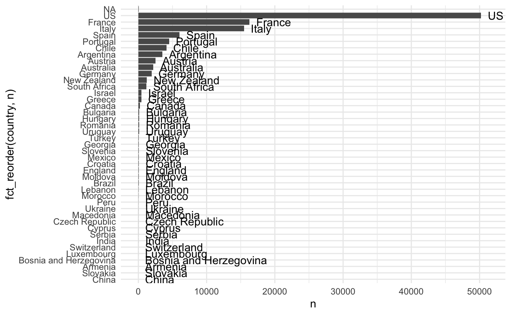
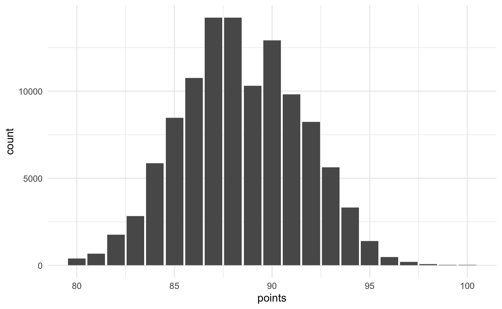

This is the third blog post in the [textrecipes](https://github.com/tidymodels/textrecipes) series where I go over the various text preprocessing workflows you can do with textrecipes. This post will be showcasing how to perform [term frequency-inverse document frequency](http://www.tfidf.com/) (Tf-IDF for short). 

## Packages 📦

The packages used in the post shouldn't come as any surprise if you have been following the series. [tidymodels](https://www.tidymodels.org/) for modeling, tidyverse for EDA, [textrecipes](https://textrecipes.tidymodels.org/) for text preprocessing, and vip for visualizing variable importance.


```r
library(tidymodels)
library(tidyverse)
library(textrecipes)
library(vip)
theme_set(theme_minimal())
```

## Exploring the data ⛏

We will be using a #tidytuesday dataset from almost a year ago, it contains a lot of [wine reviews](https://github.com/rfordatascience/tidytuesday/tree/master/data/2019/2019-05-28). [David Robinson](https://twitter.com/drob) did a very nice screen about this dataset

<iframe width="560" height="315" src="https://www.youtube.com/embed/AQzZNIyjyWM" frameborder="0" allow="accelerometer; autoplay; encrypted-media; gyroscope; picture-in-picture" allowfullscreen></iframe>

David goes into a lot of detail explaining what he is doing and I highly recommend watching this one if you are interested in using text in regression. 
Fortunately, he didn't use tidymodels so this post will bring a little something new.
Our goal for this post is to build a model that predicts the score (denotes `points`) a particular wine has.


```r
wine_ratings <- read_csv("https://raw.githubusercontent.com/rfordatascience/tidytuesday/master/data/2019/2019-05-28/winemag-data-130k-v2.csv")
## Warning: Missing column names filled in: 'X1' [1]
```

We load in the data with `read_csv()` and immediately use `glimpse()` to get an idea of the data we have to work with


```r
glimpse(wine_ratings)
## Rows: 129,971
## Columns: 14
## $ X1                    <dbl> 0, 1, 2, 3, 4, 5, 6, 7, 8, 9, 10, 11, 12, 13, 1…
## $ country               <chr> "Italy", "Portugal", "US", "US", "US", "Spain",…
## $ description           <chr> "Aromas include tropical fruit, broom, brimston…
## $ designation           <chr> "Vulkà Bianco", "Avidagos", NA, "Reserve Late H…
## $ points                <dbl> 87, 87, 87, 87, 87, 87, 87, 87, 87, 87, 87, 87,…
## $ price                 <dbl> NA, 15, 14, 13, 65, 15, 16, 24, 12, 27, 19, 30,…
## $ province              <chr> "Sicily & Sardinia", "Douro", "Oregon", "Michig…
## $ region_1              <chr> "Etna", NA, "Willamette Valley", "Lake Michigan…
## $ region_2              <chr> NA, NA, "Willamette Valley", NA, "Willamette Va…
## $ taster_name           <chr> "Kerin O’Keefe", "Roger Voss", "Paul Gregutt", …
## $ taster_twitter_handle <chr> "@kerinokeefe", "@vossroger", "@paulgwine ", NA…
## $ title                 <chr> "Nicosia 2013 Vulkà Bianco  (Etna)", "Quinta do…
## $ variety               <chr> "White Blend", "Portuguese Red", "Pinot Gris", …
## $ winery                <chr> "Nicosia", "Quinta dos Avidagos", "Rainstorm", …
```

This dataset barely contains any numeric variables.
The only numeric is the price. As with many prices in data, it is a good idea to log transform them since they are highly skewed


```r
wine_ratings %>%
  mutate(price_log = log(price)) %>%
  pivot_longer(c(price, price_log)) %>%
  ggplot(aes(value)) +
  geom_histogram(bins = 50) +
  facet_wrap(~name, scales = "free_x") 
## Warning: Removed 17992 rows containing non-finite values (stat_bin).
```


Since most of the data most likely will be factors let us take a look at the cardinality of each variable


```r
map_int(wine_ratings, n_distinct)
##                    X1               country           description 
##                129971                    44                119955 
##           designation                points                 price 
##                 37980                    21                   391 
##              province              region_1              region_2 
##                   426                  1230                    18 
##           taster_name taster_twitter_handle                 title 
##                    20                    16                118840 
##               variety                winery 
##                   708                 16757
```

But wait! the number of unique descriptions is not the same as the number of rows.
This seems very odd since they will be multiple sentences long and the likelihood of two different people writing the same description is very low.

let us take a selection of duplicated descriptions and see if anything stands out.


```r
wine_ratings %>%
  filter(duplicated(description)) %>%
  slice(1:3) %>%
  pull(description)
## [1] "This is weighty, creamy and medium to full in body. It has plenty of lime and pear flavors, plus slight brown sugar and vanilla notes."                                                             
## [2] "There's a touch of toasted almond at the start, but then this Grillo revs up in the glass to deliver notes of citrus, stone fruit, crushed stone and lemon tart. The mouthfeel is crisp and simple."
## [3] "Lightly herbal strawberry and raspberry aromas are authentic and fresh. On the palate, this is light and juicy, with snappy, lean flavors of red fruit and dry spice. The finish is dry and oaky."
```

as we feared these are pretty specific and would be unlikely to be duplications at random.
We will assume that this problem is a scraping error and remove the duplicate entries. 
Additionally, some of the point values are missing, since this is our target variable will I remove those data points as well.

If you are working on a real project you shouldn't simply delete observations like that. Both of these errors smell a little bit like bad scraping so your first course of action should be testing your data pipeline for errors.

I found out about the issue with duplicate descriptions when I was browsing through other people's analyses of the dataset.

Before we do any more analysis, let us remove the troublesome observations.


```r
wine_ratings <- wine_ratings %>%
  filter(!duplicated(description), !is.na(price))

wine_ratings
## # A tibble: 111,567 x 14
##       X1 country description designation points price province region_1 region_2
##    <dbl> <chr>   <chr>       <chr>        <dbl> <dbl> <chr>    <chr>    <chr>   
##  1     1 Portug… This is ri… Avidagos        87    15 Douro    <NA>     <NA>    
##  2     2 US      Tart and s… <NA>            87    14 Oregon   Willame… Willame…
##  3     3 US      Pineapple … Reserve La…     87    13 Michigan Lake Mi… <NA>    
##  4     4 US      Much like … Vintner's …     87    65 Oregon   Willame… Willame…
##  5     5 Spain   Blackberry… Ars In Vit…     87    15 Norther… Navarra  <NA>    
##  6     6 Italy   Here's a b… Belsito         87    16 Sicily … Vittoria <NA>    
##  7     7 France  This dry a… <NA>            87    24 Alsace   Alsace   <NA>    
##  8     8 Germany Savory dri… Shine           87    12 Rheinhe… <NA>     <NA>    
##  9     9 France  This has g… Les Natures     87    27 Alsace   Alsace   <NA>    
## 10    10 US      Soft, supp… Mountain C…     87    19 Califor… Napa Va… Napa    
## # … with 111,557 more rows, and 5 more variables: taster_name <chr>,
## #   taster_twitter_handle <chr>, title <chr>, variety <chr>, winery <chr>
```

Countries look like it would be important to include, doing a little bar chart reveals a high imbalance in where the wines are coming from. 
We will need to weed out some of the low count countries


```r
wine_ratings %>% 
  count(country, sort = TRUE) %>%
  ggplot(aes(n, fct_reorder(country, n), label = country)) +
  geom_col() +
  geom_text(hjust = 0, nudge_x = 1000)
## Warning: Removed 1 rows containing missing values (geom_text).
```



This dataset is restricted to review of wine that scored 80 points or more, 


```r
wine_ratings %>% 
  ggplot(aes(points)) +
  geom_bar()
```



It looks like the 80 wasn't as hard cutoff, and the points even look bell-shaped.

I'll be using `tester_name` and `variety` as well in the final analysis.

## Modeling ⚙️

We start by doing a simple training test split of the data using the [yardstick](https://yardstick.tidymodels.org/) package.


```r
set.seed(1234)
wine_split <- initial_split(wine_ratings)

wine_training <- training(wine_split)
wine_testing <- training(wine_split)
```

Next will we use [recipes](https://recipes.tidymodels.org/) and textrecipes to specify the preprocessing of the data.
We 
- Use `step_log()` to take the logarithm of `price`
- Use `step_uknowm()` to turn missing values in factors into levels with name "unknown"
- Use `step_other()` to lump together factor levels that don't take up more the 1% of the counts.
- Use `step_dummy()` to dummify the factor variables
- Use `step_tokenize()` to turn the descriptions into tokens
- Use `step_stopwords()` to remove stop words from the tokens (ALWAYS manually verify your stop word list)
- Use `step_tokenfilter()` to limit the number of tokens we will use when calculating tf-idf. We will only keep tokens if they appear more then 100 times and of those will be at most take the 1000 most frequent tokens.
- Use `step_tfidf()` to calculate the term frequency-inverse document frequency of the tokens.
- Use `step_normalize()` to normalize all the predictors to have a standard deviation of one and a mean of zero. We need to do this because it’s important for lasso regularization.


```r
rec_spec <- recipe(points ~ description + price + country + variety + taster_name, 
                   data = wine_training) %>%
  step_log(price) %>%
  step_unknown(country, variety, taster_name) %>%
  step_other(country, variety, threshold = 0.01) %>%
  step_dummy(country, variety, taster_name) %>%
  step_tokenize(description) %>%
  step_stopwords(description) %>%
  step_tokenfilter(description, min_times = 100, max_tokens = 1000) %>%
  step_tfidf(description) %>%
  step_normalize(all_predictors())
```

We will use lasso regression and we will use the "glmnet" engine.


```r
lasso_spec <- linear_reg(penalty = tune(), mixture = 1) %>%
  set_engine("glmnet")
```

I have specified `penalty = tune()` because I want to use [tune](https://tune.tidymodels.org/) to find the best value of the penalty by doing hyperparameter tuning.

We set up a parameter grid using `grid_regular()`


```r
param_grid <- grid_regular(penalty(), levels = 50)
```

searching over 50 levels might seem like a lot. But remember that glmnet is able to calculate them all at once.
This is because it relies on its warms starts for speed and it is often faster to fit a whole path than compute a single fit.

We will also set up some bootstraps of the data so we can evaluate the performance multiple times for each level.


```r
wine_boot <- bootstraps(wine_training, times = 10)
```

the last thing we need to use is to create a workflow object to combine the preprocessing step with the model.
This is important because we want the preprocessing steps to happen in the bootstraps.


```r
lasso_wf <- workflow() %>%
  add_recipe(rec_spec) %>%
  add_model(lasso_spec)
```

now we are ready to perform the parameter tuning.


```r
set.seed(42)
lasso_grid <- tune_grid(
  lasso_wf,
  resamples = wine_boot,
  grid = param_grid
) 
## ! Bootstrap01: preprocessor 1/1: 'keep_original_cols' was added to `step_dummy()` after...
## ! Bootstrap01: preprocessor 1/1, model 1/1 (predictions): There are new levels in a fac...
## ! Bootstrap02: preprocessor 1/1: 'keep_original_cols' was added to `step_dummy()` after...
## ! Bootstrap02: preprocessor 1/1, model 1/1 (predictions): There are new levels in a fac...
## ! Bootstrap03: preprocessor 1/1: 'keep_original_cols' was added to `step_dummy()` after...
## ! Bootstrap03: preprocessor 1/1, model 1/1 (predictions): There are new levels in a fac...
## ! Bootstrap04: preprocessor 1/1: 'keep_original_cols' was added to `step_dummy()` after...
## ! Bootstrap04: preprocessor 1/1, model 1/1 (predictions): There are new levels in a fac...
## ! Bootstrap05: preprocessor 1/1: 'keep_original_cols' was added to `step_dummy()` after...
## ! Bootstrap05: preprocessor 1/1, model 1/1 (predictions): There are new levels in a fac...
## ! Bootstrap06: preprocessor 1/1: 'keep_original_cols' was added to `step_dummy()` after...
## ! Bootstrap06: preprocessor 1/1, model 1/1 (predictions): There are new levels in a fac...
## ! Bootstrap07: preprocessor 1/1: 'keep_original_cols' was added to `step_dummy()` after...
## ! Bootstrap07: preprocessor 1/1, model 1/1 (predictions): There are new levels in a fac...
## ! Bootstrap08: preprocessor 1/1: 'keep_original_cols' was added to `step_dummy()` after...
## ! Bootstrap08: preprocessor 1/1, model 1/1 (predictions): There are new levels in a fac...
## ! Bootstrap09: preprocessor 1/1: 'keep_original_cols' was added to `step_dummy()` after...
## ! Bootstrap09: preprocessor 1/1, model 1/1 (predictions): There are new levels in a fac...
## ! Bootstrap10: preprocessor 1/1: 'keep_original_cols' was added to `step_dummy()` after...
## ! Bootstrap10: preprocessor 1/1, model 1/1 (predictions): There are new levels in a fac...

lasso_grid
## Warning: This tuning result has notes. Example notes on model fitting include:
## preprocessor 1/1, model 1/1 (predictions): There are new levels in a factor: Armenia, Slovakia
## New levels will be coerced to `NA` by `step_unknown()`.
## Consider using `step_novel()` before `step_unknown()`., There are new levels in a factor: Vilana, Tinta Miúda, Cesanese, Marsanne-Viognier, Kinali Yapincak, Syrah-Petit Verdot, Moscadello, Loureiro-Arinto, Kangoun, Clairette, Marzemino, Freisa, Barbera-Nebbiolo, Piquepoul Blanc, Cesanese d'Affile, Forcallà, Cabernet Sauvignon-Barbera, Grignolino, 
## preprocessor 1/1, model 1/1 (predictions): There are new levels in a factor: Cesanese, Kinali Yapincak, Karasakiz, Marzemino, Mazuelo, Tinta del Pais, Treixadura, Forcallà, Aleatico, Prunelard, Mourvèdre-Syrah, Ugni Blanc, Groppello, Irsai Oliver, Alvarelhão, Rosenmuskateller, Malbec-Cabernet, Mansois, Mavroudi, Casavecchia, Tinto Velasco, Terrantez, Rebula, Malvasia di Candia, Erbaluce, Orangetraube, Pinotage-Merlot, Chardonnay-Riesling, Bastardo, Vidadillo, Souzao, Mandilaria, Albarossa, Baga-
## preprocessor 1/1: 'keep_original_cols' was added to `step_dummy()` after this recipe was created.
## Regenerate your recipe to avoid this warning.
## # Tuning results
## # Bootstrap sampling 
## # A tibble: 10 x 4
##    splits                id          .metrics           .notes          
##    <list>                <chr>       <list>             <list>          
##  1 <split [83676/30847]> Bootstrap01 <tibble [100 × 5]> <tibble [2 × 1]>
##  2 <split [83676/30813]> Bootstrap02 <tibble [100 × 5]> <tibble [2 × 1]>
##  3 <split [83676/30782]> Bootstrap03 <tibble [100 × 5]> <tibble [2 × 1]>
##  4 <split [83676/30629]> Bootstrap04 <tibble [100 × 5]> <tibble [2 × 1]>
##  5 <split [83676/30777]> Bootstrap05 <tibble [100 × 5]> <tibble [2 × 1]>
##  6 <split [83676/30725]> Bootstrap06 <tibble [100 × 5]> <tibble [2 × 1]>
##  7 <split [83676/30792]> Bootstrap07 <tibble [100 × 5]> <tibble [2 × 1]>
##  8 <split [83676/30777]> Bootstrap08 <tibble [100 × 5]> <tibble [2 × 1]>
##  9 <split [83676/30895]> Bootstrap09 <tibble [100 × 5]> <tibble [2 × 1]>
## 10 <split [83676/30752]> Bootstrap10 <tibble [100 × 5]> <tibble [2 × 1]>
```

Now that the grid search has finished we can look at the best performing models with `show_best()`.


```r
show_best(lasso_grid, metric =  "rmse")
## # A tibble: 5 x 6
##    penalty .metric .estimator  mean     n std_err
##      <dbl> <chr>   <chr>      <dbl> <int>   <dbl>
## 1 0.00356  rmse    standard    1.64    10 0.00222
## 2 0.00222  rmse    standard    1.64    10 0.00220
## 3 0.00139  rmse    standard    1.64    10 0.00219
## 4 0.00569  rmse    standard    1.64    10 0.00227
## 5 0.000869 rmse    standard    1.64    10 0.00218
```

We are quite satisfied with these results!
Use `select_best()` to extract the best performing one


```r
best_penalty <- select_best(lasso_grid, metric =  "rmse")
```

and we will use that value of penalty in our final workflow object


```r
final_wf <- finalize_workflow(
  lasso_wf,
  best_penalty
)
```

Now all there is to do is to fit the workflow on the real training dataset.


```r
final_lasso <- final_wf %>%
  fit(data = wine_training)
```

And then, finally, let’s return to our test data. The tune package has a function last_fit() which is nice for situations when you have tuned and finalized a model or workflow and want to fit it one last time on your training data and evaluate it on your testing data. You only have to pass this function your finalized model/workflow and your split.

Finally can we return to our testing dataset. We can use the `last_fit()` function to apply our finalized workflow to the testing dataset and see what performance we are getting.


```r
last_fit(final_lasso, wine_split) %>%
  collect_metrics()
## ! Resample1: model (predictions): There are new levels in a factor: NA
## # A tibble: 2 x 3
##   .metric .estimator .estimate
##   <chr>   <chr>          <dbl>
## 1 rmse    standard       1.65 
## 2 rsq     standard       0.721
```
