For other Quarto tools such as VS Code extensions and multi-format extensions, see [Quarto Work](../quarto-work/index.md).

I find slidecrafting an entertaining endeavour, and have thus created a number of projects and material to further it in the world. This is a round overview of the material I have created.

I use [Quarto](https://quarto.org/) to create slides using the [revealjs](https://revealjs.com/) framework.

## Book

The blog posts have been reimagined as the [Slidecrafting Book](https://slidecrafting-book.com/). A practical guide to making beautiful slides with reveal.js and Quarto, covering theming, layout, interactivity, and extensions.

### Theming

Changing the visual appearance of your slides

- [10 Minute Theme](https://slidecrafting-book.com/10-minute). Quick setup for establishing a style rapidly
- [Colors](https://slidecrafting-book.com/colors)
- [Fonts](https://slidecrafting-book.com/fonts)
- [Sizes](https://slidecrafting-book.com/sizes)
- [CSS/SCSS](https://slidecrafting-book.com/scss)
- [Theme](https://slidecrafting-book.com/theme)

### Content

Techniques for varying slide content and highlighting information

- [Elements](https://slidecrafting-book.com/elements). Managing images, figures, and visual components
- [Layout](https://slidecrafting-book.com/layout)
- [Manual Code](https://slidecrafting-book.com/manual-code). Highlighting specific code sections
- [Asciicast](https://slidecrafting-book.com/asciicast). Showcasing code with corresponding output

### Interactivity

- [Fragments](https://slidecrafting-book.com/fragments). Elements that change dynamically throughout presentations

### Extensions

- [Letterbox](https://slidecrafting-book.com/letterbox)
- [Codewindow](https://slidecrafting-book.com/codewindow)

### Miscellaneous

- [Miscellaneous](https://slidecrafting-book.com/miscellaneous)

## Quarto Themes

<!-- Images: 800×500px -->

::: {.slidecraft-grid}

::: {.slidecraft-card}
[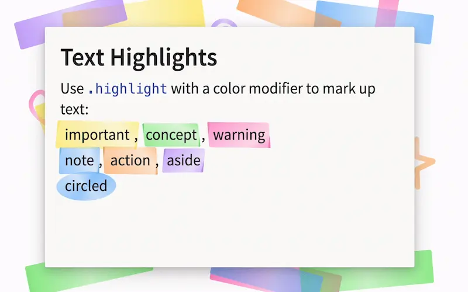{fig-alt="Highlighter theme" loading="lazy"}](https://github.com/EmilHvitfeldt/quarto-revealjs-highlighter-theme)

**[Highlighter](https://github.com/EmilHvitfeldt/quarto-revealjs-highlighter-theme)**
:::

::: {.slidecraft-card}
[{fig-alt="Cinco de Mayo theme" loading="lazy"}](https://github.com/EmilHvitfeldt/quarto-revealjs-cinco-de-mayo)

**[Cinco de Mayo](https://github.com/EmilHvitfeldt/quarto-revealjs-cinco-de-mayo)**
:::

::: {.slidecraft-card}
[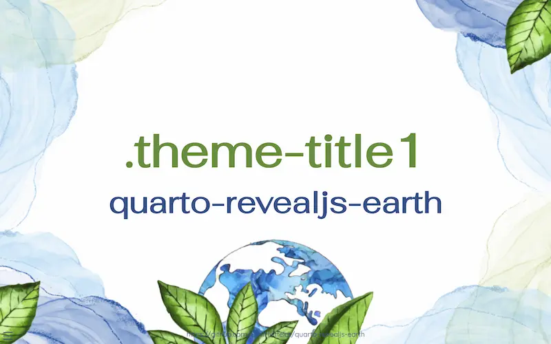{fig-alt="Watercolor earth theme" loading="lazy"}](https://github.com/EmilHvitfeldt/quarto-revealjs-earth)

**[Watercolor Earth](https://github.com/EmilHvitfeldt/quarto-revealjs-earth)**
:::

::: {.slidecraft-card}
[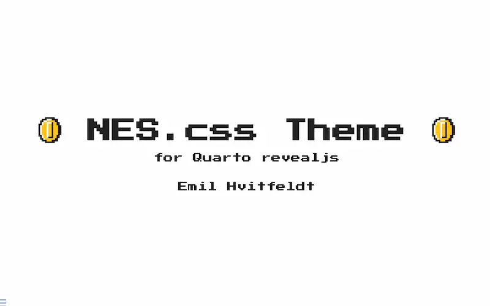{fig-alt="NES.css theme" loading="lazy"}](https://github.com/EmilHvitfeldt/quarto-nes-theme)

**[NES.css](https://github.com/EmilHvitfeldt/quarto-nes-theme)**
:::

::: {.slidecraft-card}
[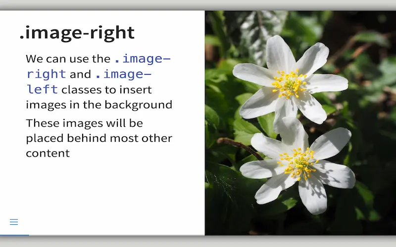{fig-alt="Letterbox theme" loading="lazy"}](https://github.com/EmilHvitfeldt/quarto-revealjs-letterbox)

**[Letterbox](https://github.com/EmilHvitfeldt/quarto-revealjs-letterbox)**
:::

::: {.slidecraft-card}
[{fig-alt="Inverse theme" loading="lazy"}](https://github.com/EmilHvitfeldt/quarto-revealjs-inverse)

**[Inverse](https://github.com/EmilHvitfeldt/quarto-revealjs-inverse)**
:::

::: {.slidecraft-card}
[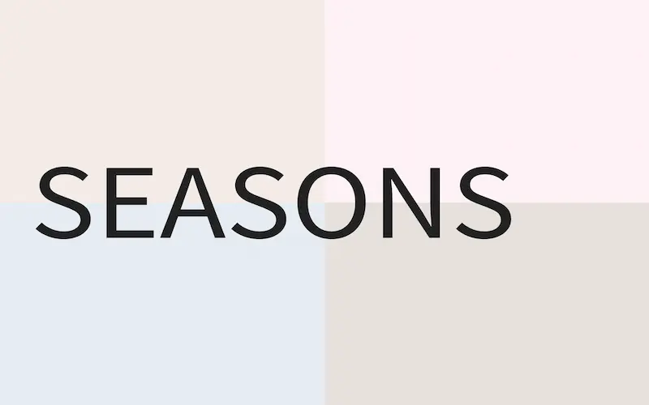{fig-alt="Seasons theme" loading="lazy"}](https://github.com/EmilHvitfeldt/quarto-revealjs-seasons)

**[Seasons](https://github.com/EmilHvitfeldt/quarto-revealjs-seasons)**
:::

::: {.slidecraft-card}
[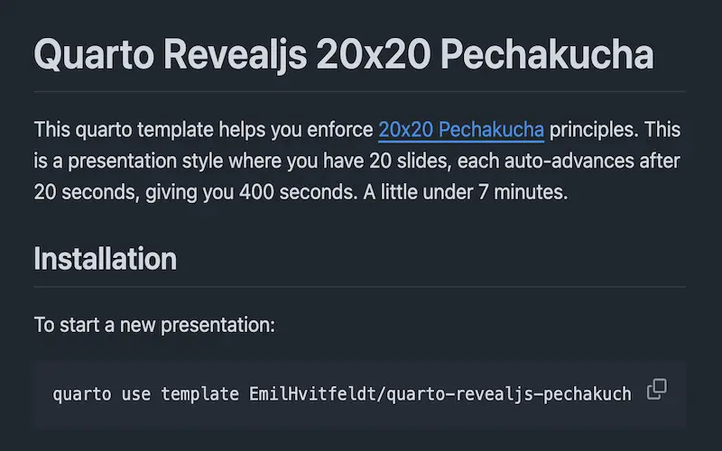{fig-alt="Pecha Kucha theme" loading="lazy"}](https://github.com/EmilHvitfeldt/quarto-revealjs-pechakucha)

**[Pecha Kucha](https://github.com/EmilHvitfeldt/quarto-revealjs-pechakucha)**
:::

::: {.slidecraft-card}
[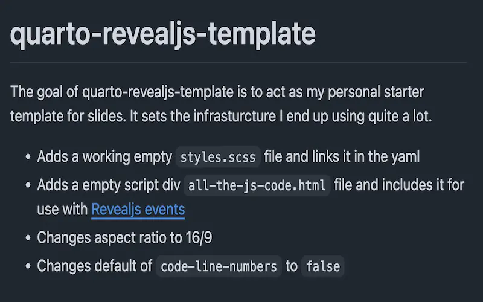{fig-alt="Starter template" loading="lazy"}](https://github.com/EmilHvitfeldt/quarto-revealjs-template)

**[Starter Template](https://github.com/EmilHvitfeldt/quarto-revealjs-template)**
:::

:::

## Quarto Extensions

::: {.slidecraft-grid}

::: {.slidecraft-card}
[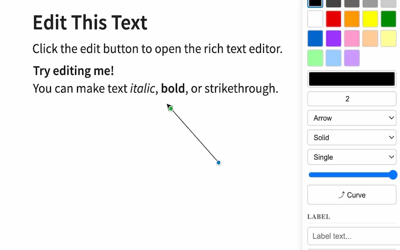{fig-alt="Editable extension" loading="lazy"}](https://github.com/EmilHvitfeldt/quarto-revealjs-editable)

**[Editable](https://github.com/EmilHvitfeldt/quarto-revealjs-editable)**
:::

::: {.slidecraft-card}
[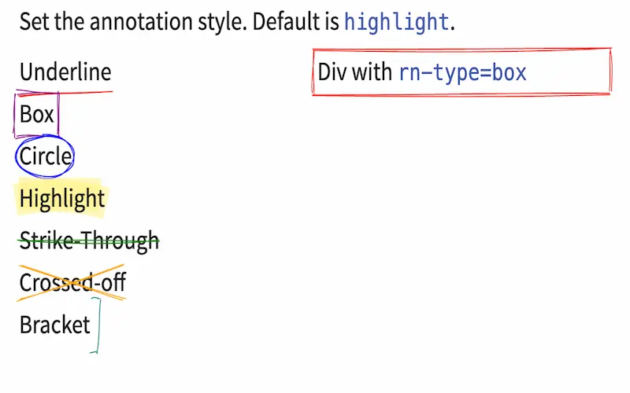{fig-alt="Rough Notation extension" loading="lazy"}](https://github.com/EmilHvitfeldt/quarto-roughnotation)

**[Rough Notation](https://github.com/EmilHvitfeldt/quarto-roughnotation)**
:::

::: {.slidecraft-card}
[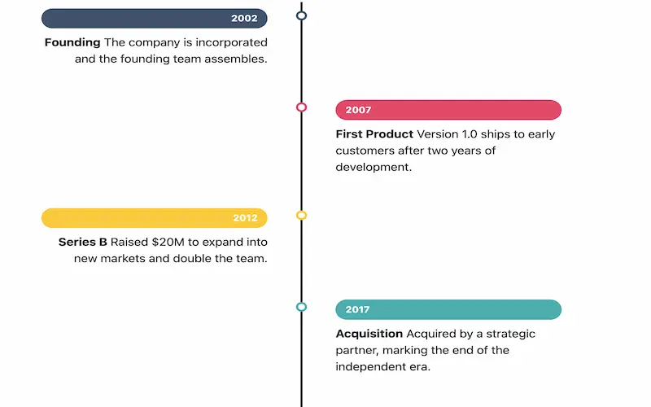{fig-alt="Timeline extension" loading="lazy"}](https://github.com/EmilHvitfeldt/quarto-timeline)

**[Timeline](https://github.com/EmilHvitfeldt/quarto-timeline)**
:::

::: {.slidecraft-card}
[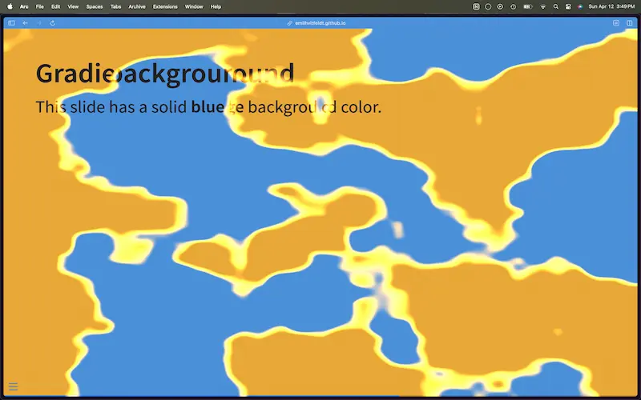{fig-alt="Transitions extension" loading="lazy"}](https://github.com/EmilHvitfeldt/quarto-revealjs-transitions)

**[Transitions](https://github.com/EmilHvitfeldt/quarto-revealjs-transitions)**
:::

::: {.slidecraft-card}
[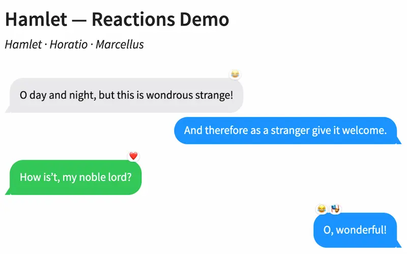{fig-alt="Chat Bubbles extension" loading="lazy"}](https://github.com/EmilHvitfeldt/quarto-revealjs-chat-bubbles)

**[Chat Bubbles](https://github.com/EmilHvitfeldt/quarto-revealjs-chat-bubbles)**
:::

::: {.slidecraft-card}
[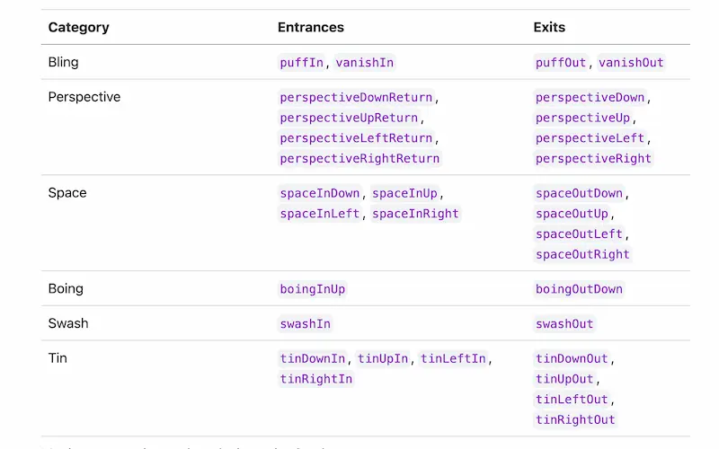{fig-alt="More Fragments extension" loading="lazy"}](https://github.com/EmilHvitfeldt/quarto-revealjs-more-fragments)

**[More Fragments](https://github.com/EmilHvitfeldt/quarto-revealjs-more-fragments)**
:::

::: {.slidecraft-card}
[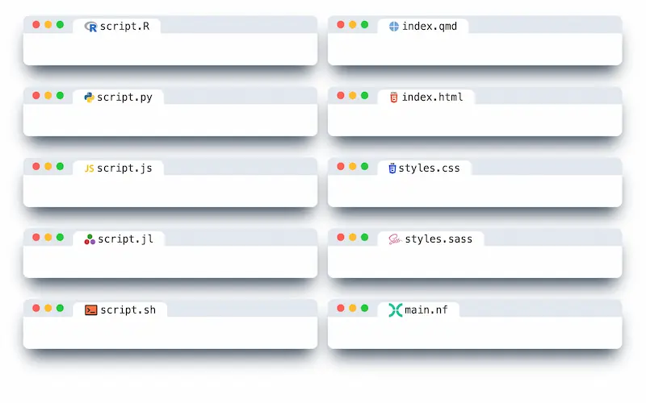{fig-alt="Code Window extension" loading="lazy"}](https://github.com/EmilHvitfeldt/quarto-revealjs-codewindow)

**[Code Window](https://github.com/EmilHvitfeldt/quarto-revealjs-codewindow)**
:::

::: {.slidecraft-card}
[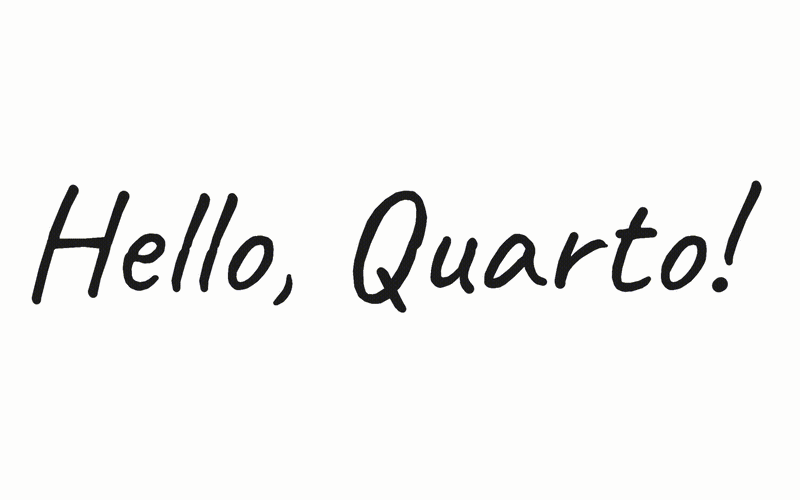{fig-alt="Tegaki extension" loading="lazy"}](https://github.com/EmilHvitfeldt/quarto-tegaki)

**[Tegaki](https://github.com/EmilHvitfeldt/quarto-tegaki)**
:::

::: {.slidecraft-card}
[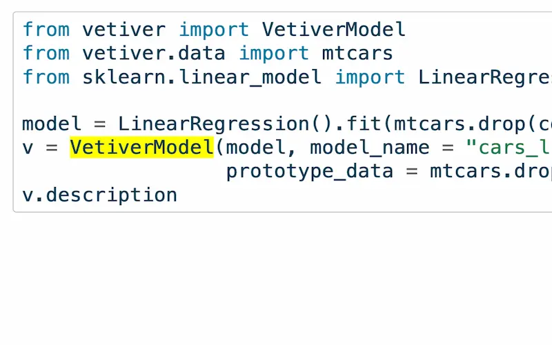{fig-alt="Highlight Word extension" loading="lazy"}](https://github.com/EmilHvitfeldt/quarto-revealjs-highlightword)

**[Highlight Word](https://github.com/EmilHvitfeldt/quarto-revealjs-highlightword)**
:::

::: {.slidecraft-card}
[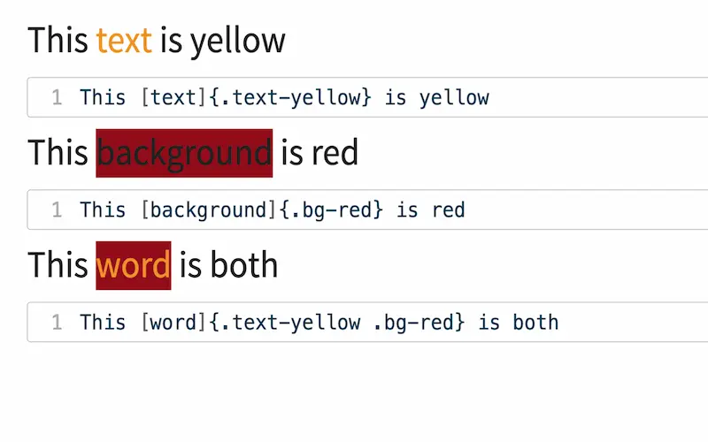{fig-alt="Color Classes extension" loading="lazy"}](https://github.com/EmilHvitfeldt/quarto-color-classes)

**[Color Classes](https://github.com/EmilHvitfeldt/quarto-color-classes)**
:::

::: {.slidecraft-card}
[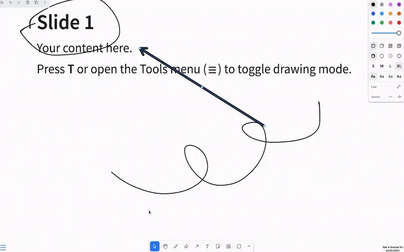{fig-alt="tldraw extension" loading="lazy"}](https://github.com/EmilHvitfeldt/quarto-revealjs-tldraw)

**[tldraw](https://github.com/EmilHvitfeldt/quarto-revealjs-tldraw)**
:::

::: {.slidecraft-card}
[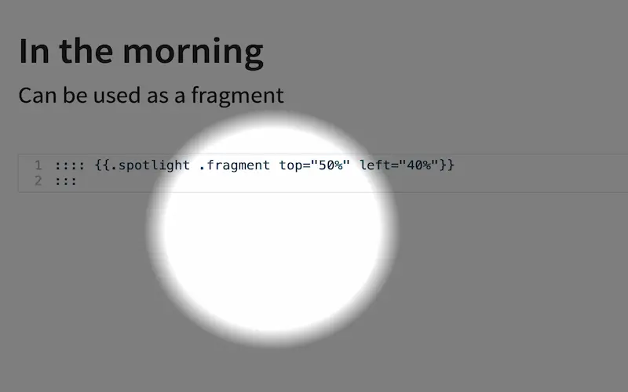{fig-alt="Spotlight extension" loading="lazy"}](https://github.com/EmilHvitfeldt/quarto-revealjs-spotlight)

**[Spotlight](https://github.com/EmilHvitfeldt/quarto-revealjs-spotlight)**
:::

::: {.slidecraft-card}
[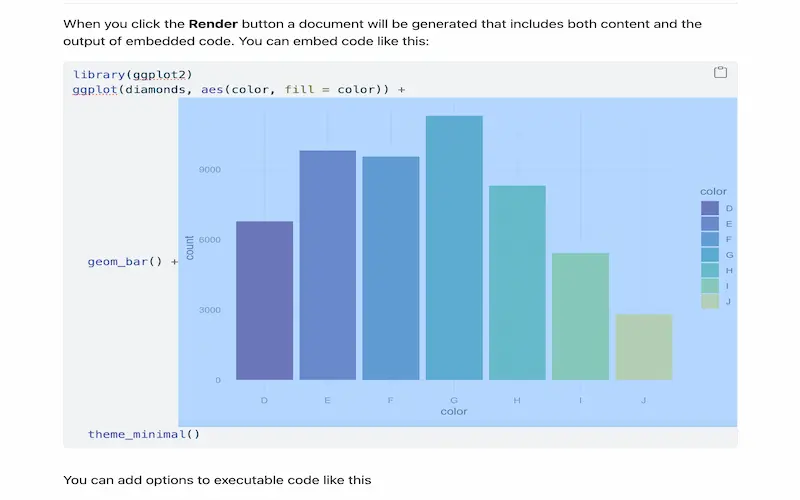{fig-alt="Design Mode extension" loading="lazy"}](https://github.com/EmilHvitfeldt/quarto-designmode)

**[Design Mode](https://github.com/EmilHvitfeldt/quarto-designmode)**
:::

::: {.slidecraft-card}
[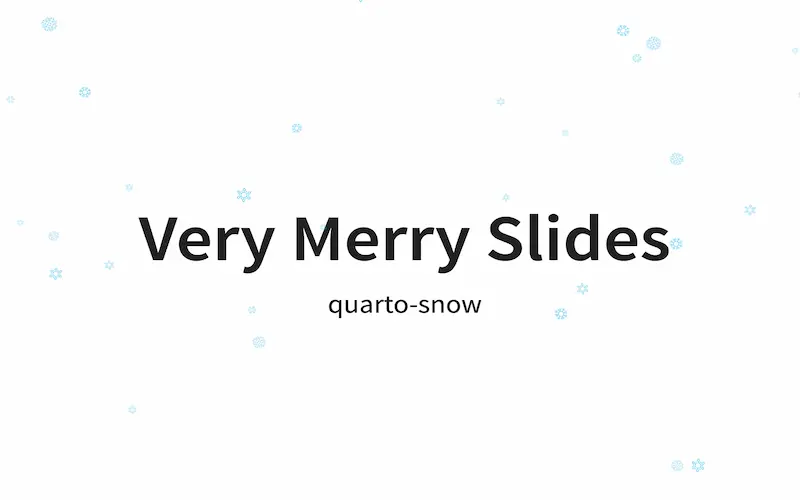{fig-alt="Snow extension" loading="lazy"}](https://github.com/EmilHvitfeldt/quarto-snow)

**[Snow](https://github.com/EmilHvitfeldt/quarto-snow)**
:::

::: {.slidecraft-card}
[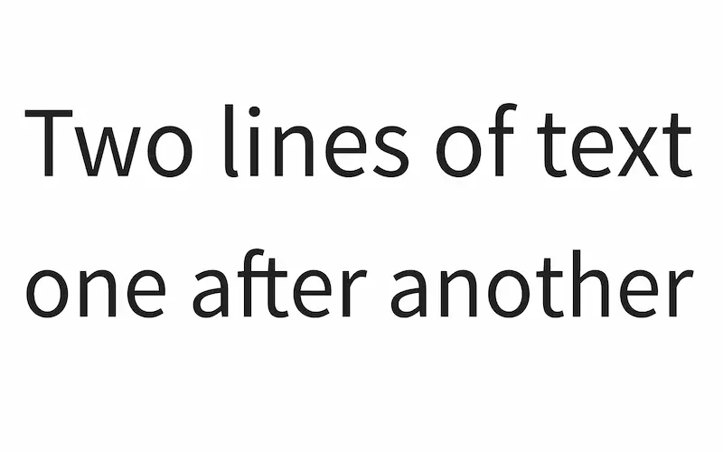{fig-alt="Loud extension" loading="lazy"}](https://github.com/EmilHvitfeldt/quarto-revealjs-loud)

**[Loud](https://github.com/EmilHvitfeldt/quarto-revealjs-loud)**
:::

:::

## Talks about slidecrafting / quarto theming

Here is a selection of talks where I talk about slidecrafting or quarto theming in general. It doesn't include ALL talks as there is some overlap between the talks I have given. See [talks page](../../talks.qmd) for all my past talks.

[Branded Quarto](../../talk/2024-06-05-branded-quarto/index.md)

<iframe class="slide-deck" title="Branded Quarto slides" src="https://emilhvitfeldt.github.io/talk-branded-quarto/" loading="lazy"></iframe>

[Slidecraft with quarto](../../talk/2023-11-27-slc-slidecraft/index.md)

<iframe class="slide-deck" title="Slidecraft with Quarto slides" src="https://emilhvitfeldt.github.io/talk-slc-slidecraft/" loading="lazy"></iframe>

[Styling and Templating Quarto Documents](../../talk/2023-09-19-quarto-theming-positconf/index.md)

<iframe class="slide-deck" title="Styling and Templating Quarto Documents slides" src="https://emilhvitfeldt.github.io/talk-quarto-theming-positconf/" loading="lazy"></iframe>

[Slidecraft - the art of creating pretty presentations](../../talk/2023-07-13-nyr-slidecraft/index.md)

<iframe class="slide-deck" title="Slidecraft - the art of creating pretty presentations slides" src="https://emilhvitfeldt.github.io/talk-nyr-slidecraft/" loading="lazy"></iframe>

## Other

- [iFrame Examples](https://github.com/EmilHvitfeldt/quarto-iframe-examples)
